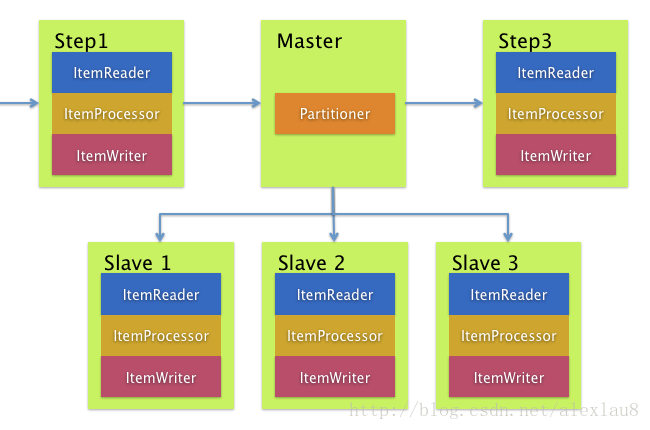
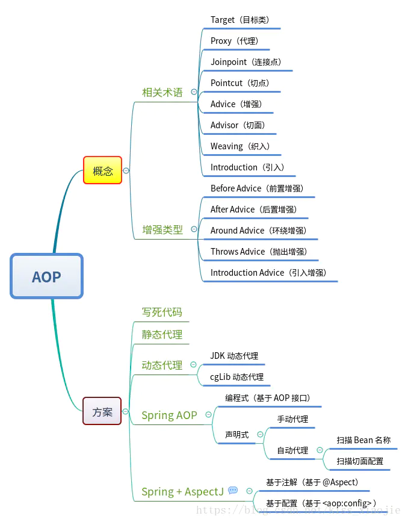
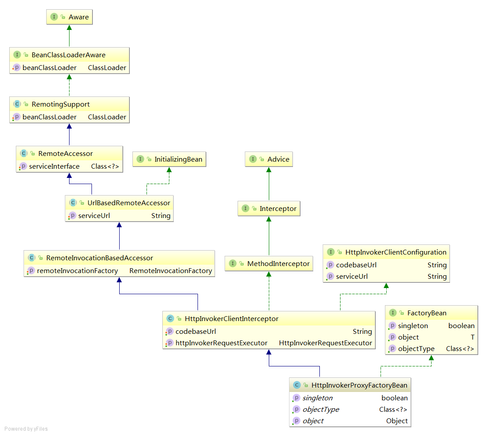

# Spring Batch(3.0.x)

[入门文档](https://mrbird.cc/Spring-Batch入门.html)

[详细文档](https://www.docs4dev.com/docs/zh/spring-batch/3.0.x/reference/spring-batch-intro.html)


## 概览

### 使用场景

#### Business Scenarios
+ 定期提交批处理
+ 并行批处理：作业的并行处理
+ 分阶段的企业消息驱动的处理
+ 大规模并行批处理
+ 失败后手动或计划重启
+ Sequences 处理相关步骤(扩展了工作流程驱动的批次)
+ 部分处理：跳过记录(例如回滚)
+ 整批事务：适用于小批量或现有存储过程/脚本的情况

#### Technical Objectives
+ 批处理开发人员使用 Spring 编程模型：专注于业务逻辑；让框架照顾基础架构。
+ 在基础结构，批处理执行环境和批处理应用程序之间明确分离关注点。
+ 提供通用的核心执行服务作为所有 Item 都可以实现的接口。
+ 提供可以直接使用的核心执行接口的简单和默认实现。
+ 通过在所有层中利用 spring 框架，轻松配置，定制和扩展服务。
+ 所有现有的核心服务应易于替换或扩展，而不会影响基础架构层。
+ 提供一个简单的部署模型，其架构 JAR 与使用 Maven 构建的应用程序完全分开。

### 体系结构


### 策略

#### 并行处理
+ 乐观锁
#### 分区

+ 哈希等方式进行分区


## 一些升级(相对于现在的4.0已经过时)

### JSR-352 支持
### 将 Spring Batch 集成到 Spring Batch
### 支持 Spring 4 和 Java 8
### JobScope 支持
### SQLite 支持


## 基于xml的一些驱动规范(域语言)

### Job

批处理的过程实体 也是步骤的容器


```xml
<job id="footballJob">
    <step id="playerload" next="gameLoad"/>
    <step id="gameLoad" next="playerSummarization"/>
    <step id="playerSummarization"/>
</job>
```

#### JobInstance
作业运行实例 如果失败可能会回滚
每一个实例是一个单例

#### JobParameters
作业的参数

#### JobExecution
真正的执行流程
失败时会销毁原对象生成新的Execution对象

### Step

#### ExecutionContext

执行时的上下文环境 ( 键/值对的集合 )
以便允许开发人员放置一个存储范围为StepExecution或JobExecution的持久状态
利用 ExecutionContext 可以断点续传

```java
if (executionContext.containsKey(getKey(LINES_READ_COUNT))) {
    log.debug("Initializing for restart. Restart data is: " + executionContext);

    long lineCount = executionContext.getLong(getKey(LINES_READ_COUNT));

    LineReader reader = getReader();

    Object record = "";
    while (reader.getPosition() < lineCount && record != null) {
        record = readLine();
    }
}
```

#### JobRepository
为Job本身做了一个备忘录

#### JobLauncher
启动入口

#### ItemReader
一次检索Step的 Importing

#### ItemProcessor
提供访问权以进行转换或应用其他业务处理

#### ItemWriter
一次Step，一个批次或大块 Item 的输出

#### 命名空间
```xml
<beans:beans xmlns="http://www.springframework.org/schema/batch"
     xmlns:beans="http://www.springframework.org/schema/beans"
     xmlns:xsi="http://www.w3.org/2001/XMLSchema-instance"
     xsi:schemaLocation="
           http://www.springframework.org/schema/beans
           http://www.springframework.org/schema/beans/spring-beans.xsd
           http://www.springframework.org/schema/batch
           http://www.springframework.org/schema/batch/spring-batch-2.2.xsd">

    <job id="ioSampleJob">
        <step id="step1">
            <tasklet>
                <chunk reader="itemReader" writer="itemWriter" commit-interval="2"/>
            </tasklet>
        </step>
    </job>
</beans:beans>
```

## 配置和运行作业


### 配置作业

```xml
<job id="footballJob" job-repository="specialRepository">
    <step id="playerload"          parent="s1" next="gameLoad"/>
    <step id="gameLoad"            parent="s3" next="playerSummarization"/>
    <step id="playerSummarization" parent="s3"/>
</job>
```

#### Restartability

重启标志位

```xml
<job id="footballJob" restartable="false">
    ...
</job>
```

等同于

```java
Job job = new SimpleJob();
job.setRestartable(false);

JobParameters jobParameters = new JobParameters();

JobExecution firstExecution = jobRepository.createJobExecution(job, jobParameters);
jobRepository.saveOrUpdate(firstExecution);

try {
    jobRepository.createJobExecution(job, jobParameters);
    fail();
}
catch (JobRestartException e) {
    // expected
}
```

#### 拦截作业执行

生命周期的某一阶段中需要插入某个事件时会很有用

```java
public interface JobExecutionListener {

    void beforeJob(JobExecution jobExecution);

    void afterJob(JobExecution jobExecution);

}
```

配置示例

```xml
<job id="footballJob">
    <step id="playerload"          parent="s1" next="gameLoad"/>
    <step id="gameLoad"            parent="s2" next="playerSummarization"/>
    <step id="playerSummarization" parent="s3"/>
    <listeners>
        <listener ref="sampleListener"/>
    </listeners>
</job>
```

#### 从父作业继承

```xml
<job id="baseJob" abstract="true">
    <listeners>
        <listener ref="listenerOne"/>
    <listeners>
</job>

<job id="job1" parent="baseJob">
    <step id="step1" parent="standaloneStep"/>

    <listeners merge="true">
        <listener ref="listenerTwo"/>
    <listeners>
</job>
```

#### JobParametersValidator

参数的一些约束

```xml
<job id="job1" parent="baseJob3">
    <step id="step1" parent="standaloneStep"/>
    <validator ref="paremetersValidator"/>
</job>
```

### 用 Java 配置批处理
通过JobBuilderFactory和StepBuilderFactory配置的两步作业
```java
@Configuration
@EnableBatchProcessing
@Import(DataSourceConfiguration.class)
public class AppConfig {

    @Autowired
    private JobBuilderFactory jobs;

    @Autowired
    private StepBuilderFactory steps;

    @Bean
    public Job job(@Qualifier("step1") Step step1, @Qualifier("step2") Step step2) {
        return jobs.get("myJob").start(step1).next(step2).build();
    }

    @Bean
    protected Step step1(ItemReader<Person> reader, ItemProcessor<Person, Person> processor, ItemWriter<Person> writer) {
        return steps.get("step1")
            .<Person, Person> chunk(10)
            .reader(reader)
            .processor(processor)
            .writer(writer)
            .build();
    }

    @Bean
    protected Step step2(Tasklet tasklet) {
        return steps.get("step2")
            .tasklet(tasklet)
            .build();
    }
}
```

### 配置 JobRepository
JobRepository 用于 Spring Batch 中各种持久化域对象
```xml
<job-repository id="jobRepository"
    data-source="dataSource"
    transaction-manager="transactionManager"
    isolation-level-for-create="SERIALIZABLE"
    table-prefix="BATCH_"
    max-varchar-length="1000"/>
```

#### 事务配置
重写
```xml
<job-repository id="jobRepository"
                isolation-level-for-create="REPEATABLE_READ" />
```
AOP事务
```xml
<aop:config>
    <aop:advisor
           pointcut="execution(* org.springframework.batch.core..*Repository+.*(..))"/>
    <advice-ref="txAdvice" />
</aop:config>

<tx:advice id="txAdvice" transaction-manager="transactionManager">
    <tx:attributes>
        <tx:method name="*" />
    </tx:attributes>
</tx:advice>
```

#### 修改表前缀
```xml
<job-repository id="jobRepository"
                table-prefix="SYSTEM.TEST_" />
```

#### 内存中的存储库
```xml
<bean id="jobRepository"
  class="org.springframework.batch.core.repository.support.MapJobRepositoryFactoryBean">
    <property name="transactionManager" ref="transactionManager"/>
</bean>
```

#### 非标准数据库类型
```xml
<bean id="jobRepository" class="org...JobRepositoryFactoryBean">
    <property name="databaseType" value="db2"/>
    <property name="dataSource" ref="dataSource"/>
</bean>
```

### 配置 JobLauncher
```xml
<bean id="jobLauncher"
      class="org.springframework.batch.core.launch.support.SimpleJobLauncher">
    <property name="jobRepository" ref="jobRepository" />
</bean>
```
同步时序图


异步时序图


```xml
<bean id="jobLauncher"
      class="org.springframework.batch.core.launch.support.SimpleJobLauncher">
    <property name="jobRepository" ref="jobRepository" />
    <property name="taskExecutor">
        <bean class="org.springframework.core.task.SimpleAsyncTaskExecutor" />
    </property>
</bean>
```

### 运行作业
#### 命令行运行
```bash
java CommandLineJobRunner endOfDayJob.xml endOfDay schedule.date(date)=2007/05/05
```
```xml
<job id="endOfDay">
    <step id="step1" parent="simpleStep" />
</job>

<!-- Launcher details removed for clarity -->
<beans:bean id="jobLauncher"
         class="org.springframework.batch.core.launch.support.SimpleJobLauncher" />

```
#### ExitCodes
错误码
```java
public interface ExitCodeMapper {

    public int intValue(String exitCode);

}
```

#### web 容器中运行
时序图


```java
@Controller
public class JobLauncherController {

    @Autowired
    JobLauncher jobLauncher;

    @Autowired
    Job job;

    @RequestMapping("/jobLauncher.html")
    public void handle() throws Exception{
        jobLauncher.run(job, new JobParameters());
    }
}
```

### 元数据使用
结构图


#### 查询存储库
将Job列表本身存放在库中管理
```java
public interface JobExplorer {

    List<JobInstance> getJobInstances(String jobName, int start, int count);

    JobExecution getJobExecution(Long executionId);

    StepExecution getStepExecution(Long jobExecutionId, Long stepExecutionId);

    JobInstance getJobInstance(Long instanceId);

    List<JobExecution> getJobExecutions(JobInstance jobInstance);

    Set<JobExecution> findRunningJobExecutions(String jobName);
}
```
```xml
<bean id="jobExplorer" class="org.spr...JobExplorerFactoryBean"
      p:dataSource-ref="dataSource" p:tablePrefix="BATCH_" />
```

#### JobRegistry
作业注册
+ JobRegistryBeanPostProcessor
    ```xml
    <bean id="jobRegistryBeanPostProcessor" class="org.spr...JobRegistryBeanPostProcessor">
        <property name="jobRegistry" ref="jobRegistry"/>
    </bean>
    ```
+ AutomaticJobRegistrar
    ```xml
    <bean class="org.spr...AutomaticJobRegistrar">
       <property name="applicationContextFactories">
          <bean class="org.spr...ClasspathXmlApplicationContextsFactoryBean">
             <property name="resources" value="classpath*:/config/job*.xml" />
          </bean>
       </property>
       <property name="jobLoader">
          <bean class="org.spr...DefaultJobLoader">
             <property name="jobRegistry" ref="jobRegistry" />
          </bean>
       </property>
    </bean>
    ```

#### JobOperator
Job 本身的 CURD 操作
```java
public interface JobOperator {

    List<Long> getExecutions(long instanceId) throws NoSuchJobInstanceException;

    List<Long> getJobInstances(String jobName, int start, int count)
          throws NoSuchJobException;

    Set<Long> getRunningExecutions(String jobName) throws NoSuchJobException;

    String getParameters(long executionId) throws NoSuchJobExecutionException;

    Long start(String jobName, String parameters)
          throws NoSuchJobException, JobInstanceAlreadyExistsException;

    Long restart(long executionId)
          throws JobInstanceAlreadyCompleteException, NoSuchJobExecutionException,
                  NoSuchJobException, JobRestartException;

    Long startNextInstance(String jobName)
          throws NoSuchJobException, JobParametersNotFoundException, JobRestartException,
                 JobExecutionAlreadyRunningException, JobInstanceAlreadyCompleteException;

    boolean stop(long executionId)
          throws NoSuchJobExecutionException, JobExecutionNotRunningException;

    String getSummary(long executionId) throws NoSuchJobExecutionException;

    Map<Long, String> getStepExecutionSummaries(long executionId)
          throws NoSuchJobExecutionException;

    Set<String> getJobNames();

}
```

```xml
<bean id="jobOperator" class="org.spr...SimpleJobOperator">
    <property name="jobExplorer">
        <bean class="org.spr...JobExplorerFactoryBean">
            <property name="dataSource" ref="dataSource" />
        </bean>
    </property>
    <property name="jobRepository" ref="jobRepository" />
    <property name="jobRegistry" ref="jobRegistry" />
    <property name="jobLauncher" ref="jobLauncher" />
</bean>
```
#### JobParametersIncrementer
递增
```java
public class SampleIncrementer implements JobParametersIncrementer {

    public JobParameters getNext(JobParameters parameters) {
        if (parameters==null || parameters.isEmpty()) {
            return new JobParametersBuilder().addLong("run.id", 1L).toJobParameters();
        }
        long id = parameters.getLong("run.id",1L) + 1;
        return new JobParametersBuilder().addLong("run.id", id).toJobParameters();
    }
}
```
```xml
<job id="footballJob" incrementer="sampleIncrementer">
    ...
</job>
```

#### 停止作业
```java
Set<Long> executions = jobOperator.getRunningExecutions("sampleJob");
jobOperator.stop(executions.iterator().next());
```

#### 中止工作
框架不会重新启动状态为ABANDONED的作业执行


## 配置步骤


### 面向块的处理


```java
List items = new Arraylist();
for(int i = 0; i < commitInterval; i++){
    Object item = itemReader.read()
    Object processedItem = itemProcessor.process(item);
    items.add(processedItem);
}
itemWriter.write(items);
```

#### 配置步骤
```xml
<job id="sampleJob" job-repository="jobRepository">
    <step id="step1">
        <tasklet transaction-manager="transactionManager">
            <chunk reader="itemReader" writer="itemWriter" commit-interval="10"/>
        </tasklet>
    </step>
</job>
```

#### 从父步骤继承

```xml
<step id="parentStep">
    <tasklet allow-start-if-complete="true">
        <chunk reader="itemReader" writer="itemWriter" commit-interval="10"/>
    </tasklet>
</step>

<step id="concreteStep1" parent="parentStep">
    <tasklet start-limit="5">
        <chunk processor="itemProcessor" commit-interval="5"/>
    </tasklet>
</step>
```

+ Abstract Step

```xml
<step id="abstractParentStep" abstract="true">
    <tasklet>
        <chunk commit-interval="10"/>
    </tasklet>
</step>

<step id="concreteStep2" parent="abstractParentStep">
    <tasklet>
        <chunk reader="itemReader" writer="itemWriter"/>
    </tasklet>
</step>
```

+ Merging Lists

```xml
<step id="listenersParentStep" abstract="true">
    <listeners>
        <listener ref="listenerOne"/>
    <listeners>
</step>

<step id="concreteStep3" parent="listenersParentStep">
    <tasklet>
        <chunk reader="itemReader" writer="itemWriter" commit-interval="5"/>
    </tasklet>
    <listeners merge="true">
        <listener ref="listenerTwo"/>
    <listeners>
</step>
```

#### 提交间隔
表示多少个 Item 块进行一次提交
```xml
<job id="sampleJob">
    <step id="step1">
        <tasklet>
            <chunk reader="itemReader" writer="itemWriter" commit-interval="10"/>
        </tasklet>
    </step>
</job>
```

#### 配置重新启动步骤

+ StartLimit
对step进行限制
```xml
<step id="step1">
    <tasklet start-limit="1">
        <chunk reader="itemReader" writer="itemWriter" commit-interval="10"/>
    </tasklet>
</step>
```

+ 重新开始完成的步骤
始终运行该步骤(真的不要紧吗?)

```xml
step id="step1">
    <tasklet allow-start-if-complete="true">
        <chunk reader="itemReader" writer="itemWriter" commit-interval="10"/>
    </tasklet>
</step>
```

+ 步骤重新启动

```xml
<job id="footballJob" restartable="true">
    <step id="playerload" next="gameLoad">
        <tasklet>
            <chunk reader="playerFileItemReader" writer="playerWriter"
                   commit-interval="10" />
        </tasklet>
    </step>
    <step id="gameLoad" next="playerSummarization">
        <tasklet allow-start-if-complete="true">
            <chunk reader="gameFileItemReader" writer="gameWriter"
                   commit-interval="10"/>
        </tasklet>
    </step>
    <step id="playerSummarization">
        <tasklet start-limit="3">
            <chunk reader="playerSummarizationSource" writer="summaryWriter"
                   commit-interval="10"/>
        </tasklet>
    </step>
</job>
```

#### 配置跳过逻辑

```xml
<step id="step1">
    <tasklet>
        <chunk reader="flatFileItemReader" writer="itemWriter"
               commit-interval="10" skip-limit="10">
            <skippable-exception-classes>
                <include class="java.lang.Exception"/>
                <exclude class="java.io.FileNotFoundException"/>
            </skippable-exception-classes>
        </chunk>
    </tasklet>
</step>
```

#### 配置重试逻辑

```xml
<step id="step1">
   <tasklet>
      <chunk reader="itemReader" writer="itemWriter"
             commit-interval="2" retry-limit="3">
         <retryable-exception-classes>
            <include class="org.springframework.dao.DeadlockLoserDataAccessException"/>
         </retryable-exception-classes>
      </chunk>
   </tasklet>
</step>
```

#### 控制回滚

```xml
<step id="step1">
   <tasklet>
      <chunk reader="itemReader" writer="itemWriter" commit-interval="2"/>
      <no-rollback-exception-classes>
         <include class="org.springframework.batch.item.validator.ValidationException"/>
      </no-rollback-exception-classes>
   </tasklet>
</step>
```

+ Transactional Readers

```xml
<step id="step1">
    <tasklet>
        <chunk reader="itemReader" writer="itemWriter" commit-interval="2"
               is-reader-transactional-queue="true"/>
    </tasklet>
</step>
```

#### 事务属性

```xml
<step id="step1">
    <tasklet>
        <chunk reader="itemReader" writer="itemWriter" commit-interval="2"/>
        <transaction-attributes isolation="DEFAULT"
                                propagation="REQUIRED"
                                timeout="30"/>
    </tasklet>
</step>
```

#### 在步骤中注册 ItemStreams

```xml
<step id="step1">
    <tasklet>
        <chunk reader="itemReader" writer="compositeWriter" commit-interval="2">
            <streams>
                <stream ref="fileItemWriter1"/>
                <stream ref="fileItemWriter2"/>
            </streams>
        </chunk>
    </tasklet>
</step>

<beans:bean id="compositeWriter"
            class="org.springframework.batch.item.support.CompositeItemWriter">
    <beans:property name="delegates">
        <beans:list>
            <beans:ref bean="fileItemWriter1" />
            <beans:ref bean="fileItemWriter2" />
        </beans:list>
    </beans:property>
</beans:bean>
```

#### 拦截步骤执行

```xml
<step id="step1">
    <tasklet>
        <chunk reader="reader" writer="writer" commit-interval="10"/>
        <listeners>
            <listener ref="chunkListener"/>
        </listeners>
    </tasklet>
</step>
```

+ StepExecutionListener

```java
public interface StepExecutionListener extends StepListener {

    void beforeStep(StepExecution stepExecution);

    ExitStatus afterStep(StepExecution stepExecution);

}
```

+ ChunkListener

```java
public interface ChunkListener extends StepListener {

    void beforeChunk();
    void afterChunk();

}
```

+ ItemReadListener

```java
public interface ItemReadListener<T> extends StepListener {

    void beforeRead();
    void afterRead(T item);
    void onReadError(Exception ex);

}
```

+ ItemProcessListener

```java
public interface ItemProcessListener<T, S> extends StepListener {

    void beforeProcess(T item);
    void afterProcess(T item, S result);
    void onProcessError(T item, Exception e);

}
```

+ ItemWriteListener

```java
public interface ItemWriteListener<S> extends StepListener {

    void beforeWrite(List<? extends S> items);
    void afterWrite(List<? extends S> items);
    void onWriteError(Exception exception, List<? extends S> items);

}
```

+ SkipListener

```java
public interface SkipListener<T,S> extends StepListener {

    void onSkipInRead(Throwable t);
    void onSkipInProcess(T item, Throwable t);
    void onSkipInWrite(S item, Throwable t);

}
```

### TaskletStep

软中断续运行步骤

```xml
<step id="step1">
    <tasklet ref="myTasklet"/>
</step>
```

#### TaskletAdapter

软中断适配器

```xml
<bean id="myTasklet" class="o.s.b.core.step.tasklet.MethodInvokingTaskletAdapter">
    <property name="targetObject">
        <bean class="org.mycompany.FooDao"/>
    </property>
    <property name="targetMethod" value="updateFoo" />
</bean>
```

#### Tasklet 实现示例

```java
public class FileDeletingTasklet implements Tasklet, InitializingBean {

    private Resource directory;

    public RepeatStatus execute(StepContribution contribution,
                                ChunkContext chunkContext) throws Exception {
        File dir = directory.getFile();
        Assert.state(dir.isDirectory());

        File[] files = dir.listFiles();
        for (int i = 0; i < files.length; i++) {
            boolean deleted = files[i].delete();
            if (!deleted) {
                throw new UnexpectedJobExecutionException("Could not delete file " +
                                                          files[i].getPath());
            }
        }
        return RepeatStatus.FINISHED;
    }

    public void setDirectoryResource(Resource directory) {
        this.directory = directory;
    }

    public void afterPropertiesSet() throws Exception {
        Assert.notNull(directory, "directory must be set");
    }
}
```

```xml
<job id="taskletJob">
    <step id="deleteFilesInDir">
       <tasklet ref="fileDeletingTasklet"/>
    </step>
</job>

<beans:bean id="fileDeletingTasklet"
            class="org.springframework.batch.sample.tasklet.FileDeletingTasklet">
    <beans:property name="directoryResource">
        <beans:bean id="directory"
                    class="org.springframework.core.io.FileSystemResource">
            <beans:constructor-arg value="target/test-outputs/test-dir" />
        </beans:bean>
    </beans:property>
</beans:bean>
```

### 控制步骤流程

#### Sequences 流


```xml
<job id="job">
    <step id="stepA" parent="s1" next="stepB" />
    <step id="stepB" parent="s2" next="stepC"/>
    <step id="stepC" parent="s3" />
</job>
```

#### 条件流


```xml
<job id="job">
    <step id="stepA" parent="s1">
        <next on="*" to="stepB" />
        <next on="FAILED" to="stepC" />
    </step>
    <step id="stepB" parent="s2" next="stepC" />
    <step id="stepC" parent="s3" />
</job>
```

+ 另一个例子

```xml
<step id="step1" parent="s1">
    <end on="FAILED" />
    <next on="COMPLETED WITH SKIPS" to="errorPrint1" />
    <next on="*" to="step2" />
</step>
```

```java
public class SkipCheckingListener extends StepExecutionListenerSupport {
    public ExitStatus afterStep(StepExecution stepExecution) {
        String exitCode = stepExecution.getExitStatus().getExitCode();
        if (!exitCode.equals(ExitStatus.FAILED.getExitCode()) &&
              stepExecution.getSkipCount() > 0) {
            return new ExitStatus("COMPLETED WITH SKIPS");
        }
        else {
            return null;
        }
    }
}
```

#### 配置停止

+ "结束"元素

```xml
<step id="step1" parent="s1" next="step2">

<step id="step2" parent="s2">
    <end on="FAILED"/>
    <next on="*" to="step3"/>
</step>

<step id="step3" parent="s3">
```

+ "失败"元素

```xml
<step id="step1" parent="s1" next="step2">

<step id="step2" parent="s2">
    <fail on="FAILED" exit-code="EARLY TERMINATION"/>
    <next on="*" to="step3"/>
</step>

<step id="step3" parent="s3">
```

+ "停止"元素

```xml
<step id="step1" parent="s1">
    <stop on="COMPLETED" restart="step2"/>
</step>

<step id="step2" parent="s2"/>
```

#### 程序流程决策

```java
public class MyDecider implements JobExecutionDecider {
    public FlowExecutionStatus decide(JobExecution jobExecution, StepExecution stepExecution) {
        if (someCondition) {
            return "FAILED";
        }
        else {
            return "COMPLETED";
        }
    }
}
```

```xml
<job id="job">
    <step id="step1" parent="s1" next="decision" />

    <decision id="decision" decider="decider">
        <next on="FAILED" to="step2" />
        <next on="COMPLETED" to="step3" />
    </decision>

    <step id="step2" parent="s2" next="step3"/>
    <step id="step3" parent="s3" />
</job>

<beans:bean id="decider" class="com.MyDecider"/>
```

#### 分流

```xml
<split id="split1" next="step4">
    <flow>
        <step id="step1" parent="s1" next="step2"/>
        <step id="step2" parent="s2"/>
    </flow>
    <flow>
        <step id="step3" parent="s3"/>
    </flow>
</split>
<step id="step4" parent="s4"/>
```

#### 外部化作业之间的流程定义和依赖性

```xml
<job id="job">
    <flow id="job1.flow1" parent="flow1" next="step3"/>
    <step id="step3" parent="s3"/>
</job>

<flow id="flow1">
    <step id="step1" parent="s1" next="step2"/>
    <step id="step2" parent="s2"/>
</flow>
```

```xml
<job id="jobStepJob" restartable="true">
   <step id="jobStepJob.step1">
      <job ref="job" job-launcher="jobLauncher"
          job-parameters-extractor="jobParametersExtractor"/>
   </step>
</job>

<job id="job" restartable="true">...</job>

<bean id="jobParametersExtractor" class="org.spr...DefaultJobParametersExtractor">
   <property name="keys" value="input.file"/>
</bean>
```


### 作业和步骤属性的后期绑定

```xml
<bean id="flatFileItemReader"
      class="org.springframework.batch.item.file.FlatFileItemReader">
    <property name="resource"
              value="file://outputs/20070122.testStream.CustomerReportStep.TEMP.txt" />
</bean>
```

#### 步骤范围

```xml
<bean id="flatFileItemReader" scope="step"
      class="org.springframework.batch.item.file.FlatFileItemReader">
    <property name="resource" value="#{jobParameters[input.file.name]}" />
</bean>

<beans xmlns="http://www.springframework.org/schema/beans"
       xmlns:batch="http://www.springframework.org/schema/batch"
       xmlns:xsi="http://www.w3.org/2001/XMLSchema-instance"
       xsi:schemaLocation="...">
<batch:job .../>
...
</beans>
```

#### 工作范围

```xml
<bean id="..." class="..." scope="job">
    <property name="name" value="#{jobParameters[input]}" />
</bean>

<beans xmlns="http://www.springframework.org/schema/beans"
       xmlns:batch="http://www.springframework.org/schema/batch"
       xmlns:xsi="http://www.w3.org/2001/XMLSchema-instance"
       xsi:schemaLocation="...">
 <batch:job .../>
 ...
 </beans>
```

## ItemReaders 和 ItemWriters

### ItemReader

```java
public interface ItemReader<T> {

    T read() throws Exception, UnexpectedInputException, ParseException;

}
```

### ItemWriter

```java
public interface ItemWriter<T> {

    void write(List<? extends T> items) throws Exception;

}
```

### ItemProcessor

```java
public class CompositeItemWriter<T> implements ItemWriter<T> {

    ItemWriter<T> itemWriter;

    public CompositeItemWriter(ItemWriter<T> itemWriter) {
        this.itemWriter = itemWriter;
    }

    public void write(List<? extends T> items) throws Exception {
        //Add business logic here
       itemWriter.write(item);
    }

    public void setDelegate(ItemWriter<T> itemWriter){
        this.itemWriter = itemWriter;
    }
}

public interface ItemProcessor<I, O> {

    O process(I item) throws Exception;
}
```

+ 另一个例子

```java
public class Foo {}

public class Bar {
    public Bar(Foo foo) {}
}

public class FooProcessor implements ItemProcessor<Foo,Bar>{
    public Bar process(Foo foo) throws Exception {
        //Perform simple transformation, convert a Foo to a Bar
        return new Bar(foo);
    }
}

public class BarWriter implements ItemWriter<Bar>{
    public void write(List<? extends Bar> bars) throws Exception {
        //write bars
    }
}
```

```xml
<job id="ioSampleJob">
    <step name="step1">
        <tasklet>
            <chunk reader="fooReader" processor="fooProcessor" writer="barWriter"
                   commit-interval="2"/>
        </tasklet>
    </step>
</job>
```

#### 链式 ItemProcessor

```java
public class Foo {}

public class Bar {
    public Bar(Foo foo) {}
}

public class Foobar{
    public Foobar(Bar bar) {}
}

public class FooProcessor implements ItemProcessor<Foo,Bar>{
    public Bar process(Foo foo) throws Exception {
        //Perform simple transformation, convert a Foo to a Bar
        return new Bar(foo);
    }
}

public class BarProcessor implements ItemProcessor<Bar,FooBar>{
    public FooBar process(Bar bar) throws Exception {
        return new Foobar(bar);
    }
}

public class FoobarWriter implements ItemWriter<FooBar>{
    public void write(List<? extends FooBar> items) throws Exception {
        //write items
    }
}


CompositeItemProcessor<Foo,Foobar> compositeProcessor =
                                      new CompositeItemProcessor<Foo,Foobar>();
List itemProcessors = new ArrayList();
itemProcessors.add(new FooTransformer());
itemProcessors.add(new BarTransformer());
compositeProcessor.setDelegates(itemProcessors);
```

```xml
<job id="ioSampleJob">
    <step name="step1">
        <tasklet>
            <chunk reader="fooReader" processor="compositeProcessor" writer="foobarWriter"
                   commit-interval="2"/>
        </tasklet>
    </step>
</job>

<bean id="compositeItemProcessor"
      class="org.springframework.batch.item.support.CompositeItemProcessor">
    <property name="delegates">
        <list>
            <bean class="..FooProcessor" />
            <bean class="..BarProcessor" />
        </list>
    </property>
</bean>
```

### ItemStream

```java
public interface ItemStream {

    void open(ExecutionContext executionContext) throws ItemStreamException;

    void update(ExecutionContext executionContext) throws ItemStreamException;

    void close() throws ItemStreamException;
}
```

### 委托模式和步骤注册

```xml
<job id="ioSampleJob">
    <step name="step1">
        <tasklet>
            <chunk reader="fooReader" processor="fooProcessor" writer="compositeItemWriter"
                   commit-interval="2">
                    <streams>
                        <stream ref="barWriter" />
                    </streams>
            </chunk>
        </tasklet>
    </step>
</job>

<bean id="compositeItemWriter" class="...CustomCompositeItemWriter">
    <property name="delegate" ref="barWriter" />
</bean>

<bean id="barWriter" class="...BarWriter" />
```

### 平面文件

#### FieldSet

```java
String[] tokens = new String[]{"foo", "1", "true"};
FieldSet fs = new DefaultFieldSet(tokens);
String name = fs.readString(0);
int value = fs.readInt(1);
boolean booleanValue = fs.readBoolean(2);
```

#### FlatFileItemReader

```java
Resource resource = new FileSystemResource("resources/trades.csv");
```

+ LineMapper

```java
public interface LineMapper<T> {

    T mapLine(String line, int lineNumber) throws Exception;

}
```

+ LineTokenizer

```java
public interface LineTokenizer {

    FieldSet tokenize(String line);

}
```

+ FieldSetMapper

```java
public interface FieldSetMapper<T> {

    T mapFieldSet(FieldSet fieldSet);

}
```

+ DefaultLineMapper

```java
public class DefaultLineMapper<T> implements LineMapper<T>, InitializingBean {

    private LineTokenizer tokenizer;

    private FieldSetMapper<T> fieldSetMapper;

    public T mapLine(String line, int lineNumber) throws Exception {
        return fieldSetMapper.mapFieldSet(tokenizer.tokenize(line));
    }

    public void setLineTokenizer(LineTokenizer tokenizer) {
        this.tokenizer = tokenizer;
    }

    public void setFieldSetMapper(FieldSetMapper<T> fieldSetMapper) {
        this.fieldSetMapper = fieldSetMapper;
    }
}
```

+ 示例
```csv
ID,lastName,firstName,position,birthYear,debutYear
"AbduKa00,Abdul-Jabbar,Karim,rb,1974,1996",
"AbduRa00,Abdullah,Rabih,rb,1975,1999",
"AberWa00,Abercrombie,Walter,rb,1959,1982",
"AbraDa00,Abramowicz,Danny,wr,1945,1967",
"AdamBo00,Adams,Bob,te,1946,1969",
"AdamCh00,Adams,Charlie,wr,1979,2003"
```

```java
public class Player implements Serializable {

    private String ID;
    private String lastName;
    private String firstName;
    private String position;
    private int birthYear;
    private int debutYear;

    public String toString() {
        return "PLAYER:ID=" + ID + ",Last Name=" + lastName +
            ",First Name=" + firstName + ",Position=" + position +
            ",Birth Year=" + birthYear + ",DebutYear=" +
            debutYear;
    }

    // setters and getters...
}

protected static class PlayerFieldSetMapper implements FieldSetMapper<Player> {
    public Player mapFieldSet(FieldSet fieldSet) {
        Player player = new Player();

        player.setID(fieldSet.readString(0));
        player.setLastName(fieldSet.readString(1));
        player.setFirstName(fieldSet.readString(2));
        player.setPosition(fieldSet.readString(3));
        player.setBirthYear(fieldSet.readInt(4));
        player.setDebutYear(fieldSet.readInt(5));

        return player;
    }
}
```

+ 按名称 Map 字段

```java
tokenizer.setNames(new String[] {"ID", "lastName","firstName","position","birthYear","debutYear"});

public class PlayerMapper implements FieldSetMapper<Player> {
    public Player mapFieldSet(FieldSet fs) {

       if(fs == null){
           return null;
       }

       Player player = new Player();
       player.setID(fs.readString("ID"));
       player.setLastName(fs.readString("lastName"));
       player.setFirstName(fs.readString("firstName"));
       player.setPosition(fs.readString("position"));
       player.setDebutYear(fs.readInt("debutYear"));
       player.setBirthYear(fs.readInt("birthYear"));

       return player;
   }
}
```

+ 将字段集自动 Map 到域对象

```xml
<bean id="fieldSetMapper"
      class="org.springframework.batch.item.file.mapping.BeanWrapperFieldSetMapper">
    <property name="prototypeBeanName" value="player" />
</bean>

<bean id="player"
      class="org.springframework.batch.sample.domain.Player"
      scope="prototype" />
```

+ 定长文件格式

```xml
<bean id="fixedLengthLineTokenizer"
      class="org.springframework.batch.io.file.transform.FixedLengthTokenizer">
    <property name="names" value="ISIN,Quantity,Price,Customer" />
    <property name="columns" value="1-12, 13-15, 16-20, 21-29" />
</bean>
```

+ 单个文件中的多种记录类型

```xml
<bean id="orderFileLineMapper"
      class="org.spr...PatternMatchingCompositeLineMapper">
    <property name="tokenizers">
        <map>
            <entry key="USER*" value-ref="userTokenizer" />
            <entry key="LINEA*" value-ref="lineATokenizer" />
            <entry key="LINEB*" value-ref="lineBTokenizer" />
        </map>
    </property>
    <property name="fieldSetMappers">
        <map>
            <entry key="USER*" value-ref="userFieldSetMapper" />
            <entry key="LINE*" value-ref="lineFieldSetMapper" />
        </map>
    </property>
</bean>
```

+ 平面文件中的异常处理
    + IncorrectTokenCountException
    ```java
    tokenizer.setNames(new String[] {"A", "B", "C", "D"});
    
    try {
        tokenizer.tokenize("a,b,c");
    }
    catch(IncorrectTokenCountException e){
        assertEquals(4, e.getExpectedCount());
        assertEquals(3, e.getActualCount());
    }
    ```

    + IncorrectLineLengthException

    ```java
    tokenizer.setColumns(new Range[] { new Range(1, 5),
                                   new Range(6, 10),
                                   new Range(11, 15) });
    try {
        tokenizer.tokenize("12345");
        fail("Expected IncorrectLineLengthException");
    }
    catch (IncorrectLineLengthException ex) {
        assertEquals(15, ex.getExpectedLength());
        assertEquals(5, ex.getActualLength());
    }
    ```

#### FlatFileItemWriter

+ LineAggregator
```java
public interface LineAggregator<T> {

    public String aggregate(T item);

}
```

+ PassThroughLineAggregator
    ```java
    public class PassThroughLineAggregator<T> implements LineAggregator<T> {
    
        public String aggregate(T item) {
            return item.toString();
        }
    }
    ```

+ 简化文件编写示例
```java
public void write(T item) throws Exception {
    write(lineAggregator.aggregate(item) + LINE_SEPARATOR);
}
```
```xml
<bean id="itemWriter" class="org.spr...FlatFileItemWriter">
    <property name="resource" value="file:target/test-outputs/output.txt" />
    <property name="lineAggregator">
        <bean class="org.spr...PassThroughLineAggregator"/>
    </property>
</bean>
```

+ FieldExtractor
```java
public interface FieldExtractor<T> {

    Object[] extract(T item);

}
```
    + PassThroughFieldExtractor
    
    + BeanWrapperFieldExtractor
    ```java
    BeanWrapperFieldExtractor<Name> extractor = new BeanWrapperFieldExtractor<Name>();
    extractor.setNames(new String[] { "first", "last", "born" });
    
    String first = "Alan";
    String last = "Turing";
    int born = 1912;
    
    Name n = new Name(first, last, born);
    Object[] values = extractor.extract(n);
    
    assertEquals(first, values[0]);
    assertEquals(last, values[1]);
    assertEquals(born, values[2]);
    ```

+ 分隔文件写入示例
```java
public class CustomerCredit {

    private int id;
    private String name;
    private BigDecimal credit;

    //getters and setters removed for clarity
}
```
```xml
<bean id="itemWriter" class="org.springframework.batch.item.file.FlatFileItemWriter">
    <property name="resource" ref="outputResource" />
    <property name="lineAggregator">
        <bean class="org.spr...DelimitedLineAggregator">
            <property name="delimiter" value=","/>
            <property name="fieldExtractor">
                <bean class="org.spr...BeanWrapperFieldExtractor">
                    <property name="names" value="name,credit"/>
                </bean>
            </property>
        </bean>
    </property>
</bean>
```

+ 定宽文件写入示例

```xml
<bean id="itemWriter" class="org.springframework.batch.item.file.FlatFileItemWriter">
    <property name="resource" ref="outputResource" />
    <property name="lineAggregator">
        <bean class="org.spr...FormatterLineAggregator">
            <property name="fieldExtractor">
                <bean class="org.spr...BeanWrapperFieldExtractor">
                    <property name="names" value="name,credit" />
                </bean>
            </property>
            <property name="format" value="%-9s%-2.0f" />
        </bean>
    </property>
</bean>
```

### XMLItem 读取器和写入器


#### StaxEventItemReader

```xml
<?xml version="1.0" encoding="UTF-8"?>
<records>
    <trade xmlns="http://springframework.org/batch/sample/io/oxm/domain">
        <isin>XYZ0001</isin>
        <quantity>5</quantity>
        <price>11.39</price>
        <customer>Customer1</customer>
    </trade>
    <trade xmlns="http://springframework.org/batch/sample/io/oxm/domain">
        <isin>XYZ0002</isin>
        <quantity>2</quantity>
        <price>72.99</price>
        <customer>Customer2c</customer>
    </trade>
    <trade xmlns="http://springframework.org/batch/sample/io/oxm/domain">
        <isin>XYZ0003</isin>
        <quantity>9</quantity>
        <price>99.99</price>
        <customer>Customer3</customer>
    </trade>
</records>

<bean id="itemReader" class="org.springframework.batch.item.xml.StaxEventItemReader">
    <property name="fragmentRootElementName" value="trade" />
    <property name="resource" value="data/iosample/input/input.xml" />
    <property name="unmarshaller" ref="tradeMarshaller" />
</bean>

<bean id="tradeMarshaller"
      class="org.springframework.oxm.xstream.XStreamMarshaller">
    <property name="aliases">
        <util:map id="aliases">
            <entry key="trade"
                   value="org.springframework.batch.sample.domain.Trade" />
            <entry key="price" value="java.math.BigDecimal" />
            <entry key="name" value="java.lang.String" />
        </util:map>
    </property>
</bean>
```

```java
StaxEventItemReader xmlStaxEventItemReader = new StaxEventItemReader()
Resource resource = new ByteArrayResource(xmlResource.getBytes())

Map aliases = new HashMap();
aliases.put("trade","org.springframework.batch.sample.domain.Trade");
aliases.put("price","java.math.BigDecimal");
aliases.put("customer","java.lang.String");
XStreamMarshaller unmarshaller = new XStreamMarshaller();
unmarshaller.setAliases(aliases);
xmlStaxEventItemReader.setUnmarshaller(unmarshaller);
xmlStaxEventItemReader.setResource(resource);
xmlStaxEventItemReader.setFragmentRootElementName("trade");
xmlStaxEventItemReader.open(new ExecutionContext());

boolean hasNext = true

CustomerCredit credit = null;

while (hasNext) {
    credit = xmlStaxEventItemReader.read();
    if (credit == null) {
        hasNext = false;
    }
    else {
        System.out.println(credit);
    }
}
```

#### StaxEventItemWriter

```xml
<bean id="itemWriter" class="org.springframework.batch.item.xml.StaxEventItemWriter">
    <property name="resource" ref="outputResource" />
    <property name="marshaller" ref="customerCreditMarshaller" />
    <property name="rootTagName" value="customers" />
    <property name="overwriteOutput" value="true" />
</bean>

<bean id="customerCreditMarshaller"
      class="org.springframework.oxm.xstream.XStreamMarshaller">
    <property name="aliases">
        <util:map id="aliases">
            <entry key="customer"
                   value="org.springframework.batch.sample.domain.CustomerCredit" />
            <entry key="credit" value="java.math.BigDecimal" />
            <entry key="name" value="java.lang.String" />
        </util:map>
    </property>
</bean>
```

```java
StaxEventItemWriter staxItemWriter = new StaxEventItemWriter()
FileSystemResource resource = new FileSystemResource("data/outputFile.xml")

Map aliases = new HashMap();
aliases.put("customer","org.springframework.batch.sample.domain.CustomerCredit");
aliases.put("credit","java.math.BigDecimal");
aliases.put("name","java.lang.String");
Marshaller marshaller = new XStreamMarshaller();
marshaller.setAliases(aliases);

staxItemWriter.setResource(resource);
staxItemWriter.setMarshaller(marshaller);
staxItemWriter.setRootTagName("trades");
staxItemWriter.setOverwriteOutput(true);

ExecutionContext executionContext = new ExecutionContext();
staxItemWriter.open(executionContext);
CustomerCredit Credit = new CustomerCredit();
trade.setPrice(11.39);
credit.setName("Customer1");
staxItemWriter.write(trade);
```

### 多文件 Importing

```xml
<bean id="multiResourceReader" class="org.spr...MultiResourceItemReader">
    <property name="resources" value="classpath:data/input/file-*.txt" />
    <property name="delegate" ref="flatFileItemReader" />
</bean>
```

#### 基于游标的ItemReader


+ JdbcCursorItemReader

```sql
CREATE TABLE CUSTOMER (
   ID BIGINT IDENTITY PRIMARY KEY,
   NAME VARCHAR(45),
   CREDIT FLOAT
);
```

```java
public class CustomerCreditRowMapper implements RowMapper {

    public static final String ID_COLUMN = "id";
    public static final String NAME_COLUMN = "name";
    public static final String CREDIT_COLUMN = "credit";

    public Object mapRow(ResultSet rs, int rowNum) throws SQLException {
        CustomerCredit customerCredit = new CustomerCredit();

        customerCredit.setId(rs.getInt(ID_COLUMN));
        customerCredit.setName(rs.getString(NAME_COLUMN));
        customerCredit.setCredit(rs.getBigDecimal(CREDIT_COLUMN));

        return customerCredit;
    }
}

JdbcCursorItemReader itemReader = new JdbcCursorItemReader();
itemReader.setDataSource(dataSource);
itemReader.setSql("SELECT ID, NAME, CREDIT from CUSTOMER");
itemReader.setRowMapper(new CustomerCreditRowMapper());
int counter = 0;
ExecutionContext executionContext = new ExecutionContext();
itemReader.open(executionContext);
Object customerCredit = new Object();
while(customerCredit != null){
    customerCredit = itemReader.read();
    counter++;
}
itemReader.close(executionContext);

```

```xml
<bean id="itemReader" class="org.spr...JdbcCursorItemReader">
    <property name="dataSource" ref="dataSource"/>
    <property name="sql" value="select ID, NAME, CREDIT from CUSTOMER"/>
    <property name="rowMapper">
        <bean class="org.springframework.batch.sample.domain.CustomerCreditRowMapper"/>
    </property>
</bean>
```

#### 分页 ItemReader

+ JdbcPagingItemReader

```xml
<bean id="itemReader" class="org.spr...JdbcPagingItemReader">
    <property name="dataSource" ref="dataSource"/>
    <property name="queryProvider">
        <bean class="org.spr...SqlPagingQueryProviderFactoryBean">
            <property name="selectClause" value="select id, name, credit"/>
            <property name="fromClause" value="from customer"/>
            <property name="whereClause" value="where status=:status"/>
            <property name="sortKey" value="id"/>
        </bean>
    </property>
    <property name="parameterValues">
        <map>
            <entry key="status" value="NEW"/>
        </map>
    </property>
    <property name="pageSize" value="1000"/>
    <property name="rowMapper" ref="customerMapper"/>
</bean>
```

+ JpaPagingItemReader

```xml
<bean id="itemReader" class="org.spr...JpaPagingItemReader">
    <property name="entityManagerFactory" ref="entityManagerFactory"/>
    <property name="queryString" value="select c from CustomerCredit c"/>
    <property name="pageSize" value="1000"/>
</bean>
```

+ IbatisPagingItemReader

```xml
<bean id="itemReader" class="org.spr...IbatisPagingItemReader">
    <property name="sqlMapClient" ref="sqlMapClient"/>
    <property name="queryId" value="getPagedCustomerCredits"/>
    <property name="pageSize" value="1000"/>
</bean>

<select id="getPagedCustomerCredits" resultMap="customerCreditResult">
    select * from (
      select * from (
        select t.id, t.name, t.credit, ROWNUM ROWNUM_ from customer t order by id
       )) where ROWNUM_ <![CDATA[ > ]]> ( #_page# * #_pagesize# )
    ) where ROWNUM <![CDATA[ <= ]]> #_pagesize#
</select>
```

#### 数据库 ItemWriters


#### 重用现有服务

```xml
<bean id="itemReader" class="org.springframework.batch.item.adapter.ItemReaderAdapter">
    <property name="targetObject" ref="fooService" />
    <property name="targetMethod" value="generateFoo" />
</bean>

<bean id="fooService" class="org.springframework.batch.item.sample.FooService" />
```

### 验证Importing

```java
public interface Validator {

    void validate(Object value) throws ValidationException;

}
```

```xml
<bean class="org.springframework.batch.item.validator.ValidatingItemProcessor">
    <property name="validator" ref="validator" />
</bean>
```

### 防止状态持续

```xml
<bean id="playerSummarizationSource" class="org.spr...JdbcCursorItemReader">
    <property name="dataSource" ref="dataSource" />
    <property name="rowMapper">
        <bean class="org.springframework.batch.sample.PlayerSummaryMapper" />
    </property>
    <property name="saveState" value="false" />
    <property name="sql">
        <value>
            SELECT games.player_id, games.year_no, SUM(COMPLETES),
            SUM(ATTEMPTS), SUM(PASSING_YARDS), SUM(PASSING_TD),
            SUM(INTERCEPTIONS), SUM(RUSHES), SUM(RUSH_YARDS),
            SUM(RECEPTIONS), SUM(RECEPTIONS_YARDS), SUM(TOTAL_TD)
            from games, players where players.player_id =
            games.player_id group by games.player_id, games.year_no
        </value>
    </property>
</bean>
```


## 缩放和并行处理

### 多线程步骤

```xml
<step id="loading"> <tasklet
    task-executor="taskExecutor"
    throttle-limit="20">...</tasklet>
</step>
```

### Parallel 步骤

```xml
<job id="job1">
    <split id="split1" task-executor="taskExecutor" next="step4">
        <flow>
            <step id="step1" parent="s1" next="step2"/>
            <step id="step2" parent="s2"/>
        </flow>
        <flow>
            <step id="step3" parent="s3"/>
        </flow>
    </split>
    <step id="step4" parent="s4"/>
</job>

<beans:bean id="taskExecutor" class="org.spr...SimpleAsyncTaskExecutor"/>
```

### 远程分块


### Partitioning


```xml
<step id="step1.master">
    <partition step="step1" partitioner="partitioner">
        <handler grid-size="10" task-executor="taskExecutor"/>
    </partition>
</step>
```

#### PartitionHandler

```xml
<step id="step1.master">
    <partition step="step1" handler="handler"/>
</step>

<bean class="org.spr...TaskExecutorPartitionHandler">
    <property name="taskExecutor" ref="taskExecutor"/>
    <property name="step" ref="step1" />
    <property name="gridSize" value="10" />
</bean>
```

#### Partitioner

```java
public interface Partitioner {
    Map<String, ExecutionContext> partition(int gridSize);
}
```

#### 将 Importing 数据绑定到步骤

```xml
<bean id="itemReader" scope="step"
      class="org.spr...MultiResourceItemReader">
    <property name="resource" value="#{stepExecutionContext[fileName]}/*"/>
</bean>
```

## 重复操作

### RepeatTemplate

```java
public interface RepeatOperations {

    RepeatStatus iterate(RepeatCallback callback) throws RepeatException;

}

public interface RepeatCallback {

    RepeatStatus doInIteration(RepeatContext context) throws Exception;

}

RepeatTemplate template = new RepeatTemplate();

template.setCompletionPolicy(new FixedChunkSizeCompletionPolicy(2));

template.iterate(new RepeatCallback() {

    public ExitStatus doInIteration(RepeatContext context) {
        // Do stuff in batch...
        return ExitStatus.CONTINUABLE;
    }

});
```

### 异常处理

```java
public interface ExceptionHandler {

    void handleException(RepeatContext context, Throwable throwable)
        throws RuntimeException;

}
```


### Listeners

```java
public interface RepeatListener {
    void before(RepeatContext context);
    void after(RepeatContext context, RepeatStatus result);
    void open(RepeatContext context);
    void onError(RepeatContext context, Throwable e);
    void close(RepeatContext context);
}
```


## 重试机制

### RetryTemplate

```java
public interface RetryOperations {

    <T> T execute(RetryCallback<T> retryCallback) throws Exception;

    <T> T execute(RetryCallback<T> retryCallback, RecoveryCallback<T> recoveryCallback)
        throws Exception;

    <T> T execute(RetryCallback<T> retryCallback, RetryState retryState)
        throws Exception, ExhaustedRetryException;

    <T> T execute(RetryCallback<T> retryCallback, RecoveryCallback<T> recoveryCallback,
        RetryState retryState) throws Exception;

}

public interface RetryCallback<T> {

    T doWithRetry(RetryContext context) throws Throwable;

}

RetryTemplate template = new RetryTemplate();

TimeoutRetryPolicy policy = new TimeoutRetryPolicy();
policy.setTimeout(30000L);

template.setRetryPolicy(policy);

Foo result = template.execute(new RetryCallback<Foo>() {

    public Foo doWithRetry(RetryContext context) {
        // Do stuff that might fail, e.g. webservice operation
        return result;
    }

});
```

#### RecoveryCallback

```java
Foo foo = template.execute(new RetryCallback<Foo>() {
    public Foo doWithRetry(RetryContext context) {
        // business logic here
    },
  new RecoveryCallback<Foo>() {
    Foo recover(RetryContext context) throws Exception {
          // recover logic here
    }
});
```

### 重试策略

```java
SimpleRetryPolicy policy = new SimpleRetryPolicy();
// Set the max retry attempts
policy.setMaxAttempts(5);
// Retry on all exceptions (this is the default)
policy.setRetryableExceptions(new Class[] {Exception.class});
// ... but never retry IllegalStateException
policy.setFatalExceptions(new Class[] {IllegalStateException.class});

// Use the policy...
RetryTemplate template = new RetryTemplate();
template.setRetryPolicy(policy);
template.execute(new RetryCallback<Foo>() {
    public Foo doWithRetry(RetryContext context) {
        // business logic here
    }
});
```

### 退避 Policy

```java
public interface BackoffPolicy {

    BackOffContext start(RetryContext context);

    void backOff(BackOffContext backOffContext)
        throws BackOffInterruptedException;

}
```

### Listeners

```java
public interface RetryListener {

    void open(RetryContext context, RetryCallback<T> callback);

    void onError(RetryContext context, RetryCallback<T> callback, Throwable e);

    void close(RetryContext context, RetryCallback<T> callback, Throwable e);
}
```

### 声明式重试

```xml
<aop:config>
    <aop:pointcut id="transactional"
        expression="execution(* com..*Service.remoteCall(..))" />
    <aop:advisor pointcut-ref="transactional"
        advice-ref="retryAdvice" order="-1"/>
</aop:config>

<bean id="retryAdvice"
    class="org.springframework.batch.retry.interceptor.RetryOperationsInterceptor"/>
```

## 单元测试

### 创建单元测试类

```java
@RunWith(SpringJUnit4ClassRunner.class)
@ContextConfiguration(locations = { "/simple-job-launcher-context.xml",
                                    "/jobs/skipSampleJob.xml" })
public class SkipSampleFunctionalTests { ... }
```

### 端到端测试

```java
@RunWith(SpringJUnit4ClassRunner.class)
@ContextConfiguration(locations = { "/simple-job-launcher-context.xml",
                                    "/jobs/skipSampleJob.xml" })
public class SkipSampleFunctionalTests {

    @Autowired
    private JobLauncherTestUtils jobLauncherTestUtils;

    private SimpleJdbcTemplate simpleJdbcTemplate;

    @Autowired
    public void setDataSource(DataSource dataSource) {
        this.simpleJdbcTemplate = new SimpleJdbcTemplate(dataSource);
    }

    @Test
    public void testJob() throws Exception {
        simpleJdbcTemplate.update("delete from CUSTOMER");
        for (int i = 1; i <= 10; i++) {
            simpleJdbcTemplate.update("insert into CUSTOMER values (?, 0, ?, 100000)",
                                      i, "customer" + i);
        }

        JobExecution jobExecution = jobLauncherTestUtils.launchJob().getStatus();

        Assert.assertEquals("COMPLETED", jobExecution.getExitStatus());
    }
}
```

### 测试各个步骤

```java
JobExecution jobExecution = jobLauncherTestUtils.launchStep("loadFileStep");

```


### 测试步骤范围的组件

```java
@ContextConfiguration
@TestExecutionListeners( { DependencyInjectionTestExecutionListener.class,
    StepScopeTestExecutionListener.class })
@RunWith(SpringJUnit4ClassRunner.class)
public class StepScopeTestExecutionListenerIntegrationTests {

    // This component is defined step-scoped, so it cannot be injected unless
    // a step is active...
    @Autowired
    private ItemReader<String> reader;

    public StepExecution getStepExection() {
        StepExecution execution = MetaDataInstanceFactory.createStepExecution();
        execution.getExecutionContext().putString("input.data", "foo,bar,spam");
        return execution;
    }

    @Test
    public void testReader() {
        // The reader is initialized and bound to the input data
        assertNotNull(reader.read());
    }

}
```


### 验证输出文件

```java
private static final String EXPECTED_FILE = "src/main/resources/data/input.txt";
private static final String OUTPUT_FILE = "target/test-outputs/output.txt";

AssertFile.assertFileEquals(new FileSystemResource(EXPECTED_FILE),
                            new FileSystemResource(OUTPUT_FILE));
```


### 模拟域对象

```java
public class NoWorkFoundStepExecutionListener extends StepExecutionListenerSupport {

    public ExitStatus afterStep(StepExecution stepExecution) {
        if (stepExecution.getReadCount() == 0) {
            throw new NoWorkFoundException("Step has not processed any items");
        }
        return stepExecution.getExitStatus();
    }
}
```


## 常见模式

### 记录 Item 处理和失败

```java
public class ItemFailureLoggerListener extends ItemListenerSupport {

    private static Log logger = LogFactory.getLog("item.error");

    public void onReadError(Exception ex) {
        logger.error("Encountered error on read", e);
    }

    public void onWriteError(Exception ex, Object item) {
        logger.error("Encountered error on write", ex);
    }

}
```

```xml
<step id="simpleStep">
    ...
    <listeners>
        <listener>
            <bean class="org.example...ItemFailureLoggerListener"/>
        </listener>
    </listeners>
</step>
```


### 由于业务原因手动停止作业

```java
public class PoisonPillItemWriter implements ItemWriter<T> {

    public void write(T item) throws Exception {
        if (isPoisonPill(item)) {
            throw new PoisonPillException("Poison pill detected: " + item);
       }
    }

}

public class EarlyCompletionItemReader implements ItemReader<T> {

    private ItemReader<T> delegate;

    public void setDelegate(ItemReader<T> delegate) { ... }

    public T read() throws Exception {
        T item = delegate.read();
        if (isEndItem(item)) {
            return null; // end the step here
        }
        return item;
    }

}
```

```xml
<step id="simpleStep">
    <tasklet>
        <chunk reader="reader" writer="writer" commit-interval="10"
               chunk-completion-policy="completionPolicy"/>
    </tasklet>
</step>

<bean id="completionPolicy" class="org.example...SpecialCompletionPolicy"/>
```

### 添加页脚记录

```xml
<bean id="itemWriter" class="org.spr...FlatFileItemWriter">
    <property name="resource" ref="outputResource" />
    <property name="lineAggregator" ref="lineAggregator"/>
    <property name="headerCallback" ref="headerCallback" />
    <property name="footerCallback" ref="footerCallback" />
</bean>
```

```java
public interface FlatFileFooterCallback {

    void writeFooter(Writer writer) throws IOException;

}
```


### 驱动基于查询的 ItemReader


### 多行记录

```xml
<bean id="itemReader" class="org.spr...MultiLineTradeItemReader">
    <property name="delegate">
        <bean class="org.springframework.batch.item.file.FlatFileItemReader">
            <property name="resource" value="data/iosample/input/multiLine.txt" />
            <property name="lineMapper">
                <bean class="org.spr...DefaultLineMapper">
                    <property name="lineTokenizer" ref="orderFileTokenizer"/>
                    <property name="fieldSetMapper">
                        <bean class="org.spr...PassThroughFieldSetMapper" />
                    </property>
                </bean>
            </property>
        </bean>
    </property>
</bean>

<bean id="orderFileTokenizer" class="org.spr...PatternMatchingCompositeLineTokenizer">
    <property name="tokenizers">
        <map>
            <entry key="HEA*" value-ref="headerRecordTokenizer" />
            <entry key="FOT*" value-ref="footerRecordTokenizer" />
            <entry key="NCU*" value-ref="customerLineTokenizer" />
            <entry key="BAD*" value-ref="billingAddressLineTokenizer" />
        </map>
    </property>
</bean>
```

```java
private FlatFileItemReader<FieldSet> delegate;

public Trade read() throws Exception {
    Trade t = null;

    for (FieldSet line = null; (line = this.delegate.read()) != null;) {
        String prefix = line.readString(0);
        if (prefix.equals("HEA")) {
            t = new Trade(); // Record must start with header
        }
        else if (prefix.equals("NCU")) {
            Assert.notNull(t, "No header was found.");
            t.setLast(line.readString(1));
            t.setFirst(line.readString(2));
            ...
        }
        else if (prefix.equals("BAD")) {
            Assert.notNull(t, "No header was found.");
            t.setCity(line.readString(4));
            t.setState(line.readString(6));
          ...
        }
        else if (prefix.equals("FOT")) {
            return t; // Record must end with footer
        }
    }
    Assert.isNull(t, "No 'END' was found.");
    return null;
}
```

### 执行系统命令

```xml
<bean class="org.springframework.batch.core.step.tasklet.SystemCommandTasklet">
    <property name="command" value="echo hello" />
    <!-- 5 second timeout for the command to complete -->
    <property name="timeout" value="5000" />
</bean>
```


### 未找到 Importing 时处理步骤完成

```java
public class NoWorkFoundStepExecutionListener extends StepExecutionListenerSupport {

    public ExitStatus afterStep(StepExecution stepExecution) {
        if (stepExecution.getReadCount() == 0) {
            return ExitStatus.FAILED;
        }
        return null;
    }

}
```

### 将数据传递到以后的步骤

```java
public class SavingItemWriter implements ItemWriter<Object> {
    private StepExecution stepExecution;

    public void write(List<? extends Object> items) throws Exception {
        // ...

        ExecutionContext stepContext = this.stepExecution.getExecutionContext();
        stepContext.put("someKey", someObject);
    }

    @BeforeStep
    public void saveStepExecution(StepExecution stepExecution) {
        this.stepExecution = stepExecution;
    }
}
```

```xml
<job id="job1">
    <step id="step1">
        <tasklet>
            <chunk reader="reader" writer="savingWriter" commit-interval="10"/>
        </tasklet>
        <listeners>
            <listener ref="promotionListener"/>
        </listeners>
    </step>

    <step id="step2">
       ...
    </step>
</job>

<beans:bean id="promotionListener" class="org.spr....ExecutionContextPromotionListener">
    <beans:property name="keys" value="someKey"/>
</beans:bean>
```


## Spring 批处理集成

### 命名空间

```xml
<beans xmlns="http://www.springframework.org/schema/beans"
  xmlns:xsi="http://www.w3.org/2001/XMLSchema-instance"
  xmlns:batch-int="http://www.springframework.org/schema/batch-integration"
  xsi:schemaLocation="
    http://www.springframework.org/schema/batch-integration
    http://www.springframework.org/schema/batch-integration/spring-batch-integration.xsd">

    ...

</beans>
```


### 通过消息启动批处理作业


#### 将文件转换为 JobLaunchRequest

```java
package io.spring.sbi;

import org.springframework.batch.core.Job;
import org.springframework.batch.core.JobParametersBuilder;
import org.springframework.batch.integration.launch.JobLaunchRequest;
import org.springframework.integration.annotation.Transformer;
import org.springframework.messaging.Message;

import java.io.File;

public class FileMessageToJobRequest {
    private Job job;
    private String fileParameterName;

    public void setFileParameterName(String fileParameterName) {
        this.fileParameterName = fileParameterName;
    }

    public void setJob(Job job) {
        this.job = job;
    }

    @Transformer
    public JobLaunchRequest toRequest(Message<File> message) {
        JobParametersBuilder jobParametersBuilder =
            new JobParametersBuilder();

        jobParametersBuilder.addString(fileParameterName,
            message.getPayload().getAbsolutePath());

        return new JobLaunchRequest(job, jobParametersBuilder.toJobParameters());
    }
}
```

#### Spring Batch 集成配置

```xml
<int:channel id="inboundFileChannel"/>
<int:channel id="outboundJobRequestChannel"/>
<int:channel id="jobLaunchReplyChannel"/>

<int-file:inbound-channel-adapter id="filePoller"
    channel="inboundFileChannel"
    directory="file:/tmp/myfiles/"
    filename-pattern="*.csv">
  <int:poller fixed-rate="1000"/>
</int-file:inbound-channel-adapter>

<int:transformer input-channel="inboundFileChannel"
    output-channel="outboundJobRequestChannel">
  <bean class="io.spring.sbi.FileMessageToJobRequest">
    <property name="job" ref="personJob"/>
    <property name="fileParameterName" value="input.file.name"/>
  </bean>
</int:transformer>

<batch-int:job-launching-gateway request-channel="outboundJobRequestChannel"
    reply-channel="jobLaunchReplyChannel"/>

<int:logging-channel-adapter channel="jobLaunchReplyChannel"/>
```

#### ItemReader 配置示例

```xml
<bean id="itemReader" class="org.springframework.batch.item.file.FlatFileItemReader"
    scope="step">
  <property name="resource" value="file://#{jobParameters['input.file.name']}"/>
    ...
</bean>
```

### 通过信息性消息提供反馈


```xml
<int:channel id="stepExecutionsChannel"/>

<int:gateway id="notificationExecutionsListener"
    service-interface="org.springframework.batch.core.StepExecutionListener"
    default-request-channel="stepExecutionsChannel"/>

<int:logging-channel-adapter channel="stepExecutionsChannel"/>
```

### 异步处理器

```xml
<bean id="processor"
    class="org.springframework.batch.integration.async.AsyncItemProcessor">
  <property name="delegate">
    <bean class="your.ItemProcessor"/>
  </property>
  <property name="taskExecutor">
    <bean class="org.springframework.core.task.SimpleAsyncTaskExecutor"/>
  </property>
</bean>
```


### 外化批处理执行


```xml
<job id="personJob">
  <step id="step1">
    <tasklet>
      <chunk reader="itemReader" writer="itemWriter" commit-interval="200"/>
    </tasklet>
    ...
  </step>
</job>
```


## 一些浅见

### Partition
[Partition](https://blog.csdn.net/alexlau8/article/details/78056064)

1. Slave


2. Structure


3. AOP 编程
[AOP](https://www.jianshu.com/p/5b9a0d77f95f)

#### 是一种桥接模式
#### 配合代理模式可以实现RPC


#### HttpInvokerProxy

