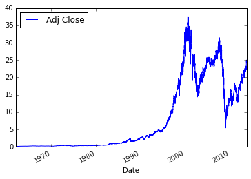

## Python 入门演示

### 简单的数学运算

整数相加，得到整数：


```python
2 + 2
```


    4


浮点数相加，得到浮点数：


```python
2.0 + 2.5
```


    4.5


整数和浮点数相加，得到浮点数：


```python
2 + 2.5
```


    4.5


### 变量赋值

**Python**使用`<变量名>=<表达式>`的方式对变量进行赋值


```python
a = 0.2
```

### 字符串 String

字符串的生成，单引号与双引号是等价的：


```python
s = "hello world"
s
```


    'hello world'


```python
s = 'hello world'
s
```


    'hello world'


三引号用来输入包含多行文字的字符串：


```python
s = """hello
world"""
print s
```

    hello
    world


```python
s = '''hello
world'''
print s
```

    hello
    world


字符串的加法：


```python
s = "hello" + " world"
s
```


    'hello world'


字符串索引：


```python
s[0]
```


    'h'


```python
s[-1]
```


    'd'


```python
s[0:5]
```


    'hello'


字符串的分割：


```python
s = "hello world"
s.split()
```


    ['hello', 'world']


查看字符串的长度：


```python
len(s)
```


    11


### 列表 List

Python用`[]`来生成列表


```python
a = [1, 2.0, 'hello', 5 + 1.0]
a
```


    [1, 2.0, 'hello', 6.0]


列表加法：


```python
a + a
```


    [1, 2.0, 'hello', 6.0, 1, 2.0, 'hello', 6.0]


列表索引：


```python
a[1]
```


    2.0


列表长度：


```python
len(a)
```


    4


向列表中添加元素：


```python
a.append("world")
a
```


    [1, 2.0, 'hello', 6.0, 'world']


### 集合 Set

Python用{}来生成集合，集合中不含有相同元素。


```python
s = {2, 3, 4, 2}
s
```


    {2, 3, 4}


集合的长度：


```python
len(s)
```


    3


向集合中添加元素：


```python
s.add(1)
s
```


    {1, 2, 3, 4}


集合的交：


```python
a = {1, 2, 3, 4}
b = {2, 3, 4, 5}
a & b
```


    {2, 3, 4}


并：


```python
a | b
```


    {1, 2, 3, 4, 5}


差：


```python
a - b
```


    {1}


对称差：


```python
a ^ b
```


    {1, 5}


### 字典 Dictionary 

Python用`{key:value}`来生成Dictionary。


```python
d = {'dogs':5, 'cats':4}
d
```


    {'cats': 4, 'dogs': 5}


字典的大小


```python
len(d)
```


    2


查看字典某个键对应的值：


```python
d["dogs"]
```


    5


修改键值：


```python
d["dogs"] = 2
d
```


    {'cats': 4, 'dogs': 2}


插入键值：


```python
d["pigs"] = 7
d
```


    {'cats': 4, 'dogs': 2, 'pigs': 7}


所有的键：


```python
d.keys()
```


    ['cats', 'dogs', 'pigs']


所有的值：


```python
d.values()
```


    [4, 2, 7]


所有的键值对：


```python
d.items()
```


    [('cats', 4), ('dogs', 2), ('pigs', 7)]


### 数组 Numpy Arrays

需要先导入需要的包，Numpy数组可以进行很多列表不能进行的运算。


```python
from numpy import array
a = array([1, 2, 3, 4])
a
```


    array([1, 2, 3, 4])


加法：


```python
a + 2
```


    array([3, 4, 5, 6])


```python
a + a
```


    array([2, 4, 6, 8])


### 画图 Plot

Python提供了一个很像MATLAB的绘图接口。


```python
%matplotlib inline
from matplotlib.pyplot import plot
plot(a, a**2)
```


    [<matplotlib.lines.Line2D at 0x9fb6fd0>]


    

    


### 循环 Loop


```python
line = '1 2 3 4 5'
fields = line.split()
fields
```


    ['1', '2', '3', '4', '5']


```python
total = 0
for field in fields:
    total += int(field)
total
```


    15


Python中有一种叫做列表推导式(List comprehension)的用法：


```python
numbers = [int(field) for field in fields]
numbers
```


    [1, 2, 3, 4, 5]


```python
sum(numbers)
```


    15


写在一行：


```python
sum([int(field) for field in line.split()])
```


    15


### 文件操作 File IO


```python
cd ~
```

    d:\Users\lijin


写文件：


```python
f = open('data.txt', 'w')
f.write('1 2 3 4\n')
f.write('2 3 4 5\n')
f.close()
```

读文件：


```python
f = open('data.txt')
data = []
for line in f:
    data.append([int(field) for field in line.split()])
f.close()
data

```


    [[1, 2, 3, 4], [2, 3, 4, 5]]


```python
for row in data:
    print row
```

    [1, 2, 3, 4]
    [2, 3, 4, 5]


删除文件：


```python
import os
os.remove('data.txt')
```

### 函数 Function

Python用关键词`def`来定义函数。


```python
def poly(x, a, b, c):
    y = a * x ** 2 + b * x + c
    return y

x = 1
poly(x, 1, 2, 3)
```


    6


用Numpy数组做参数x：


```python
x = array([1, 2, 3])
poly(x, 1, 2, 3)
```


    array([ 6, 11, 18])


可以在定义时指定参数的默认值：


```python
from numpy import arange

def poly(x, a = 1, b = 2, c = 3):
    y = a*x**2 + b*x + c
    return y

x = arange(10)
x
array([0, 1, 2, 3, 4, 5, 6, 7, 8, 9])
```


    array([0, 1, 2, 3, 4, 5, 6, 7, 8, 9])


```python
poly(x)
```


    array([  3,   6,  11,  18,  27,  38,  51,  66,  83, 102])


```python
poly(x, b = 1)
```


    array([ 3,  5,  9, 15, 23, 33, 45, 59, 75, 93])


### 模块 Module

Python中使用`import`关键词来导入模块。


```python
import os
```

当前进程号：


```python
os.getpid()
```


    4400


系统分隔符：


```python
os.sep
```


    '\\'


### - 类 Class

用`class`来定义一个类。
`Person(object)`表示继承自`object`类；
`__init__`函数用来初始化对象；
`self`表示对象自身，类似于`C` `Java`里面`this`。


```python
class Person(object):
    def __init__(self, first, last, age):
        self.first = first
        self.last = last
        self.age = age
    def full_name(self):
        return self.first + ' ' + self.last
```

构建新对象：


```python
person = Person('Mertle', 'Sedgewick', 52)
```

调用对象的属性：


```python
person.first
```


    'Mertle'


调用对象的方法：


```python
person.full_name()
```


    'Mertle Sedgewick'


修改对象的属性：


```python
person.last = 'Smith'
```

添加新属性，d是之前定义的字典：


```python
person.critters = d
person.critters
```


    {'cats': 4, 'dogs': 2, 'pigs': 7}


### 网络数据 Data from Web


```python
url = 'http://ichart.finance.yahoo.com/table.csv?s=GE&d=10&e=5&f=2013&g=d&a=0&b=2&c=1962&ignore=.csv'
```

处理后就相当于一个可读文件：


```python
import urllib2
ge_csv = urllib2.urlopen(url)
data = []
for line in ge_csv:
    data.append(line.split(','))
data[:4]
```


    [['Date', 'Open', 'High', 'Low', 'Close', 'Volume', 'Adj Close\n'],
     ['2013-11-05', '26.32', '26.52', '26.26', '26.42', '24897500', '24.872115\n'],
     ['2013-11-04',
      '26.59',
      '26.59',
      '26.309999',
      '26.43',
      '28166100',
      '24.88153\n'],
     ['2013-11-01',
      '26.049999',
      '26.639999',
      '26.030001',
      '26.540001',
      '55634500',
      '24.985086\n']]


使用`pandas`处理数据：


```python
ge_csv = urllib2.urlopen(url)
import pandas
ge = pandas.read_csv(ge_csv, index_col=0, parse_dates=True)
ge.plot(y='Adj Close')
```


    <matplotlib.axes._subplots.AxesSubplot at 0xc2e3198>


    

    

## Python 数据类型

### 常用数据类型 Common Data Types

| 类型| 例子|
| -----  | ----- |
| 整数 | `-100` |
| 浮点数 | `3.1416` |
| 字符串 | `'hello'` |
| 列表 | `[1, 1.2, 'hello']` |
| 字典 | `{'dogs': 5, 'pigs': 3}`|
| Numpy数组 | `array([1, 2, 3])`

### 其他类型 Others

| 类型| 例子|
| -------  | ----- |
| 长整型 | `1000000000000L`
| 布尔型 | `True, False`
| 元组 | `('ring', 1000)`
| 集合 | `{1, 2, 3}`
| Pandas类型| `DataFrame, Series`
| 自定义 | `Object Oriented Classes`
## 数字

### 整型 Integers

整型运算，加减乘：


```python
2 + 2
```


    4


```python
3 - 4
```


    -1


```python
4 * 5
```


    20


在**Python 2.7**中，整型的运算结果只能返回整型，**除法**的结果也不例外。

例如`12 / 5`返回的结果并不是2.4，而是2：


```python
12 / 5
```


    2


幂指数：


```python
2 ** 5
```


    32


取余：


```python
32 % 5
```


    2


赋值给变量：


```python
a = 1
a
```


    1


使用`type()`函数来查看变量类型：


```python
type(a)
```


    int


整型数字的最大最小值：

在 32 位系统中，一个整型 4 个字节，最小值 `-2,147,483,648`，最大值 `2,147,483,647`。

在 64 位系统中，一个整型 8 个字节，最小值 `-9,223,372,036,854,775,808`，最大值 `9,223,372,036,854,775,807`。


```python
import sys
sys.maxint
```


    2147483647


### 长整型 Long Integers

当整型超出范围时，**Python**会自动将整型转化为长整型，不过长整型计算速度会比整型慢。


```python
a = sys.maxint + 1
print type(a)
```

    <type 'long'>


长整型的一个标志是后面以字母L结尾：


```python
a
```


    2147483648L


可以在赋值时强制让类型为长整型：


```python
b = 1234L
type(b)
```


    long


长整型可以与整型在一起进行计算，返回的类型还是长整型：


```python
a - 4
```


    2147483644L


### 浮点数 Floating Point Numbers


```python
a = 1.4
type(a)
```


    float


在之前的除法例子`12 / 5`中，假如想要使返回的结果为2.4，可以将它们写成浮点数的形式：


```python
12.0 / 5.0
```


    2.4


```python
12 / 5.0
```


    2.4


```python
12.0 / 5
```


    2.4


上面的例子说明，浮点数与整数进行运算时，返回的仍然是浮点数：


```python
5 + 2.4
```


    7.4


浮点数也可以进行与整数相似的运算，甚至可以取余：


```python
3.4 - 3.2
```


    0.19999999999999973


```python
12.3 + 32.4
```


    44.7


```python
2.5 ** 2
```


    6.25


```python
3.4 % 2.1
```


    1.2999999999999998


**Python**的浮点数标准与**C**，**Java**一致，都是[IEEE 754 floating point standard](http://en.wikipedia.org/wiki/IEEE_floating_point)。

注意看 `3.4 - 3.2` 的结果并不是我们预期的`0.2`，这是因为浮点数本身储存方式引起的，浮点数本身会存在一点误差。

事实上，**Python** 中储存的值为'0.199999999999999733546474089962430298328399658203125'，因为这是最接近0.2的浮点数。|


```python
'{:.52}'.format(3.4 - 3.2)
```


    '0.199999999999999733546474089962430298328399658203125'


当我们使用`print`显示时，**Python**会自动校正这个结果


```python
print 3.4 - 3.2
```

    0.2


可以用`sys.float_info`来查看浮点数的信息：


```python
import sys
sys.float_info
```


    sys.float_info(max=1.7976931348623157e+308, max_exp=1024, max_10_exp=308, min=2.2250738585072014e-308, min_exp=-1021, min_10_exp=-307, dig=15, mant_dig=53, epsilon=2.220446049250313e-16, radix=2, rounds=1)


例如浮点数能表示的最大值：


```python
sys.float_info.max
```


    1.7976931348623157e+308


浮点数能表示的最接近0的值：


```python
sys.float_info.min
```


    2.2250738585072014e-308


浮点数的精度：


```python
sys.float_info.epsilon
```


    2.220446049250313e-16


### 复数 Complex Numbers

**Python** 使用 `j` 来表示复数的虚部：


```python
a = 1 + 2j
type(a)
```


    complex


可以查看它的实部，虚部以及共轭：


```python
a.real
```


    1.0


```python
a.imag
```


    2.0


```python
a.conjugate()
```


    (1-2j)


##交互计算

可以将复杂的表达式放在一起计算：


```python
1 + 2 - (3 * 4 / 6) ** 5 + 7 % 5
```


    -27


在**Python**中运算是有优先级的，优先级即算术的先后顺序，比如“先乘除后加减”和“先算括号里面的”都是两种优先级的规则，优先级从高到低排列如下：

- `( )` 括号
- `**` 幂指数运算
- `* / // %` 乘，除，整数除法，取余运算
- '+ -' 加减

整数除法，返回的是比结果小的最大整数值：


```python
12.3 // 5.2
```


    2.0


```python
12.3 // -4
```


    -4.0


### 简单的数学函数

绝对值：


```python
abs(-12.4)
```


    12.4


取整：


```python
round(21.6)
```


    22.0


最大最小值：


```python
print min(2, 3, 4, 5)
print max(2, 4, 3)
```

    2
    4


### 变量名覆盖

不要用内置的函数来命名变量，否则会出现意想不到的结果：


```python
type(max)
```


    builtin_function_or_method


不要这样做！！！


```python
max = 1
type(max)
```


    int


```python
max(4, 5)
```


    ---------------------------------------------------------------------------

    TypeError                                 Traceback (most recent call last)

    <ipython-input-41-c60446be959c> in <module>()
    ----> 1 max(4, 5)
    

    TypeError: 'int' object is not callable


### 类型转换

浮点数转整型，只保留整数部分：


```python
print int(12.324)
print int(-3.32)
```

    12
    -3


整型转浮点型：


```python
print float(1.2)
```

    1.2


### 其他表示

除了10进制外，整数还有其他类型的表示方法。

科学计数法：


```python
1e-6
```


    1e-06


16进制，前面加`0x`修饰，后面使用数字0-9A-F：


```python
0xFF
```


    255


8进制，前面加`0`或者`0o`修饰，后面使用数字0-7：


```python
067
```


    55


2进制，前面加`0b`修饰，后面使用数字0或1：


```python
0b101010
```


    42


### 原地计算 In-place

**Python**可以使用下面的形式进行原地计算：


```python
b = 2.5
b += 2
print b
b *= 2
print b
b -= 3
print b
```

    4.5
    9.0
    6.0


### 布尔型 Boolean Data Type

布尔型可以看成特殊的二值变量，其取值为`True`和`False`：


```python
q = True
type(q)
```


    bool


可以用表达式构建布尔型变量：


```python
q = 1 > 2
print q
```

    False


常用的比较符号包括：

    <, >, <=, >=, ==, !=

**Python**支持链式比较：


```python
x = 2 
1 < x <= 3
```


    True


```python

```
## 字符串

### 生成字符串

**Python**中可以使用一对单引号''或者双引号""生成字符串。


```python
s = "hello, world"
print s
```

    hello, world


```python
s = 'hello world'
print s
```

    hello world


### 简单操作

加法：


```python
s = 'hello ' + 'world'
s
```


    'hello world'


字符串与数字相乘：


```python
"echo" * 3
```


    'echoechoecho'


字符串长度：


```python
len(s)
```


    11


### 字符串方法

**Python**是一种面向对象的语言，面向对象的语言中一个必不可少的元素就是方法，而字符串是对象的一种，所以有很多可用的方法。

跟很多语言一样，**Python**使用以下形式来调用方法：

    对象.方法(参数)

#### 分割

s.split()将s按照空格（包括多个空格，制表符`\t`，换行符`\n`等）分割，并返回所有分割得到的字符串。


```python
line = "1 2 3 4  5"
numbers = line.split()
print numbers
```

    ['1', '2', '3', '4', '5']


s.split(sep)以给定的sep为分隔符对s进行分割。


```python
line = "1,2,3,4,5"
numbers = line.split(',')
print numbers
```

    ['1', '2', '3', '4', '5']


#### 连接

与分割相反，s.join(str_sequence)的作用是以s为连接符将字符串序列str_sequence中的元素连接起来，并返回连接后得到的新字符串：


```python
s = ' '
s.join(numbers)
```


    '1 2 3 4 5'


```python
s = ','
s.join(numbers)
```


    '1,2,3,4,5'


#### 替换

s.replace(part1, part2)将字符串s中指定的部分part1替换成想要的部分part2，并返回新的字符串。


```python
s = "hello world"
s.replace('world', 'python')
```


    'hello python'


此时，s的值并没有变化，替换方法只是生成了一个新的字符串。


```python
s
```


    'hello world'


#### 大小写转换

s.upper()方法返回一个将s中的字母全部大写的新字符串。

s.lower()方法返回一个将s中的字母全部小写的新字符串。


```python
"hello world".upper()
```


    'HELLO WORLD'


这两种方法也不会改变原来s的值：


```python
s = "HELLO WORLD"
print s.lower()
print s
```

    hello world
    HELLO WORLD


#### 去除多余空格

s.strip()返回一个将s两端的多余空格除去的新字符串。

s.lstrip()返回一个将s开头的多余空格除去的新字符串。

s.rstrip()返回一个将s结尾的多余空格除去的新字符串。


```python
s = "  hello world   "
s.strip()
```


    'hello world'


s的值依然不会变化：


```python
s
```


    '  hello world   '


```python
s.lstrip()
```


    'hello world   '


```python
s.rstrip()
```


    '  hello world'


### 更多方法

可以使用dir函数查看所有可以使用的方法：


```python
dir(s)
```


    ['__add__',
     '__class__',
     '__contains__',
     '__delattr__',
     '__doc__',
     '__eq__',
     '__format__',
     '__ge__',
     '__getattribute__',
     '__getitem__',
     '__getnewargs__',
     '__getslice__',
     '__gt__',
     '__hash__',
     '__init__',
     '__le__',
     '__len__',
     '__lt__',
     '__mod__',
     '__mul__',
     '__ne__',
     '__new__',
     '__reduce__',
     '__reduce_ex__',
     '__repr__',
     '__rmod__',
     '__rmul__',
     '__setattr__',
     '__sizeof__',
     '__str__',
     '__subclasshook__',
     '_formatter_field_name_split',
     '_formatter_parser',
     'capitalize',
     'center',
     'count',
     'decode',
     'encode',
     'endswith',
     'expandtabs',
     'find',
     'format',
     'index',
     'isalnum',
     'isalpha',
     'isdigit',
     'islower',
     'isspace',
     'istitle',
     'isupper',
     'join',
     'ljust',
     'lower',
     'lstrip',
     'partition',
     'replace',
     'rfind',
     'rindex',
     'rjust',
     'rpartition',
     'rsplit',
     'rstrip',
     'split',
     'splitlines',
     'startswith',
     'strip',
     'swapcase',
     'title',
     'translate',
     'upper',
     'zfill']


### 多行字符串

Python 用一对 `"""` 或者 `'''` 来生成多行字符串：


```python
a = """hello world.
it is a nice day."""
print a
```

    hello world.
    it is a nice day.


在储存时，我们在两行字符间加上一个换行符 `'\n'`


```python
a
```


    'hello world.\nit is a nice day.'


### 使用 `()` 或者 `\` 来换行

当代码太长或者为了美观起见时，我们可以使用两种方法来将一行代码转为多行代码：

* ()
* \


```python
a = ("hello, world. "
    "it's a nice day. "
    "my name is xxx")
a
```


    "hello, world. it's a nice day. my name is xxx"


```python
a = "hello, world. " \
    "it's a nice day. " \
    "my name is xxx"
a
```


    "hello, world. it's a nice day. my name is xxx"


### 强制转换为字符串

* `str(ob)`强制将`ob`转化成字符串。 
* `repr(ob)`也是强制将`ob`转化成字符串。

不同点如下：


```python
str(1.1 + 2.2)
```


    '3.3'


```python
repr(1.1 + 2.2)
```


    '3.3000000000000003'


### 整数与不同进制的字符串的转化

可以将整数按照不同进制转化为不同类型的字符串。

十六进制：


```python
hex(255)
```


    '0xff'


八进制：


```python
oct(255)
```


    '0377'


二进制：


```python
bin(255)
```


    '0b11111111'


可以使用 `int` 将字符串转为整数：


```python
int('23')
```


    23


还可以指定按照多少进制来进行转换，最后返回十进制表达的整数：


```python
int('FF', 16)
```


    255


```python
int('377', 8)
```


    255


```python
int('11111111', 2)
```


    255


`float` 可以将字符串转换为浮点数：


```python
float('3.5')
```


    3.5


### 格式化字符串

**Python**用字符串的`format()`方法来格式化字符串。

具体用法如下，字符串中花括号 `{}` 的部分会被format传入的参数替代，传入的值可以是字符串，也可以是数字或者别的对象。


```python
'{} {} {}'.format('a', 'b', 'c')
```


    'a b c'


可以用数字指定传入参数的相对位置：


```python
'{2} {1} {0}'.format('a', 'b', 'c')
```


    'c b a'


还可以指定传入参数的名称：


```python
'{color} {n} {x}'.format(n=10, x=1.5, color='blue')
```


    'blue 10 1.5'


可以在一起混用：


```python
'{color} {0} {x} {1}'.format(10, 'foo', x = 1.5, color='blue')
```


    'blue 10 1.5 foo'


可以用`{<field name>:<format>}`指定格式：


```python
from math import pi

'{0:10} {1:10d} {2:10.2f}'.format('foo', 5, 2 * pi)
```


    'foo                 5       6.28'


具体规则与C中相同。

也可以使用旧式的 `%` 方法进行格式化：


```python
s = "some numbers:"
x = 1.34
y = 2
## 用百分号隔开，括号括起来
t = "%s %f, %d" % (s, x, y)
```


```python
t
```


    'some numbers: 1.340000, 2'


## 索引和分片

### 索引

对于一个有序序列，可以通过索引的方法来访问对应位置的值。字符串便是一个有序序列的例子，**Python**使用 `[]` 来对有序序列进行索引。


```python
s = "hello world"
s[0]
```


    'h'


**Python**中索引是从 `0` 开始的，所以索引 `0` 对应与序列的第 `1` 个元素。为了得到第 `5` 个元素，需要使用索引值 `4` 。


```python
s[4]
```


    'o'


除了正向索引，**Python**还引入了负索引值的用法，即从后向前开始计数，例如，索引 `-2` 表示倒数第 `2` 个元素：


```python
s[-2]
```


    'l'


单个索引大于等于字符串的长度时，会报错：


```python
s[11]
```


    ---------------------------------------------------------------------------

    IndexError                                Traceback (most recent call last)

    <ipython-input-4-79ffc22473a3> in <module>()
    ----> 1 s[11]
    

    IndexError: string index out of range


### 分片

分片用来从序列中提取出想要的子序列，其用法为：

    var[lower:upper:step]

其范围包括 `lower` ，但不包括 `upper` ，即 `[lower, upper)`， `step` 表示取值间隔大小，如果没有默认为`1`。


```python
s
```


    'hello world'


```python
s[1:3]
```


    'el'


分片中包含的元素的个数为 `3-1=2` 。

也可以使用负索引来指定分片的范围：


```python
s[1:-2]
```


    'ello wor'


包括索引 `1` 但是不包括索引 `-2` 。

lower和upper可以省略，省略lower意味着从开头开始分片，省略upper意味着一直分片到结尾。


```python
s[:3]
```


    'hel'


```python
s[-3:]
```


    'rld'


```python
s[:]
```


    'hello world'


每隔两个取一个值：


```python
s[::2]
```


    'hlowrd'


当step的值为负时，省略lower意味着从结尾开始分片，省略upper意味着一直分片到开头。


```python
s[::-1]
```


    'dlrow olleh'


当给定的upper超出字符串的长度（注意：因为不包含upper，所以可以等于）时，Python并不会报错，不过只会计算到结尾。


```python
s[:100]
```


    'hello world'


### 使用“0”作为索引开头的原因

#### 使用`[low, up)`形式的原因

假设需要表示字符串 `hello` 中的内部子串 `el` ：

|方式|`[low, up)`|`(low, up]`|`(lower, upper)`|`[lower, upper]`
|--|--|--|--|--|
|表示|`[1,3)`|`(0,2]`|`(0,3)`|`[1,2]`
|序列长度|`up - low`|`up - low`|`up - low - 1`|`up - low + 1`

对长度来说，前两种方式比较好，因为不需要烦人的加一减一。

现在只考虑前两种方法，假设要表示字符串`hello`中的从头开始的子串`hel`：

|方式|`[low, up)`|`(low, up]`
|--|--|
|表示|`[0,3)`|`(-1,2]`|
|序列长度|`up - low`|`up - low`|

第二种表示方法从`-1`开始，不是很好，所以选择使用第一种`[low, up)`的形式。

#### 使用0-base的形式

> Just too beautiful to ignore.  
----Guido van Rossum

两种简单的情况：

- 从头开始的n个元素；
    - 使用0-base：`[0, n)`
    - 使用1-base：`[1, n+1)`

- 第`i+1`个元素到第`i+n`个元素。
    - 使用0-base：`[i, n+i)`
    - 使用1-base：`[i+1, n+i+1)`

1-base有个`+1`部分，所以不推荐。

综合这两种原因，**Python**使用0-base的方法来进行索引。
## 列表

在**Python**中，列表是一个有序的序列。

列表用一对 `[]` 生成，中间的元素用 `,` 隔开，其中的元素不需要是同一类型，同时列表的长度也不固定。


```python
l = [1, 2.0, 'hello']
print l
```

    [1, 2.0, 'hello']


空列表可以用 `[]` 或者 `list()` 生成：


```python
empty_list = []
empty_list
```


    []


```python
empty_list = list()
empty_list
```


    []


### 列表操作

与字符串类似，列表也支持以下的操作：

#### 长度

用 `len` 查看列表长度：


```python
len(l)
```


    3


#### 加法和乘法

列表加法，相当于将两个列表按顺序连接：


```python
a = [1, 2, 3]
b = [3.2, 'hello']
a + b
```


    [1, 2, 3, 3.2, 'hello']


列表与整数相乘，相当于将列表重复相加：


```python
l * 2
```


    [1, 2.0, 'hello', 1, 2.0, 'hello']


#### 索引和分片

列表和字符串一样可以通过索引和分片来查看它的元素。

索引：


```python
a = [10, 11, 12, 13, 14]
a[0]
```


    10


反向索引：


```python
a[-1]
```


    14


分片：


```python
a[2:-1]
```


    [12, 13]


与字符串不同的是，列表可以通过索引和分片来修改。

对于字符串，如果我们通过索引或者分片来修改，**Python**会报错：


```python
s = "hello world"
## 把开头的 h 改成大写
s[0] = 'H'
```


    ---------------------------------------------------------------------------

    TypeError                                 Traceback (most recent call last)

    <ipython-input-10-844622ced67a> in <module>()
          1 s = "hello world"
          2 ## 把开头的 h 改成大写
    ----> 3 s[0] = 'H'
    

    TypeError: 'str' object does not support item assignment


而这种操作对于列表来说是可以的：


```python
a = [10, 11, 12, 13, 14]
a[0] = 100
print a
```

    [100, 11, 12, 13, 14]


这种赋值也适用于分片，例如，将列表的第2，3两个元素换掉：


```python
a[1:3] = [1, 2]
a
```


    [100, 1, 2, 13, 14]


事实上，对于连续的分片（即步长为 `1` ），**Python**采用的是整段替换的方法，两者的元素个数并不需要相同，例如，将 `[11,12]` 替换为 `[1,2,3,4]`：


```python
a = [10, 11, 12, 13, 14]
a[1:3] = [1, 2, 3, 4]
print a
```

    [10, 1, 2, 3, 4, 13, 14]


这意味着，可以用这种方法来删除列表中一个连续的分片：


```python
a = [10, 1, 2, 11, 12]
print a[1:3]
a[1:3] = []
print a
```

    [1, 2]
    [10, 11, 12]


对于不连续（间隔step不为1）的片段进行修改时，两者的元素数目必须一致：


```python
a = [10, 11, 12, 13, 14]
a[::2] = [1, 2, 3]
a
```


    [1, 11, 2, 13, 3]


否则会报错：


```python
a[::2] = []
```


    ---------------------------------------------------------------------------

    ValueError                                Traceback (most recent call last)

    <ipython-input-16-7b6c4e43a9fa> in <module>()
    ----> 1 a[::2] = []
    

    ValueError: attempt to assign sequence of size 0 to extended slice of size 3


#### 删除元素

**Python**提供了删除列表中元素的方法 'del'。

删除列表中的第一个元素：


```python
a = [1002, 'a', 'b', 'c']
del a[0]
print a
```

    ['a', 'b', 'c']


删除第2到最后一个元素：


```python
a = [1002, 'a', 'b', 'c']
del a[1:]
a
```


    [1002]


删除间隔的元素：


```python
a = ['a', 1, 'b', 2, 'c']
del a[::2]
a
```


    [1, 2]


#### 测试从属关系

用 `in` 来看某个元素是否在某个序列（不仅仅是列表）中，用not in来判断是否不在某个序列中。


```python
a = [10, 11, 12, 13, 14]
print 10 in a
print 10 not in a
```

    True
    False


也可以作用于字符串：


```python
s = 'hello world'
print 'he' in s
print 'world' not in s
```

    True
    False


列表中可以包含各种对象，甚至可以包含列表：


```python
a = [10, 'eleven', [12, 13]]
a[2]
```


    [12, 13]


a[2]是列表，可以对它再进行索引：


```python
a[2][1]
```


    13


### 列表方法

#### 不改变列表的方法

##### 列表中某个元素个数count

`l.count(ob)` 返回列表中元素 `ob` 出现的次数。


```python
a = [11, 12, 13, 12, 11]
a.count(11)
```


    2


##### 列表中某个元素位置index

`l.index(ob)` 返回列表中元素 `ob` 第一次出现的索引位置，如果 `ob` 不在 `l` 中会报错。


```python
a.index(12)
```


    1


不存在的元素会报错：


```python
a.index(1)
```


    ---------------------------------------------------------------------------

    ValueError                                Traceback (most recent call last)

    <ipython-input-26-ed16592c2786> in <module>()
    ----> 1 a.index(1)
    

    ValueError: 1 is not in list


#### 改变列表的方法

##### 向列表添加单个元素

`l.append(ob)` 将元素 `ob` 添加到列表 `l` 的最后。


```python
a = [10, 11, 12]
a.append(11)
print a
```

    [10, 11, 12, 11]


append每次只添加一个元素，并不会因为这个元素是序列而将其展开：


```python
a.append([11, 12])
print a
```

    [10, 11, 12, 11, [11, 12]]


##### 向列表添加序列

`l.extend(lst)` 将序列 `lst` 的元素依次添加到列表 `l` 的最后，作用相当于 `l += lst`。


```python
a = [10, 11, 12, 11]
a.extend([1, 2])
print a
```

    [10, 11, 12, 11, 1, 2]


##### 插入元素

`l.insert(idx, ob)` 在索引 `idx` 处插入 `ob` ，之后的元素依次后移。


```python
a = [10, 11, 12, 13, 11]
## 在索引 3 插入 'a'
a.insert(3, 'a')
print a
```

    [10, 11, 12, 'a', 13, 11]


##### 移除元素

`l.remove(ob)` 会将列表中第一个出现的 `ob` 删除，如果 `ob` 不在 `l` 中会报错。


```python
a = [10, 11, 12, 13, 11]
## 移除了第一个 11
a.remove(11)
print a
```

    [10, 12, 13, 11]


##### 弹出元素

`l.pop(idx)` 会将索引 `idx` 处的元素删除，并返回这个元素。


```python
a = [10, 11, 12, 13, 11]
a.pop(2)
```


    12


##### 排序

`l.sort()` 会将列表中的元素按照一定的规则排序：


```python
a = [10, 1, 11, 13, 11, 2]
a.sort()
print a
```

    [1, 2, 10, 11, 11, 13]


如果不想改变原来列表中的值，可以使用 `sorted` 函数：


```python
a = [10, 1, 11, 13, 11, 2]
b = sorted(a)
print a
print b
```

    [10, 1, 11, 13, 11, 2]
    [1, 2, 10, 11, 11, 13]


##### 列表反向

`l.reverse()` 会将列表中的元素从后向前排列。


```python
a = [1, 2, 3, 4, 5, 6]
a.reverse()
print a
```

    [6, 5, 4, 3, 2, 1]


如果不想改变原来列表中的值，可以使用这样的方法：


```python
a = [1, 2, 3, 4, 5, 6]
b = a[::-1]
print a
print b
```

    [1, 2, 3, 4, 5, 6]
    [6, 5, 4, 3, 2, 1]


如果不清楚用法，可以查看帮助：


```python
a.sort?
```
## 可变和不可变类型

### 列表是可变的（Mutable）


```python
a = [1,2,3,4]
a
```


    [1, 2, 3, 4]


通过索引改变：


```python
a[0] = 100
a
```


    [100, 2, 3, 4]


通过方法改变：


```python
a.insert(3, 200)
a
```


    [100, 2, 3, 200, 4]


```python
a.sort()
a
```


    [2, 3, 4, 100, 200]


### 字符串是不可变的（Immutable）


```python
s = "hello world"
s
```


    'hello world'


通过索引改变会报错：


```python
s[0] = 'z'
```


    ---------------------------------------------------------------------------

    TypeError                                 Traceback (most recent call last)

    <ipython-input-6-83b06971f05e> in <module>()
    ----> 1 s[0] = 'z'
    

    TypeError: 'str' object does not support item assignment


字符串方法只是返回一个新字符串，并不改变原来的值：


```python
print s.replace('world', 'Mars')
print s
```

    hello Mars
    hello world


如果想改变字符串的值，可以用重新赋值的方法：


```python
s = "hello world"
s = s.replace('world', 'Mars')
print s
```

    hello Mars


或者用 `bytearray` 代替字符串：


```python
s = bytearray('abcde')
s[1:3] = '12'
s
```


    bytearray(b'a12de')


数据类型分类：

|可变数据类型|不可变数据类型|
|--|--|
|`list`, `dictionary`, `set`, `numpy array`, `user defined objects`|`integer`, `float`, `long`, `complex`, `string`, `tuple`, `frozenset`

### 字符串不可变的原因

其一，列表可以通过以下的方法改变，而字符串不支持这样的变化。


```python
a = [1, 2, 3, 4]
b = a
```

此时， `a` 和 `b` 指向同一块区域，改变 `b` 的值， `a` 也会同时改变：


```python
b[0] = 100
a
```


    [100, 2, 3, 4]


其二，是字符串与整数浮点数一样被认为是基本类型，而基本类型在Python中是不可变的。
## 元组

### 基本操作

与列表相似，元组`Tuple`也是个有序序列，但是元组是不可变的，用`()`生成。


```python
t = (10, 11, 12, 13, 14)
t
```


    (10, 11, 12, 13, 14)


可以索引，切片：


```python
t[0]
```


    10


```python
t[1:3]
```


    (11, 12)


但是元组是不可变的：


```python
## 会报错
t[0] = 1
```


    ---------------------------------------------------------------------------

    TypeError                                 Traceback (most recent call last)

    <ipython-input-4-da6c1cabf0b0> in <module>()
          1 ## 会报错
    ----> 2 t[0] = 1
    

    TypeError: 'tuple' object does not support item assignment


### 单个元素的元组生成

由于`()`在表达式中被应用，只含有单个元素的元组容易和表达式混淆，所以采用下列方式定义只有一个元素的元组：


```python
a = (10,)
print a
print type(a)
```

    (10,)
    <type 'tuple'>


```python
a = (10)
print type(a)
```

    <type 'int'>


将列表转换为元组：


```python
a = [10, 11, 12, 13, 14]
tuple(a)
```


    (10, 11, 12, 13, 14)


### 元组方法

由于元组是不可变的，所以只能有一些不可变的方法，例如计算元素个数 `count` 和元素位置 `index` ，用法与列表一样。


```python
a.count(10)
```


    1


```python
a.index(12)
```


    2


### 为什么需要元组

旧式字符串格式化中参数要用元组；

在字典中当作键值；

数据库的返回值……
## 列表与元组的速度比较

IPython 中用 `magic` 命令 `%timeit` 来计时。

### 比较生成速度


```python
%timeit [1,2,3,4,5,6,7,8,9,10,11,12,13,14,15,16,17,18,19,20,21,22,23,24,25]
```

    1000000 loops, best of 3: 456 ns per loop


```python
%timeit (1,2,3,4,5,6,7,8,9,10,11,12,13,14,15,16,17,18,19,20,21,22,23,24,25)
```

    10000000 loops, best of 3: 23 ns per loop


可以看到，元组的生成速度要比列表的生成速度快得多，相差大概一个数量级。

### 比较遍历速度

产生内容相同的随机列表和元组：


```python
from numpy.random import rand
values = rand(10000,4)
lst = [list(row) for row in values]
tup = tuple(tuple(row) for row in values)
```


```python
 %timeit for row in lst: list(row)
```

    100 loops, best of 3: 4.12 ms per loop


```python
%timeit for row in tup: tuple(row)
```

    100 loops, best of 3: 2.07 ms per loop


在遍历上，元组和列表的速度表现差不多。

### 比较遍历和索引速度：


```python
%timeit for row in lst: a = row[0] + 1
```

    The slowest run took 12.20 times longer than the fastest. This could mean that an intermediate result is being cached 
    100 loops, best of 3: 3.73 ms per loop


```python
%timeit for row in tup: a = row[0] + 1
```

    100 loops, best of 3: 3.82 ms per loop


元组的生成速度会比列表快很多，迭代速度快一点，索引速度差不多。
## 字典 

字典 `dictionary` ，在一些编程语言中也称为 `hash` ， `map` ，是一种由键值对组成的数据结构。

顾名思义，我们把键想象成字典中的单词，值想象成词对应的定义，那么——

一个词可以对应一个或者多个定义，但是这些定义只能通过这个词来进行查询。

### 基本操作

#### 空字典

**Python** 使用 `{}` 或者 `dict()` 来创建一个空的字典：


```python
a = {}
type(a)
```


    dict


```python
a = dict()
type(a)
```


    dict


有了dict之后，可以用索引键值的方法向其中添加元素，也可以通过索引来查看元素的值：

#### 插入键值


```python
a["one"] = "this is number 1"
a["two"] = "this is number 2"
a
```


    {'one': 'this is number 1', 'two': 'this is number 2'}


#### 查看键值


```python
a['one']
```


    'this is number 1'


#### 更新键值


```python
a["one"] = "this is number 1, too"
a
```


    {'one': 'this is number 1, too', 'two': 'this is number 2'}


#### 初始化字典

可以看到，Python使用`key: value`这样的结构来表示字典中的元素结构，事实上，可以直接使用这样的结构来初始化一个字典：


```python
b = {'one': 'this is number 1', 'two': 'this is number 2'}
b['one']
```


    'this is number 1'


#### 字典没有顺序

当我们 `print` 一个字典时，**Python**并不一定按照插入键值的先后顺序进行显示,因为字典中的键本身不一定是有序的。


```python
print a
```

    {'two': 'this is number 2', 'one': 'this is number 1, too'}


```python
print b
```

    {'two': 'this is number 2', 'one': 'this is number 1'}


因此，**Python**中不能用支持用数字索引按顺序查看字典中的值，而且数字本身也有可能成为键值，这样会引起混淆：


```python
## 会报错
a[0]
```


    ---------------------------------------------------------------------------

    KeyError                                  Traceback (most recent call last)

    <ipython-input-9-cc39af2a359c> in <module>()
          1 ## 会报错
    ----> 2 a[0]
    

    KeyError: 0


#### 键必须是不可变的类型

出于hash的目的，Python中要求这些键值对的**键**必须是**不可变**的，而值可以是任意的Python对象。

一个表示近义词的字典：


```python
synonyms = {}
synonyms['mutable'] = ['changeable', 'variable', 'varying', 'fluctuating',
                       'shifting', 'inconsistent', 'unpredictable', 'inconstant',
                       'fickle', 'uneven', 'unstable', 'protean']
synonyms['immutable'] = ['fixed', 'set', 'rigid', 'inflexible', 
                         'permanent', 'established', 'carved in stone']
synonyms
```


    {'immutable': ['fixed',
      'set',
      'rigid',
      'inflexible',
      'permanent',
      'established',
      'carved in stone'],
     'mutable': ['changeable',
      'variable',
      'varying',
      'fluctuating',
      'shifting',
      'inconsistent',
      'unpredictable',
      'inconstant',
      'fickle',
      'uneven',
      'unstable',
      'protean']}


另一个例子：


```python
## 定义四个字典
e1 = {'mag': 0.05, 'width': 20}
e2 = {'mag': 0.04, 'width': 25}
e3 = {'mag': 0.05, 'width': 80}
e4 = {'mag': 0.03, 'width': 30}
## 以字典作为值传入新的字典
events = {500: e1, 760: e2, 3001: e3, 4180: e4}
events
```


    {500: {'mag': 0.05, 'width': 20},
     760: {'mag': 0.04, 'width': 25},
     3001: {'mag': 0.05, 'width': 80},
     4180: {'mag': 0.03, 'width': 30}}


键（或者值）的数据类型可以不同：


```python
people = [
    {'first': 'Sam', 'last': 'Malone', 'name': 35},
    {'first': 'Woody', 'last': 'Boyd', 'name': 21},
    {'first': 'Norm', 'last': 'Peterson', 'name': 34},
    {'first': 'Diane', 'last': 'Chambers', 'name': 33}
]
people
```


    [{'first': 'Sam', 'last': 'Malone', 'name': 35},
     {'first': 'Woody', 'last': 'Boyd', 'name': 21},
     {'first': 'Norm', 'last': 'Peterson', 'name': 34},
     {'first': 'Diane', 'last': 'Chambers', 'name': 33}]


#### 使用 dict 初始化字典

除了通常的定义方式，还可以通过 `dict()` 转化来生成字典：


```python
inventory = dict(
    [('foozelator', 123),
     ('frombicator', 18), 
     ('spatzleblock', 34), 
     ('snitzelhogen', 23)
    ])
inventory
```


    {'foozelator': 123, 'frombicator': 18, 'snitzelhogen': 23, 'spatzleblock': 34}


利用索引直接更新键值对：


```python
inventory['frombicator'] += 1
inventory
```


    {'foozelator': 123, 'frombicator': 19, 'snitzelhogen': 23, 'spatzleblock': 34}


### 适合做键的类型

在不可变类型中，整数和字符串是字典中最常用的类型；而浮点数通常不推荐用来做键，原因如下：


```python
data = {}
data[1.1 + 2.2] = 6.6
## 会报错
data[3.3]
```


    ---------------------------------------------------------------------------

    KeyError                                  Traceback (most recent call last)

    <ipython-input-16-a48e87d01daa> in <module>()
          2 data[1.1 + 2.2] = 6.6
          3 ## 会报错
    ----> 4 data[3.3]
    

    KeyError: 3.3


事实上，观察`data`的值就会发现，这个错误是由浮点数的精度问题所引起的：


```python
data
```


    {3.3000000000000003: 6.6}


有时候，也可以使用元组作为键值，例如，可以用元组做键来表示从第一个城市飞往第二个城市航班数的多少：


```python
connections = {}
connections[('New York', 'Seattle')] = 100
connections[('Austin', 'New York')] = 200
connections[('New York', 'Austin')] = 400
```

元组是有序的，因此 `('New York', 'Austin')` 和 `('Austin', 'New York')` 是两个不同的键：


```python
print connections[('Austin', 'New York')]
print connections[('New York', 'Austin')]
```

    200
    400


### 字典方法

####  `get` 方法

之前已经见过，用索引可以找到一个键对应的值，但是当字典中没有这个键的时候，Python会报错，这时候可以使用字典的 `get` 方法来处理这种情况，其用法如下：

    `d.get(key, default = None)`

返回字典中键 `key` 对应的值，如果没有这个键，返回 `default` 指定的值（默认是 `None` ）。


```python
a = {}
a["one"] = "this is number 1"
a["two"] = "this is number 2"
```

索引不存在的键值会报错：


```python
a["three"]
```


    ---------------------------------------------------------------------------

    KeyError                                  Traceback (most recent call last)

    <ipython-input-22-8a5f2913f00e> in <module>()
    ----> 1 a["three"]
    

    KeyError: 'three'


改用get方法：


```python
print a.get("three")
```

    None


指定默认值参数：


```python
a.get("three", "undefined")
```


    'undefined'


#### `pop` 方法删除元素

`pop` 方法可以用来弹出字典中某个键对应的值，同时也可以指定默认参数：

    `d.pop(key, default = None)`

删除并返回字典中键 `key` 对应的值，如果没有这个键，返回 `default` 指定的值（默认是 `None` ）。


```python
a
```


    {'one': 'this is number 1', 'two': 'this is number 2'}


弹出并返回值：


```python
a.pop("two")
```


    'this is number 2'


```python
a
```


    {'one': 'this is number 1'}


弹出不存在的键值：


```python
a.pop("two", 'not exist')
```


    'not exist'


与列表一样，`del` 函数可以用来删除字典中特定的键值对，例如：


```python
del a["one"]
a
```


    {}


#### `update`方法更新字典

之前已经知道，可以通过索引来插入、修改单个键值对，但是如果想对多个键值对进行操作，这种方法就显得比较麻烦，好在有 `update` 方法：

    `d.update(newd)`

将字典`newd`中的内容更新到`d`中去。


```python
person = {}
person['first'] = "Jmes"
person['last'] = "Maxwell"
person['born'] = 1831
print person
```

    {'born': 1831, 'last': 'Maxwell', 'first': 'Jmes'}


把'first'改成'James'，同时插入'middle'的值'Clerk'：


```python
person_modifications = {'first': 'James', 'middle': 'Clerk'}
person.update(person_modifications)
print person
```

    {'middle': 'Clerk', 'born': 1831, 'last': 'Maxwell', 'first': 'James'}


#### `in`查询字典中是否有该键


```python
barn = {'cows': 1, 'dogs': 5, 'cats': 3}
```

`in` 可以用来判断字典中是否有某个特定的键：


```python
'chickens' in barn
```


    False


```python
'cows' in barn
```


    True


#### `keys` 方法，`values` 方法和`items` 方法

    `d.keys()` 

返回一个由所有键组成的列表；

    `d.values()` 

返回一个由所有值组成的列表；

    `d.items()` 

返回一个由所有键值对元组组成的列表；


```python
barn.keys()
```


    ['cows', 'cats', 'dogs']


```python
barn.values()
```


    [1, 3, 5]


```python
barn.items()
```


    [('cows', 1), ('cats', 3), ('dogs', 5)]


## 集合

之前看到的列表和字符串都是一种有序序列，而集合 `set` 是一种无序的序列。

因为集合是无序的，所以当集合中存在两个同样的元素的时候，Python只会保存其中的一个（唯一性）；同时为了确保其中不包含同样的元素，集合中放入的元素只能是不可变的对象（确定性）。

### 集合生成

可以用`set()`函数来显示的生成空集合：


```python
a = set()
type(a)
```


    set


也可以使用一个列表来初始化一个集合：


```python
a = set([1, 2, 3, 1])
a
```


    {1, 2, 3}


集合会自动去除重复元素 `1`。

可以看到，集合中的元素是用大括号`{}`包含起来的，这意味着可以用`{}`的形式来创建集合：


```python
a = {1, 2, 3, 1}
a
```


    {1, 2, 3}


但是创建空集合的时候只能用`set`来创建，因为在Python中`{}`创建的是一个空的字典：


```python
s = {}
type(s)
```


    dict


### 集合操作

假设有这样两个集合：


```python
a = {1, 2, 3, 4}
b = {3, 4, 5, 6}
```

#### 并

两个集合的并，返回包含两个集合所有元素的集合（去除重复）。

可以用方法 `a.union(b)` 或者操作 `a | b` 实现。


```python
a.union(b)
```


    {1, 2, 3, 4, 5, 6}


```python
b.union(a)
```


    {1, 2, 3, 4, 5, 6}


```python
a | b
```


    {1, 2, 3, 4, 5, 6}


#### 交

两个集合的交，返回包含两个集合共有元素的集合。

可以用方法 `a.intersection(b)` 或者操作 `a & b` 实现。


```python
a.intersection(b)
```


    {3, 4}


```python
b.intersection(a)
```


    {3, 4}


```python
a & b
```


    {3, 4}


```python
print(a & b)
```

    set([3, 4])


注意：一般使用print打印set的结果与表示方法并不一致。

#### 差

`a` 和 `b` 的差集，返回只在 `a` 不在 `b` 的元素组成的集合。

可以用方法 `a.difference(b)` 或者操作 `a - b` 实现。


```python
a.difference(b)
```


    {1, 2}


```python
a - b
```


    {1, 2}


注意，`a - b` 与 `b - a`并不一样，`b - a` 返回的是返回 b 不在 a 的元素组成的集合：


```python
b.difference(a)
```


    {5, 6}


```python
b - a 
```


    {5, 6}


#### 对称差

`a` 和`b` 的对称差集，返回在 `a` 或在 `b` 中，但是不同时在 `a` 和 `b` 中的元素组成的集合。

可以用方法 `a.symmetric_difference(b)` 或者操作 `a ^ b` 实现（异或操作符）。


```python
a.symmetric_difference(b)
```


    {1, 2, 5, 6}


```python
b.symmetric_difference(a)
```


    {1, 2, 5, 6}


```python
a ^ b
```


    {1, 2, 5, 6}


#### 包含关系

假设现在有这样两个集合：


```python
a = {1, 2, 3}
b = {1, 2}
```

要判断 `b` 是不是 `a` 的子集，可以用 `b.issubset(a)` 方法，或者更简单的用操作 `b <= a` ：


```python
b.issubset(a)
```


    True


```python
b <= a
```


    True


与之对应，也可以用 `a.issuperset(b)` 或者 `a >= b` 来判断：


```python
a.issuperset(b)
```


    True


```python
a >= b
```


    True


方法只能用来测试子集，但是操作符可以用来判断真子集：


```python
a <= a
```


    True


自己不是自己的真子集：


```python
a < a
```


    False


### 集合方法

#### `add` 方法向集合添加单个元素

跟列表的 `append` 方法类似，用来向集合添加单个元素。

    s.add(a)

将元素 `a` 加入集合 `s` 中。


```python
t = {1, 2, 3}
t.add(5)
t
```


    {1, 2, 3, 5}


如果添加的是已有元素，集合不改变：


```python
t.add(3)
t
```


    {1, 2, 3, 5}


#### `update` 方法向集合添加多个元素

跟列表的`extend`方法类似，用来向集合添加多个元素。

    s.update(seq)

将`seq`中的元素添加到`s`中。


```python
t.update([5, 6, 7])
t
```


    {1, 2, 3, 5, 6, 7}


#### `remove` 方法移除单个元素

    s.remove(ob)

从集合`s`中移除元素`ob`，如果不存在会报错。


```python
t.remove(1)
t
```


    {2, 3, 5, 6, 7}


```python
t.remove(10)
```


    ---------------------------------------------------------------------------

    KeyError                                  Traceback (most recent call last)

    <ipython-input-31-3bc25c5e1ff4> in <module>()
    ----> 1 t.remove(10)
    

    KeyError: 10


#### pop方法弹出元素

由于集合没有顺序，不能像列表一样按照位置弹出元素，所以`pop` 方法删除并返回集合中任意一个元素，如果集合中没有元素会报错。


```python
t.pop()
```


    {3, 5, 6, 7}


```python
print t
```

    set([3, 5, 6, 7])


```python
s = set()
## 报错
s.pop()
```


    ---------------------------------------------------------------------------

    KeyError                                  Traceback (most recent call last)

    <ipython-input-34-9f9e06c962e6> in <module>()
          1 s = set()
          2 ## 报错
    ----> 3 s.pop()
    

    KeyError: 'pop from an empty set'


#### discard 方法

作用与 `remove` 一样，但是当元素在集合中不存在的时候不会报错。


```python
t.discard(3)
```


```python
t
```


    {5, 6, 7}


不存在的元素不会报错：


```python
t.discard(20)
```


```python
t
```


    {5, 6, 7}


#### difference_update方法

    a.difference_update(b)

从a中去除所有属于b的元素：
## 不可变集合

对应于元组（`tuple`）与列表（`list`）的关系，对于集合（`set`），**Python**提供了一种叫做不可变集合（`frozen set`）的数据结构。

使用 `frozenset` 来进行创建：


```python
s = frozenset([1, 2, 3, 'a', 1])
s
```


    frozenset({1, 2, 3, 'a'})


与集合不同的是，不可变集合一旦创建就不可以改变。

不可变集合的一个主要应用是用来作为字典的键，例如用一个字典来记录两个城市之间的距离：


```python
flight_distance = {}
city_pair = frozenset(['Los Angeles', 'New York'])
flight_distance[city_pair] = 2498
flight_distance[frozenset(['Austin', 'Los Angeles'])] = 1233
flight_distance[frozenset(['Austin', 'New York'])] = 1515
flight_distance
```


    {frozenset({'Austin', 'New York'}): 1515,
     frozenset({'Austin', 'Los Angeles'}): 1233,
     frozenset({'Los Angeles', 'New York'}): 2498}


由于集合不分顺序，所以不同顺序不会影响查阅结果：


```python
flight_distance[frozenset(['New York','Austin'])]
```


    1515


```python
flight_distance[frozenset(['Austin','New York'])]
```


    1515


## Python 赋值机制

先看一个例子：


```python
x = [1, 2, 3]
y = x
x[1] = 100
print y
```

    [1, 100, 3]


改变变量`x`的值，变量`y`的值也随着改变，这与**Python**内部的赋值机制有关。

### 简单类型

先来看这一段代码在**Python**中的执行过程。

```python
x = 500
y = x
y = 'foo'
```

- `x = 500`

**Python**分配了一个 `PyInt` 大小的内存 `pos1` 用来储存对象 `500` ，然后，Python在命名空间中让变量 `x` 指向了这一块内存，注意，整数是不可变类型，所以这块内存的内容是不可变的。

|内存|命名空间|
|---|---|
|`pos1 : PyInt(500)` (不可变)|          `x : pos1`         |

- `y = x `

**Python**并没有使用新的内存来储存变量 `y` 的值，而是在命名空间中，让变量 `y` 与变量 `x` 指向了同一块内存空间。

|内存|命名空间|
|---|---|
|`pos1 : PyInt(500)` (不可变)|`x : pos1`<br> `y : pos1`|

- `y = 'foo'`

**Python**此时分配一个 `PyStr` 大小的内存 `pos2` 来储存对象 `foo` ，然后改变变量 `y` 所指的对象。

|内存|命名空间|
|---|---|
|`pos1 : PyInt(500)` (不可变)<br> `pos2 : PyStr('foo')` (不可变)|`x : pos1`<br>`y : pos2`|

对这一过程进行验证，可以使用 `id` 函数。

    id(x)

返回变量 `x` 的内存地址。


```python
x = 500
id(x)
```


    48220272L


```python
y = x
id(y)
```


    48220272L


也可以使用 `is` 来判断是不是指向同一个事物：


```python
x is y
```


    True


现在 `y` 指向另一块内存：


```python
y = 'foo'
id(y)
```


    39148320L


```python
x is y
```


    False


**Python**会为每个出现的对象进行赋值，哪怕它们的值是一样的，例如：


```python
x = 500
id(x)
```


    48220296L


```python
y = 500
id(y)
```


    48220224L


```python
x is y
```


    False


不过，为了提高内存利用效率，对于一些简单的对象，如一些数值较小的int对象，**Python**采用了重用对象内存的办法：


```python
x = 2
id(x)
```


    6579504L


```python
y = 2
id(y)
```


    6579504L


```python
x is y
```


    True


### 容器类型

现在来看另一段代码：

``` python
x = [500, 501, 502]
y = x
y[1] = 600
y = [700, 800]
```

- `x = [500, 501, 502]`

Python为3个PyInt分配内存 `pos1` ， `pos2` ， `pos3` （不可变），然后为列表分配一段内存 `pos4` ，它包含3个位置，分别指向这3个内存，最后再让变量 `x` 指向这个列表。

|内存|命名空间|
|---|---|
|`pos1 : PyInt(500)` (不可变) <br> `pos2 : PyInt(501)` (不可变) <br>`pos3 : PyInt(502)` (不可变) <br> `pos4 : PyList(pos1, pos2, pos3)` (可变)|`x : pos4`|

- `y = x`

并没有创建新的对象，只需要将 `y` 指向 `pos4` 即可。

|内存|命名空间|
|---|---|
|`pos1 : PyInt(500)` (不可变) <br> `pos2 : PyInt(501)` (不可变) <br> `pos3 : PyInt(502)` (不可变) <br> `pos4 : PyList(pos1, pos2, pos3)` (可变)|`x : pos4`<br>`y : pos4`|

- `y[1] = 600`

原来 `y[1]` 这个位置指向的是 `pos2` ，由于不能修改 `pos2` 的值，所以首先为 `600` 分配新内存 `pos5` 。

再把 `y[1]` 指向的位置修改为 `pos5` 。此时，由于 `pos2` 位置的对象已经没有用了，**Python**会自动调用垃圾处理机制将它回收。

|内存|命名空间|
|---|---|
|`pos1 : PyInt(500)` (不可变) <br> `pos2 :` 垃圾回收 <br> `pos3 : PyInt(502)` (不可变) <br> `pos4 : PyList(pos1, pos5, pos3)` (可变)<br>`pos5 : PyInt(600)` (不可变) |`x : pos4`<br> `y : pos4`|

- `y = [700, 800]`

首先创建这个列表，然后将变量 `y` 指向它。

|内存|命名空间|
|---|---|
|`pos1 : PyInt(500)` (不可变) <br> `pos3 : PyInt(502)` (不可变) <br>`pos4 : PyList(pos1, pos5, pos3)` (可变)<br>`pos5 : PyInt(600)` (不可变) <br>`pos6 : PyInt(700)` (不可变)<br>`pos7 : PyInt(800)` (不可变)<br>`pos8 : PyList(pos6, pos7)` (可变)|`x : pos4` <br> `y : pos8`|

对这一过程进行验证：


```python
x = [500, 501, 502]
print id(x[0])
print id(x[1])
print id(x[2])
print id(x)
```

    48220224
    48220248
    48220200
    54993032


赋值，`id(y)` 与 `id(x)` 相同。


```python
y = x
print id(y)
```

    54993032


```python
x is y
```


    True


修改 `y[1]` ，`id(y)` 并不改变。


```python
y[1] = 600
print id(y)
```

    54993032


`id(x[1])` 和 `id(y[1])` 的值改变了。


```python
print id(x[1])
print id(y[1])
```

    48220272
    48220272


更改 `y` 的值，`id(y)` 的值改变


```python
y = [700, 800]
print id(y)
print id(x)
```

    54995272
    54993032

## 判断语句

### 基本用法

判断，基于一定的条件，决定是否要执行特定的一段代码，例如判断一个数是不是正数：


```python
x = 0.5
if x > 0:
    print "Hey!"
    print "x is positive"
```

    Hey!
    x is positive


在这里，如果 `x > 0` 为 `False` ，那么程序将不会执行两条 `print` 语句。

虽然都是用 `if` 关键词定义判断，但与**C，Java**等语言不同，**Python**不使用 `{}` 将 `if` 语句控制的区域包含起来。**Python**使用的是缩进方法。同时，也不需要用 `()` 将判断条件括起来。

上面例子中的这两条语句：
```python
    print "Hey!"
    print "x is positive"
```
就叫做一个代码块，同一个代码块使用同样的缩进值，它们组成了这条 `if` 语句的主体。

不同的缩进值表示不同的代码块，例如：

`x > 0` 时：


```python
x = 0.5
if x > 0:
    print "Hey!"
    print "x is positive"
    print "This is still part of the block"
print "This isn't part of the block, and will always print."
```

    Hey!
    x is positive
    This is still part of the block
    This isn't part of the block, and will always print.


`x < 0` 时：


```python
x = -0.5
if x > 0:
    print "Hey!"
    print "x is positive"
    print "This is still part of the block"
print "This isn't part of the block, and will always print."
```

    This isn't part of the block, and will always print.


在这两个例子中，最后一句并不是`if`语句中的内容，所以不管条件满不满足，它都会被执行。

一个完整的 `if` 结构通常如下所示（注意：条件后的 `:` 是必须要的，缩进值需要一样）：
    
    if <condition 1>:
        <statement 1>
        <statement 2>
    elif <condition 2>: 
        <statements>
    else:
        <statements>

当条件1被满足时，执行 `if` 下面的语句，当条件1不满足的时候，转到 `elif` ，看它的条件2满不满足，满足执行 `elif` 下面的语句，不满足则执行 `else` 下面的语句。

对于上面的例子进行扩展：


```python
x = 0
if x > 0:
    print "x is positive"
elif x == 0:
    print "x is zero"
else:
    print "x is negative"
```

    x is zero


`elif` 的个数没有限制，可以是1个或者多个，也可以没有。

`else` 最多只有1个，也可以没有。

可以使用 `and` ， `or` , `not` 等关键词结合多个判断条件：


```python
x = 10
y = -5
x > 0 and y < 0
```


    True


```python
not x > 0
```


    False


```python
x < 0 or y < 0
```


    True


这里使用这个简单的例子，假如想判断一个年份是不是闰年，按照闰年的定义，这里只需要判断这个年份是不是能被4整除，但是不能被100整除，或者正好被400整除：


```python
year = 1900
if year % 400 == 0:
    print "This is a leap year!"
## 两个条件都满足才执行
elif year % 4 == 0 and year % 100 != 0:
    print "This is a leap year!"
else:
    print "This is not a leap year."
```

    This is not a leap year.


### 值的测试

**Python**不仅仅可以使用布尔型变量作为条件，它可以直接在`if`中使用任何表达式作为条件：

大部分表达式的值都会被当作`True`，但以下表达式值会被当作`False`：

- False
- None
- 0
- 空字符串，空列表，空字典，空集合


```python
mylist = [3, 1, 4, 1, 5, 9]
if mylist:
    print "The first element is:", mylist[0]
else:
    print "There is no first element."
```

    The first element is: 3


修改为空列表：


```python
mylist = []
if mylist:
    print "The first element is:", mylist[0]
else:
    print "There is no first element."
```

    There is no first element.


当然这种用法并不推荐，推荐使用 `if len(mylist) > 0:` 来判断一个列表是否为空。
## 循环

循环的作用在于将一段代码重复执行多次。

### while 循环

    while <condition>:
        <statesments>

**Python**会循环执行`<statesments>`，直到`<condition>`不满足为止。

例如，计算数字`0`到`1000000`的和：


```python
i = 0
total = 0
while i < 1000000:
    total += i
    i += 1
print total
```

    499999500000


之前提到，空容器会被当成 `False` ，因此可以用 `while` 循环来读取容器中的所有元素：


```python
plays = set(['Hamlet', 'Macbeth', 'King Lear'])
while plays:
    play = plays.pop()
    print 'Perform', play
```

    Perform King Lear
    Perform Macbeth
    Perform Hamlet


循环每次从 `plays` 中弹出一个元素，一直到 `plays` 为空为止。

### for 循环

    for <variable> in <sequence>:
        <indented block of code>

`for` 循环会遍历完`<sequence>`中所有元素为止

上一个例子可以改写成如下形式：


```python
plays = set(['Hamlet', 'Macbeth', 'King Lear'])
for play in plays:
    print 'Perform', play
```

    Perform King Lear
    Perform Macbeth
    Perform Hamlet


使用 `for` 循环时，注意尽量不要改变 `plays` 的值，否则可能会产生意想不到的结果。

之前的求和也可以通过 `for` 循环来实现：


```python
total = 0
for i in range(100000):
    total += i
print total
```

    4999950000


然而这种写法有一个缺点：在循环前，它会生成一个长度为 `100000` 的临时列表。

生成列表的问题在于，会有一定的时间和内存消耗，当数字从 `100000` 变得更大时，时间和内存的消耗会更加明显。

为了解决这个问题，我们可以使用 `xrange` 来代替 `range` 函数，其效果与`range`函数相同，但是 `xrange` 并不会一次性的产生所有的数据：


```python
total = 0
for i in xrange(100000):
    total += i
print total
```

    4999950000


比较一下两者的运行时间：


```python
%timeit for i in xrange(1000000): i = i
```

    10 loops, best of 3: 40.7 ms per loop


```python
%timeit for i in range(1000000): i = i
```

    10 loops, best of 3: 96.6 ms per loop


可以看出，`xrange` 用时要比 `range` 少。 

### continue 语句

遇到 `continue` 的时候，程序会返回到循环的最开始重新执行。

例如在循环中忽略一些特定的值：


```python
values = [7, 6, 4, 7, 19, 2, 1]
for i in values:
    if i % 2 != 0:
        ## 忽略奇数
        continue
    print i/2
```

    3
    2
    1


### break 语句

遇到 `break` 的时候，程序会跳出循环，不管循环条件是不是满足：


```python
command_list = ['start', 
                'process', 
                'process',
                'process', 
                'stop', 
                'start', 
                'process', 
                'stop']
while command_list:
    command = command_list.pop(0)
    if command == 'stop':
        break
    print(command)
```

    start
    process
    process
    process


在遇到第一个 `'stop'` 之后，程序跳出循环。

### else语句

与 `if` 一样， `while` 和 `for` 循环后面也可以跟着 `else` 语句，不过要和`break`一起连用。

- 当循环正常结束时，循环条件不满足， `else` 被执行；
- 当循环被 `break` 结束时，循环条件仍然满足， `else` 不执行。

不执行：


```python
values = [7, 6, 4, 7, 19, 2, 1]
for x in values:
    if x <= 10:
        print 'Found:', x
        break
else:
    print 'All values greater than 10'
```

    Found: 7


执行：


```python
values = [11, 12, 13, 100]
for x in values:
    if x <= 10:
        print 'Found:', x
        break
else:
    print 'All values greater than 10'
```

    All values greater than 10

## 列表推导式

循环可以用来生成列表：


```python
values = [10, 21, 4, 7, 12]
squares = []
for x in values:
    squares.append(x**2)
print squares
```

    [100, 441, 16, 49, 144]


列表推导式可以使用更简单的方法来创建这个列表：


```python
values = [10, 21, 4, 7, 12]
squares = [x**2 for x in values]
print squares
```

    [100, 441, 16, 49, 144]


还可以在列表推导式中加入条件进行筛选。

例如在上面的例子中，假如只想保留列表中不大于`10`的数的平方：


```python
values = [10, 21, 4, 7, 12]
squares = [x**2 for x in values if x <= 10]
print squares
```

    [100, 16, 49]


也可以使用推导式生成集合和字典：


```python
square_set = {x**2 for x in values if x <= 10}
print(square_set)
square_dict = {x: x**2 for x in values if x <= 10}
print(square_dict)
```

    set([16, 49, 100])
    {10: 100, 4: 16, 7: 49}


再如，计算上面例子中生成的列表中所有元素的和：


```python
total = sum([x**2 for x in values if x <= 10])
print(total)
```

    165


但是，**Python**会生成这个列表，然后在将它放到垃圾回收机制中（因为没有变量指向它），这毫无疑问是种浪费。

为了解决这种问题，与xrange()类似，**Python**使用产生式表达式来解决这个问题：


```python
total = sum(x**2 for x in values if x <= 10)
print(total)
```

    165


与上面相比，只是去掉了括号，但这里并不会一次性的生成这个列表。

比较一下两者的用时：


```python
x = range(1000000)
```


```python
%timeit total = sum([i**2 for i in x])
```

    1 loops, best of 3: 3.86 s per loop


```python
%timeit total = sum(i**2 for i in x)
```

    1 loops, best of 3: 2.58 s per loop

## 函数

### 定义函数

函数`function`，通常接受输入参数，并有返回值。

它负责完成某项特定任务，而且相较于其他代码，具备相对的独立性。


```python
def add(x, y):
    """Add two numbers"""
    a = x + y
    return a
```

函数通常有一下几个特征：
- 使用 `def` 关键词来定义一个函数。
-  `def` 后面是函数的名称，括号中是函数的参数，不同的参数用 `,` 隔开， `def foo():` 的形式是必须要有的，参数可以为空；
- 使用缩进来划分函数的内容；
-  `docstring` 用 `"""` 包含的字符串，用来解释函数的用途，可省略；
-  `return` 返回特定的值，如果省略，返回 `None` 。

### 使用函数

使用函数时，只需要将参数换成特定的值传给函数。

**Python**并没有限定参数的类型，因此可以使用不同的参数类型：


```python
print add(2, 3)
print add('foo', 'bar')
```

    5
    foobar


在这个例子中，如果传入的两个参数不可以相加，那么**Python**会将报错：


```python
print add(2, "foo")
```


    ---------------------------------------------------------------------------

    TypeError                                 Traceback (most recent call last)

    <ipython-input-3-6f8dcf7eb280> in <module>()
    ----> 1 print add(2, "foo")
    

    <ipython-input-1-e831943cfaf2> in add(x, y)
          1 def add(x, y):
          2     """Add two numbers"""
    ----> 3     a = x + y
          4     return a


    TypeError: unsupported operand type(s) for +: 'int' and 'str'


如果传入的参数数目与实际不符合，也会报错：


```python
print add(1, 2, 3)
```


    ---------------------------------------------------------------------------

    TypeError                                 Traceback (most recent call last)

    <ipython-input-4-ed7bae31fc7d> in <module>()
    ----> 1 print add(1, 2, 3)
    

    TypeError: add() takes exactly 2 arguments (3 given)


```python
print add(1)
```


    ---------------------------------------------------------------------------

    TypeError                                 Traceback (most recent call last)

    <ipython-input-5-a954233d3b0d> in <module>()
    ----> 1 print add(1)
    

    TypeError: add() takes exactly 2 arguments (1 given)


传入参数时，Python提供了两种选项，第一种是上面使用的按照位置传入参数，另一种则是使用关键词模式，显式地指定参数的值：


```python
print add(x=2, y=3)
print add(y="foo", x="bar")
```

    5
    barfoo


可以混合这两种模式：


```python
print add(2, y=3)
```

    5


### 设定参数默认值

可以在函数定义的时候给参数设定默认值，例如：


```python
def quad(x, a=1, b=0, c=0):
    return a*x**2 + b*x + c
```

可以省略有默认值的参数：


```python
print quad(2.0)
```

    4.0


可以修改参数的默认值：


```python
print quad(2.0, b=3)
```

    10.0


```python
print quad(2.0, 2, c=4)
```

    12.0


这里混合了位置和指定两种参数传入方式，第二个2是传给 `a` 的。

注意，在使用混合语法时，要注意不能给同一个值赋值多次，否则会报错，例如：


```python
print quad(2.0, 2, a=2)
```


    ---------------------------------------------------------------------------

    TypeError                                 Traceback (most recent call last)

    <ipython-input-12-101d0c090bbb> in <module>()
    ----> 1 print quad(2.0, 2, a=2)
    

    TypeError: quad() got multiple values for keyword argument 'a'


### 接收不定参数

使用如下方法，可以使函数接受不定数目的参数：


```python
def add(x, *args):
    total = x
    for arg in args:
        total += arg
    return total
```

这里，`*args` 表示参数数目不定，可以看成一个元组，把第一个参数后面的参数当作元组中的元素。


```python
print add(1, 2, 3, 4)
print add(1, 2)
```

    10
    3


这样定义的函数不能使用关键词传入参数，要使用关键词，可以这样：


```python
def add(x, **kwargs):
    total = x
    for arg, value in kwargs.items():
        print "adding ", arg
        total += value
    return total
```

这里， `**kwargs` 表示参数数目不定，相当于一个字典，关键词和值对应于键值对。


```python
print add(10, y=11, z=12, w=13)
```

    adding  y
    adding  z
    adding  w
    46


再看这个例子，可以接收任意数目的位置参数和键值对参数：


```python
def foo(*args, **kwargs):
    print args, kwargs

foo(2, 3, x='bar', z=10)
```

    (2, 3) {'x': 'bar', 'z': 10}


不过要按顺序传入参数，先传入位置参数 `args` ，在传入关键词参数 `kwargs` 。

### 返回多个值

函数可以返回多个值：


```python
from math import atan2

def to_polar(x, y):
    r = (x**2 + y**2) ** 0.5
    theta = atan2(y, x)
    return r, theta

r, theta = to_polar(3, 4)
print r, theta
```

    5.0 0.927295218002


事实上，**Python**将返回的两个值变成了元组：


```python
print to_polar(3, 4)
```

    (5.0, 0.9272952180016122)


因为这个元组中有两个值，所以可以使用

    r, theta = to_polar(3, 4)

给两个值赋值。

列表也有相似的功能：


```python
a, b, c = [1, 2, 3]
print a, b, c
```

    1 2 3


事实上，不仅仅返回值可以用元组表示，也可以将参数用元组以这种方式传入：


```python
def add(x, y):
    """Add two numbers"""
    a = x + y
    return a
    
z = (2, 3)
print add(*z)
```

    5


这里的`*`必不可少。

事实上，还可以通过字典传入参数来执行函数：


```python
def add(x, y):
    """Add two numbers"""
    a = x + y
    return a

w = {'x': 2, 'y': 3}
print add(**w)
```

    5


### map 方法生成序列

可以通过 `map` 的方式利用函数来生成序列：


```python
def sqr(x): 
    return x ** 2

a = [2,3,4]
print map(sqr, a)
```

    [4, 9, 16]


其用法为：
    
    map(aFun, aSeq)

将函数 `aFun` 应用到序列 `aSeq` 上的每一个元素上，返回一个列表，不管这个序列原来是什么类型。

事实上，根据函数参数的多少，`map` 可以接受多组序列，将其对应的元素作为参数传入函数：


```python
def add(x, y): 
    return x + y

a = (2,3,4)
b = [10,5,3]
print map(add,a,b)
```

    [12, 8, 7]

## 模块和包

### 模块

Python会将所有 `.py` 结尾的文件认定为Python代码文件，考虑下面的脚本 `ex1.py` ：


```python
%%writefile ex1.py

PI = 3.1416

def sum(lst):
    tot = lst[0]
    for value in lst[1:]:
        tot = tot + value
    return tot
    
w = [0, 1, 2, 3]
print sum(w), PI
```

    Overwriting ex1.py


可以执行它：


```python
%run ex1.py
```

    6 3.1416


这个脚本可以当作一个模块，可以使用`import`关键词加载并执行它（这里要求`ex1.py`在当前工作目录）：


```python
import ex1
```

    6 3.1416


```python
ex1
```


    <module 'ex1' from 'ex1.py'>


在导入时，**Python**会执行一遍模块中的所有内容。

`ex1.py` 中所有的变量都被载入了当前环境中，不过要使用

    ex1.变量名

的方法来查看或者修改这些变量：


```python
print ex1.PI
```

    3.1416


```python
ex1.PI = 3.141592653
print ex1.PI
```

    3.141592653


还可以用

    ex1.函数名

调用模块里面的函数：


```python
print ex1.sum([2, 3, 4])
```

    9


为了提高效率，**Python**只会载入模块一次，已经载入的模块再次载入时，Python并不会真正执行载入操作，哪怕模块的内容已经改变。

例如，这里重新导入 `ex1` 时，并不会执行 `ex1.py` 中的 `print` 语句：


```python
import ex1
```

需要重新导入模块时，可以使用`reload`强制重新载入它，例如：


```python
reload(ex1)
```

    6 3.1416


    <module 'ex1' from 'ex1.pyc'>


删除之前生成的文件：


```python
import os
os.remove('ex1.py')
```

### `__name__` 属性

有时候我们想将一个 `.py` 文件既当作脚本，又能当作模块用，这个时候可以使用 `__name__` 这个属性。

只有当文件被当作脚本执行的时候， `__name__`的值才会是 `'__main__'`，所以我们可以：


```python
%%writefile ex2.py

PI = 3.1416

def sum(lst):
    """ Sum the values in a list
    """
    tot = 0
    for value in lst:
        tot = tot + value
    return tot

def add(x, y):
    " Add two values."
    a = x + y
    return a

def test():
    w = [0,1,2,3]
    assert(sum(w) == 6)
    print 'test passed.'
    
if __name__ == '__main__':
    test()
```

    Writing ex2.py


运行文件：


```python
%run ex2.py
```

    test passed.


当作模块导入， `test()` 不会执行：


```python
import ex2
```

但是可以使用其中的变量：


```python
ex2.PI
```


    3.1416


使用别名：


```python
import ex2 as e2
e2.PI
```


    3.1416


### 其他导入方法

可以从模块中导入变量：


```python
from ex2 import add, PI
```

使用 `from` 后，可以直接使用 `add` ， `PI`：


```python
add(2, 3)
```


    5


或者使用 `*` 导入所有变量：


```python
from ex2 import *
add(3, 4.5)
```


    7.5


这种导入方法不是很提倡，因为如果你不确定导入的都有哪些，可能覆盖一些已有的函数。

删除文件：


```python
import os
os.remove('ex2.py')
```

### 包

假设我们有这样的一个文件夹：

foo/
- `__init__.py` 
- `bar.py` (defines func)
- `baz.py` (defines zap)

这意味着 foo 是一个包，我们可以这样导入其中的内容：

```python    
from foo.bar import func
from foo.baz import zap
```

`bar` 和 `baz` 都是 `foo` 文件夹下的 `.py` 文件。

导入包要求：
- 文件夹 `foo` 在**Python**的搜索路径中
- `__init__.py` 表示 `foo` 是一个包，它可以是个空文件。

### 常用的标准库

- re 正则表达式
- copy 复制
- math, cmath 数学
- decimal, fraction
- sqlite3 数据库
- os, os.path 文件系统
- gzip, bz2, zipfile, tarfile 压缩文件
- csv, netrc 各种文件格式
- xml
- htmllib
- ftplib, socket
- cmd 命令行
- pdb 
- profile, cProfile, timeit
- collections, heapq, bisect 数据结构
- mmap
- threading, Queue 并行
- multiprocessing
- subprocess
- pickle, cPickle
- struct

### PYTHONPATH设置

Python的搜索路径可以通过环境变量PYTHONPATH设置，环境变量的设置方法依操作系统的不同而不同，具体方法可以网上搜索。
## 异常

### try & except 块

写代码的时候，出现错误必不可免，即使代码没有问题，也可能遇到别的问题。

看下面这段代码：

```python 
import math

while True:
    text = raw_input('> ')
    if text[0] == 'q':
        break
    x = float(text)
    y = math.log10(x)
    print "log10({0}) = {1}".format(x, y)
```

这段代码接收命令行的输入，当输入为数字时，计算它的对数并输出，直到输入值为 `q` 为止。

乍看没什么问题，然而当我们输入0或者负数时：


```python
import math

while True:
    text = raw_input('> ')
    if text[0] == 'q':
        break
    x = float(text)
    y = math.log10(x)
    print "log10({0}) = {1}".format(x, y)
```

    > -1


    ---------------------------------------------------------------------------

    ValueError                                Traceback (most recent call last)

    <ipython-input-1-ceb8cf66641b> in <module>()
          6         break
          7     x = float(text)
    ----> 8     y = math.log10(x)
          9     print "log10({0}) = {1}".format(x, y)


    ValueError: math domain error


`log10` 函数会报错，因为不能接受非正值。

一旦报错，程序就会停止执行，如果不希望程序停止执行，那么我们可以添加一对 `try & except`： 

```python
import math

while True:
    try:
        text = raw_input('> ')
        if text[0] == 'q':
            break
        x = float(text)
        y = math.log10(x)
        print "log10({0}) = {1}".format(x, y)
    except ValueError:
        print "the value must be greater than 0"
```

一旦 `try` 块中的内容出现了异常，那么 `try` 块后面的内容会被忽略，**Python**会寻找 `except` 里面有没有对应的内容，如果找到，就执行对应的块，没有则抛出这个异常。

在上面的例子中，`try` 抛出的是 `ValueError`，`except` 中有对应的内容，所以这个异常被 `except` 捕捉到，程序可以继续执行：


```python
import math

while True:
    try:
        text = raw_input('> ')
        if text[0] == 'q':
            break
        x = float(text)
        y = math.log10(x)
        print "log10({0}) = {1}".format(x, y)
    except ValueError:
        print "the value must be greater than 0"
```

    > -1
    the value must be greater than 0
    > 0
    the value must be greater than 0
    > 1
    log10(1.0) = 0.0
    > q


### 捕捉不同的错误类型

``` python
import math

while True:
    try:
        text = raw_input('> ')
        if text[0] == 'q':
            break
        x = float(text)
        y = 1 / math.log10(x)
        print "log10({0}) = {1}".format(x, y)
    except ValueError:
        print "the value must be greater than 0"
```

假设我们将这里的 `y` 更改为 `1 / math.log10(x)`，此时输入 `1`：


```python
import math

while True:
    try:
        text = raw_input('> ')
        if text[0] == 'q':
            break
        x = float(text)
        y = 1 / math.log10(x)
        print "log10({0}) = {1}".format(x, y)
    except ValueError:
        print "the value must be greater than 0"
```

    > 1


    ---------------------------------------------------------------------------

    ZeroDivisionError                         Traceback (most recent call last)

    <ipython-input-3-7607f1ae6af9> in <module>()
          7             break
          8         x = float(text)
    ----> 9         y = 1 / math.log10(x)
         10         print "log10({0}) = {1}".format(x, y)
         11     except ValueError:


    ZeroDivisionError: float division by zero


因为我们的 `except` 里面并没有 `ZeroDivisionError`，所以会抛出这个异常，我们可以通过两种方式解决这个问题：

### 捕捉所有异常

将`except` 的值改成 `Exception` 类，来捕获所有的异常。


```python
import math

while True:
    try:
        text = raw_input('> ')
        if text[0] == 'q':
            break
        x = float(text)
        y = 1 / math.log10(x)
        print "1 / log10({0}) = {1}".format(x, y)
    except Exception:
        print "invalid value"
```

    > 1
    invalid value
    > 0
    invalid value
    > -1
    invalid value
    > 2
    1 / log10(2.0) = 3.32192809489
    > q


### 指定特定值

这里，我们把 `ZeroDivisionError` 加入 `except` 。


```python
import math

while True:
    try:
        text = raw_input('> ')
        if text[0] == 'q':
            break
        x = float(text)
        y = 1 / math.log10(x)
        print "1 / log10({0}) = {1}".format(x, y)
    except (ValueError, ZeroDivisionError):
        print "invalid value"
```

    > 1
    invalid value
    > -1
    invalid value
    > 0
    invalid value
    > q


或者另加处理：


```python
import math

while True:
    try:
        text = raw_input('> ')
        if text[0] == 'q':
            break
        x = float(text)
        y = 1 / math.log10(x)
        print "1 / log10({0}) = {1}".format(x, y)
    except ValueError:
        print "the value must be greater than 0"
    except ZeroDivisionError:
        print "the value must not be 1"
```

    > 1
    the value must not be 1
    > -1
    the value must be greater than 0
    > 0
    the value must be greater than 0
    > 2
    1 / log10(2.0) = 3.32192809489
    > q


事实上,我们还可以将这两种方式结合起来,用 `Exception` 来捕捉其他的错误：


```python
import math

while True:
    try:
        text = raw_input('> ')
        if text[0] == 'q':
            break
        x = float(text)
        y = 1 / math.log10(x)
        print "1 / log10({0}) = {1}".format(x, y)
    except ValueError:
        print "the value must be greater than 0"
    except ZeroDivisionError:
        print "the value must not be 1"
    except Exception:
        print "unexpected error"
```

    > 1
    the value must not be 1
    > -1
    the value must be greater than 0
    > 0
    the value must be greater than 0
    > q


### 得到异常的具体信息

在上面的例子中，当我们输入不能转换为浮点数的字符串时，它输出的是 `the value must be greater than 0`，这并没有反映出实际情况。


```python
float('a')
```


    ---------------------------------------------------------------------------

    ValueError                                Traceback (most recent call last)

    <ipython-input-8-99859da4e72c> in <module>()
    ----> 1 float('a')
    

    ValueError: could not convert string to float: a


为了得到异常的具体信息，我们将这个 `ValueError` 具现化：


```python
import math

while True:
    try:
        text = raw_input('> ')
        if text[0] == 'q':
            break
        x = float(text)
        y = 1 / math.log10(x)
        print "1 / log10({0}) = {1}".format(x, y)
    except ValueError as exc:
        if exc.message == "math domain error":
            print "the value must be greater than 0"
        else:
            print "could not convert '%s' to float" % text
    except ZeroDivisionError:
        print "the value must not be 1"
    except Exception as exc:
        print "unexpected error:", exc.message
```

    > 1
    the value must not be 1
    > -1
    the value must be greater than 0
    > aa
    could not convert 'aa' to float
    > q


同时，我们也将捕获的其他异常的信息显示出来。

这里，`exc.message` 显示的内容是异常对应的说明，例如

    ValueError: could not convert string to float: a

对应的 `message` 是 

    could not convert string to float: a

当我们使用 `except Exception` 时，会捕获所有的 `Exception` 和它派生出来的子类，但不是所有的异常都是从 `Exception` 类派生出来的，可能会出现一些不能捕获的情况，因此，更加一般的做法是使用这样的形式：

```python
try:
    pass
except:
    pass
```

这样不指定异常的类型会捕获所有的异常，但是这样的形式并不推荐。

### 自定义异常

异常是标准库中的类，这意味着我们可以自定义异常类：


```python
class CommandError(ValueError):
    pass
```

这里我们定义了一个继承自 `ValueError` 的异常类，异常类一般接收一个字符串作为输入，并把这个字符串当作异常信息，例如：


```python
valid_commands = {'start', 'stop', 'pause'}

while True:
    command = raw_input('> ')
    if command.lower() not in valid_commands:
        raise CommandError('Invalid commmand: %s' % command)
```

    > bad command


    ---------------------------------------------------------------------------

    CommandError                              Traceback (most recent call last)

    <ipython-input-11-0e1f81a1136d> in <module>()
          4     command = raw_input('> ')
          5     if command.lower() not in valid_commands:
    ----> 6         raise CommandError('Invalid commmand: %s' % command)
    

    CommandError: Invalid commmand: bad command


我们使用 `raise` 关键词来抛出异常。

我们可以使用 `try/except` 块来捕捉这个异常：

``` python
valid_commands = {'start', 'stop', 'pause'}

while True:
    command = raw_input('> ')
    try:
        if command.lower() not in valid_commands:
            raise CommandError('Invalid commmand: %s' % command)
    except CommandError:
        print 'Bad command string: "%s"' % command
```

由于 `CommandError` 继承自 `ValueError`，我们也可以使用 `except ValueError` 来捕获这个异常。

### finally

try/catch 块还有一个可选的关键词 finally。

不管 try 块有没有异常， finally 块的内容总是会被执行，而且会在抛出异常前执行，因此可以用来作为安全保证，比如确保打开的文件被关闭。。


```python
try:
    print 1
finally:
    print 'finally was called.'
```

    1
    finally was called.


在抛出异常前执行：


```python
try:
    print 1 / 0
finally:
    print 'finally was called.'
```

    finally was called.


    ---------------------------------------------------------------------------

    ZeroDivisionError                         Traceback (most recent call last)

    <ipython-input-13-87ecdf8b9265> in <module>()
          1 try:
    ----> 2     print 1 / 0
          3 finally:
          4     print 'finally was called.'


    ZeroDivisionError: integer division or modulo by zero


如果异常被捕获了，在最后执行：


```python
try:
    print 1 / 0
except ZeroDivisionError:
    print 'divide by 0.'
finally:
    print 'finally was called.'
```

    divide by 0.
    finally was called.

## 警告

出现了一些需要让用户知道的问题，但又不想停止程序，这时候我们可以使用警告：

首先导入警告模块：


```python
import warnings
```

在需要的地方，我们使用 `warnings` 中的 `warn` 函数：

    warn(msg, WarningType = UserWarning)


```python
def month_warning(m):
    if not 1<= m <= 12:
        msg = "month (%d) is not between 1 and 12" % m
        warnings.warn(msg, RuntimeWarning)

month_warning(13)
```

    c:\Anaconda\lib\site-packages\IPython\kernel\__main__.py:4: RuntimeWarning: month (13) is not between 1 and 12


有时候我们想要忽略特定类型的警告，可以使用 `warnings` 的 `filterwarnings` 函数：

    filterwarnings(action, category)

将 `action` 设置为 `'ignore'` 便可以忽略特定类型的警告：


```python
warnings.filterwarnings(action = 'ignore', category = RuntimeWarning)

month_warning(13)
```
## 文件读写

写入测试文件：


```python
%%writefile test.txt
this is a test file.
hello world!
python is good!
today is a good day.
```

    Writing test.txt


### 读文件

使用 `open` 函数或者 `file` 函数来读文件，使用文件名的字符串作为输入参数：


```python
f = open('test.txt')
```


```python
f = file('test.txt')
```

这两种方式没有太大区别。

默认以读的方式打开文件，如果文件不存在会报错。

可以使用 `read` 方法来读入文件中的所有内容：


```python
text = f.read()
print text
```

    this is a test file.
    hello world!
    python is good!
    today is a good day.


也可以按照行读入内容，`readlines` 方法返回一个列表，每个元素代表文件中每一行的内容：


```python
f = open('test.txt')
lines = f.readlines()
print lines
```

    ['this is a test file.\n', 'hello world!\n', 'python is good!\n', 'today is a good day.']


使用完文件之后，需要将文件关闭。


```python
f.close()
```

事实上，我们可以将 `f` 放在一个循环中，得到它每一行的内容：


```python
f = open('test.txt')
for line in f:
    print line
f.close()
```

    this is a test file.
    
    hello world!
    
    python is good!
    
    today is a good day.


删除刚才创建的文件：


```python
import os
os.remove('test.txt')
```

### 写文件

我们使用 `open` 函数的写入模式来写文件：


```python
f = open('myfile.txt', 'w')
f.write('hello world!')
f.close()
```

使用 `w` 模式时，如果文件不存在会被创建，我们可以查看是否真的写入成功：


```python
print open('myfile.txt').read()
```

    hello world!


如果文件已经存在， `w` 模式会覆盖之前写的所有内容：


```python
f = open('myfile.txt', 'w')
f.write('another hello world!')
f.close()
print open('myfile.txt').read()
```

    another hello world!


除了写入模式，还有追加模式 `a` ，追加模式不会覆盖之前已经写入的内容，而是在之后继续写入：


```python
f = open('myfile.txt', 'a')
f.write('... and more')
f.close()
print open('myfile.txt').read()
```

    another hello world!... and more


写入结束之后一定要将文件关闭，否则可能出现内容没有完全写入文件中的情况。

还可以使用读写模式 `w+`：


```python
f = open('myfile.txt', 'w+')
f.write('hello world!')
f.seek(6)
print f.read()
f.close()
```

    world!


这里 `f.seek(6)` 移动到文件的第6个字符处，然后 `f.read()` 读出剩下的内容。


```python
import os
os.remove('myfile.txt')
```

### 二进制文件

二进制读写模式 b：


```python
import os
f = open('binary.bin', 'wb')
f.write(os.urandom(16))
f.close()

f = open('binary.bin', 'rb')
print repr(f.read())
f.close()
```

    '\x86H\x93\xe1\xd8\xef\xc0\xaa(\x17\xa9\xc9\xa51\xf1\x98'


```python
import os
os.remove('binary.bin')
```

### 换行符

不同操作系统的换行符可能不同：

- `\r`
- `\n`
- `\r\n`

使用 `U` 选项，可以将这三个统一看成 `\n` 换行符。

### 关闭文件

在**Python**中，如果一个打开的文件不再被其他变量引用时，它会自动关闭这个文件。

所以正常情况下，如果一个文件正常被关闭了，忘记调用文件的 `close` 方法不会有什么问题。

关闭文件可以保证内容已经被写入文件，而不关闭可能会出现意想不到的结果：


```python
f = open('newfile.txt','w')
f.write('hello world')
g = open('newfile.txt', 'r')
print repr(g.read())
```

    ''


虽然这里写了内容，但是在关闭之前，这个内容并没有被写入磁盘。

使用循环写入的内容也并不完整：


```python
f = open('newfile.txt','w')
for i in range(3000):
    f.write('hello world: ' + str(i) + '\n')

g = open('newfile.txt', 'r')
print g.read()
f.close()
g.close()
```

    hello world: 0
    hello world: 1
    hello world: 2
    hello world: 3
    hello world: 4
    hello world: 5
    hello world: 6
    hello world: 7
    hello world: 8
    hello world: 9
    hello world: 10
    hello world: 11
    hello world: 12
    hello world: 13
    hello world: 14
    hello world: 15
    hello world: 16
    hello world: 17
    hello world: 18
    hello world: 19
    hello world: 20
    hello world: 21
    hello world: 22
    hello world: 23
    hello world: 24
    hello world: 25
    hello world: 26
    hello world: 27
    hello world: 28
    hello world: 29
    hello world: 30
    hello world: 31
    hello world: 32
    hello world: 33
    hello world: 34
    hello world: 35
    hello world: 36
    hello world: 37
    hello world: 38
    hello world: 39
    hello world: 40
    hello world: 41
    hello world: 42
    hello world: 43
    hello world: 44
    hello world: 45
    hello world: 46
    hello world: 47
    hello world: 48
    hello world: 49
    hello world: 50
    hello world: 51
    hello world: 52
    hello world: 53
    hello world: 54
    hello world: 55
    hello world: 56
    hello world: 57
    hello world: 58
    hello world: 59
    hello world: 60
    hello world: 61
    hello world: 62
    hello world: 63
    hello world: 64
    hello world: 65
    hello world: 66
    hello world: 67
    hello world: 68
    hello world: 69
    hello world: 70
    hello world: 71
    hello world: 72
    hello world: 73
    hello world: 74
    hello world: 75
    hello world: 76
    hello world: 77
    hello world: 78
    hello world: 79
    hello world: 80
    hello world: 81
    hello world: 82
    hello world: 83
    hello world: 84
    hello world: 85
    hello world: 86
    hello world: 87
    hello world: 88
    hello world: 89
    hello world: 90
    hello world: 91
    hello world: 92
    hello world: 93
    hello world: 94
    hello world: 95
    hello world: 96
    hello world: 97
    hello world: 98
    hello world: 99
    hello world: 100
    hello world: 101
    hello world: 102
    hello world: 103
    hello world: 104
    hello world: 105
    hello world: 106
    hello world: 107
    hello world: 108
    hello world: 109
    hello world: 110
    hello world: 111
    hello world: 112
    hello world: 113
    hello world: 114
    hello world: 115
    hello world: 116
    hello world: 117
    hello world: 118
    hello world: 119
    hello world: 120
    hello world: 121
    hello world: 122
    hello world: 123
    hello world: 124
    hello world: 125
    hello world: 126
    hello world: 127
    hello world: 128
    hello world: 129
    hello world: 130
    hello world: 131
    hello world: 132
    hello world: 133
    hello world: 134
    hello world: 135
    hello world: 136
    hello world: 137
    hello world: 138
    hello world: 139
    hello world: 140
    hello world: 141
    hello world: 142
    hello world: 143
    hello world: 144
    hello world: 145
    hello world: 146
    hello world: 147
    hello world: 148
    hello world: 149
    hello world: 150
    hello world: 151
    hello world: 152
    hello world: 153
    hello world: 154
    hello world: 155
    hello world: 156
    hello world: 157
    hello world: 158
    hello world: 159
    hello world: 160
    hello world: 161
    hello world: 162
    hello world: 163
    hello world: 164
    hello world: 165
    hello world: 166
    hello world: 167
    hello world: 168
    hello world: 169
    hello world: 170
    hello world: 171
    hello world: 172
    hello world: 173
    hello world: 174
    hello world: 175
    hello world: 176
    hello world: 177
    hello world: 178
    hello world: 179
    hello world: 180
    hello world: 181
    hello world: 182
    hello world: 183
    hello world: 184
    hello world: 185
    hello world: 186
    hello world: 187
    hello world: 188
    hello world: 189
    hello world: 190
    hello world: 191
    hello world: 192
    hello world: 193
    hello world: 194
    hello world: 195
    hello world: 196
    hello world: 197
    hello world: 198
    hello world: 199
    hello world: 200
    hello world: 201
    hello world: 202
    hello world: 203
    hello world: 204
    hello world: 205
    hello world: 206
    hello world: 207
    hello world: 208
    hello world: 209
    hello world: 210
    hello world: 211
    hello world: 212
    hello world: 213
    hello world: 214
    hello world: 215
    hello world: 216
    hello world: 217
    hello world: 218
    hello world: 219
    hello world: 220
    hello world: 221
    hello world: 222
    hello world: 223
    hello world: 224
    hello world: 225
    hello world: 226
    hello world: 227
    hello world: 228
    hello world: 229
    hello world: 230
    hello world: 231
    hello world: 232
    hello world: 233
    hello world: 234
    hello world: 235
    hello world: 236
    hello world: 237
    hello world: 238
    hello world: 239
    hello world: 240
    hello world: 241
    hello world: 242
    hello world: 243
    hello world: 244
    hello world: 245
    hello world: 246
    hello world: 247
    hello world: 248
    hello world: 249
    hello world: 250
    hello world: 251
    hello world: 252
    hello world: 253
    hello world: 254
    hello world: 255
    hello world: 256
    hello world: 257
    hello world: 258
    hello world: 259
    hello world: 260
    hello world: 261
    hello world: 262
    hello world: 263
    hello world: 264
    hello world: 265
    hello world: 266
    hello world: 267
    hello world: 268
    hello world: 269
    hello world: 270
    hello world: 271
    hello world: 272
    hello world: 273
    hello world: 274
    hello world: 275
    hello world: 276
    hello world: 277
    hello world: 278
    hello world: 279
    hello world: 280
    hello world: 281
    hello world: 282
    hello world: 283
    hello world: 284
    hello world: 285
    hello world: 286
    hello world: 287
    hello world: 288
    hello world: 289
    hello world: 290
    hello world: 291
    hello world: 292
    hello world: 293
    hello world: 294
    hello world: 295
    hello world: 296
    hello world: 297
    hello world: 298
    hello world: 299
    hello world: 300
    hello world: 301
    hello world: 302
    hello world: 303
    hello world: 304
    hello world: 305
    hello world: 306
    hello world: 307
    hello world: 308
    hello world: 309
    hello world: 310
    hello world: 311
    hello world: 312
    hello world: 313
    hello world: 314
    hello world: 315
    hello world: 316
    hello world: 317
    hello world: 318
    hello world: 319
    hello world: 320
    hello world: 321
    hello world: 322
    hello world: 323
    hello world: 324
    hello world: 325
    hello world: 326
    hello world: 327
    hello world: 328
    hello world: 329
    hello world: 330
    hello world: 331
    hello world: 332
    hello world: 333
    hello world: 334
    hello world: 335
    hello world: 336
    hello world: 337
    hello world: 338
    hello world: 339
    hello world: 340
    hello world: 341
    hello world: 342
    hello world: 343
    hello world: 344
    hello world: 345
    hello world: 346
    hello world: 347
    hello world: 348
    hello world: 349
    hello world: 350
    hello world: 351
    hello world: 352
    hello world: 353
    hello world: 354
    hello world: 355
    hello world: 356
    hello world: 357
    hello world: 358
    hello world: 359
    hello world: 360
    hello world: 361
    hello world: 362
    hello world: 363
    hello world: 364
    hello world: 365
    hello world: 366
    hello world: 367
    hello world: 368
    hello world: 369
    hello world: 370
    hello world: 371
    hello world: 372
    hello world: 373
    hello world: 374
    hello world: 375
    hello world: 376
    hello world: 377
    hello world: 378
    hello world: 379
    hello world: 380
    hello world: 381
    hello world: 382
    hello world: 383
    hello world: 384
    hello world: 385
    hello world: 386
    hello world: 387
    hello world: 388
    hello world: 389
    hello world: 390
    hello world: 391
    hello world: 392
    hello world: 393
    hello world: 394
    hello world: 395
    hello world: 396
    hello world: 397
    hello world: 398
    hello world: 399
    hello world: 400
    hello world: 401
    hello world: 402
    hello world: 403
    hello world: 404
    hello world: 405
    hello world: 406
    hello world: 407
    hello world: 408
    hello world: 409
    hello world: 410
    hello world: 411
    hello world: 412
    hello world: 413
    hello world: 414
    hello world: 415
    hello world: 416
    hello world: 417
    hello world: 418
    hello world: 419
    hello world: 420
    hello world: 421
    hello world: 422
    hello world: 423
    hello world: 424
    hello world: 425
    hello world: 426
    hello world: 427
    hello world: 428
    hello world: 429
    hello world: 430
    hello world: 431
    hello world: 432
    hello world: 433
    hello world: 434
    hello world: 435
    hello world: 436
    hello world: 437
    hello world: 438
    hello world: 439
    hello world: 440
    hello world: 441
    hello world: 442
    hello world: 443
    hello world: 444
    hello world: 445
    hello world: 446
    hello world: 447
    hello world: 448
    hello world: 449
    hello world: 450
    hello world: 451
    hello world: 452
    hello world: 453
    hello world: 454
    hello world: 455
    hello world: 456
    hello world: 457
    hello world: 458
    hello world: 459
    hello world: 460
    hello world: 461
    hello world: 462
    hello world: 463
    hello world: 464
    hello world: 465
    hello world: 466
    hello world: 467
    hello world: 468
    hello world: 469
    hello world: 470
    hello world: 471
    hello world: 472
    hello world: 473
    hello world: 474
    hello world: 475
    hello world: 476
    hello world: 477
    hello world: 478
    hello world: 479
    hello world: 480
    hello world: 481
    hello world: 482
    hello world: 483
    hello world: 484
    hello world: 485
    hello world: 486
    hello world: 487
    hello world: 488
    hello world: 489
    hello world: 490
    hello world: 491
    hello world: 492
    hello world: 493
    hello world: 494
    hello world: 495
    hello world: 496
    hello world: 497
    hello world: 498
    hello world: 499
    hello world: 500
    hello world: 501
    hello world: 502
    hello world: 503
    hello world: 504
    hello world: 505
    hello world: 506
    hello world: 507
    hello world: 508
    hello world: 509
    hello world: 510
    hello world: 511
    hello world: 512
    hello world: 513
    hello world: 514
    hello world: 515
    hello world: 516
    hello world: 517
    hello world: 518
    hello world: 519
    hello world: 520
    hello world: 521
    hello world: 522
    hello world: 523
    hello world: 524
    hello world: 525
    hello world: 526
    hello world: 527
    hello world: 528
    hello world: 529
    hello world: 530
    hello world: 531
    hello world: 532
    hello world: 533
    hello world: 534
    hello world: 535
    hello world: 536
    hello world: 537
    hello world: 538
    hello world: 539
    hello world: 540
    hello world: 541
    hello world: 542
    hello world: 543
    hello world: 544
    hello world: 545
    hello world: 546
    hello world: 547
    hello world: 548
    hello world: 549
    hello world: 550
    hello world: 551
    hello world: 552
    hello world: 553
    hello world: 554
    hello world: 555
    hello world: 556
    hello world: 557
    hello world: 558
    hello world: 559
    hello world: 560
    hello world: 561
    hello world: 562
    hello world: 563
    hello world: 564
    hello world: 565
    hello world: 566
    hello world: 567
    hello world: 568
    hello world: 569
    hello world: 570
    hello world: 571
    hello world: 572
    hello world: 573
    hello world: 574
    hello world: 575
    hello world: 576
    hello world: 577
    hello world: 578
    hello world: 579
    hello world: 580
    hello world: 581
    hello world: 582
    hello world: 583
    hello world: 584
    hello world: 585
    hello world: 586
    hello world: 587
    hello world: 588
    hello world: 589
    hello world: 590
    hello world: 591
    hello world: 592
    hello world: 593
    hello world: 594
    hello world: 595
    hello world: 596
    hello world: 597
    hello world: 598
    hello world: 599
    hello world: 600
    hello world: 601
    hello world: 602
    hello world: 603
    hello world: 604
    hello world: 605
    hello world: 606
    hello world: 607
    hello world: 608
    hello world: 609
    hello world: 610
    hello world: 611
    hello world: 612
    hello world: 613
    hello world: 614
    hello world: 615
    hello world: 616
    hello world: 617
    hello world: 618
    hello world: 619
    hello world: 620
    hello world: 621
    hello world: 622
    hello world: 623
    hello world: 624
    hello world: 625
    hello world: 626
    hello world: 627
    hello world: 628
    hello world: 629
    hello world: 630
    hello world: 631
    hello world: 632
    hello world: 633
    hello world: 634
    hello world: 635
    hello world: 636
    hello world: 637
    hello world: 638
    hello world: 639
    hello world: 640
    hello world: 641
    hello world: 642
    hello world: 643
    hello world: 644
    hello world: 645
    hello world: 646
    hello world: 647
    hello world: 648
    hello world: 649
    hello world: 650
    hello world: 651
    hello world: 652
    hello world: 653
    hello world: 654
    hello world: 655
    hello world: 656
    hello world: 657
    hello world: 658
    hello world: 659
    hello world: 660
    hello world: 661
    hello world: 662
    hello world: 663
    hello world: 664
    hello world: 665
    hello world: 666
    hello world: 667
    hello world: 668
    hello world: 669
    hello world: 670
    hello world: 671
    hello world: 672
    hello world: 673
    hello world: 674
    hello world: 675
    hello world: 676
    hello world: 677
    hello world: 678
    hello world: 679
    hello world: 680
    hello world: 681
    hello world: 682
    hello world: 683
    hello world: 684
    hello world: 685
    hello world: 686
    hello world: 687
    hello world: 688
    hello world: 689
    hello world: 690
    hello world: 691
    hello world: 692
    hello world: 693
    hello world: 694
    hello world: 695
    hello world: 696
    hello world: 697
    hello world: 698
    hello world: 699
    hello world: 700
    hello world: 701
    hello world: 702
    hello world: 703
    hello world: 704
    hello world: 705
    hello world: 706
    hello world: 707
    hello world: 708
    hello world: 709
    hello world: 710
    hello world: 711
    hello world: 712
    hello world: 713
    hello world: 714
    hello world: 715
    hello world: 716
    hello world: 717
    hello world: 718
    hello world: 719
    hello world: 720
    hello world: 721
    hello world: 722
    hello world: 723
    hello world: 724
    hello world: 725
    hello world: 726
    hello world: 727
    hello world: 728
    hello world: 729
    hello world: 730
    hello world: 731
    hello world: 732
    hello world: 733
    hello world: 734
    hello world: 735
    hello world: 736
    hello world: 737
    hello world: 738
    hello world: 739
    hello world: 740
    hello world: 741
    hello world: 742
    hello world: 743
    hello world: 744
    hello world: 745
    hello world: 746
    hello world: 747
    hello world: 748
    hello world: 749
    hello world: 750
    hello world: 751
    hello world: 752
    hello world: 753
    hello world: 754
    hello world: 755
    hello world: 756
    hello world: 757
    hello world: 758
    hello world: 759
    hello world: 760
    hello world: 761
    hello world: 762
    hello world: 763
    hello world: 764
    hello world: 765
    hello world: 766
    hello world: 767
    hello world: 768
    hello world: 769
    hello world: 770
    hello world: 771
    hello world: 772
    hello world: 773
    hello world: 774
    hello world: 775
    hello world: 776
    hello world: 777
    hello world: 778
    hello world: 779
    hello world: 780
    hello world: 781
    hello world: 782
    hello world: 783
    hello world: 784
    hello world: 785
    hello world: 786
    hello world: 787
    hello world: 788
    hello world: 789
    hello world: 790
    hello world: 791
    hello world: 792
    hello world: 793
    hello world: 794
    hello world: 795
    hello world: 796
    hello world: 797
    hello world: 798
    hello world: 799
    hello world: 800
    hello world: 801
    hello world: 802
    hello world: 803
    hello world: 804
    hello world: 805
    hello world: 806
    hello world: 807
    hello world: 808
    hello world: 809
    hello world: 810
    hello world: 811
    hello world: 812
    hello world: 813
    hello world: 814
    hello world: 815
    hello world: 816
    hello world: 817
    hello world: 818
    hello world: 819
    hello world: 820
    hello world: 821
    hello world: 822
    hello world: 823
    hello world: 824
    hello world: 825
    hello world: 826
    hello world: 827
    hello world: 828
    hello world: 829
    hello world: 830
    hello world: 831
    hello world: 832
    hello world: 833
    hello world: 834
    hello world: 835
    hello world: 836
    hello world: 837
    hello world: 838
    hello world: 839
    hello world: 840
    hello world: 841
    hello world: 842
    hello world: 843
    hello world: 844
    hello world: 845
    hello world: 846
    hello world: 847
    hello world: 848
    hello world: 849
    hello world: 850
    hello world: 851
    hello world: 852
    hello world: 853
    hello world: 854
    hello world: 855
    hello world: 856
    hello world: 857
    hello world: 858
    hello world: 859
    hello world: 860
    hello world: 861
    hello world: 862
    hello world: 863
    hello world: 864
    hello world: 865
    hello world: 866
    hello world: 867
    hello world: 868
    hello world: 869
    hello world: 870
    hello world: 871
    hello world: 872
    hello world: 873
    hello world: 874
    hello world: 875
    hello world: 876
    hello world: 877
    hello world: 878
    hello world: 879
    hello world: 880
    hello world: 881
    hello world: 882
    hello world: 883
    hello world: 884
    hello world: 885
    hello world: 886
    hello world: 887
    hello world: 888
    hello world: 889
    hello world: 890
    hello world: 891
    hello world: 892
    hello world: 893
    hello world: 894
    hello world: 895
    hello world: 896
    hello world: 897
    hello world: 898
    hello world: 899
    hello world: 900
    hello world: 901
    hello world: 902
    hello world: 903
    hello world: 904
    hello world: 905
    hello world: 906
    hello world: 907
    hello world: 908
    hello world: 909
    hello world: 910
    hello world: 911
    hello world: 912
    hello world: 913
    hello world: 914
    hello world: 915
    hello world: 916
    hello world: 917
    hello world: 918
    hello world: 919
    hello world: 920
    hello world: 921
    hello world: 922
    hello world: 923
    hello world: 924
    hello world: 925
    hello world: 926
    hello world: 927
    hello world: 928
    hello world: 929
    hello world: 930
    hello world: 931
    hello world: 932
    hello world: 933
    hello world: 934
    hello world: 935
    hello world: 936
    hello world: 937
    hello world: 938
    hello world: 939
    hello world: 940
    hello world: 941
    hello world: 942
    hello world: 943
    hello world: 944
    hello world: 945
    hello world: 946
    hello world: 947
    hello world: 948
    hello world: 949
    hello world: 950
    hello world: 951
    hello world: 952
    hello world: 953
    hello world: 954
    hello world: 955
    hello world: 956
    hello world: 957
    hello world: 958
    hello world: 959
    hello world: 960
    hello world: 961
    hello world: 962
    hello world: 963
    hello world: 964
    hello world: 965
    hello world: 966
    hello world: 967
    hello world: 968
    hello world: 969
    hello world: 970
    hello world: 971
    hello world: 972
    hello world: 973
    hello world: 974
    hello world: 975
    hello world: 976
    hello world: 977
    hello world: 978
    hello world: 979
    hello world: 980
    hello world: 981
    hello world: 982
    hello world: 983
    hello world: 984
    hello world: 985
    hello world: 986
    hello world: 987
    hello world: 988
    hello world: 989
    hello world: 990
    hello world: 991
    hello world: 992
    hello world: 993
    hello world: 994
    hello world: 995
    hello world: 996
    hello world: 997
    hello world: 998
    hello world: 999
    hello world: 1000
    hello world: 1001
    hello world: 1002
    hello world: 1003
    hello world: 1004
    hello world: 1005
    hello world: 1006
    hello world: 1007
    hello world: 1008
    hello world: 1009
    hello world: 1010
    hello world: 1011
    hello world: 1012
    hello world: 1013
    hello world: 1014
    hello world: 1015
    hello world: 1016
    hello world: 1017
    hello world: 1018
    hello world: 1019
    hello world: 1020
    hello world: 1021
    hello world: 1022
    hello world: 1023
    hello world: 1024
    hello world: 1025
    hello world: 1026
    hello world: 1027
    hello world: 1028
    hello world: 1029
    hello world: 1030
    hello world: 1031
    hello world: 1032
    hello world: 1033
    hello world: 1034
    hello world: 1035
    hello world: 1036
    hello world: 1037
    hello world: 1038
    hello world: 1039
    hello world: 1040
    hello world: 1041
    hello world: 1042
    hello world: 1043
    hello world: 1044
    hello world: 1045
    hello world: 1046
    hello world: 1047
    hello world: 1048
    hello world: 1049
    hello world: 1050
    hello world: 1051
    hello world: 1052
    hello world: 1053
    hello world: 1054
    hello world: 1055
    hello world: 1056
    hello world: 1057
    hello world: 1058
    hello world: 1059
    hello world: 1060
    hello world: 1061
    hello world: 1062
    hello world: 1063
    hello world: 1064
    hello world: 1065
    hello world: 1066
    hello world: 1067
    hello world: 1068
    hello world: 1069
    hello world: 1070
    hello world: 1071
    hello world: 1072
    hello world: 1073
    hello world: 1074
    hello world: 1075
    hello world: 1076
    hello world: 1077
    hello world: 1078
    hello world: 1079
    hello world: 1080
    hello world: 1081
    hello world: 1082
    hello world: 1083
    hello world: 1084
    hello world: 1085
    hello world: 1086
    hello world: 1087
    hello world: 1088
    hello world: 1089
    hello world: 1090
    hello world: 1091
    hello world: 1092
    hello world: 1093
    hello world: 1094
    hello world: 1095
    hello world: 1096
    hello world: 1097
    hello world: 1098
    hello world: 1099
    hello world: 1100
    hello world: 1101
    hello world: 1102
    hello world: 1103
    hello world: 1104
    hello world: 1105
    hello world: 1106
    hello world: 1107
    hello world: 1108
    hello world: 1109
    hello world: 1110
    hello world: 1111
    hello world: 1112
    hello world: 1113
    hello world: 1114
    hello world: 1115
    hello world: 1116
    hello world: 1117
    hello world: 1118
    hello world: 1119
    hello world: 1120
    hello world: 1121
    hello world: 1122
    hello world: 1123
    hello world: 1124
    hello world: 1125
    hello world: 1126
    hello world: 1127
    hello world: 1128
    hello world: 1129
    hello world: 1130
    hello world: 1131
    hello world: 1132
    hello world: 1133
    hello world: 1134
    hello world: 1135
    hello world: 1136
    hello world: 1137
    hello world: 1138
    hello world: 1139
    hello world: 1140
    hello world: 1141
    hello world: 1142
    hello world: 1143
    hello world: 1144
    hello world: 1145
    hello world: 1146
    hello world: 1147
    hello world: 1148
    hello world: 1149
    hello world: 1150
    hello world: 1151
    hello world: 1152
    hello world: 1153
    hello world: 1154
    hello world: 1155
    hello world: 1156
    hello world: 1157
    hello world: 1158
    hello world: 1159
    hello world: 1160
    hello world: 1161
    hello world: 1162
    hello world: 1163
    hello world: 1164
    hello world: 1165
    hello world: 1166
    hello world: 1167
    hello world: 1168
    hello world: 1169
    hello world: 1170
    hello world: 1171
    hello world: 1172
    hello world: 1173
    hello world: 1174
    hello world: 1175
    hello world: 1176
    hello world: 1177
    hello world: 1178
    hello world: 1179
    hello world: 1180
    hello world: 1181
    hello world: 1182
    hello world: 1183
    hello world: 1184
    hello world: 1185
    hello world: 1186
    hello world: 1187
    hello world: 1188
    hello world: 1189
    hello world: 1190
    hello world: 1191
    hello world: 1192
    hello world: 1193
    hello world: 1194
    hello world: 1195
    hello world: 1196
    hello world: 1197
    hello world: 1198
    hello world: 1199
    hello world: 1200
    hello world: 1201
    hello world: 1202
    hello world: 1203
    hello world: 1204
    hello world: 1205
    hello world: 1206
    hello world: 1207
    hello world: 1208
    hello world: 1209
    hello world: 1210
    hello world: 1211
    hello world: 1212
    hello world: 1213
    hello world: 1214
    hello world: 1215
    hello world: 1216
    hello world: 1217
    hello world: 1218
    hello world: 1219
    hello world: 1220
    hello world: 1221
    hello world: 1222
    hello world: 1223
    hello world: 1224
    hello world: 1225
    hello world: 1226
    hello world: 1227
    hello world: 1228
    hello world: 1229
    hello world: 1230
    hello world: 1231
    hello world: 1232
    hello world: 1233
    hello world: 1234
    hello world: 1235
    hello world: 1236
    hello world: 1237
    hello world: 1238
    hello world: 1239
    hello world: 1240
    hello world: 1241
    hello world: 1242
    hello world: 1243
    hello world: 1244
    hello world: 1245
    hello world: 1246
    hello world: 1247
    hello world: 1248
    hello world: 1249
    hello world: 1250
    hello world: 1251
    hello world: 1252
    hello world: 1253
    hello world: 1254
    hello world: 1255
    hello world: 1256
    hello world: 1257
    hello world: 1258
    hello world: 1259
    hello world: 1260
    hello world: 1261
    hello world: 1262
    hello world: 1263
    hello world: 1264
    hello world: 1265
    hello world: 1266
    hello world: 1267
    hello world: 1268
    hello world: 1269
    hello world: 1270
    hello world: 1271
    hello world: 1272
    hello world: 1273
    hello world: 1274
    hello world: 1275
    hello world: 1276
    hello world: 1277
    hello world: 1278
    hello world: 1279
    hello world: 1280
    hello world: 1281
    hello world: 1282
    hello world: 1283
    hello world: 1284
    hello world: 1285
    hello world: 1286
    hello world: 1287
    hello world: 1288
    hello world: 1289
    hello world: 1290
    hello world: 1291
    hello world: 1292
    hello world: 1293
    hello world: 1294
    hello world: 1295
    hello world: 1296
    hello world: 1297
    hello world: 1298
    hello world: 1299
    hello world: 1300
    hello world: 1301
    hello world: 1302
    hello world: 1303
    hello world: 1304
    hello world: 1305
    hello world: 1306
    hello world: 1307
    hello world: 1308
    hello world: 1309
    hello world: 1310
    hello world: 1311
    hello world: 1312
    hello world: 1313
    hello world: 1314
    hello world: 1315
    hello world: 1316
    hello world: 1317
    hello world: 1318
    hello world: 1319
    hello world: 1320
    hello world: 1321
    hello world: 1322
    hello world: 1323
    hello world: 1324
    hello world: 1325
    hello world: 1326
    hello world: 1327
    hello world: 1328
    hello world: 1329
    hello world: 1330
    hello world: 1331
    hello world: 1332
    hello world: 1333
    hello world: 1334
    hello world: 1335
    hello world: 1336
    hello world: 1337
    hello world: 1338
    hello world: 1339
    hello world: 1340
    hello world: 1341
    hello world: 1342
    hello world: 1343
    hello world: 1344
    hello world: 1345
    hello world: 1346
    hello world: 1347
    hello world: 1348
    hello world: 1349
    hello world: 1350
    hello world: 1351
    hello world: 1352
    hello world: 1353
    hello world: 1354
    hello world: 1355
    hello world: 1356
    hello world: 1357
    hello world: 1358
    hello world: 1359
    hello world: 1360
    hello world: 1361
    hello world: 1362
    hello world: 1363
    hello world: 1364
    hello world: 1365
    hello world: 1366
    hello world: 1367
    hello world: 1368
    hello world: 1369
    hello world: 1370
    hello world: 1371
    hello world: 1372
    hello world: 1373
    hello world: 1374
    hello world: 1375
    hello world: 1376
    hello world: 1377
    hello world: 1378
    hello world: 1379
    hello world: 1380
    hello world: 1381
    hello world: 1382
    hello world: 1383
    hello world: 1384
    hello world: 1385
    hello world: 1386
    hello world: 1387
    hello world: 1388
    hello world: 1389
    hello world: 1390
    hello world: 1391
    hello world: 1392
    hello world: 1393
    hello world: 1394
    hello world: 1395
    hello world: 1396
    hello world: 1397
    hello world: 1398
    hello world: 1399
    hello world: 1400
    hello world: 1401
    hello world: 1402
    hello world: 1403
    hello world: 1404
    hello world: 1405
    hello world: 1406
    hello world: 1407
    hello world: 1408
    hello world: 1409
    hello world: 1410
    hello world: 1411
    hello world: 1412
    hello world: 1413
    hello world: 1414
    hello world: 1415
    hello world: 1416
    hello world: 1417
    hello world: 1418
    hello world: 1419
    hello world: 1420
    hello world: 1421
    hello world: 1422
    hello world: 1423
    hello world: 1424
    hello world: 1425
    hello world: 1426
    hello world: 1427
    hello world: 1428
    hello world: 1429
    hello world: 1430
    hello world: 1431
    hello world: 1432
    hello world: 1433
    hello world: 1434
    hello world: 1435
    hello world: 1436
    hello world: 1437
    hello world: 1438
    hello world: 1439
    hello world: 1440
    hello world: 1441
    hello world: 1442
    hello world: 1443
    hello world: 1444
    hello world: 1445
    hello world: 1446
    hello world: 1447
    hello world: 1448
    hello world: 1449
    hello world: 1450
    hello world: 1451
    hello world: 1452
    hello world: 1453
    hello world: 1454
    hello world: 1455
    hello world: 1456
    hello world: 1457
    hello world: 1458
    hello world: 1459
    hello world: 1460
    hello world: 1461
    hello world: 1462
    hello world: 1463
    hello world: 1464
    hello world: 1465
    hello world: 1466
    hello world: 1467
    hello world: 1468
    hello world: 1469
    hello world: 1470
    hello world: 1471
    hello world: 1472
    hello world: 1473
    hello world: 1474
    hello world: 1475
    hello world: 1476
    hello world: 1477
    hello world: 1478
    hello world: 1479
    hello world: 1480
    hello world: 1481
    hello world: 1482
    hello world: 1483
    hello world: 1484
    hello world: 1485
    hello world: 1486
    hello world: 1487
    hello world: 1488
    hello world: 1489
    hello world: 1490
    hello world: 1491
    hello world: 1492
    hello world: 1493
    hello world: 1494
    hello world: 1495
    hello world: 1496
    hello world: 1497
    hello world: 1498
    hello world: 1499
    hello world: 1500
    hello world: 1501
    hello world: 1502
    hello world: 1503
    hello world: 1504
    hello world: 1505
    hello world: 1506
    hello world: 1507
    hello world: 1508
    hello world: 1509
    hello world: 1510
    hello world: 1511
    hello world: 1512
    hello world: 1513
    hello world: 1514
    hello world: 1515
    hello world: 1516
    hello world: 1517
    hello world: 1518
    hello world: 1519
    hello world: 1520
    hello world: 1521
    hello world: 1522
    hello world: 1523
    hello world: 1524
    hello world: 1525
    hello world: 1526
    hello world: 1527
    hello world: 1528
    hello world: 1529
    hello world: 1530
    hello world: 1531
    hello world: 1532
    hello world: 1533
    hello world: 1534
    hello world: 1535
    hello world: 1536
    hello world: 1537
    hello world: 1538
    hello world: 1539
    hello world: 1540
    hello world: 1541
    hello world: 1542
    hello world: 1543
    hello world: 1544
    hello world: 1545
    hello world: 1546
    hello world: 1547
    hello world: 1548
    hello world: 1549
    hello world: 1550
    hello world: 1551
    hello world: 1552
    hello world: 1553
    hello world: 1554
    hello world: 1555
    hello world: 1556
    hello world: 1557
    hello world: 1558
    hello world: 1559
    hello world: 1560
    hello world: 1561
    hello world: 1562
    hello world: 1563
    hello world: 1564
    hello world: 1565
    hello world: 1566
    hello world: 1567
    hello world: 1568
    hello world: 1569
    hello world: 1570
    hello world: 1571
    hello world: 1572
    hello world: 1573
    hello world: 1574
    hello world: 1575
    hello world: 1576
    hello world: 1577
    hello world: 1578
    hello world: 1579
    hello world: 1580
    hello world: 1581
    hello world: 1582
    hello world: 1583
    hello world: 1584
    hello world: 1585
    hello world: 1586
    hello world: 1587
    hello world: 1588
    hello world: 1589
    hello world: 1590
    hello world: 1591
    hello world: 1592
    hello world: 1593
    hello world: 1594
    hello world: 1595
    hello world: 1596
    hello world: 1597
    hello world: 1598
    hello world: 1599
    hello world: 1600
    hello world: 1601
    hello world: 1602
    hello world: 1603
    hello world: 1604
    hello world: 1605
    hello world: 1606
    hello world: 1607
    hello world: 1608
    hello world: 1609
    hello world: 1610
    hello world: 1611
    hello world: 1612
    hello world: 1613
    hello world: 1614
    hello world: 1615
    hello world: 1616
    hello world: 1617
    hello world: 1618
    hello world: 1619
    hello world: 1620
    hello world: 1621
    hello world: 1622
    hello world: 1623
    hello world: 1624
    hello world: 1625
    hello world: 1626
    hello world: 1627
    hello world: 1628
    hello world: 1629
    hello world: 1630
    hello world: 1631
    hello world: 1632
    hello world: 1633
    hello world: 1634
    hello world: 1635
    hello world: 1636
    hello world: 1637
    hello world: 1638
    hello world: 1639
    hello world: 1640
    hello world: 1641
    hello world: 1642
    hello world: 1643
    hello world: 1644
    hello world: 1645
    hello world: 1646
    hello world: 1647
    hello world: 1648
    hello world: 1649
    hello world: 1650
    hello world: 1651
    hello world: 1652
    hello world: 1653
    hello world: 1654
    hello world: 1655
    hello world: 1656
    hello world: 1657
    hello world: 1658
    hello world: 1659
    hello world: 1660
    hello world: 1661
    hello world: 1662
    hello world: 1663
    hello world: 1664
    hello world: 1665
    hello world: 1666
    hello world: 1667
    hello world: 1668
    hello world: 1669
    hello world: 1670
    hello world: 1671
    hello world: 1672
    hello world: 1673
    hello world: 1674
    hello world: 1675
    hello world: 1676
    hello world: 1677
    hello world: 1678
    hello world: 1679
    hello world: 1680
    hello world: 1681
    hello world: 1682
    hello world: 1683
    hello world: 1684
    hello world: 1685
    hello world: 1686
    hello world: 1687
    hello world: 1688
    hello world: 1689
    hello world: 1690
    hello world: 1691
    hello world: 1692
    hello world: 1693
    hello world: 1694
    hello world: 1695
    hello world: 1696
    hello world: 1697
    hello world: 1698
    hello world: 1699
    hello world: 1700
    hello world: 1701
    hello world: 1702
    hello world: 1703
    hello world: 1704
    hello world: 1705
    hello world: 1706
    hello world: 1707
    hello world: 1708
    hello world: 1709
    hello world: 1710
    hello world: 1711
    hello world: 1712
    hello world: 1713
    hello world: 1714
    hello world: 1715
    hello world: 1716
    hello world: 1717
    hello world: 1718
    hello world: 1719
    hello world: 1720
    hello world: 1721
    hello world: 1722
    hello world: 1723
    hello world: 1724
    hello world: 1725
    hello world: 1726
    hello world: 1727
    hello world: 1728
    hello world: 1729
    hello world: 1730
    hello world: 1731
    hello world: 1732
    hello world: 1733
    hello world: 1734
    hello world: 1735
    hello world: 1736
    hello world: 1737
    hello world: 1738
    hello world: 1739
    hello world: 1740
    hello world: 1741
    hello world: 1742
    hello world: 1743
    hello world: 1744
    hello world: 1745
    hello world: 1746
    hello world: 1747
    hello world: 1748
    hello world: 1749
    hello world: 1750
    hello world: 1751
    hello world: 1752
    hello world: 1753
    hello world: 1754
    hello world: 1755
    hello world: 1756
    hello world: 1757
    hello world: 1758
    hello world: 1759
    hello world: 1760
    hello world: 1761
    hello world: 1762
    hello world: 1763
    hello world: 1764
    hello world: 1765
    hello world: 1766
    hello world: 1767
    hello world: 1768
    hello world: 1769
    hello world: 1770
    hello world: 1771
    hello world: 1772
    hello world: 1773
    hello world: 1774
    hello world: 1775
    hello world: 1776
    hello world: 1777
    hello world: 1778
    hello world: 1779
    hello world: 1780
    hello world: 1781
    hello world: 1782
    hello world: 1783
    hello world: 1784
    hello world: 1785
    hello world: 1786
    hello world: 1787
    hello world: 1788
    hello world: 1789
    hello world: 1790
    hello world: 1791
    hello world: 1792
    hello world: 1793
    hello world: 1794
    hello world: 1795
    hello world: 1796
    hello world: 1797
    hello world: 1798
    hello world: 1799
    hello world: 1800
    hello world: 1801
    hello world: 1802
    hello world: 1803
    hello world: 1804
    hello world: 1805
    hello world: 1806
    hello world: 1807
    hello world: 1808
    hello world: 1809
    hello world: 1810
    hello world: 1811
    hello world: 1812
    hello world: 1813
    hello world: 1814
    hello world: 1815
    hello world: 1816
    hello world: 1817
    hello world: 1818
    hello world: 1819
    hello world: 1820
    hello world: 1821
    hello world: 1822
    hello world: 1823
    hello world: 1824
    hello world: 1825
    hello world: 1826
    hello world: 1827
    hello world: 1828
    hello world: 1829
    hello world: 1830
    hello world: 1831
    hello world: 1832
    hello world: 1833
    hello world: 1834
    hello world: 1835
    hello world: 1836
    hello world: 1837
    hello world: 1838
    hello world: 1839
    hello world: 1840
    hello world: 1841
    hello world: 1842
    hello world: 1843
    hello world: 1844
    hello world: 1845
    hello world: 1846
    hello world: 1847
    hello world: 1848
    hello world: 1849
    hello world: 1850
    hello world: 1851
    hello world: 1852
    hello world: 1853
    hello world: 1854
    hello world: 1855
    hello world: 1856
    hello world: 1857
    hello world: 1858
    hello world: 1859
    hello world: 1860
    hello world: 1861
    hello world: 1862
    hello world: 1863
    hello world: 1864
    hello world: 1865
    hello world: 1866
    hello world: 1867
    hello world: 1868
    hello world: 1869
    hello world: 1870
    hello world: 1871
    hello world: 1872
    hello world: 1873
    hello world: 1874
    hello world: 1875
    hello world: 1876
    hello world: 1877
    hello world: 1878
    hello world: 1879
    hello world: 1880
    hello world: 1881
    hello world: 1882
    hello world: 1883
    hello world: 1884
    hello world: 1885
    hello world: 1886
    hello world: 1887
    hello world: 1888
    hello world: 1889
    hello world: 1890
    hello world: 1891
    hello world: 1892
    hello world: 1893
    hello world: 1894
    hello world: 1895
    hello world: 1896
    hello world: 1897
    hello world: 1898
    hello world: 1899
    hello world: 1900
    hello world: 1901
    hello world: 1902
    hello world: 1903
    hello world: 1904
    hello world: 1905
    hello world: 1906
    hello world: 1907
    hello world: 1908
    hello world: 1909
    hello world: 1910
    hello world: 1911
    hello world: 1912
    hello world: 1913
    hello world: 1914
    hello world: 1915
    hello world: 1916
    hello world: 1917
    hello world: 1918
    hello world: 1919
    hello world: 1920
    hello world: 1921
    hello world: 1922
    hello world: 1923
    hello world: 1924
    hello world: 1925
    hello world: 1926
    hello world: 1927
    hello world: 1928
    hello world: 1929
    hello world: 1930
    hello world: 1931
    hello world: 1932
    hello world: 1933
    hello world: 1934
    hello world: 1935
    hello world: 1936
    hello world: 1937
    hello world: 1938
    hello world: 1939
    hello world: 1940
    hello world: 1941
    hello world: 1942
    hello world: 1943
    hello world: 1944
    hello world: 1945
    hello world: 1946
    hello world: 1947
    hello world: 1948
    hello world: 1949
    hello world: 1950
    hello world: 1951
    hello world: 1952
    hello world: 1953
    hello world: 1954
    hello world: 1955
    hello world: 1956
    hello world: 1957
    hello world: 1958
    hello world: 1959
    hello world: 1960
    hello world: 1961
    hello world: 1962
    hello world: 1963
    hello world: 1964
    hello world: 1965
    hello world: 1966
    hello world: 1967
    hello world: 1968
    hello world: 1969
    hello world: 1970
    hello world: 1971
    hello world: 1972
    hello world: 1973
    hello world: 1974
    hello world: 1975
    hello world: 1976
    hello world: 1977
    hello world: 1978
    hello world: 1979
    hello world: 1980
    hello world: 1981
    hello world: 1982
    hello world: 1983
    hello world: 1984
    hello world: 1985
    hello world: 1986
    hello world: 1987
    hello world: 1988
    hello world: 1989
    hello world: 1990
    hello world: 1991
    hello world: 1992
    hello world: 1993
    hello world: 1994
    hello world: 1995
    hello world: 1996
    hello world: 1997
    hello world: 1998
    hello world: 1999
    hello world: 2000
    hello world: 2001
    hello world: 2002
    hello world: 2003
    hello world: 2004
    hello world: 2005
    hello world: 2006
    hello world: 2007
    hello world: 2008
    hello world: 2009
    hello world: 2010
    hello world: 2011
    hello world: 2012
    hello world: 2013
    hello world: 2014
    hello world: 2015
    hello world: 2016
    hello world: 2017
    hello world: 2018
    hello world: 2019
    hello world: 2020
    hello world: 2021
    hello world: 2022
    hello world: 2023
    hello world: 2024
    hello world: 2025
    hello world: 2026
    hello world: 2027
    hello world: 2028
    hello world: 2029
    hello world: 2030
    hello world: 2031
    hello world: 2032
    hello world: 2033
    hello world: 2034
    hello world: 2035
    hello world: 2036
    hello world: 2037
    hello world: 2038
    hello world: 2039
    hello world: 2040
    hello world: 2041
    hello world: 2042
    hello world: 2043
    hello world: 2044
    hello world: 2045
    hello world: 2046
    hello world: 2047
    hello world: 2048
    hello world: 2049
    hello world: 2050
    hello world: 2051
    hello world: 2052
    hello world: 2053
    hello world: 2054
    hello world: 2055
    hello world: 2056
    hello world: 2057
    hello world: 2058
    hello world: 2059
    hello world: 2060
    hello world: 2061
    hello world: 2062
    hello world: 2063
    hello world: 2064
    hello world: 2065
    hello world: 2066
    hello world: 2067
    hello world: 2068
    hello world: 2069
    hello world: 2070
    hello world: 2071
    hello world: 2072
    hello world: 2073
    hello world: 2074
    hello world: 2075
    hello world: 2076
    hello world: 2077
    hello world: 2078
    hello world: 2079
    hello world: 2080
    hello world: 2081
    hello world: 2082
    hello world: 2083
    hello world: 2084
    hello world: 2085
    hello world: 2086
    hello world: 2087
    hello world: 2088
    hello world: 2089
    hello world: 2090
    hello world: 2091
    hello world: 2092
    hello world: 2093
    hello world: 2094
    hello world: 2095
    hello world: 2096
    hello world: 2097
    hello world: 2098
    hello world: 2099
    hello world: 2100
    hello world: 2101
    hello world: 2102
    hello world: 2103
    hello world: 2104
    hello world: 2105
    hello world: 2106
    hello world: 2107
    hello world: 2108
    hello world: 2109
    hello world: 2110
    hello world: 2111
    hello world: 2112
    hello world: 2113
    hello world: 2114
    hello world: 2115
    hello world: 2116
    hello world: 2117
    hello world: 2118
    hello world: 2119
    hello world: 2120
    hello world: 2121
    hello world: 2122
    hello world: 2123
    hello world: 2124
    hello world: 2125
    hello world: 2126
    hello world: 2127
    hello world: 2128
    hello world: 2129
    hello world: 2130
    hello world: 2131
    hello world: 2132
    hello world: 2133
    hello world: 2134
    hello world: 2135
    hello world: 2136
    hello world: 2137
    hello world: 2138
    hello world: 2139
    hello world: 2140
    hello world: 2141
    hello world: 2142
    hello world: 2143
    hello world: 2144
    hello world: 2145
    hello world: 2146
    hello world: 2147
    hello world: 2148
    hello world: 2149
    hello world: 2150
    hello world: 2151
    hello world: 2152
    hello world: 2153
    hello world: 2154
    hello world: 2155
    hello world: 2156
    hello world: 2157
    hello world: 2158
    hello world: 2159
    hello world: 2160
    hello world: 2161
    hello world: 2162
    hello world: 2163
    hello world: 2164
    hello world: 2165
    hello world: 2166
    hello world: 2167
    hello world: 2168
    hello world: 2169
    hello world: 2170
    hello world: 2171
    hello world: 2172
    hello world: 2173
    hello world: 2174
    hello world: 2175
    hello world: 2176
    hello world: 2177
    hello world: 2178
    hello world: 2179
    hello world: 2180
    hello world: 2181
    hello world: 2182
    hello world: 2183
    hello world: 2184
    hello world: 2185
    hello world: 2186
    hello world: 2187
    hello world: 2188
    hello world: 2189
    hello world: 2190
    hello world: 2191
    hello world: 2192
    hello world: 2193
    hello world: 2194
    hello world: 2195
    hello world: 2196
    hello world: 2197
    hello world: 2198
    hello world: 2199
    hello world: 2200
    hello world: 2201
    hello world: 2202
    hello world: 2203
    hello world: 2204
    hello world: 2205
    hello world: 2206
    hello world: 2207
    hello world: 2208
    hello world: 2209
    hello world: 2210
    hello world: 2211
    hello world: 2212
    hello world: 2213
    hello world: 2214
    hello world: 2215
    hello world: 2216
    hello world: 2217
    hello world: 2218
    hello world: 2219
    hello world: 2220
    hello world: 2221
    hello world: 2222
    hello world: 2223
    hello world: 2224
    hello world: 2225
    hello world: 2226
    hello world: 2227
    hello world: 2228
    hello world: 2229
    hello world: 2230
    hello world: 2231
    hello world: 2232
    hello world: 2233
    hello world: 2234
    hello world: 2235
    hello world: 2236
    hello world: 2237
    hello world: 2238
    hello world: 2239
    hello world: 2240
    hello world: 2241
    hello world: 2242
    hello world: 2243
    hello world: 2244
    hello world: 2245
    hello world: 2246
    hello world: 2247
    hello world: 2248
    hello world: 2249
    hello world: 2250
    hello world: 2251
    hello world: 2252
    hello world: 2253
    hello world: 2254
    hello world: 2255
    hello world: 2256
    hello world: 2257
    hello world: 2258
    hello world: 2259
    hello world: 2260
    hello world: 2261
    hello world: 2262
    hello world: 2263
    hello world: 2264
    hello world: 2265
    hello world: 2266
    hello world: 2267
    hello world: 2268
    hello world: 2269
    hello world: 2270
    hello world: 2271
    hello world: 2272
    hello world: 2273
    hello world: 2274
    hello world: 2275
    hello world: 2276
    hello world: 2277
    hello world: 2278
    hello world: 2279
    hello world: 2280
    hello world: 2281
    hello world: 2282
    hello world: 2283
    hello world: 2284
    hello world: 2285
    hello world: 2286
    hello world: 2287
    hello world: 2288
    hello world: 2289
    hello world: 2290
    hello world: 2291
    hello world: 2292
    hello world: 2293
    hello world: 2294
    hello world: 2295
    hello world: 2296
    hello world: 2297
    hello world: 2298
    hello world: 2299
    hello world: 2300
    hello world: 2301
    hello world: 2302
    hello world: 2303
    hello world: 2304
    hello world: 2305
    hello world: 2306
    hello world: 2307
    hello world: 2308
    hello world: 2309
    hello world: 2310
    hello world: 2311
    hello world: 2312
    hello world: 2313
    hello world: 2314
    hello world: 2315
    hello world: 2316
    hello world: 2317
    hello world: 2318
    hello world: 2319
    hello world: 2320
    hello world: 2321
    hello world: 2322
    hello world: 2323
    hello world: 2324
    hello world: 2325
    hello world: 2326
    hello world: 2327
    hello world: 2328
    hello world: 2329
    hello world: 2330
    hello world: 2331
    hello world: 2332
    hello world: 2333
    hello world: 2334
    hello world: 2335
    hello world: 2336
    hello world: 2337
    hello world: 2338
    hello world: 2339
    hello world: 2340
    hello world: 2341
    hello world: 2342
    hello world: 2343
    hello world: 2344
    hello world: 2345
    hello world: 2346
    hello world: 2347
    hello world: 2348
    hello world: 2349
    hello world: 2350
    hello world: 2351
    hello world: 2352
    hello world: 2353
    hello world: 2354
    hello world: 2355
    hello world: 2356
    hello world: 2357
    hello world: 2358
    hello world: 2359
    hello world: 2360
    hello world: 2361
    hello world: 2362
    hello world: 2363
    hello world: 2364
    hello world: 2365
    hello world: 2366
    hello world: 2367
    hello world: 2368
    hello world: 2369
    hello world: 2370
    hello world: 2371
    hello world: 2372
    hello world: 2373
    hello world: 2374
    hello world: 2375
    hello world: 2376
    hello world: 2377
    hello world: 2378
    hello world: 2379
    hello world: 2380
    hello world: 2381
    hello world: 2382
    hello world: 2383
    hello world: 2384
    hello world: 2385
    hello world: 2386
    hello world: 2387
    hello world: 2388
    hello world: 2389
    hello world: 2390
    hello world: 2391
    hello world: 2392
    hello world: 2393
    hello world: 2394
    hello world: 2395
    hello world: 2396
    hello world: 2397
    hello world: 2398
    hello world: 2399
    hello world: 2400
    hello world: 2401
    hello world: 2402
    hello world: 2403
    hello world: 2404
    hello world: 2405
    hello world: 2406
    hello world: 2407
    hello world: 2408
    hello world: 2409
    hello world: 2410
    hello world: 2411
    hello world: 2412
    hello world: 2413
    hello world: 2414
    hello world: 2415
    hello world: 2416
    hello world: 2417
    hello world: 2418
    hello world: 2419
    hello world: 2420
    hello world: 2421
    hello world: 2422
    hello world: 2423
    hello world: 2424
    hello world: 2425
    hello world: 2426
    hello world: 2427
    hello world: 2428
    hello world: 2429
    hello world: 2430
    hello world: 2431
    hello world: 2432
    hello world: 2433
    hello world: 2434
    hello world: 2435
    hello world: 2436
    hello world: 2437
    hello world: 2438
    hello world: 2439
    hello world: 2440
    hello world: 2441
    hello world: 2442
    hello world: 2443
    hello world: 2444
    hello world: 2445
    hello world: 2446
    hello world: 2447
    hello world: 2448
    hello world: 2449
    hello world: 2450
    hello world: 2451
    hello world: 2452
    hello world: 2453
    hello world: 2454
    hello world: 2455
    hello world: 2456
    hello world: 2457
    hello world: 2458
    hello world: 2459
    hello world: 2460
    hello world: 2461
    hello world: 2462
    hello world: 2463
    hello world: 2464
    hello world: 2465
    hello world: 2466
    hello world: 2467
    hello world: 2468
    hello world: 2469
    hello world: 2470
    hello world: 2471
    hello world: 2472
    hello world: 2473
    hello world: 2474
    hello world: 2475
    hello world: 2476
    hello world: 2477
    hello world: 2478
    hello world: 2479
    hello world: 2480
    hello world: 2481
    hello world: 2482
    hello world: 2483
    hello world: 2484
    hello world: 2485
    hello world: 2486
    hello world: 2487
    hello world: 2488
    hello world: 2489
    hello world: 2490
    hello world: 2491
    hello world: 2492
    hello world: 2493
    hello world: 2494
    hello world: 2495
    hello world: 2496
    hello world: 2497
    hello world: 2498
    hello world: 2499
    hello world: 2500
    hello world: 2501
    hello world: 2502
    hello world: 2503
    hello world: 2504
    hello world: 2505
    hello world: 2506
    hello world: 2507
    hello world: 2508
    hello world: 2509
    hello world: 2510
    hello world: 2511
    hello world: 2512
    hello world: 2513
    hello world: 2514
    hello world: 2515
    hello world: 2516
    hello world: 2517
    hello world: 2518
    hello world: 2519
    hello world: 2520
    hello world: 2521
    hello world: 2522
    hello world: 2523
    hello world: 2524
    hello world: 2525
    hello world: 2526
    hello world: 2527
    hello world: 2528
    hello world: 2529
    hello world: 2530
    hello world: 2531
    hello world: 2532
    hello world: 2533
    hello world: 2534
    hello world: 2535
    hello world: 2536
    hello world: 2537
    hello world: 2538
    hello world: 2539
    hello world: 2540
    hello world: 2541
    hello world: 2542
    hello world: 2543
    hello world: 2544
    hello world: 2545
    hello world: 2546
    hello world: 2547
    hello world: 2548
    hello world: 2549
    hello world: 2550
    hello world: 2551
    hello world: 2552
    hello world: 2553
    hello world: 2554
    hello world: 2555
    hello world: 2556
    hello world: 2557
    hello world: 2558
    hello world: 2559
    hello world: 2560
    hello world: 2561
    hello world: 2562
    hello world: 2563
    hello world: 2564
    hello world: 2565
    hello world: 2566
    hello world: 2567
    hello world: 2568
    hello world: 2569
    hello world: 2570
    hello world: 2571
    hello world: 2572
    hello world: 2573
    hello world: 2574
    hello world: 2575
    hello world: 2576
    hello world: 2577
    hello world: 2578
    hello world: 2579
    hello world: 2580
    hello world: 2581
    hello world: 2582
    hello world: 2583
    hello world: 2584
    hello world: 2585
    hello world: 2586
    hello world: 2587
    hello world: 2588
    hello world: 2589
    hello world: 2590
    hello world: 2591
    hello world: 2592
    hello world: 2593
    hello world: 2594
    hello world: 2595
    hello world: 2596
    hello world: 2597
    hello world: 2598
    hello world: 2599
    hello world: 2600
    hello world: 2601
    hello world: 2602
    hello world: 2603
    hello world: 2604
    hello world: 2605
    hello world: 2606
    hello world: 2607
    hello world: 2608
    hello world: 2609
    hello world: 2610
    hello world: 2611
    hello world: 2612
    hello world: 2613
    hello world: 2614
    hello world: 2615
    hello world: 2616
    hello world: 2617
    hello world: 2618
    hello world: 2619
    hello world: 2620
    hello world: 2621
    hello world: 2622
    hello world: 2623
    hello world: 2624
    hello world: 2625
    hello world: 2626
    hello world: 2627
    hello world: 2628
    hello world: 2629
    hello world: 2630
    hello world: 2631
    hello world: 2632
    hello world: 2633
    hello world: 2634
    hello world: 2635
    hello world: 2636
    hello world: 2637
    hello world: 2638
    hello world: 2639
    hello world: 2640
    hello world: 2641
    hello world: 2642
    hello world: 2643
    hello world: 2644
    hello world: 2645
    hello world: 2646
    hello world: 2647
    hello world: 2648
    hello world: 2649
    hello world: 2650
    hello world: 2651
    hello world: 2652
    hello world: 2653
    hello world: 2654
    hello world: 2655
    hello world: 2656
    hello world: 2657
    hello world: 2658
    hello world: 2659
    hello world: 2660
    hello world: 2661
    hello world: 2662
    hello world: 2663
    hello world: 2664
    hello world: 2665
    hello world: 2666
    hello world: 2667
    hello world: 2668
    hello world: 2669
    hello world: 2670
    hello world: 2671
    hello world: 2672
    hello world: 2673
    hello world: 2674
    hello world: 2675
    hello world: 2676
    hello world: 2677
    hello world: 2678
    hello world: 2679
    hello world: 2680
    hello world: 2681
    hello world: 2682
    hello world: 2683
    hello world: 2684
    hello world: 2685
    hello world: 2686
    hello world: 2687
    hello world: 2688
    hello world: 2689
    hello world: 2690
    hello world: 2691
    hello world: 2692
    hello world: 2693
    hello world: 2694
    hello world: 2695
    hello world: 2696
    hello world: 2697
    hello world: 2698
    hello world: 2699
    hello world: 2700
    hello world: 2701
    hello world: 2702
    hello world: 2703
    hello world: 2704
    hello world: 2705
    hello world: 2706
    hello world: 2707
    hello world: 2708
    hello world: 2709
    hello world: 2710
    hello world: 2711
    hello world: 2712
    hello world: 2713
    hello world: 2714
    hello world: 2715
    hello world: 2716
    hello world: 2717
    hello world: 2718
    hello world: 2719
    hello world: 2720
    hello world: 2721
    hello world: 2722
    hello world: 2723
    hello world: 2724
    hello world: 2725
    hello world: 2726
    hello world: 2727
    hello world: 2728
    hello world: 2729
    hello world: 2730
    hello world: 2731
    hello world: 2732
    hello world: 2733
    hello world: 2734
    hello world: 2735
    hello world: 2736
    hello world: 2737
    hello world: 2738
    hello world: 2739
    hello world: 2740
    hello world: 2741
    hello world: 2742
    hello world: 2743
    hello world: 2744
    hello world: 2745
    hello world: 2746
    hello world: 2747
    hello world: 2748
    hello world: 2749
    hello world: 2750
    hello world: 2751
    hello world: 2752
    hello world: 2753
    hello world: 2754
    hello world: 2755
    hello world: 2756
    hello world: 2757
    hello world: 2758
    hello world: 2759
    hello world: 2760
    hello world: 2761
    hello world: 2762
    hello world: 2763
    hello world: 2764
    hello world: 2765
    hello world: 2766
    hello world: 2767
    hello world: 2768
    hello world: 2769
    hello world: 2770
    hello world: 2771
    hello world: 2772
    hello world: 2773
    hello world: 2774
    hello world: 2775
    hello world: 2776
    hello world: 2777
    hello world: 2778
    hello world: 2779
    hello world: 2780
    hello world: 2781
    hello world: 2782
    hello world: 2783
    hello world: 2784
    hello world: 2785
    hello world: 2786
    hello world: 2787
    hello world: 2788
    hello world: 2789
    hello world: 2790
    hello world: 2791
    hello 


```python
import os
os.remove('newfile.txt')
```

出现异常时候的读写：


```python
f = open('newfile.txt','w')
for i in range(3000):
    x = 1.0 / (i - 1000)
    f.write('hello world: ' + str(i) + '\n')
```


    ---------------------------------------------------------------------------

    ZeroDivisionError                         Traceback (most recent call last)

    <ipython-input-20-8dc1cc9b29ec> in <module>()
          1 f = open('newfile.txt','w')
          2 for i in range(3000):
    ----> 3     x = 1.0 / (i - 1000)
          4     f.write('hello world: ' + str(i) + '\n')


    ZeroDivisionError: float division by zero


查看已有内容：


```python
g = open('newfile.txt', 'r')
print g.read()
f.close()
g.close()
```

    hello world: 0
    hello world: 1
    hello world: 2
    hello world: 3
    hello world: 4
    hello world: 5
    hello world: 6
    hello world: 7
    hello world: 8
    hello world: 9
    hello world: 10
    hello world: 11
    hello world: 12
    hello world: 13
    hello world: 14
    hello world: 15
    hello world: 16
    hello world: 17
    hello world: 18
    hello world: 19
    hello world: 20
    hello world: 21
    hello world: 22
    hello world: 23
    hello world: 24
    hello world: 25
    hello world: 26
    hello world: 27
    hello world: 28
    hello world: 29
    hello world: 30
    hello world: 31
    hello world: 32
    hello world: 33
    hello world: 34
    hello world: 35
    hello world: 36
    hello world: 37
    hello world: 38
    hello world: 39
    hello world: 40
    hello world: 41
    hello world: 42
    hello world: 43
    hello world: 44
    hello world: 45
    hello world: 46
    hello world: 47
    hello world: 48
    hello world: 49
    hello world: 50
    hello world: 51
    hello world: 52
    hello world: 53
    hello world: 54
    hello world: 55
    hello world: 56
    hello world: 57
    hello world: 58
    hello world: 59
    hello world: 60
    hello world: 61
    hello world: 62
    hello world: 63
    hello world: 64
    hello world: 65
    hello world: 66
    hello world: 67
    hello world: 68
    hello world: 69
    hello world: 70
    hello world: 71
    hello world: 72
    hello world: 73
    hello world: 74
    hello world: 75
    hello world: 76
    hello world: 77
    hello world: 78
    hello world: 79
    hello world: 80
    hello world: 81
    hello world: 82
    hello world: 83
    hello world: 84
    hello world: 85
    hello world: 86
    hello world: 87
    hello world: 88
    hello world: 89
    hello world: 90
    hello world: 91
    hello world: 92
    hello world: 93
    hello world: 94
    hello world: 95
    hello world: 96
    hello world: 97
    hello world: 98
    hello world: 99
    hello world: 100
    hello world: 101
    hello world: 102
    hello world: 103
    hello world: 104
    hello world: 105
    hello world: 106
    hello world: 107
    hello world: 108
    hello world: 109
    hello world: 110
    hello world: 111
    hello world: 112
    hello world: 113
    hello world: 114
    hello world: 115
    hello world: 116
    hello world: 117
    hello world: 118
    hello world: 119
    hello world: 120
    hello world: 121
    hello world: 122
    hello world: 123
    hello world: 124
    hello world: 125
    hello world: 126
    hello world: 127
    hello world: 128
    hello world: 129
    hello world: 130
    hello world: 131
    hello world: 132
    hello world: 133
    hello world: 134
    hello world: 135
    hello world: 136
    hello world: 137
    hello world: 138
    hello world: 139
    hello world: 140
    hello world: 141
    hello world: 142
    hello world: 143
    hello world: 144
    hello world: 145
    hello world: 146
    hello world: 147
    hello world: 148
    hello world: 149
    hello world: 150
    hello world: 151
    hello world: 152
    hello world: 153
    hello world: 154
    hello world: 155
    hello world: 156
    hello world: 157
    hello world: 158
    hello world: 159
    hello world: 160
    hello world: 161
    hello world: 162
    hello world: 163
    hello world: 164
    hello world: 165
    hello world: 166
    hello world: 167
    hello world: 168
    hello world: 169
    hello world: 170
    hello world: 171
    hello world: 172
    hello world: 173
    hello world: 174
    hello world: 175
    hello world: 176
    hello world: 177
    hello world: 178
    hello world: 179
    hello world: 180
    hello world: 181
    hello world: 182
    hello world: 183
    hello world: 184
    hello world: 185
    hello world: 186
    hello world: 187
    hello world: 188
    hello world: 189
    hello world: 190
    hello world: 191
    hello world: 192
    hello world: 193
    hello world: 194
    hello world: 195
    hello world: 196
    hello world: 197
    hello world: 198
    hello world: 199
    hello world: 200
    hello world: 201
    hello world: 202
    hello world: 203
    hello world: 204
    hello world: 205
    hello world: 206
    hello world: 207
    hello world: 208
    hello world: 209
    hello world: 210
    hello world: 211
    hello world: 212
    hello world: 213
    hello world: 214
    hello world: 215
    hello world: 216
    hello world: 217
    hello world: 218
    hello world: 219
    hello world: 220
    hello world: 221
    hello world: 222
    hello world: 223
    hello world: 224
    hello world: 225
    hello world: 226
    hello world: 227
    hello world: 228
    hello world: 229
    hello world: 230
    hello world: 231
    hello world: 232
    hello world: 233
    hello world: 234
    hello world: 235
    hello world: 236
    hello world: 237
    hello world: 238
    hello world: 239
    hello world: 240
    hello world: 241
    hello world: 242
    hello world: 243
    hello world: 244
    hello world: 245
    hello world: 246
    hello world: 247
    hello world: 248
    hello world: 249
    hello world: 250
    hello world: 251
    hello world: 252
    hello world: 253
    hello world: 254
    hello world: 255
    hello world: 256
    hello world: 257
    hello world: 258
    hello world: 259
    hello world: 260
    hello world: 261
    hello world: 262
    hello world: 263
    hello world: 264
    hello world: 265
    hello world: 266
    hello world: 267
    hello world: 268
    hello world: 269
    hello world: 270
    hello world: 271
    hello world: 272
    hello world: 273
    hello world: 274
    hello world: 275
    hello world: 276
    hello world: 277
    hello world: 278
    hello world: 279
    hello world: 280
    hello world: 281
    hello world: 282
    hello world: 283
    hello world: 284
    hello world: 285
    hello world: 286
    hello world: 287
    hello world: 288
    hello world: 289
    hello world: 290
    hello world: 291
    hello world: 292
    hello world: 293
    hello world: 294
    hello world: 295
    hello world: 296
    hello world: 297
    hello world: 298
    hello world: 299
    hello world: 300
    hello world: 301
    hello world: 302
    hello world: 303
    hello world: 304
    hello world: 305
    hello world: 306
    hello world: 307
    hello world: 308
    hello world: 309
    hello world: 310
    hello world: 311
    hello world: 312
    hello world: 313
    hello world: 314
    hello world: 315
    hello world: 316
    hello world: 317
    hello world: 318
    hello world: 319
    hello world: 320
    hello world: 321
    hello world: 322
    hello world: 323
    hello world: 324
    hello world: 325
    hello world: 326
    hello world: 327
    hello world: 328
    hello world: 329
    hello world: 330
    hello world: 331
    hello world: 332
    hello world: 333
    hello world: 334
    hello world: 335
    hello world: 336
    hello world: 337
    hello world: 338
    hello world: 339
    hello world: 340
    hello world: 341
    hello world: 342
    hello world: 343
    hello world: 344
    hello world: 345
    hello world: 346
    hello world: 347
    hello world: 348
    hello world: 349
    hello world: 350
    hello world: 351
    hello world: 352
    hello world: 353
    hello world: 354
    hello world: 355
    hello world: 356
    hello world: 357
    hello world: 358
    hello world: 359
    hello world: 360
    hello world: 361
    hello world: 362
    hello world: 363
    hello world: 364
    hello world: 365
    hello world: 366
    hello world: 367
    hello world: 368
    hello world: 369
    hello world: 370
    hello world: 371
    hello world: 372
    hello world: 373
    hello world: 374
    hello world: 375
    hello world: 376
    hello world: 377
    hello world: 378
    hello world: 379
    hello world: 380
    hello world: 381
    hello world: 382
    hello world: 383
    hello world: 384
    hello world: 385
    hello world: 386
    hello world: 387
    hello world: 388
    hello world: 389
    hello world: 390
    hello world: 391
    hello world: 392
    hello world: 393
    hello world: 394
    hello world: 395
    hello world: 396
    hello world: 397
    hello world: 398
    hello world: 399
    hello world: 400
    hello world: 401
    hello world: 402
    hello world: 403
    hello world: 404
    hello world: 405
    hello world: 406
    hello world: 407
    hello world: 408
    hello world: 409
    hello world: 410
    hello world: 411
    hello world: 412
    hello world: 413
    hello world: 414
    hello world: 415
    hello world: 416
    hello world: 417
    hello world: 418
    hello world: 419
    hello world: 420
    hello world: 421
    hello world: 422
    hello world: 423
    hello world: 424
    hello world: 425
    hello world: 426
    hello world: 427
    hello world: 428
    hello world: 429
    hello world: 430
    hello world: 431
    hello world: 432
    hello world: 433
    hello world: 434
    hello world: 435
    hello world: 436
    hello world: 437
    hello world: 438
    hello world: 439
    hello world: 440
    hello world: 441
    hello world: 442
    hello world: 443
    hello world: 444
    hello world: 445
    hello world: 446
    hello world: 447
    hello world: 448
    hello world: 449
    hello world: 450
    hello world: 451
    hello world: 452
    hello world: 453
    hello world: 454
    hello world: 455
    hello world: 456
    hello world: 457
    hello world: 458
    hello world: 459
    hello world: 460
    hello world: 461
    hello world: 462
    hello world: 463
    hello world: 464
    hello world: 465
    hello world: 466
    hello world: 467
    hello world: 468
    hello world: 469
    hello world: 470
    hello world: 471
    hello world: 472
    hello world: 473
    hello world: 474
    hello world: 475
    hello world: 476
    hello world: 477
    hello world: 478
    hello world: 479
    hello world: 480
    hello world: 481
    hello world: 482
    hello world: 483
    hello world: 484
    hello world: 485
    hello world: 486
    hello world: 487
    hello world: 488
    hello world: 489
    hello world: 490
    hello world: 491
    hello world: 492
    hello world: 493
    hello world: 494
    hello world: 495
    hello world: 496
    hello world: 497
    hello world: 498
    hello world: 499
    hello world: 500
    hello world: 501
    hello world: 502
    hello world: 503
    hello world: 504
    hello world: 505
    hello world: 506
    hello world: 507
    hello world: 508
    hello world: 509
    hello world: 510
    hello world: 511
    hello world: 512
    hello world: 513
    hello world: 514
    hello world: 515
    hello world: 516
    hello world: 517
    hello world: 518
    hello world: 519
    hello world: 520
    hello world: 521
    hello world: 522
    hello world: 523
    hello world: 524
    hello world: 525
    hello world: 526
    hello world: 527
    hello world: 528
    hello world: 529
    hello world: 530
    hello world: 531
    hello world: 532
    hello world: 533
    hello world: 534
    hello world: 535
    hello world: 536
    hello world: 537
    hello world: 538
    hello world: 539
    hello world: 540
    hello world: 541
    hello world: 542
    hello world: 543
    hello world: 544
    hello world: 545
    hello world: 546
    hello world: 547
    hello world: 548
    hello world: 549
    hello world: 550
    hello world: 551
    hello world: 552
    hello world: 553
    hello world: 554
    hello world: 555
    hello world: 556
    hello world: 557
    hello world: 558
    hello world: 559
    hello world: 560
    hello world: 561
    hello world: 562
    hello world: 563
    hello world: 564
    hello world: 565
    hello world: 566
    hello world: 567
    hello world: 568
    hello world: 569
    hello world: 570
    hello world: 571
    hello world: 572
    hello world: 573
    hello world: 574
    hello world: 575
    hello world: 576
    hello world: 577
    hello world: 578
    hello world: 579
    hello world: 580
    hello world: 581
    hello world: 582
    hello world: 583
    hello world: 584
    hello world: 585
    hello world: 586
    hello world: 587
    hello world: 588
    hello world: 589
    hello world: 590
    hello world: 591
    hello world: 592
    hello world: 593
    hello world: 594
    hello world: 595
    hello world: 596
    hello world: 597
    hello world: 598
    hello world: 599
    hello world: 600
    hello world: 601
    hello world: 602
    hello world: 603
    hello world: 604
    hello world: 605
    hello world: 606
    hello world: 607
    hello world: 608
    hello world: 609
    hello world: 610
    hello world: 611
    hello world: 612
    hello world: 613
    hello world: 614
    hello world: 615
    hello world: 616
    hello world: 617
    hello world: 618
    hello world: 619
    hello world: 620
    hello world: 621
    hello world: 622
    hello world: 623
    hello world: 624
    hello world: 625
    hello world: 626
    hello world: 627
    hello world: 628
    hello world: 629
    hello world: 630
    hello world: 631
    hello world: 632
    hello world: 633
    hello world: 634
    hello world: 635
    hello world: 636
    hello world: 637
    hello world: 638
    hello world: 639
    hello world: 640
    hello world: 641
    hello world: 642
    hello world: 643
    hello world: 644
    hello world: 645
    hello world: 646
    hello world: 647
    hello world: 648
    hello world: 649
    hello world: 650
    hello world: 651
    hello world: 652
    hello world: 653
    hello world: 654
    hello world: 655
    hello world: 656
    hello world: 657
    hello world: 658
    hello world: 659
    hello world: 660
    hello world: 661
    hello world: 662
    hello world: 663
    hello world: 664
    hello world: 665
    hello world: 666
    hello world: 667
    hello world: 668
    hello world: 669
    hello world: 670
    hello world: 671
    hello world: 672
    hello world: 673
    hello world: 674
    hello world: 675
    hello world: 676
    hello world: 677
    hello world: 678
    hello world: 679
    hello world: 680
    hello world: 681
    hello world: 682
    hello world: 683
    hello world: 684
    hello world: 685
    hello world: 686
    hello world: 687
    hello world: 688
    hello world: 689
    hello world: 690
    hello world: 691
    hello world: 692
    hello world: 693
    hello world: 694
    hello world: 695
    hello world: 696
    hello world: 697
    hello world: 698
    hello world: 699
    hello world: 700
    hello world: 701
    hello world: 702
    hello world: 703
    hello world: 704
    hello world: 705
    hello world: 706
    hello world: 707
    hello world: 708
    hello world: 709
    hello world: 710
    hello world: 711
    hello world: 712
    hello world: 713
    hello world: 714
    hello world: 715
    hello world: 716
    hello world: 717
    hello world: 718
    hello world: 719
    hello world: 720
    hello world: 721
    hello world: 722
    hello world: 723
    hello world: 724
    hello world: 725
    hello world: 726
    hello world: 727
    hello world: 728
    hello world: 729
    hello world: 730
    hello world: 731
    hello world: 732
    hello world: 733
    hello world: 734
    hello world: 735
    hello world: 736
    hello world: 737
    hello world: 738
    hello world: 739
    hello world: 740
    hello world: 741
    hello world: 742
    hello world: 743
    hello world: 744
    hello world: 745
    hello world: 746
    hello world: 747
    hello world: 748
    hello world: 749
    hello world: 750
    hello world: 751
    hello world: 752
    hello world: 753
    hello world: 754
    hello world: 755
    hello world: 756
    hello world: 757
    hello world: 758
    hello world: 759
    hello world: 760
    hello world: 761
    hello world: 762
    hello world: 763
    hello world: 764
    hello world: 765
    hello world: 766
    hello world: 767
    hello world: 768
    hello world: 769
    hello world: 770
    hello world: 771
    hello world: 772
    hello world: 773
    hello world: 774
    hello world: 775
    hello world: 776
    hello world: 777
    hello world: 778
    hello world: 779
    hello world: 780
    hello world: 781
    hello world: 782
    hello world: 783
    hello world: 784
    hello world: 785
    hello world: 786
    hello world: 787
    hello world: 788
    hello world: 789
    hello world: 790
    hello world: 791
    hello world: 792
    hello world: 793
    hello world: 794
    hello world: 795
    hello world: 796
    hello world: 797
    hello world: 798
    hello world: 799
    hello world: 800
    hello world: 801
    hello world: 802
    hello world: 803
    hello world: 804
    hello world: 805
    hello world: 806
    hello world: 807
    hello world: 808
    hello world: 809
    hello world: 810
    hello world: 811
    hello world: 812
    hello world: 813
    hello world: 814
    hello world: 815
    hello world: 816
    hello world: 817
    hello world: 818
    hello world: 819
    hello world: 820
    hello world: 821
    hello world: 822
    hello world: 823
    hello world: 824
    hello world: 825
    hello world: 826
    hello world: 827
    hello world: 828
    hello world: 829
    hello world: 830
    hello world: 831
    hello world: 832
    hello world: 833
    hello world: 834
    hello world: 835
    hello world: 836
    hello world: 837
    hello world: 838
    hello world: 839
    hello world: 840
    hello world: 841
    hello world: 842
    hello world: 843
    hello world: 844
    hello world: 845
    hello world: 846
    hello world: 847
    hello world: 848
    hello world: 849
    hello world: 850
    hello world: 851
    hello world: 852
    hello world: 853
    hello world: 854
    hello world: 855
    hello world: 856
    hello world: 857
    hello world: 858
    hello world: 859
    hello world: 860
    hello world: 861
    hello world: 862
    hello world: 863
    hello world: 864
    hello world: 865
    hello world: 866
    hello world: 867
    hello world: 868
    hello world: 869
    hello world: 870
    hello world: 871
    hello world: 872
    hello world: 873
    hello world: 874
    hello world: 875
    hello world: 876
    hello world: 877
    hello world: 878
    hello world: 879
    hello world: 880
    hello world: 881
    hello world: 882
    hello world: 883
    hello world: 884
    hello world: 885
    hello world: 886
    hello world: 887
    hello world: 888
    hello world: 889
    hello world: 890
    hello world: 891
    hello world: 892
    hello world: 893
    hello world: 894
    hello world: 895
    hello world: 896
    hello world: 897
    hello world: 898
    hello world: 899
    hello world: 900
    hello world: 901
    hello world: 902
    hello world: 903
    hello world: 904
    hello world: 905
    hello world: 906
    hello world: 907
    hello world: 908
    hello world: 909
    hello world: 910
    hello world: 911
    hello world: 912
    hello world: 913
    hello world: 914
    hello world: 915
    hello world: 916
    hello world: 917
    hello world: 918
    hello world: 919
    hello world: 920
    hello world: 921
    hello world: 922
    hello world: 923
    hello world: 924
    hello world: 925
    hello world: 926
    hello world: 927
    hello world: 928
    hello world: 929
    hello world: 930
    hello world: 931
    hello world: 932
    hello world: 933
    hello world: 934
    hello world: 935
    hello world: 936
    hello world: 937
    hello world: 938
    hello world: 939
    hello world: 940
    hello world: 941
    hello world: 942
    hello world: 943
    hello world: 944
    hello world: 945
    hello world: 946
    hello world: 947
    hello world: 948
    hello world: 949
    hello world: 950
    hello world: 951
    hello world: 952
    hello world: 953
    hello world: 954
    hello world: 955
    hello world: 956
    hello world: 957
    hello world: 958
    hello world: 959
    hello world: 960
    hello world: 961
    hello world: 962
    hello world: 963
    hello world: 964
    hello world: 965
    hello world: 966
    hello world: 967
    hello world: 968
    hello world: 969
    hell


可以看到，出现异常的时候，磁盘的写入并没有完成，为此我们可以使用 `try/except/finally` 块来关闭文件，这里 `finally` 确保关闭文件，所有的写入已经完成。


```python
f = open('newfile.txt','w')
try:
    for i in range(3000):
        x = 1.0 / (i - 1000)
        f.write('hello world: ' + str(i) + '\n')
except Exception:
    print "something bad happened"
finally:
    f.close()
```

    something bad happened


```python
g = open('newfile.txt', 'r')
print g.read()
g.close()
```

    hello world: 0
    hello world: 1
    hello world: 2
    hello world: 3
    hello world: 4
    hello world: 5
    hello world: 6
    hello world: 7
    hello world: 8
    hello world: 9
    hello world: 10
    hello world: 11
    hello world: 12
    hello world: 13
    hello world: 14
    hello world: 15
    hello world: 16
    hello world: 17
    hello world: 18
    hello world: 19
    hello world: 20
    hello world: 21
    hello world: 22
    hello world: 23
    hello world: 24
    hello world: 25
    hello world: 26
    hello world: 27
    hello world: 28
    hello world: 29
    hello world: 30
    hello world: 31
    hello world: 32
    hello world: 33
    hello world: 34
    hello world: 35
    hello world: 36
    hello world: 37
    hello world: 38
    hello world: 39
    hello world: 40
    hello world: 41
    hello world: 42
    hello world: 43
    hello world: 44
    hello world: 45
    hello world: 46
    hello world: 47
    hello world: 48
    hello world: 49
    hello world: 50
    hello world: 51
    hello world: 52
    hello world: 53
    hello world: 54
    hello world: 55
    hello world: 56
    hello world: 57
    hello world: 58
    hello world: 59
    hello world: 60
    hello world: 61
    hello world: 62
    hello world: 63
    hello world: 64
    hello world: 65
    hello world: 66
    hello world: 67
    hello world: 68
    hello world: 69
    hello world: 70
    hello world: 71
    hello world: 72
    hello world: 73
    hello world: 74
    hello world: 75
    hello world: 76
    hello world: 77
    hello world: 78
    hello world: 79
    hello world: 80
    hello world: 81
    hello world: 82
    hello world: 83
    hello world: 84
    hello world: 85
    hello world: 86
    hello world: 87
    hello world: 88
    hello world: 89
    hello world: 90
    hello world: 91
    hello world: 92
    hello world: 93
    hello world: 94
    hello world: 95
    hello world: 96
    hello world: 97
    hello world: 98
    hello world: 99
    hello world: 100
    hello world: 101
    hello world: 102
    hello world: 103
    hello world: 104
    hello world: 105
    hello world: 106
    hello world: 107
    hello world: 108
    hello world: 109
    hello world: 110
    hello world: 111
    hello world: 112
    hello world: 113
    hello world: 114
    hello world: 115
    hello world: 116
    hello world: 117
    hello world: 118
    hello world: 119
    hello world: 120
    hello world: 121
    hello world: 122
    hello world: 123
    hello world: 124
    hello world: 125
    hello world: 126
    hello world: 127
    hello world: 128
    hello world: 129
    hello world: 130
    hello world: 131
    hello world: 132
    hello world: 133
    hello world: 134
    hello world: 135
    hello world: 136
    hello world: 137
    hello world: 138
    hello world: 139
    hello world: 140
    hello world: 141
    hello world: 142
    hello world: 143
    hello world: 144
    hello world: 145
    hello world: 146
    hello world: 147
    hello world: 148
    hello world: 149
    hello world: 150
    hello world: 151
    hello world: 152
    hello world: 153
    hello world: 154
    hello world: 155
    hello world: 156
    hello world: 157
    hello world: 158
    hello world: 159
    hello world: 160
    hello world: 161
    hello world: 162
    hello world: 163
    hello world: 164
    hello world: 165
    hello world: 166
    hello world: 167
    hello world: 168
    hello world: 169
    hello world: 170
    hello world: 171
    hello world: 172
    hello world: 173
    hello world: 174
    hello world: 175
    hello world: 176
    hello world: 177
    hello world: 178
    hello world: 179
    hello world: 180
    hello world: 181
    hello world: 182
    hello world: 183
    hello world: 184
    hello world: 185
    hello world: 186
    hello world: 187
    hello world: 188
    hello world: 189
    hello world: 190
    hello world: 191
    hello world: 192
    hello world: 193
    hello world: 194
    hello world: 195
    hello world: 196
    hello world: 197
    hello world: 198
    hello world: 199
    hello world: 200
    hello world: 201
    hello world: 202
    hello world: 203
    hello world: 204
    hello world: 205
    hello world: 206
    hello world: 207
    hello world: 208
    hello world: 209
    hello world: 210
    hello world: 211
    hello world: 212
    hello world: 213
    hello world: 214
    hello world: 215
    hello world: 216
    hello world: 217
    hello world: 218
    hello world: 219
    hello world: 220
    hello world: 221
    hello world: 222
    hello world: 223
    hello world: 224
    hello world: 225
    hello world: 226
    hello world: 227
    hello world: 228
    hello world: 229
    hello world: 230
    hello world: 231
    hello world: 232
    hello world: 233
    hello world: 234
    hello world: 235
    hello world: 236
    hello world: 237
    hello world: 238
    hello world: 239
    hello world: 240
    hello world: 241
    hello world: 242
    hello world: 243
    hello world: 244
    hello world: 245
    hello world: 246
    hello world: 247
    hello world: 248
    hello world: 249
    hello world: 250
    hello world: 251
    hello world: 252
    hello world: 253
    hello world: 254
    hello world: 255
    hello world: 256
    hello world: 257
    hello world: 258
    hello world: 259
    hello world: 260
    hello world: 261
    hello world: 262
    hello world: 263
    hello world: 264
    hello world: 265
    hello world: 266
    hello world: 267
    hello world: 268
    hello world: 269
    hello world: 270
    hello world: 271
    hello world: 272
    hello world: 273
    hello world: 274
    hello world: 275
    hello world: 276
    hello world: 277
    hello world: 278
    hello world: 279
    hello world: 280
    hello world: 281
    hello world: 282
    hello world: 283
    hello world: 284
    hello world: 285
    hello world: 286
    hello world: 287
    hello world: 288
    hello world: 289
    hello world: 290
    hello world: 291
    hello world: 292
    hello world: 293
    hello world: 294
    hello world: 295
    hello world: 296
    hello world: 297
    hello world: 298
    hello world: 299
    hello world: 300
    hello world: 301
    hello world: 302
    hello world: 303
    hello world: 304
    hello world: 305
    hello world: 306
    hello world: 307
    hello world: 308
    hello world: 309
    hello world: 310
    hello world: 311
    hello world: 312
    hello world: 313
    hello world: 314
    hello world: 315
    hello world: 316
    hello world: 317
    hello world: 318
    hello world: 319
    hello world: 320
    hello world: 321
    hello world: 322
    hello world: 323
    hello world: 324
    hello world: 325
    hello world: 326
    hello world: 327
    hello world: 328
    hello world: 329
    hello world: 330
    hello world: 331
    hello world: 332
    hello world: 333
    hello world: 334
    hello world: 335
    hello world: 336
    hello world: 337
    hello world: 338
    hello world: 339
    hello world: 340
    hello world: 341
    hello world: 342
    hello world: 343
    hello world: 344
    hello world: 345
    hello world: 346
    hello world: 347
    hello world: 348
    hello world: 349
    hello world: 350
    hello world: 351
    hello world: 352
    hello world: 353
    hello world: 354
    hello world: 355
    hello world: 356
    hello world: 357
    hello world: 358
    hello world: 359
    hello world: 360
    hello world: 361
    hello world: 362
    hello world: 363
    hello world: 364
    hello world: 365
    hello world: 366
    hello world: 367
    hello world: 368
    hello world: 369
    hello world: 370
    hello world: 371
    hello world: 372
    hello world: 373
    hello world: 374
    hello world: 375
    hello world: 376
    hello world: 377
    hello world: 378
    hello world: 379
    hello world: 380
    hello world: 381
    hello world: 382
    hello world: 383
    hello world: 384
    hello world: 385
    hello world: 386
    hello world: 387
    hello world: 388
    hello world: 389
    hello world: 390
    hello world: 391
    hello world: 392
    hello world: 393
    hello world: 394
    hello world: 395
    hello world: 396
    hello world: 397
    hello world: 398
    hello world: 399
    hello world: 400
    hello world: 401
    hello world: 402
    hello world: 403
    hello world: 404
    hello world: 405
    hello world: 406
    hello world: 407
    hello world: 408
    hello world: 409
    hello world: 410
    hello world: 411
    hello world: 412
    hello world: 413
    hello world: 414
    hello world: 415
    hello world: 416
    hello world: 417
    hello world: 418
    hello world: 419
    hello world: 420
    hello world: 421
    hello world: 422
    hello world: 423
    hello world: 424
    hello world: 425
    hello world: 426
    hello world: 427
    hello world: 428
    hello world: 429
    hello world: 430
    hello world: 431
    hello world: 432
    hello world: 433
    hello world: 434
    hello world: 435
    hello world: 436
    hello world: 437
    hello world: 438
    hello world: 439
    hello world: 440
    hello world: 441
    hello world: 442
    hello world: 443
    hello world: 444
    hello world: 445
    hello world: 446
    hello world: 447
    hello world: 448
    hello world: 449
    hello world: 450
    hello world: 451
    hello world: 452
    hello world: 453
    hello world: 454
    hello world: 455
    hello world: 456
    hello world: 457
    hello world: 458
    hello world: 459
    hello world: 460
    hello world: 461
    hello world: 462
    hello world: 463
    hello world: 464
    hello world: 465
    hello world: 466
    hello world: 467
    hello world: 468
    hello world: 469
    hello world: 470
    hello world: 471
    hello world: 472
    hello world: 473
    hello world: 474
    hello world: 475
    hello world: 476
    hello world: 477
    hello world: 478
    hello world: 479
    hello world: 480
    hello world: 481
    hello world: 482
    hello world: 483
    hello world: 484
    hello world: 485
    hello world: 486
    hello world: 487
    hello world: 488
    hello world: 489
    hello world: 490
    hello world: 491
    hello world: 492
    hello world: 493
    hello world: 494
    hello world: 495
    hello world: 496
    hello world: 497
    hello world: 498
    hello world: 499
    hello world: 500
    hello world: 501
    hello world: 502
    hello world: 503
    hello world: 504
    hello world: 505
    hello world: 506
    hello world: 507
    hello world: 508
    hello world: 509
    hello world: 510
    hello world: 511
    hello world: 512
    hello world: 513
    hello world: 514
    hello world: 515
    hello world: 516
    hello world: 517
    hello world: 518
    hello world: 519
    hello world: 520
    hello world: 521
    hello world: 522
    hello world: 523
    hello world: 524
    hello world: 525
    hello world: 526
    hello world: 527
    hello world: 528
    hello world: 529
    hello world: 530
    hello world: 531
    hello world: 532
    hello world: 533
    hello world: 534
    hello world: 535
    hello world: 536
    hello world: 537
    hello world: 538
    hello world: 539
    hello world: 540
    hello world: 541
    hello world: 542
    hello world: 543
    hello world: 544
    hello world: 545
    hello world: 546
    hello world: 547
    hello world: 548
    hello world: 549
    hello world: 550
    hello world: 551
    hello world: 552
    hello world: 553
    hello world: 554
    hello world: 555
    hello world: 556
    hello world: 557
    hello world: 558
    hello world: 559
    hello world: 560
    hello world: 561
    hello world: 562
    hello world: 563
    hello world: 564
    hello world: 565
    hello world: 566
    hello world: 567
    hello world: 568
    hello world: 569
    hello world: 570
    hello world: 571
    hello world: 572
    hello world: 573
    hello world: 574
    hello world: 575
    hello world: 576
    hello world: 577
    hello world: 578
    hello world: 579
    hello world: 580
    hello world: 581
    hello world: 582
    hello world: 583
    hello world: 584
    hello world: 585
    hello world: 586
    hello world: 587
    hello world: 588
    hello world: 589
    hello world: 590
    hello world: 591
    hello world: 592
    hello world: 593
    hello world: 594
    hello world: 595
    hello world: 596
    hello world: 597
    hello world: 598
    hello world: 599
    hello world: 600
    hello world: 601
    hello world: 602
    hello world: 603
    hello world: 604
    hello world: 605
    hello world: 606
    hello world: 607
    hello world: 608
    hello world: 609
    hello world: 610
    hello world: 611
    hello world: 612
    hello world: 613
    hello world: 614
    hello world: 615
    hello world: 616
    hello world: 617
    hello world: 618
    hello world: 619
    hello world: 620
    hello world: 621
    hello world: 622
    hello world: 623
    hello world: 624
    hello world: 625
    hello world: 626
    hello world: 627
    hello world: 628
    hello world: 629
    hello world: 630
    hello world: 631
    hello world: 632
    hello world: 633
    hello world: 634
    hello world: 635
    hello world: 636
    hello world: 637
    hello world: 638
    hello world: 639
    hello world: 640
    hello world: 641
    hello world: 642
    hello world: 643
    hello world: 644
    hello world: 645
    hello world: 646
    hello world: 647
    hello world: 648
    hello world: 649
    hello world: 650
    hello world: 651
    hello world: 652
    hello world: 653
    hello world: 654
    hello world: 655
    hello world: 656
    hello world: 657
    hello world: 658
    hello world: 659
    hello world: 660
    hello world: 661
    hello world: 662
    hello world: 663
    hello world: 664
    hello world: 665
    hello world: 666
    hello world: 667
    hello world: 668
    hello world: 669
    hello world: 670
    hello world: 671
    hello world: 672
    hello world: 673
    hello world: 674
    hello world: 675
    hello world: 676
    hello world: 677
    hello world: 678
    hello world: 679
    hello world: 680
    hello world: 681
    hello world: 682
    hello world: 683
    hello world: 684
    hello world: 685
    hello world: 686
    hello world: 687
    hello world: 688
    hello world: 689
    hello world: 690
    hello world: 691
    hello world: 692
    hello world: 693
    hello world: 694
    hello world: 695
    hello world: 696
    hello world: 697
    hello world: 698
    hello world: 699
    hello world: 700
    hello world: 701
    hello world: 702
    hello world: 703
    hello world: 704
    hello world: 705
    hello world: 706
    hello world: 707
    hello world: 708
    hello world: 709
    hello world: 710
    hello world: 711
    hello world: 712
    hello world: 713
    hello world: 714
    hello world: 715
    hello world: 716
    hello world: 717
    hello world: 718
    hello world: 719
    hello world: 720
    hello world: 721
    hello world: 722
    hello world: 723
    hello world: 724
    hello world: 725
    hello world: 726
    hello world: 727
    hello world: 728
    hello world: 729
    hello world: 730
    hello world: 731
    hello world: 732
    hello world: 733
    hello world: 734
    hello world: 735
    hello world: 736
    hello world: 737
    hello world: 738
    hello world: 739
    hello world: 740
    hello world: 741
    hello world: 742
    hello world: 743
    hello world: 744
    hello world: 745
    hello world: 746
    hello world: 747
    hello world: 748
    hello world: 749
    hello world: 750
    hello world: 751
    hello world: 752
    hello world: 753
    hello world: 754
    hello world: 755
    hello world: 756
    hello world: 757
    hello world: 758
    hello world: 759
    hello world: 760
    hello world: 761
    hello world: 762
    hello world: 763
    hello world: 764
    hello world: 765
    hello world: 766
    hello world: 767
    hello world: 768
    hello world: 769
    hello world: 770
    hello world: 771
    hello world: 772
    hello world: 773
    hello world: 774
    hello world: 775
    hello world: 776
    hello world: 777
    hello world: 778
    hello world: 779
    hello world: 780
    hello world: 781
    hello world: 782
    hello world: 783
    hello world: 784
    hello world: 785
    hello world: 786
    hello world: 787
    hello world: 788
    hello world: 789
    hello world: 790
    hello world: 791
    hello world: 792
    hello world: 793
    hello world: 794
    hello world: 795
    hello world: 796
    hello world: 797
    hello world: 798
    hello world: 799
    hello world: 800
    hello world: 801
    hello world: 802
    hello world: 803
    hello world: 804
    hello world: 805
    hello world: 806
    hello world: 807
    hello world: 808
    hello world: 809
    hello world: 810
    hello world: 811
    hello world: 812
    hello world: 813
    hello world: 814
    hello world: 815
    hello world: 816
    hello world: 817
    hello world: 818
    hello world: 819
    hello world: 820
    hello world: 821
    hello world: 822
    hello world: 823
    hello world: 824
    hello world: 825
    hello world: 826
    hello world: 827
    hello world: 828
    hello world: 829
    hello world: 830
    hello world: 831
    hello world: 832
    hello world: 833
    hello world: 834
    hello world: 835
    hello world: 836
    hello world: 837
    hello world: 838
    hello world: 839
    hello world: 840
    hello world: 841
    hello world: 842
    hello world: 843
    hello world: 844
    hello world: 845
    hello world: 846
    hello world: 847
    hello world: 848
    hello world: 849
    hello world: 850
    hello world: 851
    hello world: 852
    hello world: 853
    hello world: 854
    hello world: 855
    hello world: 856
    hello world: 857
    hello world: 858
    hello world: 859
    hello world: 860
    hello world: 861
    hello world: 862
    hello world: 863
    hello world: 864
    hello world: 865
    hello world: 866
    hello world: 867
    hello world: 868
    hello world: 869
    hello world: 870
    hello world: 871
    hello world: 872
    hello world: 873
    hello world: 874
    hello world: 875
    hello world: 876
    hello world: 877
    hello world: 878
    hello world: 879
    hello world: 880
    hello world: 881
    hello world: 882
    hello world: 883
    hello world: 884
    hello world: 885
    hello world: 886
    hello world: 887
    hello world: 888
    hello world: 889
    hello world: 890
    hello world: 891
    hello world: 892
    hello world: 893
    hello world: 894
    hello world: 895
    hello world: 896
    hello world: 897
    hello world: 898
    hello world: 899
    hello world: 900
    hello world: 901
    hello world: 902
    hello world: 903
    hello world: 904
    hello world: 905
    hello world: 906
    hello world: 907
    hello world: 908
    hello world: 909
    hello world: 910
    hello world: 911
    hello world: 912
    hello world: 913
    hello world: 914
    hello world: 915
    hello world: 916
    hello world: 917
    hello world: 918
    hello world: 919
    hello world: 920
    hello world: 921
    hello world: 922
    hello world: 923
    hello world: 924
    hello world: 925
    hello world: 926
    hello world: 927
    hello world: 928
    hello world: 929
    hello world: 930
    hello world: 931
    hello world: 932
    hello world: 933
    hello world: 934
    hello world: 935
    hello world: 936
    hello world: 937
    hello world: 938
    hello world: 939
    hello world: 940
    hello world: 941
    hello world: 942
    hello world: 943
    hello world: 944
    hello world: 945
    hello world: 946
    hello world: 947
    hello world: 948
    hello world: 949
    hello world: 950
    hello world: 951
    hello world: 952
    hello world: 953
    hello world: 954
    hello world: 955
    hello world: 956
    hello world: 957
    hello world: 958
    hello world: 959
    hello world: 960
    hello world: 961
    hello world: 962
    hello world: 963
    hello world: 964
    hello world: 965
    hello world: 966
    hello world: 967
    hello world: 968
    hello world: 969
    hello world: 970
    hello world: 971
    hello world: 972
    hello world: 973
    hello world: 974
    hello world: 975
    hello world: 976
    hello world: 977
    hello world: 978
    hello world: 979
    hello world: 980
    hello world: 981
    hello world: 982
    hello world: 983
    hello world: 984
    hello world: 985
    hello world: 986
    hello world: 987
    hello world: 988
    hello world: 989
    hello world: 990
    hello world: 991
    hello world: 992
    hello world: 993
    hello world: 994
    hello world: 995
    hello world: 996
    hello world: 997
    hello world: 998
    hello world: 999
    


### with 方法

事实上，**Python**提供了更安全的方法，当 `with` 块的内容结束后，**Python**会自动调用它的`close` 方法，确保读写的安全：


```python
with open('newfile.txt','w') as f:
    for i in range(3000):
        x = 1.0 / (i - 1000)
        f.write('hello world: ' + str(i) + '\n')
```


    ---------------------------------------------------------------------------

    ZeroDivisionError                         Traceback (most recent call last)

    <ipython-input-24-9d2a70065b27> in <module>()
          1 with open('newfile.txt','w') as f:
          2     for i in range(3000):
    ----> 3         x = 1.0 / (i - 1000)
          4         f.write('hello world: ' + str(i) + '\n')


    ZeroDivisionError: float division by zero


与 `try/exception/finally` 效果相同，但更简单。


```python
g = open('newfile.txt', 'r')
print g.read()
g.close()
```

    hello world: 0
    hello world: 1
    hello world: 2
    hello world: 3
    hello world: 4
    hello world: 5
    hello world: 6
    hello world: 7
    hello world: 8
    hello world: 9
    hello world: 10
    hello world: 11
    hello world: 12
    hello world: 13
    hello world: 14
    hello world: 15
    hello world: 16
    hello world: 17
    hello world: 18
    hello world: 19
    hello world: 20
    hello world: 21
    hello world: 22
    hello world: 23
    hello world: 24
    hello world: 25
    hello world: 26
    hello world: 27
    hello world: 28
    hello world: 29
    hello world: 30
    hello world: 31
    hello world: 32
    hello world: 33
    hello world: 34
    hello world: 35
    hello world: 36
    hello world: 37
    hello world: 38
    hello world: 39
    hello world: 40
    hello world: 41
    hello world: 42
    hello world: 43
    hello world: 44
    hello world: 45
    hello world: 46
    hello world: 47
    hello world: 48
    hello world: 49
    hello world: 50
    hello world: 51
    hello world: 52
    hello world: 53
    hello world: 54
    hello world: 55
    hello world: 56
    hello world: 57
    hello world: 58
    hello world: 59
    hello world: 60
    hello world: 61
    hello world: 62
    hello world: 63
    hello world: 64
    hello world: 65
    hello world: 66
    hello world: 67
    hello world: 68
    hello world: 69
    hello world: 70
    hello world: 71
    hello world: 72
    hello world: 73
    hello world: 74
    hello world: 75
    hello world: 76
    hello world: 77
    hello world: 78
    hello world: 79
    hello world: 80
    hello world: 81
    hello world: 82
    hello world: 83
    hello world: 84
    hello world: 85
    hello world: 86
    hello world: 87
    hello world: 88
    hello world: 89
    hello world: 90
    hello world: 91
    hello world: 92
    hello world: 93
    hello world: 94
    hello world: 95
    hello world: 96
    hello world: 97
    hello world: 98
    hello world: 99
    hello world: 100
    hello world: 101
    hello world: 102
    hello world: 103
    hello world: 104
    hello world: 105
    hello world: 106
    hello world: 107
    hello world: 108
    hello world: 109
    hello world: 110
    hello world: 111
    hello world: 112
    hello world: 113
    hello world: 114
    hello world: 115
    hello world: 116
    hello world: 117
    hello world: 118
    hello world: 119
    hello world: 120
    hello world: 121
    hello world: 122
    hello world: 123
    hello world: 124
    hello world: 125
    hello world: 126
    hello world: 127
    hello world: 128
    hello world: 129
    hello world: 130
    hello world: 131
    hello world: 132
    hello world: 133
    hello world: 134
    hello world: 135
    hello world: 136
    hello world: 137
    hello world: 138
    hello world: 139
    hello world: 140
    hello world: 141
    hello world: 142
    hello world: 143
    hello world: 144
    hello world: 145
    hello world: 146
    hello world: 147
    hello world: 148
    hello world: 149
    hello world: 150
    hello world: 151
    hello world: 152
    hello world: 153
    hello world: 154
    hello world: 155
    hello world: 156
    hello world: 157
    hello world: 158
    hello world: 159
    hello world: 160
    hello world: 161
    hello world: 162
    hello world: 163
    hello world: 164
    hello world: 165
    hello world: 166
    hello world: 167
    hello world: 168
    hello world: 169
    hello world: 170
    hello world: 171
    hello world: 172
    hello world: 173
    hello world: 174
    hello world: 175
    hello world: 176
    hello world: 177
    hello world: 178
    hello world: 179
    hello world: 180
    hello world: 181
    hello world: 182
    hello world: 183
    hello world: 184
    hello world: 185
    hello world: 186
    hello world: 187
    hello world: 188
    hello world: 189
    hello world: 190
    hello world: 191
    hello world: 192
    hello world: 193
    hello world: 194
    hello world: 195
    hello world: 196
    hello world: 197
    hello world: 198
    hello world: 199
    hello world: 200
    hello world: 201
    hello world: 202
    hello world: 203
    hello world: 204
    hello world: 205
    hello world: 206
    hello world: 207
    hello world: 208
    hello world: 209
    hello world: 210
    hello world: 211
    hello world: 212
    hello world: 213
    hello world: 214
    hello world: 215
    hello world: 216
    hello world: 217
    hello world: 218
    hello world: 219
    hello world: 220
    hello world: 221
    hello world: 222
    hello world: 223
    hello world: 224
    hello world: 225
    hello world: 226
    hello world: 227
    hello world: 228
    hello world: 229
    hello world: 230
    hello world: 231
    hello world: 232
    hello world: 233
    hello world: 234
    hello world: 235
    hello world: 236
    hello world: 237
    hello world: 238
    hello world: 239
    hello world: 240
    hello world: 241
    hello world: 242
    hello world: 243
    hello world: 244
    hello world: 245
    hello world: 246
    hello world: 247
    hello world: 248
    hello world: 249
    hello world: 250
    hello world: 251
    hello world: 252
    hello world: 253
    hello world: 254
    hello world: 255
    hello world: 256
    hello world: 257
    hello world: 258
    hello world: 259
    hello world: 260
    hello world: 261
    hello world: 262
    hello world: 263
    hello world: 264
    hello world: 265
    hello world: 266
    hello world: 267
    hello world: 268
    hello world: 269
    hello world: 270
    hello world: 271
    hello world: 272
    hello world: 273
    hello world: 274
    hello world: 275
    hello world: 276
    hello world: 277
    hello world: 278
    hello world: 279
    hello world: 280
    hello world: 281
    hello world: 282
    hello world: 283
    hello world: 284
    hello world: 285
    hello world: 286
    hello world: 287
    hello world: 288
    hello world: 289
    hello world: 290
    hello world: 291
    hello world: 292
    hello world: 293
    hello world: 294
    hello world: 295
    hello world: 296
    hello world: 297
    hello world: 298
    hello world: 299
    hello world: 300
    hello world: 301
    hello world: 302
    hello world: 303
    hello world: 304
    hello world: 305
    hello world: 306
    hello world: 307
    hello world: 308
    hello world: 309
    hello world: 310
    hello world: 311
    hello world: 312
    hello world: 313
    hello world: 314
    hello world: 315
    hello world: 316
    hello world: 317
    hello world: 318
    hello world: 319
    hello world: 320
    hello world: 321
    hello world: 322
    hello world: 323
    hello world: 324
    hello world: 325
    hello world: 326
    hello world: 327
    hello world: 328
    hello world: 329
    hello world: 330
    hello world: 331
    hello world: 332
    hello world: 333
    hello world: 334
    hello world: 335
    hello world: 336
    hello world: 337
    hello world: 338
    hello world: 339
    hello world: 340
    hello world: 341
    hello world: 342
    hello world: 343
    hello world: 344
    hello world: 345
    hello world: 346
    hello world: 347
    hello world: 348
    hello world: 349
    hello world: 350
    hello world: 351
    hello world: 352
    hello world: 353
    hello world: 354
    hello world: 355
    hello world: 356
    hello world: 357
    hello world: 358
    hello world: 359
    hello world: 360
    hello world: 361
    hello world: 362
    hello world: 363
    hello world: 364
    hello world: 365
    hello world: 366
    hello world: 367
    hello world: 368
    hello world: 369
    hello world: 370
    hello world: 371
    hello world: 372
    hello world: 373
    hello world: 374
    hello world: 375
    hello world: 376
    hello world: 377
    hello world: 378
    hello world: 379
    hello world: 380
    hello world: 381
    hello world: 382
    hello world: 383
    hello world: 384
    hello world: 385
    hello world: 386
    hello world: 387
    hello world: 388
    hello world: 389
    hello world: 390
    hello world: 391
    hello world: 392
    hello world: 393
    hello world: 394
    hello world: 395
    hello world: 396
    hello world: 397
    hello world: 398
    hello world: 399
    hello world: 400
    hello world: 401
    hello world: 402
    hello world: 403
    hello world: 404
    hello world: 405
    hello world: 406
    hello world: 407
    hello world: 408
    hello world: 409
    hello world: 410
    hello world: 411
    hello world: 412
    hello world: 413
    hello world: 414
    hello world: 415
    hello world: 416
    hello world: 417
    hello world: 418
    hello world: 419
    hello world: 420
    hello world: 421
    hello world: 422
    hello world: 423
    hello world: 424
    hello world: 425
    hello world: 426
    hello world: 427
    hello world: 428
    hello world: 429
    hello world: 430
    hello world: 431
    hello world: 432
    hello world: 433
    hello world: 434
    hello world: 435
    hello world: 436
    hello world: 437
    hello world: 438
    hello world: 439
    hello world: 440
    hello world: 441
    hello world: 442
    hello world: 443
    hello world: 444
    hello world: 445
    hello world: 446
    hello world: 447
    hello world: 448
    hello world: 449
    hello world: 450
    hello world: 451
    hello world: 452
    hello world: 453
    hello world: 454
    hello world: 455
    hello world: 456
    hello world: 457
    hello world: 458
    hello world: 459
    hello world: 460
    hello world: 461
    hello world: 462
    hello world: 463
    hello world: 464
    hello world: 465
    hello world: 466
    hello world: 467
    hello world: 468
    hello world: 469
    hello world: 470
    hello world: 471
    hello world: 472
    hello world: 473
    hello world: 474
    hello world: 475
    hello world: 476
    hello world: 477
    hello world: 478
    hello world: 479
    hello world: 480
    hello world: 481
    hello world: 482
    hello world: 483
    hello world: 484
    hello world: 485
    hello world: 486
    hello world: 487
    hello world: 488
    hello world: 489
    hello world: 490
    hello world: 491
    hello world: 492
    hello world: 493
    hello world: 494
    hello world: 495
    hello world: 496
    hello world: 497
    hello world: 498
    hello world: 499
    hello world: 500
    hello world: 501
    hello world: 502
    hello world: 503
    hello world: 504
    hello world: 505
    hello world: 506
    hello world: 507
    hello world: 508
    hello world: 509
    hello world: 510
    hello world: 511
    hello world: 512
    hello world: 513
    hello world: 514
    hello world: 515
    hello world: 516
    hello world: 517
    hello world: 518
    hello world: 519
    hello world: 520
    hello world: 521
    hello world: 522
    hello world: 523
    hello world: 524
    hello world: 525
    hello world: 526
    hello world: 527
    hello world: 528
    hello world: 529
    hello world: 530
    hello world: 531
    hello world: 532
    hello world: 533
    hello world: 534
    hello world: 535
    hello world: 536
    hello world: 537
    hello world: 538
    hello world: 539
    hello world: 540
    hello world: 541
    hello world: 542
    hello world: 543
    hello world: 544
    hello world: 545
    hello world: 546
    hello world: 547
    hello world: 548
    hello world: 549
    hello world: 550
    hello world: 551
    hello world: 552
    hello world: 553
    hello world: 554
    hello world: 555
    hello world: 556
    hello world: 557
    hello world: 558
    hello world: 559
    hello world: 560
    hello world: 561
    hello world: 562
    hello world: 563
    hello world: 564
    hello world: 565
    hello world: 566
    hello world: 567
    hello world: 568
    hello world: 569
    hello world: 570
    hello world: 571
    hello world: 572
    hello world: 573
    hello world: 574
    hello world: 575
    hello world: 576
    hello world: 577
    hello world: 578
    hello world: 579
    hello world: 580
    hello world: 581
    hello world: 582
    hello world: 583
    hello world: 584
    hello world: 585
    hello world: 586
    hello world: 587
    hello world: 588
    hello world: 589
    hello world: 590
    hello world: 591
    hello world: 592
    hello world: 593
    hello world: 594
    hello world: 595
    hello world: 596
    hello world: 597
    hello world: 598
    hello world: 599
    hello world: 600
    hello world: 601
    hello world: 602
    hello world: 603
    hello world: 604
    hello world: 605
    hello world: 606
    hello world: 607
    hello world: 608
    hello world: 609
    hello world: 610
    hello world: 611
    hello world: 612
    hello world: 613
    hello world: 614
    hello world: 615
    hello world: 616
    hello world: 617
    hello world: 618
    hello world: 619
    hello world: 620
    hello world: 621
    hello world: 622
    hello world: 623
    hello world: 624
    hello world: 625
    hello world: 626
    hello world: 627
    hello world: 628
    hello world: 629
    hello world: 630
    hello world: 631
    hello world: 632
    hello world: 633
    hello world: 634
    hello world: 635
    hello world: 636
    hello world: 637
    hello world: 638
    hello world: 639
    hello world: 640
    hello world: 641
    hello world: 642
    hello world: 643
    hello world: 644
    hello world: 645
    hello world: 646
    hello world: 647
    hello world: 648
    hello world: 649
    hello world: 650
    hello world: 651
    hello world: 652
    hello world: 653
    hello world: 654
    hello world: 655
    hello world: 656
    hello world: 657
    hello world: 658
    hello world: 659
    hello world: 660
    hello world: 661
    hello world: 662
    hello world: 663
    hello world: 664
    hello world: 665
    hello world: 666
    hello world: 667
    hello world: 668
    hello world: 669
    hello world: 670
    hello world: 671
    hello world: 672
    hello world: 673
    hello world: 674
    hello world: 675
    hello world: 676
    hello world: 677
    hello world: 678
    hello world: 679
    hello world: 680
    hello world: 681
    hello world: 682
    hello world: 683
    hello world: 684
    hello world: 685
    hello world: 686
    hello world: 687
    hello world: 688
    hello world: 689
    hello world: 690
    hello world: 691
    hello world: 692
    hello world: 693
    hello world: 694
    hello world: 695
    hello world: 696
    hello world: 697
    hello world: 698
    hello world: 699
    hello world: 700
    hello world: 701
    hello world: 702
    hello world: 703
    hello world: 704
    hello world: 705
    hello world: 706
    hello world: 707
    hello world: 708
    hello world: 709
    hello world: 710
    hello world: 711
    hello world: 712
    hello world: 713
    hello world: 714
    hello world: 715
    hello world: 716
    hello world: 717
    hello world: 718
    hello world: 719
    hello world: 720
    hello world: 721
    hello world: 722
    hello world: 723
    hello world: 724
    hello world: 725
    hello world: 726
    hello world: 727
    hello world: 728
    hello world: 729
    hello world: 730
    hello world: 731
    hello world: 732
    hello world: 733
    hello world: 734
    hello world: 735
    hello world: 736
    hello world: 737
    hello world: 738
    hello world: 739
    hello world: 740
    hello world: 741
    hello world: 742
    hello world: 743
    hello world: 744
    hello world: 745
    hello world: 746
    hello world: 747
    hello world: 748
    hello world: 749
    hello world: 750
    hello world: 751
    hello world: 752
    hello world: 753
    hello world: 754
    hello world: 755
    hello world: 756
    hello world: 757
    hello world: 758
    hello world: 759
    hello world: 760
    hello world: 761
    hello world: 762
    hello world: 763
    hello world: 764
    hello world: 765
    hello world: 766
    hello world: 767
    hello world: 768
    hello world: 769
    hello world: 770
    hello world: 771
    hello world: 772
    hello world: 773
    hello world: 774
    hello world: 775
    hello world: 776
    hello world: 777
    hello world: 778
    hello world: 779
    hello world: 780
    hello world: 781
    hello world: 782
    hello world: 783
    hello world: 784
    hello world: 785
    hello world: 786
    hello world: 787
    hello world: 788
    hello world: 789
    hello world: 790
    hello world: 791
    hello world: 792
    hello world: 793
    hello world: 794
    hello world: 795
    hello world: 796
    hello world: 797
    hello world: 798
    hello world: 799
    hello world: 800
    hello world: 801
    hello world: 802
    hello world: 803
    hello world: 804
    hello world: 805
    hello world: 806
    hello world: 807
    hello world: 808
    hello world: 809
    hello world: 810
    hello world: 811
    hello world: 812
    hello world: 813
    hello world: 814
    hello world: 815
    hello world: 816
    hello world: 817
    hello world: 818
    hello world: 819
    hello world: 820
    hello world: 821
    hello world: 822
    hello world: 823
    hello world: 824
    hello world: 825
    hello world: 826
    hello world: 827
    hello world: 828
    hello world: 829
    hello world: 830
    hello world: 831
    hello world: 832
    hello world: 833
    hello world: 834
    hello world: 835
    hello world: 836
    hello world: 837
    hello world: 838
    hello world: 839
    hello world: 840
    hello world: 841
    hello world: 842
    hello world: 843
    hello world: 844
    hello world: 845
    hello world: 846
    hello world: 847
    hello world: 848
    hello world: 849
    hello world: 850
    hello world: 851
    hello world: 852
    hello world: 853
    hello world: 854
    hello world: 855
    hello world: 856
    hello world: 857
    hello world: 858
    hello world: 859
    hello world: 860
    hello world: 861
    hello world: 862
    hello world: 863
    hello world: 864
    hello world: 865
    hello world: 866
    hello world: 867
    hello world: 868
    hello world: 869
    hello world: 870
    hello world: 871
    hello world: 872
    hello world: 873
    hello world: 874
    hello world: 875
    hello world: 876
    hello world: 877
    hello world: 878
    hello world: 879
    hello world: 880
    hello world: 881
    hello world: 882
    hello world: 883
    hello world: 884
    hello world: 885
    hello world: 886
    hello world: 887
    hello world: 888
    hello world: 889
    hello world: 890
    hello world: 891
    hello world: 892
    hello world: 893
    hello world: 894
    hello world: 895
    hello world: 896
    hello world: 897
    hello world: 898
    hello world: 899
    hello world: 900
    hello world: 901
    hello world: 902
    hello world: 903
    hello world: 904
    hello world: 905
    hello world: 906
    hello world: 907
    hello world: 908
    hello world: 909
    hello world: 910
    hello world: 911
    hello world: 912
    hello world: 913
    hello world: 914
    hello world: 915
    hello world: 916
    hello world: 917
    hello world: 918
    hello world: 919
    hello world: 920
    hello world: 921
    hello world: 922
    hello world: 923
    hello world: 924
    hello world: 925
    hello world: 926
    hello world: 927
    hello world: 928
    hello world: 929
    hello world: 930
    hello world: 931
    hello world: 932
    hello world: 933
    hello world: 934
    hello world: 935
    hello world: 936
    hello world: 937
    hello world: 938
    hello world: 939
    hello world: 940
    hello world: 941
    hello world: 942
    hello world: 943
    hello world: 944
    hello world: 945
    hello world: 946
    hello world: 947
    hello world: 948
    hello world: 949
    hello world: 950
    hello world: 951
    hello world: 952
    hello world: 953
    hello world: 954
    hello world: 955
    hello world: 956
    hello world: 957
    hello world: 958
    hello world: 959
    hello world: 960
    hello world: 961
    hello world: 962
    hello world: 963
    hello world: 964
    hello world: 965
    hello world: 966
    hello world: 967
    hello world: 968
    hello world: 969
    hello world: 970
    hello world: 971
    hello world: 972
    hello world: 973
    hello world: 974
    hello world: 975
    hello world: 976
    hello world: 977
    hello world: 978
    hello world: 979
    hello world: 980
    hello world: 981
    hello world: 982
    hello world: 983
    hello world: 984
    hello world: 985
    hello world: 986
    hello world: 987
    hello world: 988
    hello world: 989
    hello world: 990
    hello world: 991
    hello world: 992
    hello world: 993
    hello world: 994
    hello world: 995
    hello world: 996
    hello world: 997
    hello world: 998
    hello world: 999
    


所以，写文件时候要确保文件被正确关闭。


```python
import os
os.remove('newfile.txt')
```
