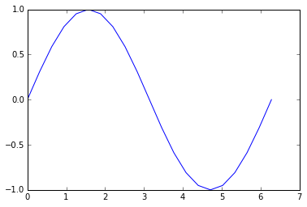
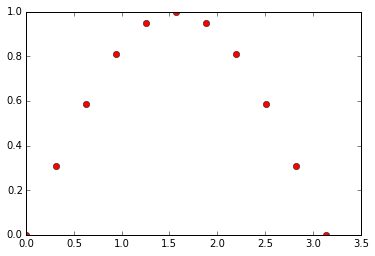
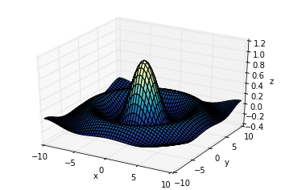
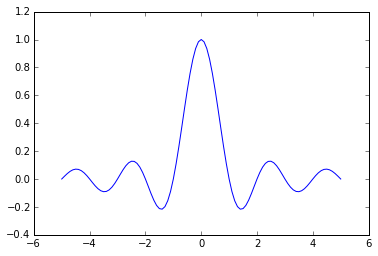
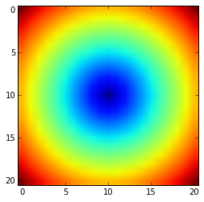

# Numpy 简介

## 导入numpy

**Numpy**是**Python**的一个很重要的第三方库，很多其他科学计算的第三方库都是以**Numpy**为基础建立的。

**Numpy**的一个重要特性是它的数组计算。

在使用**Numpy**之前，我们需要导入`numpy`包：


```python
from numpy import *
```

使用前一定要先导入 Numpy 包，导入的方法有以下几种：

```python    
    import numpy
    import numpy as np
    from numpy import *
    from numpy import array, sin
```

事实上，在**ipython**中可以使用magic命令来快速导入**Numpy**的内容。


```python
%pylab
```

    Using matplotlib backend: Qt4Agg
    Populating the interactive namespace from numpy and matplotlib


## 数组上的数学操作

假如我们想将列表中的每个元素增加`1`，但列表不支持这样的操作（报错）：


```python
a = [1, 2, 3, 4]
a + 1
```


    ---------------------------------------------------------------------------

    TypeError                                 Traceback (most recent call last)

    <ipython-input-3-068856d2a224> in <module>()
          1 a = [1, 2, 3, 4]
    ----> 2 a + 1
    

    TypeError: can only concatenate list (not "int") to list


转成 `array` ：


```python
a = array(a)
a
```


    array([1, 2, 3, 4])


`array` 数组支持每个元素加 `1` 这样的操作：


```python
a + 1
```


    array([2, 3, 4, 5])


与另一个 `array` 相加，得到对应元素相加的结果：


```python
b = array([2, 3, 4, 5])
a + b
```


    array([3, 5, 7, 9])


对应元素相乘：


```python
a * b
```


    array([ 2,  6, 12, 20])


对应元素乘方：


```python
a ** b
```


    array([   1,    8,   81, 1024])


## 提取数组中的元素

提取第一个元素：


```python
a[0]
```


    1


提取前两个元素：


```python
a[:2]
```


    array([1, 2])


最后两个元素：


```python
a[-2:]
```


    array([3, 4])


将它们相加：


```python
a[:2] + a[-2:]
```


    array([4, 6])


## 修改数组形状

查看 `array` 的形状：


```python
a.shape
```


    (4L,)


修改 `array` 的形状：


```python
a.shape = 2,2
a
```


    array([[1, 2],
           [3, 4]])


## 多维数组

`a` 现在变成了一个二维的数组，可以进行加法：


```python
a + a
```


    array([[2, 4],
           [6, 8]])


乘法仍然是对应元素的乘积，并不是按照矩阵乘法来计算：


```python
a * a
```


    array([[ 1,  4],
           [ 9, 16]])


## 画图

linspace 用来生成一组等间隔的数据：


```python
a = linspace(0, 2*pi, 21)
%precision 3
a
```


    array([ 0.   ,  0.314,  0.628,  0.942,  1.257,  1.571,  1.885,  2.199,
            2.513,  2.827,  3.142,  3.456,  3.77 ,  4.084,  4.398,  4.712,
            5.027,  5.341,  5.655,  5.969,  6.283])


三角函数：


```python
b = sin(a)
b
```


    array([  0.000e+00,   3.090e-01,   5.878e-01,   8.090e-01,   9.511e-01,
             1.000e+00,   9.511e-01,   8.090e-01,   5.878e-01,   3.090e-01,
             1.225e-16,  -3.090e-01,  -5.878e-01,  -8.090e-01,  -9.511e-01,
            -1.000e+00,  -9.511e-01,  -8.090e-01,  -5.878e-01,  -3.090e-01,
            -2.449e-16])


画出图像：


```python
%matplotlib inline
plot(a, b)
```


    [<matplotlib.lines.Line2D at 0xa128ba8>]


    

    


## 从数组中选择元素

假设我们想选取数组b中所有非负的部分，首先可以利用 `b` 产生一组布尔值：


```python
b >= 0
```


    array([ True,  True,  True,  True,  True,  True,  True,  True,  True,
            True,  True, False, False, False, False, False, False, False,
           False, False, False], dtype=bool)


```python
mask = b >= 0
```

画出所有对应的非负值对应的点：


```python
plot(a[mask], b[mask], 'ro')
```


    [<matplotlib.lines.Line2D at 0xa177be0>]


    

    

# Matplotlib 基础

在使用**Numpy**之前，需要了解一些画图的基础。

**Matplotlib**是一个类似**Matlab**的工具包，主页地址为

http://matplotlib.org 

导入 `matplotlib` 和 `numpy`：


```python
%pylab
```

    Using matplotlib backend: Qt4Agg
    Populating the interactive namespace from numpy and matplotlib


## plot 二维图

```python
plot(y)
plot(x, y)
plot(x, y, format_string)
```

只给定 `y` 值，默认以下标为 `x` 轴：


```python
%matplotlib inline
x = linspace(0, 2 * pi, 50)
plot(sin(x))
```


    [<matplotlib.lines.Line2D at 0xa086fd0>]


    

    


给定 `x` 和 `y` 值：


```python
plot(x, sin(x))
```


    [<matplotlib.lines.Line2D at 0xa241898>]


    

    


多条数据线：


```python
plot(x, sin(x),
    x, sin(2 * x))
```


    [<matplotlib.lines.Line2D at 0xa508b00>,
     <matplotlib.lines.Line2D at 0xa508d30>]


    

    


使用字符串，给定线条参数：


```python
plot(x, sin(x), 'r-^')
```


    [<matplotlib.lines.Line2D at 0xba6ea20>]


    

    


多线条：


```python
plot(x, sin(x), 'b-o',
    x, sin(2 * x), 'r-^')
```


    [<matplotlib.lines.Line2D at 0xbcf1710>,
     <matplotlib.lines.Line2D at 0xbcf1940>]


    

    


更多参数设置，请查阅帮助。事实上，字符串使用的格式与**Matlab**相同。

## scatter 散点图

```python
scatter(x, y)
scatter(x, y, size)
scatter(x, y, size, color)
```

假设我们想画二维散点图：


```python
plot(x, sin(x), 'bo')
```


    [<matplotlib.lines.Line2D at 0xbd6c0b8>]


    

    


可以使用 `scatter` 达到同样的效果：


```python
scatter(x, sin(x))
```


    <matplotlib.collections.PathCollection at 0xbd996d8>


    

    


事实上，scatter函数与**Matlab**的用法相同，还可以指定它的大小，颜色等参数：


```python
x = rand(200)
y = rand(200)
size = rand(200) * 30
color = rand(200)
scatter(x, y, size, color)
# 显示颜色条
colorbar()
```


    <matplotlib.colorbar.Colorbar instance at 0x000000000C31F448>


    

    


## 多图

使用figure()命令产生新的图像：


```python
t = linspace(0, 2*pi, 50)
x = sin(t)
y = cos(t)
figure()
plot(x)
figure()
plot(y)
```


    [<matplotlib.lines.Line2D at 0xc680cf8>]


    

    


    

    


或者使用 `subplot` 在一幅图中画多幅子图：

    subplot(row, column, index)


```python
subplot(1, 2, 1)
plot(x)
subplot(1, 2, 2)
plot(y)
```


    [<matplotlib.lines.Line2D at 0xcd47518>]


    

    


## 向图中添加数据

默认多次 `plot` 会叠加：


```python
plot(x)
plot(y)
```


    [<matplotlib.lines.Line2D at 0xcbcfd30>]


    

    


可以跟**Matlab**类似用 hold(False)关掉，这样新图会将原图覆盖：


```python
plot(x)
hold(False)
plot(y)
# 恢复原来设定
hold(True)
```


    [<matplotlib.lines.Line2D at 0xcf4b9b0>]


    

    


## 标签

可以在 `plot` 中加入 `label` ，使用 `legend` 加上图例：


```python
plot(x, label='sin')
plot(y, label='cos')
legend()
```


    <matplotlib.legend.Legend at 0xd2089b0>


    

    


或者直接在 `legend`中加入：


```python
plot(x)
plot(y)
legend(['sin', 'cos'])
```


    <matplotlib.legend.Legend at 0xd51fb00>


    

    


## 坐标轴，标题，网格

可以设置坐标轴的标签和标题：


```python
plot(x, sin(x))
xlabel('radians')
# 可以设置字体大小
ylabel('amplitude', fontsize='large')
title('Sin(x)')
```


    <matplotlib.text.Text at 0xd727dd8>


    

    


用 'grid()' 来显示网格：


```python
plot(x, sin(x))
xlabel('radians')
ylabel('amplitude', fontsize='large')
title('Sin(x)')
grid()
```


    

    


## 清除、关闭图像

清除已有的图像使用：

    clf()

关闭当前图像：

    close()

关闭所有图像：

    close('all')

## imshow 显示图片

灰度图片可以看成二维数组：


```python
# 导入lena图片
from scipy.misc import lena
img = lena()
img
```


    array([[162, 162, 162, ..., 170, 155, 128],
           [162, 162, 162, ..., 170, 155, 128],
           [162, 162, 162, ..., 170, 155, 128],
           ..., 
           [ 43,  43,  50, ..., 104, 100,  98],
           [ 44,  44,  55, ..., 104, 105, 108],
           [ 44,  44,  55, ..., 104, 105, 108]])


我们可以用 `imshow()` 来显示图片数据：


```python
imshow(img,
       # 设置坐标范围
      extent = [-25, 25, -25, 25],
       # 设置colormap
      cmap = cm.bone)
colorbar()
```


    <matplotlib.colorbar.Colorbar instance at 0x000000000DECFD88>


    

    


更多参数和用法可以参阅帮助。

这里 `cm` 表示 `colormap`，可以看它的种类：


```python
dir(cm)
```


    [u'Accent',
     u'Accent_r',
     u'Blues',
     u'Blues_r',
     u'BrBG',
     u'BrBG_r',
     u'BuGn',
     u'BuGn_r',
     u'BuPu',
     u'BuPu_r',
     u'CMRmap',
     u'CMRmap_r',
     u'Dark2',
     u'Dark2_r',
     u'GnBu',
     u'GnBu_r',
     u'Greens',
     u'Greens_r',
     u'Greys',
     u'Greys_r',
     'LUTSIZE',
     u'OrRd',
     u'OrRd_r',
     u'Oranges',
     u'Oranges_r',
     u'PRGn',
     u'PRGn_r',
     u'Paired',
     u'Paired_r',
     u'Pastel1',
     u'Pastel1_r',
     u'Pastel2',
     u'Pastel2_r',
     u'PiYG',
     u'PiYG_r',
     u'PuBu',
     u'PuBuGn',
     u'PuBuGn_r',
     u'PuBu_r',
     u'PuOr',
     u'PuOr_r',
     u'PuRd',
     u'PuRd_r',
     u'Purples',
     u'Purples_r',
     u'RdBu',
     u'RdBu_r',
     u'RdGy',
     u'RdGy_r',
     u'RdPu',
     u'RdPu_r',
     u'RdYlBu',
     u'RdYlBu_r',
     u'RdYlGn',
     u'RdYlGn_r',
     u'Reds',
     u'Reds_r',
     'ScalarMappable',
     u'Set1',
     u'Set1_r',
     u'Set2',
     u'Set2_r',
     u'Set3',
     u'Set3_r',
     u'Spectral',
     u'Spectral_r',
     u'Wistia',
     u'Wistia_r',
     u'YlGn',
     u'YlGnBu',
     u'YlGnBu_r',
     u'YlGn_r',
     u'YlOrBr',
     u'YlOrBr_r',
     u'YlOrRd',
     u'YlOrRd_r',
     '__builtins__',
     '__doc__',
     '__file__',
     '__name__',
     '__package__',
     '_generate_cmap',
     '_reverse_cmap_spec',
     '_reverser',
     'absolute_import',
     u'afmhot',
     u'afmhot_r',
     u'autumn',
     u'autumn_r',
     u'binary',
     u'binary_r',
     u'bone',
     u'bone_r',
     u'brg',
     u'brg_r',
     u'bwr',
     u'bwr_r',
     'cbook',
     'cmap_d',
     'cmapname',
     'colors',
     u'cool',
     u'cool_r',
     u'coolwarm',
     u'coolwarm_r',
     u'copper',
     u'copper_r',
     'cubehelix',
     u'cubehelix_r',
     'datad',
     'division',
     u'flag',
     u'flag_r',
     'get_cmap',
     u'gist_earth',
     u'gist_earth_r',
     u'gist_gray',
     u'gist_gray_r',
     u'gist_heat',
     u'gist_heat_r',
     u'gist_ncar',
     u'gist_ncar_r',
     u'gist_rainbow',
     u'gist_rainbow_r',
     u'gist_stern',
     u'gist_stern_r',
     u'gist_yarg',
     u'gist_yarg_r',
     u'gnuplot',
     u'gnuplot2',
     u'gnuplot2_r',
     u'gnuplot_r',
     u'gray',
     u'gray_r',
     u'hot',
     u'hot_r',
     u'hsv',
     u'hsv_r',
     u'jet',
     u'jet_r',
     'ma',
     'mpl',
     u'nipy_spectral',
     u'nipy_spectral_r',
     'np',
     u'ocean',
     u'ocean_r',
     'os',
     u'pink',
     u'pink_r',
     'print_function',
     u'prism',
     u'prism_r',
     u'rainbow',
     u'rainbow_r',
     'register_cmap',
     'revcmap',
     u'seismic',
     u'seismic_r',
     'six',
     'spec',
     'spec_reversed',
     u'spectral',
     u'spectral_r',
     u'spring',
     u'spring_r',
     u'summer',
     u'summer_r',
     u'terrain',
     u'terrain_r',
     'unicode_literals',
     u'winter',
     u'winter_r']


使用不同的 `colormap` 会有不同的显示效果。


```python
imshow(img, cmap=cm.RdGy_r)
```


    <matplotlib.image.AxesImage at 0xe0883c8>


    

    


## 从脚本中运行

在脚本中使用 `plot` 时，通常图像是不会直接显示的，需要增加 `show()` 选项，只有在遇到 `show()` 命令之后，图像才会显示。

## 直方图

从高斯分布随机生成1000个点得到的直方图：


```python
hist(randn(1000))
```


    (array([   2.,    7.,   37.,  119.,  216.,  270.,  223.,   82.,   31.,   13.]),
     array([-3.65594649, -2.98847032, -2.32099415, -1.65351798, -0.98604181,
            -0.31856564,  0.34891053,  1.0163867 ,  1.68386287,  2.35133904,
             3.01881521]),
     <a list of 10 Patch objects>)


    

    


更多例子请参考下列网站：

http://matplotlib.org/gallery.html
# Numpy 数组及其索引

先导入numpy：


```python
from numpy import *
```

## 产生数组

从列表产生数组：


```python
lst = [0, 1, 2, 3]
a = array(lst)
a
```


    array([0, 1, 2, 3])


或者直接将列表传入：


```python
a = array([1, 2, 3, 4])
a
```


    array([1, 2, 3, 4])


## 数组属性

查看类型：


```python
type(a)
```


    numpy.ndarray


查看数组中的数据类型：


```python
# 32比特的整数
a.dtype
```


    dtype('int32')


查看每个元素所占的字节：


```python
a.itemsize
```


    4


查看形状，会返回一个元组，每个元素代表这一维的元素数目：


```python
# 1维数组，返回一个元组
a.shape
```


    (4L,)


或者使用：


```python
shape(a)
```


    (4L,)


`shape` 的使用历史要比 `a.shape` 久，而且还可以作用于别的类型：


```python
lst = [1,2,3,4]
shape(lst)
```


    (4L,)


查看元素数目：


```python
a.size
```


    4


```python
size(a)
```


    4


查看所有元素所占的空间：


```python
a.nbytes
```


    16


但事实上，数组所占的存储空间要比这个数字大，因为要用一个header来保存shape，dtype这样的信息。

查看数组维数：


```python
a.ndim
```


    1


## 使用fill方法设定初始值

可以使用 `fill` 方法将数组设为指定值：


```python
a.fill(-4.8)
a
```


    array([-4, -4, -4, -4])


但是与列表不同，数组中要求所有元素的 `dtype` 是一样的，如果传入参数的类型与数组类型不一样，需要按照已有的类型进行转换。

## 索引与切片

和列表相似，数组也支持索引和切片操作。

索引第一个元素：


```python
a = array([0, 1, 2, 3])
a[0]
```


    0


修改第一个元素的值：


```python
a[0] = 10
a
```


    array([10,  1,  2,  3])


切片，支持负索引：


```python
a = array([11,12,13,14,15])
a[1:3]
```


    array([12, 13])


```python
a[1:-2]
```


    array([12, 13])


```python
a[-4:3]
```


    array([12, 13])


省略参数：


```python
a[::2]
```


    array([11, 13, 15])


```python
a[-2:]
```


    array([14, 15])


假设我们记录一辆汽车表盘上每天显示的里程数：


```python
od = array([21000, 21180, 21240, 22100, 22400])
```

可以这样计算每天的旅程：


```python
dist = od[1:] - od[:-1]
dist
```


    array([180,  60, 860, 300])


在本质上，**Python**会将array的各种计算转换为类似这样的**C**代码：

```c
int compute_sum(int *arr, int N) {
    int sum = 0;
    int i;
    for (i = 0; i < N; i++) {
        sum += arr[i];
    }
    return sum;
}
```

## 多维数组及其属性

`array` 还可以用来生成多维数组：


```python
a = array([[ 0, 1, 2, 3],
           [10,11,12,13]])
a
```


    array([[ 0,  1,  2,  3],
           [10, 11, 12, 13]])


事实上我们传入的是一个以列表为元素的列表，最终得到一个二维数组。

甚至可以扩展到3D或者4D的情景。

查看形状：


```python
a.shape
```


    (2L, 4L)


这里2代表行数，4代表列数。

查看总的元素个数：


```python
# 2 * 4 = 8
a.size
```


    8


查看维数：


```python
a.ndim
```


    2


## 多维数组索引

对于二维数组，可以传入两个数字来索引：


```python
a[1, 3]
```


    13


其中，1是行索引，3是列索引，中间用逗号隔开，事实上，**Python**会将它们看成一个元组(1,3)，然后按照顺序进行对应。

可以利用索引给它赋值：


```python
a[1, 3] = -1
a
```


    array([[ 0,  1,  2,  3],
           [10, 11, 12, -1]])


事实上，我们还可以使用单个索引来索引一整行内容：


```python
# 返回第二行元组组成的array
a[1]
```


    array([10, 11, 12, -1])


**Python**会将这单个元组当成对第一维的索引，然后返回对应的内容。

## 多维数组切片

多维数组，也支持切片操作：


```python
a = array([[ 0, 1, 2, 3, 4, 5],
           [10,11,12,13,14,15],
           [20,21,22,23,24,25],
           [30,31,32,33,34,35],
           [40,41,42,43,44,45],
           [50,51,52,53,54,55]])
a
```


    array([[ 0,  1,  2,  3,  4,  5],
           [10, 11, 12, 13, 14, 15],
           [20, 21, 22, 23, 24, 25],
           [30, 31, 32, 33, 34, 35],
           [40, 41, 42, 43, 44, 45],
           [50, 51, 52, 53, 54, 55]])


想得到第一行的第 4 和第 5 两个元素：


```python
a[0, 3:5]
```


    array([3, 4])


得到最后两行的最后两列：


```python
a[4:, 4:]
```


    array([[44, 45],
           [54, 55]])


得到第三列：


```python
a[:, 2]
```


    array([ 2, 12, 22, 32, 42, 52])


每一维都支持切片的规则，包括负索引，省略：

    [lower:upper:step]

例如，取出3，5行的奇数列：


```python
a[2::2, ::2]
```


    array([[20, 22, 24],
           [40, 42, 44]])


## 切片是引用

切片在内存中使用的是引用机制。


```python
a = array([0,1,2,3,4])
b = a[2:4]
print b
```

    [2 3]


引用机制意味着，**Python**并没有为 `b` 分配新的空间来存储它的值，而是让 `b` 指向了 `a` 所分配的内存空间，因此，改变 `b` 会改变 `a` 的值：


```python
b[0] = 10
a
```


    array([ 0,  1, 10,  3,  4])


而这种现象在列表中并不会出现：


```python
a = [1,2,3,4,5]
b = a[2:3]
b[0] = 13234
print a
```

    [1, 2, 3, 4, 5]


这样做的好处在于，对于很大的数组，不用大量复制多余的值，节约了空间。

缺点在于，可能出现改变一个值改变另一个值的情况。

一个解决方法是使用copy()方法产生一个复制，这个复制会申请新的内存：


```python
a = array([0,1,2,3,4])
b = a[2:4].copy()
b[0] = 10
a
```


    array([0, 1, 2, 3, 4])


## 花式索引

切片只能支持连续或者等间隔的切片操作，要想实现任意位置的操作，需要使用花式索引 `fancy slicing` 。

### 一维花式索引

与 range 函数类似，我们可以使用 arange 函数来产生等差数组。


```python
a = arange(0, 80, 10)
a
```


    array([ 0, 10, 20, 30, 40, 50, 60, 70])


花式索引需要指定索引位置：


```python
indices = [1, 2, -3]
y = a[indices]
print y
```

    [10 20 50]


还可以使用布尔数组来花式索引：


```python
mask = array([0,1,1,0,0,1,0,0],
            dtype=bool)
```


```python
a[mask]
```


    array([10, 20, 50])


或者用布尔表达式生成 `mask`，选出了所有大于0.5的值：


```python
from numpy.random import rand
a = rand(10)
a
```


    array([ 0.37214708,  0.48594733,  0.73365131,  0.15769295,  0.30786017,
            0.62068734,  0.36940654,  0.09424167,  0.53085308,  0.12248951])


```python
mask = a > 0.5
a[mask]
```


    array([ 0.73365131,  0.62068734,  0.53085308])


mask 必须是布尔数组。

### 二维花式索引


```python
a = array([[ 0, 1, 2, 3, 4, 5],
           [10,11,12,13,14,15],
           [20,21,22,23,24,25],
           [30,31,32,33,34,35],
           [40,41,42,43,44,45],
           [50,51,52,53,54,55]])
a
```


    array([[ 0,  1,  2,  3,  4,  5],
           [10, 11, 12, 13, 14, 15],
           [20, 21, 22, 23, 24, 25],
           [30, 31, 32, 33, 34, 35],
           [40, 41, 42, 43, 44, 45],
           [50, 51, 52, 53, 54, 55]])


对于二维花式索引，我们需要给定 `row` 和 `col` 的值：


```python
a[(0,1,2,3,4), (1,2,3,4,5)]
```


    array([ 1, 12, 23, 34, 45])


返回的是一条次对角线上的5个值。


```python
a[3:, [0,2,5]]
```


    array([[30, 32, 35],
           [40, 42, 45],
           [50, 52, 55]])


返回的是最后三行的第1，3，5列。

也可以使用mask进行索引：


```python
mask = array([1,0,1,0,0,1],
            dtype=bool)
a[mask, 2]
```


    array([ 2, 22, 52])


与切片不同，花式索引返回的是原对象的一个复制而不是引用。

### “不完全”索引

只给定行索引的时候，返回整行：


```python
y = a[:3]
y
```


    array([[ 0,  1,  2,  3,  4,  5],
           [10, 11, 12, 13, 14, 15],
           [20, 21, 22, 23, 24, 25]])


这时候也可以使用花式索引取出第2，3，5行：


```python
condition = array([0,1,1,0,1],
                 dtype=bool)
a[condition]
```


    array([[10, 11, 12, 13, 14, 15],
           [20, 21, 22, 23, 24, 25],
           [40, 41, 42, 43, 44, 45]])


### 三维花式索引


```python
a = arange(64)
a.shape = 4,4,4
a
```


    array([[[ 0,  1,  2,  3],
            [ 4,  5,  6,  7],
            [ 8,  9, 10, 11],
            [12, 13, 14, 15]],
    
           [[16, 17, 18, 19],
            [20, 21, 22, 23],
            [24, 25, 26, 27],
            [28, 29, 30, 31]],
    
           [[32, 33, 34, 35],
            [36, 37, 38, 39],
            [40, 41, 42, 43],
            [44, 45, 46, 47]],
    
           [[48, 49, 50, 51],
            [52, 53, 54, 55],
            [56, 57, 58, 59],
            [60, 61, 62, 63]]])


```python
y = a[:,:,[2, -1]]
y
```


    array([[[ 2,  3],
            [ 6,  7],
            [10, 11],
            [14, 15]],
    
           [[18, 19],
            [22, 23],
            [26, 27],
            [30, 31]],
    
           [[34, 35],
            [38, 39],
            [42, 43],
            [46, 47]],
    
           [[50, 51],
            [54, 55],
            [58, 59],
            [62, 63]]])


## where语句

    where(array)

`where` 函数会返回所有非零元素的索引。

### 一维数组

先看一维的例子：


```python
a = array([0, 12, 5, 20])
```

判断数组中的元素是不是大于10：


```python
a > 10
```


    array([False,  True, False,  True], dtype=bool)


数组中所有大于10的元素的索引位置：


```python
where(a > 10)
```


    (array([1, 3], dtype=int64),)


注意到 `where` 的返回值是一个元组。

使用元组是由于 where 可以对多维数组使用，此时返回值就是多维的。

在使用的时候，我们可以这样：


```python
indices = where(a > 10)
indices = indices[0]
indices
```


    array([1, 3], dtype=int64)


或者：


```python
indices = where(a>10)[0]
indices
```


    array([1, 3], dtype=int64)


可以直接用 `where` 的返回值进行索引：


```python
loc = where(a > 10)
a[loc]
```


    array([12, 20])


### 多维数组

考虑二维数组：


```python
a = array([[0, 12, 5, 20],
           [1, 2, 11, 15]])
loc = where(a > 10)
```

返回结果是一个二维的元组，每一维代表这一维的索引值：


```python
loc
```


    (array([0, 0, 1, 1], dtype=int64), array([1, 3, 2, 3], dtype=int64))


也可以直接用来索引a：


```python
a[loc]
```


    array([12, 20, 11, 15])


或者可以这样：


```python
rows, cols = where(a>10)
```


```python
rows
```


    array([0, 0, 1, 1], dtype=int64)


```python
cols
```


    array([1, 3, 2, 3], dtype=int64)


```python
a[rows, cols]
```


    array([12, 20, 11, 15])


再看另一个例子：


```python
a = arange(25)
a.shape = 5,5
a
```


    array([[ 0,  1,  2,  3,  4],
           [ 5,  6,  7,  8,  9],
           [10, 11, 12, 13, 14],
           [15, 16, 17, 18, 19],
           [20, 21, 22, 23, 24]])


```python
a > 12
```


    array([[False, False, False, False, False],
           [False, False, False, False, False],
           [False, False, False,  True,  True],
           [ True,  True,  True,  True,  True],
           [ True,  True,  True,  True,  True]], dtype=bool)


```python
where(a > 12)
```


    (array([2, 2, 3, 3, 3, 3, 3, 4, 4, 4, 4, 4], dtype=int64),
     array([3, 4, 0, 1, 2, 3, 4, 0, 1, 2, 3, 4], dtype=int64))


# 数组类型


```python
from numpy import *
```

之前已经看过整数数组和布尔数组，除此之外还有浮点数数组和复数数组。

## 复数数组

产生一个复数数组：


```python
a = array([1 + 1j, 2, 3, 4])
```

**Python**会自动判断数组的类型：


```python
a.dtype
```


    dtype('complex128')


对于复数我们可以查看它的实部和虚部：


```python
a.real
```


    array([ 1.,  2.,  3.,  4.])


```python
a.imag
```


    array([ 1.,  0.,  0.,  0.])


还可以设置它们的值：


```python
a.imag = [1,2,3,4]
```

查看 `a`：


```python
a
```


    array([ 1.+1.j,  2.+2.j,  3.+3.j,  4.+4.j])


查看复共轭：


```python
a.conj()
```


    array([ 1.-1.j,  2.-2.j,  3.-3.j,  4.-4.j])


事实上，这些属性方法可以用在浮点数或者整数数组上：


```python
a = array([0.,1,2,3])
a.dtype
```


    dtype('float64')


```python
a.real
```


    array([ 0.,  1.,  2.,  3.])


```python
a.imag
```


    array([ 0.,  0.,  0.,  0.])


```python
a.conj()
```


    array([ 0.,  1.,  2.,  3.])


但这里，虚部是只读的，并不能修改它的值：


```python
# 会报错
a.imag = [1,2,3,4]
```


    ---------------------------------------------------------------------------

    TypeError                                 Traceback (most recent call last)

    <ipython-input-13-3db28f506ec9> in <module>()
          1 # 会报错
    ----> 2 a.imag = [1,2,3,4]
    

    TypeError: array does not have imaginary part to set


## 指定数组类型

之前已经知道，构建数组的时候，数组会根据传入的内容自动判断类型：


```python
a = array([0,1.0,2,3])
```

对于浮点数，默认为双精度：


```python
a.dtype
```


    dtype('float64')


查看所用字节（`8 bytes * 4`）：


```python
a.nbytes
```


    32


当然，我们也可以在构建的时候指定类型：


```python
a = array([0,1.0,2,3],
         dtype=float32)
```

此时类型为单精度浮点数：


```python
a.dtype
```


    dtype('float32')


查看所用字节（`4 bytes * 4`）：


```python
a.nbytes
```


    16


除此之外，还可以指定有无符号，例如无符号整数：


```python
a = array([0,1,2,3],
         dtype=uint8)
a.dtype
```


    dtype('uint8')


`uint8` 只使用一个字节，表示 `0` 到 `255` 的整数。

还可以从二进制数据中读取。

先写入二进制数据：


```python
a = array([102,111,212], 
          dtype=uint8)
a.tofile('foo.dat')
```

从数据中读入，要指定类型：


```python
b = frombuffer('foo', 
               dtype=uint8)
b
```


    array([102, 111, 111], dtype=uint8)


清理数据文件：


```python
import os
os.remove('foo.dat')
```

`0-255` 的数字可以表示ASCⅡ码，我们可以用 ord 函数来查看字符的ASCⅡ码值：


```python
ord('f')
```


    102


```python
ord('S')
```


    83


## Numpy 类型

具体如下：

|基本类型|可用的**Numpy**类型|备注
|--|--|--
|布尔型|`bool`|占1个字节
|整型|`int8, int16, int32, int64, int128, int`| `int` 跟**C**语言中的 `long` 一样大
|无符号整型|`uint8, uint16, uint32, uint64, uint128, uint`| `uint` 跟**C**语言中的 `unsigned long` 一样大
|浮点数| `float16, float32, float64, float, longfloat`|默认为双精度 `float64` ，`longfloat` 精度大小与系统有关
|复数| `complex64, complex128, complex, longcomplex`| 默认为 `complex128` ，即实部虚部都为双精度
|字符串| `string, unicode` | 可以使用 `dtype=S4` 表示一个4字节字符串的数组
|对象| `object` |数组中可以使用任意值|
|Records| `void` ||
|时间| `datetime64, timedelta64` ||

任意类型的数组：


```python
a = array([1,1.2,'hello', [10,20,30]], 
          dtype=object)
```

乘法：


```python
a * 2
```


    array([2, 2.4, 'hellohello', [10, 20, 30, 10, 20, 30]], dtype=object)


## 类型转换

转换数组的类型：


```python
a = array([1.5, -3], 
         dtype=float32)
a
```


    array([ 1.5, -3. ], dtype=float32)


### asarray 函数

使用 `asarray` 函数：


```python
asarray(a, dtype=float64)
```


    array([ 1.5, -3. ])


```python
asarray(a, dtype=uint8)
```


    array([  1, 253], dtype=uint8)


`asarray` 不会修改原来数组的值：


```python
a
```


    array([ 1.5, -3. ], dtype=float32)


但当类型相同的时候，`asarray` 并不会产生新的对象，而是使用同一个引用：


```python
b = asarray(a, dtype=float32)
```


```python
b is a 
```


    True


这么做的好处在与，`asarray` 不仅可以作用于数组，还可以将其他类型转化为数组。

有些时候为了保证我们的输入值是数组，我们需要将其使用 `asarray` 转化，当它已经是数组的时候，并不会产生新的对象，这样保证了效率。


```python
asarray([1,2,3,4])
```


    array([1, 2, 3, 4])


### astype 方法

`astype` 方法返回一个新数组：


```python
a.astype(float64)
```


    array([ 1.5, -3. ])


```python
a.astype(uint8)
```


    array([  1, 253], dtype=uint8)


astype也不会改变原来数组的值：


```python
a
```


    array([ 1.5, -3. ], dtype=float32)


另外，`astype` 总是返回原来数组的一份复制，即使转换的类型是相同的：


```python
b = a.astype(float32)
print a
print b
```

    [ 1.5 -3. ]
    [ 1.5 -3. ]


```python
a is b
```


    False


### view 方法


```python
a = array((1,2,3,4), dtype=int32)
a
```


    array([1, 2, 3, 4])


`view` 会将 `a` 在内存中的表示看成是 `uint8` 进行解析：


```python
b = a.view(uint8)
b
```


    array([1, 0, 0, 0, 2, 0, 0, 0, 3, 0, 0, 0, 4, 0, 0, 0], dtype=uint8)


```python
a[0] = 2**30
a
```


    array([1073741824,          2,          3,          4])


修改 `a` 会修改 `b` 的值，因为共用一块内存：


```python
b
```


    array([ 0,  0,  0, 64,  2,  0,  0,  0,  3,  0,  0,  0,  4,  0,  0,  0], dtype=uint8)


# 数组方法


```python
%pylab
```

    Using matplotlib backend: Qt4Agg
    Populating the interactive namespace from numpy and matplotlib


## 求和


```python
a = array([[1,2,3], 
           [4,5,6]])
```

求所有元素的和：


```python
sum(a)
```


    21


指定求和的维度：

沿着第一维求和：


```python
sum(a, axis=0)
```


    array([5, 7, 9])


沿着第二维求和：


```python
sum(a, axis=1)
```


    array([ 6, 15])


沿着最后一维求和：


```python
sum(a, axis=-1)
```


    array([ 6, 15])


或者使用 `sum` 方法：


```python
a.sum()
```


    21


```python
a.sum(axis=0)
```


    array([5, 7, 9])


```python
a.sum(axis=-1)
```


    array([ 6, 15])


## 求积

求所有元素的乘积：


```python
a.prod()
```


    720


或者使用函数形式：


```python
prod(a, axis=0)
```


    array([ 4, 10, 18])


## 求最大最小值


```python
from numpy.random import rand
a = rand(3, 4)
%precision 3
a
```


    array([[ 0.444,  0.06 ,  0.668,  0.02 ],
           [ 0.793,  0.302,  0.81 ,  0.381],
           [ 0.296,  0.182,  0.345,  0.686]])


全局最小：


```python
a.min()
```


    0.020


沿着某个轴的最小：


```python
a.min(axis=0)
```


    array([ 0.296,  0.06 ,  0.345,  0.02 ])


全局最大：


```python
a.max()
```


    0.810


沿着某个轴的最大：


```python
a.max(axis=-1)
```


    array([ 0.668,  0.81 ,  0.686])


## 最大最小值的位置

使用 `argmin, argmax` 方法：


```python
a.argmin()
```


    3


```python
a.argmin(axis=0)
```


    array([2, 0, 2, 0], dtype=int64)


## 均值

可以使用 `mean` 方法：


```python
a = array([[1,2,3],[4,5,6]])
```


```python
a.mean()
```


    3.500


```python
a.mean(axis=-1)
```


    array([ 2.,  5.])


也可以使用 `mean` 函数：


```python
mean(a)
```


    3.500


还可以使用 `average` 函数：


```python
average(a, axis = 0)
```


    array([ 2.5,  3.5,  4.5])


`average` 函数还支持加权平均：


```python
average(a, axis = 0, weights=[1,2])
```


    array([ 3.,  4.,  5.])


## 标准差

用 `std` 方法计算标准差：


```python
a.std(axis=1)
```


    array([ 0.816,  0.816])


用 `var` 方法计算方差：


```python
a.var(axis=1)
```


    array([ 0.667,  0.667])


或者使用函数：


```python
var(a, axis=1)
```


    array([ 0.667,  0.667])


```python
std(a, axis=1)
```


    array([ 0.816,  0.816])


## clip 方法

将数值限制在某个范围：


```python
a
```


    array([[1, 2, 3],
           [4, 5, 6]])


```python
a.clip(3,5)
```


    array([[3, 3, 3],
           [4, 5, 5]])


小于3的变成3，大于5的变成5。

## ptp 方法

计算最大值和最小值之差：


```python
a.ptp(axis=1)
```


    array([2, 2])


```python
a.ptp()
```


    5


## round 方法

近似，默认到整数：


```python
a = array([1.35, 2.5, 1.5])
```

这里，.5的近似规则为近似到偶数值，可以参考：

https://en.wikipedia.org/wiki/Rounding#Round_half_to_odd


```python
a.round()
```


    array([ 1.,  2.,  2.])


近似到一位小数：


```python
a.round(decimals=1)
```


    array([ 1.4,  2.5,  1.5])


# 数组排序


```python
%pylab
```

    Using matplotlib backend: Qt4Agg
    Populating the interactive namespace from numpy and matplotlib


## sort 函数

先看这个例子：


```python
names = array(['bob', 'sue', 'jan', 'ad'])
weights = array([20.8, 93.2, 53.4, 61.8])

sort(weights)
```


    array([ 20.8,  53.4,  61.8,  93.2])


`sort` 返回的结果是从小到大排列的。

## argsort 函数

`argsort` 返回从小到大的排列在数组中的索引位置：


```python
ordered_indices = argsort(weights)
ordered_indices
```


    array([0, 2, 3, 1], dtype=int64)


可以用它来进行索引：


```python
weights[ordered_indices]
```


    array([ 20.8,  53.4,  61.8,  93.2])


```python
names[ordered_indices]
```


    array(['bob', 'jan', 'ad', 'sue'], 
          dtype='|S3')


使用函数并不会改变原来数组的值：


```python
weights
```


    array([ 20.8,  93.2,  53.4,  61.8])


## sort 和 argsort 方法

数组也支持方法操作：


```python
data = array([20.8,  93.2,  53.4,  61.8])
data.argsort()
```


    array([0, 2, 3, 1], dtype=int64)


`argsort` 方法与 `argsort` 函数的使用没什么区别，也不会改变数组的值。


```python
data
```


    array([ 20.8,  93.2,  53.4,  61.8])


但是 `sort`方法会改变数组的值：


```python
data.sort()
```


```python
data
```


    array([ 20.8,  53.4,  61.8,  93.2])


## 二维数组排序

对于多维数组，sort方法默认沿着最后一维开始排序：


```python
a = array([
        [.2, .1, .5], 
        [.4, .8, .3],
        [.9, .6, .7]
    ])
a
```


    array([[ 0.2,  0.1,  0.5],
           [ 0.4,  0.8,  0.3],
           [ 0.9,  0.6,  0.7]])


对于二维数组，默认相当于对每一行进行排序：


```python
sort(a)
```


    array([[ 0.1,  0.2,  0.5],
           [ 0.3,  0.4,  0.8],
           [ 0.6,  0.7,  0.9]])


改变轴，对每一列进行排序：


```python
sort(a, axis = 0)
```


    array([[ 0.2,  0.1,  0.3],
           [ 0.4,  0.6,  0.5],
           [ 0.9,  0.8,  0.7]])


## searchsorted 函数

    searchsorted(sorted_array, values)

`searchsorted` 接受两个参数，其中，第一个必需是已排序的数组。


```python
sorted_array = linspace(0,1,5)
values = array([.1,.8,.3,.12,.5,.25])
```


```python
searchsorted(sorted_array, values)
```


    array([1, 4, 2, 1, 2, 1], dtype=int64)


排序数组：

|0|1|2|3|4|
|-|-|-|-|-|
|0.0|0.25|0.5|0.75|1.0

数值：

|值|0.1|0.8|0.3|0.12|0.5|0.25|
|-|-|-|-|-|-|-|
|插入位置|1|4|2|1|2|1|

`searchsorted` 返回的值相当于保持第一个数组的排序性质不变，将第二个数组中的值插入第一个数组中的位置：

例如 `0.1` 在 [0.0, 0.25) 之间，所以插入时应当放在第一个数组的索引 `1` 处，故第一个返回值为 `1`。


```python
from numpy.random import rand
data = rand(100)
data.sort()
```

不加括号，默认是元组：


```python
bounds = .4, .6
bounds
```


    (0.4, 0.6)


返回这两个值对应的插入位置：


```python
low_idx, high_idx = searchsorted(data, bounds)
```

利用插入位置，将数组中所有在这两个值之间的值提取出来：


```python
data[low_idx:high_idx]
```


    array([ 0.41122674,  0.4395727 ,  0.45609773,  0.45707137,  0.45772076,
            0.46029997,  0.46757401,  0.47525517,  0.4969198 ,  0.53068779,
            0.55764166,  0.56288568,  0.56506548,  0.57003042,  0.58035233,
            0.59279233,  0.59548555])


# 数组形状


```python
%pylab
```

    Using matplotlib backend: Qt4Agg
    Populating the interactive namespace from numpy and matplotlib


## 修改数组的形状


```python
a = arange(6)
a
```


    array([0, 1, 2, 3, 4, 5])


将形状修改为2乘3：


```python
a.shape = 2,3
a
```


    array([[0, 1, 2],
           [3, 4, 5]])


与之对应的方法是 `reshape` ，但它不会修改原来数组的值，而是返回一个新的数组：


```python
a.reshape(3,2)
```


    array([[0, 1],
           [2, 3],
           [4, 5]])


```python
a
```


    array([[0, 1, 2],
           [3, 4, 5]])


`shape` 和 `reshape` 方法不能改变数组中元素的总数，否则会报错：


```python
a.reshape(4,2)
```


    ---------------------------------------------------------------------------

    ValueError                                Traceback (most recent call last)

    <ipython-input-6-1a35a76a1693> in <module>()
    ----> 1 a.reshape(4,2)
    

    ValueError: total size of new array must be unchanged


## 使用 newaxis 增加数组维数


```python
a = arange(3)
shape(a)
```


    (3L,)


```python
y = a[newaxis, :]
shape(y)
```


    (1L, 3L)


根据插入位置的不同，可以返回不同形状的数组：


```python
y = a[:, newaxis]
shape(y)
```


    (3L, 1L)


插入多个新维度：


```python
y = a[newaxis, newaxis, :]
shape(y)
```


    (1L, 1L, 3L)


## squeeze 方法去除多余的轴


```python
a = arange(6)
a.shape = (2,1,3)
```


```python
b = a.squeeze()
b.shape
```


    (2L, 3L)


squeeze 返回一个将所有长度为1的维度去除的新数组。

## 数组转置

使用 `transpose` 返回数组的转置，本质上是将所有维度反过来：


```python
a
```


    array([[[0, 1, 2]],
    
           [[3, 4, 5]]])


对于二维数组，这相当于交换行和列：


```python
a.transpose()
```


    array([[[0, 3]],
    
           [[1, 4]],
    
           [[2, 5]]])


或者使用缩写属性：


```python
a.T
```


    array([[[0, 3]],
    
           [[1, 4]],
    
           [[2, 5]]])


注意：
- 对于复数数组，转置并不返回复共轭，只是单纯的交换轴的位置
- 转置可以作用于多维数组


```python
a = arange(60)
a
```


    array([ 0,  1,  2,  3,  4,  5,  6,  7,  8,  9, 10, 11, 12, 13, 14, 15, 16,
           17, 18, 19, 20, 21, 22, 23, 24, 25, 26, 27, 28, 29, 30, 31, 32, 33,
           34, 35, 36, 37, 38, 39, 40, 41, 42, 43, 44, 45, 46, 47, 48, 49, 50,
           51, 52, 53, 54, 55, 56, 57, 58, 59])


```python
a.shape = 3,4,5
a
```


    array([[[ 0,  1,  2,  3,  4],
            [ 5,  6,  7,  8,  9],
            [10, 11, 12, 13, 14],
            [15, 16, 17, 18, 19]],
    
           [[20, 21, 22, 23, 24],
            [25, 26, 27, 28, 29],
            [30, 31, 32, 33, 34],
            [35, 36, 37, 38, 39]],
    
           [[40, 41, 42, 43, 44],
            [45, 46, 47, 48, 49],
            [50, 51, 52, 53, 54],
            [55, 56, 57, 58, 59]]])


```python
b = a.T
b.shape
```


    (5L, 4L, 3L)


转置只是交换了轴的位置。

另一方面，转置返回的是对原数组的另一种view，所以改变转置会改变原来数组的值。


```python
a = arange(6)
a.shape = (2,3)
a
```


    array([[0, 1, 2],
           [3, 4, 5]])


修改转置：


```python
b = a.T
b[0,1] = 30
```

原数组的值也改变：


```python
a
```


    array([[ 0,  1,  2],
           [30,  4,  5]])


## 数组连接

有时我们需要将不同的数组按照一定的顺序连接起来：

    concatenate((a0,a1,...,aN), axis=0)

注意，这些数组要用 `()` 包括到一个元组中去。

除了给定的轴外，这些数组其他轴的长度必须是一样的。


```python
x = array([
        [0,1,2],
        [10,11,12]
    ])
y = array([
        [50,51,52],
        [60,61,62]
    ])
print x.shape
print y.shape
```

    (2L, 3L)
    (2L, 3L)


默认沿着第一维进行连接：


```python
z = concatenate((x,y))
z
```


    array([[ 0,  1,  2],
           [10, 11, 12],
           [50, 51, 52],
           [60, 61, 62]])


```python
z.shape
```


    (4L, 3L)


沿着第二维进行连接：


```python
z = concatenate((x,y), axis=1)
z
```


    array([[ 0,  1,  2, 50, 51, 52],
           [10, 11, 12, 60, 61, 62]])


```python
z.shape
```


    (2L, 6L)


注意到这里 `x` 和 `y` 的形状是一样的，还可以将它们连接成三维的数组，但是 `concatenate` 不能提供这样的功能，不过可以这样：


```python
z = array((x,y))
```


```python
z.shape
```


    (2L, 2L, 3L)


事实上，**Numpy**提供了分别对应这三种情况的函数：

- vstack
- hstack
- dstack


```python
vstack((x, y)).shape
```


    (4L, 3L)


```python
hstack((x, y)).shape
```


    (2L, 6L)


```python
dstack((x, y)).shape
```


    (2L, 3L, 2L)


## Flatten 数组

`flatten` 方法的作用是将多维数组转化为1维数组：


```python
a = array([[0,1],
           [2,3]])
b = a.flatten()
b
```


    array([0, 1, 2, 3])


返回的是数组的复制，因此，改变 `b` 并不会影响 `a` 的值：


```python
b[0] = 10
print b
print a
```

    [10  1  2  3]
    [[0 1]
     [2 3]]


## flat 属性

还可以使用数组自带的 `flat` 属性：


```python
a.flat
```


    <numpy.flatiter at 0x3d546a0>


`a.flat` 相当于返回了所有元组组成的一个迭代器：


```python
b = a.flat
```


```python
b[0]
```


    0


但此时修改 `b` 的值会影响 `a` ：


```python
b[0] = 10
print a
```

    [[10  1]
     [ 2  3]]


```python
a.flat[:]
```


    array([10,  1,  2,  3])


## ravel 方法

除此之外，还可以使用 `ravel` 方法，`ravel` 使用高效的表示方式：


```python
a = array([[0,1],
           [2,3]])
b = a.ravel()
b
```


    array([0, 1, 2, 3])


修改 `b` 会改变 `a` ：


```python
b[0] = 10
a
```


    array([[10,  1],
           [ 2,  3]])


但另一种情况下：


```python
a = array([[0,1],
           [2,3]])
aa = a.transpose()
b = aa.ravel()
b
```


    array([0, 2, 1, 3])


```python
b[0] = 10
```


```python
aa
```


    array([[0, 2],
           [1, 3]])


```python
a
```


    array([[0, 1],
           [2, 3]])


可以看到，在这种情况下，修改 `b` 并不会改变 `aa` 的值，原因是我们用来 `ravel` 的对象 `aa` 本身是 `a` 的一个view。

## atleast_xd 函数

保证数组至少有 `x` 维：


```python
x = 1
atleast_1d(x)
```


    array([1])


```python
a = array([1,2,3])
b = atleast_2d(a)
b.shape
```


    (1L, 3L)


```python
b
```


    array([[1, 2, 3]])


```python
c = atleast_3d(b)
```


```python
c.shape
```


    (1L, 3L, 1L)


`x` 可以取值 1，2，3。

在**Scipy**库中，这些函数被用来保证输入满足一定的条件：“ 

|用法|**Scipy**中出现次数|
|-|-|
|value.flaten() <br> value.flat <br>  value.ravel() |     ~2000次
| atleast_1d(value) <br> atleast_2d(value)  |~700次
| asarray(value)    |~4000次
# 对角线

这里，使用与之前不同的导入方法：


```python
import numpy as np
```

使用numpy中的函数前，需要加上 `np.`：


```python
a = np.array([11,21,31,12,22,32,13,23,33])
a.shape = 3,3
a
```


    array([[11, 21, 31],
           [12, 22, 32],
           [13, 23, 33]])


查看它的对角线元素：


```python
a.diagonal()
```


    array([11, 22, 33])


可以使用偏移来查看它的次对角线，正数表示右移，负数表示左移：


```python
a.diagonal(offset=1)
```


    array([21, 32])


```python
a.diagonal(offset=-1)
```


    array([12, 23])


可以使用花式索引来得到对角线：


```python
i = [0,1,2]
a[i, i]
```


    array([11, 22, 33])


可以更新对角线的值：


```python
a[i, i] = 2
a
```


    array([[ 2, 21, 31],
           [12,  2, 32],
           [13, 23,  2]])


修改次对角线的值：


```python
i = np.array([0,1])
a[i, i + 1] = 1
a
```


    array([[ 2,  1, 31],
           [12,  2,  1],
           [13, 23,  2]])


```python
a[i + 1, i] = -1
a
```


    array([[ 2,  1, 31],
           [-1,  2,  1],
           [13, -1,  2]])


# 数组与字符串的转换

## tostring 方法


```python
import numpy as np
```


```python
a = np.array([[1,2],
           [3,4]], 
          dtype = np.uint8)
```

转化为字符串：


```python
a.tostring()
```


    '\x01\x02\x03\x04'


我们可以使用不同的顺序来转换字符串：


```python
a.tostring(order='F')
```


    '\x01\x03\x02\x04'


这里使用了**Fortran**的格式，按照列来读数据。

## fromstring 函数

可以使用 `fromstring` 函数从字符串中读出数据，不过要指定类型：


```python
s = a.tostring()
a = np.fromstring(s, 
                  dtype=np.uint8)
a
```


    array([1, 2, 3, 4], dtype=uint8)


此时，返回的数组是一维的，需要重新设定维度：


```python
a.shape = 2,2
a
```


    array([[1, 2],
           [3, 4]], dtype=uint8)


对于文本文件，推荐使用
- `loadtxt`
- `genfromtxt`
- `savetxt`

对于二进制文本文件，推荐使用 
- `save` 
- `load`
- `savez`
# 数组属性方法总结

||作用|
|-|-|
|1|**基本属性**
|`a.dtype`|数组元素类型 `float32,uint8,...`
|`a.shape`|数组形状 `(m,n,o,...)`
|`a.size`|数组元素数
|`a.itemsize`|每个元素占字节数
|`a.nbytes`|所有元素占的字节
|`a.ndim`|数组维度
|2|**形状相关**
|`a.flat`|所有元素的迭代器
|`a.flatten()`|返回一个1维数组的复制
|`a.ravel()`|返回一个1维数组，高效
|`a.resize(new_size)`|改变形状
|`a.swapaxes(axis1, axis2)`|交换两个维度的位置
|`a.transpose(*axex)`|交换所有维度的位置
|`a.T`|转置，`a.transpose()`
|`a.squeeze()`| 去除所有长度为1的维度
|3|**填充复制**
|`a.copy()`| 返回数组的一个复制
|`a.fill(value)`| 将数组的元组设置为特定值
|4|**转化**
|`a.tolist()`|将数组转化为列表
|`a.tostring()`|转换为字符串
|`a.astype(dtype)`|转化为指定类型
|`a.byteswap(False)`|转换大小字节序
|`a.view(type_or_dtype)`|生成一个使用相同内存，但使用不同的表示方法的数组
|5|**复数**
|`a.imag`|虚部
|`a.real`|实部
|`a.conjugate()`|复共轭
|`a.conj()`|复共轭（缩写）
|6|**保存**
|`a.dump(file)`|将二进制数据存在file中
|`a.dump()`|将二进制数据表示成字符串
|`a.tofile(fid, sep="",format="%s")`|格式化ASCⅡ码写入文件
|7|**查找排序**
|`a.nonzero()`|返回所有非零元素的索引
|`a.sort(axis=-1)`|沿某个轴排序
|`a.argsort(axis=-1)`|沿某个轴，返回按排序的索引
|`a.searchsorted(b)`|返回将b中元素插入a后能保持有序的索引值
|8|**元素数学操作**
|`a.clip(low, high)`|将数值限制在一定范围内
|`a.round(decimals=0)`|近似到指定精度
|`a.cumsum(axis=None)`|累加和
|`a.cumprod(axis=None)`|累乘积
|9|**约简操作**
|`a.sum(axis=None)`|求和
|`a.prod(axis=None)`|求积
|`a.min(axis=None)`|最小值
|`a.max(axis=None)`|最大值
|`a.argmin(axis=None)`|最小值索引
|`a.argmax(axis=None)`|最大值索引
|`a.ptp(axis=None)`|最大值减最小值
|`a.mean(axis=None)`|平均值
|`a.std(axis=None)`|标准差
|`a.var(axis=None)`|方差
|`a.any(axis=None)`|只要有一个不为0，返回真，逻辑或
|`a.all(axis=None)`|所有都不为0，返回真，逻辑与


```python
from numpy import *
```

## 基本属性


```python
a = array([[0, 1, 2, 3], [4, 5, 6, 7]])
a
```


    array([[0, 1, 2, 3],
           [4, 5, 6, 7]])


数组元素属性：


```python
a.dtype
```


    dtype('int32')


形状：


```python
a.shape
```


    (2L, 4L)


元素数目：


```python
a.size
```


    8


元素占字节大小：


```python
a.itemsize
```


    4


所有元素所占字节：


```python
a.nbytes
```


    32


数据维度：


```python
a.ndim
```


    2


## 形状相关


```python
for row in a:
    print row
```

    [0 1 2 3]
    [4 5 6 7]


所有元素的迭代器：


```python
for elt in a.flat:
    print elt
```

    0
    1
    2
    3
    4
    5
    6
    7


所有元素组成的一维数组，按照行排列：


```python
a.flatten()
```


    array([0, 1, 2, 3, 4, 5, 6, 7])


```python
a.ravel()
```


    array([0, 1, 2, 3, 4, 5, 6, 7])


重新改变形状：


```python
a.resize((4,2))
a
```


    array([[0, 1],
           [2, 3],
           [4, 5],
           [6, 7]])


交换这两个轴的顺序：


```python
a.swapaxes(0,1)
```


    array([[0, 2, 4, 6],
           [1, 3, 5, 7]])


转置：


```python
a.transpose()
```


    array([[0, 2, 4, 6],
           [1, 3, 5, 7]])


转置：


```python
a.T
```


    array([[0, 2, 4, 6],
           [1, 3, 5, 7]])


```python
a2 = array([1,2,3])
a2.shape
```


    (3L,)


```python
a2.resize((1,3,1))
a2.shape
```


    (1L, 3L, 1L)


去除长度为1的维度：


```python
a2 = a2.squeeze()
a2.shape
```


    (3L,)


## 填充复制

复制：


```python
b = a.copy()
b
```


    array([[0, 1],
           [2, 3],
           [4, 5],
           [6, 7]])


复制不影响原来的数组：


```python
b[0][0] = -1
b # First value changed
```


    array([[-1,  1],
           [ 2,  3],
           [ 4,  5],
           [ 6,  7]])


```python
a # original not changed because b is a copy
```


    array([[0, 1],
           [2, 3],
           [4, 5],
           [6, 7]])


填充：


```python
b.fill(4)
b
```


    array([[4, 4],
           [4, 4],
           [4, 4],
           [4, 4]])


## 转化

转化为列表：


```python
a.tolist()
```


    [[0, 1], [2, 3], [4, 5], [6, 7]]


转化为字符串：


```python
a.tostring()
```


    '\x00\x00\x00\x00\x01\x00\x00\x00\x02\x00\x00\x00\x03\x00\x00\x00\x04\x00\x00\x00\x05\x00\x00\x00\x06\x00\x00\x00\x07\x00\x00\x00'


改变数组元素类型：


```python
a.astype(float)
```


    array([[ 0.,  1.],
           [ 2.,  3.],
           [ 4.,  5.],
           [ 6.,  7.]])


```python
b = a.copy()
b.byteswap(False)
```


    array([[        0,  16777216],
           [ 33554432,  50331648],
           [ 67108864,  83886080],
           [100663296, 117440512]])


将它看成16位整数：


```python
a.view(dtype=int16)
```


    array([[0, 0, 1, 0],
           [2, 0, 3, 0],
           [4, 0, 5, 0],
           [6, 0, 7, 0]], dtype=int16)


## 复数

实部：


```python
b = array([1+2j, 3+4j, 5+6j])
b.real
```


    array([ 1.,  3.,  5.])


虚部：


```python
b.imag
```


    array([ 2.,  4.,  6.])


共轭：


```python
b.conj()
```


    array([ 1.-2.j,  3.-4.j,  5.-6.j])


```python
b.conjugate()
```


    array([ 1.-2.j,  3.-4.j,  5.-6.j])


## 保存

保存成文本：


```python
a.dump("file.txt")
```

字符串：


```python
a.dumps()
```


    '\x80\x02cnumpy.core.multiarray\n_reconstruct\nq\x01cnumpy\nndarray\nq\x02K\x00\x85U\x01b\x87Rq\x03(K\x01\x8a\x01\x04\x8a\x01\x02\x86cnumpy\ndtype\nq\x04U\x02i4K\x00K\x01\x87Rq\x05(K\x03U\x01<NNNJ\xff\xff\xff\xffJ\xff\xff\xff\xffK\x00tb\x89U \x00\x00\x00\x00\x01\x00\x00\x00\x02\x00\x00\x00\x03\x00\x00\x00\x04\x00\x00\x00\x05\x00\x00\x00\x06\x00\x00\x00\x07\x00\x00\x00tb.'


写入文件：


```python
a.tofile('foo.csv', sep=',', format="%s")
```

## 查找排序

非零元素的索引：


```python
a.nonzero()
```


    (array([0, 1, 1, 2, 2, 3, 3], dtype=int64),
     array([1, 0, 1, 0, 1, 0, 1], dtype=int64))


排序：


```python
b = array([3,2,7,4,1])
b.sort()
b
```


    array([1, 2, 3, 4, 7])


排序的索引位置：


```python
b = array([2,3,1])
b.argsort(axis=-1)
```


    array([2, 0, 1], dtype=int64)


将 `b` 插入 `a` 中的索引，使得 `a` 保持有序：


```python
a = array([1,3,4,6])
b = array([0,2,5])
a.searchsorted(b)
```


    array([0, 1, 3], dtype=int64)


## 元素数学操作

限制在一定范围：


```python
a = array([[4,1,3],[2,1,5]])
a.clip(0,2)
```


    array([[2, 1, 2],
           [2, 1, 2]])


近似：


```python
a = array([1.344, 2.449, 2.558])
a.round(decimals=2)
```


    array([ 1.34,  2.45,  2.56])


累加和：


```python
a = array([[4,1,3],[2,1,5]])
a.cumsum(axis=None)
```


    array([ 4,  5,  8, 10, 11, 16])


累乘积：


```python
a.cumprod(axis=None)
```


    array([  4,   4,  12,  24,  24, 120])


## 约简操作

求和：


```python
a = array([[4,1,3],[2,1,5]])
a.sum(axis=None)
```


    16


求积：


```python
a.prod(axis=None)
```


    120


最小值：


```python
a.min(axis=None)
```


    1


最大值：


```python
a.max(axis=None)
```


    5


最小值索引：


```python
a.argmin(axis=None)
```


    1


最大值索引：


```python
a.argmax(axis=None)
```


    5


最大间隔：


```python
a.ptp(axis=None)
```


    4


均值：


```python
a.mean(axis=None)
```


    2.6666666666666665


标准差：


```python
a.std(axis=None)
```


    1.49071198499986


方差：


```python
a.var(axis=None)
```


    2.2222222222222228


是否有非零元素：


```python
a.any(axis=None)
```


    True


是否全部非零：


```python
a.all()
```


    True


删除生成的文件：


```python
import os
os.remove('foo.csv')
os.remove('file.txt')
```
# 生成数组的函数

## arange

`arange` 类似于**Python**中的 `range` 函数，只不过返回的不是列表，而是数组：

    arange(start, stop=None, step=1, dtype=None)

产生一个在区间 `[start, stop)` 之间，以 `step` 为间隔的数组，如果只输入一个参数，则默认从 `0` 开始，并以这个值为结束：


```python
import numpy as np
np.arange(4)
```


    array([0, 1, 2, 3])


与 `range` 不同， `arange` 允许非整数值输入，产生一个非整型的数组：


```python
np.arange(0, 2 * np.pi, np.pi / 4)
```


    array([ 0.        ,  0.78539816,  1.57079633,  2.35619449,  3.14159265,
            3.92699082,  4.71238898,  5.49778714])


数组的类型默认由参数 `start, stop, step` 来确定，也可以指定：


```python
np.arange(0, 2 * np.pi, np.pi / 4, dtype=np.float32)
```


    array([ 0.        ,  0.78539819,  1.57079637,  2.3561945 ,  3.14159274,
            3.92699099,  4.71238899,  5.49778748], dtype=float32)


由于存在精度问题，使用浮点数可能出现问题：


```python
np.arange(1.5, 2.1, 0.3)
```


    array([ 1.5,  1.8,  2.1])


`stop` 的值 `2.1` 出现在了数组中，所以使用浮点数的时候需要注意。

## linspace

    linspace(start, stop, N)

产生 `N` 个等距分布在 `[start, stop]`间的元素组成的数组，包括 `start, stop`。


```python
np.linspace(0, 1, 5)
```


    array([ 0.  ,  0.25,  0.5 ,  0.75,  1.  ])


## logspace

    logspace(start, stop, N)

产生 N 个对数等距分布的数组，默认以10为底：


```python
np.logspace(0, 1, 5)
```


    array([  1.        ,   1.77827941,   3.16227766,   5.62341325,  10.        ])


产生的值为$\left[10^0, 10^{0.25},10^{0.5},10^{0.75},10^1\right]$。

## meshgrid

有时候需要在二维平面中生成一个网格，这时候可以使用 `meshgrid` 来完成这样的工作：


```python
x_ticks = np.linspace(-1, 1, 5)
y_ticks = np.linspace(-1, 1, 5)

x, y = np.meshgrid(x_ticks, y_ticks)
```

这里产生的 `x, y`如下：


```python
x
```


    array([[-1. , -0.5,  0. ,  0.5,  1. ],
           [-1. , -0.5,  0. ,  0.5,  1. ],
           [-1. , -0.5,  0. ,  0.5,  1. ],
           [-1. , -0.5,  0. ,  0.5,  1. ],
           [-1. , -0.5,  0. ,  0.5,  1. ]])


```python
y
```


    array([[-1. , -1. , -1. , -1. , -1. ],
           [-0.5, -0.5, -0.5, -0.5, -0.5],
           [ 0. ,  0. ,  0. ,  0. ,  0. ],
           [ 0.5,  0.5,  0.5,  0.5,  0.5],
           [ 1. ,  1. ,  1. ,  1. ,  1. ]])


`x` 对应网格的第一维，`y` 对应网格的第二维。

图例：


```python
%matplotlib inline
import matplotlib.pyplot as plt
from mpl_toolkits.mplot3d import Axes3D
from matplotlib import cm

def f(x, y):
    # sinc 函数
    r = np.sqrt(x ** 2 + y ** 2)
    result = np.sin(r) / r
    result[r == 0] = 1.0
    return result

x_ticks = np.linspace(-10, 10, 51)
y_ticks = np.linspace(-10, 10, 51)

x, y = np.meshgrid(x_ticks, y_ticks)

z = f(x, y)

fig = plt.figure()
ax = fig.add_subplot(111, projection='3d')
ax.plot_surface(x, y, z,
                rstride=1, cstride=1,
                cmap=cm.YlGnBu_r)
ax.set_xlabel('x')
ax.set_ylabel('y')
ax.set_zlabel('z')
```

    c:\Miniconda\lib\site-packages\IPython\kernel\__main__.py:9: RuntimeWarning: invalid value encountered in divide


    <matplotlib.text.Text at 0x9ac1630>


    

    


事实上，`x, y` 中有很多冗余的元素，这里提供了一个 `sparse` 的选项： 


```python
x_ticks = np.linspace(-1, 1, 5)
y_ticks = np.linspace(-1, 1, 5)

x, y = np.meshgrid(x_ticks, y_ticks, sparse=True)
```


```python
x
```


    array([[-1. , -0.5,  0. ,  0.5,  1. ]])


```python
y
```


    array([[-1. ],
           [-0.5],
           [ 0. ],
           [ 0.5],
           [ 1. ]])


在这个选项下，`x, y` 变成了单一的行向量和列向量。

但这并不影响结果：


```python
x_ticks = np.linspace(-10, 10, 51)
y_ticks = np.linspace(-10, 10, 51)

x, y = np.meshgrid(x_ticks, y_ticks, sparse=True)

z = f(x, y)

fig = plt.figure()
ax = fig.add_subplot(111, projection='3d')
ax.plot_surface(x, y, z,
                rstride=1, cstride=1,
                cmap=cm.YlGnBu_r)
ax.set_xlabel('x')
ax.set_ylabel('y')
ax.set_zlabel('z')
```

    c:\Miniconda\lib\site-packages\IPython\kernel\__main__.py:9: RuntimeWarning: invalid value encountered in divide


    <matplotlib.text.Text at 0xba147f0>


    

    


`meshgrid` 可以设置轴排列的先后顺序：
- 默认为 `indexing='xy'` 即笛卡尔坐标，对于2维数组，返回行向量 `x` 和列向量 `y`
- 或者使用 `indexing='ij'` 即矩阵坐标，对于2维数组，返回列向量 `x` 和行向量 `y`。

## ogrid , mgrid

**Matlab**中有 `meshgrid` 的用法：

    meshgrid(-1:.5:1, -1:.5:1)

**Numpy**的 `meshgrid` 并不支持这样的用法，但我们可以使用 `ogrid / mgrid` 来实现类似这样的用法。

`ogrid` 与 `mgrid` 的区别在于：
- `ogrid` 相当于 `meshgrid(indexing='ij', sparse=True)`
- `mgrid` 相当于 `meshgrid(indexing='ij', sparse=False)`


```python
x, y = np.ogrid[-1:1:.5, -1:1:.5]
```


```python
x
```


    array([[-1. ],
           [-0.5],
           [ 0. ],
           [ 0.5]])


```python
y
```


    array([[-1. , -0.5,  0. ,  0.5]])


注意：
- 这里使用的是中括号
- **Matlab** 使用的是 `start:step:end` 的表示，**Numpy** 使用的是 `start:end:step` 的表示
- 这里的结果不包括 `end` 的值

为了包含 `end` 的值，我们可以使用这样的技巧：


```python
x, y = np.ogrid[-1:1:5j, -1:1:5j]
```


```python
x, y
```


    (array([[-1. ],
            [-0.5],
            [ 0. ],
            [ 0.5],
            [ 1. ]]), array([[-1. , -0.5,  0. ,  0.5,  1. ]]))


我们在 `step` 的位置传入一个复数 `5j` ，表示我们需要一个 `5` 个值的数组，此时返回值就会包含 `end` 的值。

重复之前的画图：


```python
# exchange here
y, x = np.ogrid[-10:10:51j, -10:10:51j]

z = f(x, y)

fig = plt.figure()
ax = fig.add_subplot(111, projection='3d')
ax.plot_surface(x, y, z,
                rstride=1, cstride=1,
                cmap=cm.YlGnBu_r)
ax.set_xlabel('x')
ax.set_ylabel('y')
ax.set_zlabel('z')
```

    c:\Miniconda\lib\site-packages\IPython\kernel\__main__.py:9: RuntimeWarning: invalid value encountered in divide


    <matplotlib.text.Text at 0x9e34278>


    

    


这里，我们交换了 `x, y` 输出值的顺序。

## r`_` , c`_`

我们可以使用 `r_ / c_` 来产生行向量或者列向量。

使用切片产生：


```python
np.r_[0:1:.1]
```


    array([ 0. ,  0.1,  0.2,  0.3,  0.4,  0.5,  0.6,  0.7,  0.8,  0.9])


复数步长制定数组长度：


```python
np.r_[0:1:5j]
```


    array([ 0.  ,  0.25,  0.5 ,  0.75,  1.  ])


连接多个序列，产生数组：


```python
np.r_[(3,22,11), 4.0, [15, 6]]
```


    array([  3.,  22.,  11.,   4.,  15.,   6.])


列向量：


```python
np.c_[1:3:5j]
```


    array([[ 1. ],
           [ 1.5],
           [ 2. ],
           [ 2.5],
           [ 3. ]])


## ones , zeros

```python
ones(shape, dtype=float64)
zeros(shape, dtype=float64)
```

产生一个制定形状的全 `0` 或全 `1` 的数组，还可以制定数组类型：


```python
np.zeros(3)
```


    array([ 0.,  0.,  0.])


```python
np.ones([2,3], dtype=np.float32)
```


    array([[ 1.,  1.,  1.],
           [ 1.,  1.,  1.]], dtype=float32)


产生一个全是 `5` 的数组：


```python
np.ones([2,3]) * 5
```


    array([[ 5.,  5.,  5.],
           [ 5.,  5.,  5.]])


## empty

    empty(shape, dtype=float64, order='C')

也可以使用 `empty` 方法产生一个制定大小的数组（数组所指向的内存未被初始化，所以值随机），再用 `fill` 方法填充：


```python
a = np.empty(2)
a
```


    array([-0.03412165,  0.05516321])


```python
a.fill(5)
a
```


    array([ 5.,  5.])


另一种替代方法使用索引，不过速度会稍微慢一些：


```python
a[:] = 5
a
```


    array([ 5.,  5.])


## empty`_`like, ones`_`like, zeros`_`like

    empty_like(a)
    ones_like(a)
    zeros_like(a)

产生一个跟 `a` 大小一样，类型一样的对应数组。


```python
a = np.arange(0, 10, 2.5)
a
```


    array([ 0. ,  2.5,  5. ,  7.5])


```python
np.empty_like(a)
```


    array([ 0.,  0.,  0.,  0.])


```python
np.zeros_like(a)
```


    array([ 0.,  0.,  0.,  0.])


```python
np.ones_like(a)
```


    array([ 1.,  1.,  1.,  1.])


## identity

    indentity(n, dtype=float64)
产生一个 `n` 乘 `n` 的单位矩阵：


```python
np.identity(3)
```


    array([[ 1.,  0.,  0.],
           [ 0.,  1.,  0.],
           [ 0.,  0.,  1.]])


# 矩阵

使用 `mat` 方法将 `2` 维数组转化为矩阵：


```python
import numpy as np
a = np.array([[1,2,4],
              [2,5,3], 
              [7,8,9]])
A = np.mat(a)
A
```


    matrix([[1, 2, 4],
            [2, 5, 3],
            [7, 8, 9]])


也可以使用 **Matlab** 的语法传入一个字符串来生成矩阵：


```python
A = np.mat('1,2,4;2,5,3;7,8,9')
A
```


    matrix([[1, 2, 4],
            [2, 5, 3],
            [7, 8, 9]])


利用分块创造新的矩阵：


```python
a = np.array([[ 1, 2],
              [ 3, 4]])
b = np.array([[10,20], 
              [30,40]])

np.bmat('a,b;b,a')
```


    matrix([[ 1,  2, 10, 20],
            [ 3,  4, 30, 40],
            [10, 20,  1,  2],
            [30, 40,  3,  4]])


矩阵与向量的乘法：


```python
x = np.array([[1], [2], [3]])
x
```


    array([[1],
           [2],
           [3]])


```python
A * x
```


    matrix([[17],
            [21],
            [50]])


`A.I` 表示 `A` 矩阵的逆矩阵：


```python
print A * A.I
```

    [[  1.00000000e+00   0.00000000e+00   0.00000000e+00]
     [  0.00000000e+00   1.00000000e+00   2.08166817e-17]
     [  2.22044605e-16  -8.32667268e-17   1.00000000e+00]]


矩阵指数表示矩阵连乘：


```python
print A ** 4
```

    [[ 6497  9580  9836]
     [ 7138 10561 10818]
     [18434 27220 27945]]

# 一般函数


```python
import numpy as np
```

## 三角函数

    sin(x)
    cos(x)
    tan(x)
    sinh(x)
    conh(x)
    tanh(x)
    arccos(x)
    arctan(x)
    arcsin(x)
    arccosh(x)
    arctanh(x)
    arcsinh(x)
    arctan2(x,y)

`arctan2(x,y)` 返回 `arctan(x/y)` 。

## 向量操作

    dot(x,y)
    inner(x,y)
    cross(x,y)
    vdot(x,y)
    outer(x,y)
    kron(x,y)
    tensordot(x,y[,axis])

## 其他操作

    exp(x)
    log(x)
    log10(x)
    sqrt(x)
    absolute(x)
    conjugate(x)
    negative(x)
    ceil(x)
    floor(x)
    fabs(x)
    hypot(x)
    fmod(x)
    maximum(x,y)
    minimum(x,y)

`hypot` 返回对应点 `(x,y)` 到原点的距离。


```python
x = np.array([1,2,3])
y = np.array([4,5,6])
np.hypot(x,y)
```


    array([ 4.12310563,  5.38516481,  6.70820393])


## 类型处理

    iscomplexobj
    iscomplex
    isrealobj
    isreal
    imag
    real
    real_if_close
    isscalar
    isneginf
    isposinf
    isinf
    isfinite
    isnan
    nan_to_num
    common_type
    typename

正无穷：


```python
np.inf
```


    inf


负无穷：


```python
-np.inf
```


    -inf


非法值（Not a number）：


```python
np.nan
```


    nan


检查是否为无穷：


```python
np.isinf(1.0)
```


    False


```python
np.isinf(np.inf)
```


    True


```python
np.isinf(-np.inf)
```


    True


非法值：


```python
np.array([0]) / 0.0
```

    c:\Miniconda\lib\site-packages\IPython\kernel\__main__.py:1: RuntimeWarning: invalid value encountered in divide
      if __name__ == '__main__':


    array([ nan])


这并不会报错，而是返回一个非法值。

只有 `0/0` 会得到 `nan`，非0值除以0会得到无穷：


```python
a = np.arange(5.0)
b = a / 0.0
b
```

    c:\Miniconda\lib\site-packages\IPython\kernel\__main__.py:2: RuntimeWarning: divide by zero encountered in divide
      from IPython.kernel.zmq import kernelapp as app
    c:\Miniconda\lib\site-packages\IPython\kernel\__main__.py:2: RuntimeWarning: invalid value encountered in divide
      from IPython.kernel.zmq import kernelapp as app


    array([ nan,  inf,  inf,  inf,  inf])


`nan` 与任何数进行比较都是 `False`：


```python
b == np.nan
```


    array([False, False, False, False, False], dtype=bool)


想要找出 `nan` 值需要使用 `isnan`：


```python
np.isnan(b)
```


    array([ True, False, False, False, False], dtype=bool)


## 修改形状

    atleast_1d
    atleast_2d
    atleast_3d
    expand_dims
    apply_over_axes
    apply_along_axis
    hstack
    vstack
    dstack
    column_stack
    hsplit
    vsplit
    dsplit
    split
    squeeze

## 其他有用函数

    fix
    mod
    amax
    amin
    ptp
    sum
    cumsum
    prod
    cumprod
    diff
    angle

    unwrap
    sort_complex
    trim_zeros
    fliplr
    flipud
    rot90
    diag
    eye
    select
    extract
    insert

    roots
    poly
    any
    all
    disp
    unique
    nansum
    nanmax
    nanargmax
    nanargmin
    nanmin

`nan` 开头的函数会进行相应的操作，但是忽略 `nan` 值。
# 向量化函数

自定义的 `sinc` 函数：


```
import numpy as np

def sinc(x):
    if x == 0.0:
        return 1.0
    else:
        w = np.pi * x
        return np.sin(w) / w
```

作用于单个数值：


```
sinc(0.0)
```


    1.0


```
sinc(3.0)
```


    3.8981718325193755e-17


但这个函数不能作用于数组：


```
x = np.array([1,2,3])
sinc(x)
```


    ---------------------------------------------------------------------------

    ValueError                                Traceback (most recent call last)

    <ipython-input-4-9d4f36f2aa7a> in <module>()
          1 x = np.array([1,2,3])
    ----> 2 sinc(x)
    

    <ipython-input-1-dffe464e3332> in sinc(x)
          2 
          3 def sinc(x):
    ----> 4     if x == 0.0:
          5         return 1.0
          6     else:


    ValueError: The truth value of an array with more than one element is ambiguous. Use a.any() or a.all()


可以使用 `numpy` 的 `vectorize` 将函数 `sinc` 向量化，产生一个新的函数：


```
vsinc = np.vectorize(sinc)
vsinc(x)
```


    array([  3.89817183e-17,  -3.89817183e-17,   3.89817183e-17])


其作用是为 `x` 中的每一个值调用 `sinc` 函数：


```
import matplotlib.pyplot as plt
%matplotlib inline

x = np.linspace(-5,5,101)
plt.plot(x, vsinc(x))
```


    [<matplotlib.lines.Line2D at 0xa24e4e0>]


    

    


因为这样的用法涉及大量的函数调用，因此，向量化函数的效率并不高。
# 二元运算


```python
import numpy as np
```

## 四则运算 

运算|函数
--- | --- 
`a + b` | `add(a,b)`
`a - b` | `subtract(a,b)`
`a * b` | `multiply(a,b)`
`a / b` | `divide(a,b)`
`a ** b` | `power(a,b)`
`a % b` | `remainder(a,b)`

以乘法为例，数组与标量相乘，相当于数组的每个元素乘以这个标量：


```python
a = np.array([1,2])
a * 3
```


    array([3, 6])


数组逐元素相乘：


```python
a = np.array([1,2])
b = np.array([3,4])
a * b
```


    array([3, 8])


使用函数：


```python
np.multiply(a, b)
```


    array([3, 8])


事实上，函数还可以接受第三个参数，表示将结果存入第三个参数中：


```python
np.multiply(a, b, a)
```


    array([3, 8])


```python
a
```


    array([3, 8])


## 比较和逻辑运算

运算|函数<
--- | --- 
`==` | `equal`
`!=` | `not_equal`
`>` | `greater`
`>=` | `greater_equal`
`<` | `less`
`<=` | `less_equal`
| `logical_and`
| `logical_or`
| `logical_xor`
| `logical_not`
`&` | `bitwise_and`
 | `bitwise_or`
`^` | `bitwise_xor`
`~` | `invert`
`>>` | `right_shift`
`<<` | `left_shift`

等于操作也是逐元素比较的：


```python
a = np.array([[1,2,3,4],
              [2,3,4,5]])
b = np.array([[1,2,5,4],
              [1,3,4,5]])
a == b
```


    array([[ True,  True, False,  True],
           [False,  True,  True,  True]], dtype=bool)


这意味着，如果我们在条件中要判断两个数组是否一样时，不能直接使用

    if a == b:

而要使用：

    if all(a==b):

对于浮点数，由于存在精度问题，使用函数 `allclose` 会更好：

    if allclose(a,b):

`logical_and` 也是逐元素的 `and` 操作：


```python
a = np.array([0,1,2])
b = np.array([0,10,0])

np.logical_and(a, b)
```


    array([False,  True, False], dtype=bool)


`0` 被认为是 `False`，非零则是 `True`。

比特操作：


```python
a = np.array([1,2,4,8])
b = np.array([16,32,64,128])

a | b
```


    array([ 17,  34,  68, 136])


取反：


```python
a = np.array([1,2,3,4], np.uint8)
~a
```


    array([254, 253, 252, 251], dtype=uint8)


左移：


```python
a << 3
```


    array([ 8, 16, 24, 32], dtype=uint8)


要注意的是 `&` 的运算优先于比较运算如 `>` 等，所以必要时候需要加上括号：


```python
a = np.array([1,2,4,8])
b = np.array([16,32,64,128])

(a > 3) & (b < 100)
```


    array([False, False,  True, False], dtype=bool)


# ufunc 对象

**Numpy** 有两种基本对象：`ndarray (N-dimensional array object)` 和 `ufunc (universal function object)`。`ndarray` 是存储单一数据类型的多维数组，而 `ufunc` 则是能够对数组进行处理的函数。

例如，我们之前所接触到的二元操作符对应的 **Numpy** 函数，如 `add`，就是一种 `ufunc` 对象，它可以作用于数组的每个元素。


```python
import numpy as np
```


```python
a = np.array([0,1,2])
b = np.array([2,3,4])

np.add(a, b)
```


    array([2, 4, 6])


查看支持的方法：


```python
dir(np.add)
```


    ['__call__',
     '__class__',
     '__delattr__',
     '__doc__',
     '__format__',
     '__getattribute__',
     '__hash__',
     '__init__',
     '__name__',
     '__new__',
     '__reduce__',
     '__reduce_ex__',
     '__repr__',
     '__setattr__',
     '__sizeof__',
     '__str__',
     '__subclasshook__',
     'accumulate',
     'at',
     'identity',
     'nargs',
     'nin',
     'nout',
     'ntypes',
     'outer',
     'reduce',
     'reduceat',
     'signature',
     'types']


除此之外，大部分能够作用于数组的数学函数如三角函数等，都是 `ufunc` 对象。

特别地，对于二元操作符所对应的 `ufunc` 对象，支持以下方法：

## reduce 方法

    op.reduce(a)

将`op`沿着某个轴应用，使得数组 `a` 的维数降低一维。

add 作用到一维数组上相当于求和：

$$
\begin{align}
y & = add.recuce(a) \\
& = a[0] + a[1] + ... + a[N-1] \\
& = \sum_{n=0}^{N-1} a[n]
\end{align}
$$


```python
a = np.array([1,2,3,4])

np.add.reduce(a)
```


    10


多维数组默认只按照第一维进行运算：


```python
a = np.array([[1,2,3],[4,5,6]])

np.add.reduce(a)
```


    array([5, 7, 9])


指定维度：


```python
np.add.reduce(a, 1)
```


    array([ 6, 15])


作用于字符串：


```python
a = np.array(['ab', 'cd', 'ef'], np.object)

np.add.reduce(a)
```


    'abcdef'


逻辑运算：


```python
a = np.array([1,1,0,1])

np.logical_and.reduce(a)
```


    False


```python
np.logical_or.reduce(a)
```


    True


## accumulate 方法

    op.accumulate(a)

`accumulate` 可以看成保存 `reduce` 每一步的结果所形成的数组。

$$
\begin{align}
y & = add.accumulate(a) \\
& = \left[\sum_{n=0}^{0} a[n], \sum_{n=0}^{1} a[n], ..., \sum_{n=0}^{N-1} a[n]\right]
\end{align}
$$

与之前类似：


```python
a = np.array([1,2,3,4])

np.add.accumulate(a)
```


    array([ 1,  3,  6, 10])


```python
a = np.array(['ab', 'cd', 'ef'], np.object)

np.add.accumulate(a)
```


    array(['ab', 'abcd', 'abcdef'], dtype=object)


```python
a = np.array([1,1,0,1])

np.logical_and.accumulate(a)
```


    array([ True,  True, False, False], dtype=bool)


```python
np.logical_or.accumulate(a)
```


    array([ True,  True,  True,  True], dtype=bool)


## reduceat 方法

    op.reduceat(a, indices)

`reduceat` 方法将操作符运用到指定的下标上，返回一个与 `indices` 大小相同的数组：

$$
\begin{align}
y & = add.reduceat(a, indices) \\
& = \left[\sum_{n=indice[0]}^{indice[1]-1} a[n], \sum_{n=indice[1]}^{indice[2]-1} a[n], ..., \sum_{n=indice[-1]}^{N-1} a[n]\right]
\end{align}
$$


```python
a = np.array([0, 10, 20, 30, 40, 50])
indices = np.array([1,4])

np.add.reduceat(a, indices)
```


    array([60, 90])


这里，`indices` 为 `[1, 4]`，所以 `60` 表示从下标1（包括）加到下标4（不包括）的结果，`90` 表示从下标4（包括）加到结尾的结果。

## outer 方法

    op.outer(a, b)

对于 `a` 中每个元素，将 `op` 运用到它和 `b` 的每一个元素上所得到的结果：


```python
a = np.array([0,1])
b = np.array([1,2,3])

np.add.outer(a, b)
```


    array([[1, 2, 3],
           [2, 3, 4]])


注意有顺序的区别：


```python
np.add.outer(b, a)
```


    array([[1, 2],
           [2, 3],
           [3, 4]])


# choose 函数实现条件筛选

对于数组，我们有时候需要进行类似 `switch` 和 `case` 进行条件选择，此时使用 choose 函数十分方便：


```python
import numpy as np
```


```python
control = np.array([[1,0,1],
                    [2,1,0],
                    [1,2,2]])

np.choose(control, [10, 11, 12])
```


    array([[11, 10, 11],
           [12, 11, 10],
           [11, 12, 12]])


在上面的例子中，`choose` 将 `0,1,2` 对应的值映射为了 `10, 11, 12`，这里的 `0,1,2` 表示对应的下标。

事实上， `choose` 不仅仅能接受下标参数，还可以接受下标所在的位置：


```python
i0 = np.array([[0,1,2],
               [3,4,5],
               [6,7,8]])
i2 = np.array([[20,21,22],
               [23,24,25],
               [26,27,28]])
control = np.array([[1,0,1],
                    [2,1,0],
                    [1,2,2]])

np.choose(control, [i0, 10, i2])
```


    array([[10,  1, 10],
           [23, 10,  5],
           [10, 27, 28]])


这里，`control` 传入第一个 `1` 对应的是 10，传入的第一个 `0` 对应于 `i0` 相应位置的值即 `1`，剩下的以此类推。 

下面的例子将数组中所有小于 `10` 的值变成了 `10`。


```python
a = np.array([[ 0, 1, 2], 
              [10,11,12], 
              [20,21,22]])

a < 10
```


    array([[ True,  True,  True],
           [False, False, False],
           [False, False, False]], dtype=bool)


```python
np.choose(a < 10, (a, 10))
```


    array([[10, 10, 10],
           [10, 11, 12],
           [20, 21, 22]])


下面的例子将数组中所有小于 10 的值变成了 10，大于 15 的值变成了 15。


```python
a = np.array([[ 0, 1, 2], 
              [10,11,12], 
              [20,21,22]])

lt = a < 10
gt = a > 15

choice = lt + 2 * gt
choice
```


    array([[1, 1, 1],
           [0, 0, 0],
           [2, 2, 2]])


```python
np.choose(choice, (a, 10, 15))
```


    array([[10, 10, 10],
           [10, 11, 12],
           [15, 15, 15]])


# 数组广播机制


```python
import numpy as np
```

正常的加法：


```python
a = np.array([[ 0, 0, 0],
              [10,10,10],
              [20,20,20],
              [30,30,30]])
b = np.array([[ 0, 1, 2],
              [ 0, 1, 2],
              [ 0, 1, 2],
              [ 0, 1, 2]])
a + b
```


    array([[ 0,  1,  2],
           [10, 11, 12],
           [20, 21, 22],
           [30, 31, 32]])


将 `b` 的值变成一维的 `[0,1,2]` 之后的加法：


```python
b = np.array([0,1,2])

a + b
```


    array([[ 0,  1,  2],
           [10, 11, 12],
           [20, 21, 22],
           [30, 31, 32]])


结果一样，虽然两个数组的维数不一样，但是 **Numpy** 检测到 `b` 的维度与 `a` 的维度匹配，所以将 `b` 扩展为之前的形式，得到相同的形状。

对于更高维度，这样的扩展依然有效。 

如果我们再将 `a` 变成一个列向量呢？


```python
a = np.array([0,10,20,30])
a.shape = 4,1
a
```


    array([[ 0],
           [10],
           [20],
           [30]])


```python
b
```


    array([0, 1, 2])


```python
a + b
```


    array([[ 0,  1,  2],
           [10, 11, 12],
           [20, 21, 22],
           [30, 31, 32]])


可以看到，虽然两者的维度并不相同，但是**Numpy**还是根据两者的维度，自动将它们进行扩展然后进行计算。

对于 **Numpy** 来说，维度匹配当且仅当：

- 维度相同
- 有一个的维度是1

匹配会从最后一维开始进行，直到某一个的维度全部匹配为止，因此对于以下情况，**Numpy** 都会进行相应的匹配：

A|B|Result
---|---|---
3d array: 256 x 256 x 3 | 1d array: 3 | 3d array: 256 x 256 x 3
4d array: 8 x 1 x 6 x 1 | 3d array: 7 x 1 x 5 | 3d array: 8 x 7 x 6 x 5
3d array: 5 x 4 x 3 | 1d array: 1 | 3d array: 5 x 4 x 3
3d array: 15 x 4 x 13 | 1d array: 15 x 1 x 13 | 3d array: 15 x 4 x 13
2d array: 4 x 1 | 1d array: 3 | 2d array: 4 x 3

匹配成功后，**Numpy** 会进行运算得到相应的结果。

当然，如果相应的维度不匹配，那么**Numpy**会报错：


```python
a = np.array([0,10,20,30])
a.shape
```


    (4L,)


```python
b.shape
```


    (3L,)


```python
a + b
```


    ---------------------------------------------------------------------------

    ValueError                                Traceback (most recent call last)

    <ipython-input-9-f96fb8f649b6> in <module>()
    ----> 1 a + b
    

    ValueError: operands could not be broadcast together with shapes (4,) (3,) 


将 `a` 转换为列向量，还是可以计算出结果：


```python
a[:, np.newaxis] + b
```


    array([[ 0,  1,  2],
           [10, 11, 12],
           [20, 21, 22],
           [30, 31, 32]])


## 例子


```python
x = np.linspace(-.5,.5, 21)
```


```python
y = x[:, np.newaxis]
```


```python
x.shape
```


    (21L,)


```python
y.shape
```


    (21L, 1L)


先形成一个 21 乘 21 的网格，再计算网格到原点的距离：


```python
radius = np.sqrt(x ** 2 + y ** 2)
```


```python
import matplotlib.pyplot as plt
%matplotlib inline

plt.imshow(radius)
```


    <matplotlib.image.AxesImage at 0xa2cb358>


    

    

# 数组读写

## 从文本中读取数组


```python
import numpy as np
```

### 空格（制表符）分割的文本

假设我们有这样的一个空白分割的文件：


```python
%%writefile myfile.txt
2.1 2.3 3.2 1.3 3.1
6.1 3.1 4.2 2.3 1.8
```

    Writing myfile.txt


为了生成数组，我们首先将数据转化成一个列表组成的列表，再将这个列表转换为数组：


```python
data = []

with open('myfile.txt') as f:
    # 每次读一行
    for line in f:
        fileds = line.split()
        row_data = [float(x) for x in fileds]
        data.append(row_data)

data = np.array(data)
```


```python
data
```


    array([[ 2.1,  2.3,  3.2,  1.3,  3.1],
           [ 6.1,  3.1,  4.2,  2.3,  1.8]])


不过，更简便的是使用 `loadtxt` 方法：


```python
data = np.loadtxt('myfile.txt')
data
```


    array([[ 2.1,  2.3,  3.2,  1.3,  3.1],
           [ 6.1,  3.1,  4.2,  2.3,  1.8]])


### 逗号分隔文件


```python
%%writefile myfile.txt
2.1, 2.3, 3.2, 1.3, 3.1
6.1, 3.1, 4.2, 2.3, 1.8
```

    Overwriting myfile.txt


对于逗号分隔的文件（通常为`.csv`格式）,我们可以稍微修改之前繁琐的过程，将 `split` 的参数变成 `','`即可。

不过，`loadtxt` 函数也可以读这样的文件，只需要制定分割符的参数即可：


```python
data = np.loadtxt('myfile.txt', delimiter=',')
data
```


    array([[ 2.1,  2.3,  3.2,  1.3,  3.1],
           [ 6.1,  3.1,  4.2,  2.3,  1.8]])


### loadtxt 函数

    loadtxt(fname, dtype=<type 'float'>, 
            comments='#', delimiter=None, 
            converters=None, skiprows=0, 
            usecols=None, unpack=False, ndmin=0)

`loadtxt` 有很多可选参数，其中 `delimiter` 就是刚才用到的分隔符参数。

`skiprows` 参数表示忽略开头的行数，可以用来读写含有标题的文本


```python
%%writefile myfile.txt
X Y Z MAG ANG
2.1 2.3 3.2 1.3 3.1
6.1 3.1 4.2 2.3 1.8
```

    Overwriting myfile.txt


```python
np.loadtxt('myfile.txt', skiprows=1)
```


    array([[ 2.1,  2.3,  3.2,  1.3,  3.1],
           [ 6.1,  3.1,  4.2,  2.3,  1.8]])


此外，有一个功能更为全面的 `genfromtxt` 函数，能处理更多的情况，但相应的速度和效率会慢一些。

    genfromtxt(fname, dtype=<type 'float'>, comments='#', delimiter=None, 
               skiprows=0, skip_header=0, skip_footer=0, converters=None, 
               missing='', missing_values=None, filling_values=None, usecols=None, 
               names=None, excludelist=None, deletechars=None, replace_space='_', 
               autostrip=False, case_sensitive=True, defaultfmt='f%i', unpack=None, 
               usemask=False, loose=True, invalid_raise=True)

### loadtxt 的更多特性

对于这样一个文件：


```python
%%writefile myfile.txt
 -- BEGINNING OF THE FILE
% Day, Month, Year, Skip, Power
01, 01, 2000, x876, 13 % wow!
% we don't want have Jan 03rd
04, 01, 2000, xfed, 55
```

    Overwriting myfile.txt


```python
data = np.loadtxt('myfile.txt', 
                  skiprows=1,         #忽略第一行
                  dtype=np.int,      #数组类型
                  delimiter=',',     #逗号分割
                  usecols=(0,1,2,4), #指定使用哪几列数据
                  comments='%'       #百分号为注释符
                 )
data
```


    array([[   1,    1, 2000,   13],
           [   4,    1, 2000,   55]])


### loadtxt 自定义转换方法


```python
%%writefile myfile.txt
2010-01-01 2.3 3.2
2011-01-01 6.1 3.1
```

    Overwriting myfile.txt


假设我们的文本包含日期，我们可以使用 `datetime` 在 `loadtxt` 中处理：


```python
import datetime

def date_converter(s):
    return datetime.datetime.strptime(s, "%Y-%m-%d")

data = np.loadtxt('myfile.txt',
                  dtype=np.object, #数据类型为对象
                  converters={0:date_converter,  #第一列使用自定义转换方法
                              1:float,           #第二第三使用浮点数转换
                              2:float})

data
```


    array([[datetime.datetime(2010, 1, 1, 0, 0), 2.3, 3.2],
           [datetime.datetime(2011, 1, 1, 0, 0), 6.1, 3.1]], dtype=object)


移除 `myfile.txt`：


```python
import os
os.remove('myfile.txt')
```

### 读写各种格式的文件

如下表所示：

文件格式|使用的包|函数
----|----|----
txt | numpy | loadtxt, genfromtxt, fromfile, savetxt, tofile
csv | csv | reader, writer
Matlab | scipy.io | loadmat, savemat
hdf | pytables, h5py| 
NetCDF | netCDF4, scipy.io.netcdf | netCDF4.Dataset, scipy.io.netcdf.netcdf_file
**文件格式**|**使用的包**|**备注**
wav | scipy.io.wavfile | 音频文件
jpeg,png,...| PIL, scipy.misc.pilutil | 图像文件
fits | pyfits | 天文图像

此外， `pandas` ——一个用来处理时间序列的包中包含处理各种文件的方法，具体可参见它的文档：

http://pandas.pydata.org/pandas-docs/stable/io.html

## 将数组写入文件

`savetxt` 可以将数组写入文件，默认使用科学计数法的形式保存：


```python
data = np.array([[1,2], 
                 [3,4]])

np.savetxt('out.txt', data)
```


```python
with open('out.txt') as f:
    for line in f:
        print line,
```

    1.000000000000000000e+00 2.000000000000000000e+00
    3.000000000000000000e+00 4.000000000000000000e+00


也可以使用类似**C**语言中 `printf` 的方式指定输出的格式：


```python
data = np.array([[1,2], 
                 [3,4]])

np.savetxt('out.txt', data, fmt="%d") #保存为整数
```


```python
with open('out.txt') as f:
    for line in f:
        print line,
```

    1 2
    3 4


逗号分隔的输出：


```python
data = np.array([[1,2], 
                 [3,4]])

np.savetxt('out.txt', data, fmt="%.2f", delimiter=',') #保存为2位小数的浮点数，用逗号分隔
```


```python
with open('out.txt') as f:
    for line in f:
        print line,
```

    1.00,2.00
    3.00,4.00


复数值默认会加上括号：


```python
data = np.array([[1+1j,2], 
                 [3,4]])

np.savetxt('out.txt', data, fmt="%.2f", delimiter=',') #保存为2位小数的浮点数，用逗号分隔
```


```python
with open('out.txt') as f:
    for line in f:
        print line,
```

     (1.00+1.00j), (2.00+0.00j)
     (3.00+0.00j), (4.00+0.00j)


更多参数：

    savetxt(fname, 
            X, 
            fmt='%.18e', 
            delimiter=' ', 
            newline='\n', 
            header='', 
            footer='', 
            comments='# ')

移除 `out.txt`：


```python
import os
os.remove('out.txt')
```

## Numpy 二进制格式

数组可以储存成二进制格式，单个的数组保存为 `.npy` 格式，多个数组保存为多个`.npy`文件组成的 `.npz` 格式，每个 `.npy` 文件包含一个数组。

与文本格式不同，二进制格式保存了数组的 `shape, dtype` 信息，以便完全重构出保存的数组。

保存的方法：

- `save(file, arr)` 保存单个数组，`.npy` 格式
- `savez(file, *args, **kwds)` 保存多个数组，无压缩的 `.npz` 格式
- `savez_compressed(file, *args, **kwds)` 保存多个数组，有压缩的 `.npz` 格式

读取的方法：

- `load(file, mmap_mode=None)` 对于 `.npy`，返回保存的数组，对于 `.npz`，返回一个名称-数组对组成的字典。

### 单个数组的读写


```python
a = np.array([[1.0,2.0], [3.0,4.0]])

fname = 'afile.npy'
np.save(fname, a)
```


```python
aa = np.load(fname)
aa
```


    array([[ 1.,  2.],
           [ 3.,  4.]])


删除生成的文件：


```python
import os
os.remove('afile.npy')
```

### 二进制与文本大小比较


```python
a = np.arange(10000.)
```

保存为文本：


```python
np.savetxt('a.txt', a)
```

查看大小：


```python
import os
os.stat('a.txt').st_size
```


    260000L


保存为二进制：


```python
np.save('a.npy', a)
```

查看大小：


```python
os.stat('a.npy').st_size
```


    80080L


删除生成的文件：


```python
os.remove('a.npy')
os.remove('a.txt')
```

可以看到，二进制文件大约是文本文件的三分之一。

### 保存多个数组


```python
a = np.array([[1.0,2.0], 
              [3.0,4.0]])
b = np.arange(1000)
```

保存多个数组：


```python
np.savez('data.npz', a=a, b=b)
```

查看里面包含的文件：


```python
!unzip -l data.npz
```

    Archive:  data.npz
      Length      Date    Time    Name
    ---------  ---------- -----   ----
          112  2015/08/10 00:46   a.npy
         4080  2015/08/10 00:46   b.npy
    ---------                     -------
         4192                     2 files


载入数据：


```python
data = np.load('data.npz')
```

载入后可以像字典一样进行操作：


```python
data.keys()
```


    ['a', 'b']


```python
data['a']
```


    array([[ 1.,  2.],
           [ 3.,  4.]])


```python
data['b'].shape
```


    (1000L,)


删除文件：


```python
# 要先删除 data，否则删除时会报错
del data

os.remove('data.npz')
```

### 压缩文件

当数据比较整齐时：


```python
a = np.arange(20000.)
```

无压缩大小：


```python
np.savez('a.npz', a=a)
os.stat('a.npz').st_size
```


    160188L


有压缩大小：


```python
np.savez_compressed('a2.npz', a=a)
os.stat('a2.npz').st_size
```


    26885L


大约有 6x 的压缩效果。

当数据比较混乱时：


```python
a = np.random.rand(20000.)
```

无压缩大小：


```python
np.savez('a.npz', a=a)
os.stat('a.npz').st_size
```


    160188L


有压缩大小：


```python
np.savez_compressed('a2.npz', a=a)
os.stat('a2.npz').st_size
```


    151105L


只有大约 1.06x 的压缩效果。


```python
os.remove('a.npz')
os.remove('a2.npz')
```
# 结构化数组

假设我们要保存这样的数据：

|name|age|wgt
--|--|--|--
0|dan|1|23.1
1|ann|0|25.1
2|sam|2|8.3

希望定义一个一维数组，每个元素有三个属性 `name, age, wgt`，此时我们需要使用结构化数组。


```python
import numpy as np
```

定义数组 `a`：

0|1|2|3
-|-|-|-
1.0|2.0|3.0|4.0


```python
a = np.array([1.0,2.0,3.0,4.0], np.float32)
```

使用 `view` 方法，将 `a` 对应的内存按照复数来解释：


```python
a.view(np.complex64)
```


    array([ 1.+2.j,  3.+4.j], dtype=complex64)


0|1|2|3
-|-|-|-
1.0|2.0|3.0|4.0
real|imag|real|imag

事实上，我们可以把复数看成一个结构体，第一部分是实部，第二部分是虚部，这样这个数组便可以看成是一个结构化数组。

换句话说，我们只需要换种方式解释这段内存，便可以得到结构化数组的效果！

0|1|2|3
-|-|-|-
1.0|2.0|3.0|4.0
mass|vol|mass|vol

例如，我们可以将第一个浮点数解释为质量，第二个浮点数解释为速度，则这段内存还可以看成是包含两个域（质量和速度）的结构体。


```python
my_dtype = np.dtype([('mass', 'float32'), ('vol', 'float32')])
```


```python
a.view(my_dtype)
```


    array([(1.0, 2.0), (3.0, 4.0)], 
          dtype=[('mass', '<f4'), ('vol', '<f4')])


这里，我们使用 `dtype` 创造了自定义的结构类型，然后用自定义的结构来解释数组 `a` 所占的内存。

这里 `f4` 表示四字节浮点数，`<` 表示小字节序。

利用这个自定义的结构类型，我们可以这样初始化结构化数组：


```python
my_data = np.array([(1,1), (1,2), (2,1), (1,3)], my_dtype)

print my_data
```

    [(1.0, 1.0) (1.0, 2.0) (2.0, 1.0) (1.0, 3.0)]


第一个元素：


```python
my_data[0]
```


    (1.0, 1.0)


得到第一个元素的速度信息，可以使用域的名称来索引：


```python
my_data[0]['vol']
```


    1.0


得到所有的质量信息：


```python
my_data['mass']
```


    array([ 1.,  1.,  2.,  1.], dtype=float32)


自定义排序规则，先按速度，再按质量：


```python
my_data.sort(order=('vol', 'mass'))

print my_data
```

    [(1.0, 1.0) (2.0, 1.0) (1.0, 2.0) (1.0, 3.0)]


回到最初的例子，定义一个人的结构类型：


```python
person_dtype = np.dtype([('name', 'S10'), ('age', 'int'), ('weight', 'float')])
```

查看类型所占字节数：


```python
person_dtype.itemsize
```


    22


产生一个 3 x 4 共12人的空结构体数组：


```python
people = np.empty((3,4), person_dtype)
```

分别赋值：


```python
people['name'] = [['Brad', 'Jane', 'John', 'Fred'],
                  ['Henry', 'George', 'Brain', 'Amy'],
                  ['Ron', 'Susan', 'Jennife', 'Jill']]
```


```python
people['age'] = [[33, 25, 47, 54],
                 [29, 61, 32, 27],
                 [19, 33, 18, 54]]
```


```python
people['weight'] = [[135., 105., 255., 140.],
                    [154., 202., 137., 187.],
                    [188., 135., 88., 145.]]
```


```python
print people
```

    [[('Brad', 33, 135.0) ('Jane', 25, 105.0) ('John', 47, 255.0)
      ('Fred', 54, 140.0)]
     [('Henry', 29, 154.0) ('George', 61, 202.0) ('Brain', 32, 137.0)
      ('Amy', 27, 187.0)]
     [('Ron', 19, 188.0) ('Susan', 33, 135.0) ('Jennife', 18, 88.0)
      ('Jill', 54, 145.0)]]


```python
people[-1,-1]
```


    ('Jill', 54, 145.0)


## 从文本中读取结构化数组

我们有这样一个文件：


```python
%%writefile people.txt
name age weight
amy 11 38.2
john 10 40.3
bill 12 21.2
```

    Writing people.txt


利用 `loadtxt` 指定数据类型，从这个文件中读取结构化数组：


```python
person_dtype = np.dtype([('name', 'S10'), ('age', 'int'), ('weight', 'float')])

people = np.loadtxt('people.txt', 
                    skiprows=1,
                    dtype=person_dtype)

people
```


    array([('amy', 11, 38.2), ('john', 10, 40.3), ('bill', 12, 21.2)], 
          dtype=[('name', 'S10'), ('age', '<i4'), ('weight', '<f8')])


查看 `name` 域：


```python
people['name']
```


    array(['amy', 'john', 'bill'], 
          dtype='|S10')


删除文件：


```python
import os
os.remove('people.txt')
```

对于下面的文件：


```python
%%writefile wood.csv
item,material,number
100,oak,33
110,maple,14
120,oak,7
145,birch,3
```

    Writing wood.csv


定义转换函数处理材料属性，使之对应一个整数：


```python
tree_to_int = dict(oak = 1,
                   maple=2,
                   birch=3)

def convert(s):
    return tree_to_int.get(s, 0)
```

使用 `genfromtxt` 载入数据，可以自动从第一行读入属性名称：


```python
data = np.genfromtxt('wood.csv',
                     delimiter=',', # 逗号分隔
                     dtype=np.int, # 数据类型
                     names=True,   # 从第一行读入域名
                     converters={1:convert}
                    )
```


```python
data
```


    array([(100, 1, 33), (110, 2, 14), (120, 1, 7), (145, 3, 3)], 
          dtype=[('item', '<i4'), ('material', '<i4'), ('number', '<i4')])


查看域：


```python
data['material']
```


    array([1, 2, 1, 3])


删除文件：


```python
os.remove('wood.csv')
```

## 嵌套类型

有时候，结构数组中的域可能包含嵌套的结构，例如，在我们希望在二维平面上纪录一个质点的位置和质量：

<table> 
  <th colspan="2">position
  <th rowspan="2">mass
  <tr><th>x<th>y
</table>

那么它的类型可以这样嵌套定义：


```python
particle_dtype = np.dtype([('position', [('x', 'float'), 
                                         ('y', 'float')]),
                           ('mass', 'float')
                          ])
```

假设数据文件如下：


```python
%%writefile data.txt
2.0 3.0 42.0
2.1 4.3 32.5
1.2 4.6 32.3
4.5 -6.4 23.3
```

    Overwriting data.txt


读取数据：


```python
data = np.loadtxt('data.txt', dtype=particle_dtype)
```


```python
data
```


    array([((2.0, 3.0), 42.0), ((2.1, 4.3), 32.5), ((1.2, 4.6), 32.3),
           ((4.5, -6.4), 23.3)], 
          dtype=[('position', [('x', '<f8'), ('y', '<f8')]), ('mass', '<f8')])


查看位置的 `x` 轴：


```python
data['position']['x']
```


    array([ 2. ,  2.1,  1.2,  4.5])


删除生成的文件：


```python
os.remove('data.txt')
```
# 记录数组

记录数组（`record array`）与结构数组类似：


```python
import numpy as np
```

质点类型：


```python
partical_dtype = np.dtype([('mass', 'float'), 
                           ('velocity', 'float')])
```

生成记录数组要使用 `numpy.rec` 里的 `fromrecords` 方法：


```python
from numpy import rec

particals_rec = rec.fromrecords([(1,1), (1,2), (2,1), (1,3)], 
                                dtype = partical_dtype)
```


```python
particals_rec
```


    rec.array([(1.0, 1.0), (1.0, 2.0), (2.0, 1.0), (1.0, 3.0)], 
          dtype=[('mass', '<f8'), ('velocity', '<f8')])


在记录数组中，域可以通过属性来获得：


```python
particals_rec.mass
```


    array([ 1.,  1.,  2.,  1.])


也可以通过域来查询：


```python
particals_rec['mass']
```


    array([ 1.,  1.,  2.,  1.])


不过，记录数组的运行效率要比结构化数组要慢一些。

也可以通过将一个结构化数组看成记录数组：


```python
particals = np.array([(1,1), (1,2), (2,1), (1,3)],
                     dtype = partical_dtype)
```

使用 `view` 方法看成 `recarray` ：


```python
particals_rec = particals.view(np.recarray)
```


```python
particals_rec.mass
```


    array([ 1.,  1.,  2.,  1.])


```python
particals_rec.velocity
```


    array([ 1.,  2.,  1.,  3.])


对于自定义的类型，可以通过它的 `names` 属性查看它有哪些域：


```python
particals.dtype.names
```


    ('mass', 'velocity')


# 内存映射

**Numpy** 有对内存映射的支持。

内存映射也是一种处理文件的方法，主要的函数有：

- `memmap`
- `frombuffer`
- `ndarray constructor`

内存映射文件与虚拟内存有些类似，通过内存映射文件可以保留一个地址空间的区域，同时将物理存储器提交给此区域，内存文件映射的物理存储器来自一个已经存在于磁盘上的文件，而且在对该文件进行操作之前必须首先对文件进行映射。

使用内存映射文件处理存储于磁盘上的文件时，将不必再对文件执行I/O操作，使得内存映射文件在处理大数据量的文件时能起到相当重要的作用。

## memmap

    memmap(filename,
           dtype=uint8,
           mode='r+'
           offset=0
           shape=None
           order=0)

`mode` 表示文件被打开的类型： 

- `r` 只读
- `c` 复制+写，但是不改变源文件
- `r+` 读写，使用 `flush` 方法会将更改的内容写入文件
- `w+` 写，如果存在则将数据覆盖

`offset` 表示从第几个位置开始。
# 从 Matlab 到 Numpy

##Numpy  和 Matlab 比较

**`Numpy`** 和 **`Matlab`** 有很多相似的地方，但 **`Numpy`** 并非 **`Matlab`** 的克隆，它们之间存在很多差异，例如：

`MATLAB®`|`Numpy`
---|---
基本类型为双精度浮点数组，以二维矩阵为主 | 基本类型为 `ndarray`，有特殊的 `matrix` 类
1-based 索引 | 0-based 索引
脚本主要用于线性代数计算 | 可以使用其他的 **Python** 特性 
采用值传递的方式进行计算<br>切片返回复制 | 采用引用传递的方式进行计算<br>切片返回引用
文件名必须和函数名相同 | 函数可以在任何地方任何文件中定义
收费 | 免费
2D，3D图像支持 | 依赖第三方库如 `matplotlib` 等
完全的编译环境 | 依赖于 **Python** 提供的编译环境

## array 还是 matrix？

`Numpy` 中不仅提供了 `array` 这个基本类型，还提供了支持矩阵操作的类 `matrix`，但是一般推荐使用 `array`：

- 很多 `numpy` 函数返回的是 `array`，不是 `matrix`
- 在 `array` 中，逐元素操作和矩阵操作有着明显的不同
- 向量可以不被视为矩阵

具体说来：

- `*， dot(), multiply()`
    - `array`：`*` -逐元素乘法，`dot()` -矩阵乘法
    - `matrix`：`*` -矩阵乘法，`multiply()` -逐元素乘法
- 处理向量 
    - `array`：形状为 `1xN, Nx1, N` 的向量的意义是不同的，类似于 `A[:,1]` 的操作返回的是一维数组，形状为 `N`，一维数组的转置仍是自己本身
    - `matrix`：形状为 `1xN, Nx1`，`A[:,1]` 返回的是二维 `Nx1` 矩阵
- 高维数组
    - `array`：支持大于2的维度
    - `matrix`：维度只能为2
- 属性
    - `array`：`.T` 表示转置
    - `matrix`：`.H` 表示复共轭转置，`.I` 表示逆，`.A` 表示转化为 `array` 类型
- 构造函数
    - `array`：`array` 函数接受一个（嵌套）序列作为参数——`array([[1,2,3],[4,5,6]])`
    - `matrix`：`matrix` 函数额外支持字符串参数——`matrix("[1 2 3; 4 5 6]")`

其优缺点各自如下：

- **`array`**
    - `[GOOD]` 一维数组既可以看成列向量，也可以看成行向量。`v` 在 `dot(A,v)` 被看成列向量，在 `dot(v,A)` 中被看成行向量，这样省去了转置的麻烦
    - `[BAD!]` 矩阵乘法需要使用 `dot()` 函数，如： `dot(dot(A,B),C)` vs `A*B*C`
    - `[GOOD]` 逐元素乘法很简单： `A*B`
    - `[GOOD]` 作为基本类型，是很多基于 `numpy` 的第三方库函数的返回类型
    - `[GOOD]` 所有的操作 `*,/,+,**,...` 都是逐元素的
    - `[GOOD]` 可以处理任意维度的数据
    - `[GOOD]` 张量运算

- **`matrix`**
    - `[GOOD]` 类似与 **`MATLAB`** 的操作
    - `[BAD!]` 最高维度为2
    - `[BAD!]` 最低维度也为2
    - `[BAD!]` 很多函数返回的是 `array`，即使传入的参数是 `matrix`
    - `[GOOD]` `A*B` 是矩阵乘法
    - `[BAD!]` 逐元素乘法需要调用 `multiply` 函数
    - `[BAD!]` `/` 是逐元素操作

当然在实际使用中，二者的使用取决于具体情况。

二者可以互相转化：

- `asarray` ：返回数组
- `asmatrix`（或者`mat`） ：返回矩阵
- `asanyarray` ：返回数组或者数组的子类，注意到矩阵是数组的一个子类，所以输入是矩阵的时候返回的也是矩阵

## 类 Matlab 函数

有很多类似的函数：

- `ones, zeros, empty, eye, rand, repmat`

通常这些函数的返回值是 `array`，不过 `numpy` 提供了一个 `matlib` 的子模块，子模块中的这些函数返回值为 `matrix`：


```python
import numpy
import numpy.matlib
```


```python
a = numpy.ones(7)

print a.shape
print type(a)
```

    (7L,)
    <type 'numpy.ndarray'>


```python
a = numpy.matlib.ones(7)

print a.shape
print type(a)
```

    (1L, 7L)
    <class 'numpy.matrixlib.defmatrix.matrix'>


`mat` 函数将一个数组转化为矩阵：


```python
a = numpy.array([1,2,3])

b = numpy.mat(a)

print type(b)
```

    <class 'numpy.matrixlib.defmatrix.matrix'>


有些函数被放到子模块中了，例如调用 `rand()` 函数需要使用 `numpy.random.rand()` （或者从 `matlib` 模块中生成矩阵）：


```python
a = numpy.random.rand(10)
print a
```

    [ 0.66007267  0.34794294  0.5040946   0.65044648  0.74763248  0.42486999
      0.90922612  0.69071747  0.33541076  0.08570178]


## 等效操作

假定我们已经这样导入了 `Numpy`：


```python
from numpy import *
import scipy.linalg
```

以下 `linalg` 表示的是 `numpy.linalg`，与 `scipy.linalg` 不同。

注意：**`MATLAB`** 与 **`Numpy`** 下标之间有这样几处不同：
- `1-base` vs `0-base`
- `()` vs `[]`
- `MATLAB`：`beg(:step):end`，包含结束值 `end`
- `Numpy`：`beg:end(:step)`，不包含结束值 `end`

MATLAB|Numpy|注释
---|---|---
`help func` | `info(func)`， `help(func)`， `func?`(IPython)| 查看函数帮助
`which func` |  | 查看函数在什么地方定义
`type func` | `source(func)`， `func?？`(IPython)| 查看函数源代码
`a && b` | `a and b` | 逻辑 `AND`
`1*i, 1*j, 1i, 1j` | `1j` | 复数
`eps` | `spacing(1)` | `1` 与最近浮点数的距离
`ndims(a)` | `ndim(a), a.ndim` | `a` 的维数
`numel(a)` | `size(a), a.size` | `a` 的元素个数
`size(a)` | `shape(a), a.shape` | `a` 的形状
`size(a,n)` | `a.shape[n-1]` | 第 n 维的大小
`a(2,5)` | `a[1,4]` | 第 2 行第 5 列元素
`a(2,:)` | `a[1], a[1,:]` | 第 2 行 
`a(1:5,:)` | `a[0:5]` | 第 1 至 5 行
`a(end-4:end,:)` | `a[-5:]` | 后 5 行
`a(1:3,5:9)` | `a[0:3][:,4:9]` | 特定行列（1~3 行，5~9 列）
`a([2,4,5],[1,3])` | `a[ix_([1,3,4],[0,2])]` | 特定行列（2,4,5 行的 1,3 列）
`a(3:2:21,:)` | `a[2:21:2,:]` | 特定行列（3,5,...,21 行）
`a(1:2:end,:)` | `a[ ::2,:]` | 奇数行
`a([1:end 1],:)` | `a[r_[:len(a),0]]` | 将第一行添加到末尾
`a.'` | `a.T` | 转置
`a ./ b` | `a/b` | 逐元素除法
`(a>0.5)` | `(a>0.5)` | 各个元素是否大于 0.5
`find(a>0.5)` | `nonzero(a>0.5)` | 大于 0.5 的位置
`a(a<0.5)=0` | `a[a<0.5]=0` | 小于 0.5 的设为 0
`a(:) = 3` | `a[:] = 3` | 所有元素设为 3
`y=x` | `y=x.copy()` | 将 y 设为 x
`y=x(2,:)` | `y=x[1,:].copy()` | 注意值传递和引用传递的区别
`y=x(:)` | `y=x.flatten(1)` | 将矩阵变为一个向量，这里 `1` 表示沿着列进行转化
`max(max(a))` | `a.max()` | 最大值
`max(a)` | `a.max(0)` | 每一列的最大值
`max(a,[],2)` | `a.max(1)` | 每一行的最大值
`max(a,b)` | `maximum(a,b)` | 逐元素比较，取较大的值
`a & b` | `logical_and(a, b)` | 逻辑 AND
`bitand(a, b)` | `a & b` | 逐比特 AND
`inv(a)` | `linalg.inv(a)` | a 的逆
`pinv(a)` | `linalg.inv(a)` | 伪逆
`rank(a)` | `linalg.matrix_rank(a)` | 秩
`a\b` | `linalg.solve(a,b)(如果a是方阵),linalg.lstsq(a,b)` | 解 `a x = b`
`b/a` | 求解 `a.T x.T = b.T` | 解 `x a = b`
`[U,S,V]=svd(a)` | `U, S, Vh = linalg.svd(a), V = Vh.T` | 奇异值分解
`chol(a)` | `linalg.cholesky(a).T` | Cholesky 分解
`[V,D]=eig(a)` | `D,V = linalg.eig(a)` | 特征值分解
`[V,D]=eig(a,b)` | `V,D = scipy.linalg.eig(a,b)` | 
`[V,D]=eigs(a,k)` |  | 前 k 大特征值对应的特征向量
`` | `` |
`` | `` |
`` | `` |
`` | `` |

MATLAB|numpy.array|numpy.matrix|注释
---|---|---|---
`[1,2,3;4,5,6]` | `array([[1.,2.,3.],[4.,5.,6.]])` | `mat([[1.,2.,3.],[4.,5.,6.]]), mat('1,2,3;4,5,6')` | `2x3` 矩阵
`[a b;c d]` | `vstack([hstack([a,b]), hsatck([c,d])]])` | `bmat('a b;c d')` | 分块矩阵构造
`a(end)` | `a[-1]` | `a[:,-1][0,0]` | 最后一个元素
`a'` | `a.conj().T` | `a.H` | 复共轭转置
`a * b` | `dot(a,b)` | `a * b` | 矩阵乘法
`a .* b` | `a * b` | `multiply(a,b)` | 逐元素乘法
`a.^3` | `a**3` | `power(a,3)` | 逐元素立方
`a(:,find(v>0.5))` | `a[:,nonzero(v>0.5)[0]]` | `a[:,nonzero(v.A>0.5)[0]]` | 找出行向量 `v>0.5` 对应的 `a` 中的列
`a(:,find(v>0.5))` | `a[:,v.T>0.5]` | `a[:,v.T>0.5)]` | 找出列向量 `v>0.5` 对应的 `a` 中的列
`a .* (a>0.5)` | `a * (a>0.5)` | `mat(a.A * (a>0.5).A)` | 将所有小于 0.5 的元素设为 0
`1:10` | `arange(1.,11.), r_[1.:11.], r_[1:10:10j]` | `mat(arange(1.,11.)), r_[1.:11., 'r']` | 这里 `1.` 是为了将其转化为浮点数组
`0:9` | `arange(10.), r_[:10.], r_[:9:10j]` | `mat(arange(10.)), r_[:10., 'r']` | 
`[1:10]'` | `arange(1.,11.)[:,newaxis]` | `r_[1.:11.,'c']` | 列向量
`zeros, ones, eye, diag, linspace` | `zeros, ones, eye, diag, linspace` | `mat(...)` |
`rand(3,4)` | `random.rand(3,4)` | `mat(...)` | 0~1 随机数
`[x,y]=meshgrid(0:8,0:5)` | `mgrid[0:9., 0:6.], meshgrid(r_[0:9.],r_[0:6.])` | `mat(...)` | 网格
| `ogrid[0:9.,0:6.], ix_(r_[0:9.],r_[0:6.])` | `mat()` | 建议在 `Numpy` 中使用
`[x,y]=meshgrid([1,2,4],[2,4,5])`|`meshgrid([1,2,4],[2,4,5])`|`mat(...)`|
|`ix_([1,2,4],[2,4,5])`|`mat(...)`|
`repmat(a, m, n)`|`tile(a, (m,n))`|`mat(...)`| 产生 `m x n` 个 `a`
`[a b]` | `c_[a,b]`|`concatenate((a,b),1)`| 列对齐连接
`[a; b]` | `r_[a,b]`|`concatenate((a,b))`| 行对齐连接
`norm(v)` | `sqrt(dot(v,v)), linalg.norm(v)` | `sqrt(dot(v.A,v.A)), linalg.norm(v)` | 模
`[Q,R,P]=qr(a,0)` | `Q,R = scipy.linalg.qr(a)` | `mat(...)` | QR 分解
`[L,U,P]=lu(a)` | `L,U = Sci.linalg.lu(a)` | `mat(...)` | LU 分解
`fft(a)` | `fft(a)` | `mat(...)` | FFT
`ifft(a)` | `ifft(a)` | `mat(...)` | IFFT
`sort(a)` | `sort(a),a.sort` | `mat(...)` | 排序

参考：http://wiki.scipy.org/NumPy_for_Matlab_Users#whichNotes
