## SCIentific PYthon 简介

**`Ipython`** 提供了一个很好的解释器界面。

**`Matplotlib`** 提供了一个类似 **`Matlab`** 的画图工具。

**`Numpy`** 提供了 `ndarray` 对象，可以进行快速的向量化计算。

**`Scipy`** 是 **`Python`** 中进行科学计算的一个第三方库，以 **`Numpy`** 为基础。

**`Pandas`** 是处理时间序列数据的第三方库，提供一个类似 **`R`** 语言的环境。

**`StatsModels`** 是一个统计库，着重于统计模型。

**`Scikits`** 以 **`Scipy`** 为基础，提供如 **`scikits-learn` 机器学习**和**`scikits-image` 图像处理**等高级用法。

### Scipy

**`Scipy`** 由不同科学计算领域的子模块组成：

子模块|描述
----|----
`cluster`|  聚类算法
`constants`| 物理数学常数
`fftpack`| 快速傅里叶变换
`integrate`| 积分和常微分方程求解
`interpolate`| 插值
`io`| 输入输出
`linalg`| 线性代数
`odr`| 正交距离回归
`optimize`| 优化和求根
`signal`| 信号处理
`sparse`| 稀疏矩阵
`spatial`| 空间数据结构和算法
`special`| 特殊方程
`stats`| 统计分布和函数
`weave`| C/C++ 积分

在使用 **`Scipy`** 之前，为了方便，假定这些基础的模块已经被导入：


```python
import numpy as np
import scipy as sp
import matplotlib as mpl
import matplotlib.pyplot as plt
```

使用 **Scipy** 中的子模块时，需要分别导入：


```python
from scipy import linalg, optimize
```

对于一些常用的函数，这些在子模块中的函数可以在 `scipy` 命名空间中调用。另一方面，由于 **`Scipy`** 以 **`Numpy`** 为基础，因此很多基础的 **`Numpy`** 函数可以在`scipy` 命名空间中直接调用。

我们可以使用 `numpy` 中的 `info` 函数来查看函数的文档：


```python
np.info(optimize.fmin)
```

     fmin(func, x0, args=(), xtol=0.0001, ftol=0.0001, maxiter=None, maxfun=None,
          full_output=0, disp=1, retall=0, callback=None)
    
    Minimize a function using the downhill simplex algorithm.
    
    This algorithm only uses function values, not derivatives or second
    derivatives.
    
    Parameters
    ----------
    func : callable func(x,*args)
        The objective function to be minimized.
    x0 : ndarray
        Initial guess.
    args : tuple, optional
        Extra arguments passed to func, i.e. ``f(x,*args)``.
    callback : callable, optional
        Called after each iteration, as callback(xk), where xk is the
        current parameter vector.
    xtol : float, optional
        Relative error in xopt acceptable for convergence.
    ftol : number, optional
        Relative error in func(xopt) acceptable for convergence.
    maxiter : int, optional
        Maximum number of iterations to perform.
    maxfun : number, optional
        Maximum number of function evaluations to make.
    full_output : bool, optional
        Set to True if fopt and warnflag outputs are desired.
    disp : bool, optional
        Set to True to print convergence messages.
    retall : bool, optional
        Set to True to return list of solutions at each iteration.
    
    Returns
    -------
    xopt : ndarray
        Parameter that minimizes function.
    fopt : float
        Value of function at minimum: ``fopt = func(xopt)``.
    iter : int
        Number of iterations performed.
    funcalls : int
        Number of function calls made.
    warnflag : int
        1 : Maximum number of function evaluations made.
        2 : Maximum number of iterations reached.
    allvecs : list
        Solution at each iteration.
    
    See also
    --------
    minimize: Interface to minimization algorithms for multivariate
        functions. See the 'Nelder-Mead' `method` in particular.
    
    Notes
    -----
    Uses a Nelder-Mead simplex algorithm to find the minimum of function of
    one or more variables.
    
    This algorithm has a long history of successful use in applications.
    But it will usually be slower than an algorithm that uses first or
    second derivative information. In practice it can have poor
    performance in high-dimensional problems and is not robust to
    minimizing complicated functions. Additionally, there currently is no
    complete theory describing when the algorithm will successfully
    converge to the minimum, or how fast it will if it does.
    
    References
    ----------
    .. [1] Nelder, J.A. and Mead, R. (1965), "A simplex method for function
           minimization", The Computer Journal, 7, pp. 308-313
    
    .. [2] Wright, M.H. (1996), "Direct Search Methods: Once Scorned, Now
           Respectable", in Numerical Analysis 1995, Proceedings of the
           1995 Dundee Biennial Conference in Numerical Analysis, D.F.
           Griffiths and G.A. Watson (Eds.), Addison Wesley Longman,
           Harlow, UK, pp. 191-208.


可以用 `lookfor` 来查询特定关键词相关的函数：


```python
np.lookfor("resize array")
```

    Search results for 'resize array'
    ---------------------------------
    numpy.chararray.resize
        Change shape and size of array in-place.
    numpy.ma.resize
        Return a new masked array with the specified size and shape.
    numpy.oldnumeric.ma.resize
        The original array's total size can be any size.
    numpy.resize
        Return a new array with the specified shape.
    numpy.chararray
        chararray(shape, itemsize=1, unicode=False, buffer=None, offset=0,
    numpy.memmap
        Create a memory-map to an array stored in a *binary* file on disk.
    numpy.ma.mvoid.resize
        .. warning::


还可以指定查找的模块：


```python
np.lookfor("remove path", module="os")
```

    Search results for 'remove path'
    --------------------------------
    os.removedirs
        removedirs(path)
    os.walk
        Directory tree generator.

## 插值


```python
import numpy as np
import matplotlib.pyplot as plt
%matplotlib inline
```

设置 **`Numpy`** 浮点数显示格式：


```python
np.set_printoptions(precision=2, suppress=True)
```

从文本中读入数据，数据来自 http://kinetics.nist.gov/janaf/html/C-067.txt ，保存为结构体数组：


```python
data = np.genfromtxt("JANAF_CH4.txt", 
                  delimiter="\t", ## TAB 分隔
                  skiprows=1,     ## 忽略首行
                  names=True,     ## 读入属性
                  missing_values="INFINITE",  ## 缺失值
                  filling_values=np.inf)      ## 填充缺失值
```

显示部分数据：


```python
for row in data[:7]:
    print "{}\t{}".format(row['TK'], row['Cp'])
print "...\t..."
```

    0.0	0.0
    100.0	33.258
    200.0	33.473
    250.0	34.216
    298.15	35.639
    300.0	35.708
    350.0	37.874
    ...	...


绘图：


```python
p = plt.plot(data['TK'], data['Cp'], 'kx')
t = plt.title("JANAF data for Methane $CH_4$")
a = plt.axis([0, 6000, 30, 120])
x = plt.xlabel("Temperature (K)")
y = plt.ylabel(r"$C_p$ ($\frac{kJ}{kg K}$)")
```


    
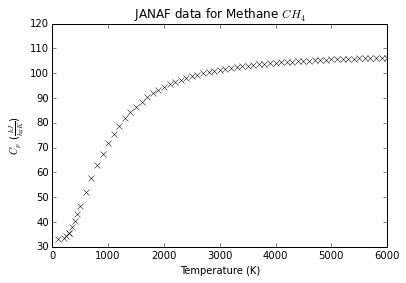
    


### 插值

假设我们要对这组数据进行插值。

先导入一维插值函数 `interp1d`：

    interp1d(x, y)


```python
from scipy.interpolate import interp1d
```


```python
ch4_cp = interp1d(data['TK'], data['Cp'])
```

`interp1d` 的返回值可以像函数一样接受输入，并返回插值的结果。

单个输入值，注意返回的是数组：


```python
ch4_cp(382.2)
```


    array(39.565144000000004)


输入数组，返回的是对应的数组：


```python
ch4_cp([32.2,323.2])
```


    array([ 10.71,  36.71])


默认情况下，输入值要在插值允许的范围内，否则插值会报错：


```python
ch4_cp(8752)
```


    ---------------------------------------------------------------------------

    ValueError                                Traceback (most recent call last)

    <ipython-input-10-5d727af9aa33> in <module>()
    ----> 1 ch4_cp(8752)
    

    d:\Miniconda\lib\site-packages\scipy\interpolate\polyint.pyc in __call__(self, x)
         77         """
         78         x, x_shape = self._prepare_x(x)
    ---> 79         y = self._evaluate(x)
         80         return self._finish_y(y, x_shape)
         81 


    d:\Miniconda\lib\site-packages\scipy\interpolate\interpolate.pyc in _evaluate(self, x_new)
        496         ##    The behavior is set by the bounds_error variable.
        497         x_new = asarray(x_new)
    --> 498         out_of_bounds = self._check_bounds(x_new)
        499         y_new = self._call(self, x_new)
        500         if len(y_new) > 0:


    d:\Miniconda\lib\site-packages\scipy\interpolate\interpolate.pyc in _check_bounds(self, x_new)
        526                 "range.")
        527         if self.bounds_error and above_bounds.any():
    --> 528             raise ValueError("A value in x_new is above the interpolation "
        529                 "range.")
        530 


    ValueError: A value in x_new is above the interpolation range.


但我们可以通过参数设置允许超出范围的值存在：


```python
ch4_cp = interp1d(data['TK'], data['Cp'], 
                  bounds_error=False)
```

不过由于超出范围，所以插值的输出是非法值：


```python
ch4_cp(8752)
```


    array(nan)


可以使用指定值替代这些非法值：


```python
ch4_cp = interp1d(data['TK'], data['Cp'], 
                  bounds_error=False, fill_value=-999.25)
```


```python
ch4_cp(8752)
```


    array(-999.25)


#### 线性插值

`interp1d` 默认的插值方法是线性，关于线性插值的定义，请参见：

- 维基百科-线性插值： https://zh.wikipedia.org/wiki/%E7%BA%BF%E6%80%A7%E6%8F%92%E5%80%BC
- 百度百科-线性插值： http://baike.baidu.com/view/4685624.htm

其基本思想是，已知相邻两点 $x_1,x_2$ 对应的值 $y_1,y_2$ ，那么对于 $(x_1,x_2)$ 之间的某一点 $x$ ，线性插值对应的值 $y$ 满足：点 $(x,y)$ 在 $(x_1,y_1),(x_2,y_2)$ 所形成的线段上。

应用线性插值：


```python
T = np.arange(100,355,5)
plt.plot(T, ch4_cp(T), "+k")
p = plt.plot(data['TK'][1:7], data['Cp'][1:7], 'ro', markersize=8)
```


    

    


其中红色的圆点为原来的数据点，黑色的十字点为对应的插值点，可以明显看到，相邻的数据点的插值在一条直线上。

#### 多项式插值

我们可以通过 `kind` 参数来调节使用的插值方法，来得到不同的结果：

- `nearest` 最近邻插值
- `zero` 0阶插值
- `linear` 线性插值
- `quadratic` 二次插值
- `cubic` 三次插值
- `4,5,6,7` 更高阶插值

最近邻插值：


```python
cp_ch4 = interp1d(data['TK'], data['Cp'], kind="nearest")
p = plt.plot(T, cp_ch4(T), "k+")
p = plt.plot(data['TK'][1:7], data['Cp'][1:7], 'ro', markersize=8)
```


    
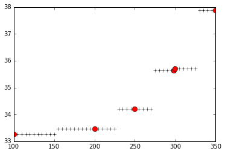
    


0阶插值：


```python
cp_ch4 = interp1d(data['TK'], data['Cp'], kind="zero")
p = plt.plot(T, cp_ch4(T), "k+")
p = plt.plot(data['TK'][1:7], data['Cp'][1:7], 'ro', markersize=8)
```


    
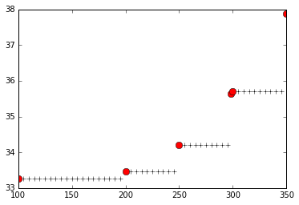
    


二次插值：


```python
cp_ch4 = interp1d(data['TK'], data['Cp'], kind="quadratic")
p = plt.plot(T, cp_ch4(T), "k+")
p = plt.plot(data['TK'][1:7], data['Cp'][1:7], 'ro', markersize=8)
```


    
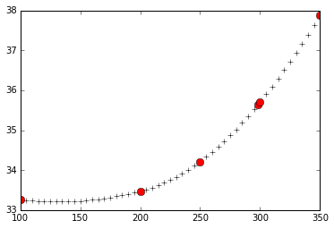
    


三次插值：


```python
cp_ch4 = interp1d(data['TK'], data['Cp'], kind="cubic")
p = plt.plot(T, cp_ch4(T), "k+")
p = plt.plot(data['TK'][1:7], data['Cp'][1:7], 'ro', markersize=8)
```


    
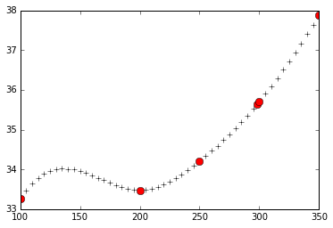
    


事实上，我们可以使用更高阶的多项式插值，只要将 `kind` 设为对应的数字即可：

四次多项式插值：


```python
cp_ch4 = interp1d(data['TK'], data['Cp'], kind=4)
p = plt.plot(T, cp_ch4(T), "k+")
p = plt.plot(data['TK'][1:7], data['Cp'][1:7], 'ro', markersize=8)
```


    
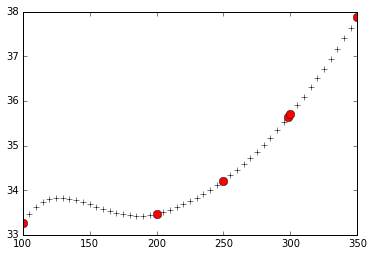
    


可以参见：

- 维基百科-多项式插值：https://zh.wikipedia.org/wiki/%E5%A4%9A%E9%A1%B9%E5%BC%8F%E6%8F%92%E5%80%BC
- 百度百科-插值法：http://baike.baidu.com/view/754506.htm

对于二维乃至更高维度的多项式插值：


```python
from scipy.interpolate import interp2d, interpnd
```

其使用方法与一维类似。

#### 径向基函数

关于径向基函数，可以参阅：
- 维基百科-Radial basis fucntion：https://en.wikipedia.org/wiki/Radial_basis_function

径向基函数，简单来说就是点 $x$ 处的函数值只依赖于 $x$ 与某点 $c$ 的距离：

$$\Phi(x,c) = \Phi(\|x-c\|)$$


```python
x = np.linspace(-3,3,100)
```

常用的径向基（`RBF`）函数有：

高斯函数：


```python
plt.plot(x, np.exp(-1 * x **2))
t = plt.title("Gaussian")
```


    
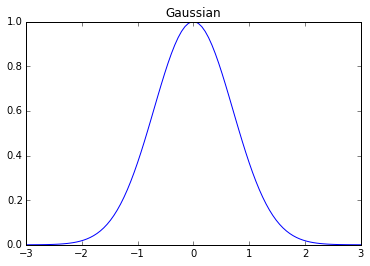
    


`Multiquadric` 函数：


```python
plt.plot(x, np.sqrt(1 + x **2))
t = plt.title("Multiquadric")
```


    
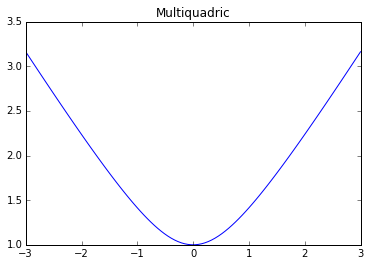
    


`Inverse Multiquadric` 函数：


```python
plt.plot(x, 1. / np.sqrt(1 + x **2))
t = plt.title("Inverse Multiquadric")
```


    

    


#### 径向基函数插值

对于径向基函数，其插值的公式为：

$$
f(x) = \sum_j n_j \Phi(\|x-x_j\|)
$$

我们通过数据点 $x_j$ 来计算出 $n_j$ 的值，来计算 $x$ 处的插值结果。


```python
from scipy.interpolate.rbf import Rbf
```

使用 `multiquadric` 核的：


```python
cp_rbf = Rbf(data['TK'], data['Cp'], function = "multiquadric")
plt.plot(data['TK'], data['Cp'], 'k+')
p = plt.plot(data['TK'], cp_rbf(data['TK']), 'r-')
```


    
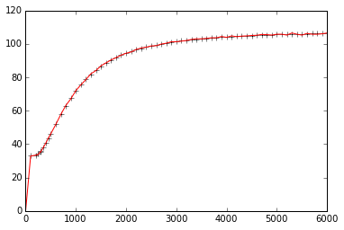
    


使用 `gaussian` 核：


```python
cp_rbf = Rbf(data['TK'], data['Cp'], function = "gaussian")
plt.plot(data['TK'], data['Cp'], 'k+')
p = plt.plot(data['TK'], cp_rbf(data['TK']), 'r-')
```


    
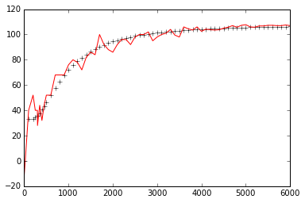
    


使用 `nverse_multiquadric` 核：


```python
cp_rbf = Rbf(data['TK'], data['Cp'], function = "inverse_multiquadric")
plt.plot(data['TK'], data['Cp'], 'k+')
p = plt.plot(data['TK'], cp_rbf(data['TK']), 'r-')
```


    
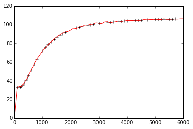
    


不同的 `RBF` 核的结果也不同。

#### 高维 `RBF` 插值


```python
from mpl_toolkits.mplot3d import Axes3D
```

三维数据点：


```python
x, y = np.mgrid[-np.pi/2:np.pi/2:5j, -np.pi/2:np.pi/2:5j]
z = np.cos(np.sqrt(x**2 + y**2))
```


```python
fig = plt.figure(figsize=(12,6))
ax = fig.gca(projection="3d")
ax.scatter(x,y,z)
```


    <mpl_toolkits.mplot3d.art3d.Path3DCollection at 0x176b4da0>


    
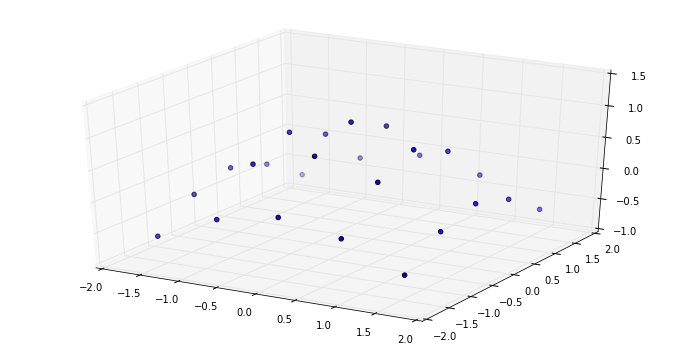
    


3维 `RBF` 插值：


```python
zz = Rbf(x, y, z)
```


```python
xx, yy = np.mgrid[-np.pi/2:np.pi/2:50j, -np.pi/2:np.pi/2:50j]
fig = plt.figure(figsize=(12,6))
ax = fig.gca(projection="3d")
ax.plot_surface(xx,yy,zz(xx,yy),rstride=1, cstride=1, cmap=plt.cm.jet)
```


    <mpl_toolkits.mplot3d.art3d.Poly3DCollection at 0x176e5c50>


    
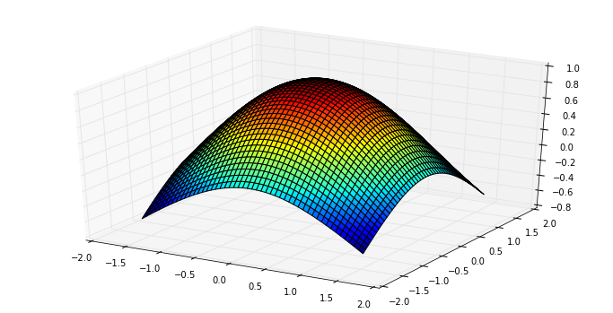
    

## 概率统计方法

### 简介

**`Python`** 中常用的统计工具有 **`Numpy, Pandas, PyMC, StatsModels`** 等。

**`Scipy`** 中的子库 `scipy.stats` 中包含很多统计上的方法。

导入 `numpy` 和 `matplotlib`：


```python
%pylab inline
```

    Populating the interactive namespace from numpy and matplotlib


```python
heights = array([1.46, 1.79, 2.01, 1.75, 1.56, 1.69, 1.88, 1.76, 1.88, 1.78])
```

`Numpy` 自带简单的统计方法：


```python
print 'mean, ', heights.mean()
print 'min, ', heights.min()
print 'max, ', heights.max()
print 'standard deviation, ', heights.std()
```

    mean,  1.756
    min,  1.46
    max,  2.01
    standard deviation,  0.150811140172


导入 **`Scipy`** 的统计模块：


```python
import scipy.stats.stats as st
```

其他统计量：


```python
print 'median, ', st.nanmedian(heights)    ## 忽略nan值之后的中位数
print 'mode, ', st.mode(heights)           ## 众数及其出现次数
print 'skewness, ', st.skew(heights)       ## 偏度
print 'kurtosis, ', st.kurtosis(heights)   ## 峰度
print 'and so many more...'
```

    median,  1.77
    mode,  (array([ 1.88]), array([ 2.]))
    skewness,  -0.393524456473
    kurtosis,  -0.330672097724
    and so many more...


### 概率分布

常见的[连续概率分布](https://zh.wikipedia.org/wiki/Category:%E8%BF%9E%E7%BB%AD%E5%88%86%E5%B8%83)有：

- 均匀分布
- 正态分布
- 学生`t`分布
- `F`分布
- `Gamma`分布
- ...

[离散概率分布](https://zh.wikipedia.org/wiki/Category:%E7%A6%BB%E6%95%A3%E5%88%86%E5%B8%83)：

- 伯努利分布
- 几何分布
- ...

这些都可以在 `scipy.stats` 中找到。

### 连续分布

#### 正态分布

以[正态分布](https://zh.wikipedia.org/wiki/%E6%AD%A3%E6%80%81%E5%88%86%E5%B8%83)为例，先导入正态分布：


```python
from scipy.stats import norm
```

它包含四类常用的函数：

- `norm.cdf` 返回对应的[累计分布函数](https://zh.wikipedia.org/wiki/%E7%B4%AF%E7%A7%AF%E5%88%86%E5%B8%83%E5%87%BD%E6%95%B0)值
- `norm.pdf` 返回对应的[概率密度函数](https://zh.wikipedia.org/wiki/%E6%A9%9F%E7%8E%87%E5%AF%86%E5%BA%A6%E5%87%BD%E6%95%B8)值
- `norm.rvs` 产生指定参数的随机变量
- `norm.fit` 返回给定数据下，各参数的[最大似然估计](https://zh.wikipedia.org/wiki/%E6%9C%80%E5%A4%A7%E4%BC%BC%E7%84%B6%E4%BC%B0%E8%AE%A1)（MLE）值

从正态分布产生500个随机点：


```python
x_norm = norm.rvs(size=500)
type(x_norm)
```


    numpy.ndarray


直方图：


```python
h = hist(x_norm)
print 'counts, ', h[0]
print 'bin centers', h[1]
```

    counts,  [   7.   21.   42.   97.  120.   91.   64.   38.   17.    3.]
    bin centers [-2.68067801 -2.13266147 -1.58464494 -1.0366284  -0.48861186  0.05940467
      0.60742121  1.15543774  1.70345428  2.25147082  2.79948735]


    
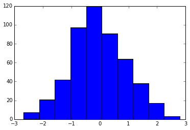
    


归一化直方图（用出现频率代替次数），将划分区间变为 `20`（默认 `10`）：


```python
h = hist(x_norm, normed=True, bins=20)
```


    
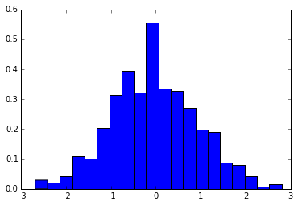
    


在这组数据下，正态分布参数的最大似然估计值为：


```python
x_mean, x_std = norm.fit(x_norm)

print 'mean, ', x_mean
print 'x_std, ', x_std
```

    mean,  -0.0426135499965
    x_std,  0.950754110144


将真实的概率密度函数与直方图进行比较：


```python
h = hist(x_norm, normed=True, bins=20)

x = linspace(-3,3,50)
p = plot(x, norm.pdf(x), 'r-')
```


    

    


导入积分函数：


```python
from scipy.integrate import trapz 
```

通过积分，计算落在某个区间的概率大小：


```python
x1 = linspace(-2,2,108)
p = trapz(norm.pdf(x1), x1) 
print '{:.2%} of the values lie between -2 and 2'.format(p)

fill_between(x1, norm.pdf(x1), color = 'red')
plot(x, norm.pdf(x), 'k-')
```

    95.45% of the values lie between -2 and 2


    [<matplotlib.lines.Line2D at 0x15cbb8d0>]


    
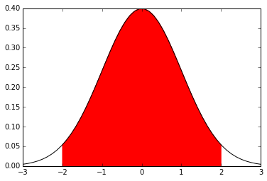
    


默认情况，正态分布的参数为均值0，标准差1，即标准正态分布。

可以通过 `loc` 和 `scale` 来调整这些参数，一种方法是调用相关函数时进行输入：


```python
p = plot(x, norm.pdf(x, loc=0, scale=1))
p = plot(x, norm.pdf(x, loc=0.5, scale=2))
p = plot(x, norm.pdf(x, loc=-0.5, scale=.5))
```


    

    


另一种则是将 `loc, scale` 作为参数直接输给 `norm` 生成相应的分布：


```python
p = plot(x, norm(loc=0, scale=1).pdf(x))
p = plot(x, norm(loc=0.5, scale=2).pdf(x))
p = plot(x, norm(loc=-0.5, scale=.5).pdf(x))
```


    
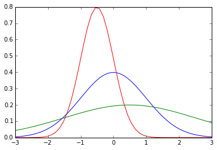
    


#### 其他连续分布


```python
from scipy.stats import lognorm, t, dweibull
```

支持与 `norm` 类似的操作，如概率密度函数等。

不同参数的[对数正态分布](https://zh.wikipedia.org/wiki/%E5%AF%B9%E6%95%B0%E6%AD%A3%E6%80%81%E5%88%86%E5%B8%83)：


```python
x = linspace(0.01, 3, 100)

plot(x, lognorm.pdf(x, 1), label='s=1')
plot(x, lognorm.pdf(x, 2), label='s=2')
plot(x, lognorm.pdf(x, .1), label='s=0.1')

legend()
```


    <matplotlib.legend.Legend at 0x15781c88>


    
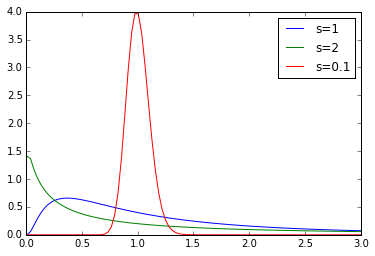
    


不同的[韦氏分布](https://zh.wikipedia.org/wiki/%E9%9F%A6%E4%BC%AF%E5%88%86%E5%B8%83)：


```python
x = linspace(0.01, 3, 100)

plot(x, dweibull.pdf(x, 1), label='s=1, constant failure rate')
plot(x, dweibull.pdf(x, 2), label='s>1, increasing failure rate')
plot(x, dweibull.pdf(x, .1), label='0<s<1, decreasing failure rate')

legend()
```


    <matplotlib.legend.Legend at 0xaa9bc50>


    
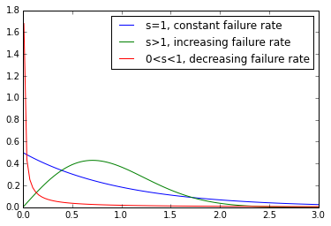
    


不同自由度的[学生 `t` 分布](https://zh.wikipedia.org/wiki/%E5%AD%A6%E7%94%9Ft-%E5%88%86%E5%B8%83)：


```python
x = linspace(-3, 3, 100)

plot(x, t.pdf(x, 1), label='df=1')
plot(x, t.pdf(x, 2), label='df=2')
plot(x, t.pdf(x, 100), label='df=100')
plot(x[::5], norm.pdf(x[::5]), 'kx', label='normal')

legend()
```


    <matplotlib.legend.Legend at 0x164582e8>


    
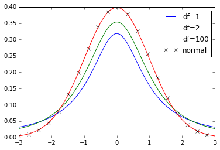
    


### 离散分布

导入离散分布：


```python
from scipy.stats import binom, poisson, randint
```

离散分布没有概率密度函数，但是有[概率质量函数](https://zh.wikipedia.org/wiki/%E6%A6%82%E7%8E%87%E8%B4%A8%E9%87%8F%E5%87%BD%E6%95%B0)。

[离散均匀分布](https://zh.wikipedia.org/wiki/%E9%9B%A2%E6%95%A3%E5%9E%8B%E5%9D%87%E5%8B%BB%E5%88%86%E4%BD%88)的概率质量函数（PMF）：


```python
high = 10
low = -10

x = arange(low, high+1, 0.5)
p = stem(x, randint(low, high).pmf(x))  ## 杆状图
```


    
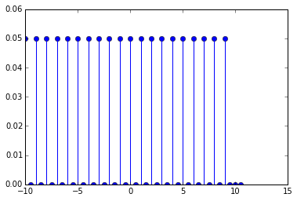
    


[二项分布](https://zh.wikipedia.org/wiki/%E4%BA%8C%E9%A0%85%E5%88%86%E4%BD%88)：


```python
num_trials = 60
x = arange(num_trials)

plot(x, binom(num_trials, 0.5).pmf(x), 'o-', label='p=0.5')
plot(x, binom(num_trials, 0.2).pmf(x), 'o-', label='p=0.2')

legend()
```


    <matplotlib.legend.Legend at 0x1738a198>


    
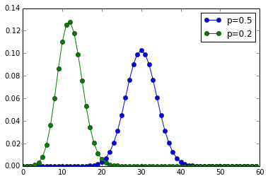
    


[泊松分布](https://zh.wikipedia.org/wiki/%E6%B3%8A%E6%9D%BE%E5%88%86%E4%BD%88)：


```python
x = arange(0,21)

plot(x, poisson(1).pmf(x), 'o-', label=r'$\lambda$=1')
plot(x, poisson(4).pmf(x), 'o-', label=r'$\lambda$=4')
plot(x, poisson(9).pmf(x), 'o-', label=r'$\lambda$=9')

legend()
```


    <matplotlib.legend.Legend at 0x1763e320>


    
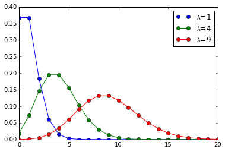
    


### 自定义离散分布

导入要用的函数：


```python
from scipy.stats import rv_discrete
```

一个不均匀的骰子对应的离散值及其概率：


```python
xk = [1, 2, 3, 4, 5, 6]
pk = [.3, .35, .25, .05, .025, .025]
```

定义离散分布：


```python
loaded = rv_discrete(values=(xk, pk))
```

此时， `loaded` 可以当作一个离散分布的模块来使用。

产生两个服从该分布的随机变量：


```python
loaded.rvs(size=2)
```


    array([3, 1])


产生100个随机变量，将直方图与概率质量函数进行比较：


```python
samples = loaded.rvs(size=100)
bins = linspace(.5,6.5,7)

hist(samples, bins=bins, normed=True)
stem(xk, loaded.pmf(xk), markerfmt='ro', linefmt='r-')
```


    <Container object of 3 artists>


    
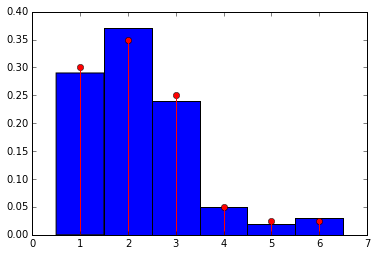
    


### 假设检验

导入相关的函数：

- 正态分布
- 独立双样本 `t` 检验，配对样本 `t` 检验，单样本 `t` 检验
- 学生 `t` 分布

`t` 检验的相关内容请参考：
- 百度百科-`t` 检验：http://baike.baidu.com/view/557340.htm
- 维基百科-学生 `t` 检验：https://en.wikipedia.org/wiki/Student%27s_t-test


```python
from scipy.stats import norm
from scipy.stats import ttest_ind, ttest_rel, ttest_1samp
from scipy.stats import t
```

#### 独立样本 t 检验

两组参数不同的正态分布：


```python
n1 = norm(loc=0.3, scale=1.0)
n2 = norm(loc=0, scale=1.0)
```

从分布中产生两组随机样本：


```python
n1_samples = n1.rvs(size=100)
n2_samples = n2.rvs(size=100)
```

将两组样本混合在一起：


```python
samples = hstack((n1_samples, n2_samples)) 
```

最大似然参数估计：


```python
loc, scale = norm.fit(samples)
n = norm(loc=loc, scale=scale)
```

比较：


```python
x = linspace(-3,3,100)

hist([samples, n1_samples, n2_samples], normed=True)
plot(x, n.pdf(x), 'b-')
plot(x, n1.pdf(x), 'g-')
plot(x, n2.pdf(x), 'r-')
```


    [<matplotlib.lines.Line2D at 0x17ca7278>]


    
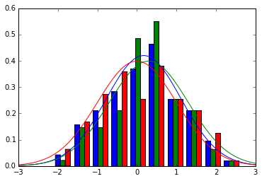
    


独立双样本 `t` 检验的目的在于判断两组样本之间是否有显著差异：


```python
t_val, p = ttest_ind(n1_samples, n2_samples)

print 't = {}'.format(t_val)
print 'p-value = {}'.format(p)
```

    t = 0.868384594123
    p-value = 0.386235148899


`p` 值小，说明这两个样本有显著性差异。

#### 配对样本 t 检验

配对样本指的是两组样本之间的元素一一对应，例如，假设我们有一组病人的数据：


```python
pop_size = 35

pre_treat = norm(loc=0, scale=1)
n0 = pre_treat.rvs(size=pop_size)
```

经过某种治疗后，对这组病人得到一组新的数据：


```python
effect = norm(loc=0.05, scale=0.2)
eff = effect.rvs(size=pop_size)

n1 = n0 + eff
```

新数据的最大似然估计：


```python
loc, scale = norm.fit(n1)
post_treat = norm(loc=loc, scale=scale)
```

画图：


```python
fig = figure(figsize=(10,4))

ax1 = fig.add_subplot(1,2,1)
h = ax1.hist([n0, n1], normed=True)
p = ax1.plot(x, pre_treat.pdf(x), 'b-')
p = ax1.plot(x, post_treat.pdf(x), 'g-')

ax2 = fig.add_subplot(1,2,2)
h = ax2.hist(eff, normed=True)
```


    
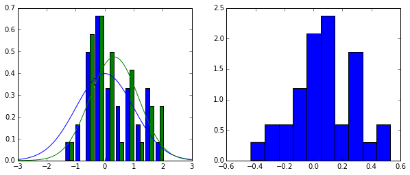
    


独立 `t` 检验：


```python
t_val, p = ttest_ind(n0, n1)

print 't = {}'.format(t_val)
print 'p-value = {}'.format(p)
```

    t = -0.347904839913
    p-value = 0.728986322039


高 `p` 值说明两组样本之间没有显著性差异。

配对 `t` 检验：


```python
t_val, p = ttest_rel(n0, n1)

print 't = {}'.format(t_val)
print 'p-value = {}'.format(p)
```

    t = -1.89564459709
    p-value = 0.0665336223673


配对 `t` 检验的结果说明，配对样本之间存在显著性差异，说明治疗时有效的，符合我们的预期。

#### `p` 值计算原理 

`p` 值对应的部分是下图中的红色区域，边界范围由 `t` 值决定。 


```python
my_t = t(pop_size) ## 传入参数为自由度，这里自由度为50

p = plot(x, my_t.pdf(x), 'b-')
lower_x = x[x<= -abs(t_val)]
upper_x = x[x>= abs(t_val)]

p = fill_between(lower_x, my_t.pdf(lower_x), color='red')
p = fill_between(upper_x, my_t.pdf(upper_x), color='red')
```


    
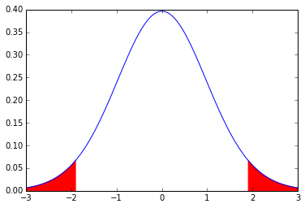
    

## 曲线拟合

导入基础包：


```python
import numpy as np
import matplotlib as mpl
import matplotlib.pyplot as plt
```

### 多项式拟合

导入线多项式拟合工具：


```python
from numpy import polyfit, poly1d
```

产生数据：


```python
x = np.linspace(-5, 5, 100)
y = 4 * x + 1.5
noise_y = y + np.random.randn(y.shape[-1]) * 2.5
```

画出数据：


```python
%matplotlib inline

p = plt.plot(x, noise_y, 'rx')
p = plt.plot(x, y, 'b:')
```


    
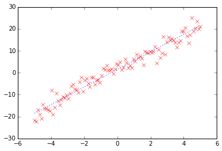
    


进行线性拟合，`polyfit` 是多项式拟合函数，线性拟合即一阶多项式：


```python
coeff = polyfit(x, noise_y, 1)
print coeff
```

    [ 3.93921315  1.59379469]


一阶多项式 $y = a_1 x + a_0$ 拟合，返回两个系数 $[a_1, a_0]$。

画出拟合曲线：


```python
p = plt.plot(x, noise_y, 'rx')
p = plt.plot(x, coeff[0] * x + coeff[1], 'k-')
p = plt.plot(x, y, 'b--')
```


    
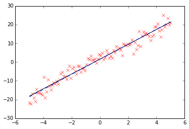
    


还可以用 `poly1d` 生成一个以传入的 `coeff` 为参数的多项式函数：


```python
f = poly1d(coeff)
p = plt.plot(x, noise_y, 'rx')
p = plt.plot(x, f(x))
```


    
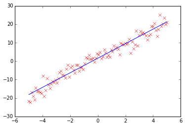
    


```python
f
```


    poly1d([ 3.93921315,  1.59379469])


显示 `f`：


```python
print f
```

     
    3.939 x + 1.594


还可以对它进行数学操作生成新的多项式：


```python
print f + 2 * f ** 2
```

           2
    31.03 x + 29.05 x + 6.674


### 多项式拟合正弦函数

正弦函数：


```python
x = np.linspace(-np.pi,np.pi,100)
y = np.sin(x)
```

用一阶到九阶多项式拟合，类似泰勒展开：


```python
y1 = poly1d(polyfit(x,y,1))
y3 = poly1d(polyfit(x,y,3))
y5 = poly1d(polyfit(x,y,5))
y7 = poly1d(polyfit(x,y,7))
y9 = poly1d(polyfit(x,y,9))
```


```python
x = np.linspace(-3 * np.pi,3 * np.pi,100)

p = plt.plot(x, np.sin(x), 'k')
p = plt.plot(x, y1(x))
p = plt.plot(x, y3(x))
p = plt.plot(x, y5(x))
p = plt.plot(x, y7(x))
p = plt.plot(x, y9(x))

a = plt.axis([-3 * np.pi, 3 * np.pi, -1.25, 1.25])
```


    
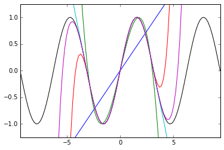
    


黑色为原始的图形，可以看到，随着多项式拟合的阶数的增加，曲线与拟合数据的吻合程度在逐渐增大。

### 最小二乘拟合

导入相关的模块：


```python
from scipy.linalg import lstsq
from scipy.stats import linregress
```


```python
x = np.linspace(0,5,100)
y = 0.5 * x + np.random.randn(x.shape[-1]) * 0.35

plt.plot(x,y,'x')
```


    [<matplotlib.lines.Line2D at 0xbc98518>]


    
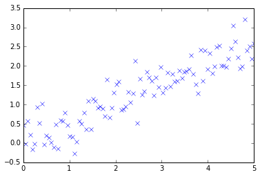
    


一般来书，当我们使用一个 N-1 阶的多项式拟合这 M 个点时，有这样的关系存在：

$$XC = Y$$

即

$$\left[ \begin{matrix}
x_0^{N-1} & \dots & x_0 & 1 \\\
x_1^{N-1} & \dots & x_1 & 1 \\\
\dots & \dots & \dots & \dots \\\
x_M^{N-1} & \dots & x_M & 1
\end{matrix}\right] 
\left[ \begin{matrix} C_{N-1} \\\ \dots \\\ C_1 \\\ C_0 \end{matrix} \right] =
\left[ \begin{matrix} y_0 \\\ y_1 \\\ \dots \\\ y_M \end{matrix} \right]$$

#### Scipy.linalg.lstsq 最小二乘解

要得到 `C` ，可以使用 `scipy.linalg.lstsq` 求最小二乘解。

这里，我们使用 1 阶多项式即 `N = 2`，先将 `x` 扩展成 `X`：


```python
X = np.hstack((x[:,np.newaxis], np.ones((x.shape[-1],1))))
X[1:5]
```


    array([[ 0.05050505,  1.        ],
           [ 0.1010101 ,  1.        ],
           [ 0.15151515,  1.        ],
           [ 0.2020202 ,  1.        ]])


求解：


```python
C, resid, rank, s = lstsq(X, y)
C, resid, rank, s
```


    (array([ 0.50432002,  0.0415695 ]),
     12.182942535066523,
     2,
     array([ 30.23732043,   4.82146667]))


画图：


```python
p = plt.plot(x, y, 'rx')
p = plt.plot(x, C[0] * x + C[1], 'k--')
print "sum squared residual = {:.3f}".format(resid)
print "rank of the X matrix = {}".format(rank)
print "singular values of X = {}".format(s)
```

    sum squared residual = 12.183
    rank of the X matrix = 2
    singular values of X = [ 30.23732043   4.82146667]


    

    


#### Scipy.stats.linregress 线性回归

对于上面的问题，还可以使用线性回归进行求解：


```python
slope, intercept, r_value, p_value, stderr = linregress(x, y)
slope, intercept
```


    (0.50432001884393252, 0.041569499438028901)


```python
p = plt.plot(x, y, 'rx')
p = plt.plot(x, slope * x + intercept, 'k--')
print "R-value = {:.3f}".format(r_value)
print "p-value (probability there is no correlation) = {:.3e}".format(p_value)
print "Root mean squared error of the fit = {:.3f}".format(np.sqrt(stderr))
```

    R-value = 0.903
    p-value (probability there is no correlation) = 8.225e-38
    Root mean squared error of the fit = 0.156


    
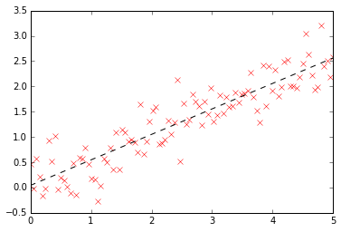
    


可以看到，两者求解的结果是一致的，但是出发的角度是不同的。

### 更高级的拟合


```python
from scipy.optimize import leastsq
```

先定义这个非线性函数：$y = a e^{-b sin( f x + \phi)}$


```python
def function(x, a , b, f, phi):
    """a function of x with four parameters"""
    result = a * np.exp(-b * np.sin(f * x + phi))
    return result
```

画出原始曲线：


```python
x = np.linspace(0, 2 * np.pi, 50)
actual_parameters = [3, 2, 1.25, np.pi / 4]
y = function(x, *actual_parameters)
p = plt.plot(x,y)
```


    
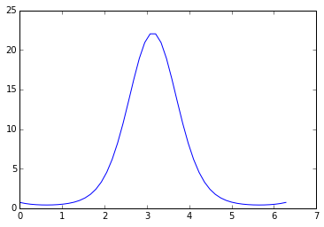
    


加入噪声：


```python
from scipy.stats import norm
y_noisy = y + 0.8 * norm.rvs(size=len(x))
p = plt.plot(x, y, 'k-')
p = plt.plot(x, y_noisy, 'rx')
```


    
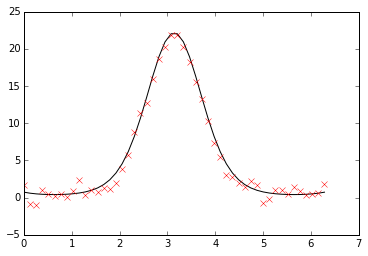
    


#### Scipy.optimize.leastsq

定义误差函数，将要优化的参数放在前面：


```python
def f_err(p, y, x):
    return y - function(x, *p)
```

将这个函数作为参数传入 `leastsq` 函数，第二个参数为初始值：


```python
c, ret_val = leastsq(f_err, [1, 1, 1, 1], args=(y_noisy, x))
c, ret_val
```


    (array([ 3.03199715,  1.97689384,  1.30083191,  0.6393337 ]), 1)


`ret_val` 是 1~4 时，表示成功找到最小二乘解：


```python
p = plt.plot(x, y_noisy, 'rx')
p = plt.plot(x, function(x, *c), 'k--')
```


    
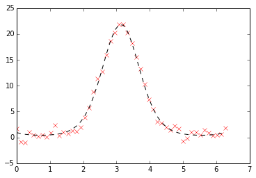
    


#### Scipy.optimize.curve_fit

更高级的做法：


```python
from scipy.optimize import curve_fit
```

不需要定义误差函数，直接传入 `function` 作为参数：


```python
p_est, err_est = curve_fit(function, x, y_noisy)
```


```python
print p_est
p = plt.plot(x, y_noisy, "rx")
p = plt.plot(x, function(x, *p_est), "k--")
```

    [ 3.03199711  1.97689385  1.3008319   0.63933373]


    

    


这里第一个返回的是函数的参数，第二个返回值为各个参数的协方差矩阵：


```python
print err_est
```

    [[ 0.08483704 -0.02782318  0.00967093 -0.03029038]
     [-0.02782318  0.00933216 -0.00305158  0.00955794]
     [ 0.00967093 -0.00305158  0.0014972  -0.00468919]
     [-0.03029038  0.00955794 -0.00468919  0.01484297]]


协方差矩阵的对角线为各个参数的方差：


```python
print "normalized relative errors for each parameter"
print "   a\t  b\t f\tphi"
print np.sqrt(err_est.diagonal()) / p_est
```

    normalized relative errors for each parameter
       a	  b	 f	phi
    [ 0.09606473  0.0488661   0.02974528  0.19056043]

## 最小化函数

### minimize 函数


```python
%pylab inline
set_printoptions(precision=3, suppress=True)
```

    Populating the interactive namespace from numpy and matplotlib


已知斜抛运动的水平飞行距离公式：

$d = 2 \frac{v_0^2}{g} \sin(\theta) \cos (\theta)$

- $d$ 水平飞行距离
- $v_0$ 初速度大小
- $g$ 重力加速度
- $\theta$ 抛出角度

希望找到使 $d$ 最大的角度 $\theta$。

定义距离函数：


```python
def dist(theta, v0):
    """calculate the distance travelled by a projectile launched
    at theta degrees with v0 (m/s) initial velocity.
    """
    g = 9.8
    theta_rad = pi * theta / 180
    return 2 * v0 ** 2 / g * sin(theta_rad) * cos(theta_rad)
theta = linspace(0,90,90)
p = plot(theta, dist(theta, 1.))
xl = xlabel(r'launch angle $\theta (^{\circ})$')
yl = ylabel('horizontal distance traveled')
```


    
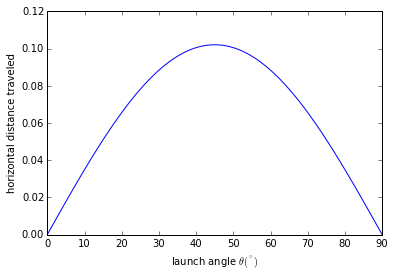
    


因为 `Scipy` 提供的是最小化方法，所以最大化距离就相当于最小化距离的负数：


```python
def neg_dist(theta, v0):
    return -1 * dist(theta, v0)
```

导入 `scipy.optimize.minimize`：


```python
from scipy.optimize import minimize
result = minimize(neg_dist, 40, args=(1,))
print "optimal angle = {:.1f} degrees".format(result.x[0])
```

    optimal angle = 45.0 degrees


`minimize` 接受三个参数：第一个是要优化的函数，第二个是初始猜测值，第三个则是优化函数的附加参数，默认 `minimize` 将优化函数的第一个参数作为优化变量，所以第三个参数输入的附加参数从优化函数的第二个参数开始。

查看返回结果：


```python
print result
```

       status: 0
      success: True
         njev: 18
         nfev: 54
     hess_inv: array([[ 8110.515]])
          fun: -0.10204079220645729
            x: array([ 45.02])
      message: 'Optimization terminated successfully.'
          jac: array([ 0.])


### Rosenbrock 函数

Rosenbrock 函数是一个用来测试优化函数效果的一个非凸函数：

$f(x)=\sum\limits_{i=1}^{N-1}{100\left(x_{i+1}^2 - x_i\right) ^2 + \left(1-x_{i}\right)^2 }$

导入该函数：


```python
from scipy.optimize import rosen
from mpl_toolkits.mplot3d import Axes3D
```

使用 `N = 2` 的 Rosenbrock 函数：


```python
x, y = meshgrid(np.linspace(-2,2,25), np.linspace(-0.5,3.5,25))
z = rosen([x,y])
```

图像和最低点 `(1,1)`：


```python
fig = figure(figsize=(12,5.5))
ax = fig.gca(projection="3d")
ax.azim = 70; ax.elev = 48
ax.set_xlabel("X"); ax.set_ylabel("Y")
ax.set_zlim((0,1000))
p = ax.plot_surface(x,y,z,rstride=1, cstride=1, cmap=cm.jet)
rosen_min = ax.plot([1],[1],[0],"ro")
```


    
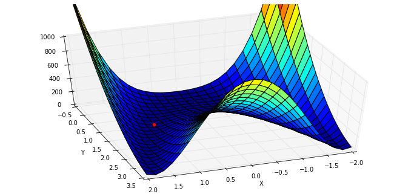
    


传入初始值：


```python
x0 = [1.3, 1.6, -0.5, -1.8, 0.8]
result = minimize(rosen, x0)
print result.x
```

    [ 1.  1.  1.  1.  1.]


随机给定初始值：


```python
x0 = np.random.randn(10)
result = minimize(rosen, x0)
print x0
print result.x
```

    [ 0.815 -2.086  0.297  1.079 -0.528  0.461 -0.13  -0.715  0.734  0.621]
    [-0.993  0.997  0.998  0.999  0.999  0.999  0.998  0.997  0.994  0.988]


对于 `N > 3`，函数的最小值为 $(x_1,x_2, ..., x_N) = (1,1,...,1)$，不过有一个局部极小值点 $(x_1,x_2, ..., x_N) = (-1,1,...,1)$，所以随机初始值如果选的不好的话，有可能返回的结果是局部极小值点：

### 优化方法

#### BFGS 算法

`minimize` 函数默认根据问题是否有界或者有约束，使用 `'BFGS', 'L-BFGS-B', 'SLSQP'` 中的一种。

可以查看帮助来得到更多的信息：


```python
info(minimize)
```

     minimize(fun, x0, args=(), method=None, jac=None, hess=None, hessp=None,
              bounds=None, constraints=(), tol=None, callback=None, options=None)
    
    Minimization of scalar function of one or more variables.
    
    Parameters
    ----------
    fun : callable
        Objective function.
    x0 : ndarray
        Initial guess.
    args : tuple, optional
        Extra arguments passed to the objective function and its
        derivatives (Jacobian, Hessian).
    method : str or callable, optional
        Type of solver.  Should be one of
    
            - 'Nelder-Mead'
            - 'Powell'
            - 'CG'
            - 'BFGS'
            - 'Newton-CG'
            - 'Anneal (deprecated as of scipy version 0.14.0)'
            - 'L-BFGS-B'
            - 'TNC'
            - 'COBYLA'
            - 'SLSQP'
            - 'dogleg'
            - 'trust-ncg'
            - custom - a callable object (added in version 0.14.0)
    
        If not given, chosen to be one of ``BFGS``, ``L-BFGS-B``, ``SLSQP``,
        depending if the problem has constraints or bounds.
    jac : bool or callable, optional
        Jacobian (gradient) of objective function. Only for CG, BFGS,
        Newton-CG, L-BFGS-B, TNC, SLSQP, dogleg, trust-ncg.
        If `jac` is a Boolean and is True, `fun` is assumed to return the
        gradient along with the objective function. If False, the
        gradient will be estimated numerically.
        `jac` can also be a callable returning the gradient of the
        objective. In this case, it must accept the same arguments as `fun`.
    hess, hessp : callable, optional
        Hessian (matrix of second-order derivatives) of objective function or
        Hessian of objective function times an arbitrary vector p.  Only for
        Newton-CG, dogleg, trust-ncg.
        Only one of `hessp` or `hess` needs to be given.  If `hess` is
        provided, then `hessp` will be ignored.  If neither `hess` nor
        `hessp` is provided, then the Hessian product will be approximated
        using finite differences on `jac`. `hessp` must compute the Hessian
        times an arbitrary vector.
    bounds : sequence, optional
        Bounds for variables (only for L-BFGS-B, TNC and SLSQP).
        ``(min, max)`` pairs for each element in ``x``, defining
        the bounds on that parameter. Use None for one of ``min`` or
        ``max`` when there is no bound in that direction.
    constraints : dict or sequence of dict, optional
        Constraints definition (only for COBYLA and SLSQP).
        Each constraint is defined in a dictionary with fields:
            type : str
                Constraint type: 'eq' for equality, 'ineq' for inequality.
            fun : callable
                The function defining the constraint.
            jac : callable, optional
                The Jacobian of `fun` (only for SLSQP).
            args : sequence, optional
                Extra arguments to be passed to the function and Jacobian.
        Equality constraint means that the constraint function result is to
        be zero whereas inequality means that it is to be non-negative.
        Note that COBYLA only supports inequality constraints.
    tol : float, optional
        Tolerance for termination. For detailed control, use solver-specific
        options.
    options : dict, optional
        A dictionary of solver options. All methods accept the following
        generic options:
            maxiter : int
                Maximum number of iterations to perform.
            disp : bool
                Set to True to print convergence messages.
        For method-specific options, see :func:`show_options()`.
    callback : callable, optional
        Called after each iteration, as ``callback(xk)``, where ``xk`` is the
        current parameter vector.
    
    Returns
    -------
    res : OptimizeResult
        The optimization result represented as a ``OptimizeResult`` object.
        Important attributes are: ``x`` the solution array, ``success`` a
        Boolean flag indicating if the optimizer exited successfully and
        ``message`` which describes the cause of the termination. See
        `OptimizeResult` for a description of other attributes.
    
    
    See also
    --------
    minimize_scalar : Interface to minimization algorithms for scalar
        univariate functions
    show_options : Additional options accepted by the solvers
    
    Notes
    -----
    This section describes the available solvers that can be selected by the
    'method' parameter. The default method is *BFGS*.
    
    **Unconstrained minimization**
    
    Method *Nelder-Mead* uses the Simplex algorithm [1]_, [2]_. This
    algorithm has been successful in many applications but other algorithms
    using the first and/or second derivatives information might be preferred
    for their better performances and robustness in general.
    
    Method *Powell* is a modification of Powell's method [3]_, [4]_ which
    is a conjugate direction method. It performs sequential one-dimensional
    minimizations along each vector of the directions set (`direc` field in
    `options` and `info`), which is updated at each iteration of the main
    minimization loop. The function need not be differentiable, and no
    derivatives are taken.
    
    Method *CG* uses a nonlinear conjugate gradient algorithm by Polak and
    Ribiere, a variant of the Fletcher-Reeves method described in [5]_ pp.
    120-122. Only the first derivatives are used.
    
    Method *BFGS* uses the quasi-Newton method of Broyden, Fletcher,
    Goldfarb, and Shanno (BFGS) [5]_ pp. 136. It uses the first derivatives
    only. BFGS has proven good performance even for non-smooth
    optimizations. This method also returns an approximation of the Hessian
    inverse, stored as `hess_inv` in the OptimizeResult object.
    
    Method *Newton-CG* uses a Newton-CG algorithm [5]_ pp. 168 (also known
    as the truncated Newton method). It uses a CG method to the compute the
    search direction. See also *TNC* method for a box-constrained
    minimization with a similar algorithm.
    
    Method *Anneal* uses simulated annealing, which is a probabilistic
    metaheuristic algorithm for global optimization. It uses no derivative
    information from the function being optimized.
    
    Method *dogleg* uses the dog-leg trust-region algorithm [5]_
    for unconstrained minimization. This algorithm requires the gradient
    and Hessian; furthermore the Hessian is required to be positive definite.
    
    Method *trust-ncg* uses the Newton conjugate gradient trust-region
    algorithm [5]_ for unconstrained minimization. This algorithm requires
    the gradient and either the Hessian or a function that computes the
    product of the Hessian with a given vector.
    
    **Constrained minimization**
    
    Method *L-BFGS-B* uses the L-BFGS-B algorithm [6]_, [7]_ for bound
    constrained minimization.
    
    Method *TNC* uses a truncated Newton algorithm [5]_, [8]_ to minimize a
    function with variables subject to bounds. This algorithm uses
    gradient information; it is also called Newton Conjugate-Gradient. It
    differs from the *Newton-CG* method described above as it wraps a C
    implementation and allows each variable to be given upper and lower
    bounds.
    
    Method *COBYLA* uses the Constrained Optimization BY Linear
    Approximation (COBYLA) method [9]_, [10]_, [11]_. The algorithm is
    based on linear approximations to the objective function and each
    constraint. The method wraps a FORTRAN implementation of the algorithm.
    
    Method *SLSQP* uses Sequential Least SQuares Programming to minimize a
    function of several variables with any combination of bounds, equality
    and inequality constraints. The method wraps the SLSQP Optimization
    subroutine originally implemented by Dieter Kraft [12]_. Note that the
    wrapper handles infinite values in bounds by converting them into large
    floating values.
    
    **Custom minimizers**
    
    It may be useful to pass a custom minimization method, for example
    when using a frontend to this method such as `scipy.optimize.basinhopping`
    or a different library.  You can simply pass a callable as the ``method``
    parameter.
    
    The callable is called as ``method(fun, x0, args, **kwargs, **options)``
    where ``kwargs`` corresponds to any other parameters passed to `minimize`
    (such as `callback`, `hess`, etc.), except the `options` dict, which has
    its contents also passed as `method` parameters pair by pair.  Also, if
    `jac` has been passed as a bool type, `jac` and `fun` are mangled so that
    `fun` returns just the function values and `jac` is converted to a function
    returning the Jacobian.  The method shall return an ``OptimizeResult``
    object.
    
    The provided `method` callable must be able to accept (and possibly ignore)
    arbitrary parameters; the set of parameters accepted by `minimize` may
    expand in future versions and then these parameters will be passed to
    the method.  You can find an example in the scipy.optimize tutorial.
    
    .. versionadded:: 0.11.0
    
    References
    ----------
    .. [1] Nelder, J A, and R Mead. 1965. A Simplex Method for Function
        Minimization. The Computer Journal 7: 308-13.
    .. [2] Wright M H. 1996. Direct search methods: Once scorned, now
        respectable, in Numerical Analysis 1995: Proceedings of the 1995
        Dundee Biennial Conference in Numerical Analysis (Eds. D F
        Griffiths and G A Watson). Addison Wesley Longman, Harlow, UK.
        191-208.
    .. [3] Powell, M J D. 1964. An efficient method for finding the minimum of
       a function of several variables without calculating derivatives. The
       Computer Journal 7: 155-162.
    .. [4] Press W, S A Teukolsky, W T Vetterling and B P Flannery.
       Numerical Recipes (any edition), Cambridge University Press.
    .. [5] Nocedal, J, and S J Wright. 2006. Numerical Optimization.
       Springer New York.
    .. [6] Byrd, R H and P Lu and J. Nocedal. 1995. A Limited Memory
       Algorithm for Bound Constrained Optimization. SIAM Journal on
       Scientific and Statistical Computing 16 (5): 1190-1208.
    .. [7] Zhu, C and R H Byrd and J Nocedal. 1997. L-BFGS-B: Algorithm
       778: L-BFGS-B, FORTRAN routines for large scale bound constrained
       optimization. ACM Transactions on Mathematical Software 23 (4):
       550-560.
    .. [8] Nash, S G. Newton-Type Minimization Via the Lanczos Method.
       1984. SIAM Journal of Numerical Analysis 21: 770-778.
    .. [9] Powell, M J D. A direct search optimization method that models
       the objective and constraint functions by linear interpolation.
       1994. Advances in Optimization and Numerical Analysis, eds. S. Gomez
       and J-P Hennart, Kluwer Academic (Dordrecht), 51-67.
    .. [10] Powell M J D. Direct search algorithms for optimization
       calculations. 1998. Acta Numerica 7: 287-336.
    .. [11] Powell M J D. A view of algorithms for optimization without
       derivatives. 2007.Cambridge University Technical Report DAMTP
       2007/NA03
    .. [12] Kraft, D. A software package for sequential quadratic
       programming. 1988. Tech. Rep. DFVLR-FB 88-28, DLR German Aerospace
       Center -- Institute for Flight Mechanics, Koln, Germany.
    
    Examples
    --------
    Let us consider the problem of minimizing the Rosenbrock function. This
    function (and its respective derivatives) is implemented in `rosen`
    (resp. `rosen_der`, `rosen_hess`) in the `scipy.optimize`.
    
    >>> from scipy.optimize import minimize, rosen, rosen_der
    
    A simple application of the *Nelder-Mead* method is:
    
    >>> x0 = [1.3, 0.7, 0.8, 1.9, 1.2]
    >>> res = minimize(rosen, x0, method='Nelder-Mead')
    >>> res.x
    [ 1.  1.  1.  1.  1.]
    
    Now using the *BFGS* algorithm, using the first derivative and a few
    options:
    
    >>> res = minimize(rosen, x0, method='BFGS', jac=rosen_der,
    ...                options={'gtol': 1e-6, 'disp': True})
    Optimization terminated successfully.
             Current function value: 0.000000
             Iterations: 52
             Function evaluations: 64
             Gradient evaluations: 64
    >>> res.x
    [ 1.  1.  1.  1.  1.]
    >>> print res.message
    Optimization terminated successfully.
    >>> res.hess
    [[ 0.00749589  0.01255155  0.02396251  0.04750988  0.09495377]
     [ 0.01255155  0.02510441  0.04794055  0.09502834  0.18996269]
     [ 0.02396251  0.04794055  0.09631614  0.19092151  0.38165151]
     [ 0.04750988  0.09502834  0.19092151  0.38341252  0.7664427 ]
     [ 0.09495377  0.18996269  0.38165151  0.7664427   1.53713523]]
    
    
    Next, consider a minimization problem with several constraints (namely
    Example 16.4 from [5]_). The objective function is:
    
    >>> fun = lambda x: (x[0] - 1)**2 + (x[1] - 2.5)**2
    
    There are three constraints defined as:
    
    >>> cons = ({'type': 'ineq', 'fun': lambda x:  x[0] - 2 * x[1] + 2},
    ...         {'type': 'ineq', 'fun': lambda x: -x[0] - 2 * x[1] + 6},
    ...         {'type': 'ineq', 'fun': lambda x: -x[0] + 2 * x[1] + 2})
    
    And variables must be positive, hence the following bounds:
    
    >>> bnds = ((0, None), (0, None))
    
    The optimization problem is solved using the SLSQP method as:
    
    >>> res = minimize(fun, (2, 0), method='SLSQP', bounds=bnds,
    ...                constraints=cons)
    
    It should converge to the theoretical solution (1.4 ,1.7).


默认没有约束时，使用的是 [BFGS 方法](https://en.wikipedia.org/wiki/Broyden%E2%80%93Fletcher%E2%80%93Goldfarb%E2%80%93Shanno_algorithm)。

利用 `callback` 参数查看迭代的历史：


```python
x0 = [-1.5, 4.5]
xi = [x0]
result = minimize(rosen, x0, callback=xi.append)
xi = np.asarray(xi)
print xi.shape
print result.x
print "in {} function evaluations.".format(result.nfev)
```

    (37L, 2L)
    [ 1.  1.]
    in 200 function evaluations.


绘图显示轨迹：


```python
x, y = meshgrid(np.linspace(-2.3,1.75,25), np.linspace(-0.5,4.5,25))
z = rosen([x,y])
fig = figure(figsize=(12,5.5))
ax = fig.gca(projection="3d"); ax.azim = 70; ax.elev = 75
ax.set_xlabel("X"); ax.set_ylabel("Y"); ax.set_zlim((0,1000))
p = ax.plot_surface(x,y,z,rstride=1, cstride=1, cmap=cm.jet)
intermed = ax.plot(xi[:,0], xi[:,1], rosen(xi.T), "g-o")
rosen_min = ax.plot([1],[1],[0],"ro")
```


    
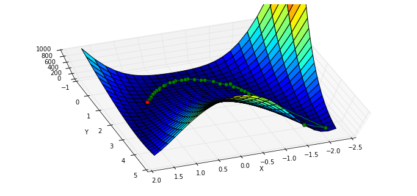
    


`BFGS` 需要计算函数的 Jacobian 矩阵：

给定 $\left[y_1,y_2,y_3\right] = f(x_0, x_1, x_2)$

$$J=\left[ \begin{matrix} \frac{\partial y_1}{\partial x_0} & \frac{\partial y_1}{\partial x_1} & \frac{\partial y_1}{\partial x_2} \\\ \frac{\partial y_2}{\partial x_0} & \frac{\partial y_2}{\partial x_1} & \frac{\partial y_2}{\partial x_2} \\\ \frac{\partial y_3}{\partial x_0} & \frac{\partial y_3}{\partial x_1} & \frac{\partial y_3}{\partial x_2} \end{matrix} \right]$$

在我们的例子中

$$J= \left[ \begin{matrix}\frac{\partial rosen}{\partial x_0} & \frac{\partial rosen}{\partial x_1} \end{matrix} \right] $$

导入 `rosen` 函数的 `Jacobian` 函数 `rosen_der`： 


```python
from scipy.optimize import rosen_der
```

此时，我们将 `Jacobian` 矩阵作为参数传入：


```python
xi = [x0]
result = minimize(rosen, x0, jac=rosen_der, callback=xi.append)
xi = np.asarray(xi)
print xi.shape
print "in {} function evaluations and {} jacobian evaluations.".format(result.nfev, result.njev)
```

    (38L, 2L)
    in 49 function evaluations and 49 jacobian evaluations.


可以看到，函数计算的开销大约减少了一半，迭代路径与上面的基本吻合：


```python
x, y = meshgrid(np.linspace(-2.3,1.75,25), np.linspace(-0.5,4.5,25))
z = rosen([x,y])
fig = figure(figsize=(12,5.5))
ax = fig.gca(projection="3d"); ax.azim = 70; ax.elev = 75
ax.set_xlabel("X"); ax.set_ylabel("Y"); ax.set_zlim((0,1000))
p = ax.plot_surface(x,y,z,rstride=1, cstride=1, cmap=cm.jet)
intermed = ax.plot(xi[:,0], xi[:,1], rosen(xi.T), "g-o")
rosen_min = ax.plot([1],[1],[0],"ro")
```


    

    


### Nelder-Mead Simplex 算法

改变 `minimize` 使用的算法，使用 [Nelder–Mead 单纯形算法](https://en.wikipedia.org/wiki/Nelder%E2%80%93Mead_method)：


```python
xi = [x0]
result = minimize(rosen, x0, method="nelder-mead", callback = xi.append)
xi = np.asarray(xi)
print xi.shape
print "Solved the Nelder-Mead Simplex method with {} function evaluations.".format(result.nfev)
```

    (120L, 2L)
    Solved the Nelder-Mead Simplex method with 226 function evaluations.


```python
x, y = meshgrid(np.linspace(-1.9,1.75,25), np.linspace(-0.5,4.5,25))
z = rosen([x,y])
fig = figure(figsize=(12,5.5))
ax = fig.gca(projection="3d"); ax.azim = 70; ax.elev = 75
ax.set_xlabel("X"); ax.set_ylabel("Y"); ax.set_zlim((0,1000))
p = ax.plot_surface(x,y,z,rstride=1, cstride=1, cmap=cm.jet)
intermed = ax.plot(xi[:,0], xi[:,1], rosen(xi.T), "g-o")
rosen_min = ax.plot([1],[1],[0],"ro")
```


    
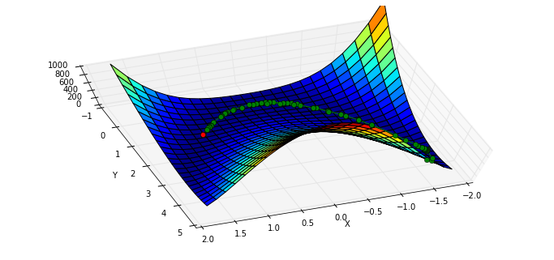
    


#### Powell 算法

使用 [Powell 算法](https://en.wikipedia.org/wiki/Powell%27s_method)


```python
xi = [x0]
result = minimize(rosen, x0, method="powell", callback=xi.append)
xi = np.asarray(xi)
print xi.shape
print "Solved Powell's method with {} function evaluations.".format(result.nfev)
```

    (31L, 2L)
    Solved Powell's method with 855 function evaluations.


```python
x, y = meshgrid(np.linspace(-2.3,1.75,25), np.linspace(-0.5,4.5,25))
z = rosen([x,y])
fig = figure(figsize=(12,5.5))
ax = fig.gca(projection="3d"); ax.azim = 70; ax.elev = 75
ax.set_xlabel("X"); ax.set_ylabel("Y"); ax.set_zlim((0,1000))
p = ax.plot_surface(x,y,z,rstride=1, cstride=1, cmap=cm.jet)
intermed = ax.plot(xi[:,0], xi[:,1], rosen(xi.T), "g-o")
rosen_min = ax.plot([1],[1],[0],"ro")
```


    

    

## 积分

### 符号积分

积分与求导的关系：

$$\frac{d}{dx} F(x) = f(x)
\Rightarrow F(x) = \int f(x) dx$$

符号运算可以用 `sympy` 模块完成。

先导入 `init_printing` 模块方便其显示：


```python
from sympy import init_printing
init_printing()
```


```python
from sympy import symbols, integrate
import sympy
```

产生 x 和 y 两个符号变量，并进行运算：


```python
x, y = symbols('x y')
sympy.sqrt(x ** 2 + y ** 2)
```


$$\sqrt{x^{2} + y^{2}}$$


对于生成的符号变量 `z`，我们将其中的 `x` 利用 `subs` 方法替换为 `3`：


```python
z = sympy.sqrt(x ** 2 + y ** 2)
z.subs(x, 3)
```


$$\sqrt{y^{2} + 9}$$


再替换 `y`：


```python
z.subs(x, 3).subs(y, 4)
```


$$5$$


还可以从 `sympy.abc` 中导入现成的符号变量：


```python
from sympy.abc import theta
y = sympy.sin(theta) ** 2
y
```


$$\sin^{2}{\left (\theta \right )}$$


对 y 进行积分：


```python
Y = integrate(y)
Y
```


$$\frac{\theta}{2} - \frac{1}{2} \sin{\left (\theta \right )} \cos{\left (\theta \right )}$$


计算 $Y(\pi) - Y(0)$：


```python
import numpy as np
np.set_printoptions(precision=3)

Y.subs(theta, np.pi) - Y.subs(theta, 0)
```


$$1.5707963267949$$


计算 $\int_0^\pi y d\theta$ ：


```python
integrate(y, (theta, 0, sympy.pi))
```


$$\frac{\pi}{2}$$


显示的是字符表达式，查看具体数值可以使用 `evalf()` 方法，或者传入 `numpy.pi`，而不是 `sympy.pi` ：


```python
integrate(y, (theta, 0, sympy.pi)).evalf()
```


$$1.5707963267949$$


```python
integrate(y, (theta, 0, np.pi))
```


$$1.5707963267949$$


根据牛顿莱布尼兹公式，这两个数值应该相等。

产生不定积分对象：


```python
Y_indef = sympy.Integral(y)
Y_indef
```


$$\int \sin^{2}{\left (\theta \right )}\, d\theta$$


```python
print type(Y_indef)
```

    <class 'sympy.integrals.integrals.Integral'>


定积分：


```python
Y_def = sympy.Integral(y, (theta, 0, sympy.pi))
Y_def
```


$$\int_{0}^{\pi} \sin^{2}{\left (\theta \right )}\, d\theta$$


产生函数 $Y(x) = \int_0^x sin^2(\theta) d\theta$，并将其向量化：


```python
Y_raw = lambda x: integrate(y, (theta, 0, x))
Y = np.vectorize(Y_raw)
```


```python
%matplotlib inline
import matplotlib.pyplot as plt

x = np.linspace(0, 2 * np.pi)
p = plt.plot(x, Y(x))
t = plt.title(r'$Y(x) = \int_0^x sin^2(\theta) d\theta$')
```


    
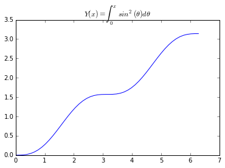
    


### 数值积分

数值积分：

$$F(x) = \lim_{n \rightarrow \infty} \sum_{i=0}^{n-1} f(x_i)(x_{i+1}-x_i) 
\Rightarrow F(x) = \int_{x_0}^{x_n} f(x) dx$$

导入贝塞尔函数：


```python
from scipy.special import jv
```


```python
def f(x):
    return jv(2.5, x)
```


```python
x = np.linspace(0, 10)
p = plt.plot(x, f(x), 'k-')
```


    

    


#### `quad` 函数

Quadrature 积分的原理参见：

http://en.wikipedia.org/wiki/Numerical_integration#Quadrature_rules_based_on_interpolating_functions

quad 返回一个 (积分值，误差) 组成的元组：


```python
from scipy.integrate import quad
interval = [0, 6.5]
value, max_err = quad(f, *interval)
```

积分值：


```python
print value
```

    1.28474297234


最大误差：


```python
print max_err
```

    2.34181853668e-09


积分区间图示，蓝色为正，红色为负：


```python
print "integral = {:.9f}".format(value)
print "upper bound on error: {:.2e}".format(max_err)
x = np.linspace(0, 10, 100)
p = plt.plot(x, f(x), 'k-')
x = np.linspace(0, 6.5, 45)
p = plt.fill_between(x, f(x), where=f(x)>0, color="blue")
p = plt.fill_between(x, f(x), where=f(x)<0, color="red", interpolate=True)
```

    integral = 1.284742972
    upper bound on error: 2.34e-09


    
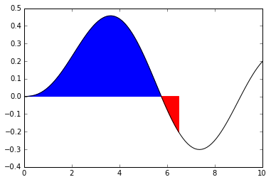
    


#### 积分到无穷


```python
from numpy import inf
interval = [0., inf]

def g(x):
    return np.exp(-x ** 1/2)
```


```python
value, max_err = quad(g, *interval)
x = np.linspace(0, 10, 50)
fig = plt.figure(figsize=(10,3))
p = plt.plot(x, g(x), 'k-')
p = plt.fill_between(x, g(x))
plt.annotate(r"$\int_0^{\infty}e^{-x^1/2}dx = $" + "{}".format(value), (4, 0.6),
         fontsize=16)
print "upper bound on error: {:.1e}".format(max_err)
```

    upper bound on error: 7.2e-11


    
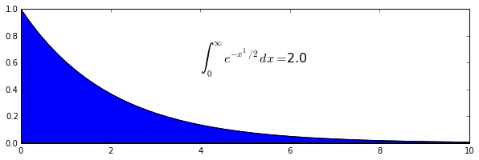
    


#### 双重积分

假设我们要进行如下的积分：

$$ I_n = \int \limits_0^{\infty} \int \limits_1^{\infty} \frac{e^{-xt}}{t^n}dt dx = \frac{1}{n}$$


```python
def h(x, t, n):
    """core function, takes x, t, n"""
    return np.exp(-x * t) / (t ** n)
```

一种方式是调用两次 `quad` 函数，不过这里 `quad` 的返回值不能向量化，所以使用了修饰符 `vectorize` 将其向量化：


```python
from numpy import vectorize
@vectorize
def int_h_dx(t, n):
    """Time integrand of h(x)."""
    return quad(h, 0, np.inf, args=(t, n))[0]
```


```python
@vectorize
def I_n(n):
    return quad(int_h_dx, 1, np.inf, args=(n))
```


```python
I_n([0.5, 1.0, 2.0, 5])
```


    (array([ 1.97,  1.  ,  0.5 ,  0.2 ]),
     array([  9.804e-13,   1.110e-14,   5.551e-15,   2.220e-15]))


或者直接调用 `dblquad` 函数，并将积分参数传入，传入方式有多种，后传入的先进行积分：


```python
from scipy.integrate import dblquad
@vectorize
def I(n):
    """Same as I_n, but using the built-in dblquad"""
    x_lower = 0
    x_upper = np.inf
    return dblquad(h,
                   lambda t_lower: 1, lambda t_upper: np.inf,
                   x_lower, x_upper, args=(n,))
```


```python
I_n([0.5, 1.0, 2.0, 5])
```


    (array([ 1.97,  1.  ,  0.5 ,  0.2 ]),
     array([  9.804e-13,   1.110e-14,   5.551e-15,   2.220e-15]))


### 采样点积分

#### trapz 方法 和 simps 方法


```python
from scipy.integrate import trapz, simps
```

`sin` 函数， `100` 个采样点和 `5` 个采样点：


```python
x_s = np.linspace(0, np.pi, 5)
y_s = np.sin(x_s)
x = np.linspace(0, np.pi, 100)
y = np.sin(x)
```


```python
p = plt.plot(x, y, 'k:')
p = plt.plot(x_s, y_s, 'k+-')
p = plt.fill_between(x_s, y_s, color="gray")
```


    
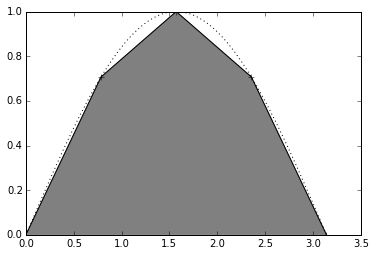
    


采用 [trapezoidal 方法](https://en.wikipedia.org/wiki/Trapezoidal_rule) 和 [simpson 方法](https://en.wikipedia.org/wiki/Simpson%27s_rule) 对这些采样点进行积分（函数积分为 2）：


```python
result_s = trapz(y_s, x_s)
result_s_s = simps(y_s, x_s)
result = trapz(y, x)
print "Trapezoidal Integration over 5 points : {:.3f}".format(result_s)
print "Simpson Integration over 5 points : {:.3f}".format(result_s_s)
print "Trapezoidal Integration over 100 points : {:.3f}".format(result)
```

    Trapezoidal Integration over 5 points : 1.896
    Simpson Integration over 5 points : 2.005
    Trapezoidal Integration over 100 points : 2.000


#### 使用 ufunc 进行积分

`Numpy` 中有很多 `ufunc` 对象：


```python
type(np.add)
```


    numpy.ufunc


```python
np.info(np.add.accumulate)
```

    accumulate(array, axis=0, dtype=None, out=None)
    
    Accumulate the result of applying the operator to all elements.
    
    For a one-dimensional array, accumulate produces results equivalent to::
    
      r = np.empty(len(A))
      t = op.identity        ## op = the ufunc being applied to A's  elements
      for i in range(len(A)):
          t = op(t, A[i])
          r[i] = t
      return r
    
    For example, add.accumulate() is equivalent to np.cumsum().
    
    For a multi-dimensional array, accumulate is applied along only one
    axis (axis zero by default; see Examples below) so repeated use is
    necessary if one wants to accumulate over multiple axes.
    
    Parameters
    ----------
    array : array_like
        The array to act on.
    axis : int, optional
        The axis along which to apply the accumulation; default is zero.
    dtype : data-type code, optional
        The data-type used to represent the intermediate results. Defaults
        to the data-type of the output array if such is provided, or the
        the data-type of the input array if no output array is provided.
    out : ndarray, optional
        A location into which the result is stored. If not provided a
        freshly-allocated array is returned.
    
    Returns
    -------
    r : ndarray
        The accumulated values. If `out` was supplied, `r` is a reference to
        `out`.
    
    Examples
    --------
    1-D array examples:
    
    >>> np.add.accumulate([2, 3, 5])
    array([ 2,  5, 10])
    >>> np.multiply.accumulate([2, 3, 5])
    array([ 2,  6, 30])
    
    2-D array examples:
    
    >>> I = np.eye(2)
    >>> I
    array([[ 1.,  0.],
           [ 0.,  1.]])
    
    Accumulate along axis 0 (rows), down columns:
    
    >>> np.add.accumulate(I, 0)
    array([[ 1.,  0.],
           [ 1.,  1.]])
    >>> np.add.accumulate(I) ## no axis specified = axis zero
    array([[ 1.,  0.],
           [ 1.,  1.]])
    
    Accumulate along axis 1 (columns), through rows:
    
    >>> np.add.accumulate(I, 1)
    array([[ 1.,  1.],
           [ 0.,  1.]])


`np.add.accumulate` 相当于 `cumsum` ：


```python
result_np = np.add.accumulate(y) * (x[1] - x[0]) - (x[1] - x[0]) / 2
```


```python
p = plt.plot(x, - np.cos(x) + np.cos(0), 'rx')
p = plt.plot(x, result_np)
```


    
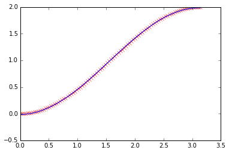
    


#### 速度比较

计算积分：$$\int_0^x sin \theta d\theta$$


```python
import sympy
from sympy.abc import x, theta
sympy_x = x
```


```python
x = np.linspace(0, 20 * np.pi, 1e+4)
y = np.sin(x)
sympy_y = vectorize(lambda x: sympy.integrate(sympy.sin(theta), (theta, 0, x)))
```

`numpy` 方法：


```python
%timeit np.add.accumulate(y) * (x[1] - x[0])
y0 = np.add.accumulate(y) * (x[1] - x[0])
print y0[-1] 
```

    The slowest run took 4.32 times longer than the fastest. This could mean that an intermediate result is being cached 
    10000 loops, best of 3: 56.2 µs per loop
    -2.34138044756e-17


`quad` 方法：


```python
%timeit quad(np.sin, 0, 20 * np.pi)
y2 = quad(np.sin, 0, 20 * np.pi, full_output=True)
print "result = ", y2[0]
print "number of evaluations", y2[-1]['neval']
```

    10000 loops, best of 3: 40.5 µs per loop
    result =  3.43781337153e-15
    number of evaluations 21


`trapz` 方法：


```python
%timeit trapz(y, x)
y1 = trapz(y, x)
print y1
```

    10000 loops, best of 3: 105 µs per loop
    -4.4408920985e-16


`simps` 方法：


```python
%timeit simps(y, x)
y3 = simps(y, x)
print y3
```

    1000 loops, best of 3: 801 µs per loop
    3.28428554968e-16


`sympy` 积分方法：


```python
%timeit sympy_y(20 * np.pi)
y4 = sympy_y(20 * np.pi)
print y4
```

    100 loops, best of 3: 6.86 ms per loop
    0

## 解微分方程


```python
%pylab inline
```

    Populating the interactive namespace from numpy and matplotlib


### 积分求解

#### 简单的例子

$$\frac{dy}{dt} = sin(t)$$


```python
def dy_dt(y, t):
    return np.sin(t)
```

积分求解：


```python
from scipy.integrate import odeint

t = np.linspace(0, 2*pi, 100)

result = odeint(dy_dt, 0, t)
```


```python
fig = figure(figsize=(12,4))
p = plot(t, result, "rx", label=r"$\int_{0}^{x}sin(t) dt $")
p = plot(t, -cos(t) + cos(0), label=r"$cos(0) - cos(t)$")
p = plot(t, dy_dt(0, t), "g-", label=r"$\frac{dy}{dt}(t)$")
l = legend(loc="upper right")
xl = xlabel("t")
```


    
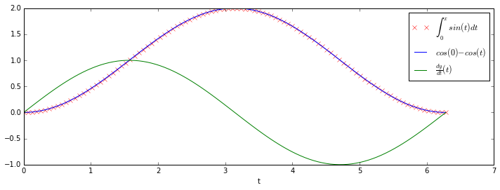
    


#### 高阶微分方程

抛物运动（竖直方向）：

$$
\frac{d^2x}{dt^2} = g - \frac{D}{m}\frac{dx}{dt}
$$

改写成如下形式：

$$y = \left[x, \frac{dx}{dt}\right] $$

$$\begin{aligned}
\frac{dy_0}{dt} &= y_1 \\\
\frac{dy_1}{dt} &= -g - \frac{D}{m} y_1 \\\
\end{aligned}
$$


```python
def dy_dt(y, t):
    """Governing equations for projectile motion with drag.
    y[0] = position
    y[1] = velocity
    g = gravity (m/s2)
    D = drag (1/s) = force/velocity
    m = mass (kg)
    """
    g = -9.8
    D = 0.1
    m = 0.15
    dy1 = g - (D/m) * y[1]
    dy0 = y[1] if y[0] >= 0 else 0.
    return [dy0, dy1]
```


```python
position_0 = 0.
velocity_0 = 100
t = linspace(0, 12, 100)
y = odeint(dy_dt, [position_0, velocity_0], t)
```


```python
p = plot(t, y[:,0])
yl = ylabel("Height (m)")
xl = xlabel("Time (s)")
```


    
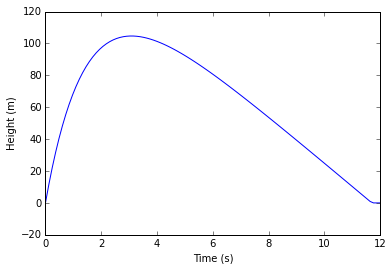
    


```python
y, infodict = odeint(dy_dt, [position_0, velocity_0], t, full_output=True, printmessg=True, )
print sorted(infodict.keys())
print "cumulative number of function evaluations at each calculated point:", infodict['nfe']
print "cumulative number of time steps", infodict['nst']
```

    Integration successful.
    ['hu', 'imxer', 'leniw', 'lenrw', 'message', 'mused', 'nfe', 'nje', 'nqu', 'nst', 'tcur', 'tolsf', 'tsw']
    cumulative number of function evaluations at each calculated point: [ 45  49  51  53  55  59  61  61  63  65  67  67  69  71  73  73  75  77
      77  79  79  81  81  83  85  85  87  87  89  89  91  91  93  95  95  97
      97  99  99 101 101 103 103 105 107 107 109 109 111 111 113 113 115 115
     117 117 119 119 121 121 123 123 123 125 125 127 127 129 129 131 131 131
     133 133 135 135 135 137 137 139 139 139 141 141 143 143 143 145 145 147
     147 149 149 149 154 158 274 280 280]
    cumulative number of time steps [ 20  22  23  24  25  27  28  28  29  30  31  31  32  33  34  34  35  36
      36  37  37  38  38  39  40  40  41  41  42  42  43  43  44  45  45  46
      46  47  47  48  48  49  49  50  51  51  52  52  53  53  54  54  55  55
      56  56  57  57  58  58  59  59  59  60  60  61  61  62  62  63  63  63
      64  64  65  65  65  66  66  67  67  67  68  68  69  69  69  70  70  71
      71  72  72  72  73  75 130 133 133]

## 稀疏矩阵

`Scipy` 提供了稀疏矩阵的支持（`scipy.sparse`）。

稀疏矩阵主要使用 位置 + 值 的方法来存储矩阵的非零元素，根据存储和使用方式的不同，有如下几种类型的稀疏矩阵：

类型|描述
---|----
`bsr_matrix(arg1[, shape, dtype, copy, blocksize])`	| Block Sparse Row matrix
`coo_matrix(arg1[, shape, dtype, copy])`	| A sparse matrix in COOrdinate format.
`csc_matrix(arg1[, shape, dtype, copy])`	| Compressed Sparse Column matrix
`csr_matrix(arg1[, shape, dtype, copy])`	| Compressed Sparse Row matrix
`dia_matrix(arg1[, shape, dtype, copy])`	| Sparse matrix with DIAgonal storage
`dok_matrix(arg1[, shape, dtype, copy])`	| Dictionary Of Keys based sparse matrix.
`lil_matrix(arg1[, shape, dtype, copy])`	| Row-based linked list sparse matrix

在这些存储格式中：

- COO 格式在构建矩阵时比较高效
- CSC 和 CSR 格式在乘法计算时比较高效

### 构建稀疏矩阵


```python
from scipy.sparse import *
import numpy as np
```

创建一个空的稀疏矩阵：


```python
coo_matrix((2,3))
```


    <2x3 sparse matrix of type '<type 'numpy.float64'>'
    	with 0 stored elements in COOrdinate format>


也可以使用一个已有的矩阵或数组或列表中创建新矩阵：


```python
A = coo_matrix([[1,2,0],[0,0,3],[4,0,5]])
print A
```

      (0, 0)	1
      (0, 1)	2
      (1, 2)	3
      (2, 0)	4
      (2, 2)	5


不同格式的稀疏矩阵可以相互转化：


```python
type(A)
```


    scipy.sparse.coo.coo_matrix


```python
B = A.tocsr()
type(B)
```


    scipy.sparse.csr.csr_matrix


可以转化为普通矩阵：


```python
C = A.todense()
C
```


    matrix([[1, 2, 0],
            [0, 0, 3],
            [4, 0, 5]])


与向量的乘法：


```python
v = np.array([1,0,-1])
A.dot(v)
```


    array([ 1, -3, -1])


还可以传入一个 `(data, (row, col))` 的元组来构建稀疏矩阵：


```python
I = np.array([0,3,1,0])
J = np.array([0,3,1,2])
V = np.array([4,5,7,9])
A = coo_matrix((V,(I,J)),shape=(4,4))
```


```python
print A
```

      (0, 0)	4
      (3, 3)	5
      (1, 1)	7
      (0, 2)	9


COO 格式的稀疏矩阵在构建的时候只是简单的将坐标和值加到后面，对于重复的坐标不进行处理：


```python
I = np.array([0,0,1,3,1,0,0])
J = np.array([0,2,1,3,1,0,0])
V = np.array([1,1,1,1,1,1,1])
B = coo_matrix((V,(I,J)),shape=(4,4))
print B
```

      (0, 0)	1
      (0, 2)	1
      (1, 1)	1
      (3, 3)	1
      (1, 1)	1
      (0, 0)	1
      (0, 0)	1


转换成 CSR 格式会自动将相同坐标的值合并：


```python
C = B.tocsr()
print C
```

      (0, 0)	3
      (0, 2)	1
      (1, 1)	2
      (3, 3)	1


### 求解微分方程


```python
from scipy.sparse import lil_matrix
from scipy.sparse.linalg import spsolve
from numpy.linalg import solve, norm
from numpy.random import rand
```

构建 `1000 x 1000` 的稀疏矩阵：


```python
A = lil_matrix((1000, 1000))
A[0, :100] = rand(100)
A[1, 100:200] = A[0, :100]
A.setdiag(rand(1000))
```

转化为 CSR 之后，用 `spsolve` 求解 $Ax=b$：


```python
A = A.tocsr()
b = rand(1000)
x = spsolve(A, b)
```

转化成正常数组之后求解：


```python
x_ = solve(A.toarray(), b)
```

查看误差：


```python
err = norm(x-x_)
err
```


    6.4310987107687431e-13


### sparse.find 函数

返回一个三元组，表示稀疏矩阵中非零元素的 `(row, col, value)`：


```python
from scipy import sparse

row, col, val = sparse.find(C)
print row, col, val
```

    [0 0 1 3] [0 2 1 3] [3 1 2 1]


### sparse.issparse 函数

查看一个对象是否为稀疏矩阵：


```python
sparse.issparse(B)
```


    True


或者


```python
sparse.isspmatrix(B.todense())
```


    False


还可以查询是否为指定格式的稀疏矩阵：


```python
sparse.isspmatrix_coo(B)
```


    True


```python
sparse.isspmatrix_csr(B)
```


    False


## 线性代数

`numpy` 和 `scipy` 中，负责进行线性代数部分计算的模块叫做 `linalg`。


```python
import numpy as np
import numpy.linalg
import scipy as sp
import scipy.linalg
import matplotlib.pyplot as plt
from scipy import linalg

%matplotlib inline
```

### numpy.linalg VS scipy.linalg

一方面`scipy.linalg` 包含 `numpy.linalg` 中的所有函数，同时还包含了很多 `numpy.linalg` 中没有的函数。

另一方面，`scipy.linalg` 能够保证这些函数使用 BLAS/LAPACK 加速，而 `numpy.linalg` 中这些加速是可选的。

因此，在使用时，我们一般使用 `scipy.linalg` 而不是 `numpy.linalg`。

我们可以简单看看两个模块的差异：


```python
print "number of items in numpy.linalg:", len(dir(numpy.linalg))
print "number of items in scipy.linalg:", len(dir(scipy.linalg))
```

    number of items in numpy.linalg: 36
    number of items in scipy.linalg: 115


### numpy.matrix VS 2D numpy.ndarray

线性代数的基本操作对象是矩阵，而矩阵的表示方法主要有两种：`numpy.matrix` 和 2D `numpy.ndarray`。

#### numpy.matrix

`numpy.matrix` 是一个矩阵类，提供了一些方便的矩阵操作：
- 支持类似 `MATLAB` 创建矩阵的语法
- 矩阵乘法默认用 `*` 号
- `.I` 表示逆，`.T` 表示转置

可以用 `mat` 或者 `matrix` 来产生矩阵：


```python
A = np.mat("[1, 2; 3, 4]")
print repr(A)

A = np.matrix("[1, 2; 3, 4]")
print repr(A)
```

    matrix([[1, 2],
            [3, 4]])
    matrix([[1, 2],
            [3, 4]])


转置和逆：


```python
print repr(A.I)
print repr(A.T)
```

    matrix([[-2. ,  1. ],
            [ 1.5, -0.5]])
    matrix([[1, 3],
            [2, 4]])


矩阵乘法：


```python
b = np.mat('[5; 6]')
print repr(A * b)
```

    matrix([[17],
            [39]])


#### 2 维 numpy.ndarray

虽然 `numpy.matrix` 有着上面的好处，但是一般不建议使用，而是用 2 维 `numpy.ndarray` 对象替代，这样可以避免一些不必要的困惑。

我们可以使用 `array` 复现上面的操作：


```python
A = np.array([[1,2], [3,4]])
print repr(A)
```

    array([[1, 2],
           [3, 4]])


逆和转置：


```python
print repr(linalg.inv(A))
print repr(A.T)
```

    array([[-2. ,  1. ],
           [ 1.5, -0.5]])
    array([[1, 3],
           [2, 4]])


矩阵乘法：


```python
b = np.array([5, 6])

print repr(A.dot(b))
```

    array([17, 39])


普通乘法：


```python
print repr(A * b)
```

    array([[ 5, 12],
           [15, 24]])


`scipy.linalg` 的操作可以作用到两种类型的对象上，没有区别。

### 基本操作

#### 求逆

矩阵 $\mathbf{A}$ 的逆 $\mathbf{B}$ 满足：$\mathbf{BA}=\mathbf{AB}=I$，记作 $\mathbf{B} = \mathbf{A}^{-1}$。

事实上，我们已经见过求逆的操作，`linalg.inv` 可以求一个可逆矩阵的逆：


```python
A = np.array([[1,2],[3,4]])

print linalg.inv(A)

print A.dot(scipy.linalg.inv(A))
```

    [[-2.   1. ]
     [ 1.5 -0.5]]
    [[  1.00000000e+00   0.00000000e+00]
     [  8.88178420e-16   1.00000000e+00]]


#### 求解线性方程组

例如，下列方程组
$$
\begin{eqnarray*} 
x + 3y + 5z & = & 10 \\
2x + 5y + z & = & 8  \\
2x + 3y + 8z & = & 3
\end{eqnarray*}
$$
的解为：
$$
\begin{split}\left[\begin{array}{c} x\\ y\\ z\end{array}\right]=\left[\begin{array}{ccc} 1 & 3 & 5\\ 2 & 5 & 1\\ 2 & 3 & 8\end{array}\right]^{-1}\left[\begin{array}{c} 10\\ 8\\ 3\end{array}\right]=\frac{1}{25}\left[\begin{array}{c} -232\\ 129\\ 19\end{array}\right]=\left[\begin{array}{c} -9.28\\ 5.16\\ 0.76\end{array}\right].\end{split}
$$

我们可以使用 `linalg.solve` 求解方程组，也可以先求逆再相乘，两者中 `solve` 比较快。


```python
import time

A = np.array([[1, 3, 5],
              [2, 5, 1],
              [2, 3, 8]])
b = np.array([10, 8, 3])

tic = time.time()

for i in xrange(1000):
    x = linalg.inv(A).dot(b)

print x
print A.dot(x)-b
print "inv and dot: {} s".format(time.time() - tic)

tic = time.time()

for i in xrange(1000):
    x = linalg.solve(A, b)

print x
print A.dot(x)-b
print "solve: {} s".format(time.time() - tic)
```

    [-9.28  5.16  0.76]
    [  0.00000000e+00  -1.77635684e-15  -8.88178420e-16]
    inv and dot: 0.0353579521179 s
    [-9.28  5.16  0.76]
    [  0.00000000e+00  -1.77635684e-15  -1.77635684e-15]
    solve: 0.0284671783447 s


#### 计算行列式

方阵的行列式为
$$
\left|\mathbf{A}\right|=\sum_{j}\left(-1\right)^{i+j}a_{ij}M_{ij}.
$$

其中 $a_{ij}$ 表示 $\mathbf{A}$ 的第 $i$ 行 第 $j$ 列的元素，$M_{ij}$ 表示矩阵 $\mathbf{A}$ 去掉第 $i$ 行 第 $j$ 列的新矩阵的行列式。

例如，矩阵
$$
\begin{split}\mathbf{A=}\left[\begin{array}{ccc} 1 & 3 & 5\\ 2 & 5 & 1\\ 2 & 3 & 8\end{array}\right]\end{split}
$$
的行列式是：
$$
\begin{eqnarray*} \left|\mathbf{A}\right| & = & 1\left|\begin{array}{cc} 5 & 1\\ 3 & 8\end{array}\right|-3\left|\begin{array}{cc} 2 & 1\\ 2 & 8\end{array}\right|+5\left|\begin{array}{cc} 2 & 5\\ 2 & 3\end{array}\right|\\  & = & 1\left(5\cdot8-3\cdot1\right)-3\left(2\cdot8-2\cdot1\right)+5\left(2\cdot3-2\cdot5\right)=-25.\end{eqnarray*}
$$

可以用 `linalg.det` 计算行列式：


```python
A = np.array([[1, 3, 5],
              [2, 5, 1],
              [2, 3, 8]])

print linalg.det(A)
```

    -25.0


#### 计算矩阵或向量的模

矩阵的模定义如下：
$$
\begin{split}\left\Vert \mathbf{A}\right\Vert =\left\{ \begin{array}{cc} \max_{i}\sum_{j}\left|a_{ij}\right| & \textrm{ord}=\textrm{inf}\\ \min_{i}\sum_{j}\left|a_{ij}\right| & \textrm{ord}=-\textrm{inf}\\ \max_{j}\sum_{i}\left|a_{ij}\right| & \textrm{ord}=1\\ \min_{j}\sum_{i}\left|a_{ij}\right| & \textrm{ord}=-1\\ \max\sigma_{i} & \textrm{ord}=2\\ \min\sigma_{i} & \textrm{ord}=-2\\ \sqrt{\textrm{trace}\left(\mathbf{A}^{H}\mathbf{A}\right)} & \textrm{ord}=\textrm{'fro'}\end{array}\right.\end{split}
$$
其中，$\sigma_i$ 是矩阵的奇异值。

向量的模定义如下：
$$
\begin{split}\left\Vert \mathbf{x}\right\Vert =\left\{ \begin{array}{cc} \max\left|x_{i}\right| & \textrm{ord}=\textrm{inf}\\ \min\left|x_{i}\right| & \textrm{ord}=-\textrm{inf}\\ \left(\sum_{i}\left|x_{i}\right|^{\textrm{ord}}\right)^{1/\textrm{ord}} & \left|\textrm{ord}\right|<\infty.\end{array}\right.\end{split}
$$

`linalg.norm` 可以计算向量或者矩阵的模：


```python
A = np.array([[1, 2],
              [3, 4]])

print linalg.norm(A)

print linalg.norm(A,'fro') ## frobenius norm 默认值

print linalg.norm(A,1) ## L1 norm 最大列和

print linalg.norm(A,-1) ## L -1 norm 最小列和

print linalg.norm(A,np.inf) ## L inf norm 最大行和
```

    5.47722557505
    5.47722557505
    6
    4
    7


#### 最小二乘解和伪逆

##### 问题描述

所谓最小二乘问题的定义如下：

假设 $y_i$ 与 $\mathbf{x_i}$ 的关系可以用一组系数 $c_j$ 和对应的模型函数 $f_j(\mathbf{x_i})$ 的模型表示：

$$
y_{i}=\sum_{j}c_{j}f_{j}\left(\mathbf{x}_{i}\right)+\epsilon_{i}
$$

其中 $\epsilon_i$ 表示数据的不确定性。最小二乘就是要优化这样一个关于 $c_j$ 的问题：
$$
J\left(\mathbf{c}\right)=\sum_{i}\left|y_{i}-\sum_{j}c_{j}f_{j}\left(x_{i}\right)\right|^{2}
$$

其理论解满足：
$$
\frac{\partial J}{\partial c_{n}^{*}}=0=\sum_{i}\left(y_{i}-\sum_{j}c_{j}f_{j}\left(x_{i}\right)\right)\left(-f_{n}^{*}\left(x_{i}\right)\right)
$$

改写为：
$$
\begin{eqnarray*} \sum_{j}c_{j}\sum_{i}f_{j}\left(x_{i}\right)f_{n}^{*}\left(x_{i}\right) & = & \sum_{i}y_{i}f_{n}^{*}\left(x_{i}\right)\\ \mathbf{A}^{H}\mathbf{Ac} & = & \mathbf{A}^{H}\mathbf{y}\end{eqnarray*}
$$

其中：
$$
\left\{ \mathbf{A}\right\} _{ij}=f_{j}\left(x_{i}\right).
$$

当 $\mathbf{A^HA}$ 可逆时，我们有：
$$
\mathbf{c}=\left(\mathbf{A}^{H}\mathbf{A}\right)^{-1}\mathbf{A}^{H}\mathbf{y}=\mathbf{A}^{\dagger}\mathbf{y}
$$

矩阵 $\mathbf{A}^{\dagger}$ 叫做 $\mathbf{A}$ 的伪逆。

##### 问题求解

注意到，我们的模型可以写为：
$$
\mathbf{y}=\mathbf{Ac}+\boldsymbol{\epsilon}.
$$

在给定 $\mathbf{y}$ 和 $\mathbf{A}$ 的情况下，我们可以使用 `linalg.lstsq` 求解 $\mathbf c$。

在给定 $\mathbf{A}$ 的情况下，我们可以使用 `linalg.pinv` 或者 `linalg.pinv2` 求解 $\mathbf{A}^{\dagger}$。

#####  例子

假设我们的数据满足：
$$
\begin{align}
y_{i} & =c_{1}e^{-x_{i}}+c_{2}x_{i} \\
z_{i} & = y_i + \epsilon_i
\end{align}
$$

其中 $x_i = \frac{i}{10},\ i = 1,\dots,10$，$c_1 = 5, c_2 = 2$，产生数据


```python
c1, c2 = 5.0, 2.0
i = np.r_[1:11]
xi = 0.1*i
yi = c1*np.exp(-xi) + c2*xi
zi = yi + 0.05 * np.max(yi) * np.random.randn(len(yi))
```

构造矩阵 $\mathbf A$：


```python
A = np.c_[np.exp(-xi)[:, np.newaxis], xi[:, np.newaxis]]
print A
```

    [[ 0.90483742  0.1       ]
     [ 0.81873075  0.2       ]
     [ 0.74081822  0.3       ]
     [ 0.67032005  0.4       ]
     [ 0.60653066  0.5       ]
     [ 0.54881164  0.6       ]
     [ 0.4965853   0.7       ]
     [ 0.44932896  0.8       ]
     [ 0.40656966  0.9       ]
     [ 0.36787944  1.        ]]


求解最小二乘问题：


```python
c, resid, rank, sigma = linalg.lstsq(A, zi)

print c
```

    [ 4.87016856  2.19081311]


其中 `c` 的形状与 `zi` 一致，为最小二乘解，`resid` 为 `zi - A c` 每一列差值的二范数，`rank` 为矩阵 `A` 的秩，`sigma` 为矩阵 `A` 的奇异值。

查看拟合效果：


```python
xi2 = np.r_[0.1:1.0:100j]
yi2 = c[0]*np.exp(-xi2) + c[1]*xi2

plt.plot(xi,zi,'x',xi2,yi2)
plt.axis([0,1.1,3.0,5.5])
plt.xlabel('$x_i$')
plt.title('Data fitting with linalg.lstsq')
plt.show()
```


    
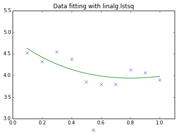
    


#### 广义逆

`linalg.pinv` 或 `linalg.pinv2` 可以用来求广义逆，其区别在于前者使用求最小二乘解的算法，后者使用求奇异值的算法求解。

### 矩阵分解

#### 特征值和特征向量

##### 问题描述

对于给定的 $N \times N$ 矩阵 $\mathbf A$，特征值和特征向量问题相当与寻找标量 $\lambda$ 和对应的向量 $\mathbf v$ 使得：
$$
\mathbf{Av} = \lambda \mathbf{v}
$$

矩阵的 $N$ 个特征值（可能相同）可以通过计算特征方程的根得到：
$$
\left|\mathbf{A} - \lambda \mathbf{I}\right| = 0
$$

然后利用这些特征值求（归一化的）特征向量。

##### 问题求解

- `linalg.eig(A)` 
    - 返回矩阵的特征值与特征向量
- `linalg.eigvals(A)`
    - 返回矩阵的特征值
- `linalg.eig(A, B)`
    - 求解 $\mathbf{Av} = \lambda\mathbf{Bv}$ 的问题

##### 例子

矩阵为
$$
\begin{split}\mathbf{A}=\left[\begin{array}{ccc} 1 & 5 & 2\\ 2 & 4 & 1\\ 3 & 6 & 2\end{array}\right].\end{split}
$$

特征多项式为：
$$
\begin{eqnarray*} \left|\mathbf{A}-\lambda\mathbf{I}\right| & = & \left(1-\lambda\right)\left[\left(4-\lambda\right)\left(2-\lambda\right)-6\right]-\\  &  & 5\left[2\left(2-\lambda\right)-3\right]+2\left[12-3\left(4-\lambda\right)\right]\\  & = & -\lambda^{3}+7\lambda^{2}+8\lambda-3.\end{eqnarray*}
$$

特征根为：
$$
\begin{eqnarray*} \lambda_{1} & = & 7.9579\\ \lambda_{2} & = & -1.2577\\ \lambda_{3} & = & 0.2997.\end{eqnarray*}
$$


```python
A = np.array([[1, 5, 2], 
              [2, 4, 1],
              [3, 6, 2]])

la, v = linalg.eig(A)

print la


## 验证是否归一化
print np.sum(abs(v**2),axis=0)

## 第一个特征值
l1 = la[0]
## 对应的特征向量
v1 = v[:, 0].T

## 验证是否为特征值和特征向量对
print linalg.norm(A.dot(v1)-l1*v1)
```

    [ 7.95791620+0.j -1.25766471+0.j  0.29974850+0.j]
    [ 1.  1.  1.]
    3.23301824835e-15


#### 奇异值分解

##### 问题描述

$M \times N$ 矩阵 $\mathbf A$ 的奇异值分解为：
$$
\mathbf{A=U}\boldsymbol{\Sigma}\mathbf{V}^{H}
$$

其中 $\boldsymbol{\Sigma}, (M \times N)$ 只有对角线上的元素不为 0，$\mathbf U, (M \times M)$ 和 $\mathbf V, (N \times N)$ 为正交矩阵。

其具体原理可以查看维基百科：
https://en.wikipedia.org/wiki/Singular_value_decomposition

##### 问题求解

- `U,s,Vh = linalg.svd(A)` 
    - 返回 $U$ 矩阵，奇异值 $s$，$V^H$ 矩阵
- `Sig = linalg.diagsvd(s,M,N)`
    - 从奇异值恢复 $\boldsymbol{\Sigma}$ 矩阵

##### 例子

奇异值分解：


```python
A = np.array([[1,2,3],[4,5,6]])

U, s, Vh = linalg.svd(A)
```

$\boldsymbol{\Sigma}$ 矩阵：


```python
M, N = A.shape
Sig = linalg.diagsvd(s,M,N)

print Sig
```

    [[ 9.508032    0.          0.        ]
     [ 0.          0.77286964  0.        ]]


检查正确性：


```python
print A
print U.dot(Sig.dot(Vh))
```

    [[1 2 3]
     [4 5 6]]
    [[ 1.  2.  3.]
     [ 4.  5.  6.]]


#### LU 分解

$M \times N$ 矩阵 $\mathbf A$ 的 `LU` 分解为：
$$
\mathbf{A}=\mathbf{P}\,\mathbf{L}\,\mathbf{U}
$$

$\mathbf P$ 是 $M \times M$ 的单位矩阵的一个排列，$\mathbf L$ 是下三角阵，$\mathbf U$ 是上三角阵。 

可以使用 `linalg.lu` 进行 LU 分解的求解：

具体原理可以查看维基百科：
https://en.wikipedia.org/wiki/LU_decomposition


```python
A = np.array([[1,2,3],[4,5,6]])

P, L, U = linalg.lu(A)

print P
print L
print U

print P.dot(L).dot(U)
```

    [[ 0.  1.]
     [ 1.  0.]]
    [[ 1.    0.  ]
     [ 0.25  1.  ]]
    [[ 4.    5.    6.  ]
     [ 0.    0.75  1.5 ]]
    [[ 1.  2.  3.]
     [ 4.  5.  6.]]


#### Cholesky 分解

`Cholesky` 分解是一种特殊的 `LU` 分解，此时要求 $\mathbf A$ 为 Hermitian 正定矩阵 （$\mathbf A = \mathbf{A^H}$）。

此时有：
$$
\begin{eqnarray*} \mathbf{A} & = & \mathbf{U}^{H}\mathbf{U}\\ \mathbf{A} & = & \mathbf{L}\mathbf{L}^{H}\end{eqnarray*}
$$
即
$$
\mathbf{L}=\mathbf{U}^{H}.
$$

可以用 `linalg.cholesky` 求解。

#### QR 分解

$M×N$ 矩阵 $\mathbf A$ 的 `QR` 分解为：
$$
\mathbf{A=QR}
$$

$\mathbf R$ 为上三角形矩阵，$\mathbf Q$ 是正交矩阵。

维基链接：
https://en.wikipedia.org/wiki/QR_decomposition

可以用 `linalg.qr` 求解。

#### Schur 分解

对于 $N\times N$ 方阵 $\mathbf A$, `Schur` 分解要求找到满足下式的矩阵：
$$
\mathbf{A=ZTZ^H}
$$

其中 $\mathbf Z$ 是正交矩阵，$\mathbf T$ 是一个上三角矩阵。

维基链接：
https://en.wikipedia.org/wiki/Schur_decomposition


```python
A = np.mat('[1 3 2; 1 4 5; 2 3 6]')

print A

T, Z = linalg.schur(A)

print T, Z

print Z.dot(T).dot(Z.T)
```

    [[1 3 2]
     [1 4 5]
     [2 3 6]]
    [[ 9.90012467  1.78947961 -0.65498528]
     [ 0.          0.54993766 -1.57754789]
     [ 0.          0.51260928  0.54993766]] [[ 0.36702395 -0.85002495 -0.37782404]
     [ 0.63681656 -0.06646488  0.76814522]
     [ 0.67805463  0.52253231 -0.51691576]]
    [[ 1.  3.  2.]
     [ 1.  4.  5.]
     [ 2.  3.  6.]]


### 矩阵函数

考虑函数 $f(x)$ 的泰勒展开：
$$
f\left(x\right)=\sum_{k=0}^{\infty}\frac{f^{\left(k\right)}\left(0\right)}{k!}x^{k}
$$

对于方阵，矩阵函数可以定义如下：
$$
f\left(\mathbf{A}\right)=\sum_{k=0}^{\infty}\frac{f^{\left(k\right)}\left(0\right)}{k!}\mathbf{A}^{k}
$$

这也是计算矩阵函数的最好的方式。

#### 指数和对数函数

##### 指数

指数可以定义如下：
$$
e^{\mathbf{A}}=\sum_{k=0}^{\infty}\frac{1}{k!}\mathbf{A}^{k}
$$

`linalg.expm3` 使用的是泰勒展开的方法计算结果：


```python
A = np.array([[1, 2], [3, 4]])

print linalg.expm3(A)
```

    [[  51.96890355   74.73648784]
     [ 112.10473176  164.07363531]]


另一种方法先计算 A 的特征值分解：
$$
\mathbf{A}=\mathbf{V}\boldsymbol{\Lambda}\mathbf{V}^{-1}
$$

然后有（正交矩阵和对角阵的性质）：
$$
e^{\mathbf{A}}=\mathbf{V}e^{\boldsymbol{\Lambda}}\mathbf{V}^{-1}
$$

`linalg.expm2` 使用的就是这种方法：


```python
print linalg.expm2(A)
```

    [[  51.9689562    74.73656457]
     [ 112.10484685  164.07380305]]


最优的方法是用 [`Padé` 近似](https://en.wikipedia.org/wiki/Pad%C3%A9_approximant) 实现，`Padé` 近似往往比截断的泰勒级数准确，而且当泰勒级数不收敛时，`Padé` 近似往往仍可行，所以多用于在计算机数学中。

`linalg.expm` 使用的就是这种方法：


```python
print linalg.expm(A)
```

    [[  51.9689562    74.73656457]
     [ 112.10484685  164.07380305]]


##### 对数

指数的逆运算，可以用 `linalg.logm` 实现：


```python
print A
print linalg.logm(linalg.expm(A))
```

    [[1 2]
     [3 4]]
    [[ 1.  2.]
     [ 3.  4.]]


#### 三角函数

根据欧拉公式，其定义为：
$$
\begin{eqnarray*} \sin\left(\mathbf{A}\right) & = & \frac{e^{j\mathbf{A}}-e^{-j\mathbf{A}}}{2j}\\ \cos\left(\mathbf{A}\right) & = & \frac{e^{j\mathbf{A}}+e^{-j\mathbf{A}}}{2}.\end{eqnarray*}
$$

正切函数定义为：
$$
\tan\left(x\right)=\frac{\sin\left(x\right)}{\cos\left(x\right)}=\left[\cos\left(x\right)\right]^{-1}\sin\left(x\right)
$$

因此矩阵的正切函数定义为：
$$
\left[\cos\left(\mathbf{A}\right)\right]^{-1}\sin\left(\mathbf{A}\right).
$$

具体实现：
- `linalg.sinm`
- `linalg.cosm`
- `linalg.tanm`

#### 双曲三角函数

\begin{eqnarray*} \sinh\left(\mathbf{A}\right) & = & \frac{e^{\mathbf{A}}-e^{-\mathbf{A}}}{2}\\ \cosh\left(\mathbf{A}\right) & = & \frac{e^{\mathbf{A}}+e^{-\mathbf{A}}}{2}\\ \tanh\left(\mathbf{A}\right) & = & \left[\cosh\left(\mathbf{A}\right)\right]^{-1}\sinh\left(\mathbf{A}\right).\end{eqnarray*}

具体实现：
- `linalg.sinhm`
- `linalg.coshm`
- `linalg.tanhm`

### 特殊矩阵

`Scipy` 提供了一些特殊矩阵的实现，具体可以参考：

http://docs.scipy.org/doc/scipy/reference/tutorial/linalg.html#special-matrices
## 稀疏矩阵的线性代数

对于稀疏矩阵来说，其线性代数操作可以使用 `scipy.sparse.linalg` 实现：


```python
import scipy.sparse.linalg
```

### 矩阵操作

- `scipy.sparse.linalg.inv`
    - 稀疏矩阵求逆
- `scipy.sparse.linalg.expm`
    - 求稀疏矩阵的指数函数

### 矩阵范数

- `scipy.sparse.linalg.norm`
    - 稀疏矩阵求范数

### 线性方程组求解

提供了一系列求解方法：
http://docs.scipy.org/doc/scipy/reference/sparse.linalg.html#solving-linear-problems

主要使用的是迭代方法求解。

### 特征值分解和奇异值分解

对于特别大的矩阵，原来的方法可能需要太大的内存，考虑使用这两个方法替代：

- `scipy.sparse.linalg.eigs`
    - 返回前 k 大的特征值和特征向量
- `scipy.sparse.linalg.svds`
    - 返回前 k 大的奇异值和奇异向量

### <font color="red">所有的这些操作既可以在稀疏矩阵上使用，也可以在普通矩阵上使用。</font>
