# Pyplot 教程

## Matplotlib 简介

**`matplotlib`** 是一个 **`Python`** 的 `2D` 图形包。

在线文档：http://matplotlib.org ，提供了 [Examples](http://matplotlib.org/examples/index.html), [FAQ](http://matplotlib.org/faq/index.html), [API](http://matplotlib.org/contents.html), [Gallery](http://matplotlib.org/gallery.html)，其中 [Gallery](http://matplotlib.org/gallery.html) 是很有用的一个部分，因为它提供了各种画图方式的可视化，方便用户根据需求进行选择。

## 使用 Pyplot

导入相关的包：


```python
import numpy as np
import matplotlib.pyplot as plt
```

`matplotlib.pyplot` 包含一系列类似 **`MATLAB`** 中绘图函数的相关函数。每个 `matplotlib.pyplot` 中的函数对当前的图像进行一些修改，例如：产生新的图像，在图像中产生新的绘图区域，在绘图区域中画线，给绘图加上标记，等等…… `matplotlib.pyplot` 会自动记住当前的图像和绘图区域，因此这些函数会直接作用在当前的图像上。

下文中，以 `plt` 作为 `matplotlib.pyplot` 的省略。

## plt.show() 函数

默认情况下，`matplotlib.pyplot` 不会直接显示图像，只有调用 `plt.show()` 函数时，图像才会显示出来。

`plt.show()` 默认是在新窗口打开一幅图像，并且提供了对图像进行操作的按钮。

不过在 `ipython` 命令行中，我们可以使用 `magic` 命令将它插入 `notebook` 中，并且不需要调用 `plt.show()` 也可以显示：

- `%matplotlib notebook`
- `%matplotlib inline`

不过在实际写程序中，我们还是需要调用 `plt.show()` 函数将图像显示出来。

这里我们使图像输出在 `notebook` 中：


```python
%matplotlib inline
```

## plt.plot() 函数

### 例子

`plt.plot()` 函数可以用来绘图：


```python
plt.plot([1,2,3,4])
plt.ylabel('some numbers')

plt.show()
```


    
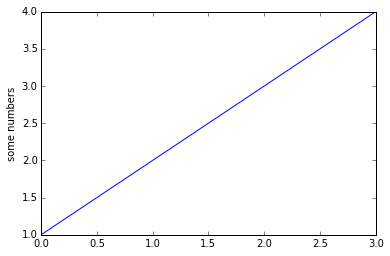
    


### 基本用法

`plot` 函数基本的用法有以下四种：

默认参数
- `plt.plot(x,y)` 

指定参数
- `plt.plot(x,y, format_str)`

默认参数，`x` 为 `0~N-1`
- `plt.plot(y)`

指定参数，`x` 为 `0~N-1`
- `plt.plot(y, format_str)`

因此，在上面的例子中，我们没有给定 `x` 的值，所以其默认值为 `[0,1,2,3]`。

传入 `x` 和 `y`： 


```python
plt.plot([1,2,3,4], [1,4,9,16])
```


    [<matplotlib.lines.Line2D at 0xa48a550>]


    
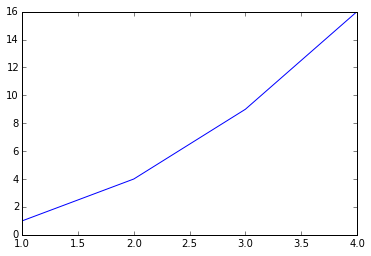
    


### 字符参数

和 **`MATLAB`** 中类似，我们还可以用字符来指定绘图的格式：

表示颜色的字符参数有：

字符 | 颜色
-- | -- 
`‘b’`|	蓝色，blue
`‘g’`|	绿色，green
`‘r’`|	红色，red
`‘c’`|	青色，cyan
`‘m’`|	品红，magenta
`‘y’`|	黄色，yellow
`‘k’`|	黑色，black
`‘w’`|	白色，white

表示类型的字符参数有：

字符|类型 | 字符|类型
---|--- | --- | ---
`  '-'	`| 实线 | `'--'`|	虚线
`'-.'`|	虚点线 | `':'`|	点线
`'.'`|	点 | `','`| 像素点
`'o'`	|圆点 | `'v'`|	下三角点
`'^'`|	上三角点 | `'<'`|	左三角点
`'>'`|	右三角点 | `'1'`|	下三叉点
`'2'`|	上三叉点 | `'3'`|	左三叉点
`'4'`|	右三叉点 | `'s'`|	正方点
`'p'`	| 五角点 | `'*'`|	星形点
`'h'`|	六边形点1 | `'H'`|	六边形点2 
`'+'`|	加号点 | `'x'`|	乘号点
`'D'`|	实心菱形点 | `'d'`|	瘦菱形点 
`'_'`|	横线点 | |

例如我们要画出红色圆点：


```python
plt.plot([1,2,3,4], [1,4,9,16], 'ro')
plt.show()
```


    
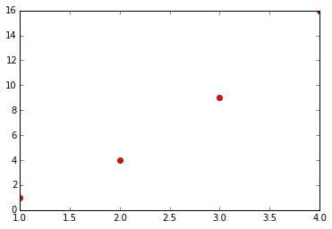
    


可以看出，有两个点在图像的边缘，因此，我们需要改变轴的显示范围。

### 显示范围

与 **`MATLAB`** 类似，这里可以使用 `axis` 函数指定坐标轴显示的范围：

    plt.axis([xmin, xmax, ymin, ymax])


```python
plt.plot([1,2,3,4], [1,4,9,16], 'ro')
# 指定 x 轴显示区域为 0-6，y 轴为 0-20
plt.axis([0,6,0,20])
plt.show()
```


    
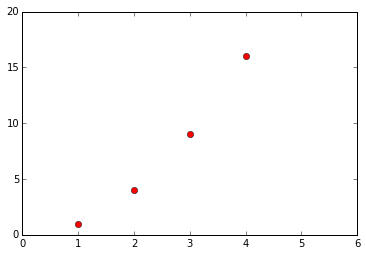
    


### 传入 `Numpy` 数组

之前我们传给 `plot` 的参数都是列表，事实上，向 `plot` 中传入 `numpy` 数组是更常用的做法。事实上，如果传入的是列表，`matplotlib` 会在内部将它转化成数组再进行处理：


```python
import numpy as np
import matplotlib.pyplot as plt

# evenly sampled time at 200ms intervals
t = np.arange(0., 5., 0.2)

# red dashes, blue squares and green triangles
plt.plot(t, t, 'r--', 
         t, t**2, 'bs', 
         t, t**3, 'g^')

plt.show()
```


    
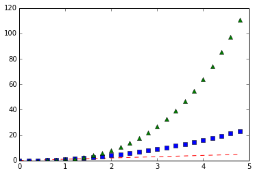
    


### 传入多组数据

事实上，在上面的例子中，我们不仅仅向 `plot` 函数传入了数组，还传入了多组 `(x,y,format_str)` 参数，它们在同一张图上显示。

这意味着我们不需要使用多个 `plot` 函数来画多组数组，只需要可以将这些组合放到一个 `plot` 函数中去即可。

### 线条属性

之前提到，我们可以用字符串来控制线条的属性，事实上还可以通过关键词来改变线条的性质，例如 `linwidth` 可以改变线条的宽度，`color` 可以改变线条的颜色：


```python
x = np.linspace(-np.pi,np.pi)
y = np.sin(x)

plt.plot(x, y, linewidth=2.0, color='r')

plt.show()
```


    
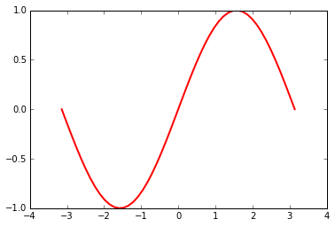
    


### 使用 plt.plot() 的返回值来设置线条属性

`plot` 函数返回一个 `Line2D` 对象组成的列表，每个对象代表输入的一对组合，例如：

- line1, line2 为两个 Line2D 对象

    `line1, line2 = plt.plot(x1, y1, x2, y2)`

- 返回 3 个 Line2D 对象组成的列表

    `lines = plt.plot(x1, y1, x2, y2, x3, y3)`

我们可以使用这个返回值来对线条属性进行设置：


```python
# 加逗号 line 中得到的是 line2D 对象，不加逗号得到的是只有一个 line2D 对象的列表
line, = plt.plot(x, y, 'r-')

# 将抗锯齿关闭
line.set_antialiased(False)

plt.show()
```


    
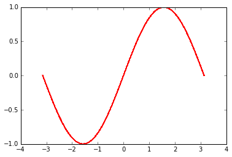
    


### plt.setp() 修改线条性质

更方便的做法是使用 `plt` 的 `setp` 函数：


```python
lines = plt.plot(x, y)

# 使用键值对
plt.setp(lines, color='r', linewidth=2.0)

# 或者使用 MATLAB 风格的字符串对
plt.setp(lines, 'color', 'r', 'linewidth', 2.0)

plt.show()
```


    

    


可以设置的属性有很多，可以使用 `plt.setp(lines)` 查看 `lines` 可以设置的属性，各属性的含义可参考 `matplotlib` 的文档。


```python
plt.setp(lines)
```

      agg_filter: unknown
      alpha: float (0.0 transparent through 1.0 opaque)         
      animated: [True | False]         
      antialiased or aa: [True | False]         
      axes: an :class:`~matplotlib.axes.Axes` instance         
      clip_box: a :class:`matplotlib.transforms.Bbox` instance         
      clip_on: [True | False]         
      clip_path: [ (:class:`~matplotlib.path.Path`,         :class:`~matplotlib.transforms.Transform`) |         :class:`~matplotlib.patches.Patch` | None ]         
      color or c: any matplotlib color         
      contains: a callable function         
      dash_capstyle: ['butt' | 'round' | 'projecting']         
      dash_joinstyle: ['miter' | 'round' | 'bevel']         
      dashes: sequence of on/off ink in points         
      drawstyle: ['default' | 'steps' | 'steps-pre' | 'steps-mid' |                   'steps-post']         
      figure: a :class:`matplotlib.figure.Figure` instance         
      fillstyle: ['full' | 'left' | 'right' | 'bottom' | 'top' | 'none']         
      gid: an id string         
      label: string or anything printable with '%s' conversion.         
      linestyle or ls: [``'-'`` | ``'--'`` | ``'-.'`` | ``':'`` | ``'None'`` |                   ``' '`` | ``''``]
      linewidth or lw: float value in points         
      lod: [True | False]         
      marker: :mod:`A valid marker style <matplotlib.markers>`
      markeredgecolor or mec: any matplotlib color         
      markeredgewidth or mew: float value in points         
      markerfacecolor or mfc: any matplotlib color         
      markerfacecoloralt or mfcalt: any matplotlib color         
      markersize or ms: float         
      markevery: [None | int | length-2 tuple of int | slice |         list/array of int | float | length-2 tuple of float]
      path_effects: unknown
      picker: float distance in points or callable pick function         ``fn(artist, event)``         
      pickradius: float distance in points         
      rasterized: [True | False | None]         
      sketch_params: unknown
      snap: unknown
      solid_capstyle: ['butt' | 'round' |  'projecting']         
      solid_joinstyle: ['miter' | 'round' | 'bevel']         
      transform: a :class:`matplotlib.transforms.Transform` instance         
      url: a url string         
      visible: [True | False]         
      xdata: 1D array         
      ydata: 1D array         
      zorder: any number         


## 子图

`figure()` 函数会产生一个指定编号为 `num` 的图：

    plt.figure(num)

这里，`figure(1)` 其实是可以省略的，因为默认情况下 `plt` 会自动产生一幅图像。

使用 `subplot` 可以在一副图中生成多个子图，其参数为：

    plt.subplot(numrows, numcols, fignum)

当 `numrows * numcols < 10` 时，中间的逗号可以省略，因此 `plt.subplot(211)` 就相当于 `plt.subplot(2,1,1)`。


```python
def f(t):
    return np.exp(-t) * np.cos(2*np.pi*t)

t1 = np.arange(0.0, 5.0, 0.1)
t2 = np.arange(0.0, 5.0, 0.02)

plt.figure(1)
plt.subplot(211)
plt.plot(t1, f(t1), 'bo', t2, f(t2), 'k')

plt.subplot(212)
plt.plot(t2, np.cos(2*np.pi*t2), 'r--')
plt.show()
```


    

    


## 图形上加上文字

`plt.hist()` 可以用来画直方图。


```python
mu, sigma = 100, 15
x = mu + sigma * np.random.randn(10000)

# the histogram of the data
n, bins, patches = plt.hist(x, 50, normed=1, facecolor='g', alpha=0.75)


plt.xlabel('Smarts')
plt.ylabel('Probability')
plt.title('Histogram of IQ')
plt.text(60, .025, r'$\mu=100,\ \sigma=15$')
plt.axis([40, 160, 0, 0.03])
plt.grid(True)
plt.show()
```


    
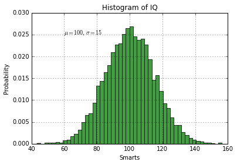
    


对于这幅图形，我们使用 `xlabel` ，`ylabel`，`title`，`text` 方法设置了文字，其中：

- `xlabel` ：x 轴标注

- `ylabel` ：y 轴标注

- `title` ：图形标题

- `text` ：在指定位置放入文字

输入特殊符号支持使用 `Tex` 语法，用 `$<some Tex code>$` 隔开。

除了使用 `text` 在指定位置标上文字之外，还可以使用 `annotate` 函数进行注释，`annotate` 主要有两个参数：

- `xy` ：注释位置 
- `xytext` ：注释文字位置


```python
ax = plt.subplot(111)

t = np.arange(0.0, 5.0, 0.01)
s = np.cos(2*np.pi*t)
line, = plt.plot(t, s, lw=2)

plt.annotate('local max', xy=(2, 1), xytext=(3, 1.5),
            arrowprops=dict(facecolor='black', shrink=0.05),
            )

plt.ylim(-2,2)
plt.show()
```


    
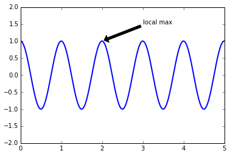
    

# 使用 style 来配置 pyplot 风格


```python
import matplotlib.pyplot as plt
import numpy as np

%matplotlib inline
```

`style` 是 `pyplot` 的一个子模块，方便进行风格转换， `pyplot` 有很多的预设风格，可以使用 `plt.style.available` 来查看：


```python
plt.style.available
```


    [u'dark_background', u'bmh', u'grayscale', u'ggplot', u'fivethirtyeight']


```python
x = np.linspace(0, 2 * np.pi)
y = np.sin(x)

plt.plot(x, y)

plt.show()
```


    

    


例如，我们可以模仿 `R` 语言中常用的 `ggplot` 风格：


```python
plt.style.use('ggplot')

plt.plot(x, y)

plt.show()
```


    
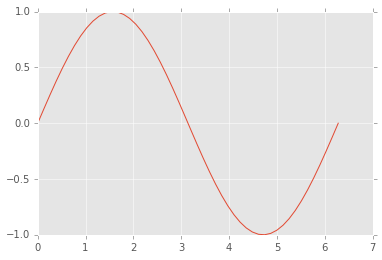
    


有时候，我们不希望改变全局的风格，只是想暂时改变一下分隔，则可以使用 `context` 将风格改变限制在某一个代码块内：


```python
with plt.style.context(('dark_background')):
    plt.plot(x, y, 'r-o')
    plt.show()
```


    
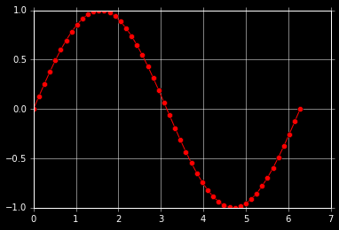
    


在代码块外绘图则仍然是全局的风格。


```python
with plt.style.context(('dark_background')):
    pass
plt.plot(x, y, 'r-o')
plt.show()
```


    
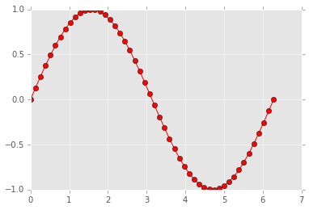
    


还可以混搭使用多种风格，不过最右边的一种风格会将最左边的覆盖：


```python
plt.style.use(['dark_background', 'ggplot'])

plt.plot(x, y, 'r-o')
plt.show()
```


    

    


事实上，我们还可以自定义风格文件。

自定义文件需要放在 `matplotlib` 的配置文件夹 `mpl_configdir` 的子文件夹 `mpl_configdir/stylelib/` 下，以 `.mplstyle` 结尾。

`mpl_configdir` 的位置可以这样查看：


```python
import matplotlib
matplotlib.get_configdir()
```


    u'c:/Users/Jin\\.matplotlib'


里面的内容以 `属性：值` 的形式保存：

```
axes.titlesize : 24
axes.labelsize : 20
lines.linewidth : 3
lines.markersize : 10
xtick.labelsize : 16
ytick.labelsize : 16
```

假设我们将其保存为 `mpl_configdir/stylelib/presentation.mplstyle`，那么使用这个风格的时候只需要调用：

    plt.style.use('presentation')
# 处理文本（基础）


```python
import matplotlib.pyplot as plt
import numpy as np
%matplotlib inline
```

`matplotlib` 对文本的支持十分完善，包括数学公式，`Unicode` 文字，栅格和向量化输出，文字换行，文字旋转等一系列操作。

## 基础文本函数

在 `matplotlib.pyplot` 中，基础的文本函数如下：

- `text()` 在 `Axes` 对象的任意位置添加文本
- `xlabel()` 添加 x 轴标题
- `ylabel()` 添加 y 轴标题
- `title()` 给 `Axes` 对象添加标题
- `figtext()` 在 `Figure` 对象的任意位置添加文本
- `suptitle()` 给 `Figure` 对象添加标题
- `anotate()` 给 `Axes` 对象添加注释（可选择是否添加箭头标记）


```python
# -*- coding: utf-8 -*-
import matplotlib.pyplot as plt
%matplotlib inline

# plt.figure() 返回一个 Figure() 对象
fig = plt.figure(figsize=(12, 9))

# 设置这个 Figure 对象的标题
# 事实上，如果我们直接调用 plt.suptitle() 函数，它会自动找到当前的 Figure 对象
fig.suptitle('bold figure suptitle', fontsize=14, fontweight='bold')

# Axes 对象表示 Figure 对象中的子图
# 这里只有一幅图像，所以使用 add_subplot(111)
ax = fig.add_subplot(111)
fig.subplots_adjust(top=0.85)

# 可以直接使用 set_xxx 的方法来设置标题
ax.set_title('axes title')
# 也可以直接调用 title()，因为会自动定位到当前的 Axes 对象
# plt.title('axes title')

ax.set_xlabel('xlabel')
ax.set_ylabel('ylabel')

# 添加文本，斜体加文本框
ax.text(3, 8, 'boxed italics text in data coords', style='italic',
        bbox={'facecolor':'red', 'alpha':0.5, 'pad':10})

# 数学公式，用 $$ 输入 Tex 公式
ax.text(2, 6, r'an equation: $E=mc^2$', fontsize=15)

# Unicode 支持
ax.text(3, 2, unicode('unicode: Institut f\374r Festk\366rperphysik', 'latin-1'))

# 颜色，对齐方式
ax.text(0.95, 0.01, 'colored text in axes coords',
        verticalalignment='bottom', horizontalalignment='right',
        transform=ax.transAxes,
        color='green', fontsize=15)

# 注释文本和箭头
ax.plot([2], [1], 'o')
ax.annotate('annotate', xy=(2, 1), xytext=(3, 4),
            arrowprops=dict(facecolor='black', shrink=0.05))

# 设置显示范围
ax.axis([0, 10, 0, 10])

plt.show()
```


    
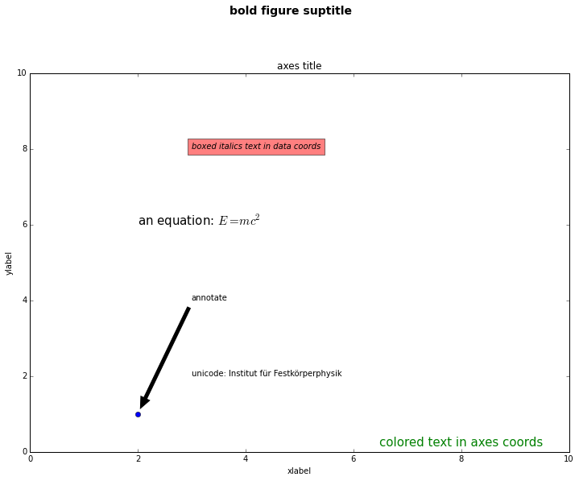
    


## 文本属性和布局

我们可以通过下列关键词，在文本函数中设置文本的属性：

关键词|值
---|---
alpha		|	    float
backgroundcolor		|    any matplotlib color
bbox		|	    rectangle prop dict plus key ``'pad'`` which is a pad in points
clip_box	|	    a matplotlib.transform.Bbox instance
clip_on		|	    [True ， False]
clip_path	|	    a Path instance and a Transform instance, a Patch
color	|		    any matplotlib color
family	|		    [ ``'serif'`` , ``'sans-serif'`` , ``'cursive'`` , ``'fantasy'`` , ``'monospace'`` ]
fontproperties		|    a matplotlib.font_manager.FontProperties instance
horizontalalignment or ha  | [ ``'center'`` , ``'right'`` , ``'left'`` ]
label			  |  any string
linespacing		  |  float
multialignment		 |   [``'left'`` , ``'right'`` , ``'center'`` ]
name or fontname	 |   string e.g., [``'Sans'`` , ``'Courier'`` , ``'Helvetica'`` ...]
picker		|	    [None,float,boolean,callable]
position	|	    (x,y)
rotation	|	    [ angle in degrees ``'vertical'`` , ``'horizontal'``
size or fontsize	 |   [ size in points , relative size, e.g., ``'smaller'``, ``'x-large'`` ]
style or fontstyle	|    [ ``'normal'`` , ``'italic'`` , ``'oblique'``]
text		|	    string or anything printable with '%s' conversion
transform	|	    a matplotlib.transform transformation instance
variant		|	    [ ``'normal'`` , ``'small-caps'`` ]
verticalalignment or va	  |  [ ``'center'`` , ``'top'`` , ``'bottom'`` , ``'baseline'`` ]
visible		|	    [True , False]
weight or fontweight	|    [ ``'normal'`` , ``'bold'`` , ``'heavy'`` , ``'light'`` , ``'ultrabold'`` , ``'ultralight'``]
x		|	    float
y		|	    float
zorder	|		    any number

其中 `va`, `ha`, `multialignment` 可以用来控制布局。
- `horizontalalignment` or `ha` ：x 位置参数表示的位置 
- `verticalalignment` or `va`：y 位置参数表示的位置
- `multialignment`：多行位置控制


```python
import matplotlib.pyplot as plt
import matplotlib.patches as patches

# build a rectangle in axes coords
left, width = .25, .5
bottom, height = .25, .5
right = left + width
top = bottom + height

fig = plt.figure(figsize=(10,7))
ax = fig.add_axes([0,0,1,1])

# axes coordinates are 0,0 is bottom left and 1,1 is upper right
p = patches.Rectangle(
    (left, bottom), width, height,
    fill=False, transform=ax.transAxes, clip_on=False
    )

ax.add_patch(p)

ax.text(left, bottom, 'left top',
        horizontalalignment='left',
        verticalalignment='top',
        transform=ax.transAxes,
        size='xx-large')

ax.text(left, bottom, 'left bottom',
        horizontalalignment='left',
        verticalalignment='bottom',
        transform=ax.transAxes,
        size='xx-large')

ax.text(right, top, 'right bottom',
        horizontalalignment='right',
        verticalalignment='bottom',
        transform=ax.transAxes,
        size='xx-large')

ax.text(right, top, 'right top',
        horizontalalignment='right',
        verticalalignment='top',
        transform=ax.transAxes,
        size='xx-large')

ax.text(right, bottom, 'center top',
        horizontalalignment='center',
        verticalalignment='top',
        transform=ax.transAxes,
        size='xx-large')

ax.text(left, 0.5*(bottom+top), 'right center',
        horizontalalignment='right',
        verticalalignment='center',
        rotation='vertical',
        transform=ax.transAxes,
        size='xx-large')

ax.text(left, 0.5*(bottom+top), 'left center',
        horizontalalignment='left',
        verticalalignment='center',
        rotation='vertical',
        transform=ax.transAxes,
        size='xx-large')

ax.text(0.5*(left+right), 0.5*(bottom+top), 'middle',
        horizontalalignment='center',
        verticalalignment='center',
        fontsize=20, color='red',
        transform=ax.transAxes)

ax.text(right, 0.5*(bottom+top), 'centered',
        horizontalalignment='center',
        verticalalignment='center',
        rotation='vertical',
        transform=ax.transAxes,
        size='xx-large')

ax.text(left, top, 'rotated\nwith newlines',
        horizontalalignment='center',
        verticalalignment='center',
        rotation=45,
        transform=ax.transAxes,
        size='xx-large')

ax.set_axis_off()
plt.show()
```


    
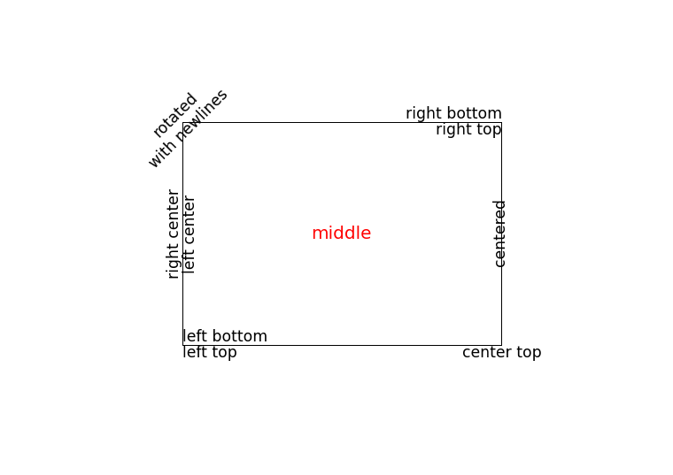
    


## 注释文本

`text()` 函数在 Axes 对象的指定位置添加文本，而 `annotate()` 则是对某一点添加注释文本，需要考虑两个位置：一是注释点的坐标 `xy` ，二是注释文本的位置坐标 `xytext`：


```python
fig = plt.figure()
ax = fig.add_subplot(111)

t = np.arange(0.0, 5.0, 0.01)
s = np.cos(2*np.pi*t)
line, = ax.plot(t, s, lw=2)

ax.annotate('local max', xy=(2, 1), xytext=(3, 1.5),
            arrowprops=dict(facecolor='black', shrink=0.05),
            )

ax.set_ylim(-2,2)
plt.show()
```


    

    


在上面的例子中，两个左边使用的都是原始数据的坐标系，不过我们还可以通过 `xycoords` 和 `textcoords` 来设置坐标系（默认是 `'data'`）：

参数|坐标系
--|--
‘figure points’|	points from the lower left corner of the figure
‘figure pixels’|	pixels from the lower left corner of the figure
‘figure fraction’|	0,0 is lower left of figure and 1,1 is upper right
‘axes points’|	points from lower left corner of axes
‘axes pixels’|	pixels from lower left corner of axes
‘axes fraction’|	0,0 is lower left of axes and 1,1 is upper right
‘data’|	use the axes data coordinate system

使用一个不同的坐标系：


```python
fig = plt.figure()
ax = fig.add_subplot(111)

t = np.arange(0.0, 5.0, 0.01)
s = np.cos(2*np.pi*t)
line, = ax.plot(t, s, lw=2)

ax.annotate('local max', xy=(3, 1),  xycoords='data',
            xytext=(0.8, 0.95), textcoords='axes fraction',
            arrowprops=dict(facecolor='black', shrink=0.05),
            horizontalalignment='right', verticalalignment='top',
            )

ax.set_ylim(-2,2)
plt.show()
```


    
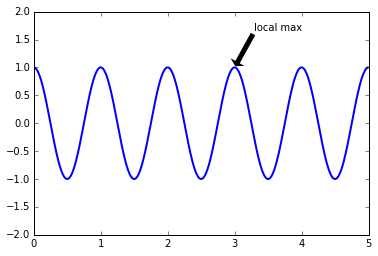
    


## 极坐标系注释文本

产生极坐标系需要在 `subplot` 的参数中设置 `polar=True`：


```python
fig = plt.figure()
ax = fig.add_subplot(111, polar=True)
r = np.arange(0,1,0.001)
theta = 2*2*np.pi*r
line, = ax.plot(theta, r, color='#ee8d18', lw=3)

ind = 800
thisr, thistheta = r[ind], theta[ind]
ax.plot([thistheta], [thisr], 'o')
ax.annotate('a polar annotation',
            xy=(thistheta, thisr),  # theta, radius
            xytext=(0.05, 0.05),    # fraction, fraction
            textcoords='figure fraction',
            arrowprops=dict(facecolor='black', shrink=0.05),
            horizontalalignment='left',
            verticalalignment='bottom',
            )
plt.show()
```


    
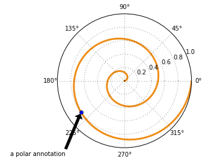
    

# 处理文本（数学表达式）

在字符串中使用一对 `$$` 符号可以利用 `Tex` 语法打出数学表达式，而且并不需要预先安装 `Tex`。在使用时我们通常加上 `r` 标记表示它是一个原始字符串（raw string）


```python
import matplotlib.pyplot as plt
import numpy as np
%matplotlib inline
```


```python
# plain text
plt.title('alpha > beta')

plt.show()
```


    
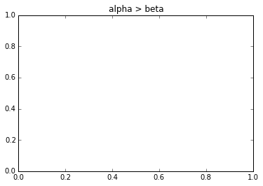
    


```python
# math text
plt.title(r'$\alpha > \beta$')

plt.show()
```


    
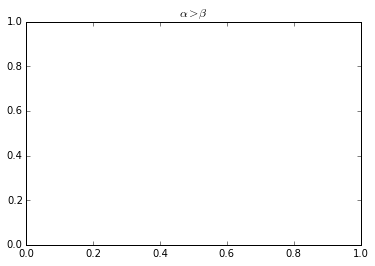
    


## 上下标

使用 `_` 和 `^` 表示上下标：

$\alpha_i > \beta_i$：

    r'$\alpha_i > \beta_i$'

$\sum\limits_{i=0}^\infty x_i$：

    r'$\sum_{i=0}^\infty x_i$'

注：

- 希腊字母和特殊符号可以用 '\ + 对应的名字' 来显示
- `{}` 中的内容属于一个部分；要打出花括号是需要使用 `\{\}`

## 分数，二项式系数，stacked numbers

$\frac{3}{4}, \binom{3}{4}, \stackrel{3}{4}$：

    r'$\frac{3}{4}, \binom{3}{4}, \stackrel{3}{4}$'

$\frac{5 - \frac{1}{x}}{4}$：

    r'$\frac{5 - \frac{1}{x}}{4}$'

在 Tex 语言中，括号始终是默认的大小，如果要使括号大小与括号内部的大小对应，可以使用 `\left` 和 `\right` 选项：

$(\frac{5 - \frac{1}{x}}{4})$

    r'$(\frac{5 - \frac{1}{x}}{4})$'

$\left(\frac{5 - \frac{1}{x}}{4}\right)$：

    r'$\left(\frac{5 - \frac{1}{x}}{4}\right)$'

## 根号

$\sqrt{2}$：

    r'$\sqrt{2}$'

$\sqrt[3]{x}$：

    r'$\sqrt[3]{x}$'

## 特殊字体

默认显示的字体是斜体，不过可以使用以下方法显示不同的字体：

命令|显示
--|--
\mathrm{Roman}|$\mathrm{Roman}$
\mathit{Italic}|$\mathit{Italic}$
\mathtt{Typewriter}|$\mathtt{Typewriter}$
\mathcal{CALLIGRAPHY}|$\mathcal{CALLIGRAPHY}$
\mathbb{blackboard}|$\mathbb{blackboard}$
\mathfrak{Fraktur}|$\mathfrak{Fraktur}$
\mathsf{sansserif}|$\mathsf{sansserif}$

$s(t) = \mathcal{A}\ \sin(2 \omega t)$：

    s(t) = \mathcal{A}\ \sin(2 \omega t)

注：

- Tex 语法默认忽略空格，要打出空格使用 `'\ '`
- \sin 默认显示为 Roman 字体

## 音调

命令|结果
--|--
`\acute a`| $\acute a$
`\bar a`| $\bar a$
`\breve a` | $\breve a$
`\ddot a`| $\ddot a$
`\dot a` | $\dot a$
`\grave a`| $\grave a$
`\hat a`| $\hat a$
`\tilde a` | $\tilde a$
`\vec a` | $\vec a$
`\overline{abc}`|$\overline{abc}$
`\widehat{xyz}`|$\widehat{xyz}$
`\widetilde{xyz}`|$\widetilde{xyz}$

## 特殊字符表

参见：http://matplotlib.org/users/mathtext.html#symbols

## 例子


```python
import numpy as np
import matplotlib.pyplot as plt
t = np.arange(0.0, 2.0, 0.01)
s = np.sin(2*np.pi*t)

plt.plot(t,s)
plt.title(r'$\alpha_i > \beta_i$', fontsize=20)
plt.text(1, -0.6, r'$\sum_{i=0}^\infty x_i$', fontsize=20)
plt.text(0.6, 0.6, r'$\mathcal{A}\ \mathrm{sin}(2 \omega t)$',
         fontsize=20)
plt.xlabel('time (s)')
plt.ylabel('volts (mV)')
plt.show()
```


    
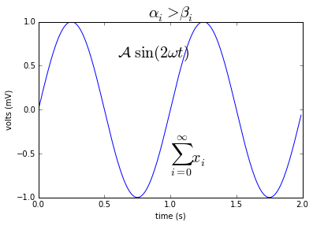
    

# 图像基础

导入相应的包：


```python
import matplotlib.pyplot as plt
import matplotlib.image as mpimg
import numpy as np
%matplotlib inline
```


## 导入图像

我们首先导入上面的图像，注意 `matplotlib` 默认只支持 `PNG` 格式的图像，我们可以使用 `mpimg.imread` 方法读入这幅图像：


```python
img = mpimg.imread('stinkbug.png')
```


```python
img.shape
```


    (375L, 500L, 3L)


这是一个 `375 x 500 x 3` 的 `RGB` 图像，并且每个像素使用 uint8 分别表示 `RGB` 三个通道的值。不过在处理的时候，`matplotlib` 将它们的值归一化到 `0.0~1.0` 之间：


```python
img.dtype
```


    dtype('float32')


## 显示图像

使用 `plt.imshow()` 可以显示图像：


```python
imgplot = plt.imshow(img)
```


    
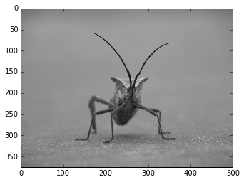
    


## 伪彩色图像

从单通道模拟彩色图像：


```python
lum_img = img[:,:,0]
imgplot = plt.imshow(lum_img)
```


    
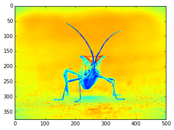
    


## 改变 colormap


```python
imgplot = plt.imshow(lum_img)
imgplot.set_cmap('hot')
```


    
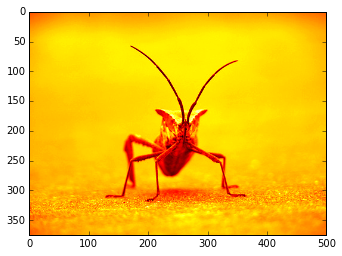
    


```python
imgplot = plt.imshow(lum_img)
imgplot.set_cmap('spectral')
```


    
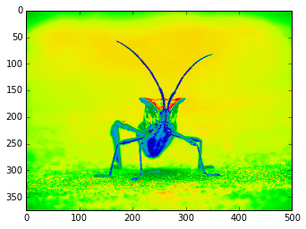
    


显示色度条：


```python
imgplot = plt.imshow(lum_img)
imgplot.set_cmap('spectral')
plt.colorbar()
plt.show()
```


    
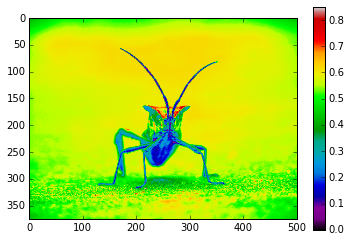
    


## 限制显示范围

先查看直方图：


```python
plt.hist(lum_img.flatten(), 256, range=(0.0,1.0), fc='k', ec='k')
plt.show()
```


    
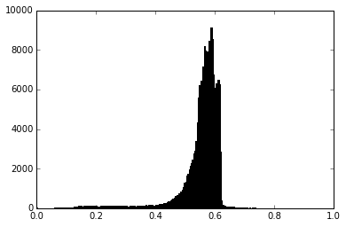
    


将显示范围设为 `0.0-0.7`：


```python
imgplot = plt.imshow(lum_img)
imgplot.set_clim(0.0,0.7)
```


    
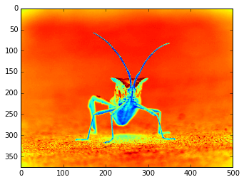
    


## resize 操作


```python
from PIL import Image
img = Image.open('stinkbug.png')
rsize = img.resize((img.size[0]/10,img.size[1]/10))
rsizeArr = np.asarray(rsize) 
imgplot = plt.imshow(rsizeArr)
```


    

    


上面我们将这个图像使用 PIL 的 `Image` 对象导入，并将其 `resize` 为原来的 1/100，可以看到很多细节都丢失了。

在画图时，由于画面的大小与实际像素的大小可能不一致，所以不一致的地方会进行插值处理，尝试一下不同的插值方法：


```python
imgplot = plt.imshow(rsizeArr)
imgplot.set_interpolation('nearest')
```


    
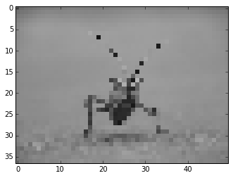
    


```python
imgplot = plt.imshow(rsizeArr)
imgplot.set_interpolation('bicubic')
```


    

    

# 注释

## 使用文本框进行注释

先看一个简单的例子：


```python
import numpy.random
import matplotlib.pyplot as plt
%matplotlib inline

fig = plt.figure(1, figsize=(5,5))
fig.clf()

ax = fig.add_subplot(111)
ax.set_aspect(1)

x1 = -1 + numpy.random.randn(100)
y1 = -1 + numpy.random.randn(100)
x2 = 1. + numpy.random.randn(100)
y2 = 1. + numpy.random.randn(100)

ax.scatter(x1, y1, color="r")
ax.scatter(x2, y2, color="g")

# 加上两个文本框
bbox_props = dict(boxstyle="round", fc="w", ec="0.5", alpha=0.9)
ax.text(-2, -2, "Sample A", ha="center", va="center", size=20,
        bbox=bbox_props)
ax.text(2, 2, "Sample B", ha="center", va="center", size=20,
        bbox=bbox_props)

# 加上一个箭头文本框
bbox_props = dict(boxstyle="rarrow", fc=(0.8,0.9,0.9), ec="b", lw=2)
t = ax.text(0, 0, "Direction", ha="center", va="center", rotation=45,
            size=15,
            bbox=bbox_props)

bb = t.get_bbox_patch()
bb.set_boxstyle("rarrow", pad=0.6)

ax.set_xlim(-4, 4)
ax.set_ylim(-4, 4)

plt.show()
```


    
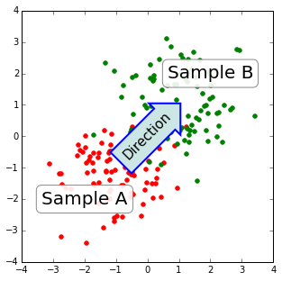
    


`text()` 函数接受 `bbox` 参数来绘制文本框。
```python
bbox_props = dict(boxstyle="rarrow,pad=0.3", fc="cyan", ec="b", lw=2)
t = ax.text(0, 0, "Direction", ha="center", va="center", rotation=45,
            size=15,
            bbox=bbox_props)
```

可以这样来获取这个文本框，并对其参数进行修改：
```python
bb = t.get_bbox_patch()
bb.set_boxstyle("rarrow", pad=0.6)
```

可用的文本框风格有：

class|name|attrs
---|---|---
LArrow	|larrow	|pad=0.3
RArrow	|rarrow	|pad=0.3
Round	|round	|pad=0.3,rounding_size=None
Round4	|round4	|pad=0.3,rounding_size=None
Roundtooth	|roundtooth	|pad=0.3,tooth_size=None
Sawtooth	|sawtooth	|pad=0.3,tooth_size=None
Square	|square	|pad=0.3


```python
import matplotlib.patches as mpatch
import matplotlib.pyplot as plt

styles = mpatch.BoxStyle.get_styles()

figheight = (len(styles)+.5)
fig1 = plt.figure(figsize=(4/1.5, figheight/1.5))
fontsize = 0.3 * 72
ax = fig1.add_subplot(111)

for i, (stylename, styleclass) in enumerate(styles.items()):
    ax.text(0.5, (float(len(styles)) - 0.5 - i)/figheight, stylename,
              ha="center",
              size=fontsize,
              transform=fig1.transFigure,
              bbox=dict(boxstyle=stylename, fc="w", ec="k"))

# 去掉轴的显示
ax.spines['right'].set_color('none')
ax.spines['top'].set_color('none')
ax.spines['left'].set_color('none')
ax.spines['bottom'].set_color('none')
plt.xticks([])
plt.yticks([])

plt.show()
```


    
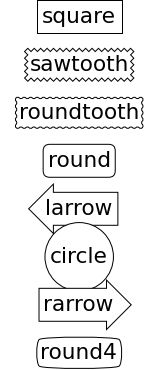
    


各个风格的文本框如上图所示。

## 使用箭头进行注释


```python
plt.figure(1, figsize=(3,3))
ax = plt.subplot(111)

ax.annotate("",
            xy=(0.2, 0.2), xycoords='data',
            xytext=(0.8, 0.8), textcoords='data',
            arrowprops=dict(arrowstyle="->",
                            connectionstyle="arc3"), 
            )

plt.show()
```


    
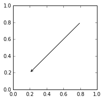
    


之前介绍了 `annotate` 中 `xy, xycoords, xytext, textcoords` 参数的含义，通常我们把 `xy` 设在 `data` 坐标系，把 `xytext` 设在 `offset` 即以注释点为原点的参考系。

箭头显示是可选的，用 `arrowprops` 参数来指定，接受一个字典作为参数。

不同类型的绘制箭头方式：


```python
import matplotlib.pyplot as plt
import matplotlib.patches as mpatches

x1, y1 = 0.3, 0.3
x2, y2 = 0.7, 0.7

fig = plt.figure(1, figsize=(8,3))
fig.clf()
from mpl_toolkits.axes_grid.axes_grid import AxesGrid
from mpl_toolkits.axes_grid.anchored_artists import AnchoredText

#from matplotlib.font_manager import FontProperties

def add_at(ax, t, loc=2):
    fp = dict(size=10)
    _at = AnchoredText(t, loc=loc, prop=fp)
    ax.add_artist(_at)
    return _at


grid = AxesGrid(fig, 111, (1, 4), label_mode="1", share_all=True)

grid[0].set_autoscale_on(False)

ax = grid[0]
ax.plot([x1, x2], [y1, y2], ".")
el = mpatches.Ellipse((x1, y1), 0.3, 0.4, angle=30, alpha=0.2)
ax.add_artist(el)
ax.annotate("",
            xy=(x1, y1), xycoords='data',
            xytext=(x2, y2), textcoords='data',
            arrowprops=dict(arrowstyle="-", #linestyle="dashed",
                            color="0.5",
                            patchB=None,
                            shrinkB=0,
                            connectionstyle="arc3,rad=0.3",
                            ),
            )

add_at(ax, "connect", loc=2)

ax = grid[1]
ax.plot([x1, x2], [y1, y2], ".")
el = mpatches.Ellipse((x1, y1), 0.3, 0.4, angle=30, alpha=0.2)
ax.add_artist(el)
ax.annotate("",
            xy=(x1, y1), xycoords='data',
            xytext=(x2, y2), textcoords='data',
            arrowprops=dict(arrowstyle="-", #linestyle="dashed",
                            color="0.5",
                            patchB=el,
                            shrinkB=0,
                            connectionstyle="arc3,rad=0.3",
                            ),
            )

add_at(ax, "clip", loc=2)


ax = grid[2]
ax.plot([x1, x2], [y1, y2], ".")
el = mpatches.Ellipse((x1, y1), 0.3, 0.4, angle=30, alpha=0.2)
ax.add_artist(el)
ax.annotate("",
            xy=(x1, y1), xycoords='data',
            xytext=(x2, y2), textcoords='data',
            arrowprops=dict(arrowstyle="-", #linestyle="dashed",
                            color="0.5",
                            patchB=el,
                            shrinkB=5,
                            connectionstyle="arc3,rad=0.3",
                            ),
            )

add_at(ax, "shrink", loc=2)


ax = grid[3]
ax.plot([x1, x2], [y1, y2], ".")
el = mpatches.Ellipse((x1, y1), 0.3, 0.4, angle=30, alpha=0.2)
ax.add_artist(el)
ax.annotate("",
            xy=(x1, y1), xycoords='data',
            xytext=(x2, y2), textcoords='data',
            arrowprops=dict(arrowstyle="fancy", #linestyle="dashed",
                            color="0.5",
                            patchB=el,
                            shrinkB=5,
                            connectionstyle="arc3,rad=0.3",
                            ),
            )

add_at(ax, "mutate", loc=2)

grid[0].set_xlim(0, 1)
grid[0].set_ylim(0, 1)
grid[0].axis["bottom"].toggle(ticklabels=False)
grid[0].axis["left"].toggle(ticklabels=False)
fig.subplots_adjust(left=0.05, right=0.95, bottom=0.05, top=0.95)

plt.draw()
plt.show()
```


    
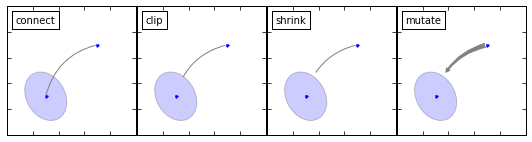
    


字典中，`connectionstyle` 参数控制路径的风格：

Name | Attr
----|----
angle|	angleA=90,angleB=0,rad=0.0
angle3|	angleA=90,angleB=0
arc|	angleA=0,angleB=0,armA=None,armB=None,rad=0.0
arc3|	rad=0.0
bar|	armA=0.0,armB=0.0,fraction=0.3,angle=None


```python
import matplotlib.pyplot as plt
import matplotlib.patches as mpatches

fig = plt.figure(1, figsize=(8,5))
fig.clf()
from mpl_toolkits.axes_grid.axes_grid import AxesGrid
from mpl_toolkits.axes_grid.anchored_artists import AnchoredText

#from matplotlib.font_manager import FontProperties

def add_at(ax, t, loc=2):
    fp = dict(size=8)
    _at = AnchoredText(t, loc=loc, prop=fp)
    ax.add_artist(_at)
    return _at


grid = AxesGrid(fig, 111, (3, 5), label_mode="1", share_all=True)

grid[0].set_autoscale_on(False)


x1, y1 = 0.3, 0.3
x2, y2 = 0.7, 0.7


def demo_con_style(ax, connectionstyle, label=None):

    if label is None:
        label = connectionstyle

    x1, y1 = 0.3, 0.2
    x2, y2 = 0.8, 0.6

    ax.plot([x1, x2], [y1, y2], ".")
    ax.annotate("",
                xy=(x1, y1), xycoords='data',
                xytext=(x2, y2), textcoords='data',
                arrowprops=dict(arrowstyle="->", #linestyle="dashed",
                                color="0.5",
                                shrinkA=5, shrinkB=5,
                                patchA=None,
                                patchB=None,
                                connectionstyle=connectionstyle,
                                ),
                )

    add_at(ax, label, loc=2)

column = grid.axes_column[0]

demo_con_style(column[0], "angle3,angleA=90,angleB=0",
               label="angle3,\nangleA=90,\nangleB=0")
demo_con_style(column[1], "angle3,angleA=0,angleB=90",
               label="angle3,\nangleA=0,\nangleB=90")


column = grid.axes_column[1]

demo_con_style(column[0], "arc3,rad=0.")
demo_con_style(column[1], "arc3,rad=0.3")
demo_con_style(column[2], "arc3,rad=-0.3")


column = grid.axes_column[2]

demo_con_style(column[0], "angle,angleA=-90,angleB=180,rad=0",
               label="angle,\nangleA=-90,\nangleB=180,\nrad=0")
demo_con_style(column[1], "angle,angleA=-90,angleB=180,rad=5",
               label="angle,\nangleA=-90,\nangleB=180,\nrad=5")
demo_con_style(column[2], "angle,angleA=-90,angleB=10,rad=5",
               label="angle,\nangleA=-90,\nangleB=10,\nrad=0")


column = grid.axes_column[3]

demo_con_style(column[0], "arc,angleA=-90,angleB=0,armA=30,armB=30,rad=0",
               label="arc,\nangleA=-90,\nangleB=0,\narmA=30,\narmB=30,\nrad=0")
demo_con_style(column[1], "arc,angleA=-90,angleB=0,armA=30,armB=30,rad=5",
               label="arc,\nangleA=-90,\nangleB=0,\narmA=30,\narmB=30,\nrad=5")
demo_con_style(column[2], "arc,angleA=-90,angleB=0,armA=0,armB=40,rad=0",
               label="arc,\nangleA=-90,\nangleB=0,\narmA=0,\narmB=40,\nrad=0")


column = grid.axes_column[4]

demo_con_style(column[0], "bar,fraction=0.3",
               label="bar,\nfraction=0.3")
demo_con_style(column[1], "bar,fraction=-0.3",
               label="bar,\nfraction=-0.3")
demo_con_style(column[2], "bar,angle=180,fraction=-0.2",
               label="bar,\nangle=180,\nfraction=-0.2")


#demo_con_style(column[1], "arc3,rad=0.3")
#demo_con_style(column[2], "arc3,rad=-0.3")


grid[0].set_xlim(0, 1)
grid[0].set_ylim(0, 1)
grid.axes_llc.axis["bottom"].toggle(ticklabels=False)
grid.axes_llc.axis["left"].toggle(ticklabels=False)
fig.subplots_adjust(left=0.05, right=0.95, bottom=0.05, top=0.95)

plt.draw()
plt.show()
```


    
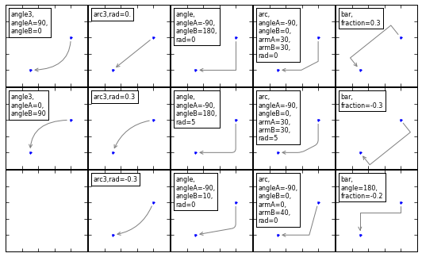
    


`arrowstyle` 参数控制小箭头的风格：

Name | Attrs
--- |---
`-`	|None
`->`	|head_length=0.4,head_width=0.2
`-[`	|widthB=1.0,lengthB=0.2,angleB=None
&#166;`-`&#166;	|widthA=1.0,widthB=1.0
`-`&#166;`>`	|head_length=0.4,head_width=0.2
`<-`	|head_length=0.4,head_width=0.2
`<->`	|head_length=0.4,head_width=0.2
`<`&#166;`-`	|head_length=0.4,head_width=0.2
`<`&#166;-&#166;`>`	|head_length=0.4,head_width=0.2
`fancy`	|head_length=0.4,head_width=0.4,tail_width=0.4
`simple`	|head_length=0.5,head_width=0.5,tail_width=0.2
`wedge`	|tail_width=0.3,shrink_factor=0.5


```python
import matplotlib.patches as mpatches
import matplotlib.pyplot as plt

styles = mpatches.ArrowStyle.get_styles()

ncol=2
nrow = (len(styles)+1) // ncol
figheight = (nrow+0.5)
fig1 = plt.figure(1, (4.*ncol/1.5, figheight/1.5))
fontsize = 0.2 * 70


ax = fig1.add_axes([0, 0, 1, 1], frameon=False, aspect=1.)

ax.set_xlim(0, 4*ncol)
ax.set_ylim(0, figheight)

def to_texstring(s):
    s = s.replace("<", r"$<$")
    s = s.replace(">", r"$>$")
    s = s.replace("|", r"$|$")
    return s

for i, (stylename, styleclass) in enumerate(sorted(styles.items())):
    x = 3.2 + (i//nrow)*4
    y = (figheight - 0.7 - i%nrow) # /figheight
    p = mpatches.Circle((x, y), 0.2, fc="w")
    ax.add_patch(p)

    ax.annotate(to_texstring(stylename), (x, y),
                (x-1.2, y),
                #xycoords="figure fraction", textcoords="figure fraction",
                ha="right", va="center",
                size=fontsize,
                arrowprops=dict(arrowstyle=stylename,
                                patchB=p,
                                shrinkA=5,
                                shrinkB=5,
                                fc="w", ec="k",
                                connectionstyle="arc3,rad=-0.05",
                                ),
                bbox=dict(boxstyle="square", fc="w"))

ax.xaxis.set_visible(False)
ax.yaxis.set_visible(False)


plt.draw()
plt.show()
```


    
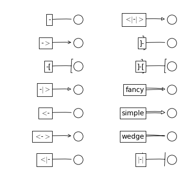
    

# 标签


```python
import numpy as np
import matplotlib as mpl
import matplotlib.pyplot as plt

%matplotlib inline
```

`legend()` 函数被用来添加图像的标签，其主要相关的属性有：

- legend entry - 一个 legend 包含一个或多个 entry，一个 entry 对应一个 key 和一个 label 
- legend key - marker 的标记
- legend label - key 的说明
- legend handle - 一个 entry 在图上对应的对象

## 使用 legend

调用 `legend()` 会自动获取当前的 `Axes` 对象，并且得到这些 handles 和 labels，相当于：

    handles, labels = ax.get_legend_handles_labels()
    ax.legend(handles, labels)

我们可以在函数中指定 `handles` 的参数：


```python
line_up, = plt.plot([1,2,3], label='Line 2')
line_down, = plt.plot([3,2,1], label='Line 1')
plt.legend(handles=[line_up, line_down])
plt.show()
```


    
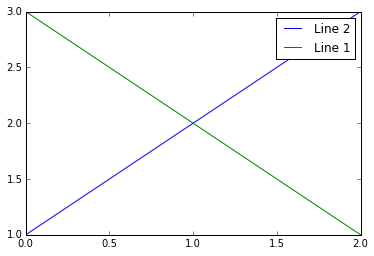
    


可以将 labels 作为参数输入 `legend` 函数：


```python
line_up, = plt.plot([1,2,3])
line_down, = plt.plot([3,2,1])
plt.legend([line_up, line_down], ['Line Up', 'Line Down'])
plt.show()
```


    
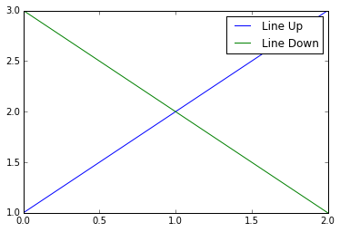
    


## 产生特殊形状的 marker key

有时我们可以产生一些特殊形状的 marker：

块状：


```python
import matplotlib.patches as mpatches

red_patch = mpatches.Patch(color='red', label='The red data')
plt.legend(handles=[red_patch])

plt.show()
```


    
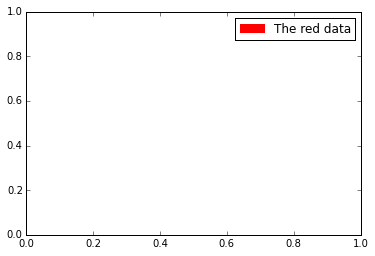
    


点线组合：


```python
import matplotlib.lines as mlines
import matplotlib.pyplot as plt

blue_line = mlines.Line2D([], [], color='blue', marker='*',
                          markersize=15, label='Blue stars')
plt.legend(handles=[blue_line])

plt.show()
```


    
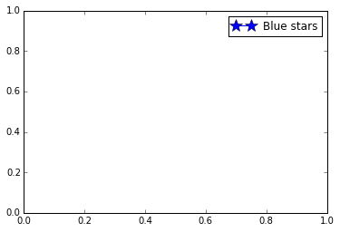
    


## 指定 legend 的位置

`bbox_to_anchor` 关键词可以指定 `legend` 放置的位置，例如放到图像的右上角：


```python
plt.plot([1,2,3], label="test1")
plt.plot([3,2,1], label="test2")
plt.legend(bbox_to_anchor=(1, 1),
           bbox_transform=plt.gcf().transFigure)

plt.show()
```


    
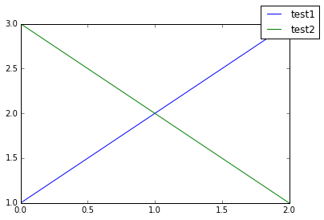
    


更复杂的用法：


```python
plt.subplot(211)
plt.plot([1,2,3], label="test1")
plt.plot([3,2,1], label="test2")
# Place a legend above this legend, expanding itself to
# fully use the given bounding box.
plt.legend(bbox_to_anchor=(0., 1.02, 1., .102), loc=3,
           ncol=2, mode="expand", borderaxespad=0.)

plt.subplot(223)
plt.plot([1,2,3], label="test1")
plt.plot([3,2,1], label="test2")
# Place a legend to the right of this smaller figure.
plt.legend(bbox_to_anchor=(1.05, 1), loc=2, borderaxespad=0.)

plt.show()
```


    
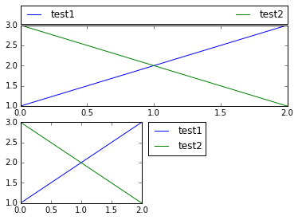
    


## 同一个 Axes 中的多个 legend

可以这样添加多个 `legend`：


```python
line1, = plt.plot([1,2,3], label="Line 1", linestyle='--')
line2, = plt.plot([3,2,1], label="Line 2", linewidth=4)

# Create a legend for the first line.
first_legend = plt.legend(handles=[line1], loc=1)

# Add the legend manually to the current Axes.
ax = plt.gca().add_artist(first_legend)

# Create another legend for the second line.
plt.legend(handles=[line2], loc=4)

plt.show()
```


    
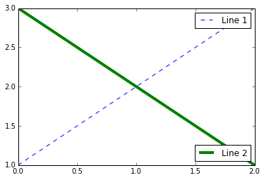
    


其中 `loc` 参数可以取 0-10 或者 字符串，表示放置的位置：

loc string | loc code
---|---
`'best'  `|          0
`'upper right' `   | 1
`'upper left'  `    |2
`'lower left'  `    |3
`'lower right' `    |4
`'right'       `   | 5
`'center left' `    |6
`'center right'`   | 7
`'lower center'`  |  8
`'upper center'` |   9
`'center'`          |10

## 更多用法

多个 `handle` 可以通过括号组合在一个 entry 中：


```python
from numpy.random import randn

z = randn(10)

red_dot, = plt.plot(z, "ro", markersize=15)
# Put a white cross over some of the data.
white_cross, = plt.plot(z[:5], "w+", markeredgewidth=3, markersize=15)

plt.legend([red_dot, (red_dot, white_cross)], ["Attr A", "Attr A+B"])

plt.show()
```


    
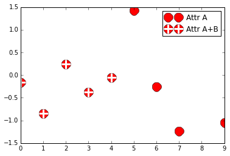
    


自定义 `handle`：


```python
import matplotlib.pyplot as plt
import matplotlib.patches as mpatches

class AnyObject(object):
    pass

class AnyObjectHandler(object):
    def legend_artist(self, legend, orig_handle, fontsize, handlebox):
        x0, y0 = handlebox.xdescent, handlebox.ydescent
        width, height = handlebox.width, handlebox.height
        patch = mpatches.Rectangle([x0, y0], width, height, facecolor='red',
                                   edgecolor='black', hatch='xx', lw=3,
                                   transform=handlebox.get_transform())
        handlebox.add_artist(patch)
        return patch

plt.legend([AnyObject()], ['My first handler'],
           handler_map={AnyObject: AnyObjectHandler()})

plt.show()
```


    
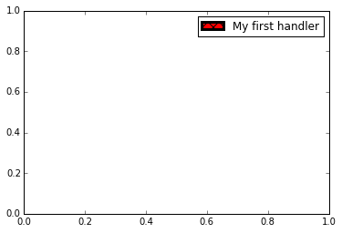
    


椭圆：


```python
from matplotlib.legend_handler import HandlerPatch
import matplotlib.pyplot as plt
import matplotlib.patches as mpatches


class HandlerEllipse(HandlerPatch):
    def create_artists(self, legend, orig_handle,
                       xdescent, ydescent, width, height, fontsize, trans):
        center = 0.5 * width - 0.5 * xdescent, 0.5 * height - 0.5 * ydescent
        p = mpatches.Ellipse(xy=center, width=width + xdescent,
                             height=height + ydescent)
        self.update_prop(p, orig_handle, legend)
        p.set_transform(trans)
        return [p]


c = mpatches.Circle((0.5, 0.5), 0.25, facecolor="green",
                    edgecolor="red", linewidth=3)
plt.gca().add_patch(c)

plt.legend([c], ["An ellipse, not a rectangle"],
           handler_map={mpatches.Circle: HandlerEllipse()})

plt.show()
```


    
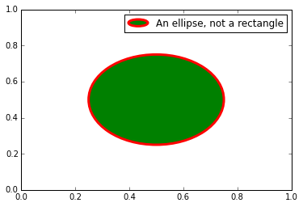
    

# figures, subplots, axes 和 ticks 对象

## figures, axes 和 ticks 的关系

这些对象的关系可以用下面的图来表示：

示例图像：


具体结构：


## figure 对象

`figure` 对象是最外层的绘图单位，默认是以 `1` 开始编号（**MATLAB** 风格，`Figure 1, Figure 2, ...`），可以用 `plt.figure()` 产生一幅图像，除了默认参数外，可以指定的参数有：

- `num` - 编号
- `figsize` - 图像大小
- `dpi` - 分辨率
- `facecolor` - 背景色
- `edgecolor` - 边界颜色
- `frameon` - 边框

这些属性也可以通过 `Figure` 对象的 `set_xxx` 方法来改变。

## subplot 和 axes 对象

### subplot

`subplot` 主要是使用网格排列子图：


```python
%pylab inline

subplot(2,1,1)
xticks([]), yticks([])
text(0.5,0.5, 'subplot(2,1,1)',ha='center',va='center',size=24,alpha=.5)

subplot(2,1,2)
xticks([]), yticks([])
text(0.5,0.5, 'subplot(2,1,2)',ha='center',va='center',size=24,alpha=.5)

show()
```

    Populating the interactive namespace from numpy and matplotlib


    

    


更高级的可以用 `gridspec` 来绘图：


```python
import matplotlib.gridspec as gridspec

G = gridspec.GridSpec(3, 3)

axes_1 = subplot(G[0, :])
xticks([]), yticks([])
text(0.5,0.5, 'Axes 1',ha='center',va='center',size=24,alpha=.5)

axes_2 = subplot(G[1,:-1])
xticks([]), yticks([])
text(0.5,0.5, 'Axes 2',ha='center',va='center',size=24,alpha=.5)

axes_3 = subplot(G[1:, -1])
xticks([]), yticks([])
text(0.5,0.5, 'Axes 3',ha='center',va='center',size=24,alpha=.5)

axes_4 = subplot(G[-1,0])
xticks([]), yticks([])
text(0.5,0.5, 'Axes 4',ha='center',va='center',size=24,alpha=.5)

axes_5 = subplot(G[-1,-2])
xticks([]), yticks([])
text(0.5,0.5, 'Axes 5',ha='center',va='center',size=24,alpha=.5)

show()
```


    

    


## axes 对象

`subplot` 返回的是 `Axes` 对象，但是 `Axes` 对象相对于 `subplot` 返回的对象来说要更自由一点。`Axes` 对象可以放置在图像中的任意位置：


```python
axes([0.1,0.1,.8,.8])
xticks([]), yticks([])
text(0.6,0.6, 'axes([0.1,0.1,.8,.8])',ha='center',va='center',size=20,alpha=.5)

axes([0.2,0.2,.3,.3])
xticks([]), yticks([])
text(0.5,0.5, 'axes([0.2,0.2,.3,.3])',ha='center',va='center',size=16,alpha=.5)

show()
```


    

    


```python
axes([0.1,0.1,.5,.5])
xticks([]), yticks([])
text(0.1,0.1, 'axes([0.1,0.1,.8,.8])',ha='left',va='center',size=16,alpha=.5)

axes([0.2,0.2,.5,.5])
xticks([]), yticks([])
text(0.1,0.1, 'axes([0.2,0.2,.5,.5])',ha='left',va='center',size=16,alpha=.5)

axes([0.3,0.3,.5,.5])
xticks([]), yticks([])
text(0.1,0.1, 'axes([0.3,0.3,.5,.5])',ha='left',va='center',size=16,alpha=.5)

axes([0.4,0.4,.5,.5])
xticks([]), yticks([])
text(0.1,0.1, 'axes([0.4,0.4,.5,.5])',ha='left',va='center',size=16,alpha=.5)

show()
```


    

    


后面的 `Axes` 对象会覆盖前面的内容。

## ticks 对象

ticks 用来注释轴的内容，我们可以通过控制它的属性来决定在哪里显示轴、轴的内容是什么等等。
# 不要迷信默认设置

导入相关的包：


```python
import numpy as np
import matplotlib.pyplot as plt
```

生成三角函数：


```python
x = np.linspace(-np.pi, np.pi)
c, s = np.cos(x), np.sin(x)
```

## 默认绘图


```python
%matplotlib inline

# 画图
p = plt.plot(x,c)
p = plt.plot(x,s)

# 在脚本中需要加上这句才会显示图像
plt.show()
```


    

    


默认效果如图所示，我们可以修改默认的属性来得到更漂亮的结果。

# 图

图像以 `Figure #` 为窗口标题，并且数字从 1 开始，`figure()` 函数的主要参数如下：

参数 | 默认值 | 描述
---|---|---
`num`|`1`| 图号
`figsize`|`figure.figsize`| 图大小（宽，高）（单位英寸）
`dpi`|`figure.dpi`| 分辨率（每英寸所打印的点数）
`facecolor`|`figure.facecolor`| 背景颜色
`edgecolor`|`figure.edgecolor`| 边界颜色
`frameon` |`True`| 是否显示图框架


```python
# 设置图像大小
f = plt.figure(figsize=(10,6), dpi=80)

# 画图
p = plt.plot(x,c)
p = plt.plot(x,s)

# 在脚本中需要加上这句才会显示图像
plt.show()
```

### 设置线条颜色，粗细，类型

首先，我们使用 figure() 函数来创建一幅新图像，并且指定它的大小，使得长宽比更合适。

然后，我们使用 `color, linewidth, linestyle` 参数，指定曲线的颜色，粗细，类型：


```python
# 设置图像大小
f = plt.figure(figsize=(10,6), dpi=80)

# 画图，指定颜色，线宽，类型
p = plt.plot(x, c, color="blue", linewidth=2.5, linestyle="-")
p = plt.plot(x, s, color="red",  linewidth=2.5, linestyle="-")

# 在脚本中需要加上这句才会显示图像
# plt.show()
```


    

    


也可以像 **Matlab** 中一样使用格式字符来修改参数：

表示颜色的字符参数有：

字符 | 颜色
-- | -- 
`‘b’`|	蓝色，blue
`‘g’`|	绿色，green
`‘r’`|	红色，red
`‘c’`|	青色，cyan
`‘m’`|	品红，magenta
`‘y’`|	黄色，yellow
`‘k’`|	黑色，black
`‘w’`|	白色，white

表示类型的字符参数有：

字符|类型 | 字符|类型
---|--- | --- | ---
`  '-'	`| 实线 | `'--'`|	虚线
`'-.'`|	虚点线 | `':'`|	点线
`'.'`|	点 | `','`| 像素点
`'o'`	|圆点 | `'v'`|	下三角点
`'^'`|	上三角点 | `'<'`|	左三角点
`'>'`|	右三角点 | `'1'`|	下三叉点
`'2'`|	上三叉点 | `'3'`|	左三叉点
`'4'`|	右三叉点 | `'s'`|	正方点
`'p'`	| 五角点 | `'*'`|	星形点
`'h'`|	六边形点1 | `'H'`|	六边形点2 
`'+'`|	加号点 | `'x'`|	乘号点
`'D'`|	实心菱形点 | `'d'`|	瘦菱形点 
`'_'`|	横线点 | |


```python
# 设置图像大小
f = plt.figure(figsize=(10,6), dpi=80)

# 画图，指定颜色，线宽，类型
p = plt.plot(x, c, 'b-', 
         x, s, 'r-', linewidth=2.5)

# 在脚本中需要加上这句才会显示图像
# plt.show()
```


    
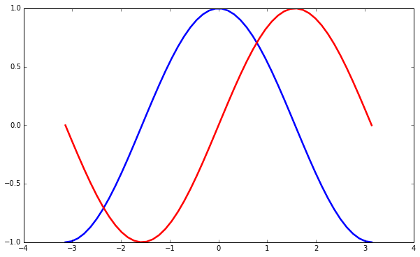
    


### 设置横轴纵轴的显示区域

我们希望将坐标轴的显示区域放大一些，这样可以看到所有的点，可以使用 `plt` 中的 `xlim` 和 `ylim` 来设置：


```python
# 设置图像大小
p = plt.figure(figsize=(10,6), dpi=80)

# 画图，指定颜色，线宽，类型
p = plt.plot(x, c, 'b-', 
         x, s, 'r-', linewidth=2.5)

########################################################################

# 设置显示范围
p = plt.xlim(x.min() * 1.1, x.max() * 1.1)
p = plt.ylim(c.min() * 1.1, c.max() * 1.1)

########################################################################

# 在脚本中需要加上这句才会显示图像
# plt.show()
```


    
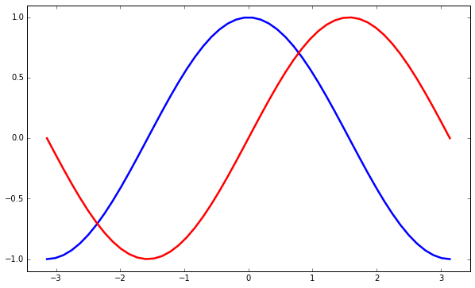
    


### 设置刻度

对于三教函数来说，我们希望将 `x` 轴的刻度设为与 $\pi$ 有关的点，可以使用 `plt` 中的 `xticks` 和 `yticks` 函数，将需要的刻度传入：


```python
# 设置图像大小
f = plt.figure(figsize=(10,6), dpi=80)

# 画图，指定颜色，线宽，类型
p = plt.plot(x, c, 'b-', 
         x, s, 'r-', linewidth=2.5)

# 设置显示范围
plt.xlim(x.min() * 1.1, x.max() * 1.1)
plt.ylim(c.min() * 1.1, c.max() * 1.1)

###########################################################################

# 设置刻度
p = plt.xticks([-np.pi, -np.pi/2, 0, np.pi/2, np.pi])
p = plt.yticks([-1, 0, 1])

###########################################################################

# 在脚本中需要加上这句才会显示图像
# plt.show()
```


    
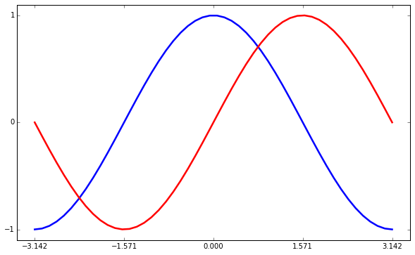
    


### 设定 x 轴 y 轴标题

我们想让刻度的位置显示的是含有 $\pi$ 的标识而不是浮点数，可以在 `xticks` 中传入第二组参数，这组参数代表对应刻度的显示标识。这里，我们使用 `latex` 的语法来显示特殊符号（使用 `$$` 包围的部分）：


```python
# 设置图像大小
f = plt.figure(figsize=(10,6), dpi=80)

# 画图，指定颜色，线宽，类型
p = plt.plot(x, c, 'b-', 
         x, s, 'r-', linewidth=2.5)

# 设置显示范围
plt.xlim(x.min() * 1.1, x.max() * 1.1)
plt.ylim(c.min() * 1.1, c.max() * 1.1)

# 设置刻度及其标识
p = plt.xticks([-np.pi, -np.pi/2, 0, np.pi/2, np.pi], 
               ['$-\pi$', '$-\pi/2$', '$0$', '$\pi/2$', '$\pi$'], fontsize ='xx-large')
p = plt.yticks([-1, 0, 1], 
               ['$-1$', '$0$', '$+1$'], fontsize ='xx-large')

# 在脚本中需要加上这句才会显示图像
# plt.show()
```


    
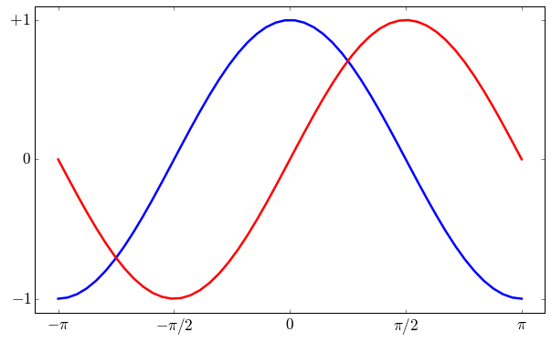
    


### 移动坐标轴的位置

现在坐标轴的位置是在边界上，而且有上下左右四条，我们现在想将下面和左边的两条移动到中间，并将右边和上面的两条去掉：


```python
# 设置图像大小
f = plt.figure(figsize=(10,6), dpi=80)

# 画图，指定颜色，线宽，类型
plt.plot(x, c, 'b-', 
         x, s, 'r-', linewidth=2.5)

# 设置显示范围
plt.xlim(x.min() * 1.1, x.max() * 1.1)
plt.ylim(c.min() * 1.1, c.max() * 1.1)

# 得到轴的句柄
ax = plt.gca()
# ax.spines参数表示四个坐标轴线
# 将右边和上边的颜色设为透明
ax.spines['right'].set_color('none')
ax.spines['top'].set_color('none')

###################################################################################

# 将 x 轴的刻度设置在下面的坐标轴上
ax.xaxis.set_ticks_position('bottom')
# 设置位置
ax.spines['bottom'].set_position(('data',0))

# 将 y 轴的刻度设置在左边的坐标轴上
ax.yaxis.set_ticks_position('left')
# 设置位置
ax.spines['left'].set_position(('data',0))

###################################################################################

# 设置刻度及其标识
p = plt.xticks([-np.pi, -np.pi/2, 0, np.pi/2, np.pi], 
           ['$-\pi$', '$-\pi/2$', '$0$', '$\pi/2$', '$\pi$'], fontsize ='xx-large')
p = plt.yticks([-1, 0, 1], 
           ['$-1$', '$0$', '$+1$'], fontsize ='xx-large')

# 在脚本中需要加上这句才会显示图像
# plt.show()
```


    
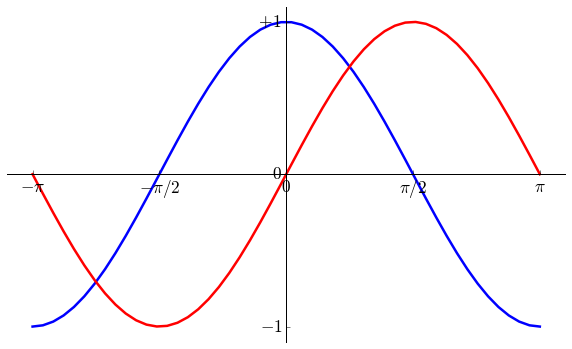
    


### 加入图例

使用 legend() 加入图例：


```python
# 设置图像大小
plt.figure(figsize=(10,6), dpi=80)

# 画图，指定颜色，线宽，类型
plt.plot(x, c, 'b-', 
         x, s, 'r-', linewidth=2.5)

# 设置显示范围
plt.xlim(x.min() * 1.1, x.max() * 1.1)
plt.ylim(c.min() * 1.1, c.max() * 1.1)

# 得到画图的句柄
ax = plt.gca()

# ax.spines参数表示四个坐标轴线
# 将右边和上边的颜色设为透明
ax.spines['right'].set_color('none')
ax.spines['top'].set_color('none')

# 将 x 轴的刻度设置在下面的坐标轴上
ax.xaxis.set_ticks_position('bottom')
# 设置位置
ax.spines['bottom'].set_position(('data',0))

# 将 y 轴的刻度设置在左边的坐标轴上
ax.yaxis.set_ticks_position('left')
# 设置位置
ax.spines['left'].set_position(('data',0))

# 设置刻度及其标识
plt.xticks([-np.pi, -np.pi/2, 0, np.pi/2, np.pi], 
           ['$-\pi$', '$-\pi/2$', '$0$', '$\pi/2$', '$\pi$'], fontsize ='xx-large')
plt.yticks([-1, 0, 1], 
           ['$-1$', '$0$', '$+1$'], fontsize ='xx-large')

##################################################################################################

# 加入图例，frameon表示去掉图例周围的边框
l = plt.legend(['cosine', 'sine'], loc='upper left', frameon=False)

##################################################################################################

# 在脚本中需要加上这句才会显示图像
# plt.show()
```


    
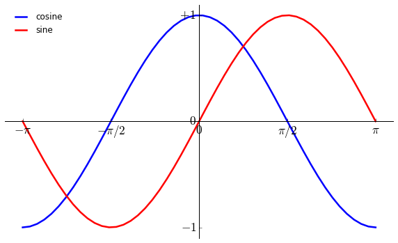
    


### 注释特殊点

我们可以使用 `annotate` 函数来注释特殊的点，假设我们要显示的点是 $2\pi/3$：


```python
# 设置图像大小
plt.figure(figsize=(10,6), dpi=80)

# 画图，指定颜色，线宽，类型
plt.plot(x, c, 'b-', 
         x, s, 'r-', linewidth=2.5)

# 设置显示范围
plt.xlim(x.min() * 1.1, x.max() * 1.1)
plt.ylim(c.min() * 1.1, c.max() * 1.1)

# 得到画图的句柄
ax = plt.gca()

# ax.spines参数表示四个坐标轴线
# 将右边和上边的颜色设为透明
ax.spines['right'].set_color('none')
ax.spines['top'].set_color('none')

# 将 x 轴的刻度设置在下面的坐标轴上
ax.xaxis.set_ticks_position('bottom')
# 设置位置
ax.spines['bottom'].set_position(('data',0))

# 将 y 轴的刻度设置在左边的坐标轴上
ax.yaxis.set_ticks_position('left')
# 设置位置
ax.spines['left'].set_position(('data',0))

# 设置刻度及其标识
plt.xticks([-np.pi, -np.pi/2, 0, np.pi/2, np.pi], 
           ['$-\pi$', '$-\pi/2$', '$0$', '$\pi/2$', '$\pi$'], fontsize ='xx-large')
plt.yticks([-1, 0, 1], 
           ['$-1$', '$0$', '$+1$'], fontsize ='xx-large')

# 加入图例，frameon表示图例周围是否需要边框
l = plt.legend(['cosine', 'sine'], loc='upper left', frameon=False)

####################################################################################

# 数据点
t = 2 * np.pi / 3

# 蓝色虚线
plt.plot([t,t],[0,np.cos(t)], color ='blue', linewidth=2.5, linestyle="--")

# 该点处的 cos 值
plt.scatter([t,],[np.cos(t),], 50, color ='blue')

# 在对应的点显示文本
plt.annotate(r'$\sin(\frac{2\pi}{3})=\frac{\sqrt{3}}{2}$', # 文本
             xy=(t, np.sin(t)), # 数据点坐标位置
             xycoords='data',   # 坐标相对于数据
             xytext=(+10, +30), # 文本位置坐标
             textcoords='offset points', # 坐标相对于数据点的坐标
             fontsize=16,       # 文本大小
             arrowprops=dict(arrowstyle="->", connectionstyle="arc3,rad=.2")) # 箭头

# 红色虚线
p = plt.plot([t,t],[0,np.sin(t)], color ='red', linewidth=2.5, linestyle="--")

# 该点处的 sin 值
p = plt.scatter([t,],[np.sin(t),], 50, color ='red')

# 显示文本
p = plt.annotate(r'$\cos(\frac{2\pi}{3})=-\frac{1}{2}$',
             xy=(t, np.cos(t)), xycoords='data',
             xytext=(-90, -50), textcoords='offset points', fontsize=16,
             arrowprops=dict(arrowstyle="->", connectionstyle="arc3,rad=.2"))


#####################################################################################

# 在脚本中需要加上这句才会显示图像
# plt.show()
```


    
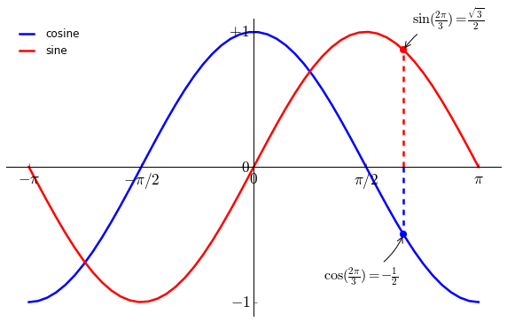
    


### 最后调整

调整刻度值的大小，并让其显示在曲线上方。


```python
# 设置图像大小
plt.figure(figsize=(10,6), dpi=80)

# 画图，指定颜色，线宽，类型
plt.plot(x, c, 'b-', 
         x, s, 'r-', linewidth=2.5)

# 设置显示范围
plt.xlim(x.min() * 1.1, x.max() * 1.1)
plt.ylim(c.min() * 1.1, c.max() * 1.1)

# 得到画图的句柄
ax = plt.gca()

# ax.spines参数表示四个坐标轴线
# 将右边和上边的颜色设为透明
ax.spines['right'].set_color('none')
ax.spines['top'].set_color('none')

# 将 x 轴的刻度设置在下面的坐标轴上
ax.xaxis.set_ticks_position('bottom')
# 设置位置
ax.spines['bottom'].set_position(('data',0))

# 将 y 轴的刻度设置在左边的坐标轴上
ax.yaxis.set_ticks_position('left')
# 设置位置
ax.spines['left'].set_position(('data',0))

# 设置刻度及其标识
plt.xticks([-np.pi, -np.pi/2, 0, np.pi/2, np.pi], 
           ['$-\pi$', '$-\pi/2$', '$0$', '$\pi/2$', '$\pi$'], fontsize ='xx-large')
plt.yticks([-1, 0, 1], 
           ['$-1$', '$0$', '$+1$'], fontsize ='xx-large')

# 加入图例，frameon表示图例周围是否需要边框
l = plt.legend(['cosine', 'sine'], loc='upper left', frameon=False)

# 数据点
t = 2 * np.pi / 3

# 蓝色虚线
plt.plot([t,t],[0,np.cos(t)], color ='blue', linewidth=2.5, linestyle="--")

# 该点处的 cos 值
plt.scatter([t,],[np.cos(t),], 50, color ='blue')

# 在对应的点显示文本
plt.annotate(r'$\sin(\frac{2\pi}{3})=\frac{\sqrt{3}}{2}$', # 文本
             xy=(t, np.sin(t)), # 数据点坐标位置
             xycoords='data',   # 坐标相对于数据
             xytext=(+10, +30), # 文本位置坐标
             textcoords='offset points', # 坐标相对于数据点的坐标
             fontsize=16,       # 文本大小
             arrowprops=dict(arrowstyle="->", connectionstyle="arc3,rad=.2")) # 箭头

# 红色虚线
p = plt.plot([t,t],[0,np.sin(t)], color ='red', linewidth=2.5, linestyle="--")

# 该点处的 sin 值
p = plt.scatter([t,],[np.sin(t),], 50, color ='red')

# 显示文本
p = plt.annotate(r'$\cos(\frac{2\pi}{3})=-\frac{1}{2}$',
             xy=(t, np.cos(t)), xycoords='data',
             xytext=(-90, -50), textcoords='offset points', fontsize=16,
             arrowprops=dict(arrowstyle="->", connectionstyle="arc3,rad=.2"))


#####################################################################################

for label in ax.get_xticklabels() + ax.get_yticklabels():
    label.set_fontsize(16)
    label.set_bbox(dict(facecolor='white', edgecolor='None', alpha=0.65 ))

####################################################################################

# 在脚本中需要加上这句才会显示图像
# plt.show()
```


    

    


> The devil is in the details.
# 各种绘图实例

## 简单绘图

`plot` 函数：


```python
%matplotlib inline

import numpy as np
import matplotlib.pyplot as plt

t = np.arange(0.0, 2.0, 0.01)
s = np.sin(2*np.pi*t)
plt.plot(t, s)

plt.xlabel('time (s)')
plt.ylabel('voltage (mV)')
plt.title('About as simple as it gets, folks')
plt.grid(True)
plt.show()
```


    

    


## 子图

`subplot` 函数：


```python
import numpy as np
import matplotlib.mlab as mlab

x1 = np.linspace(0.0, 5.0)
x2 = np.linspace(0.0, 2.0)

y1 = np.cos(2 * np.pi * x1) * np.exp(-x1)
y2 = np.cos(2 * np.pi * x2)

plt.subplot(2, 1, 1)
plt.plot(x1, y1, 'yo-')
plt.title('A tale of 2 subplots')
plt.ylabel('Damped oscillation')

plt.subplot(2, 1, 2)
plt.plot(x2, y2, 'r.-')
plt.xlabel('time (s)')
plt.ylabel('Undamped')

plt.show()
```


    

    


## 直方图

`hist` 函数：


```python
import numpy as np
import matplotlib.mlab as mlab
import matplotlib.pyplot as plt

# example data
mu = 100 # mean of distribution
sigma = 15 # standard deviation of distribution
x = mu + sigma * np.random.randn(10000)

num_bins = 50
# the histogram of the data
n, bins, patches = plt.hist(x, num_bins, normed=1, facecolor='green', alpha=0.5)
# add a 'best fit' line
y = mlab.normpdf(bins, mu, sigma)
plt.plot(bins, y, 'r--')
plt.xlabel('Smarts')
plt.ylabel('Probability')
plt.title(r'Histogram of IQ: $\mu=100$, $\sigma=15$')

# Tweak spacing to prevent clipping of ylabel
plt.subplots_adjust(left=0.15)
plt.show()
```


    

    


## 路径图

`matplotlib.path` 包：


```python
import matplotlib.path as mpath
import matplotlib.patches as mpatches
import matplotlib.pyplot as plt

fig, ax = plt.subplots()

Path = mpath.Path
path_data = [
    (Path.MOVETO, (1.58, -2.57)),
    (Path.CURVE4, (0.35, -1.1)),
    (Path.CURVE4, (-1.75, 2.0)),
    (Path.CURVE4, (0.375, 2.0)),
    (Path.LINETO, (0.85, 1.15)),
    (Path.CURVE4, (2.2, 3.2)),
    (Path.CURVE4, (3, 0.05)),
    (Path.CURVE4, (2.0, -0.5)),
    (Path.CLOSEPOLY, (1.58, -2.57)),
    ]
codes, verts = zip(*path_data)
path = mpath.Path(verts, codes)
patch = mpatches.PathPatch(path, facecolor='r', alpha=0.5)
ax.add_patch(patch)

# plot control points and connecting lines
x, y = zip(*path.vertices)
line, = ax.plot(x, y, 'go-')

ax.grid()
ax.axis('equal')
plt.show()
```


    

    


## 三维绘图

导入 `Axex3D`：


```python
from mpl_toolkits.mplot3d import Axes3D
from matplotlib import cm
from matplotlib.ticker import LinearLocator, FormatStrFormatter
import matplotlib.pyplot as plt
import numpy as np

fig = plt.figure()
ax = fig.gca(projection='3d')
X = np.arange(-5, 5, 0.25)
Y = np.arange(-5, 5, 0.25)
X, Y = np.meshgrid(X, Y)
R = np.sqrt(X**2 + Y**2)
Z = np.sin(R)
surf = ax.plot_surface(X, Y, Z, rstride=1, cstride=1, cmap=cm.coolwarm,
        linewidth=0, antialiased=False)
ax.set_zlim(-1.01, 1.01)

ax.zaxis.set_major_locator(LinearLocator(10))
ax.zaxis.set_major_formatter(FormatStrFormatter('%.02f'))

fig.colorbar(surf, shrink=0.5, aspect=5)

plt.show()
```


    

    


## 流向图

主要函数：`plt.streamplot`


```python
import numpy as np
import matplotlib.pyplot as plt

Y, X = np.mgrid[-3:3:100j, -3:3:100j]
U = -1 - X**2 + Y
V = 1 + X - Y**2
speed = np.sqrt(U*U + V*V)

plt.streamplot(X, Y, U, V, color=U, linewidth=2, cmap=plt.cm.autumn)
plt.colorbar()

f, (ax1, ax2) = plt.subplots(ncols=2)
ax1.streamplot(X, Y, U, V, density=[0.5, 1])

lw = 5*speed/speed.max()
ax2.streamplot(X, Y, U, V, density=0.6, color='k', linewidth=lw)

plt.show()
```


    

    


    

    


## 椭圆

`Ellipse` 对象：


```python
from pylab import figure, show, rand
from matplotlib.patches import Ellipse

NUM = 250

ells = [Ellipse(xy=rand(2)*10, width=rand(), height=rand(), angle=rand()*360)
        for i in range(NUM)]

fig = figure()
ax = fig.add_subplot(111, aspect='equal')
for e in ells:
    ax.add_artist(e)
    e.set_clip_box(ax.bbox)
    e.set_alpha(rand())
    e.set_facecolor(rand(3))

ax.set_xlim(0, 10)
ax.set_ylim(0, 10)

show()
```


    

    


## 条状图

`bar` 函数：


```python
import numpy as np
import matplotlib.pyplot as plt


n_groups = 5

means_men = (20, 35, 30, 35, 27)
std_men = (2, 3, 4, 1, 2)

means_women = (25, 32, 34, 20, 25)
std_women = (3, 5, 2, 3, 3)

fig, ax = plt.subplots()

index = np.arange(n_groups)
bar_width = 0.35

opacity = 0.4
error_config = {'ecolor': '0.3'}

rects1 = plt.bar(index, means_men, bar_width,
                 alpha=opacity,
                 color='b',
                 yerr=std_men,
                 error_kw=error_config,
                 label='Men')

rects2 = plt.bar(index + bar_width, means_women, bar_width,
                 alpha=opacity,
                 color='r',
                 yerr=std_women,
                 error_kw=error_config,
                 label='Women')

plt.xlabel('Group')
plt.ylabel('Scores')
plt.title('Scores by group and gender')
plt.xticks(index + bar_width, ('A', 'B', 'C', 'D', 'E'))
plt.legend()

plt.tight_layout()
plt.show()
```


    

    


## 饼状图

`pie` 函数：


```python
import matplotlib.pyplot as plt


# The slices will be ordered and plotted counter-clockwise.
labels = 'Frogs', 'Hogs', 'Dogs', 'Logs'
sizes = [15, 30, 45, 10]
colors = ['yellowgreen', 'gold', 'lightskyblue', 'lightcoral']
explode = (0, 0.1, 0, 0) # only "explode" the 2nd slice (i.e. 'Hogs')

plt.pie(sizes, explode=explode, labels=labels, colors=colors,
        autopct='%1.1f%%', shadow=True, startangle=90)
# Set aspect ratio to be equal so that pie is drawn as a circle.
plt.axis('equal')

plt.show()
```


    

    


## 图像中的表格 

`table` 函数：


```python
import numpy as np
import matplotlib.pyplot as plt


data = [[  66386,  174296,   75131,  577908,   32015],
        [  58230,  381139,   78045,   99308,  160454],
        [  89135,   80552,  152558,  497981,  603535],
        [  78415,   81858,  150656,  193263,   69638],
        [ 139361,  331509,  343164,  781380,   52269]]

columns = ('Freeze', 'Wind', 'Flood', 'Quake', 'Hail')
rows = ['%d year' % x for x in (100, 50, 20, 10, 5)]

values = np.arange(0, 2500, 500)
value_increment = 1000

# Get some pastel shades for the colors
colors = plt.cm.BuPu(np.linspace(0, 0.5, len(columns)))
n_rows = len(data)

index = np.arange(len(columns)) + 0.3
bar_width = 0.4

# Initialize the vertical-offset for the stacked bar chart.
y_offset = np.array([0.0] * len(columns))

# Plot bars and create text labels for the table
cell_text = []
for row in range(n_rows):
    plt.bar(index, data[row], bar_width, bottom=y_offset, color=colors[row])
    y_offset = y_offset + data[row]
    cell_text.append(['%1.1f' % (x/1000.0) for x in y_offset])
# Reverse colors and text labels to display the last value at the top.
colors = colors[::-1]
cell_text.reverse()

# Add a table at the bottom of the axes
the_table = plt.table(cellText=cell_text,
                      rowLabels=rows,
                      rowColours=colors,
                      colLabels=columns,
                      loc='bottom')

# Adjust layout to make room for the table:
plt.subplots_adjust(left=0.2, bottom=0.2)

plt.ylabel("Loss in ${0}'s".format(value_increment))
plt.yticks(values * value_increment, ['%d' % val for val in values])
plt.xticks([])
plt.title('Loss by Disaster')

plt.show()
```


    

    


## 散点图

`scatter` 函数：


```python
import numpy as np
import matplotlib.pyplot as plt
import matplotlib.cbook as cbook

# Load a numpy record array from yahoo csv data with fields date,
# open, close, volume, adj_close from the mpl-data/example directory.
# The record array stores python datetime.date as an object array in
# the date column
datafile = cbook.get_sample_data('goog.npy')
price_data = np.load(datafile).view(np.recarray)
price_data = price_data[-250:] # get the most recent 250 trading days

delta1 = np.diff(price_data.adj_close)/price_data.adj_close[:-1]

# Marker size in units of points^2
volume = (15 * price_data.volume[:-2] / price_data.volume[0])**2
close = 0.003 * price_data.close[:-2] / 0.003 * price_data.open[:-2]

fig, ax = plt.subplots()
ax.scatter(delta1[:-1], delta1[1:], c=close, s=volume, alpha=0.5)

ax.set_xlabel(r'$\Delta_i$', fontsize=20)
ax.set_ylabel(r'$\Delta_{i+1}$', fontsize=20)
ax.set_title('Volume and percent change')

ax.grid(True)
fig.tight_layout()

plt.show()
```


    

    


## 设置按钮

`matplotlib.widgets` 模块：


```python
import numpy as np
import matplotlib.pyplot as plt
from matplotlib.widgets import Slider, Button, RadioButtons

fig, ax = plt.subplots()
plt.subplots_adjust(left=0.25, bottom=0.25)
t = np.arange(0.0, 1.0, 0.001)
a0 = 5
f0 = 3
s = a0*np.sin(2*np.pi*f0*t)
l, = plt.plot(t,s, lw=2, color='red')
plt.axis([0, 1, -10, 10])

axcolor = 'lightgoldenrodyellow'
axfreq = plt.axes([0.25, 0.1, 0.65, 0.03], axisbg=axcolor)
axamp  = plt.axes([0.25, 0.15, 0.65, 0.03], axisbg=axcolor)

sfreq = Slider(axfreq, 'Freq', 0.1, 30.0, valinit=f0)
samp = Slider(axamp, 'Amp', 0.1, 10.0, valinit=a0)

def update(val):
    amp = samp.val
    freq = sfreq.val
    l.set_ydata(amp*np.sin(2*np.pi*freq*t))
    fig.canvas.draw_idle()
sfreq.on_changed(update)
samp.on_changed(update)

resetax = plt.axes([0.8, 0.025, 0.1, 0.04])
button = Button(resetax, 'Reset', color=axcolor, hovercolor='0.975')
def reset(event):
    sfreq.reset()
    samp.reset()
button.on_clicked(reset)

rax = plt.axes([0.025, 0.5, 0.15, 0.15], axisbg=axcolor)
radio = RadioButtons(rax, ('red', 'blue', 'green'), active=0)
def colorfunc(label):
    l.set_color(label)
    fig.canvas.draw_idle()
radio.on_clicked(colorfunc)

plt.show()
```


    

    


## 填充曲线

`fill` 函数：


```python
import numpy as np
import matplotlib.pyplot as plt


x = np.linspace(0, 1)
y = np.sin(4 * np.pi * x) * np.exp(-5 * x)

plt.fill(x, y, 'r')
plt.grid(True)
plt.show()
```


    

    


## 时间刻度


```python
"""
Show how to make date plots in matplotlib using date tick locators and
formatters.  See major_minor_demo1.py for more information on
controlling major and minor ticks

All matplotlib date plotting is done by converting date instances into
days since the 0001-01-01 UTC.  The conversion, tick locating and
formatting is done behind the scenes so this is most transparent to
you.  The dates module provides several converter functions date2num
and num2date

"""
import datetime
import numpy as np
import matplotlib.pyplot as plt
import matplotlib.dates as mdates
import matplotlib.cbook as cbook

years    = mdates.YearLocator()   # every year
months   = mdates.MonthLocator()  # every month
yearsFmt = mdates.DateFormatter('%Y')

# load a numpy record array from yahoo csv data with fields date,
# open, close, volume, adj_close from the mpl-data/example directory.
# The record array stores python datetime.date as an object array in
# the date column
datafile = cbook.get_sample_data('goog.npy')
r = np.load(datafile).view(np.recarray)

fig, ax = plt.subplots()
ax.plot(r.date, r.adj_close)


# format the ticks
ax.xaxis.set_major_locator(years)
ax.xaxis.set_major_formatter(yearsFmt)
ax.xaxis.set_minor_locator(months)

datemin = datetime.date(r.date.min().year, 1, 1)
datemax = datetime.date(r.date.max().year+1, 1, 1)
ax.set_xlim(datemin, datemax)

# format the coords message box
def price(x): return '$%1.2f'%x
ax.format_xdata = mdates.DateFormatter('%Y-%m-%d')
ax.format_ydata = price
ax.grid(True)

# rotates and right aligns the x labels, and moves the bottom of the
# axes up to make room for them
fig.autofmt_xdate()

plt.show()
```


    

    


## 金融数据


```python
import datetime
import numpy as np
import matplotlib.colors as colors
import matplotlib.finance as finance
import matplotlib.dates as mdates
import matplotlib.ticker as mticker
import matplotlib.mlab as mlab
import matplotlib.pyplot as plt
import matplotlib.font_manager as font_manager


startdate = datetime.date(2006,1,1)
today = enddate = datetime.date.today()
ticker = 'SPY'


fh = finance.fetch_historical_yahoo(ticker, startdate, enddate)
# a numpy record array with fields: date, open, high, low, close, volume, adj_close)

r = mlab.csv2rec(fh); fh.close()
r.sort()


def moving_average(x, n, type='simple'):
    """
    compute an n period moving average.

    type is 'simple' | 'exponential'

    """
    x = np.asarray(x)
    if type=='simple':
        weights = np.ones(n)
    else:
        weights = np.exp(np.linspace(-1., 0., n))

    weights /= weights.sum()


    a =  np.convolve(x, weights, mode='full')[:len(x)]
    a[:n] = a[n]
    return a

def relative_strength(prices, n=14):
    """
    compute the n period relative strength indicator
    http://stockcharts.com/school/doku.php?id=chart_school:glossary_r#relativestrengthindex
    http://www.investopedia.com/terms/r/rsi.asp
    """

    deltas = np.diff(prices)
    seed = deltas[:n+1]
    up = seed[seed>=0].sum()/n
    down = -seed[seed<0].sum()/n
    rs = up/down
    rsi = np.zeros_like(prices)
    rsi[:n] = 100. - 100./(1.+rs)

    for i in range(n, len(prices)):
        delta = deltas[i-1] # cause the diff is 1 shorter

        if delta>0:
            upval = delta
            downval = 0.
        else:
            upval = 0.
            downval = -delta

        up = (up*(n-1) + upval)/n
        down = (down*(n-1) + downval)/n

        rs = up/down
        rsi[i] = 100. - 100./(1.+rs)

    return rsi

def moving_average_convergence(x, nslow=26, nfast=12):
    """
    compute the MACD (Moving Average Convergence/Divergence) using a fast and slow exponential moving avg'
    return value is emaslow, emafast, macd which are len(x) arrays
    """
    emaslow = moving_average(x, nslow, type='exponential')
    emafast = moving_average(x, nfast, type='exponential')
    return emaslow, emafast, emafast - emaslow


plt.rc('axes', grid=True)
plt.rc('grid', color='0.75', linestyle='-', linewidth=0.5)

textsize = 9
left, width = 0.1, 0.8
rect1 = [left, 0.7, width, 0.2]
rect2 = [left, 0.3, width, 0.4]
rect3 = [left, 0.1, width, 0.2]


fig = plt.figure(facecolor='white')
axescolor  = '#f6f6f6'  # the axes background color

ax1 = fig.add_axes(rect1, axisbg=axescolor)  #left, bottom, width, height
ax2 = fig.add_axes(rect2, axisbg=axescolor, sharex=ax1)
ax2t = ax2.twinx()
ax3  = fig.add_axes(rect3, axisbg=axescolor, sharex=ax1)


### plot the relative strength indicator
prices = r.adj_close
rsi = relative_strength(prices)
fillcolor = 'darkgoldenrod'

ax1.plot(r.date, rsi, color=fillcolor)
ax1.axhline(70, color=fillcolor)
ax1.axhline(30, color=fillcolor)
ax1.fill_between(r.date, rsi, 70, where=(rsi>=70), facecolor=fillcolor, edgecolor=fillcolor)
ax1.fill_between(r.date, rsi, 30, where=(rsi<=30), facecolor=fillcolor, edgecolor=fillcolor)
ax1.text(0.6, 0.9, '>70 = overbought', va='top', transform=ax1.transAxes, fontsize=textsize)
ax1.text(0.6, 0.1, '<30 = oversold', transform=ax1.transAxes, fontsize=textsize)
ax1.set_ylim(0, 100)
ax1.set_yticks([30,70])
ax1.text(0.025, 0.95, 'RSI (14)', va='top', transform=ax1.transAxes, fontsize=textsize)
ax1.set_title('%s daily'%ticker)

### plot the price and volume data
dx = r.adj_close - r.close
low = r.low + dx
high = r.high + dx

deltas = np.zeros_like(prices)
deltas[1:] = np.diff(prices)
up = deltas>0
ax2.vlines(r.date[up], low[up], high[up], color='black', label='_nolegend_')
ax2.vlines(r.date[~up], low[~up], high[~up], color='black', label='_nolegend_')
ma20 = moving_average(prices, 20, type='simple')
ma200 = moving_average(prices, 200, type='simple')

linema20, = ax2.plot(r.date, ma20, color='blue', lw=2, label='MA (20)')
linema200, = ax2.plot(r.date, ma200, color='red', lw=2, label='MA (200)')


last = r[-1]
s = '%s O:%1.2f H:%1.2f L:%1.2f C:%1.2f, V:%1.1fM Chg:%+1.2f' % (
    today.strftime('%d-%b-%Y'),
    last.open, last.high,
    last.low, last.close,
    last.volume*1e-6,
    last.close-last.open )
t4 = ax2.text(0.3, 0.9, s, transform=ax2.transAxes, fontsize=textsize)

props = font_manager.FontProperties(size=10)
leg = ax2.legend(loc='center left', shadow=True, fancybox=True, prop=props)
leg.get_frame().set_alpha(0.5)


volume = (r.close*r.volume)/1e6  # dollar volume in millions
vmax = volume.max()
poly = ax2t.fill_between(r.date, volume, 0, label='Volume', facecolor=fillcolor, edgecolor=fillcolor)
ax2t.set_ylim(0, 5*vmax)
ax2t.set_yticks([])


### compute the MACD indicator
fillcolor = 'darkslategrey'
nslow = 26
nfast = 12
nema = 9
emaslow, emafast, macd = moving_average_convergence(prices, nslow=nslow, nfast=nfast)
ema9 = moving_average(macd, nema, type='exponential')
ax3.plot(r.date, macd, color='black', lw=2)
ax3.plot(r.date, ema9, color='blue', lw=1)
ax3.fill_between(r.date, macd-ema9, 0, alpha=0.5, facecolor=fillcolor, edgecolor=fillcolor)


ax3.text(0.025, 0.95, 'MACD (%d, %d, %d)'%(nfast, nslow, nema), va='top',
         transform=ax3.transAxes, fontsize=textsize)

#ax3.set_yticks([])
# turn off upper axis tick labels, rotate the lower ones, etc
for ax in ax1, ax2, ax2t, ax3:
    if ax!=ax3:
        for label in ax.get_xticklabels():
            label.set_visible(False)
    else:
        for label in ax.get_xticklabels():
            label.set_rotation(30)
            label.set_horizontalalignment('right')

    ax.fmt_xdata = mdates.DateFormatter('%Y-%m-%d')


class MyLocator(mticker.MaxNLocator):
    def __init__(self, *args, **kwargs):
        mticker.MaxNLocator.__init__(self, *args, **kwargs)

    def __call__(self, *args, **kwargs):
        return mticker.MaxNLocator.__call__(self, *args, **kwargs)

# at most 5 ticks, pruning the upper and lower so they don't overlap
# with other ticks
#ax2.yaxis.set_major_locator(mticker.MaxNLocator(5, prune='both'))
#ax3.yaxis.set_major_locator(mticker.MaxNLocator(5, prune='both'))

ax2.yaxis.set_major_locator(MyLocator(5, prune='both'))
ax3.yaxis.set_major_locator(MyLocator(5, prune='both'))

plt.show()
```


    

    


## basemap 画地图

需要安装 `basemap` 包：


```python
import matplotlib.pyplot as plt
import numpy as np

try:
    from mpl_toolkits.basemap import Basemap
    have_basemap = True
except ImportError:
    have_basemap = False


def plotmap():
    # create figure
    fig = plt.figure(figsize=(8,8))
    # set up orthographic map projection with
    # perspective of satellite looking down at 50N, 100W.
    # use low resolution coastlines.
    map = Basemap(projection='ortho',lat_0=50,lon_0=-100,resolution='l')
    # lat/lon coordinates of five cities.
    lats=[40.02,32.73,38.55,48.25,17.29]
    lons=[-105.16,-117.16,-77.00,-114.21,-88.10]
    cities=['Boulder, CO','San Diego, CA',
            'Washington, DC','Whitefish, MT','Belize City, Belize']
    # compute the native map projection coordinates for cities.
    xc,yc = map(lons,lats)
    # make up some data on a regular lat/lon grid.
    nlats = 73; nlons = 145; delta = 2.*np.pi/(nlons-1)
    lats = (0.5*np.pi-delta*np.indices((nlats,nlons))[0,:,:])
    lons = (delta*np.indices((nlats,nlons))[1,:,:])
    wave = 0.75*(np.sin(2.*lats)**8*np.cos(4.*lons))
    mean = 0.5*np.cos(2.*lats)*((np.sin(2.*lats))**2 + 2.)
    # compute native map projection coordinates of lat/lon grid.
    # (convert lons and lats to degrees first)
    x, y = map(lons*180./np.pi, lats*180./np.pi)
    # draw map boundary
    map.drawmapboundary(color="0.9")
    # draw graticule (latitude and longitude grid lines)
    map.drawmeridians(np.arange(0,360,30),color="0.9")
    map.drawparallels(np.arange(-90,90,30),color="0.9")
    # plot filled circles at the locations of the cities.
    map.plot(xc,yc,'wo')
    # plot the names of five cities.
    for name,xpt,ypt in zip(cities,xc,yc):
        plt.text(xpt+100000,ypt+100000,name,fontsize=9,color='w')
    # contour data over the map.
    cs = map.contour(x,y,wave+mean,15,linewidths=1.5)
    # draw blue marble image in background.
    # (downsample the image by 50% for speed)
    map.bluemarble(scale=0.5)

def plotempty():
    # create figure
    fig = plt.figure(figsize=(8,8))
    fig.text(0.5, 0.5, "Sorry, could not import Basemap",
                                horizontalalignment='center')

if have_basemap:
    plotmap()
else:
    plotempty()
plt.show()

```


    

    


## 对数图

`loglog, semilogx, semilogy, errorbar` 函数：


```python
import numpy as np
import matplotlib.pyplot as plt

plt.subplots_adjust(hspace=0.4)
t = np.arange(0.01, 20.0, 0.01)

# log y axis
plt.subplot(221)
plt.semilogy(t, np.exp(-t/5.0))
plt.title('semilogy')
plt.grid(True)

# log x axis
plt.subplot(222)
plt.semilogx(t, np.sin(2*np.pi*t))
plt.title('semilogx')
plt.grid(True)

# log x and y axis
plt.subplot(223)
plt.loglog(t, 20*np.exp(-t/10.0), basex=2)
plt.grid(True)
plt.title('loglog base 4 on x')

# with errorbars: clip non-positive values
ax = plt.subplot(224)
ax.set_xscale("log", nonposx='clip')
ax.set_yscale("log", nonposy='clip')

x = 10.0**np.linspace(0.0, 2.0, 20)
y = x**2.0
plt.errorbar(x, y, xerr=0.1*x, yerr=5.0+0.75*y)
ax.set_ylim(ymin=0.1)
ax.set_title('Errorbars go negative')


plt.show()
```


    

    


## 极坐标

设置 `polar=True`：


```python
import numpy as np
import matplotlib.pyplot as plt


r = np.arange(0, 3.0, 0.01)
theta = 2 * np.pi * r

ax = plt.subplot(111, polar=True)
ax.plot(theta, r, color='r', linewidth=3)
ax.set_rmax(2.0)
ax.grid(True)

ax.set_title("A line plot on a polar axis", va='bottom')
plt.show()
```


    

    


## 标注

`legend` 函数：


```python
import numpy as np
import matplotlib.pyplot as plt

# Make some fake data.
a = b = np.arange(0,3, .02)
c = np.exp(a)
d = c[::-1]

# Create plots with pre-defined labels.
plt.plot(a, c, 'k--', label='Model length')
plt.plot(a, d, 'k:', label='Data length')
plt.plot(a, c+d, 'k', label='Total message length')

legend = plt.legend(loc='upper center', shadow=True, fontsize='x-large')

# Put a nicer background color on the legend.
legend.get_frame().set_facecolor('#00FFCC')

plt.show()
```


    

    


## 数学公式


```python
from __future__ import print_function
import matplotlib.pyplot as plt
import os
import sys
import re
import gc

# Selection of features following "Writing mathematical expressions" tutorial
mathtext_titles = {
    0: "Header demo",
    1: "Subscripts and superscripts",
    2: "Fractions, binomials and stacked numbers",
    3: "Radicals",
    4: "Fonts",
    5: "Accents",
    6: "Greek, Hebrew",
    7: "Delimiters, functions and Symbols"}
n_lines = len(mathtext_titles)

# Randomly picked examples
mathext_demos = {
    0: r"$W^{3\beta}_{\delta_1 \rho_1 \sigma_2} = "
    r"U^{3\beta}_{\delta_1 \rho_1} + \frac{1}{8 \pi 2} "
    r"\int^{\alpha_2}_{\alpha_2} d \alpha^\prime_2 \left[\frac{ "
    r"U^{2\beta}_{\delta_1 \rho_1} - \alpha^\prime_2U^{1\beta}_"
    r"{\rho_1 \sigma_2} }{U^{0\beta}_{\rho_1 \sigma_2}}\right]$",

    1: r"$\alpha_i > \beta_i,\ "
    r"\alpha_{i+1}^j = {\rm sin}(2\pi f_j t_i) e^{-5 t_i/\tau},\ "
    r"\ldots$",

    2: r"$\frac{3}{4},\ \binom{3}{4},\ \stackrel{3}{4},\ "
    r"\left(\frac{5 - \frac{1}{x}}{4}\right),\ \ldots$",

    3: r"$\sqrt{2},\ \sqrt[3]{x},\ \ldots$",

    4: r"$\mathrm{Roman}\ , \ \mathit{Italic}\ , \ \mathtt{Typewriter} \ "
    r"\mathrm{or}\ \mathcal{CALLIGRAPHY}$",

    5: r"$\acute a,\ \bar a,\ \breve a,\ \dot a,\ \ddot a, \ \grave a, \ "
    r"\hat a,\ \tilde a,\ \vec a,\ \widehat{xyz},\ \widetilde{xyz},\ "
    r"\ldots$",

    6: r"$\alpha,\ \beta,\ \chi,\ \delta,\ \lambda,\ \mu,\ "
    r"\Delta,\ \Gamma,\ \Omega,\ \Phi,\ \Pi,\ \Upsilon,\ \nabla,\ "
    r"\aleph,\ \beth,\ \daleth,\ \gimel,\ \ldots$",

    7: r"$\coprod,\ \int,\ \oint,\ \prod,\ \sum,\ "
    r"\log,\ \sin,\ \approx,\ \oplus,\ \star,\ \varpropto,\ "
    r"\infty,\ \partial,\ \Re,\ \leftrightsquigarrow, \ \ldots$"}


def doall():
    # Colors used in mpl online documentation.
    mpl_blue_rvb = (191./255., 209./256., 212./255.)
    mpl_orange_rvb = (202/255., 121/256., 0./255.)
    mpl_grey_rvb = (51./255., 51./255., 51./255.)

    # Creating figure and axis.
    plt.figure(figsize=(6, 7))
    plt.axes([0.01, 0.01, 0.98, 0.90], axisbg="white", frameon=True)
    plt.gca().set_xlim(0., 1.)
    plt.gca().set_ylim(0., 1.)
    plt.gca().set_title("Matplotlib's math rendering engine",
                        color=mpl_grey_rvb, fontsize=14, weight='bold')
    plt.gca().set_xticklabels("", visible=False)
    plt.gca().set_yticklabels("", visible=False)

    # Gap between lines in axes coords
    line_axesfrac = (1. / (n_lines))

    # Plotting header demonstration formula
    full_demo = mathext_demos[0]
    plt.annotate(full_demo,
                 xy=(0.5, 1. - 0.59*line_axesfrac),
                 xycoords='data', color=mpl_orange_rvb, ha='center',
                 fontsize=20)

    # Plotting features demonstration formulae
    for i_line in range(1, n_lines):
        baseline = 1. - (i_line)*line_axesfrac
        baseline_next = baseline - line_axesfrac*1.
        title = mathtext_titles[i_line] + ":"
        fill_color = ['white', mpl_blue_rvb][i_line % 2]
        plt.fill_between([0., 1.], [baseline, baseline],
                         [baseline_next, baseline_next],
                         color=fill_color, alpha=0.5)
        plt.annotate(title,
                     xy=(0.07, baseline - 0.3*line_axesfrac),
                     xycoords='data', color=mpl_grey_rvb, weight='bold')
        demo = mathext_demos[i_line]
        plt.annotate(demo,
                     xy=(0.05, baseline - 0.75*line_axesfrac),
                     xycoords='data', color=mpl_grey_rvb,
                     fontsize=16)

    for i in range(n_lines):
        s = mathext_demos[i]
        print(i, s)
    plt.show()

if '--latex' in sys.argv:
    # Run: python mathtext_examples.py --latex
    # Need amsmath and amssymb packages.
    fd = open("mathtext_examples.ltx", "w")
    fd.write("\\documentclass{article}\n")
    fd.write("\\usepackage{amsmath, amssymb}\n")
    fd.write("\\begin{document}\n")
    fd.write("\\begin{enumerate}\n")

    for i in range(n_lines):
        s = mathext_demos[i]
        s = re.sub(r"(?<!\\)\$", "$$", s)
        fd.write("\\item %s\n" % s)

    fd.write("\\end{enumerate}\n")
    fd.write("\\end{document}\n")
    fd.close()

    os.system("pdflatex mathtext_examples.ltx")
else:
    doall()
```

    0 $W^{3\beta}_{\delta_1 \rho_1 \sigma_2} = U^{3\beta}_{\delta_1 \rho_1} + \frac{1}{8 \pi 2} \int^{\alpha_2}_{\alpha_2} d \alpha^\prime_2 \left[\frac{ U^{2\beta}_{\delta_1 \rho_1} - \alpha^\prime_2U^{1\beta}_{\rho_1 \sigma_2} }{U^{0\beta}_{\rho_1 \sigma_2}}\right]$
    1 $\alpha_i > \beta_i,\ \alpha_{i+1}^j = {\rm sin}(2\pi f_j t_i) e^{-5 t_i/\tau},\ \ldots$
    2 $\frac{3}{4},\ \binom{3}{4},\ \stackrel{3}{4},\ \left(\frac{5 - \frac{1}{x}}{4}\right),\ \ldots$
    3 $\sqrt{2},\ \sqrt[3]{x},\ \ldots$
    4 $\mathrm{Roman}\ , \ \mathit{Italic}\ , \ \mathtt{Typewriter} \ \mathrm{or}\ \mathcal{CALLIGRAPHY}$
    5 $\acute a,\ \bar a,\ \breve a,\ \dot a,\ \ddot a, \ \grave a, \ \hat a,\ \tilde a,\ \vec a,\ \widehat{xyz},\ \widetilde{xyz},\ \ldots$
    6 $\alpha,\ \beta,\ \chi,\ \delta,\ \lambda,\ \mu,\ \Delta,\ \Gamma,\ \Omega,\ \Phi,\ \Pi,\ \Upsilon,\ \nabla,\ \aleph,\ \beth,\ \daleth,\ \gimel,\ \ldots$
    7 $\coprod,\ \int,\ \oint,\ \prod,\ \sum,\ \log,\ \sin,\ \approx,\ \oplus,\ \star,\ \varpropto,\ \infty,\ \partial,\ \Re,\ \leftrightsquigarrow, \ \ldots$


    

    

