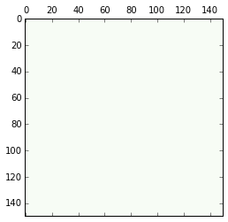
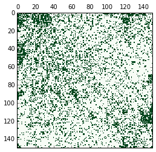
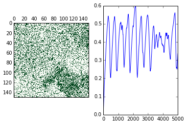
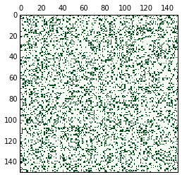
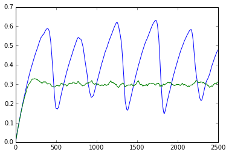
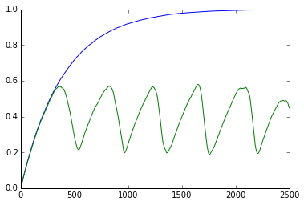
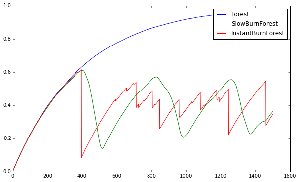
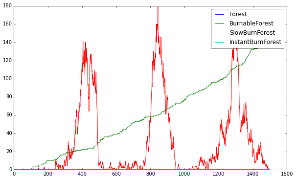

## 简介

### 属性 attributes

属性是与对象绑定的一组数据，可以只读，只写，或者读写，使用时不加括号，例如：


```python
f = file("new_file", 'w')
```

显示模式属性：


```python
f.mode
```


    'w'


是否关闭：


```python
f.closed
```


    False


`mode` 是只读属性，所以这样会报错：


```python
f.mode = 'r'
```


    ---------------------------------------------------------------------------

    TypeError                                 Traceback (most recent call last)

    <ipython-input-4-d9757d46f855> in <module>()
    ----> 1 f.mode = 'r'
    

    TypeError: readonly attribute


获取属性不需要加括号：


```python
f.mode()
```


    ---------------------------------------------------------------------------

    TypeError                                 Traceback (most recent call last)

    <ipython-input-5-6b67c2ae8f67> in <module>()
    ----> 1 f.mode()
    

    TypeError: 'str' object is not callable


###  方法 method

方法是与属性绑定的一组函数，需要使用括号，作用于对象本身：


```python
f.write('Hi.\n')
f.seek(0)
f.write('Hola!\n')
f.close()
```


```python
!rm new_file
```

### 使用 OPP 的原因

- 构建自己的类型来模拟真实世界的对象
- 处理抽象对象
- 容易复用和扩展
- 理解其他 OPP 代码
- GUI 通常使用 OPP 规则编写
- ...
## 使用 OOP 对森林火灾建模


```python
%matplotlib inline

import matplotlib.pyplot as plt
import numpy as np
```

### 对森林建模


```python
class Forest(object):
    def __init__(self, size=(150, 150), p_sapling=0.0025, p_lightning=5.e-6, name=None):
        self.size = size
        self.trees = np.zeros(self.size, dtype=bool)
        self.forest_fires = np.zeros(self.size, dtype=bool)
        self.p_sapling = p_sapling
        self.p_lightning = p_lightning
        if name is not None:
            self.name = name
        else:
            self.name = self.__class__.__name__

    @property
    def num_cells(self):
        return self.size[0] * self.size[1]

    @property
    def tree_fraction(self):
        return self.trees.sum() / float(self.num_cells)

    @property
    def fire_fraction(self):
        return self.forest_fires.sum() / float(self.num_cells)

    def advance_one_step(self):
        self.grow_trees()
        self.start_fires()
        self.burn_trees()

    def grow_trees(self):
        growth_sites = self._rand_bool(self.p_sapling)
        self.trees[growth_sites] = True

    def start_fires(self):
        lightning_strikes = (self._rand_bool(self.p_lightning) & 
            self.trees)
        self.forest_fires[lightning_strikes] = True
        
    def burn_trees(self):
        fires = np.zeros((self.size[0] + 2, self.size[1] + 2), dtype=bool)
        fires[1:-1, 1:-1] = self.forest_fires
        north = fires[:-2, 1:-1]
        south = fires[2:, 1:-1]
        east = fires[1:-1, :-2]
        west = fires[1:-1, 2:]
        new_fires = (north | south | east | west) & self.trees
        self.trees[self.forest_fires] = False
        self.forest_fires = new_fires

    def _rand_bool(self, p):
        return np.random.uniform(size=self.trees.shape) < p
```

定义一个森林类之后，我们创建一个新的森林类对象：


```python
forest = Forest()
```

显示当前的状态：


```python
print forest.trees
```

    [[False False False ..., False False False]
     [False False False ..., False False False]
     [False False False ..., False False False]
     ..., 
     [False False False ..., False False False]
     [False False False ..., False False False]
     [False False False ..., False False False]]


```python
print forest.forest_fires
```

    [[False False False ..., False False False]
     [False False False ..., False False False]
     [False False False ..., False False False]
     ..., 
     [False False False ..., False False False]
     [False False False ..., False False False]
     [False False False ..., False False False]]


使用 `matshow` 进行可视化：


```python
plt.matshow(forest.trees, cmap=plt.cm.Greens)

plt.show()
```


    

    


### 模拟森林生长和火灾的过程

经过一段时间：


```python
forest.advance_one_step()
plt.matshow(forest.trees, cmap=plt.cm.Greens)
plt.show()
```


    

    


循环很长时间：


```python
for i in range(500):
    forest.advance_one_step()
plt.matshow(forest.trees, cmap=plt.cm.Greens)
print forest.tree_fraction
```

    0.253111111111


    

    


迭代更长时间：


```python
forest = Forest()
tree_fractions = []
for i in range(5000):
    forest.advance_one_step()
    tree_fractions.append(forest.tree_fraction)
fig = plt.figure()
ax0 = fig.add_subplot(1,2,1)
ax0.matshow(forest.trees, cmap=plt.cm.Greens)
ax1 = fig.add_subplot(1,2,2)
ax1.plot(tree_fractions)

plt.show()
```


    

    

## 什么是对象？

在 `Python` 中，几乎所有的东西都是对象。

整数是对象：


```python
a = 257
```


```python
type(a)
```


    int


```python
id(a)
```


    53187032L


`b` 和 `a` 是同一个对象：


```python
b = a
```


```python
id(b)
```


    53187032L


```python
c = 258
id(c)
```


    53186960L


函数：


```python
def foo():
    print 'hi'
```


```python
type(foo)
```


    function


```python
id(foo)
```


    63632664L


`type` 函数本身也是对象：


```python
type(type)
```


    type


```python
id(type)
```


    506070640L


只有一些保留的关键词不是对象：


```python
id(if)
```


      File "<ipython-input-12-1e0d1307109a>", line 1
        id(if)
            ^
    SyntaxError: invalid syntax


```python
id(+)
```


      File "<ipython-input-13-86853fe3c6fd>", line 1
        id(+)
            ^
    SyntaxError: invalid syntax


## 定义 class

### 基本形式

`class` 定义如下：
```python
class ClassName(ParentClass):
    """class docstring"""
    def method(self):
        return
```

- `class` 关键词在最前面
- `ClassName` 通常采用 `CamelCase` 记法
- 括号中的 `ParentClass` 用来表示继承关系
- 冒号不能缺少
- `""""""` 中的内容表示 `docstring`，可以省略
- 方法定义与函数定义十分类似，不过多了一个 `self` 参数表示这个对象本身
- `class` 中的方法要进行缩进


```
class Forest(object):
    """ Forest can grow trees which eventually die."""
    pass
```

其中 `object` 是最基本的类型。

查看帮助：


```
import numpy as np
np.info(Forest)
```

     Forest()
    
    Forest can grow trees which eventually die.
    
    
    Methods:
    


```
forest = Forest()
```


```
forest
```


    <__main__.Forest at 0x3cda358>


### 添加方法和属性

可以直接添加属性（有更好的替代方式）：


```
forest.trees = np.zeros((150, 150), dtype=bool)
```


```
forest.trees
```


    array([[False, False, False, ..., False, False, False],
           [False, False, False, ..., False, False, False],
           [False, False, False, ..., False, False, False],
           ..., 
           [False, False, False, ..., False, False, False],
           [False, False, False, ..., False, False, False],
           [False, False, False, ..., False, False, False]], dtype=bool)


```
forest2 = Forest()
```

`forest2` 没有这个属性：


```
forest2.trees
```


    ---------------------------------------------------------------------------

    AttributeError                            Traceback (most recent call last)

    <ipython-input-8-42e6a9d57a8b> in <module>()
    ----> 1 forest2.trees
    

    AttributeError: 'Forest' object has no attribute 'trees'


添加方法时，默认第一个参数是对象本身，一般为 `self`，可能用到也可能用不到，然后才是其他的参数：


```
class Forest(object):
    """ Forest can grow trees which eventually die."""
    def grow(self):
        print "the tree is growing!"
        
    def number(self, num=1):
        if num == 1:
            print 'there is 1 tree.'
        else:
            print 'there are', num, 'trees.'
```


```
forest = Forest()

forest.grow()
forest.number(12)
```

    the tree is growing!
    there are 12 trees.

## 特殊方法

**Python** 使用 `__` 开头的名字来定义特殊的方法和属性，它们有：

- `__init__()`
- `__repr__()`
- `__str__()`
- `__call__()`
- `__iter__()`
- `__add__()`
- `__sub__()`
- `__mul__()`
- `__rmul__()`
- `__class__`
- `__name__`

### 构造方法 `__init__()`

之前说到，在产生对象之后，我们可以向对象中添加属性。事实上，还可以通过构造方法，在构造对象的时候直接添加属性：


```python
class Leaf(object):
    """
    A leaf falling in the woods.
    """
    def __init__(self, color='green'):
        self.color = color
```

默认属性值：


```python
leaf1 = Leaf()

print leaf1.color
```

    green


传入有参数的值：


```python
leaf2 = Leaf('orange')

print leaf2.color
```

    orange


回到森林的例子：


```python
import numpy as np

class Forest(object):
    """ Forest can grow trees which eventually die."""
    def __init__(self):
        self.trees = np.zeros((150,150), dtype=bool)
        self.fires = np.zeros((150,150), dtype=bool)
```

我们在构造方法中定义了两个属性 `trees` 和 `fires`：


```python
forest = Forest()

forest.trees
```


    array([[False, False, False, ..., False, False, False],
           [False, False, False, ..., False, False, False],
           [False, False, False, ..., False, False, False],
           ..., 
           [False, False, False, ..., False, False, False],
           [False, False, False, ..., False, False, False],
           [False, False, False, ..., False, False, False]], dtype=bool)


```python
forest.fires
```


    array([[False, False, False, ..., False, False, False],
           [False, False, False, ..., False, False, False],
           [False, False, False, ..., False, False, False],
           ..., 
           [False, False, False, ..., False, False, False],
           [False, False, False, ..., False, False, False],
           [False, False, False, ..., False, False, False]], dtype=bool)


修改属性的值：


```python
forest.trees[0,0]=True
forest.trees
```


    array([[ True, False, False, ..., False, False, False],
           [False, False, False, ..., False, False, False],
           [False, False, False, ..., False, False, False],
           ..., 
           [False, False, False, ..., False, False, False],
           [False, False, False, ..., False, False, False],
           [False, False, False, ..., False, False, False]], dtype=bool)


改变它的属性值不会影响其他对象的属性值：


```python
forest2 = Forest()

forest2.trees
```


    array([[False, False, False, ..., False, False, False],
           [False, False, False, ..., False, False, False],
           [False, False, False, ..., False, False, False],
           ..., 
           [False, False, False, ..., False, False, False],
           [False, False, False, ..., False, False, False],
           [False, False, False, ..., False, False, False]], dtype=bool)


事实上，`__new__()` 才是真正产生新对象的方法，`__init__()` 只是对对象进行了初始化，所以：

```python
leaf = Leaf()
```

相当于

```python
my_new_leaf = Leaf.__new__(Leaf)
Leaf.__init__(my_new_leaf)
leaf = my_new_leaf
```

### 表示方法 `__repr__()` 和 `__str__()`


```python
class Leaf(object):
    """
    A leaf falling in the woods.
    """
    def __init__(self, color='green'):
        self.color = color
    def __str__(self):
        "This is the string that is printed."
        return "A {} leaf".format(self.color)
    def __repr__(self):
        "This string recreates the object."
        return "{}(color='{}')".format(self.__class__.__name__, self.color)
```

`__str__()` 是使用 `print` 函数显示的结果：


```python
leaf = Leaf()

print leaf
```

    A green leaf


`__repr__()` 返回的是不使用 `print` 方法的结果：


```python
leaf
```


    Leaf(color='green')


回到森林的例子：


```python
import numpy as np

class Forest(object):
    """ Forest can grow trees which eventually die."""
    def __init__(self, size=(150,150)):
        self.size = size
        self.trees = np.zeros(self.size, dtype=bool)
        self.fires = np.zeros((self.size), dtype=bool)
        
    def __repr__(self):
        my_repr = "{}(size={})".format(self.__class__.__name__, self.size)
        return my_repr
    
    def __str__(self):
        return self.__class__.__name__
```


```python
forest = Forest()
```

`__str__()` 方法：


```python
print forest
```

    Forest


`__repr__()` 方法：


```python
forest
```


    Forest(size=(150, 150))


`__name__` 和 `__class__` 为特殊的属性：


```python
forest.__class__
```


    __main__.Forest


```python
forest.__class__.__name__
```


    'Forest'


## 属性

### 只读属性

只读属性，顾名思义，指的是只可读不可写的属性，之前我们定义的属性都是可读可写的，对于只读属性，我们需要使用 `@property` 修饰符来得到：


```python
class Leaf(object):
    def __init__(self, mass_mg):
        self.mass_mg = mass_mg
    
    ## 这样 mass_oz 就变成属性了
    @property
    def mass_oz(self):
        return self.mass_mg * 3.53e-5
```

这里 `mass_oz` 就是一个只读不写的属性（注意是属性不是方法），而 `mass_mg` 是可读写的属性：


```python
leaf = Leaf(200)

print leaf.mass_oz
```

    0.00706


可以修改 `mass_mg` 属性来改变 `mass_oz`：


```python
leaf.mass_mg = 150

print leaf.mass_oz
```

    0.005295


是属性不是方法：


```python
leaf.mass_oz()
```


    ---------------------------------------------------------------------------

    TypeError                                 Traceback (most recent call last)

    <ipython-input-4-aac6717ebc82> in <module>()
    ----> 1 leaf.mass_oz()
    

    TypeError: 'float' object is not callable


而且是只读属性，不可写：


```python
leaf.mass_oz = 0.001
```


    ---------------------------------------------------------------------------

    AttributeError                            Traceback (most recent call last)

    <ipython-input-5-d232052cd2dc> in <module>()
    ----> 1 leaf.mass_oz = 0.001
    

    AttributeError: can't set attribute


回到 `forest` 的例子，我们希望加入几个只读属性：


```python
import numpy as np

class Forest(object):
    """ Forest can grow trees which eventually die."""
    def __init__(self, size=(150,150)):
        self.size = size
        self.trees = np.zeros(self.size, dtype=bool)
        self.fires = np.zeros((self.size), dtype=bool)
        
    def __repr__(self):
        my_repr = "{}(size={})".format(self.__class__.__name__, self.size)
        return my_repr
    
    def __str__(self):
        return self.__class__.__name__
    
    @property
    def num_cells(self):
        """Number of cells available for growing trees"""
        return np.prod(self.size)
    
    @property
    def tree_fraction(self):
        """
        Fraction of trees
        """
        num_trees = self.trees.sum()
        return float(num_trees) / self.num_cells
    
    @property
    def fire_fraction(self):
        """
        Fraction of fires
        """
        num_fires = self.fires.sum()
        return float(num_fires) / self.num_cells
```

查看属性：


```python
forest = Forest()

forest.num_cells
```


    22500


生成一个较小的森林：


```python
small_forest = Forest((10, 10))
small_forest.num_cells
```


    100


初始状态下，树和火灾的比例都是 0：


```python
small_forest.tree_fraction
```


    0.0


```python
small_forest.fire_fraction
```


    0.0


### 可读写的属性

对于 `@property` 生成的只读属性，我们可以使用相应的 `@attr.setter` 修饰符来使得这个属性变成可写的：


```python
class Leaf(object):
    def __init__(self, mass_mg):
        self.mass_mg = mass_mg
    
    ## 这样 mass_oz 就变成属性了
    @property
    def mass_oz(self):
        return self.mass_mg * 3.53e-5
    
    ## 使用 mass_oz.setter 修饰符
    @mass_oz.setter
    def mass_oz(self, m_oz):
        self.mass_mg = m_oz / 3.53e-5
```

测试：


```python
leaf = Leaf(200)
print leaf.mass_oz

leaf.mass_mg = 150
print leaf.mass_oz
```

    0.00706
    0.005295


修改 `mass_oz` 属性：


```python
leaf.mass_oz = 0.01
print leaf.mass_mg
```

    283.28611898


一个等价的替代如下：

```python
class Leaf(object):
    def __init__(self, mass_mg):
        self.mass_mg = mass_mg
    
    def get_mass_oz(self):
        return self.mass_mg * 3.53e-5
    
    def set_mass_oz(self, m_oz):
        self.mass_mg = m_oz / 3.53e-5
        
    mass_oz = property(get_mass_oz, set_mass_oz)
```
## 森林火灾模拟

之前我们已经构建好了一些基础，但是还没有开始对火灾进行模拟。

### 随机生长

- 在原来的基础上,我们要先让树生长，即定义 `grow_trees()` 方法
- 定义方法之前，我们要先指定两个属性：
    - 每个位置随机生长出树木的概率
    - 每个位置随机被闪电击中的概率
- 为了方便，我们定义一个辅助函数来生成随机 `bool` 矩阵，大小与森林大小一致
- 按照给定的生长概率生成生长的位置，将 `trees` 中相应位置设为 `True`


```python
import numpy as np

class Forest(object):
    """ Forest can grow trees which eventually die."""
    def __init__(self, size=(150,150), p_sapling=0.0025, p_lightning=5.0e-6):
        self.size = size
        self.trees = np.zeros(self.size, dtype=bool)
        self.fires = np.zeros((self.size), dtype=bool)
        self.p_sapling = p_sapling
        self.p_lightning = p_lightning
        
    def __repr__(self):
        my_repr = "{}(size={})".format(self.__class__.__name__, self.size)
        return my_repr
    
    def __str__(self):
        return self.__class__.__name__
    
    @property
    def num_cells(self):
        """Number of cells available for growing trees"""
        return np.prod(self.size)
    
    @property
    def tree_fraction(self):
        """
        Fraction of trees
        """
        num_trees = self.trees.sum()
        return float(num_trees) / self.num_cells
    
    @property
    def fire_fraction(self):
        """
        Fraction of fires
        """
        num_fires = self.fires.sum()
        return float(num_fires) / self.num_cells
    
    def _rand_bool(self, p):
        """
        Random boolean distributed according to p, less than p will be True
        """
        return np.random.uniform(size=self.trees.shape) < p
    
    def grow_trees(self):
        """
        Growing trees.
        """
        growth_sites = self._rand_bool(self.p_sapling)
        self.trees[growth_sites] = True
```

测试：


```python
forest = Forest()
print forest.tree_fraction

forest.grow_trees()
print forest.tree_fraction
```

    0.0
    0.00293333333333


### 火灾模拟

- 定义 `start_fires()`：
    - 按照给定的概率生成被闪电击中的位置
    - 如果闪电击中的位置有树，那么将其设为着火点
- 定义 `burn_trees()`：
    - 如果一棵树的上下左右有火，那么这棵树也会着火
- 定义 `advance_one_step()`：
    - 进行一次生长，起火，燃烧


```python
import numpy as np

class Forest(object):
    """ Forest can grow trees which eventually die."""
    def __init__(self, size=(150,150), p_sapling=0.0025, p_lightning=5.0e-6):
        self.size = size
        self.trees = np.zeros(self.size, dtype=bool)
        self.fires = np.zeros((self.size), dtype=bool)
        self.p_sapling = p_sapling
        self.p_lightning = p_lightning
        
    def __repr__(self):
        my_repr = "{}(size={})".format(self.__class__.__name__, self.size)
        return my_repr
    
    def __str__(self):
        return self.__class__.__name__
    
    @property
    def num_cells(self):
        """Number of cells available for growing trees"""
        return np.prod(self.size)
    
    @property
    def tree_fraction(self):
        """
        Fraction of trees
        """
        num_trees = self.trees.sum()
        return float(num_trees) / self.num_cells
    
    @property
    def fire_fraction(self):
        """
        Fraction of fires
        """
        num_fires = self.fires.sum()
        return float(num_fires) / self.num_cells
    
    def _rand_bool(self, p):
        """
        Random boolean distributed according to p, less than p will be True
        """
        return np.random.uniform(size=self.trees.shape) < p
    
    def grow_trees(self):
        """
        Growing trees.
        """
        growth_sites = self._rand_bool(self.p_sapling)
        self.trees[growth_sites] = True
        
    def start_fires(self):
        """
        Start of fire.
        """
        lightning_strikes = (self._rand_bool(self.p_lightning) & 
            self.trees)
        self.fires[lightning_strikes] = True
    
    def burn_trees(self):
        """
        Burn trees.
        """
        fires = np.zeros((self.size[0] + 2, self.size[1] + 2), dtype=bool)
        fires[1:-1, 1:-1] = self.fires
        north = fires[:-2, 1:-1]
        south = fires[2:, 1:-1]
        east = fires[1:-1, :-2]
        west = fires[1:-1, 2:]
        new_fires = (north | south | east | west) & self.trees
        self.trees[self.fires] = False
        self.fires = new_fires
        
    def advance_one_step(self):
        """
        Advance one step
        """
        self.grow_trees()
        self.start_fires()
        self.burn_trees()
```


```python
forest = Forest()

for i in range(100):
    forest.advance_one_step()
```

使用 `matshow()` 显示树木图像：


```python
import matplotlib.pyplot as plt
from matplotlib import cm

%matplotlib inline

plt.matshow(forest.trees, cmap=cm.Greens)

plt.show()
```


    

    


查看不同着火概率下的森林覆盖率趋势变化：


```python
forest = Forest()
forest2 = Forest(p_lightning=5e-4)

tree_fractions = []

for i in range(2500):
    forest.advance_one_step()
    forest2.advance_one_step()
    tree_fractions.append((forest.tree_fraction, forest2.tree_fraction))

plt.plot(tree_fractions)

plt.show()
```


    

    

## 继承

一个类定义的基本形式如下：
```python
class ClassName(ParentClass):
    """class docstring"""
    def method(self):
        return
```

- `class` 关键词在最前面
- `ClassName` 通常采用 `CamelCase` 记法
- 括号中的 `ParentClass` 用来表示继承关系
- 冒号不能缺少
- `""""""` 中的内容表示 `docstring`，可以省略
- 方法定义与函数定义十分类似，不过多了一个 `self` 参数表示这个对象本身
- `class` 中的方法要进行缩进

在里面有一个 `ParentClass` 项，用来进行继承，被继承的类是父类，定义的这个类是子类。
对于子类来说，继承意味着它可以使用所有父类的方法和属性，同时还可以定义自己特殊的方法和属性。

假设我们有这样一个父类：


```python
class Leaf(object):
    def __init__(self, color="green"):
        self.color = color
    def fall(self):
        print "Splat!"
```

测试：


```python
leaf = Leaf()

print leaf.color
```

    green


```python
leaf.fall()
```

    Splat!


现在定义一个子类，继承自 `Leaf`：


```python
class MapleLeaf(Leaf):
    def change_color(self):
        if self.color == "green":
            self.color = "red"
```

继承父类的所有方法：


```python
mleaf = MapleLeaf()

print mleaf.color
```

    green


```python
mleaf.fall()
```

    Splat!


但是有自己独有的方法，父类中没有：


```python
mleaf.change_color()

print mleaf.color
```

    red


如果想对父类的方法进行修改，只需要在子类中重定义这个类即可：


```python
class MapleLeaf(Leaf):
    def change_color(self):
        if self.color == "green":
            self.color = "red"
    def fall(self):
        self.change_color()
        print "Plunk!"
```


```python
mleaf = MapleLeaf()

print mleaf.color
mleaf.fall()
print mleaf.color
```

    green
    Plunk!
    red

## super() 函数

    super(CurrentClassName, instance)
    
返回该类实例对应的父类对象。


```python
class Leaf(object):
    def __init__(self, color="green"):
        self.color = color
    def fall(self):
        print "Splat!"

class MapleLeaf(Leaf):
    def change_color(self):
        if self.color == "green":
            self.color = "red"
    def fall(self):
        self.change_color()
        super(MapleLeaf, self).fall()
```

这里，我们先改变树叶的颜色，然后再找到这个实例对应的父类，并调用父类的 `fall()` 方法：


```python
mleaf = MapleLeaf()

print mleaf.color
mleaf.fall()
print mleaf.color
```

    green
    Splat!
    red


回到我们的森林例子，这里我们将森林 `Forest` 作为父类，并定义一个子类 `BurnableForest`：


```python
import numpy as np

class Forest(object):
    """ Forest can grow trees which eventually die."""
    def __init__(self, size=(150,150), p_sapling=0.0025):
        self.size = size
        self.trees = np.zeros(self.size, dtype=bool)
        self.p_sapling = p_sapling
        
    def __repr__(self):
        my_repr = "{}(size={})".format(self.__class__.__name__, self.size)
        return my_repr
    
    def __str__(self):
        return self.__class__.__name__
    
    @property
    def num_cells(self):
        """Number of cells available for growing trees"""
        return np.prod(self.size)
    
    @property
    def tree_fraction(self):
        """
        Fraction of trees
        """
        num_trees = self.trees.sum()
        return float(num_trees) / self.num_cells
    
    def _rand_bool(self, p):
        """
        Random boolean distributed according to p, less than p will be True
        """
        return np.random.uniform(size=self.trees.shape) < p
    
    def grow_trees(self):
        """
        Growing trees.
        """
        growth_sites = self._rand_bool(self.p_sapling)
        self.trees[growth_sites] = True    
        
    def advance_one_step(self):
        """
        Advance one step
        """
        self.grow_trees()
```

- 将与燃烧相关的属性都被转移到了子类中去。
- 修改两类的构造方法，将闪电概率放到子类的构造方法上，同时在子类的构造方法中，用 `super` 调用父类的构造方法。
- 修改 `advance_one_step()`，父类中只进行生长，在子类中用 `super` 调用父类的 `advance_one_step()` 方法，并添加燃烧的部分。


```python
class BurnableForest(Forest):
    """
    Burnable forest support fires
    """    
    def __init__(self, p_lightning=5.0e-6, **kwargs):
        super(BurnableForest, self).__init__(**kwargs)
        self.p_lightning = p_lightning        
        self.fires = np.zeros((self.size), dtype=bool)
    
    def advance_one_step(self):
        """
        Advance one step
        """
        super(BurnableForest, self).advance_one_step()
        self.start_fires()
        self.burn_trees()
        
    @property
    def fire_fraction(self):
        """
        Fraction of fires
        """
        num_fires = self.fires.sum()
        return float(num_fires) / self.num_cells
    
    def start_fires(self):
        """
        Start of fire.
        """
        lightning_strikes = (self._rand_bool(self.p_lightning) & 
            self.trees)
        self.fires[lightning_strikes] = True
        
    def burn_trees(self):
        """
        Burn trees.
        """
        fires = np.zeros((self.size[0] + 2, self.size[1] + 2), dtype=bool)
        fires[1:-1, 1:-1] = self.fires
        north = fires[:-2, 1:-1]
        south = fires[2:, 1:-1]
        east = fires[1:-1, :-2]
        west = fires[1:-1, 2:]
        new_fires = (north | south | east | west) & self.trees
        self.trees[self.fires] = False
        self.fires = new_fires
```

测试父类：


```python
forest = Forest()

forest.grow_trees()

print forest.tree_fraction
```

    0.00284444444444


测试子类：


```python
burnable_forest = BurnableForest()
```

调用自己和父类的方法：


```python
burnable_forest.grow_trees()
burnable_forest.start_fires()
burnable_forest.burn_trees()
print burnable_forest.tree_fraction
```

    0.00235555555556


查看变化：


```python
import matplotlib.pyplot as plt

%matplotlib inline

forest = Forest()
forest2 = BurnableForest()

tree_fractions = []

for i in range(2500):
    forest.advance_one_step()
    forest2.advance_one_step()
    tree_fractions.append((forest.tree_fraction, forest2.tree_fraction))

plt.plot(tree_fractions)

plt.show()
```


    

    


`__str__` 和 `__repr__` 中 `self.__class__` 会根据类型不同而不同：


```python
forest
```


    Forest(size=(150, 150))


```python
forest2
```


    BurnableForest(size=(150, 150))


```python
print forest
```

    Forest


```python
print forest2
```

    BurnableForest

## 重定义森林火灾模拟

在前面的例子中，我们定义了一个 `BurnableForest`，实现了一个循序渐进的生长和燃烧过程。

假设我们现在想要定义一个立即燃烧的过程（每次着火之后燃烧到不能燃烧为止，之后再生长，而不是每次只燃烧周围的一圈树木），由于燃烧过程不同，我们需要从 `BurnableForest` 中派生出两个新的子类 `SlowBurnForest`（原来的燃烧过程） 和 `InsantBurnForest`，为此

- 将 `BurnableForest` 中的 `burn_trees()` 方法改写，不做任何操作，直接 `pass`（因为在 `advance_one_step()` 中调用了它，所以不能直接去掉）
- 在两个子类中定义新的 `burn_trees()` 方法。


```python
import numpy as np
from scipy.ndimage.measurements import label

class Forest(object):
    """ Forest can grow trees which eventually die."""
    def __init__(self, size=(150,150), p_sapling=0.0025):
        self.size = size
        self.trees = np.zeros(self.size, dtype=bool)
        self.p_sapling = p_sapling
        
    def __repr__(self):
        my_repr = "{}(size={})".format(self.__class__.__name__, self.size)
        return my_repr
    
    def __str__(self):
        return self.__class__.__name__
    
    @property
    def num_cells(self):
        """Number of cells available for growing trees"""
        return np.prod(self.size)
    
    @property
    def tree_fraction(self):
        """
        Fraction of trees
        """
        num_trees = self.trees.sum()
        return float(num_trees) / self.num_cells
    
    def _rand_bool(self, p):
        """
        Random boolean distributed according to p, less than p will be True
        """
        return np.random.uniform(size=self.trees.shape) < p
    
    def grow_trees(self):
        """
        Growing trees.
        """
        growth_sites = self._rand_bool(self.p_sapling)
        self.trees[growth_sites] = True    
        
    def advance_one_step(self):
        """
        Advance one step
        """
        self.grow_trees()

class BurnableForest(Forest):
    """
    Burnable forest support fires
    """    
    def __init__(self, p_lightning=5.0e-6, **kwargs):
        super(BurnableForest, self).__init__(**kwargs)
        self.p_lightning = p_lightning        
        self.fires = np.zeros((self.size), dtype=bool)
    
    def advance_one_step(self):
        """
        Advance one step
        """
        super(BurnableForest, self).advance_one_step()
        self.start_fires()
        self.burn_trees()
        
    @property
    def fire_fraction(self):
        """
        Fraction of fires
        """
        num_fires = self.fires.sum()
        return float(num_fires) / self.num_cells
    
    def start_fires(self):
        """
        Start of fire.
        """
        lightning_strikes = (self._rand_bool(self.p_lightning) & 
            self.trees)
        self.fires[lightning_strikes] = True
    
    def burn_trees(self):    
        pass
    
class SlowBurnForest(BurnableForest):
    def burn_trees(self):
        """
        Burn trees.
        """
        fires = np.zeros((self.size[0] + 2, self.size[1] + 2), dtype=bool)
        fires[1:-1, 1:-1] = self.fires
        north = fires[:-2, 1:-1]
        south = fires[2:, 1:-1]
        east = fires[1:-1, :-2]
        west = fires[1:-1, 2:]
        new_fires = (north | south | east | west) & self.trees
        self.trees[self.fires] = False
        self.fires = new_fires

class InstantBurnForest(BurnableForest):
    def burn_trees(self):
        ## 起火点
        strikes = self.fires
        ## 找到连通区域
        groves, num_groves = label(self.trees)
        fires = set(groves[strikes])
        self.fires.fill(False)
        ## 将与着火点相连的区域都烧掉
        for fire in fires:
            self.fires[groves == fire] = True
        self.trees[self.fires] = False
        self.fires.fill(False)
```

测试：


```python
forest = Forest()
sb_forest = SlowBurnForest()
ib_forest = InstantBurnForest()

forests = [forest, sb_forest, ib_forest]

tree_history = []

for i in xrange(1500):
    for fst in forests:
        fst.advance_one_step()
    tree_history.append(tuple(fst.tree_fraction for fst in forests))
```

显示结果：


```python
import matplotlib.pyplot as plt
%matplotlib inline

plt.figure(figsize=(10,6))

plt.plot(tree_history)
plt.legend([f.__str__() for f in forests])

plt.show()
```


    

    

## 接口

在 `Python` 中，鸭子类型（`duck typing`）是一种动态类型的风格。所谓鸭子类型，来自于 `James Whitcomb Riley` 的“鸭子测试”：

> 当看到一只鸟走起来像鸭子、游泳起来像鸭子、叫起来也像鸭子，那么这只鸟就可以被称为鸭子。

假设我们需要定义一个函数，这个函数使用一个类型为鸭子的参数，并调用它的走和叫方法。

在鸭子类型的语言中，这样的函数可以接受任何类型的对象，只要这个对象实现了走和叫的方法，否则就引发一个运行时错误。换句话说，任何拥有走和叫方法的参数都是合法的。

先看一个例子，父类：


```python
class Leaf(object):
    def __init__(self, color="green"):
        self.color = color
    def fall(self):
        print "Splat!"
```

子类：


```python
class MapleLeaf(Leaf):
    def fall(self):
        self.color = 'brown'
        super(MapleLeaf, self).fall()
```

新的类：


```python
class Acorn(object):
    def fall(self):
        print "Plunk!"
```

这三个类都实现了 `fall()` 方法，因此可以这样使用：


```python
objects = [Leaf(), MapleLeaf(), Acorn()]

for obj in objects:
    obj.fall()
```

    Splat!
    Splat!
    Plunk!


这里 `fall()` 方法就一种鸭子类型的体现。

不仅方法可以用鸭子类型，属性也可以：


```python
import numpy as np
from scipy.ndimage.measurements import label

class Forest(object):
    """ Forest can grow trees which eventually die."""
    def __init__(self, size=(150,150), p_sapling=0.0025):
        self.size = size
        self.trees = np.zeros(self.size, dtype=bool)
        self.p_sapling = p_sapling
        
    def __repr__(self):
        my_repr = "{}(size={})".format(self.__class__.__name__, self.size)
        return my_repr
    
    def __str__(self):
        return self.__class__.__name__
    
    @property
    def num_cells(self):
        """Number of cells available for growing trees"""
        return np.prod(self.size)
    
    @property
    def losses(self):
        return np.zeros(self.size)
    
    @property
    def tree_fraction(self):
        """
        Fraction of trees
        """
        num_trees = self.trees.sum()
        return float(num_trees) / self.num_cells
    
    def _rand_bool(self, p):
        """
        Random boolean distributed according to p, less than p will be True
        """
        return np.random.uniform(size=self.trees.shape) < p
    
    def grow_trees(self):
        """
        Growing trees.
        """
        growth_sites = self._rand_bool(self.p_sapling)
        self.trees[growth_sites] = True    
        
    def advance_one_step(self):
        """
        Advance one step
        """
        self.grow_trees()

class BurnableForest(Forest):
    """
    Burnable forest support fires
    """    
    def __init__(self, p_lightning=5.0e-6, **kwargs):
        super(BurnableForest, self).__init__(**kwargs)
        self.p_lightning = p_lightning        
        self.fires = np.zeros((self.size), dtype=bool)
    
    def advance_one_step(self):
        """
        Advance one step
        """
        super(BurnableForest, self).advance_one_step()
        self.start_fires()
        self.burn_trees()
    
    @property
    def losses(self):
        return self.fires
    
    @property
    def fire_fraction(self):
        """
        Fraction of fires
        """
        num_fires = self.fires.sum()
        return float(num_fires) / self.num_cells
    
    def start_fires(self):
        """
        Start of fire.
        """
        lightning_strikes = (self._rand_bool(self.p_lightning) & 
            self.trees)
        self.fires[lightning_strikes] = True
    
    def burn_trees(self):    
        pass
    
class SlowBurnForest(BurnableForest):
    def burn_trees(self):
        """
        Burn trees.
        """
        fires = np.zeros((self.size[0] + 2, self.size[1] + 2), dtype=bool)
        fires[1:-1, 1:-1] = self.fires
        north = fires[:-2, 1:-1]
        south = fires[2:, 1:-1]
        east = fires[1:-1, :-2]
        west = fires[1:-1, 2:]
        new_fires = (north | south | east | west) & self.trees
        self.trees[self.fires] = False
        self.fires = new_fires

class InstantBurnForest(BurnableForest):
    def burn_trees(self):
        ## 起火点
        strikes = self.fires
        ## 找到连通区域
        groves, num_groves = label(self.trees)
        fires = set(groves[strikes])
        self.fires.fill(False)
        ## 将与着火点相连的区域都烧掉
        for fire in fires:
            self.fires[groves == fire] = True
        self.trees[self.fires] = False
        self.fires.fill(False)
```

测试：


```python
forest = Forest()
b_forest = BurnableForest()
sb_forest = SlowBurnForest()
ib_forest = InstantBurnForest()

forests = [forest, b_forest, sb_forest, ib_forest]

losses_history = []

for i in xrange(1500):
    for fst in forests:
        fst.advance_one_step()
    losses_history.append(tuple(fst.losses.sum() for fst in forests))
```

显示结果：


```python
import matplotlib.pyplot as plt
%matplotlib inline

plt.figure(figsize=(10,6))

plt.plot(losses_history)
plt.legend([f.__str__() for f in forests])

plt.show()
```


    

    

## 共有，私有和特殊方法和属性

- 我们之前已经见过 `special` 方法和属性，即以 `__` 开头和结尾的方法和属性
- 私有方法和属性，以 `_` 开头，不过不是真正私有，而是可以调用的，但是不会被代码自动完成所记录（即 Tab 键之后不会显示）
- 其他都是共有的方法和属性
- 以 `__` 开头不以 `__` 结尾的属性是更加特殊的方法，调用方式也不同：


```python
class MyClass(object):
    def __init__(self):
        print "I'm special!"
    def _private(self):
        print "I'm private!"
    def public(self):
        print "I'm public!"
    def __really_special(self):
        print "I'm really special!"
```


```python
m = MyClass()
```

    I'm special!


```python
m.public()
```

    I'm public!


```python
m._private()
```

    I'm private!


注意调用方式：


```python
m._MyClass__really_special()
```

    I'm really special!

## 多重继承

多重继承，指的是一个类别可以同时从多于一个父类继承行为与特征的功能，`Python` 是支持多重继承的：


```python
class Leaf(object):
    def __init__(self, color='green'):
        self.color = color

class ColorChangingLeaf(Leaf):
    def change(self, new_color='brown'):
        self.color = new_color

class DeciduousLeaf(Leaf):
    def fall(self):
        print "Plunk!"

class MapleLeaf(ColorChangingLeaf, DeciduousLeaf):
    pass
```

在上面的例子中， `MapleLeaf` 就使用了多重继承，它可以使用两个父类的方法：


```python
leaf = MapleLeaf()

leaf.change("yellow")
print leaf.color

leaf.fall()
```

    yellow
    Plunk!


如果同时实现了不同的接口，那么，最后使用的方法以继承的顺序为准，放在前面的优先继承：


```python
class Leaf(object):
    def __init__(self, color='green'):
        self.color = color

class ColorChangingLeaf(Leaf):
    def change(self, new_color='brown'):
        self.color = new_color    
    def fall(self):
        print "Spalt!"

class DeciduousLeaf(Leaf):
    def fall(self):
        print "Plunk!"

class MapleLeaf(ColorChangingLeaf, DeciduousLeaf):
    pass
```


```python
leaf = MapleLeaf()
leaf.fall()
```

    Spalt!


```python
class MapleLeaf(DeciduousLeaf, ColorChangingLeaf):
    pass
```


```python
leaf = MapleLeaf()
leaf.fall()
```

    Plunk!


事实上，这个顺序可以通过该类的 `__mro__` 属性或者 `mro()` 方法来查看：


```python
MapleLeaf.__mro__
```


    (__main__.MapleLeaf,
     __main__.DeciduousLeaf,
     __main__.ColorChangingLeaf,
     __main__.Leaf,
     object)


```python
MapleLeaf.mro()
```


    [__main__.MapleLeaf,
     __main__.DeciduousLeaf,
     __main__.ColorChangingLeaf,
     __main__.Leaf,
     object]


考虑更复杂的例子：


```python
class A(object):
    pass

class B(A):
    pass

class C(A):
    pass

class C1(C):
    pass

class B1(B):
    pass

class D(B1, C):
    pass
```

调用顺序：


```python
D.mro()
```


    [__main__.D, __main__.B1, __main__.B, __main__.C, __main__.A, object]


