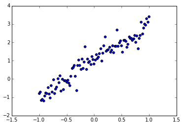
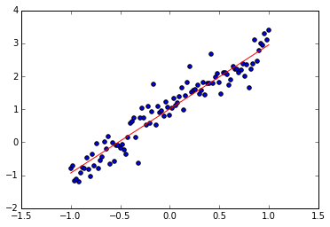
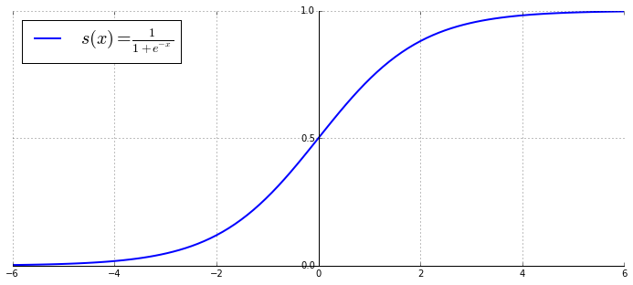

# Theano 简介及其安装

# 简介

`Theano` 是一个 `Python` 科学计算库，允许我们进行符号运算，并在 `CPU` 和 `GPU` 上执行。

它最初由 `Montreal` 大学的机器学习研究者们所开发，用来进行机器学习的计算。

按照[官网](http://deeplearning.net/software/theano/)上的说明，它拥有以下几个方面的特点：

- 与 **Numpy, Scipy** 的紧密结合
- **GPU** 加速
- 高效的符号计算
- 速度和稳定性
- 动态生成 **C** 代码

## 使用 anaconda 安装 theano

`windows` 下，使用 `anaconda` 安装 `theano` 的命令为：

    conda install mingw libpython
    pip install theano
    
`linux` 下，使用 `anaconda` 安装的命令为
    
    conda install theano

安装好之后，还需要安装 `Cuda` 并进行 `GPU` 环境的配置，否则是不能利用 `GPU` 进行计算的，推荐使用 `linux/mac` 进行配置，具体方法可以参考[官网](http://deeplearning.net/software/theano/)上的配置说明。

查看安装的版本：


```python
import theano

theano.__version__
```


    '0.7.0.dev-54186290a97186b9c6b76317e007844529a352f4'


查看当前使用的 device：


```python
theano.config.device
```


    'cpu'


运行测试：


```python
theano.test()
```

    /usr/local/lib/python2.7/dist-packages/theano/misc/pycuda_init.py:34: UserWarning: PyCUDA import failed in theano.misc.pycuda_init
      warnings.warn("PyCUDA import failed in theano.misc.pycuda_init")
    ....................S...............

    Theano version 0.7.0.dev-54186290a97186b9c6b76317e007844529a352f4
    theano is installed in /usr/local/lib/python2.7/dist-packages/theano
    NumPy version 1.10.1
    NumPy relaxed strides checking option: True
    NumPy is installed in /usr/lib/python2.7/dist-packages/numpy
    Python version 2.7.6 (default, Jun 22 2015, 17:58:13) [GCC 4.8.2]
    nose version 1.3.7


    
    ----------------------------------------------------------------------
    Ran 37 tests in 37.919s
    
    OK (SKIP=1)


    <nose.result.TextTestResult run=37 errors=0 failures=0>


这里我已经在本地 `Windows` 配好了 `GPU` 的设置，如果没有配好，显示的结果可能不一样。

`Windows` 下第一次运行可能会显示 `DEBUG: nvcc STDOUT` 等内容，**`Just ignore it!`**
# Theano 基础


```python
%matplotlib inline
import numpy as np
import matplotlib.pyplot as plt
```

首先导入 `theano` 及其 `tensor` 子模块（`tensor`，张量）：


```python
import theano

# 一般都把 `tensor` 子模块导入并命名为 T
import theano.tensor as T
```

    Using gpu device 1: Tesla K10.G2.8GB (CNMeM is disabled)


`tensor` 模块包含很多我们常用的数学操作，所以为了方便，将其命名为 T。

## 符号计算

`theano` 中，所有的算法都是用符号计算的，所以某种程度上，用 `theano` 写算法更像是写数学（之前在[04.06 积分](../04-scipy/04-scipy.md)06 一节中接触过用 `sympy` 定义的符号变量）。

用 `T.scalar` 来定义一个符号标量：


```python
foo = T.scalar('x')
```


```python
print foo
```

    x


支持符号计算：


```python
bar = foo ** 2

print bar
```

    Elemwise{pow,no_inplace}.0


这里定义 `foo` 是 $x$，`bar` 就是变量 $x^2$，但显示出来的却是看不懂的东西。

为了更好的显示 `bar`，我们使用 `theano.pp()` 函数（`pretty print`）来显示：


```python
print theano.pp(bar)
```

    (x ** TensorConstant{2})


查看类型：


```python
print type(foo)
print foo.type
```

    <class 'theano.tensor.var.TensorVariable'>
    TensorType(float32, scalar)


## theano 函数

有了符号变量，自然可以用符号变量来定义函数，`theano.function()` 函数用来生成符号函数：

    theano.function(input, output)

其中 `input` 对应的是作为参数的符号变量组成的列表，`output` 对应的是输出，输出可以是一个，也可以是多个符号变量组成的列表。

例如，我们用刚才生成的 `foo` 和 `bar` 来定义函数：


```python
square = theano.function([foo], bar)
```

使用 `square` 函数：


```python
print square(3)
```

    9.0


也可以使用 `bar` 的 `eval` 方法，将 `x` 替换为想要的值，`eval` 接受一个字典作为参数，键值对表示符号变量及其对应的值：


```python
print bar.eval({foo: 3})
```

    9.0


## theano.tensor

除了 `T.scalar()` 标量之外，`Theano` 中还有很多符号变量类型，这些都包含在 `tensor`（张量）子模块中，而且 `tensor` 中也有很多函数对它们进行操作。

- `T.scalar(name=None, dtype=config.floatX)` 
    - 标量，shape - ()
- `T.vector(name=None, dtype=config.floatX)` 
    - 向量，shape - (?,)
- `T.matrix(name=None, dtype=config.floatX)` 
    - 矩阵，shape - (?,?)
- `T.row(name=None, dtype=config.floatX)` 
    - 行向量，shape - (1,?)
- `T.col(name=None, dtype=config.floatX)` 
    - 列向量，shape - (?,1)
- `T.tensor3(name=None, dtype=config.floatX)`
    - 3 维张量，shape - (?,?,?)
- `T.tensor4(name=None, dtype=config.floatX)`
    - 4 维张量，shape - (?,?,?,?)

`shape` 中为 1 的维度支持 `broadcast` 机制。

除了直接指定符号变量的类型（默认 `floatX`），还可以直接在每类前面加上一个字母来定义不同的类型：

- `b` int8
- `w` int16
- `i` int32
- `l` int64
- `d` float64
- `f` float32
- `c` complex64
- `z` complex128

例如 `T.dvector()` 表示的就是一个 `float64` 型的向量。

除此之外，还可以用它们的复数形式一次定义多个符号变量：

    x,y,z = T.vectors('x','y','z')
    x,y,z = T.vectors(3)


```python
A = T.matrix('A')
x = T.vector('x')
b = T.vector('b')
```

`T.dot()` 表示矩阵乘法：
$$y = Ax+b$$


```python
y = T.dot(A, x) + b
```

`T.sum()` 表示进行求和：
$$z = \sum_{i,j} A_{ij}^2$$


```python
z = T.sum(A**2)
```

来定义一个线性函数，以 $A,x,b$ 为参数，以 $y,z$ 为输出： 


```python
linear_mix = theano.function([A, x, b],
                             [y, z])
```

使用这个函数：

$$
A = \begin{bmatrix}
1 & 2 & 3 \\
4 & 5 & 6
\end{bmatrix}, 
x = \begin{bmatrix}
1 \\ 2 \\ 3
\end{bmatrix},
b = \begin{bmatrix}
4 \\ 5
\end{bmatrix}
$$


```python
print linear_mix(np.array([[1, 2, 3],
                           [4, 5, 6]], dtype=theano.config.floatX),    #A
                 np.array([1, 2, 3], dtype=theano.config.floatX),      #x
                 np.array([4, 5], dtype=theano.config.floatX))         #b
```

    [array([ 18.,  37.], dtype=float32), array(91.0, dtype=float32)]


这里 `dtype=theano.config.floatX` 是为了与 `theano` 设置的浮点数精度保持一致，默认是 `float64`，但是在 `GPU` 上一般使用 `float32` 会更高效一些。

我们还可以像定义普通函数一样，给 `theano` 函数提供默认值，需要使用 `theano.Param` 类：


```python
linear_mix_default = theano.function([A, x, theano.Param(b, default=np.zeros(2, dtype=theano.config.floatX))],
                                     [y, z])
```

计算默认参数下的结果：


```python
print linear_mix_default(np.array([[1, 2, 3],
                           [4, 5, 6]], dtype=theano.config.floatX),    #A
                 np.array([1, 2, 3], dtype=theano.config.floatX))      #x
```

    [array([ 14.,  32.], dtype=float32), array(91.0, dtype=float32)]


计算刚才的结果：


```python
print linear_mix_default(np.array([[1, 2, 3],
                                   [4, 5, 6]], dtype=theano.config.floatX),    #A
                         np.array([1, 2, 3], dtype=theano.config.floatX),      #x
                         np.array([4, 5], dtype=theano.config.floatX))         #b
```

    [array([ 18.,  37.], dtype=float32), array(91.0, dtype=float32)]


## 共享的变量

`Theano` 中可以定义共享的变量，它们可以在多个函数中被共享，共享变量类似于普通函数定义时候使用的全局变量，同时加上了 `global` 的属性以便在函数中修改这个全局变量的值。


```python
shared_var = theano.shared(np.array([[1.0, 2.0], [3.0, 4.0]], dtype=theano.config.floatX))

print shared_var.type
```

    CudaNdarrayType(float32, matrix)


可以通过 `set_value` 方法改变它的值：


```python
shared_var.set_value(np.array([[3.0, 4], [2, 1]], dtype=theano.config.floatX))
```

通过 `get_value()` 方法返回它的值：


```python
print shared_var.get_value()
```

    [[ 3.  4.]
     [ 2.  1.]]


共享变量进行运算：


```python
shared_square = shared_var ** 2

f = theano.function([], shared_square)

print f()
```

    [[  9.  16.]
     [  4.   1.]]


这里函数不需要参数，因为共享变量隐式地被认为是一个参数。

得到的结果会随这个共享变量的变化而变化：


```python
shared_var.set_value(np.array([[1.0, 2], [3, 4]], dtype=theano.config.floatX))

print f()
```

    [[  1.   4.]
     [  9.  16.]]


一个共享变量的值可以用 `updates` 关键词在 `theano` 函数中被更新：


```python
subtract = T.matrix('subtract')

f_update = theano.function([subtract], shared_var, updates={shared_var: shared_var - subtract})
```

这个函数先返回当前的值，然后将当前值更新为原来的值减去参数：


```python
print 'before update:'
print shared_var.get_value()

print 'the return value:'
print f_update(np.array([[1.0, 1], [1, 1]], dtype=theano.config.floatX))

print 'after update:'
print shared_var.get_value()
```

    before update:
    [[ 1.  2.]
     [ 3.  4.]]
    the return value:
    <CudaNdarray object at 0x7f7f3c16a6f0>
    after update:
    [[ 0.  1.]
     [ 2.  3.]]


## 导数

`Theano` 的一大好处在于它对符号变量计算导数的能力。

我们用 `T.grad()` 来计算导数，之前我们定义了 `foo` 和 `bar` （分别是 $x$ 和 $x^2$）,我们来计算 `bar` 关于 `foo` 的导数（应该是 $2x$）：


```python
bar_grad = T.grad(bar, foo)  # 表示 bar (x^2) 关于 foo (x) 的导数

print bar_grad.eval({foo: 10})
```

    20.0


再如，对之前的 $y = Ax + b$ 求 $y$ 关于 $x$ 的雅可比矩阵（应当是 $A$）：


```python
y_J = theano.gradient.jacobian(y, x)

print y_J.eval({A: np.array([[9.0, 8, 7], [4, 5, 6]], dtype=theano.config.floatX), #A
                x: np.array([1.0, 2, 3], dtype=theano.config.floatX),              #x
                b: np.array([4.0, 5], dtype=theano.config.floatX)})                #b
```

    [[ 9.  8.  7.]
     [ 4.  5.  6.]]


`theano.gradient.jacobian` 用来计算雅可比矩阵，而 `theano.gradient.hessian` 可以用来计算 `Hessian` 矩阵。

## `R-op` 和 `L-op`

Rop 用来计算 $\frac{\partial f}{\partial x}v$，Lop 用来计算 $v\frac{\partial f}{\partial x}$：

一个是雅可比矩阵与列向量的乘积，另一个是行向量与雅可比矩阵的乘积。


```python
W = T.dmatrix('W')
V = T.dmatrix('V')
x = T.dvector('x')
y = T.dot(x, W)
JV = T.Rop(y, W, V)
f = theano.function([W, V, x], JV)

print f([[1, 1], [1, 1]], [[2, 2], [2, 2]], [0,1])
```

    [ 2.  2.]

# Theano 在 Windows 上的配置 

<font color=red>注意：不建议在 `windows` 进行 `theano` 的配置。</font>

<font color=red>务必确认你的显卡支持 `CUDA`。</font>

我个人的电脑搭载的是 `Windows 10 x64` 系统，显卡是 `Nvidia GeForce GTX 850M`。

## 安装 theano

首先是用 `anaconda` 安装 `theano`：

    conda install mingw libpython
    pip install theano

## 安装 VS 和 CUDA

按顺序安装这两个软件：
- 安装 Visual Studio 2010/2012/2013
- 安装 对应的 x64 或 x86 CUDA

Cuda 的版本与电脑的显卡兼容。

我安装的是 Visual Studio 2012 和 CUDA v7.0v。

## 配置环境变量

`CUDA` 会自动帮你添加一个 `CUDA_PATH` 环境变量（环境变量在 控制面板->系统与安全->系统->高级系统设置 中），表示你的 `CUDA` 安装位置，我的电脑上为：

- `CUDA_PATH`
    - `C:\Program Files\NVIDIA GPU Computing Toolkit\CUDA\v7.0`

我们配置两个相关变量：

- `CUDA_BIN_PATH`
    - `%CUDA_PATH%\bin`
- `CUDA_LIB_PATH`
    - `%CUDA_PATH%\lib\Win32`

接下来在 `Path` 环境变量的后面加上：

- `Minicoda` 中关于 `mingw` 的项：
    - `C:\Miniconda\MinGW\bin;`
    - `C:\Miniconda\MinGW\x86_64-w64-mingw32\lib;`

- `VS` 中的 `cl` 编译命令： 
    - `C:\Program Files (x86)\Microsoft Visual Studio 11.0\VC\bin;`
    - `C:\Program Files (x86)\Microsoft Visual Studio 11.0\Common7\IDE;`

生成测试文件：


```python
%%file test_theano.py
from theano import config
print 'using device:', config.device
```

    Writing test_theano.py


我们可以通过临时设置环境变量 `THEANO_FLAGS` 来改变 `theano` 的运行模式，在 linux 下，临时环境变量直接用：

    THEANO_FLAGS=xxx 
    
就可以完成，设置完成之后，该环境变量只在当前的命令窗口有效，你可以这样运行你的代码：

    THEANO_FLAGS=xxx python <your script>.py
    
在 `Windows` 下，需要使用 `set` 命令来临时设置环境变量，所以运行方式为：
    
    set THEANO_FLAGS=xxx && python <your script>.py 


```python
import sys

if sys.platform == 'win32':
    !set THEANO_FLAGS=mode=FAST_RUN,device=cpu,floatX=float32 && python test_theano.py
else:
    !THEANO_FLAGS=mode=FAST_RUN,device=cpu,floatX=float32 python test_theano.py
```

    using device: cpu


```python
if sys.platform == 'win32':
    !set THEANO_FLAGS=mode=FAST_RUN,device=gpu,floatX=float32 && python test_theano.py
else:
    !THEANO_FLAGS=mode=FAST_RUN,device=gpu,floatX=float32 python test_theano.py
```

    Using gpu device 0: Tesla C2075 (CNMeM is disabled)
    using device: gpu


测试 `CPU` 和 `GPU` 的差异：


```python
%%file test_theano.py

from theano import function, config, shared, sandbox
import theano.tensor as T
import numpy
import time

vlen = 10 * 30 * 768  # 10 x #cores x # threads per core
iters = 1000

rng = numpy.random.RandomState(22)
x = shared(numpy.asarray(rng.rand(vlen), config.floatX))
f = function([], T.exp(x))

t0 = time.time()
for i in xrange(iters):
    r = f()
t1 = time.time()
print("Looping %d times took %f seconds" % (iters, t1 - t0))
print("Result is %s" % (r,))
if numpy.any([isinstance(x.op, T.Elemwise) for x in f.maker.fgraph.toposort()]):
    print('Used the cpu')
else:
    print('Used the gpu')
```

    Overwriting test_theano.py


```python
if sys.platform == 'win32':
    !set THEANO_FLAGS=mode=FAST_RUN,device=cpu,floatX=float32 && python test_theano.py
else:
    !THEANO_FLAGS=mode=FAST_RUN,device=cpu,floatX=float32 python test_theano.py
```

    Looping 1000 times took 3.498123 seconds
    Result is [ 1.23178029  1.61879337  1.52278066 ...,  2.20771813  2.29967761
      1.62323284]
    Used the cpu


```python
if sys.platform == 'win32':
    !set THEANO_FLAGS=mode=FAST_RUN,device=gpu,floatX=float32 && python test_theano.py
else:
    !THEANO_FLAGS=mode=FAST_RUN,device=gpu,floatX=float32 python test_theano.py
```

    Using gpu device 0: Tesla C2075 (CNMeM is disabled)
    Looping 1000 times took 0.847006 seconds
    Result is [ 1.23178029  1.61879349  1.52278066 ...,  2.20771813  2.29967761
      1.62323296]
    Used the gpu


可以看到 `GPU` 明显要比 `CPU` 快。

使用 `GPU` 模式的 `T.exp(x)` 可以获得更快的加速效果：


```python
%%file test_theano.py

from theano import function, config, shared, sandbox
import theano.sandbox.cuda.basic_ops
import theano.tensor as T
import numpy
import time

vlen = 10 * 30 * 768  # 10 x #cores x # threads per core
iters = 1000

rng = numpy.random.RandomState(22)
x = shared(numpy.asarray(rng.rand(vlen), 'float32'))
f = function([], sandbox.cuda.basic_ops.gpu_from_host(T.exp(x)))

t0 = time.time()
for i in xrange(iters):
    r = f()
t1 = time.time()
print("Looping %d times took %f seconds" % (iters, t1 - t0))
print("Result is %s" % (r,))
print("Numpy result is %s" % (numpy.asarray(r),))
if numpy.any([isinstance(x.op, T.Elemwise) for x in f.maker.fgraph.toposort()]):
    print('Used the cpu')
else:
    print('Used the gpu')
```

    Overwriting test_theano.py


```python
if sys.platform == 'win32':
    !set THEANO_FLAGS=mode=FAST_RUN,device=gpu,floatX=float32 && python test_theano.py
else:
    !THEANO_FLAGS=mode=FAST_RUN,device=gpu,floatX=float32 python test_theano.py
```

    Using gpu device 0: Tesla C2075 (CNMeM is disabled)
    Looping 1000 times took 0.318359 seconds
    Result is <CudaNdarray object at 0x7f7bb701fb70>
    Numpy result is [ 1.23178029  1.61879349  1.52278066 ...,  2.20771813  2.29967761
      1.62323296]
    Used the gpu


```python
!rm test_theano.py
```

## 配置 .theanorc.txt

我们可以在个人文件夹下配置 .theanorc.txt 文件来省去每次都使用环境变量设置的麻烦：

例如我现在的 .theanorc.txt 配置为：
```
[global]
device = gpu
floatX = float32

[nvcc]
fastmath = True
flags = -LC:\Miniconda\libs
compiler_bindir=C:\Program Files (x86)\Microsoft Visual Studio 11.0\VC\bin

[gcc]
cxxflags = -LC:\Miniconda\MinGW
```

具体这些配置有什么作用之后可以查看官网上的教程。
# Theano 符号图结构

使用 `Theano`，首先要定义符号变量，然后是利用这写符号变量进行计算，这些符号被称为 **`variables`**，而操作 `+, -, **, sum(), tanh()` 被称为 **`ops`**，一个 `op` 操作接受某些类型的输入，并返回某些类型的输出。

`Theano` 利用这些来构建一个图结构，一个图结构包括：
- **`variable`** 节点
- **`op`** 节点
- **`apply`** 节点

其中，`apply` 节点用来表示一个特定的 `op` 作用在一些特定的 `variables` 上，例如：


```python
import theano
import theano.tensor as T

x = T.dmatrix('x')
y = T.dmatrix('y')
z = x + y
```

    Using gpu device 0: GeForce GTX 850M


要显示这个图结构可以用 `pydotprint`，先安装 [graphviz](http://www.graphviz.org)。

`Windows` 下：

在环境变量 path 后加上：

- path 
  - C:\Program Files (x86)\Graphviz2.38\bin

然后要先安装 `pydot` 包：

如果你的 `pyparsing >= 2.0` ，则将其降为 `1.5.7`，下载并安装 `pydot-1.0.28`。
    
安装完之后，找到 `pydot.py` 将其中：

    graph.append( '%s %s {\n' % (self.obj_dict['type'], self.obj_dict['name']) )

修改为：
    
    graph.append( '%s %s {\n' % (self.obj_dict['type'], quote_if_necessary(self.obj_dict['name'])) )


```python
theano.printing.pydotprint(z, outfile='apply1.png', var_with_name_simple=True)
```

    The output file is available at apply1.png


它的图结构如下：


`z` 的 `owner` 是一个 `apply` 结构，其 `op` 为：


```python
z.owner.op.name
```


    'Elemwise{add,no_inplace}'


这个 `apply` 结构的输入值有两个，输出值有一个：


```python
print z.owner.nin
print z.owner.nout
```

    2
    1


查看它的输入：


```python
z.owner.inputs
```


    [x, y]


我们可以用 pprint 来显示它：


```python
print theano.printing.pprint(z)
```

    (x + y)


用 `debugprint` 显示图结构：


```python
theano.printing.debugprint(z)
```

    Elemwise{add,no_inplace} [@A] ''   
     |x [@B]
     |y [@C]


再看另一个稍微复杂的例子：


```python
y = x * 2
```

查看 `y` 的图谱： 


```python
theano.printing.debugprint(y)
```

    Elemwise{mul,no_inplace} [@A] ''   
     |x [@B]
     |DimShuffle{x,x} [@C] ''   
       |TensorConstant{2} [@D]


这里我们看到，`y` 对应的第二个 `input` 并不是 `2`，而是一个 `DimShuffle` 的操作：


```python
y.owner.inputs[1].owner.op
```


    <theano.tensor.elemwise.DimShuffle at 0x1b816390>


它的输入才是常数 2：


```python
y.owner.inputs[1].owner.inputs
```


    [TensorConstant{2}]


```python
theano.printing.pydotprint(y, outfile='apply2.png', var_with_name_simple=True)
```

    The output file is available at apply2.png


其图结构为


## function 对图的优化


```python
a = T.dscalar('a')
b = a + a ** 10

f = theano.function([a], b)
```


```python
theano.printing.pydotprint(b, outfile='apply_no_opti.png', var_with_name_simple=True)
theano.printing.pydotprint(f, outfile='apply_opti.png', var_with_name_simple=True)
```

    The output file is available at apply_no_opti.png
    The output file is available at apply_opti.png


比较一下 `function` 函数对图结构进行的优化：

未优化前：


优化后：


## 图结构的作用

- 计算按照图结构来计算 
- 优化，求导
# Theano 配置和编译模式

## 配置

之前我们已经知道， `theano` 的配置可以用 `config` 模块来查看：


```python
import theano
import theano.tensor as T

print theano.config
```

    floatX (('float64', 'float32', 'float16')) 
        Doc:  Default floating-point precision for python casts.
    
    Note: float16 support is experimental, use at your own risk.
        Value:  float32
    
    warn_float64 (('ignore', 'warn', 'raise', 'pdb')) 
        Doc:  Do an action when a tensor variable with float64 dtype is created. They can't be run on the GPU with the current(old) gpu back-end and are slow with gamer GPUs.
        Value:  ignore
    
    cast_policy (('custom', 'numpy+floatX')) 
        Doc:  Rules for implicit type casting
        Value:  custom
    
    int_division (('int', 'raise', 'floatX')) 
        Doc:  What to do when one computes x / y, where both x and y are of integer types
        Value:  int
    
    device (cpu, gpu*, opencl*, cuda*) 
        Doc:  Default device for computations. If gpu*, change the default to try to move computation to it and to put shared variable of float32 on it. Do not use upper case letters, only lower case even if NVIDIA use capital letters.
        Value:  gpu1
    
    init_gpu_device (, gpu*, opencl*, cuda*) 
        Doc:  Initialize the gpu device to use, works only if device=cpu. Unlike 'device', setting this option will NOT move computations, nor shared variables, to the specified GPU. It can be used to run GPU-specific tests on a particular GPU.
        Value:  
    
    force_device (<function booltype at 0x7f1125276d70>) 
        Doc:  Raise an error if we can't use the specified device
        Value:  False
    
    <theano.configdefaults.ContextsParam object at 0x7f1129423090>
        Doc:  
        Context map for multi-gpu operation. Format is a
        semicolon-separated list of names and device names in the
        'name->dev_name' format. An example that would map name 'test' to
        device 'cuda0' and name 'test2' to device 'opencl0:0' follows:
        "test->cuda0;test2->opencl0:0".
    
        Invalid context names are 'cpu', 'cuda*' and 'opencl*'
        
        Value:  
    
    print_active_device (<function booltype at 0x7f1125279050>) 
        Doc:  Print active device at when the GPU device is initialized.
        Value:  True
    
    enable_initial_driver_test (<function booltype at 0x7f11252791b8>) 
        Doc:  Tests the nvidia driver when a GPU device is initialized.
        Value:  True
    
    cuda.root (<type 'str'>) 
        Doc:  directory with bin/, lib/, include/ for cuda utilities.
           This directory is included via -L and -rpath when linking
           dynamically compiled modules.  If AUTO and nvcc is in the
           path, it will use one of nvcc parent directory.  Otherwise
           /usr/local/cuda will be used.  Leave empty to prevent extra
           linker directives.  Default: environment variable "CUDA_ROOT"
           or else "AUTO".
           
        Value:  /usr/local/cuda-7.0
    
    <theano.configparser.ConfigParam object at 0x7f1129423450>
        Doc:  Extra compiler flags for nvcc
        Value:  
    
    nvcc.compiler_bindir (<type 'str'>) 
        Doc:  If defined, nvcc compiler driver will seek g++ and gcc in this directory
        Value:  
    
    nvcc.fastmath (<function booltype at 0x7f1125279500>) 
        Doc:  
        Value:  False
    
    gpuarray.sync (<function booltype at 0x7f1125279668>) 
        Doc:  If True, every op will make sure its work is done before
                    returning.  Setting this to True will slow down execution,
                    but give much more accurate results in profiling.
        Value:  False
    
    gpuarray.preallocate (<type 'float'>) 
        Doc:  If 0 it doesn't do anything.  If between 0 and 1 it
                 will preallocate that fraction of the total GPU memory.
                 If 1 or greater it will preallocate that amount of memory
                 (in megabytes).
        Value:  0.0
    
    <theano.configparser.ConfigParam object at 0x7f11252e5710>
        Doc:  This flag is deprecated; use dnn.conv.algo_fwd.
        Value:  True
    
    <theano.configparser.ConfigParam object at 0x7f11252e57d0>
        Doc:  This flag is deprecated; use dnn.conv.algo_bwd.
        Value:  True
    
    <theano.configparser.ConfigParam object at 0x7f11252e5810>
        Doc:  This flag is deprecated; use dnn.conv.algo_bwd_data and dnn.conv.algo_bwd_filter.
        Value:  True
    
    dnn.conv.algo_fwd (('small', 'none', 'large', 'fft', 'fft_tiling', 'guess_once', 'guess_on_shape_change', 'time_once', 'time_on_shape_change')) 
        Doc:  Default implementation to use for CuDNN forward convolution.
        Value:  small
    
    dnn.conv.algo_bwd_data (('none', 'deterministic', 'fft', 'fft_tiling', 'guess_once', 'guess_on_shape_change', 'time_once', 'time_on_shape_change')) 
        Doc:  Default implementation to use for CuDNN backward convolution to get the gradients of the convolution with regard to the inputs.
        Value:  none
    
    dnn.conv.algo_bwd_filter (('none', 'deterministic', 'fft', 'small', 'guess_once', 'guess_on_shape_change', 'time_once', 'time_on_shape_change')) 
        Doc:  Default implementation to use for CuDNN backward convolution to get the gradients of the convolution with regard to the filters.
        Value:  none
    
    dnn.conv.precision (('as_input', 'float16', 'float32', 'float64')) 
        Doc:  Default data precision to use for the computation in CuDNN convolutions (defaults to the same dtype as the inputs of the convolutions).
        Value:  as_input
    
    dnn.include_path (<type 'str'>) 
        Doc:  Location of the cudnn header (defaults to the cuda root)
        Value:  /usr/local/cuda-7.0/include
    
    dnn.library_path (<type 'str'>) 
        Doc:  Location of the cudnn header (defaults to the cuda root)
        Value:  /usr/local/cuda-7.0/lib64
    
    assert_no_cpu_op (('ignore', 'warn', 'raise', 'pdb')) 
        Doc:  Raise an error/warning if there is a CPU op in the computational graph.
        Value:  ignore
    
    mode (('Mode', 'ProfileMode', 'DebugMode', 'FAST_RUN', 'NanGuardMode', 'FAST_COMPILE', 'PROFILE_MODE', 'DEBUG_MODE')) 
        Doc:  Default compilation mode
        Value:  Mode
    
    cxx (<type 'str'>) 
        Doc:  The C++ compiler to use. Currently only g++ is supported, but supporting additional compilers should not be too difficult. If it is empty, no C++ code is compiled.
        Value:  /usr/bin/g++
    
    linker (('cvm', 'c|py', 'py', 'c', 'c|py_nogc', 'vm', 'vm_nogc', 'cvm_nogc')) 
        Doc:  Default linker used if the theano flags mode is Mode or ProfileMode(deprecated)
        Value:  cvm
    
    allow_gc (<function booltype at 0x7f112527b5f0>) 
        Doc:  Do we default to delete intermediate results during Theano function calls? Doing so lowers the memory requirement, but asks that we reallocate memory at the next function call. This is implemented for the default linker, but may not work for all linkers.
        Value:  True
    
    optimizer (('fast_run', 'merge', 'fast_compile', 'None')) 
        Doc:  Default optimizer. If not None, will use this linker with the Mode object (not ProfileMode(deprecated) or DebugMode)
        Value:  fast_run
    
    optimizer_verbose (<function booltype at 0x7f112527b7d0>) 
        Doc:  If True, we print all optimization being applied
        Value:  False
    
    on_opt_error (('warn', 'raise', 'pdb', 'ignore')) 
        Doc:  What to do when an optimization crashes: warn and skip it, raise the exception, or fall into the pdb debugger.
        Value:  warn
    
    <theano.configparser.ConfigParam object at 0x7f11252e5c90>
        Doc:  This config option was removed in 0.5: do not use it!
        Value:  True
    
    nocleanup (<function booltype at 0x7f112527ba28>) 
        Doc:  Suppress the deletion of code files that did not compile cleanly
        Value:  False
    
    on_unused_input (('raise', 'warn', 'ignore')) 
        Doc:  What to do if a variable in the 'inputs' list of  theano.function() is not used in the graph.
        Value:  raise
    
    tensor.cmp_sloppy (<type 'int'>) 
        Doc:  Relax tensor._allclose (0) not at all, (1) a bit, (2) more
        Value:  0
    
    tensor.local_elemwise_fusion (<function booltype at 0x7f112527bcf8>) 
        Doc:  Enable or not in fast_run mode(fast_run optimization) the elemwise fusion optimization
        Value:  True
    
    gpu.local_elemwise_fusion (<function booltype at 0x7f112527be60>) 
        Doc:  Enable or not in fast_run mode(fast_run optimization) the gpu elemwise fusion optimization
        Value:  True
    
    lib.amdlibm (<function booltype at 0x7f112527f050>) 
        Doc:  Use amd's amdlibm numerical library
        Value:  False
    
    gpuelemwise.sync (<function booltype at 0x7f112527f1b8>) 
        Doc:  when true, wait that the gpu fct finished and check it error code.
        Value:  True
    
    traceback.limit (<type 'int'>) 
        Doc:  The number of stack to trace. -1 mean all.
        Value:  8
    
    experimental.mrg (<function booltype at 0x7f112527f398>) 
        Doc:  Another random number generator that work on the gpu
        Value:  False
    
    experimental.unpickle_gpu_on_cpu (<function booltype at 0x7f112527f500>) 
        Doc:  Allow unpickling of pickled CudaNdarrays as numpy.ndarrays.This is useful, if you want to open a CudaNdarray without having cuda installed.If you have cuda installed, this will force unpickling tobe done on the cpu to numpy.ndarray.Please be aware that this may get you access to the data,however, trying to unpicke gpu functions will not succeed.This flag is experimental and may be removed any time, whengpu<>cpu transparency is solved.
        Value:  False
    
    numpy.seterr_all (('ignore', 'warn', 'raise', 'call', 'print', 'log', 'None')) 
        Doc:  ("Sets numpy's behaviour for floating-point errors, ", "see numpy.seterr. 'None' means not to change numpy's default, which can be different for different numpy releases. This flag sets the default behaviour for all kinds of floating-point errors, its effect can be overriden for specific errors by the following flags: seterr_divide, seterr_over, seterr_under and seterr_invalid.")
        Value:  ignore
    
    numpy.seterr_divide (('None', 'ignore', 'warn', 'raise', 'call', 'print', 'log')) 
        Doc:  Sets numpy's behavior for division by zero, see numpy.seterr. 'None' means using the default, defined by numpy.seterr_all.
        Value:  None
    
    numpy.seterr_over (('None', 'ignore', 'warn', 'raise', 'call', 'print', 'log')) 
        Doc:  Sets numpy's behavior for floating-point overflow, see numpy.seterr. 'None' means using the default, defined by numpy.seterr_all.
        Value:  None
    
    numpy.seterr_under (('None', 'ignore', 'warn', 'raise', 'call', 'print', 'log')) 
        Doc:  Sets numpy's behavior for floating-point underflow, see numpy.seterr. 'None' means using the default, defined by numpy.seterr_all.
        Value:  None
    
    numpy.seterr_invalid (('None', 'ignore', 'warn', 'raise', 'call', 'print', 'log')) 
        Doc:  Sets numpy's behavior for invalid floating-point operation, see numpy.seterr. 'None' means using the default, defined by numpy.seterr_all.
        Value:  None
    
    warn.ignore_bug_before (('0.6', 'None', 'all', '0.3', '0.4', '0.4.1', '0.5', '0.7')) 
        Doc:  If 'None', we warn about all Theano bugs found by default. If 'all', we don't warn about Theano bugs found by default. If a version, we print only the warnings relative to Theano bugs found after that version. Warning for specific bugs can be configured with specific [warn] flags.
        Value:  0.6
    
    warn.argmax_pushdown_bug (<function booltype at 0x7f112527fa28>) 
        Doc:  Warn if in past version of Theano we generated a bug with the theano.tensor.nnet.nnet.local_argmax_pushdown optimization. Was fixed 27 may 2010
        Value:  False
    
    warn.gpusum_01_011_0111_bug (<function booltype at 0x7f112527fb90>) 
        Doc:  Warn if we are in a case where old version of Theano had a silent bug with GpuSum pattern 01,011 and 0111 when the first dimensions was bigger then 4096. Was fixed 31 may 2010
        Value:  False
    
    warn.sum_sum_bug (<function booltype at 0x7f112527fcf8>) 
        Doc:  Warn if we are in a case where Theano version between version 9923a40c7b7a and the 2 august 2010 (fixed date), generated an error in that case. This happens when there are 2 consecutive sums in the graph, bad code was generated. Was fixed 2 August 2010
        Value:  False
    
    warn.sum_div_dimshuffle_bug (<function booltype at 0x7f112527fe60>) 
        Doc:  Warn if previous versions of Theano (between rev. 3bd9b789f5e8, 2010-06-16, and cfc6322e5ad4, 2010-08-03) would have given incorrect result. This bug was triggered by sum of division of dimshuffled tensors.
        Value:  False
    
    warn.subtensor_merge_bug (<function booltype at 0x7f1125284050>) 
        Doc:  Warn if previous versions of Theano (before 0.5rc2) could have given incorrect results when indexing into a subtensor with negative stride (for instance, for instance, x[a:b:-1][c]).
        Value:  False
    
    warn.gpu_set_subtensor1 (<function booltype at 0x7f11252841b8>) 
        Doc:  Warn if previous versions of Theano (before 0.6) could have given incorrect results when moving to the gpu set_subtensor(x[int vector], new_value)
        Value:  False
    
    warn.vm_gc_bug (<function booltype at 0x7f1125284320>) 
        Doc:  There was a bug that existed in the default Theano configuration, only in the development version between July 5th 2012 and July 30th 2012. This was not in a released version. If your code was affected by this bug, a warning will be printed during the code execution if you use the `linker=vm,vm.lazy=True,warn.vm_gc_bug=True` Theano flags. This warning is disabled by default as the bug was not released.
        Value:  False
    
    warn.signal_conv2d_interface (<function booltype at 0x7f1125284488>) 
        Doc:  Warn we use the new signal.conv2d() when its interface changed mid June 2014
        Value:  True
    
    warn.reduce_join (<function booltype at 0x7f11252845f0>) 
        Doc:  Your current code is fine, but Theano versions prior to 0.7 (or this development version) might have given an incorrect result. To disable this warning, set the Theano flag warn.reduce_join to False. The problem was an optimization, that modified the pattern "Reduce{scalar.op}(Join(axis=0, a, b), axis=0)", did not check the reduction axis. So if the reduction axis was not 0, you got a wrong answer.
        Value:  True
    
    warn.inc_set_subtensor1 (<function booltype at 0x7f1125284758>) 
        Doc:  Warn if previous versions of Theano (before 0.7) could have given incorrect results for inc_subtensor and set_subtensor when using some patterns of advanced indexing (indexing with one vector or matrix of ints).
        Value:  True
    
    compute_test_value (('off', 'ignore', 'warn', 'raise', 'pdb')) 
        Doc:  If 'True', Theano will run each op at graph build time, using Constants, SharedVariables and the tag 'test_value' as inputs to the function. This helps the user track down problems in the graph before it gets optimized.
        Value:  off
    
    print_test_value (<function booltype at 0x7f1125284938>) 
        Doc:  If 'True', the __eval__ of a Theano variable will return its test_value when this is available. This has the practical conseguence that, e.g., in debugging `my_var` will print the same as `my_var.tag.test_value` when a test value is defined.
        Value:  False
    
    compute_test_value_opt (('off', 'ignore', 'warn', 'raise', 'pdb')) 
        Doc:  For debugging Theano optimization only. Same as compute_test_value, but is used during Theano optimization
        Value:  off
    
    unpickle_function (<function booltype at 0x7f1125284b18>) 
        Doc:  Replace unpickled Theano functions with None. This is useful to unpickle old graphs that pickled them when it shouldn't
        Value:  True
    
    reoptimize_unpickled_function (<function booltype at 0x7f1125284c80>) 
        Doc:  Re-optimize the graph when a theano function is unpickled from the disk.
        Value:  False
    
    exception_verbosity (('low', 'high')) 
        Doc:  If 'low', the text of exceptions will generally refer to apply nodes with short names such as Elemwise{add_no_inplace}. If 'high', some exceptions will also refer to apply nodes with long descriptions  like:
        A. Elemwise{add_no_inplace}
                B. log_likelihood_v_given_h
                C. log_likelihood_h
        Value:  low
    
    openmp (<function booltype at 0x7f1125284e60>) 
        Doc:  Allow (or not) parallel computation on the CPU with OpenMP. This is the default value used when creating an Op that supports OpenMP parallelization. It is preferable to define it via the Theano configuration file ~/.theanorc or with the environment variable THEANO_FLAGS. Parallelization is only done for some operations that implement it, and even for operations that implement parallelism, each operation is free to respect this flag or not. You can control the number of threads used with the environment variable OMP_NUM_THREADS. If it is set to 1, we disable openmp in Theano by default.
        Value:  False
    
    openmp_elemwise_minsize (<type 'int'>) 
        Doc:  If OpenMP is enabled, this is the minimum size of vectors for which the openmp parallelization is enabled in element wise ops.
        Value:  200000
    
    check_input (<function booltype at 0x7f11252870c8>) 
        Doc:  Specify if types should check their input in their C code. It can be used to speed up compilation, reduce overhead (particularly for scalars) and reduce the number of generated C files.
        Value:  True
    
    cache_optimizations (<function booltype at 0x7f1125287230>) 
        Doc:  WARNING: work in progress, does not work yet. Specify if the optimization cache should be used. This cache will any optimized graph and its optimization. Actually slow downs a lot the first optimization, and could possibly still contains some bugs. Use at your own risks.
        Value:  False
    
    unittests.rseed (<type 'str'>) 
        Doc:  Seed to use for randomized unit tests. Special value 'random' means using a seed of None.
        Value:  666
    
    compile.wait (<type 'int'>) 
        Doc:  Time to wait before retrying to aquire the compile lock.
        Value:  5
    
    compile.timeout (<type 'int'>) 
        Doc:  In seconds, time that a process will wait before deciding to
    override an existing lock. An override only happens when the existing
    lock is held by the same owner *and* has not been 'refreshed' by this
    owner for more than this period. Refreshes are done every half timeout
    period for running processes.
        Value:  120
    
    compiledir_format (<type 'str'>) 
        Doc:  Format string for platform-dependent compiled module subdirectory
    (relative to base_compiledir). Available keys: gxx_version, hostname,
    numpy_version, platform, processor, python_bitwidth,
    python_int_bitwidth, python_version, short_platform, theano_version.
    Defaults to 'compiledir_%(short_platform)s-%(processor)s-%(python_vers
    ion)s-%(python_bitwidth)s'.
        Value:  compiledir_%(short_platform)s-%(processor)s-%(python_version)s-%(python_bitwidth)s
    
    <theano.configparser.ConfigParam object at 0x7f110f7f8f90>
        Doc:  platform-independent root directory for compiled modules
        Value:  /home/lijin/.theano
    
    <theano.configparser.ConfigParam object at 0x7f110f80c050>
        Doc:  platform-dependent cache directory for compiled modules
        Value:  /home/lijin/.theano/compiledir_Linux-3.13--generic-x86_64-with-Ubuntu-14.04-trusty-x86_64-2.7.6-64
    
    cmodule.mac_framework_link (<function booltype at 0x7f110f802cf8>) 
        Doc:  If set to True, breaks certain MacOS installations with the infamous Bus Error
        Value:  False
    
    cmodule.warn_no_version (<function booltype at 0x7f110f802e60>) 
        Doc:  If True, will print a warning when compiling one or more Op with C code that can't be cached because there is no c_code_cache_version() function associated to at least one of those Ops.
        Value:  False
    
    cmodule.remove_gxx_opt (<function booltype at 0x7f110f80b050>) 
        Doc:  If True, will remove the -O* parameter passed to g++.This is useful to debug in gdb modules compiled by Theano.The parameter -g is passed by default to g++
        Value:  False
    
    cmodule.compilation_warning (<function booltype at 0x7f110f80b1b8>) 
        Doc:  If True, will print compilation warnings.
        Value:  False
    
    cmodule.preload_cache (<function booltype at 0x7f110f80b320>) 
        Doc:  If set to True, will preload the C module cache at import time
        Value:  False
    
    gcc.cxxflags (<type 'str'>) 
        Doc:  Extra compiler flags for gcc
        Value:  
    
    metaopt.verbose (<function booltype at 0x7f110f7e0ed8>) 
        Doc:  Enable verbose output for meta optimizers
        Value:  False
    
    optdb.position_cutoff (<type 'float'>) 
        Doc:  Where to stop eariler during optimization. It represent the position of the optimizer where to stop.
        Value:  inf
    
    optdb.max_use_ratio (<type 'float'>) 
        Doc:  A ratio that prevent infinite loop in EquilibriumOptimizer.
        Value:  5.0
    
    profile (<function booltype at 0x7f110f7825f0>) 
        Doc:  If VM should collect profile information
        Value:  False
    
    profile_optimizer (<function booltype at 0x7f110f782758>) 
        Doc:  If VM should collect optimizer profile information
        Value:  False
    
    profile_memory (<function booltype at 0x7f110f7828c0>) 
        Doc:  If VM should collect memory profile information and print it
        Value:  False
    
    <theano.configparser.ConfigParam object at 0x7f110f79bc50>
        Doc:  Useful only for the vm linkers. When lazy is None, auto detect if lazy evaluation is needed and use the apropriate version. If lazy is True/False, force the version used between Loop/LoopGC and Stack.
        Value:  None
    
    optimizer_excluding (<type 'str'>) 
        Doc:  When using the default mode, we will remove optimizer with these tags. Separate tags with ':'.
        Value:  
    
    optimizer_including (<type 'str'>) 
        Doc:  When using the default mode, we will add optimizer with these tags. Separate tags with ':'.
        Value:  
    
    optimizer_requiring (<type 'str'>) 
        Doc:  When using the default mode, we will require optimizer with these tags. Separate tags with ':'.
        Value:  
    
    DebugMode.patience (<type 'int'>) 
        Doc:  Optimize graph this many times to detect inconsistency
        Value:  10
    
    DebugMode.check_c (<function booltype at 0x7f110f74a8c0>) 
        Doc:  Run C implementations where possible
        Value:  True
    
    DebugMode.check_py (<function booltype at 0x7f110f74aa28>) 
        Doc:  Run Python implementations where possible
        Value:  True
    
    DebugMode.check_finite (<function booltype at 0x7f110f74ab90>) 
        Doc:  True -> complain about NaN/Inf results
        Value:  True
    
    DebugMode.check_strides (<type 'int'>) 
        Doc:  Check that Python- and C-produced ndarrays have same strides. On difference: (0) - ignore, (1) warn, or (2) raise error
        Value:  0
    
    DebugMode.warn_input_not_reused (<function booltype at 0x7f110f74ade8>) 
        Doc:  Generate a warning when destroy_map or view_map says that an op works inplace, but the op did not reuse the input for its output.
        Value:  True
    
    DebugMode.check_preallocated_output (<type 'str'>) 
        Doc:  Test thunks with pre-allocated memory as output storage. This is a list of strings separated by ":". Valid values are: "initial" (initial storage in storage map, happens with Scan),"previous" (previously-returned memory), "c_contiguous", "f_contiguous", "strided" (positive and negative strides), "wrong_size" (larger and smaller dimensions), and "ALL" (all of the above).
        Value:  
    
    DebugMode.check_preallocated_output_ndim (<type 'int'>) 
        Doc:  When testing with "strided" preallocated output memory, test all combinations of strides over that number of (inner-most) dimensions. You may want to reduce that number to reduce memory or time usage, but it is advised to keep a minimum of 2.
        Value:  4
    
    profiling.time_thunks (<function booltype at 0x7f110ef81320>) 
        Doc:  Time individual thunks when profiling
        Value:  True
    
    profiling.n_apply (<type 'int'>) 
        Doc:  Number of Apply instances to print by default
        Value:  20
    
    profiling.n_ops (<type 'int'>) 
        Doc:  Number of Ops to print by default
        Value:  20
    
    profiling.output_line_width (<type 'int'>) 
        Doc:  Max line width for the profiling output
        Value:  512
    
    profiling.min_memory_size (<type 'int'>) 
        Doc:  For the memory profile, do not print Apply nodes if the size
                 of their outputs (in bytes) is lower than this threshold
        Value:  1024
    
    profiling.min_peak_memory (<function booltype at 0x7f110ef81848>) 
        Doc:  The min peak memory usage of the order
        Value:  False
    
    profiling.destination (<type 'str'>) 
        Doc:  
                 File destination of the profiling output
                 
        Value:  stderr
    
    profiling.debugprint (<function booltype at 0x7f110ef81a28>) 
        Doc:  
                 Do a debugprint of the profiled functions
                 
        Value:  False
    
    ProfileMode.n_apply_to_print (<type 'int'>) 
        Doc:  Number of apply instances to print by default
        Value:  15
    
    ProfileMode.n_ops_to_print (<type 'int'>) 
        Doc:  Number of ops to print by default
        Value:  20
    
    ProfileMode.min_memory_size (<type 'int'>) 
        Doc:  For the memory profile, do not print apply nodes if the size of their outputs (in bytes) is lower then this threshold
        Value:  1024
    
    ProfileMode.profile_memory (<function booltype at 0x7f110ef90c80>) 
        Doc:  Enable profiling of memory used by Theano functions
        Value:  False
    
    on_shape_error (('warn', 'raise')) 
        Doc:  warn: print a warning and use the default value. raise: raise an error
        Value:  warn
    
    tensor.insert_inplace_optimizer_validate_nb (<type 'int'>) 
        Doc:  -1: auto, if graph have less then 500 nodes 1, else 10
        Value:  -1
    
    experimental.local_alloc_elemwise (<function booltype at 0x7f11065ed7d0>) 
        Doc:  DEPRECATED: If True, enable the experimental optimization local_alloc_elemwise. Generates error if not True. Use optimizer_excluding=local_alloc_elemwise to dsiable.
        Value:  True
    
    experimental.local_alloc_elemwise_assert (<function booltype at 0x7f11065ed848>) 
        Doc:  When the local_alloc_elemwise is applied, add an assert to highlight shape errors.
        Value:  True
    
    blas.ldflags (<type 'str'>) 
        Doc:  lib[s] to include for [Fortran] level-3 blas implementation
        Value:  -lblas
    
    warn.identify_1pexp_bug (<function booltype at 0x7f110653a5f0>) 
        Doc:  Warn if Theano versions prior to 7987b51 (2011-12-18) could have yielded a wrong result due to a bug in the is_1pexp function
        Value:  False
    
    scan.allow_gc (<function booltype at 0x7f11042e07d0>) 
        Doc:  Allow/disallow gc inside of Scan (default: False)
        Value:  False
    
    scan.allow_output_prealloc (<function booltype at 0x7f1104271668>) 
        Doc:  Allow/disallow memory preallocation for outputs inside of scan (default: True)
        Value:  True
    
    pycuda.init (<function booltype at 0x7f110429a2a8>) 
        Doc:  If True, always initialize PyCUDA when Theano want to
               initilize the GPU.  Currently, we must always initialize
               PyCUDA before Theano do it.  Setting this flag to True,
               ensure that, but always import PyCUDA.  It can be done
               manually by importing theano.misc.pycuda_init before theano
               initialize the GPU device.
                 
        Value:  False
    
    cublas.lib (<type 'str'>) 
        Doc:  Name of the cuda blas library for the linker.
        Value:  cublas
    
    lib.cnmem (<type 'float'>) 
        Doc:  Do we enable CNMeM or not (a faster CUDA memory allocator).
    
                 The parameter represent the start size (in MB or % of
                 total GPU memory) of the memory pool.
    
                 0: not enabled.
                 0 < N <= 1: % of the total GPU memory (clipped to .985 for driver memory)
                 > 0: use that number of MB of memory.
    
                 
        Value:  0.0
    
    


    Using gpu device 1: Tesla K10.G2.8GB (CNMeM is disabled)


这些配置影响着 `theano` 的运行，很多的参数都是只读的，因此，**我们应当尽量避免在程序中直接修改这些参数**。

大部分参数都有指定的默认值，我们可以在 `.theanorc` 文件中对配置进行修改，也可以在环境变量 `THEANO_FLAGS` 中进行修改，它们的优先级顺序如下：

- 首先是对 `theano.config.<property>` 的赋值
- 然后是 `THEANO_FLAGS` 环境变量指定的内容
- 最后是 `.theanorc` 文件或者 `THEANORC` 环境变量所指示的文件中的内容

具体的参数含义可以参考：

http://deeplearning.net/software/theano/library/config.html

### 环境变量 THEANO_FLAGS 

使用 `THEANO_FLAGS` 环境变量，运行程序的方法如下：

    THEANO_FLAGS='floatX=float32,device=gpu0,nvcc.fastmath=True'  python <myscript>.py
    
如果是 `window` 下，则需要进行稍微的改动：

    set THEANO_FLAGS='floatX=float32,device=gpu0,nvcc.fastmath=True' && python <myscript>.py
    
示例中的配置将浮点数的精度设为了 `32` 位，并将使用 `GPU 0` 和 `CUDA` 的 `fastmath` 模式进行编译和运算。

### 配置文件 THEANORC

环境变量 `THEANORC` 的默认位置为 `$HOME/.theanorc` （`windows` 下为 `$HOME/.theanorc:$HOME/.theanorc.txt`）。

与前面 `THEANO_FLAGS` 指定的内容相同的配置文件为：

    [global]
    floatX = float32
    device = gpu0

    [nvcc]
    fastmath = True


这里 `[golbal]` 对应的是 `config` 中的参数，如 `config.device, config.mode`； `config` 的子模块中的参数，如 `config.nvcc.fastmath, config.blas.ldflags` 则需要用 `[nvcc], [blas]` 的部分去设置。

## 模式

每次调用 `theano.function` 的时候，那些符号变量之间的结构会被优化和计算，而优化和计算的模式都是由 `config.mode` 所决定的。

`Theano` 中定义了这四种模式：

- `FAST_COMPILE`
    - `compile.mode.Mode(linker='py', optimizer='fast_compile')`
    - `Python` 实现，构造很快，运行慢
- `FAST_RUN`
    - `compile.mode.Mode(linker='cvm', optimizer='fast_run')`
    - `C` 实现，构造较慢，运行快
- `DebugMode`
    - `compile.debugmode.DebugMode()`
    - 调试模式，两种实现都可以
- `ProfileMode`
    - `compile.profilemode.ProfileMode()`
    - `C` 实现，已经停用，使用 `theano.profile` 替代
    
更多的细节，可以参考：

http://deeplearning.net/software/theano/library/compile/mode.html#libdoc-compile-mode

### Linkers

从上面的定义可以看出，一个模式由两部分构成，`optimizer` 和 `linker`， `ProfileMode` 和 `DebugMode` 模式使用自带的 `linker`。

可用的 `linker` 可以从下表中查看：

http://deeplearning.net/software/theano/tutorial/modes.html#linkers

### 使用 DebugMode

一般在使用 `FAST_RUN` 或者 `FAST_COMPILE` 模式之前，最好先用 `DebugMode` 进行调试，不过速度会比前两个模式慢得多。

我们用一个实例看一下两者的区别：


```python
x = T.dvector('x')

f_1 = theano.function([x], 10 / x)

print f_1([5])
print f_1([0])
print f_1([7])
```

    [ 2.]
    [ inf]
    [ 1.42857143]


在非 Debug 模式下，除以 0 是合法的，但是在 `DebugMode` 下，会给出错误，帮助我们进行调试：


```python
f_2 = theano.function([x], 10 / x, mode='DebugMode')

print f_2([5])
print f_2([0])
print f_2([7])
```

    [ 2.]


    ---------------------------------------------------------------------------

    InvalidValueError                         Traceback (most recent call last)

    <ipython-input-3-ad8c4ba988ad> in <module>()
          2 
          3 print f_2([5])
    ----> 4 print f_2([0])
          5 print f_2([7])


    /usr/local/lib/python2.7/dist-packages/theano/compile/function_module.pyc in __call__(self, *args, **kwargs)
        857         t0_fn = time.time()
        858         try:
    --> 859             outputs = self.fn()
        860         except Exception:
        861             if hasattr(self.fn, 'position_of_error'):


    /usr/local/lib/python2.7/dist-packages/theano/compile/debugmode.pyc in deco()
       2339                     self.maker.mode.check_isfinite
       2340                 try:
    -> 2341                     return f()
       2342                 finally:
       2343                     # put back the filter_checks_isfinite


    /usr/local/lib/python2.7/dist-packages/theano/compile/debugmode.pyc in f()
       2079                                 raise InvalidValueError(r, storage_map[r][0],
       2080                                                         hint='perform output',
    -> 2081                                                         specific_hint=hint2)
       2082                         warn_inp = config.DebugMode.warn_input_not_reused
       2083                         py_inplace_outs = _check_inputs(


    InvalidValueError: InvalidValueError
            type(variable) = TensorType(float64, vector)
            variable       = Elemwise{true_div,no_inplace}.0
            type(value)    = <type 'numpy.ndarray'>
            dtype(value)   = float64
            shape(value)   = (1,)
            value          = [ inf]
            min(value)     = inf
            max(value)     = inf
            isfinite       = False
            client_node    = None
            hint           = perform output
            specific_hint  = non-finite elements not allowed
            context        = ...
      Elemwise{true_div,no_inplace} [id A] ''   
       |TensorConstant{(1,) of 10.0} [id B]
       |x [id C]
    
            


更多细节可以参考：

http://deeplearning.net/software/theano/library/compile/debugmode.html#debugmode
# Theano 条件语句

`theano` 中提供了两种条件语句，`ifelse` 和 `switch`，两者都是用于在符号变量上使用条件语句：

- `ifelse(condition, var1, var2)`
    - 如果 `condition` 为 `true`，返回 `var1`，否则返回 `var2`
- `switch(tensor, var1, var2)`
    - Elementwise `ifelse` 操作，更一般化
- `switch` 会计算两个输出，而 `ifelse` 只会根据给定的条件，计算相应的输出。

`ifelse` 需要从 `theano.ifelse` 中导入，而 `switch` 在 `theano.tensor` 模块中。


```python
import theano, time
import theano.tensor as T
import numpy as np
from theano.ifelse import ifelse
```

    Using gpu device 1: Tesla K10.G2.8GB (CNMeM is disabled)


假设我们有两个标量参数：$a, b$，和两个矩阵 $\mathbf{x, y}$，定义函数为：

$$ 
\mathbf z = f(a, b,\mathbf{x, y}) = \left\{ 
\begin{aligned}
    \mathbf x & ,\ a <= b\\
    \mathbf y & ,\ a > b
\end{aligned}
\right.
$$

定义变量：


```python
a, b = T.scalars('a', 'b')
x, y = T.matrices('x', 'y')
```

用 `ifelse` 构造，小于等于用 `T.lt()`，大于等于用 `T.gt()`：


```python
z_ifelse = ifelse(T.lt(a, b), x, y)

f_ifelse = theano.function([a, b, x, y], z_ifelse)
```

用 `switch` 构造：


```python
z_switch = T.switch(T.lt(a, b), x, y)

f_switch = theano.function([a, b, x, y], z_switch)
```

测试数据：


```python
val1 = 0.
val2 = 1.
big_mat1 = np.ones((10000, 1000), dtype=theano.config.floatX)
big_mat2 = np.ones((10000, 1000), dtype=theano.config.floatX)
```

比较两者的运行速度：


```python
n_times = 10

tic = time.clock()
for i in xrange(n_times):
    f_switch(val1, val2, big_mat1, big_mat2)
print 'time spent evaluating both values %f sec' % (time.clock() - tic)

tic = time.clock()
for i in xrange(n_times):
    f_ifelse(val1, val2, big_mat1, big_mat2)
print 'time spent evaluating one value %f sec' % (time.clock() - tic)
```

    time spent evaluating both values 0.638598 sec
    time spent evaluating one value 0.461249 sec

# Theano 循环：scan（详解）


```python
import theano, time
import theano.tensor as T
import numpy as np

def floatX(X):
    return np.asarray(X, dtype=theano.config.floatX)
```

    Using gpu device 1: Tesla C2075 (CNMeM is disabled)


`theano` 中可以使用 `scan` 进行循环，常用的 `map` 和 `reduce` 操作都可以看成是 `scan` 的特例。 

`scan` 通常作用在一个序列上，每次处理一个输入，并输出一个结果。

`sum(x)` 函数可以看成是 `z + x(i)` 函数在给定 `z = 0` 的情况下，对 `x` 的一个 `scan`。

通常我们可以将一个 `for` 循环表示成一个 `scan` 操作，其好处如下：

- 迭代次数成为符号图结构的一部分
- 最小化 GPU 数据传递
- 序列化梯度计算
- 速度比 `for` 稍微快一些
- 降低内存使用

## scan 的使用

函数的用法如下：

    theano.scan(fn, 
                sequences=None, 
                outputs_info=None, 
                non_sequences=None, 
                n_steps=None, 
                truncate_gradient=-1, 
                go_backwards=False, 
                mode=None, 
                name=None, 
                profile=False, 
                allow_gc=None, 
                strict=False)
                
主要参数的含义：

- `fn`
    - 一步 `scan` 所进行的操作
- `sequences`
    - 输入的序列
- `outputs_info`
    - 前一步输出结果的初始状态
- `non_sequences`
    - 非序列参数
- `n_steps`
    - 迭代步数
- `go_backwards`
    - 是否从后向前遍历
    
输出为一个元组 `(outputs, updates)`：

- `outputs`
    - 从初始状态开始，每一步 `fn` 的输出结果
- `updates`
    - 一个字典，用来记录 `scan` 过程中用到的共享变量更新规则，构造函数的时候，如果需要更新共享变量，将这个变量当作 `updates` 的参数传入。

##  scan 和 map

这里实现一个简单的 `map` 操作，将向量 $\mathbf x$ 中的所有元素变成原来的两倍：

```python
map(lambda t: t * 2, x)
```


```python
x = T.vector()

results, _ = theano.scan(fn = lambda t: t * 2,
                         sequences = x)
x_double_scan = theano.function([x], results)

print x_double_scan(range(10))
```

    [  0.   2.   4.   6.   8.  10.  12.  14.  16.  18.]


之前我们说到，`theano` 中的 `map` 是 `scan` 的一个特例，因此 `theano.map` 的用法其实跟 `theano.scan` 十分类似。

由于不需要考虑前一步的输出结果，所以 `theano.map` 的参数中没有 `outputs_info` 这一部分。

我们用 `theano.map` 实现相同的效果：


```python
result, _ = theano.map(fn = lambda t: t * 2,
                       sequences = x)
x_double_map = theano.function([x], result)

print x_double_map(range(10))
```

    [  0.   2.   4.   6.   8.  10.  12.  14.  16.  18.]


## scan 和 reduce

这里一个简单的 `reduce` 操作，求和：

```python
reduce(lambda a, b: a + b, x)
```


```python
result, _ = theano.scan(fn = lambda t, v: t + v,
                        sequences = x,
                        outputs_info = floatX(0.))

# 因为每一步的输出值都会被记录到最后的 result 中，所以最后的和是 result 的最后一个元素。
x_sum_scan = theano.function([x], result[-1])

# 计算 1 + 2 + ... + 10
print x_sum_scan(range(10))
```

    45.0


`theano.reduce` 也是 `scan` 的一个特例，使用 `theano.reduce` 实现相同的效果： 


```python
result, _ = theano.reduce(fn = lambda t, v: t + v,
                          sequences = x,
                          outputs_info = 0.)

x_sum_reduce = theano.function([x], result)

# 计算 1 + 2 + ... + 10
print x_sum_reduce(range(10))
```

    45.0


`reduce` 与 `scan` 不同的地方在于，`result` 包含的内容并不是每次输出的结果，而是最后一次输出的结果。

## scan 的使用

### 输入与输出

`fn` 是一个函数句柄，对于这个函数句柄，它每一步接受的参数是由 `sequences, outputs_info, non_sequence` 这三个参数所决定的，并且按照以下的顺序排列：

- `sequences` 中第一个序列的值
- ...
- `sequences` 中最后一个序列的值
- `outputs_info` 中第一个输出之前的值
- ...
- `outputs_info` 中最后一个输出之前的值
- `non_squences` 中的参数

这些序列的顺序与在参数 `sequences, outputs_info` 中指定的顺序相同。

默认情况下，在第 `k` 次迭代时，如果 `sequences` 和 `outputs_info` 中给定的值不是字典（`dictionary`）或者一个字典列表（`list of dictionaries`），那么 

- `sequences` 中的序列 `seq` 传入 `fn` 的是 `seq[k]` 的值
- `outputs_info` 中的序列 `output` 传入 `fn` 的是 `output[k-1]` 的值

`fn` 的返回值有两部分 `(outputs_list, update_dictionary)`，第一部分将作为序列，传入 `outputs` 中，与 `outputs_info` 中的**初始输入值的维度一致**（如果没有给定 `outputs_info` ，输出值可以任意。）

第二部分则是更新规则的字典，告诉我们如何对 `scan` 中使用到的一些共享的变量进行更新：
```python
return [y1_t, y2_t], {x:x+1}
```

这两部分可以任意，即顺序既可以是 `(outputs_list, update_dictionary)`, 也可以是 `(update_dictionary, outputs_list)`，`theano` 会根据类型自动识别。

两部分只需要有一个存在即可，另一个可以为空。

### 例子分析

例如，在我们的第一个例子中

```python
theano.scan(fn = lambda t: t * 2,
            sequences = x)
```

在第 `k` 次迭代的时候，传入参数 `t` 的值为 `x[k]`。

再如，在我们的第二个例子中：

```python
theano.scan(fn = lambda t, v: t + v,
            sequences = x,
            outputs_info = floatX(0.))
```

`fn` 接受了两个参数，初始迭代时，按照规则，`t` 接受的参数为 `x[0]`，`v` 接受的参数为我们传入 `outputs_info` 的第一个初始值即 `0` （认为是 `outputs[-1]`），他们的结果 `t+v` 将作为 `outputs[0]` 的值传入下一次迭代以及最终 `scan` 输出的 `outputs` 值中。

### 输入多个序列

我们可以一次输入多个序列，这些序列会按照顺序传入 fn 的参数中，例如计算多项式
$$
\sum_{n=0}^N a_n x^ n
$$
时，我们可以将多项式的系数和幂数两个序列放到一个 `list` 中作为输入参数：


```python
# 变量 x
x = T.scalar("x")

# 不为 0 的系数
A = T.vectors("A")

# 对应的幂数
N = T.ivectors("N")

# a 对应的是 A， n 对应 N，v 对应 x
components, _ = theano.scan(fn = lambda a, n, v: a * (v ** n),
                            sequences = [A, N],
                            non_sequences = x)

result = components.sum()

polynomial = theano.function([x, A, N], result)

# 计算 1 + 3 * 10 ^ 2 + 2 * 10^3 = 2301
print polynomial(floatX(10), 
                 floatX([1, 3, 2]),
                 [0, 2, 3])
```

    2301.0


### 使用序列的多个值

默认情况下，我们只能使用输入序列的当前时刻的值，以及前一个输出的输出值。

事实上，`theano` 会将参数中的序列变成一个有 `input` 和 `taps` 两个键值的 `dict`：

- `input`：输入的序列
- `taps`：要传入 `fn` 的值的列表
    - 对于 `sequences` 参数中的序列来说，默认值为 [0]，表示时间 `t` 传入 `t+0` 时刻的序列值，可以为正，可以为负。
    - 对于 `outputs_info` 参数中的序列来说，默认值为 [-1]，表示时间 `t` 传入 `t-1` 时刻的序列值，只能为负值，如果值为 `None`，表示这个输出结果不会作为参数传入 `fn` 中。
    
传入 `fn` 的参数也会按照 `taps` 中的顺序来排列，我们考虑下面这个例子：
```python
scan(fn, sequences = [ dict(input= Sequence1, taps = [-3,2,-1])
                     , Sequence2
                     , dict(input =  Sequence3, taps = 3) ]
       , outputs_info = [ dict(initial =  Output1, taps = [-3,-5])
                        , dict(initial = Output2, taps = None)
                        , Output3 ]
       , non_sequences = [ Argument1, Argument2])
```
首先是 `Sequence1` 的 `[-3, 2, -1]` 被传入，然后 `Sequence2` 不是 `dict`， 所以传入默认值 `[0]`，`Sequence3` 传入的参数是 `3`，所以 `fn` 在第 `t` 步接受的前几个参数是：
```
Sequence1[t-3]
Sequence1[t+2]
Sequence1[t-1]
Sequence2[t]
Sequence3[t+3]
```

然后 `Output1` 传入的是 `[-3, -5]`（**传入的初始值的形状应为 `shape (5,)+`**），`Output2` 不作为参数传入，`Output3` 传入的是 `[-1]`，所以接下的参数是：
```
Output1[t-3]
Output1[t-5]
Output3[t-1]
Argument1
Argument2
```

总的说来上面的例子中，`fn` 函数按照以下顺序最多接受这样 10 个参数：
```
Sequence1[t-3]
Sequence1[t+2]
Sequence1[t-1]
Sequence2[t]
Sequence3[t+3]
Output1[t-3]
Output1[t-5]
Output3[t-1]
Argument1
Argument2
```

例子，假设 $x$ 是我们的输入，$y$ 是我们的输出，我们需要计算 $y(t) = tanh\left[W_{1} y(t-1) + W_{2} x(t) + W_{3} x(t-1)\right]$ 的值：


```python
X = T.matrix("X")
Y = T.vector("y")

W_1 = T.matrix("W_1")
W_2 = T.matrix("W_2")
W_3 = T.matrix("W_3")

# W_yy 和 W_xy 作为不变的参数可以直接使用
results, _ = theano.scan(fn = lambda x, x_pre, y: T.tanh(T.dot(W_1, y) + T.dot(W_2, x) + T.dot(W_3, x_pre)), 
                         # 0 对应 x，-1 对应 x_pre
                         sequences = dict(input=X, taps=[0, -1]), 
                         outputs_info = Y)

Y_seq = theano.function(inputs = [X, Y, W_1, W_2, W_3], 
                        outputs = results)
```

测试小矩阵计算：


```python
# 测试
t = 1001
x_dim = 10
y_dim = 20

x = 2 * floatX(np.random.random([t, x_dim])) - 1
y = 2 * floatX(np.zeros(y_dim)) - 1
w_1 = 2 * floatX(np.random.random([y_dim, y_dim])) - 1
w_2 = 2 * floatX(np.random.random([y_dim, x_dim])) - 1
w_3 = 2 * floatX(np.random.random([y_dim, x_dim])) - 1

tic = time.time()

y_res_theano = Y_seq(x, y, w_1, w_2, w_3)

print "theano running time {:.4f} s".format(time.time() - tic)

tic = time.time()
# 与 numpy 的结果进行比较：
y_res_numpy = np.zeros([t, y_dim])
y_res_numpy[0] = y

for i in range(1, t):
    y_res_numpy[i] = np.tanh(w_1.dot(y_res_numpy[i-1]) + w_2.dot(x[i]) + w_3.dot(x[i-1]))

print "numpy  running time {:.4f} s".format(time.time() - tic)

# 这里要从 1 开始，因为使用了 x(t-1)，所以 scan 从第 1 个位置开始计算
print "the max difference of the first 10 results is", np.max(np.abs(y_res_theano[0:10] - y_res_numpy[1:11]))
```

    theano running time 0.0537 s
    numpy  running time 0.0197 s
    the max difference of the first 10 results is 1.25780650354e-06


测试大矩阵运算：


```python
# 测试
t = 1001
x_dim = 100
y_dim = 200

x = 2 * floatX(np.random.random([t, x_dim])) - 1
y = 2 * floatX(np.zeros(y_dim)) - 1
w_1 = 2 * floatX(np.random.random([y_dim, y_dim])) - 1
w_2 = 2 * floatX(np.random.random([y_dim, x_dim])) - 1
w_3 = 2 * floatX(np.random.random([y_dim, x_dim])) - 1

tic = time.time()

y_res_theano = Y_seq(x, y, w_1, w_2, w_3)

print "theano running time {:.4f} s".format(time.time() - tic)

tic = time.time()
# 与 numpy 的结果进行比较：
y_res_numpy = np.zeros([t, y_dim])
y_res_numpy[0] = y

for i in range(1, t):
    y_res_numpy[i] = np.tanh(w_1.dot(y_res_numpy[i-1]) + w_2.dot(x[i]) + w_3.dot(x[i-1]))

print "numpy  running time {:.4f} s".format(time.time() - tic)

# 这里要从 1 开始，因为使用了 x(t-1)，所以 scan 从第 1 个位置开始计算
print "the max difference of the first 10 results is", np.max(np.abs(y_res_theano[:10] - y_res_numpy[1:11]))
```

    theano running time 0.0754 s
    numpy  running time 0.1334 s
    the max difference of the first 10 results is 0.000656997077348


值得注意的是，由于 `theano` 和 `numpy` 在某些计算的实现上存在一定的差异，随着序列长度的增加，这些差异将被放大：


```python
for i in xrange(20):
    print "iter {:03d}, max diff:{:.6f}".format(i + 1, 
                                                np.max(np.abs(y_res_numpy[i + 1,:] - y_res_theano[i,:])))
```

    iter 001, max diff:0.000002
    iter 002, max diff:0.000005
    iter 003, max diff:0.000007
    iter 004, max diff:0.000010
    iter 005, max diff:0.000024
    iter 006, max diff:0.000049
    iter 007, max diff:0.000113
    iter 008, max diff:0.000145
    iter 009, max diff:0.000334
    iter 010, max diff:0.000657
    iter 011, max diff:0.001195
    iter 012, max diff:0.002778
    iter 013, max diff:0.004561
    iter 014, max diff:0.004748
    iter 015, max diff:0.014849
    iter 016, max diff:0.012696
    iter 017, max diff:0.043639
    iter 018, max diff:0.046540
    iter 019, max diff:0.083032
    iter 020, max diff:0.123678


### 控制循环次数

假设我们要计算方阵$A$的$A^k$，$k$ 是一个未知变量，我们可以这样通过 `n_steps` 参数来控制循环计算的次数： 


```python
A = T.matrix("A")
k = T.iscalar("k")

results, _ = theano.scan(fn = lambda P, A: P.dot(A),
                         # 初始值设为单位矩阵
                         outputs_info = T.eye(A.shape[0]),
                         # 乘 k 次
                         non_sequences = A,
                         n_steps = k)

A_k = theano.function(inputs = [A, k], outputs = results[-1])

test_a = floatX([[2, -2], [-1, 2]])

print A_k(test_a, 10)

# 使用 numpy 进行验证
a_k = np.eye(2)
for i in range(10):
    a_k = a_k.dot(test_a)
    
print a_k
```

    [[ 107616. -152192.]
     [ -76096.  107616.]]
    [[ 107616. -152192.]
     [ -76096.  107616.]]


### 使用共享变量

可以在 `scan` 中使用并更新共享变量，例如，利用共享变量 `n`，我们可以实现这样一个迭代 `k` 步的简单计数器：


```python
n = theano.shared(floatX(0))
k = T.iscalar("k")

# 这里 lambda 的返回值是一个 dict，因此这个值会被传入 updates 中
_, updates = theano.scan(fn = lambda n: {n:n+1},
                         non_sequences = n,
                         n_steps = k)

counter = theano.function(inputs = [k], 
                          outputs = [],
                          updates = updates)

print n.get_value()
counter(10)
print n.get_value()
counter(10)
print n.get_value()
```

    0.0
    10.0
    20.0


之前说到，`fn` 函数的返回值应该是 `(outputs_list, update_dictionary)` 或者 `(update_dictionary, outputs_list)` 或者两者之一。

这里 `fn` 函数返回的是一个字典，因此自动被放入了 `update_dictionary` 中，然后传入 `function` 的 `updates` 参数中进行迭代。

### 使用条件语句结束循环

我们可以将 `scan` 设计为 `loop-until` 的模式，具体方法是在 `scan` 中，将 `fn` 的返回值增加一个参数，使用 `theano.scan_module` 来设置停止条件。

假设我们要计算所有不小于某个值的 2 的幂，我们可以这样定义：


```python
max_value = T.scalar()

results, _ = theano.scan(fn = lambda v_pre, max_v: (v_pre * 2, theano.scan_module.until(v_pre * 2 > max_v)), 
                         outputs_info = T.constant(1.),
                         non_sequences = max_value,
                         n_steps = 1000)

# 注意，这里不能取 results 的全部
# 例如在输入值为 40 时，最后的输出可以看成 (64, False)
# scan 发现停止条件满足，停止循环，但是不影响 64 被输出到 results 中，因此要将 64 去掉
power_of_2 = theano.function(inputs = [max_value], outputs = results[:-1])

print power_of_2(40)
```

    [  2.   4.   8.  16.  32.]

# Theano 实例：线性回归

## 基本模型

在用 `theano` 进行线性回归之前，先回顾一下 `theano` 的运行模式。

`theano` 是一个符号计算的数学库，一个基本的 `theano` 结构大致如下：

- 定义符号变量
- 编译用符号变量定义的函数，使它能够用这些符号进行数值计算。
- 将函数应用到数据上去


```python
%matplotlib inline
from matplotlib import pyplot as plt
import numpy as np
import theano
from theano import tensor as T
```

    Using gpu device 0: GeForce GTX 850M


简单的例子：$y = a \times b, a, b \in \mathbb{R}$

定义 $a, b, y$：


```python
a = T.scalar()
b = T.scalar()

y = a * b
```

编译函数：


```python
multiply = theano.function(inputs=[a, b], outputs=y)
```

将函数运用到数据上：


```python
print multiply(3, 2) # 6
print multiply(4, 5) # 20
```

    6.0
    20.0


## 线性回归

回到线性回归的模型，假设我们有这样的一组数据：


```python
train_X = np.linspace(-1, 1, 101)
train_Y = 2 * train_X + 1 + np.random.randn(train_X.size) * 0.33
```

分布如图：


```python
plt.scatter(train_X, train_Y)
plt.show()
```


    

    


### 定义符号变量

我们使用线性回归的模型对其进行模拟：
$$\bar{y} = wx + b$$

首先我们定义 $x, y$：


```python
X = T.scalar()
Y = T.scalar()
```

可以在定义时候直接给变量命名，也可以之后修改变量的名字：


```python
X.name = 'x'
Y.name = 'y'
```

我们的模型为：


```python
def model(X, w, b):
    return X * w + b
```

在这里我们希望模型得到 $\bar{y}$ 与真实的 $y$ 越接近越好，常用的平方损失函数如下：
$$C = |\bar{y}-y|^2$$

有了损失函数，我们就可以使用梯度下降法来迭代参数 $w, b$ 的值，为此，我们将 $w$ 和 $b$ 设成共享变量：


```python
w = theano.shared(np.asarray(0., dtype=theano.config.floatX))
w.name = 'w'
b = theano.shared(np.asarray(0., dtype=theano.config.floatX))
b.name = 'b'
```

定义 $\bar y$：


```python
Y_bar = model(X, w, b)

theano.pp(Y_bar)
```


    '((x * HostFromGpu(w)) + HostFromGpu(b))'


损失函数及其梯度：


```python
cost = T.mean(T.sqr(Y_bar - Y))
grads = T.grad(cost=cost, wrt=[w, b])
```

定义梯度下降规则：


```python
lr = 0.01
updates = [[w, w - grads[0] * lr],
           [b, b - grads[1] * lr]]
```

### 编译训练模型

每运行一次，参数 $w, b$ 的值就更新一次：


```python
train_model = theano.function(inputs=[X,Y],
                              outputs=cost,
                              updates=updates,
                              allow_input_downcast=True)
```

### 将训练函数应用到数据上

训练模型，迭代 100 次：


```python
for i in xrange(100):
    for x, y in zip(train_X, train_Y):
        train_model(x, y)
```

显示结果：


```python
print w.get_value()  # 接近 2
print b.get_value()  # 接近 1

plt.scatter(train_X, train_Y)
plt.plot(train_X, w.get_value() * train_X + b.get_value(), 'r')

plt.show()
```

    1.94257426262
    1.00938093662


    

    

# Theano 实例：Logistic 回归


```python
%matplotlib inline
import numpy as np
import matplotlib.pyplot as plt
import theano
import theano.tensor as T
```

    Using gpu device 0: GeForce GTX 850M


## sigmoid 函数

一个 `logistic` 曲线由 `sigmoid` 函数给出：
$$s(x) = \frac{1}{1+e^{-x}}$$

我们来定义一个 `elementwise` 的 sigmoid 函数：


```python
x = T.matrix('x')
s = 1 / (1 + T.exp(-x))
sigmoid = theano.function([x], s, allow_input_downcast=True)
```

这里 `allow_input_downcast=True` 的作用是允许输入 `downcast` 成定义的输入类型：


```python
sigmoid([[ 0, 1],
         [-1,-2]])
```


    array([[ 0.5       ,  0.7310586 ],
           [ 0.26894143,  0.11920293]], dtype=float32)


其图像如下所示：


```python
X = np.linspace(-6, 6, 100)
X = X[np.newaxis,:]

plt.figure(figsize=(12,5))

plt.plot(X.flatten(), sigmoid(X).flatten(), linewidth=2)

# 美化图像的操作
#=========================
plt.grid('on')
plt.yticks([0,0.5,1])

ax = plt.gca()
ax.spines['right'].set_color('none')
ax.spines['top'].set_color('none')

ax.yaxis.set_ticks_position('left')
ax.spines['left'].set_position(('data', 0))

plt.legend([r'$s(x)=\frac{1}{1+e^{-x}}$'], loc=0, fontsize=20)
#=========================

plt.show()
```


    

    


## sigmoid 函数与 tanh 函数的关系

`sigmoid` 函数与 `tanh` 之间有如下的转化关系：
$$s(x)=\frac{1}{1+e^{-x}}=\frac{1+\tanh(x/2)}{2}$$


```python
s2 = (1 + T.tanh(x / 2)) / 2

sigmoid2 = theano.function([x], s2)

sigmoid2([[ 0, 1],
          [-1,-2]])
```


    array([[ 0.5       ,  0.7310586 ],
           [ 0.26894143,  0.11920291]], dtype=float32)


## logistic 回归

简单的二元逻辑回归问题可以这样描述：我们要对数据点 $x = (x_1, ..., x_n)$ 进行 0-1 分类，参数为 $w = (w_1, ..., w_n), b$，我们的假设函数如下：

$$
\begin{align}
h_{w,b}(x) & = P(Y=1|X=x) \\
& = sigmoid(z) \\
& =\frac{1}{1 + e^{-z}}\\
\end{align}
$$

其中

$$
\begin{align}
z & = x_1w_1 + ... + x_nw_n + b\\
& = w^T x + b\\
\end{align}
$$

对于一个数据点 $(x, y), y\in \{0,1\}$ 来说，我们的目标是希望 $h_{w,b}(x)$ 的值尽量接近于 $y$。

由于数值在 0-1 之间，我们用交叉熵来衡量 $h_{w,b}(x)$ 和 $y$ 的差异：

$$- y \log(h_{w,b}(x)) - (1-y) \log(1-h_{w,b}(x))$$

对于一组数据，我们定义损失函数为所有差异的均值，然后通过梯度下降法来优化损失函数，得到最优的参数 $w, b$。

## 实例

生成随机数据：


```python
rng = np.random

# 数据大小和规模
N = 400
feats = 784

# D = (X, Y)
D = (rng.randn(N, feats), rng.randint(size=N, low=0, high=2))
```

定义 `theano` 变量：


```python
x = T.matrix('x')
y = T.vector('y')

# 要更新的变量：
w = theano.shared(rng.randn(feats), name='w')
b = theano.shared(0., name='b')
```

定义模型：


```python
h = 1 / (1 + T.exp(-T.dot(x, w) - b))
```

当 $h > 0.5$ 时，认为该类的标签为 1：


```python
prediction = h > 0.5
```

损失函数和梯度：


```python
cost = - T.mean(y * T.log(h) + (1 - y) * T.log(1 - h)) + 0.01 * T.sum(w ** 2)  # 正则项，防止过拟合
gw, gb = T.grad(cost, [w, b])
```

编译训练和预测函数：


```python
train = theano.function(inputs=[x, y],
                        outputs=cost,
                        updates=[[w, w - 0.1 * gw], [b, b - 0.1 * gb]], 
                        allow_input_downcast=True)

predict = theano.function(inputs=[x],
                          outputs=prediction,
                          allow_input_downcast=True)
```


```python
for i in xrange(10001):
    err = train(D[0], D[1])
    if i % 1000 == 0:
        print 'iter %5d, error %f' % (i, err)
```

    iter     0, error 19.295896
    iter  1000, error 0.210341
    iter  2000, error 0.126124
    iter  3000, error 0.124872
    iter  4000, error 0.124846
    iter  5000, error 0.124845
    iter  6000, error 0.124845
    iter  7000, error 0.124845
    iter  8000, error 0.124845
    iter  9000, error 0.124845
    iter 10000, error 0.124845


查看结果：


```python
print D[1]
```

    [0 0 0 1 1 0 1 1 1 0 0 1 1 1 1 1 0 1 1 1 0 1 1 0 1 0 1 0 0 1 1 0 0 0 0 1 0
     1 1 0 0 0 0 1 0 0 1 1 0 1 1 1 0 0 0 1 0 0 1 1 0 1 0 1 1 1 0 0 0 0 0 1 0 0
     0 1 0 1 0 0 1 1 0 1 0 0 0 1 0 1 1 1 0 1 1 0 1 0 0 1 0 0 1 0 1 1 1 1 0 1 0
     0 0 0 1 0 1 0 1 1 0 1 0 1 0 1 0 0 0 1 0 0 0 1 0 1 1 0 1 0 1 1 0 0 0 0 0 1
     1 1 0 1 1 1 1 1 1 1 0 1 1 1 1 1 1 1 1 0 1 0 0 1 0 1 1 0 1 1 0 0 1 1 1 1 1
     1 0 1 0 0 1 0 0 1 1 1 1 0 1 0 1 0 1 1 1 1 0 1 0 0 1 1 1 0 0 0 1 0 0 0 1 0
     1 0 1 0 0 0 0 0 1 1 1 0 0 1 1 0 1 1 0 0 1 0 1 1 1 1 1 1 0 0 0 1 1 1 0 1 1
     0 1 0 0 1 0 1 0 1 0 0 1 0 1 0 0 0 0 0 0 0 1 1 1 1 1 0 1 1 0 0 1 1 1 1 1 1
     0 0 1 1 0 0 0 1 0 1 1 0 1 0 0 1 0 0 0 1 0 1 1 1 0 1 0 1 0 1 0 1 0 1 0 1 0
     0 1 0 0 0 0 0 1 1 0 1 1 0 1 1 0 0 1 0 1 1 0 0 1 1 1 0 1 0 1 1 1 0 1 0 0 1
     0 1 0 1 0 0 1 0 0 1 1 1 0 1 1 0 0 1 0 1 1 0 1 0 1 0 0 1 1 0]


```python
print predict(D[0])
```

    [0 0 0 1 1 0 1 1 1 0 0 1 1 1 1 1 0 1 1 1 0 1 1 0 1 0 1 0 0 1 1 0 0 0 0 1 0
     1 1 0 0 0 0 1 0 0 1 1 0 1 1 1 0 0 0 1 0 0 1 1 0 1 0 1 1 1 0 0 0 0 0 1 0 0
     0 1 0 1 0 0 1 1 0 1 0 0 0 1 0 1 1 1 0 1 1 0 1 0 0 1 0 0 1 0 1 1 1 1 0 1 0
     0 0 0 1 0 1 0 1 1 0 1 0 1 0 1 0 0 0 1 0 0 0 1 0 1 1 0 1 0 1 1 0 0 0 0 0 1
     1 1 0 1 1 1 1 1 1 1 0 1 1 1 1 1 1 1 1 0 1 0 0 1 0 1 1 0 1 1 0 0 1 1 1 1 1
     1 0 1 0 0 1 0 0 1 1 1 1 0 1 0 1 0 1 1 1 1 0 1 0 0 1 1 1 0 0 0 1 0 0 0 1 0
     1 0 1 0 0 0 0 0 1 1 1 0 0 1 1 0 1 1 0 0 1 0 1 1 1 1 1 1 0 0 0 1 1 1 0 1 1
     0 1 0 0 1 0 1 0 1 0 0 1 0 1 0 0 0 0 0 0 0 1 1 1 1 1 0 1 1 0 0 1 1 1 1 1 1
     0 0 1 1 0 0 0 1 0 1 1 0 1 0 0 1 0 0 0 1 0 1 1 1 0 1 0 1 0 1 0 1 0 1 0 1 0
     0 1 0 0 0 0 0 1 1 0 1 1 0 1 1 0 0 1 0 1 1 0 0 1 1 1 0 1 0 1 1 1 0 1 0 0 1
     0 1 0 1 0 0 1 0 0 1 1 1 0 1 1 0 0 1 0 1 1 0 1 0 1 0 0 1 1 0]

# Theano 实例：Softmax 回归

## MNIST 数据集的下载和导入

[MNIST 数据集](http://yann.lecun.com/exdb/mnist/) 是一个手写数字组成的数据集，现在被当作一个机器学习算法评测的基准数据集。

这是一个下载并解压数据的脚本：


```python
%%file download_mnist.py
import os
import os.path
import urllib
import gzip
import shutil

if not os.path.exists('mnist'):
    os.mkdir('mnist')

def download_and_gzip(name):
    if not os.path.exists(name + '.gz'):
        urllib.urlretrieve('http://yann.lecun.com/exdb/' + name + '.gz', name + '.gz')
    if not os.path.exists(name):
        with gzip.open(name + '.gz', 'rb') as f_in, open(name, 'wb') as f_out:
            shutil.copyfileobj(f_in, f_out)
            
download_and_gzip('mnist/train-images-idx3-ubyte')
download_and_gzip('mnist/train-labels-idx1-ubyte')
download_and_gzip('mnist/t10k-images-idx3-ubyte')
download_and_gzip('mnist/t10k-labels-idx1-ubyte')
```

    Overwriting download_mnist.py


可以运行这个脚本来下载和解压数据：


```python
%run download_mnist.py
```

使用如下的脚本来导入 MNIST 数据，源码地址：

https://github.com/Newmu/Theano-Tutorials/blob/master/load.py


```python
%%file load.py
import numpy as np
import os

datasets_dir = './'

def one_hot(x,n):
	if type(x) == list:
		x = np.array(x)
	x = x.flatten()
	o_h = np.zeros((len(x),n))
	o_h[np.arange(len(x)),x] = 1
	return o_h

def mnist(ntrain=60000,ntest=10000,onehot=True):
	data_dir = os.path.join(datasets_dir,'mnist/')
	fd = open(os.path.join(data_dir,'train-images-idx3-ubyte'))
	loaded = np.fromfile(file=fd,dtype=np.uint8)
	trX = loaded[16:].reshape((60000,28*28)).astype(float)

	fd = open(os.path.join(data_dir,'train-labels-idx1-ubyte'))
	loaded = np.fromfile(file=fd,dtype=np.uint8)
	trY = loaded[8:].reshape((60000))

	fd = open(os.path.join(data_dir,'t10k-images-idx3-ubyte'))
	loaded = np.fromfile(file=fd,dtype=np.uint8)
	teX = loaded[16:].reshape((10000,28*28)).astype(float)

	fd = open(os.path.join(data_dir,'t10k-labels-idx1-ubyte'))
	loaded = np.fromfile(file=fd,dtype=np.uint8)
	teY = loaded[8:].reshape((10000))

	trX = trX/255.
	teX = teX/255.

	trX = trX[:ntrain]
	trY = trY[:ntrain]

	teX = teX[:ntest]
	teY = teY[:ntest]

	if onehot:
		trY = one_hot(trY, 10)
		teY = one_hot(teY, 10)
	else:
		trY = np.asarray(trY)
		teY = np.asarray(teY)

	return trX,teX,trY,teY
```

    Overwriting load.py


## softmax 回归

`Softmax` 回归相当于 `Logistic` 回归的一个一般化，`Logistic` 回归处理的是两类问题，`Softmax` 回归处理的是 `N` 类问题。

`Logistic` 回归输出的是标签为 1 的概率（标签为 0 的概率也就知道了），对应地，对 N 类问题 `Softmax` 输出的是每个类对应的概率。

具体的内容，可以参考 `UFLDL` 教程：

http://ufldl.stanford.edu/wiki/index.php/Softmax%E5%9B%9E%E5%BD%92


```python
import theano
from theano import tensor as T
import numpy as np
from load import mnist
```

    Using gpu device 1: Tesla C2075 (CNMeM is disabled)


我们来看它具体的实现。

这两个函数一个是将数据转化为 `GPU` 计算的类型，另一个是初始化权重：


```python
def floatX(X):
    return np.asarray(X, dtype=theano.config.floatX)

def init_weights(shape):
    return theano.shared(floatX(np.random.randn(*shape) * 0.01))
```

`Softmax` 的模型在 `theano` 中已经实现好了：


```python
A = T.matrix()

B = T.nnet.softmax(A)

test_softmax = theano.function([A], B)

a = floatX(np.random.rand(3, 4))

b = test_softmax(a)

print b.shape

# 行和
print b.sum(1)
```

    (3, 4)
    [ 1.00000012  1.          1.        ]


`softmax` 函数会按照行对矩阵进行 `Softmax` 归一化。

所以我们的模型为：


```python
def model(X, w):
    return T.nnet.softmax(T.dot(X, w))
```

导入数据：


```python
trX, teX, trY, teY = mnist(onehot=True)
```

定义变量，并初始化权重：


```python
X = T.fmatrix()
Y = T.fmatrix()

w = init_weights((784, 10))
```

定义模型输出和预测：


```python
py_x = model(X, w)
y_pred = T.argmax(py_x, axis=1)
```

损失函数为多类的交叉熵，这个在 `theano` 中也被定义好了：


```python
cost = T.mean(T.nnet.categorical_crossentropy(py_x, Y))
gradient = T.grad(cost=cost, wrt=w)
update = [[w, w - gradient * 0.05]]
```

编译 `train` 和 `predict` 函数：


```python
train = theano.function(inputs=[X, Y], outputs=cost, updates=update, allow_input_downcast=True)
predict = theano.function(inputs=[X], outputs=y_pred, allow_input_downcast=True)
```

迭代 100 次，测试集正确率为 0.925：


```python
for i in range(100):
    for start, end in zip(range(0, len(trX), 128), range(128, len(trX), 128)):
        cost = train(trX[start:end], trY[start:end])
    print "{0:03d}".format(i), np.mean(np.argmax(teY, axis=1) == predict(teX))
```

    000 0.8862
    001 0.8985
    002 0.9042
    003 0.9084
    004 0.9104
    005 0.9121
    006 0.9121
    007 0.9142
    008 0.9158
    009 0.9163
    010 0.9162
    011 0.9166
    012 0.9171
    013 0.9176
    014 0.9182
    015 0.9182
    016 0.9184
    017 0.9188
    018 0.919
    019 0.919
    020 0.9194
    021 0.9201
    022 0.9204
    023 0.9203
    024 0.9205
    025 0.9207
    026 0.9207
    027 0.9209
    028 0.9214
    029 0.9213
    030 0.9212
    031 0.9211
    032 0.9217
    033 0.9217
    034 0.9217
    035 0.922
    036 0.9222
    037 0.922
    038 0.922
    039 0.9218
    040 0.9219
    041 0.9223
    042 0.9225
    043 0.9226
    044 0.9227
    045 0.9225
    046 0.9227
    047 0.9231
    048 0.9231
    049 0.9231
    050 0.9232
    051 0.9232
    052 0.9231
    053 0.9231
    054 0.9233
    055 0.9233
    056 0.9237
    057 0.9239
    058 0.9239
    059 0.9239
    060 0.924
    061 0.9242
    062 0.9242
    063 0.9243
    064 0.9243
    065 0.9244
    066 0.9244
    067 0.9244
    068 0.9245
    069 0.9244
    070 0.9244
    071 0.9245
    072 0.9244
    073 0.9243
    074 0.9243
    075 0.9244
    076 0.9243
    077 0.9242
    078 0.9244
    079 0.9244
    080 0.9243
    081 0.9242
    082 0.9239
    083 0.9241
    084 0.9242
    085 0.9243
    086 0.9244
    087 0.9243
    088 0.9243
    089 0.9244
    090 0.9246
    091 0.9246
    092 0.9246
    093 0.9247
    094 0.9246
    095 0.9246
    096 0.9246
    097 0.9246
    098 0.9246
    099 0.9248

# Theano 实例：人工神经网络

神经网络的模型可以参考 UFLDL 的教程，这里不做过多描述。 

http://ufldl.stanford.edu/wiki/index.php/%E7%A5%9E%E7%BB%8F%E7%BD%91%E7%BB%9C


```python
import theano
import theano.tensor as T

import numpy as np
from load import mnist
```

    Using gpu device 1: Tesla K10.G2.8GB (CNMeM is disabled)


我们在这里使用一个简单的三层神经网络：输入 - 隐层 - 输出。

对于网络的激活函数，隐层用 `sigmoid` 函数，输出层用 `softmax` 函数，其模型如下： 

$$
\begin{aligned}
    h & = \sigma (W_h X) \\
    o & = \text{softmax} (W_o h)
\end{aligned}
$$


```python
def model(X, w_h, w_o):
    """
    input:
        X: input data
        w_h: hidden unit weights
        w_o: output unit weights
    output:
        Y: probability of y given x
    """
    # 隐层
    h = T.nnet.sigmoid(T.dot(X, w_h))
    # 输出层
    pyx = T.nnet.softmax(T.dot(h, w_o))
    return pyx
```

使用随机梯度下降的方法进行训练：


```python
def sgd(cost, params, lr=0.05):
    """
    input:
        cost: cost function
        params: parameters
        lr: learning rate
    output:
        update rules
    """
    grads = T.grad(cost=cost, wrt=params)
    updates = []
    for p, g in zip(params, grads):
        updates.append([p, p - g * lr])
    return updates
```

对于 `MNIST` 手写数字的问题，我们使用一个 `784 × 625 × 10` 即输入层大小为 `784`，隐层大小为 `625`，输出层大小为 `10` 的神经网络来模拟，最后的输出表示数字为 `0` 到 `9` 的概率。

为了对权重进行更新，我们需要将权重设为 shared 变量：


```python
def floatX(X):
    return np.asarray(X, dtype=theano.config.floatX)

def init_weights(shape):
    return theano.shared(floatX(np.random.randn(*shape) * 0.01))
```

因此变量初始化为：


```python
X = T.matrix()
Y = T.matrix()

w_h = init_weights((784, 625))
w_o = init_weights((625, 10))
```

模型输出为：


```python
py_x = model(X, w_h, w_o)
```

预测的结果为：


```python
y_x = T.argmax(py_x, axis=1)
```

模型的误差函数为：


```python
cost = T.mean(T.nnet.categorical_crossentropy(py_x, Y))
```

更新规则为：


```python
updates = sgd(cost, [w_h, w_o])
```

定义训练和预测的函数：


```python
train = theano.function(inputs=[X, Y], outputs=cost, updates=updates, allow_input_downcast=True)
predict = theano.function(inputs=[X], outputs=y_x, allow_input_downcast=True)
```

训练：

导入 MNIST 数据：


```python
trX, teX, trY, teY = mnist(onehot=True)
```

训练 100 轮，正确率为 0.956：


```python
for i in range(100):
    for start, end in zip(range(0, len(trX), 128), range(128, len(trX), 128)):
        cost = train(trX[start:end], trY[start:end])
    print "{0:03d}".format(i), np.mean(np.argmax(teY, axis=1) == predict(teX))
```

    000 0.7028
    001 0.8285
    002 0.8673
    003 0.883
    004 0.89
    005 0.895
    006 0.8984
    007 0.9017
    008 0.9047
    009 0.907
    010 0.9089
    011 0.9105
    012 0.9127
    013 0.914
    014 0.9152
    015 0.9159
    016 0.9169
    017 0.9173
    018 0.918
    019 0.9185
    020 0.919
    021 0.9197
    022 0.9201
    023 0.9205
    024 0.9206
    025 0.9212
    026 0.9219
    027 0.9228
    028 0.9228
    029 0.9229
    030 0.9236
    031 0.9244
    032 0.925
    033 0.9255
    034 0.9263
    035 0.927
    036 0.9274
    037 0.9278
    038 0.928
    039 0.9284
    040 0.9289
    041 0.9294
    042 0.9298
    043 0.9302
    044 0.9311
    045 0.932
    046 0.9325
    047 0.9332
    048 0.934
    049 0.9347
    050 0.9354
    051 0.9358
    052 0.9365
    053 0.9372
    054 0.9377
    055 0.9385
    056 0.9395
    057 0.9399
    058 0.9405
    059 0.9411
    060 0.9416
    061 0.9422
    062 0.9427
    063 0.9429
    064 0.9431
    065 0.9438
    066 0.9444
    067 0.9446
    068 0.9449
    069 0.9453
    070 0.9458
    071 0.9462
    072 0.9469
    073 0.9475
    074 0.9474
    075 0.9476
    076 0.948
    077 0.949
    078 0.9497
    079 0.95
    080 0.9503
    081 0.9507
    082 0.9507
    083 0.9515
    084 0.9519
    085 0.9521
    086 0.9523
    087 0.9529
    088 0.9536
    089 0.9538
    090 0.9542
    091 0.9545
    092 0.9544
    093 0.9546
    094 0.9547
    095 0.9549
    096 0.9552
    097 0.9554
    098 0.9557
    099 0.9562

# Theano 随机数流变量


```python
import theano
import theano.tensor as T
import numpy as np
```

    Using gpu device 1: Tesla C2075 (CNMeM is disabled)


`Theano` 的随机数变量由 `theano.sandbox.rng_mrg` 中的 `MRG_RandomStreams` 实现（`sandbox` 表示是实验代码）：


```python
from theano.sandbox.rng_mrg import MRG_RandomStreams
```

新建一个 `MRG_RandomStreams(seed=12345, use_cuda=None)`  实例：


```python
srng = MRG_RandomStreams()
```

它支持以下方法：

- `normal(size, avg=0.0, std=1.0, ndim=None, dtype=None, nstreams=None)` 
    - 产生指定形状的、服从正态分布 $N(avg, std)$ 的随机数变量，默认为标准正态分布 
- `uniform(size, low=0.0, high=1.0, ndim=None, dtype=None, nstreams=None)`
    - 产生指定形状的、服从均匀分布 $U(low, high)$ 的随机数变量，默认为 0-1 之间的均匀分布
- `binomial(size=None, n=1, p=0.5, ndim=None, dtype='int64', nstreams=None)`
    - 产生指定形状的、服从二项分布 $B(n,p)$ 的随机数变量
- `multinomial(size=None, n=1, pvals=None, ndim=None, dtype='int64', nstreams=None)`
    - 产生指定形状的、服从多项分布的随机数变量

与 np.random.random 不同，它产生的是随机数变量，而不是随机数数组，因此可以将 `size` 作为参数传给它：


```python
rand_size = T.vector(dtype="int64")

rand_normal = srng.normal(rand_size.shape)
rand_uniform = srng.uniform(rand_size.shape)
rand_binomial = srng.binomial(rand_size.shape)

f_rand = theano.function(inputs = [rand_size], 
                         outputs = [rand_normal, rand_uniform, rand_binomial])

print f_rand(range(5))[0]
print f_rand(range(5))[1]
print f_rand(range(5))[2]
```

    [ 0.10108768 -1.64354193  0.71042836 -0.77760422  0.06291872]
    [ 0.23193923  0.71880513  0.03122572  0.97318739  0.99260223]
    [0 1 0 1 1]

# Theano 实例：更复杂的网络


```python
import theano
import theano.tensor as T
import numpy as np
from load import mnist
from theano.sandbox.rng_mrg import MRG_RandomStreams as RandomStreams

srng = RandomStreams()

def floatX(X):
    return np.asarray(X, dtype=theano.config.floatX)
```

    Using gpu device 1: Tesla C2075 (CNMeM is disabled)


上一节我们用了一个简单的神经网络来训练 MNIST 数据，这次我们使用更复杂的网络来进行训练，同时加入 `dropout` 机制，防止过拟合。

这里采用比较简单的 `dropout` 机制，即将输入值按照一定的概率随机置零。


```python
def dropout(X, prob=0.):
    if prob > 0:
        X *= srng.binomial(X.shape, p=1-prob, dtype = theano.config.floatX)
        X /= 1 - prob
    return X
```

之前我们采用的的激活函数是 `sigmoid`，现在我们使用 `rectify` 激活函数。

这可以使用 `T.nnet.relu(x, alpha=0)` 来实现，它本质上相当于：`T.switch(x > 0, x, alpha * x)`，而 `rectify` 函数的定义为：

$$
\text{rectify}(x) = \left\{
\begin{aligned}
x, & \ x > 0 \\
0, & \ x < 0
\end{aligned}\right.
$$

之前我们构造的是一个单隐层的神经网络结构，现在我们构造一个双隐层的结构即“输入-隐层1-隐层2-输出”的全连接结构。

$$
\begin{aligned}
& h_1 =  \text{rectify}(W_{h_1} \ x) \\
& h_2 =  \text{rectify}(W_{h_2} \ h_1) \\
& o =  \text{softmax}(W_o h_2)
\end{aligned}
$$

`Theano` 自带的 `T.nnet.softmax()` 的 GPU 实现目前似乎有 bug 会导致梯度溢出的问题，因此自定义了 `softmax` 函数：


```python
def softmax(X):
    e_x = T.exp(X - X.max(axis=1).dimshuffle(0, 'x'))
    return e_x / e_x.sum(axis=1).dimshuffle(0, 'x')

def model(X, w_h1, w_h2, w_o, p_drop_input, p_drop_hidden):
    """
    input:
        X:             input data
        w_h1:          weights input layer to hidden layer 1
        w_h2:          weights hidden layer 1 to hidden layer 2
        w_o:           weights hidden layer 2 to output layer
        p_drop_input:  dropout rate for input layer
        p_drop_hidden: dropout rate for hidden layer
    output:
        h1:    hidden layer 1
        h2:    hidden layer 2
        py_x:  output layer
    """
    X = dropout(X, p_drop_input)
    h1 = T.nnet.relu(T.dot(X, w_h1))
    
    h1 = dropout(h1, p_drop_hidden)
    h2 = T.nnet.relu(T.dot(h1, w_h2))
    
    h2 = dropout(h2, p_drop_hidden)
    py_x = softmax(T.dot(h2, w_o))
    return h1, h2, py_x
```

随机初始化权重矩阵：


```python
def init_weights(shape):
    return theano.shared(floatX(np.random.randn(*shape) * 0.01))

w_h1 = init_weights((784, 625))
w_h2 = init_weights((625, 625))
w_o = init_weights((625, 10))
```

定义变量：


```python
X = T.matrix()
Y = T.matrix()
```

定义更新的规则，之前我们使用的是简单的 SGD，这次我们使用 RMSprop 来更新，其规则为：
$$
\begin{align}
MS(w, t) & = \rho MS(w, t-1) + (1-\rho) \left(\left.\frac{\partial E}{\partial w}\right|_{w(t-1)}\right)^2 \\
w(t) & = w(t-1) - \alpha \left.\frac{\partial E}{\partial w}\right|_{w(t-1)} / \sqrt{MS(w, t)}
\end{align}
$$


```python
def RMSprop(cost, params, accs, lr=0.001, rho=0.9, epsilon=1e-6):
    grads = T.grad(cost=cost, wrt=params)
    updates = []
    for p, g, acc in zip(params, grads, accs):
        acc_new = rho * acc + (1 - rho) * g ** 2
        gradient_scaling = T.sqrt(acc_new + epsilon)
        g = g / gradient_scaling
        updates.append((acc, acc_new))
        updates.append((p, p - lr * g))
    return updates
```

训练函数：


```python
# 有 dropout，用来训练
noise_h1, noise_h2, noise_py_x = model(X, w_h1, w_h2, w_o, 0.2, 0.5)
cost = T.mean(T.nnet.categorical_crossentropy(noise_py_x, Y))
params = [w_h1, w_h2, w_o]
accs = [theano.shared(p.get_value() * 0.) for p in params]
updates = RMSprop(cost, params, accs, lr=0.001)
# 训练函数
train = theano.function(inputs=[X, Y], outputs=cost, updates=updates, allow_input_downcast=True)
```

预测函数：


```python
# 没有 dropout，用来预测
h1, h2, py_x = model(X, w_h1, w_h2, w_o, 0., 0.)
# 预测的结果
y_x = T.argmax(py_x, axis=1)
predict = theano.function(inputs=[X], outputs=y_x, allow_input_downcast=True)
```

训练：


```python
trX, teX, trY, teY = mnist(onehot=True)

for i in range(50):
    for start, end in zip(range(0, len(trX), 128), range(128, len(trX), 128)):
        cost = train(trX[start:end], trY[start:end])
    print "iter {:03d} accuracy:".format(i + 1), np.mean(np.argmax(teY, axis=1) == predict(teX))
```

    iter 001 accuracy: 0.943
    iter 002 accuracy: 0.9665
    iter 003 accuracy: 0.9732
    iter 004 accuracy: 0.9763
    iter 005 accuracy: 0.9767
    iter 006 accuracy: 0.9802
    iter 007 accuracy: 0.9795
    iter 008 accuracy: 0.979
    iter 009 accuracy: 0.9807
    iter 010 accuracy: 0.9805
    iter 011 accuracy: 0.9824
    iter 012 accuracy: 0.9816
    iter 013 accuracy: 0.9838
    iter 014 accuracy: 0.9846
    iter 015 accuracy: 0.983
    iter 016 accuracy: 0.9837
    iter 017 accuracy: 0.9841
    iter 018 accuracy: 0.9837
    iter 019 accuracy: 0.9835
    iter 020 accuracy: 0.9844
    iter 021 accuracy: 0.9837
    iter 022 accuracy: 0.9839
    iter 023 accuracy: 0.984
    iter 024 accuracy: 0.9851
    iter 025 accuracy: 0.985
    iter 026 accuracy: 0.9847
    iter 027 accuracy: 0.9851
    iter 028 accuracy: 0.9846
    iter 029 accuracy: 0.9846
    iter 030 accuracy: 0.9853
    iter 031 accuracy: 0.985
    iter 032 accuracy: 0.9844
    iter 033 accuracy: 0.9849
    iter 034 accuracy: 0.9845
    iter 035 accuracy: 0.9848
    iter 036 accuracy: 0.9868
    iter 037 accuracy: 0.9864
    iter 038 accuracy: 0.9866
    iter 039 accuracy: 0.9859
    iter 040 accuracy: 0.9857
    iter 041 accuracy: 0.9853
    iter 042 accuracy: 0.9855
    iter 043 accuracy: 0.9861
    iter 044 accuracy: 0.9865
    iter 045 accuracy: 0.9872
    iter 046 accuracy: 0.9867
    iter 047 accuracy: 0.9868
    iter 048 accuracy: 0.9863
    iter 049 accuracy: 0.9862
    iter 050 accuracy: 0.9856

# Theano 实例：卷积神经网络


```python
import theano
import theano.tensor as T
from theano.sandbox.rng_mrg import MRG_RandomStreams as RandomStreams
import numpy as np
from load import mnist

srng = RandomStreams()
```

    Using gpu device 1: Tesla C2075 (CNMeM is disabled)


从前一节导入有用的函数：


```python
def floatX(X):
    return np.asarray(X, dtype=theano.config.floatX)

def init_weights(shape):
    return theano.shared(floatX(np.random.randn(*shape) * 0.01))

def rectify(X):
    return T.maximum(X, 0.)

def softmax(X):
    e_x = T.exp(X - X.max(axis=1).dimshuffle(0, 'x'))
    return e_x / e_x.sum(axis=1).dimshuffle(0, 'x')

def dropout(X, p=0.):
    if p > 0:
        retain_prob = 1 - p
        X *= srng.binomial(X.shape, p=retain_prob, dtype=theano.config.floatX)
        X /= retain_prob
    return X

def RMSprop(cost, params, lr=0.001, rho=0.9, epsilon=1e-6):
    grads = T.grad(cost=cost, wrt=params)
    updates = []
    for p, g in zip(params, grads):
        acc = theano.shared(p.get_value() * 0.)
        acc_new = rho * acc + (1 - rho) * g ** 2
        gradient_scaling = T.sqrt(acc_new + epsilon)
        g = g / gradient_scaling
        updates.append((acc, acc_new))
        updates.append((p, p - lr * g))
    return updates
```

与前一节不同，我们使用卷积神经网络来实现这次的模型，为此，我们需要导入 2 维的卷积和池化函数：


```python
from theano.tensor.nnet.conv import conv2d
from theano.tensor.signal.downsample import max_pool_2d
```

`conv2d` 函数接受两个输入：

- 对应输入的 `4D` 张量，其形状如下：
    
  `[mini-batch size, number of feature maps at layer m-1, image height, image width]`
    
    
- 对应参数矩阵的 `4D` 张量，其形状如下：
  
  `[number of feature maps at layer m, number of feature maps at layer m-1, filter height, filter width]`

为了对图像使用卷积，我们需要将图像转化为原始的 `28 × 28` 大小，同时添加一维表示图像的通道数（黑白图像为 1）：


```python
trX, teX, trY, teY = mnist(onehot=True)

trX = trX.reshape(-1, 1, 28, 28)
teX = teX.reshape(-1, 1, 28, 28)
```

注意，对于 `reshape` 方法，传入的参数是 `-1` 表示该维的维度将根据其他参数自动计算。

模型首先进行三层卷积加池化操作，然后在第三层的输出中加一个全连结层，最后在第四层加上一个 `softmax` 层：


```python
def model(X, w, w2, w3, w4, p_drop_conv, p_drop_hidden):
    
    # X:  128 * 1 * 28 * 28
    # w:  32 * 1 * 3 * 3
    # full mode
    # l1a: 128 * 32 * (28 + 3 - 1) * (28 + 3 - 1)
    l1a = rectify(conv2d(X, w, border_mode='full'))
    # l1a: 128 * 32 * 30 * 30
    # ignore_border False
    # l1:  128 * 32 * (30 / 2) * (30 / 2)
    l1 = max_pool_2d(l1a, (2, 2), ignore_border=False)
    l1 = dropout(l1, p_drop_conv)

    # l1:  128 * 32 * 15 * 15
    # w2:  64 * 32 * 3 * 3
    # valid mode
    # l2a: 128 * 64 * (15 - 3 + 1) * (15 - 3 + 1)
    l2a = rectify(conv2d(l1, w2))    
    # l2a: 128 * 64 * 13 * 13
    # l2:  128 * 64 * (13 / 2 + 1) * (13 / 2 + 1)
    l2 = max_pool_2d(l2a, (2, 2), ignore_border=False)
    l2 = dropout(l2, p_drop_conv)

    # l2:  128 * 64 * 7 * 7
    # w3:  128 * 64 * 3 * 3
    # l3a: 128 * 128 * (7 - 3 + 1) * (7 - 3 + 1)
    l3a = rectify(conv2d(l2, w3))
    # l3a: 128 * 128 * 5 * 5
    # l3b: 128 * 128 * (5 / 2 + 1) * (5 / 2 + 1)
    l3b = max_pool_2d(l3a, (2, 2), ignore_border=False)    
    # l3b: 128 * 128 * 3 * 3
    # l3:  128 * (128 * 3 * 3)
    l3 = T.flatten(l3b, outdim=2)
    l3 = dropout(l3, p_drop_conv)
    
    # l3: 128 * (128 * 3 * 3)
    # w4: (128 * 3 * 3) * 625
    # l4: 128 * 625
    l4 = rectify(T.dot(l3, w4))
    l4 = dropout(l4, p_drop_hidden)

    # l5:  128 * 625
    # w5:  625 * 10
    # pyx: 128 * 10
    pyx = softmax(T.dot(l4, w_o))
    return l1, l2, l3, l4, pyx
```

定义符号变量：


```python
X = T.ftensor4()
Y = T.fmatrix()

w = init_weights((32, 1, 3, 3))
w2 = init_weights((64, 32, 3, 3))
w3 = init_weights((128, 64, 3, 3))
w4 = init_weights((128 * 3 * 3, 625))
w_o = init_weights((625, 10))
```

使用带 `dropout` 的模型进行训练： 


```python
noise_l1, noise_l2, noise_l3, noise_l4, noise_py_x = model(X, w, w2, w3, w4, 0.2, 0.5)
```

使用不带 `dropout` 的模型进行预测：


```python
l1, l2, l3, l4, py_x = model(X, w, w2, w3, w4, 0., 0.)
y_x = T.argmax(py_x, axis=1)
```

定义损失函数和迭代规则：


```python
cost = T.mean(T.nnet.categorical_crossentropy(noise_py_x, Y))
params = [w, w2, w3, w4, w_o]
updates = RMSprop(cost, params, lr=0.001)
```

开始训练：


```python
train = theano.function(inputs=[X, Y], outputs=cost, updates=updates, allow_input_downcast=True)
predict = theano.function(inputs=[X], outputs=y_x, allow_input_downcast=True)

for i in range(50):
    for start, end in zip(range(0, len(trX), 128), range(128, len(trX), 128)):
        cost = train(trX[start:end], trY[start:end])
    print "iter {:03d}, {:.3f}".format(i + 1, np.mean(np.argmax(teY, axis=1) == predict(teX)))
```

    iter 001, 0.917
    iter 002, 0.974
    iter 003, 0.983
    iter 004, 0.984
    iter 005, 0.987
    iter 006, 0.989
    iter 007, 0.991
    iter 008, 0.993
    iter 009, 0.991
    iter 010, 0.992
    iter 011, 0.993
    iter 012, 0.992
    iter 013, 0.992
    iter 014, 0.992
    iter 015, 0.993
    iter 016, 0.992
    iter 017, 0.994
    iter 018, 0.993
    iter 019, 0.993
    iter 020, 0.994
    iter 021, 0.993
    iter 022, 0.993
    iter 023, 0.993
    iter 024, 0.992
    iter 025, 0.994
    iter 026, 0.993
    iter 027, 0.994
    iter 028, 0.993
    iter 029, 0.993
    iter 030, 0.994
    iter 031, 0.994
    iter 032, 0.993
    iter 033, 0.994
    iter 034, 0.994
    iter 035, 0.994
    iter 036, 0.994
    iter 037, 0.994
    iter 038, 0.993
    iter 039, 0.994
    iter 040, 0.994
    iter 041, 0.994
    iter 042, 0.994
    iter 043, 0.995
    iter 044, 0.994
    iter 045, 0.994
    iter 046, 0.994
    iter 047, 0.995
    iter 048, 0.994
    iter 049, 0.994
    iter 050, 0.995

# Theano tensor 模块：基础

张量是向量在数学上的一种推广，具体内容可以参考维基百科：
https://en.wikipedia.org/wiki/Tensor

在 Theano 中有一个专门处理张量变量的模块：`theano.tensor` （以下简称 `T`）。


```python
import theano
import theano.tensor as T
```

    Using gpu device 1: Tesla C2075 (CNMeM is disabled)


## 构造符号变量

可以用 `tensor` 模块创造符号变量：


```python
x = T.fmatrix()

print type(x)
print type(T.fmatrix)
```

    <class 'theano.tensor.var.TensorVariable'>
    <class 'theano.tensor.type.TensorType'>


从上面可以看到，`T.fmatrix()` 创造出的是一个 `TensorVariable` 类，而 `T.fmatrix` 本身是一个 `TensorType` 类。

除了使用 `fmatrix`，我们还可以通过指定 `matrix` 的 `dtype` 参数来定义，例如下面的三种方式都是产生一个 `int32` 型的标量：


```python
x = T.scalar('myvar', dtype='int32')
x = T.iscalar('myvar')
x = T.TensorType(dtype='int32', broadcastable=())('myvar')
```

常用的构造函数有：

- `T.scalar(name=None, dtype=config.floatX)`
- `T.vector(name=None, dtype=config.floatX)`
- `T.row(name=None, dtype=config.floatX)`
- `T.col(name=None, dtype=config.floatX)`
- `T.matrix(name=None, dtype=config.floatX)`
- `T.tensor3(name=None, dtype=config.floatX)`
- `T.tensor4(name=None, dtype=config.floatX)`

还可以使用一个构造多个变量：
- `T.scalars`
- `T.vectors`
- `T.rows`
- `T.cols`
- `T.matrices`

除此之外，我们还可以用 `TensorType` 类自定义的符号变量：

`T.TensorType(dtype, broadcastable, name=None)`

- `dtype: str`：对应于 `numpy` 中的类型 
- `broadcastable: tuple, list, or array of boolean values`：如果是 `True` 表示该维的维度只能为 1；长度表示符号变量的维度。

|pattern|interpretation|
|---|---|
| [] | scalar |
| [True] | 1D scalar (vector of length 1) |
| [True, True] | 2D scalar (1x1 matrix) |
| [False] | vector |
| [False, False] | matrix |
| [False] * n | nD tensor |
| [True, False]	| row (1xN matrix) |
| [False, True]	| column (Mx1 matrix) |
| [False, True, False] | A Mx1xP tensor (a) |
| [True, False, False] | A 1xNxP tensor (b) |
| [False, False, False] | A MxNxP tensor (pattern of a + b) |

产生一个五维的变量类型：


```python
dtensor5 = T.TensorType('float64', (False,)*5)

x = dtensor5()
```

## 变量方法

### .dim

维度：


```python
print x.ndim
```

    5


### .type

类型：


```python
print x.type
```

    TensorType(float64, 5D)


### .dtype

包含的变量类型：


```python
print x.dtype
```

    float64


### .reshape

传入一个变量对 x 进行 `reshape`，通常需要指定 `shape` 的 `ndim`：


```python
shape = T.ivector("shape")

y = x.reshape(shape, ndim=3)
```

`y` 是 `x` 的一个 `view`：


```python
print x.ndim, y.ndim
```

    5 3


### .dimshuffle

`dimshuffle` 改变维度的顺序，返回原始变量的一个 `view`：

输入是一个包含 `0,1,...,ndim-1` 和任意数目的 `'x'` 的组合：

例如：

- `('x')`：将标量变成 1 维数组
- `(0, 1)`：与原始的 2 维数组相同
- `(1, 0)`：交换 2 维数组的两个维度，形状从 `N × M` 变 `M × N`
- `('x', 0)`：形状从 `N` 变成 `1 × N`
- `(0, 'x')`：形状从 `N` 变成 `N × 1`
- `(2, 0, 1)`： 形状从 `A × B × C` 变成 `C × A × B`
- `(0, 'x', 1)`： 形状从 `A × B` 变成 `A × 1 × B`
- `(1, 'x', 0)`： 形状从 `A × B` 变成 `B × 1 × A`
- `(1,)`： 将第 0 维除去，除去的维度的大小必须为 1。形状从 `1 × A` 变成 `A`


```python
z = y.dimshuffle(("x", 1, 2, 0))

print z
print z.ndim
```

    DimShuffle{x,1,2,0}.0
    4


### .flatten

`flatten(ndim=1)` 返回原始变量的一个 `view`，将变量降为 `ndim` 维：


```python
z = x.flatten(ndim=2)

print z.ndim
```

    2


### .ravel

与 `flatten` 一样。

### .T

转置，注意，一维数组或者变量的转置是其本身，要想将行列向量互相转换，需要使用 `reshape` 或者 `dimshuffle`。

### 其他方法


```python
print filter(lambda t: t.isalpha(), dir(x))
```

    ['T', 'all', 'any', 'arccos', 'arccosh', 'arcsin', 'arcsinh', 'arctan', 'arctanh', 'argmax', 'argmin', 'argsort', 'astype', 'broadcastable', 'ceil', 'choose', 'clip', 'clone', 'compress', 'conj', 'conjugate', 'copy', 'cos', 'cosh', 'cumprod', 'cumsum', 'diagonal', 'dimshuffle', 'dot', 'dtype', 'eval', 'exp', 'fill', 'flatten', 'floor', 'imag', 'index', 'log', 'max', 'mean', 'min', 'name', 'ndim', 'nonzero', 'norm', 'owner', 'prod', 'ptp', 'ravel', 'real', 'repeat', 'reshape', 'round', 'shape', 'sin', 'sinh', 'size', 'sort', 'sqrt', 'squeeze', 'std', 'sum', 'swapaxes', 'tag', 'take', 'tan', 'tanh', 'trace', 'transpose', 'trunc', 'type', 'var']


## 模块函数

为了与 `numpy` 兼容，`tensor`

### T.shape

`shape(x)` 返回一个存储变量 `x` 形状的变量：


```python
print T.shape(x)
```

    Shape.0


### T.shape_padleft, T.shape_padright

在最左边/右边加上 n 个大小为 1 的 1 个维度：


```python
x = T.tensor3()

print T.shape_padleft(x)
print T.shape_padright(x)
```

    DimShuffle{x,0,1,2}.0
    DimShuffle{0,1,2,x}.0


### T.shape_padaxis

在指定位置插入大小为 1 的 1 个维度：


```python
print T.shape_padaxis(x, 1)
print T.shape_padaxis(x, 0)
print T.shape_padaxis(x, -1)
```

    DimShuffle{0,x,1,2}.0
    DimShuffle{x,0,1,2}.0
    DimShuffle{0,1,2,x}.0


插入这些大小为 `1` 的维度，主要目的是 `broadcast` 化。

### T.unbroadcast

可以使用 `unbroadcast(x, *axes)` 使得 `x` 的某些维度不可 `broadcast`。

### T.tile

`tile(x, reps)` 按照规则重复 `x`

## 产生张量

### T.zeros_like(x), T.ones_like(x)

产生一个与 x 形状相同的全 0 或全 1 变量

### T.fill(a, b)

使用 `b` 的值去填充 `a`，`b` 是一个数值或者 `theano scalar`。

### T.alloc(value, *shape)

返回指定形状的变量，并初始化为 `value`

### T.eye(n, m=None, k=0, dtype=theano.config.floatX)

单位矩阵

### T.basic.choose(a, choices)

`a` 是一个 `index` 数组变量，对应于 `choices` 中的位置。

## 降维

### T.max(x), T.argmax(x), T.max_and_argmax(x)

最大值，最大值位置，最大值和最大值位置。

### T.min(x), T.argmin(x)

最小值，最小值位置。

### T.sum(x), T.prod(x), T.mean(x), T.var(x), T.std(x)

和，积，均值，方差，标准差

### T.all(x), T.any(x)
# Theano tensor 模块：索引


```python
import theano
import theano.tensor as T
import numpy as np
```

    Using gpu device 1: Tesla C2075 (CNMeM is disabled)


## 简单索引

`tensor` 模块完全支持 `numpy` 中的简单索引：


```python
t = T.arange(9)

print t[1::2].eval()
```

    [1 3 5 7]


`numpy` 结果：


```python
n = np.arange(9)

print n[1::2]
```

    [1 3 5 7]


## mask 索引

`tensor` 模块虽然支持简单索引，但并不支持 `mask` 索引，例如这样的做法是<font color="red">错误</font>的：


```python
t = T.arange(9).reshape((3,3))

print t[t > 4].eval()
```

    [[[0 1 2]
      [0 1 2]
      [0 1 2]]
    
     [[0 1 2]
      [0 1 2]
      [3 4 5]]
    
     [[3 4 5]
      [3 4 5]
      [3 4 5]]]


`numpy` 中的结果：


```python
n = np.arange(9).reshape((3,3))

print n[n > 4]
```

    [5 6 7 8]


要想像 `numpy` 一样得到正确结果，我们需要使用这样的方法：


```python
print t[(t > 4).nonzero()].eval()
```

    [5 6 7 8]


## 使用索引进行赋值

`tensor` 模块不支持直接使用索引赋值，例如 `a[5] = b, a[5]+=b` 等是不允许的。

不过可以考虑用 `set_subtensor` 和 `inc_subtensor` 来实现类似的功能：

### T.set_subtensor(x, y)

实现类似 r[10:] = 5 的功能：


```python
r = T.vector()

new_r = T.set_subtensor(r[10:], 5)
```

### T.inc_subtensor(x, y)

实现类似 r[10:] += 5 的功能：


```python
r = T.vector()

new_r = T.inc_subtensor(r[10:], 5)
```
# Theano tensor 模块：操作符和逐元素操作

## 操作符


```python
import theano
from theano import tensor as T
```

    Using gpu device 1: Tesla C2075 (CNMeM is disabled)


`tensor` 类型支持很多基本的操作：


```python
# 两个整形三维张量

a, b = T.itensor3("a"), T.itensor3("b")
```

### 算术操作


```python
print theano.pp(a + 3)      # T.add(a, 3) -> itensor3
print theano.pp(3 - a)      # T.sub(3, a)
print theano.pp(a * 3.5)    # T.mul(a, 3.5) -> ftensor3 or dtensor3 (depending on casting)
print theano.pp(2.2 / a)    # T.truediv(2.2, a)
print theano.pp(2.2 // a)   # T.intdiv(2.2, a)
print theano.pp(2.2**a)     # T.pow(2.2, a)
print theano.pp(b % a)      # T.mod(b, a)
```

    (a + TensorConstant{3})
    (TensorConstant{3} - a)
    (a * TensorConstant{3.5})
    (TensorConstant{2.20000004768} / a)
    (TensorConstant{2.20000004768} // a)
    (TensorConstant{2.20000004768} ** a)
    mod(b, a)


### 比特操作


```python
print theano.pp(a & b)      # T.and_(a,b)    bitwise and (alias T.bitwise_and)
print theano.pp(a ^ 1)      # T.xor(a,1)     bitwise xor (alias T.bitwise_xor)
print theano.pp(a | b)      # T.or_(a,b)     bitwise or (alias T.bitwise_or)
print theano.pp(~a)         # T.invert(a)    bitwise invert (alias T.bitwise_not)
```

    and_(a, b)
    xor(a, TensorConstant{1})
    or_(a, b)
    invert(a)


### 原地操作

`Theano` 不支持原地操作如 `+=` 等，`Theano` 的图优化解构会自动决定是否使用原地操作。如果需要更新变量的值，可以考虑使用共享变量 `theano.shared`。

## 逐元素操作

### 类型转换

`T.cast(x, dtype)` 用于类型转换：


```python
x = T.matrix()
x_as_int = T.cast(x, 'int32')
```

`T.cast(x, dtype)` 的机制与 `numpy.asarray(x, dtype)` 的机制类似，只有 `dtype` 不同时才会创建新的变量： 


```python
print x_as_int is x
print T.cast(x, theano.config.floatX) is x
```

    False
    True


复数取实部，虚部，角度，模：

- `T.real(a)`
- `T.imag(a)`
- `T.angle(a)`
- `T.abs_(a)`

### 比较

`Theano` 的比较操作也是逐元素的：

- `T.lt(a, b)` : <
- `T.gt(a, b)` : >
- `T.le(a, b)` : <=
- `T.ge(a, b)` : >=
- `T.eq(a, b)` : ==
- `T.neq(a, b)` : !=

`Theano` 中没有 `bool` 类型，所有的 `bool` 类型都用 `int8` 表示。


```python
x, y = T.dmatrices('x','y')

print theano.pp(T.le(x, y))
```

    le(x, y)


除此之外，还有另一些与 `numpy` 类似的用法：

- `T.isnan(a)` : 是否 NAN
- `T.isinf(a)` : 是否 INF
- `T.isclose(a, b)` ：浮点数是否接近
- `T.allclose(a, b)` ：浮点数是否很接近

### 条件

`T.switch(cond, ift, iff)` 选择 `ift (if ture)` 和 `iff (if false)`。

`T.where(cond, ift, iff)` 与 `switch` 一致。

`T.clip(x, min, max)` 低于 `min` 的部分变成 `min`，超过 `max` 的部分变成 `max`。

### 数学操作


```python
a, b = T.matrices("a", "b")


print theano.pp(T.maximum(a, b))  # max(a, b)
print theano.pp(T.minimum(a, b))  # min(a, b)

print theano.pp(T.neg(a)) # -a
print theano.pp(T.inv(a)) # 1.0/a

print theano.pp(T.exp(a)) 
print theano.pp(T.log(a)), theano.pp(T.log2(a)), theano.pp(T.log10(a))       # log10(a)

print theano.pp(T.sgn(a))       # sgn(a)
print theano.pp(T.floor(a))     # floor(a)
print theano.pp(T.ceil(a))      # ceil(a)
print theano.pp(T.round(a))     # round(a)
print theano.pp(T.iround(a))    # iround(a)

print theano.pp(T.sqr(a))   # sqr(a)
print theano.pp(T.sqrt(a))  # sqrt(a)

print theano.pp(T.cos(a)), theano.pp(T.sin(a)), theano.pp(T.tan(a))
print theano.pp(T.cosh(a)), theano.pp(T.sinh(a)), theano.pp(T.tanh(a))         # tan(a)

print theano.pp(T.erf(a)), theano.pp(T.erfc(a)) # erf(a), erfc(a)
print theano.pp(T.erfinv(a)), theano.pp(T.erfcinv(a))

print theano.pp(T.gamma(a))    # gamma(a)
print theano.pp(T.gammaln(a))  # log(gamma(a))
print theano.pp(T.psi(a))      # digamma(a)
```

    maximum(a, b)
    minimum(a, b)
    (-a)
    inv(a)
    exp(a)
    log(a) log2(a) log10(a)
    sgn(a)
    floor(a)
    ceil(a)
    round_half_away_from_zero(a)
    int64(round_half_away_from_zero(a))
    sqr(a)
    sqrt(a)
    cos(a) sin(a) tan(a)
    cosh(a) sinh(a) tanh(a)
    erf(a) erfc(a)
    erfinv(a) erfcinv(a)
    gamma(a)
    gammaln(a)
    psi(a)


其中 `erf, erfc` 定义如下：
https://en.wikipedia.org/wiki/Error_function

$$
\operatorname{erf}(x) = \frac{2}{\sqrt\pi} \int_0^x e^{-t^2} dt
$$
$$
\begin{align}
             \operatorname{erfc}(x) & = 1-\operatorname{erf}(x) \\
                                    & = \frac{2}{\sqrt\pi} \int_x^{\infty} e^{-t^2}\,\mathrm dt \\
                                    & = e^{-x^2} \operatorname{erfcx}(x)
\end{align} 
$$

`erfinv, erfcinv` 为其反函数：1
https://en.wikipedia.org/wiki/Error_function#Inverse_functions

### Broadcasting


图示如上。

## 线性代数

矩阵乘法：`T.dot(x, y)`

向量外积：`T.outer(x, y)`

张量乘法：`tensordot(a, b, axes=2)`

`axes` 参数表示 `a` `b` 对应要去掉的维度。


```python
import numpy as np

a = np.random.random((2,3,4))
b = np.random.random((5,6,4,3))

#tensordot
c = np.tensordot(a, b, [[1,2],[3,2]])


#loop replicating tensordot
a0, a1, a2 = a.shape
b0, b1, _, _ = b.shape
cloop = np.zeros((a0,b0,b1))

#loop over non-summed indices -- these exist
#in the tensor product.
for i in range(a0):
    for j in range(b0):
        for k in range(b1):
            #loop over summed indices -- these don't exist
            #in the tensor product.
            for l in range(a1):
                for m in range(a2):
                    cloop[i,j,k] += a[i,l,m] * b[j,k,m,l]

assert np.allclose(c, cloop)

print a.shape, b.shape
print c.shape
```

    (2, 3, 4) (5, 6, 4, 3)
    (2, 5, 6)

# Theano tensor 模块：nnet 子模块

`nnet` 是 `tensor` 模块中与神经网络 `Neural Networks` 相关的子模块。


```python
import theano
from theano import tensor as T
```

    Using gpu device 1: Tesla C2075 (CNMeM is disabled)


## Sigmoid 函数

共有三种 `sigmoid`：

- `T.nnet.sigmoid(x)`
- `T.nnet.ultra_sigmoid(x)`
- `T.nnet.hard_sigmoid(x)`

精度和时间：

`sigmoid > ultra_fast_sigmoid > hard_sigmoid`

函数图像：


```python
x, y, b = T.dvectors('x', 'y', 'b')
W = T.dmatrix('W')
y = T.nnet.sigmoid(T.dot(W, x) + b)

print theano.pprint(y)
```

    sigmoid(((W \dot x) + b))


## 其他

`T.nnet.softplus(x)` 返回 

$$\operatorname{softplus}(x) = \log_e{\left(1 + \exp(x)\right)}$$

会解决在 1 附近自定义函数值不准的问题。


```python
x,y,b = T.dvectors('x','y','b')
W = T.dmatrix('W')
y = T.nnet.softplus(T.dot(W,x) + b)

print theano.pprint(y)
```

    softplus(((W \dot x) + b))


`T.nnet.softplus(x)` 返回 

$$
\operatorname{softmax}_{ij}(x) = \frac{\exp{x_{ij}}}{\sum_k\exp(x_{ik})}
$$

当 `softmax` 作用到矩阵时，它会按照行进行计算。

不过，下面
的代码计算性能上更加稳定：

```
e_x = exp(x - x.max(axis=1, keepdims=True))
out = e_x / e_x.sum(axis=1, keepdims=True)
```


```python
x,y,b = T.dvectors('x','y','b')
W = T.dmatrix('W')
y = T.nnet.softmax(T.dot(W,x) + b)

print theano.pprint(y)
```

    Softmax(((W \dot x) + b))


`T.nnet.relu(x, alpha=0)` 返回这样一个函数：

$$
f(x_i) = \left\{
\begin{aligned}
x_i, & \ x_i > 0 \\
\alpha x_i, & \ otherwise
\end{aligned}\right.
$$

## 损失函数

`T.nnet.binary_crossentropy(output, target)` 二类交叉熵：

$$
\text{crossentropy}(t,o) = -(t\cdot log(o) + (1 - t) \cdot log(1 - o))
$$


```python
x, y, b, c = T.dvectors('x', 'y', 'b', 'c')
W = T.dmatrix('W')
V = T.dmatrix('V')
h = T.nnet.sigmoid(T.dot(W, x) + b)
x_recons = T.nnet.sigmoid(T.dot(V, h) + c)
recon_cost = T.nnet.binary_crossentropy(x_recons, x).mean()
```

`T.nnet.categorical_crossentropy(coding_dist, true_dist)` 多类交叉熵

$$
H(p,q) = - \sum_x p(x) \log(q(x))
$$
# Theano tensor 模块：conv 子模块

`conv` 是 `tensor` 中处理卷积神经网络的子模块。

## 卷积

这里只介绍二维卷积：

`T.nnet.conv2d(input, filters, input_shape=None, filter_shape=None, border_mode='valid', subsample=(1, 1), filter_flip=True, image_shape=None, **kwargs)`

`conv2d` 函数接受两个输入：

- `4D` 张量 `input`，其形状如下：
    
  `[b, ic, i0, i1]`
    
    
- `4D` 张量 `filter` ，其形状如下：
  
  `[oc, ic, f0, f1]`
  
`border_mode` 控制输出大小：

- `'valid'`：输出形状：

  `[b, oc, i0 - f0 + 1, i1 - f1 + 1]`
  
- `'full'`：输出形状：

  `[b, oc, i0 + f0 - 1, i1 + f1 - 1]`

## 池化

池化操作：

`T.signal.downsample.max_pool_2d(input, ds, ignore_border=None, st=None, padding=(0, 0), mode='max')`

`input` 池化操作在其最后两维进行。

`ds` 是池化区域的大小，用长度为 2 的元组表示。

`ignore_border` 设为 `Ture` 时，`(5, 5)` 在 `(2, 2)` 的池化下会变成 `(2, 2)`（5 % 2 == 1，多余的 1 个被舍去了），否则是 `(3, 3)`。

## MNIST 卷积神经网络形状详解

```python
def model(X, w, w2, w3, w4, p_drop_conv, p_drop_hidden):
    
    # X:  128 * 1 * 28 * 28
    # w:  32 * 1 * 3 * 3
    # full mode
    # l1a: 128 * 32 * (28 + 3 - 1) * (28 + 3 - 1)
    l1a = rectify(conv2d(X, w, border_mode='full'))
    # l1a: 128 * 32 * 30 * 30
    # ignore_border False
    # l1:  128 * 32 * (30 / 2) * (30 / 2)
    l1 = max_pool_2d(l1a, (2, 2), ignore_border=False)
    l1 = dropout(l1, p_drop_conv)

    # l1:  128 * 32 * 15 * 15
    # w2:  64 * 32 * 3 * 3
    # valid mode
    # l2a: 128 * 64 * (15 - 3 + 1) * (15 - 3 + 1)
    l2a = rectify(conv2d(l1, w2))    
    # l2a: 128 * 64 * 13 * 13
    # l2:  128 * 64 * (13 / 2 + 1) * (13 / 2 + 1)
    l2 = max_pool_2d(l2a, (2, 2), ignore_border=False)
    l2 = dropout(l2, p_drop_conv)

    # l2:  128 * 64 * 7 * 7
    # w3:  128 * 64 * 3 * 3
    # l3a: 128 * 128 * (7 - 3 + 1) * (7 - 3 + 1)
    l3a = rectify(conv2d(l2, w3))
    # l3a: 128 * 128 * 5 * 5
    # l3b: 128 * 128 * (5 / 2 + 1) * (5 / 2 + 1)
    l3b = max_pool_2d(l3a, (2, 2), ignore_border=False)    
    # l3b: 128 * 128 * 3 * 3
    # l3:  128 * (128 * 3 * 3)
    l3 = T.flatten(l3b, outdim=2)
    l3 = dropout(l3, p_drop_conv)
    
    # l3: 128 * (128 * 3 * 3)
    # w4: (128 * 3 * 3) * 625
    # l4: 128 * 625
    l4 = rectify(T.dot(l3, w4))
    l4 = dropout(l4, p_drop_hidden)

    # l5:  128 * 625
    # w5:  625 * 10
    # pyx: 128 * 10
    pyx = softmax(T.dot(l4, w_o))
    return l1, l2, l3, l4, pyx
```
