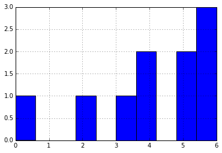
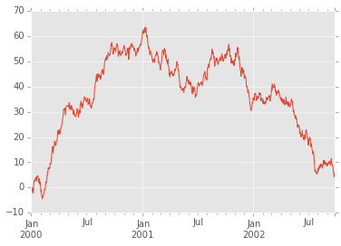
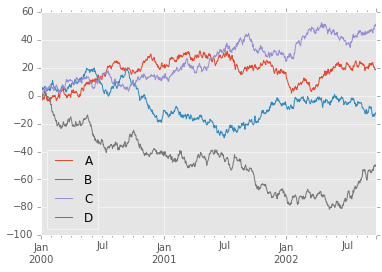

## 十分钟上手 Pandas

`pandas` 是一个 `Python Data Analysis Library`。

安装请参考官网的教程，如果安装了 `Anaconda`，则不需要安装 `pandas` 库。


```python
%matplotlib inline

import pandas as pd
import numpy as np
import matplotlib.pyplot as plt
```

### 产生 Pandas 对象

`pandas` 中有三种基本结构：

- `Series`
    - 1D labeled homogeneously-typed array
- `DataFrame`
    - General 2D labeled, size-mutable tabular structure with potentially heterogeneously-typed columns
- `Panel`
    - General 3D labeled, also size-mutable array

#### Series

一维 `Series` 可以用一维列表初始化：


```python
s = pd.Series([1,3,5,np.nan,6,8])

print s
```

    0     1
    1     3
    2     5
    3   NaN
    4     6
    5     8
    dtype: float64


默认情况下，`Series` 的下标都是数字（可以使用额外参数指定），类型是统一的。

#### DataFrame

`DataFrame` 则是个二维结构，这里首先构造一组时间序列，作为我们第一维的下标：


```python
dates = pd.date_range('20130101', periods=6)

print dates
```

    DatetimeIndex(['2013-01-01', '2013-01-02', '2013-01-03', '2013-01-04',
                   '2013-01-05', '2013-01-06'],
                  dtype='datetime64[ns]', freq='D')


然后创建一个 `DataFrame` 结构：


```python
df = pd.DataFrame(np.random.randn(6,4), index=dates, columns=list('ABCD'))

df
```


<div>
<table border="1" class="dataframe">
  <thead>
    <tr style="text-align: right;">
      <th></th>
      <th>A</th>
      <th>B</th>
      <th>C</th>
      <th>D</th>
    </tr>
  </thead>
  <tbody>
    <tr>
      <th>2013-01-01</th>
      <td>-0.605936</td>
      <td>-0.861658</td>
      <td>-1.001924</td>
      <td>1.528584</td>
    </tr>
    <tr>
      <th>2013-01-02</th>
      <td>-0.165408</td>
      <td>0.388338</td>
      <td>1.187187</td>
      <td>1.819818</td>
    </tr>
    <tr>
      <th>2013-01-03</th>
      <td>0.065255</td>
      <td>-1.608074</td>
      <td>-1.282331</td>
      <td>-0.286067</td>
    </tr>
    <tr>
      <th>2013-01-04</th>
      <td>1.289305</td>
      <td>0.497115</td>
      <td>-0.225351</td>
      <td>0.040239</td>
    </tr>
    <tr>
      <th>2013-01-05</th>
      <td>0.038232</td>
      <td>0.875057</td>
      <td>-0.092526</td>
      <td>0.934432</td>
    </tr>
    <tr>
      <th>2013-01-06</th>
      <td>-2.163453</td>
      <td>-0.010279</td>
      <td>1.699886</td>
      <td>1.291653</td>
    </tr>
  </tbody>
</table>
</div>


默认情况下，如果不指定 `index` 参数和 `columns`，那么他们的值将用从 `0` 开始的数字替代。

除了向 `DataFrame` 中传入二维数组，我们也可以使用字典传入数据：


```python
df2 = pd.DataFrame({'A' : 1.,
                    'B' : pd.Timestamp('20130102'),
                    'C' : pd.Series(1,index=list(range(4)),dtype='float32'),
                    'D' : np.array([3] * 4,dtype='int32'),
                    'E' : pd.Categorical(["test","train","test","train"]),
                    'F' : 'foo' })

df2
```


<div>
<table border="1" class="dataframe">
  <thead>
    <tr style="text-align: right;">
      <th></th>
      <th>A</th>
      <th>B</th>
      <th>C</th>
      <th>D</th>
      <th>E</th>
      <th>F</th>
    </tr>
  </thead>
  <tbody>
    <tr>
      <th>0</th>
      <td>1</td>
      <td>2013-01-02</td>
      <td>1</td>
      <td>3</td>
      <td>test</td>
      <td>foo</td>
    </tr>
    <tr>
      <th>1</th>
      <td>1</td>
      <td>2013-01-02</td>
      <td>1</td>
      <td>3</td>
      <td>train</td>
      <td>foo</td>
    </tr>
    <tr>
      <th>2</th>
      <td>1</td>
      <td>2013-01-02</td>
      <td>1</td>
      <td>3</td>
      <td>test</td>
      <td>foo</td>
    </tr>
    <tr>
      <th>3</th>
      <td>1</td>
      <td>2013-01-02</td>
      <td>1</td>
      <td>3</td>
      <td>train</td>
      <td>foo</td>
    </tr>
  </tbody>
</table>
</div>


字典的每个 `key` 代表一列，其 `value` 可以是各种能够转化为 `Series` 的对象。

与 `Series` 要求所有的类型都一致不同，`DataFrame` 值要求每一列数据的格式相同：


```python
df2.dtypes
```


    A           float64
    B    datetime64[ns]
    C           float32
    D             int32
    E          category
    F            object
    dtype: object


### 查看数据

#### 头尾数据

`head` 和 `tail` 方法可以分别查看最前面几行和最后面几行的数据（默认为 5）：


```python
df.head()
```


<div>
<table border="1" class="dataframe">
  <thead>
    <tr style="text-align: right;">
      <th></th>
      <th>A</th>
      <th>B</th>
      <th>C</th>
      <th>D</th>
    </tr>
  </thead>
  <tbody>
    <tr>
      <th>2013-01-01</th>
      <td>-0.605936</td>
      <td>-0.861658</td>
      <td>-1.001924</td>
      <td>1.528584</td>
    </tr>
    <tr>
      <th>2013-01-02</th>
      <td>-0.165408</td>
      <td>0.388338</td>
      <td>1.187187</td>
      <td>1.819818</td>
    </tr>
    <tr>
      <th>2013-01-03</th>
      <td>0.065255</td>
      <td>-1.608074</td>
      <td>-1.282331</td>
      <td>-0.286067</td>
    </tr>
    <tr>
      <th>2013-01-04</th>
      <td>1.289305</td>
      <td>0.497115</td>
      <td>-0.225351</td>
      <td>0.040239</td>
    </tr>
    <tr>
      <th>2013-01-05</th>
      <td>0.038232</td>
      <td>0.875057</td>
      <td>-0.092526</td>
      <td>0.934432</td>
    </tr>
  </tbody>
</table>
</div>


最后 3 行：


```python
df.tail(3)
```


<div>
<table border="1" class="dataframe">
  <thead>
    <tr style="text-align: right;">
      <th></th>
      <th>A</th>
      <th>B</th>
      <th>C</th>
      <th>D</th>
    </tr>
  </thead>
  <tbody>
    <tr>
      <th>2013-01-04</th>
      <td>1.289305</td>
      <td>0.497115</td>
      <td>-0.225351</td>
      <td>0.040239</td>
    </tr>
    <tr>
      <th>2013-01-05</th>
      <td>0.038232</td>
      <td>0.875057</td>
      <td>-0.092526</td>
      <td>0.934432</td>
    </tr>
    <tr>
      <th>2013-01-06</th>
      <td>-2.163453</td>
      <td>-0.010279</td>
      <td>1.699886</td>
      <td>1.291653</td>
    </tr>
  </tbody>
</table>
</div>


#### 下标，列标，数据

下标使用 `index` 属性查看：


```python
df.index
```


    DatetimeIndex(['2013-01-01', '2013-01-02', '2013-01-03', '2013-01-04',
                   '2013-01-05', '2013-01-06'],
                  dtype='datetime64[ns]', freq='D')


列标使用 `columns` 属性查看：


```python
df.columns
```


    Index([u'A', u'B', u'C', u'D'], dtype='object')


数据值使用 `values` 查看：


```python
df.values
```


    array([[-0.60593585, -0.86165752, -1.00192387,  1.52858443],
           [-0.16540784,  0.38833783,  1.18718697,  1.81981793],
           [ 0.06525454, -1.60807414, -1.2823306 , -0.28606716],
           [ 1.28930486,  0.49711531, -0.22535143,  0.04023897],
           [ 0.03823179,  0.87505664, -0.0925258 ,  0.93443212],
           [-2.16345271, -0.01027865,  1.69988608,  1.29165337]])


#### 统计数据

查看简单的统计数据：


```python
df.describe()
```


<div>
<table border="1" class="dataframe">
  <thead>
    <tr style="text-align: right;">
      <th></th>
      <th>A</th>
      <th>B</th>
      <th>C</th>
      <th>D</th>
    </tr>
  </thead>
  <tbody>
    <tr>
      <th>count</th>
      <td>6.000000</td>
      <td>6.000000</td>
      <td>6.000000</td>
      <td>6.000000</td>
    </tr>
    <tr>
      <th>mean</th>
      <td>-0.257001</td>
      <td>-0.119917</td>
      <td>0.047490</td>
      <td>0.888110</td>
    </tr>
    <tr>
      <th>std</th>
      <td>1.126657</td>
      <td>0.938705</td>
      <td>1.182629</td>
      <td>0.841529</td>
    </tr>
    <tr>
      <th>min</th>
      <td>-2.163453</td>
      <td>-1.608074</td>
      <td>-1.282331</td>
      <td>-0.286067</td>
    </tr>
    <tr>
      <th>25%</th>
      <td>-0.495804</td>
      <td>-0.648813</td>
      <td>-0.807781</td>
      <td>0.263787</td>
    </tr>
    <tr>
      <th>50%</th>
      <td>-0.063588</td>
      <td>0.189030</td>
      <td>-0.158939</td>
      <td>1.113043</td>
    </tr>
    <tr>
      <th>75%</th>
      <td>0.058499</td>
      <td>0.469921</td>
      <td>0.867259</td>
      <td>1.469352</td>
    </tr>
    <tr>
      <th>max</th>
      <td>1.289305</td>
      <td>0.875057</td>
      <td>1.699886</td>
      <td>1.819818</td>
    </tr>
  </tbody>
</table>
</div>


#### 转置


```python
df.T
```


<div>
<table border="1" class="dataframe">
  <thead>
    <tr style="text-align: right;">
      <th></th>
      <th>2013-01-01 00:00:00</th>
      <th>2013-01-02 00:00:00</th>
      <th>2013-01-03 00:00:00</th>
      <th>2013-01-04 00:00:00</th>
      <th>2013-01-05 00:00:00</th>
      <th>2013-01-06 00:00:00</th>
    </tr>
  </thead>
  <tbody>
    <tr>
      <th>A</th>
      <td>-0.605936</td>
      <td>-0.165408</td>
      <td>0.065255</td>
      <td>1.289305</td>
      <td>0.038232</td>
      <td>-2.163453</td>
    </tr>
    <tr>
      <th>B</th>
      <td>-0.861658</td>
      <td>0.388338</td>
      <td>-1.608074</td>
      <td>0.497115</td>
      <td>0.875057</td>
      <td>-0.010279</td>
    </tr>
    <tr>
      <th>C</th>
      <td>-1.001924</td>
      <td>1.187187</td>
      <td>-1.282331</td>
      <td>-0.225351</td>
      <td>-0.092526</td>
      <td>1.699886</td>
    </tr>
    <tr>
      <th>D</th>
      <td>1.528584</td>
      <td>1.819818</td>
      <td>-0.286067</td>
      <td>0.040239</td>
      <td>0.934432</td>
      <td>1.291653</td>
    </tr>
  </tbody>
</table>
</div>


### 排序

`sort_index(axis=0, ascending=True)` 方法按照下标大小进行排序，`axis=0` 表示按第 0 维进行排序。


```python
df.sort_index(ascending=False)
```


<div>
<table border="1" class="dataframe">
  <thead>
    <tr style="text-align: right;">
      <th></th>
      <th>A</th>
      <th>B</th>
      <th>C</th>
      <th>D</th>
    </tr>
  </thead>
  <tbody>
    <tr>
      <th>2013-01-06</th>
      <td>-2.163453</td>
      <td>-0.010279</td>
      <td>1.699886</td>
      <td>1.291653</td>
    </tr>
    <tr>
      <th>2013-01-05</th>
      <td>0.038232</td>
      <td>0.875057</td>
      <td>-0.092526</td>
      <td>0.934432</td>
    </tr>
    <tr>
      <th>2013-01-04</th>
      <td>1.289305</td>
      <td>0.497115</td>
      <td>-0.225351</td>
      <td>0.040239</td>
    </tr>
    <tr>
      <th>2013-01-03</th>
      <td>0.065255</td>
      <td>-1.608074</td>
      <td>-1.282331</td>
      <td>-0.286067</td>
    </tr>
    <tr>
      <th>2013-01-02</th>
      <td>-0.165408</td>
      <td>0.388338</td>
      <td>1.187187</td>
      <td>1.819818</td>
    </tr>
    <tr>
      <th>2013-01-01</th>
      <td>-0.605936</td>
      <td>-0.861658</td>
      <td>-1.001924</td>
      <td>1.528584</td>
    </tr>
  </tbody>
</table>
</div>


```python
df.sort_index(axis=1, ascending=False)
```


<div>
<table border="1" class="dataframe">
  <thead>
    <tr style="text-align: right;">
      <th></th>
      <th>D</th>
      <th>C</th>
      <th>B</th>
      <th>A</th>
    </tr>
  </thead>
  <tbody>
    <tr>
      <th>2013-01-01</th>
      <td>1.528584</td>
      <td>-1.001924</td>
      <td>-0.861658</td>
      <td>-0.605936</td>
    </tr>
    <tr>
      <th>2013-01-02</th>
      <td>1.819818</td>
      <td>1.187187</td>
      <td>0.388338</td>
      <td>-0.165408</td>
    </tr>
    <tr>
      <th>2013-01-03</th>
      <td>-0.286067</td>
      <td>-1.282331</td>
      <td>-1.608074</td>
      <td>0.065255</td>
    </tr>
    <tr>
      <th>2013-01-04</th>
      <td>0.040239</td>
      <td>-0.225351</td>
      <td>0.497115</td>
      <td>1.289305</td>
    </tr>
    <tr>
      <th>2013-01-05</th>
      <td>0.934432</td>
      <td>-0.092526</td>
      <td>0.875057</td>
      <td>0.038232</td>
    </tr>
    <tr>
      <th>2013-01-06</th>
      <td>1.291653</td>
      <td>1.699886</td>
      <td>-0.010279</td>
      <td>-2.163453</td>
    </tr>
  </tbody>
</table>
</div>


`sort_values(by, axis=0, ascending=True)` 方法按照 `by` 的值的大小进行排序，例如按照 `B` 列的大小：


```python
df.sort_values(by="B")
```


<div>
<table border="1" class="dataframe">
  <thead>
    <tr style="text-align: right;">
      <th></th>
      <th>A</th>
      <th>B</th>
      <th>C</th>
      <th>D</th>
    </tr>
  </thead>
  <tbody>
    <tr>
      <th>2013-01-03</th>
      <td>0.065255</td>
      <td>-1.608074</td>
      <td>-1.282331</td>
      <td>-0.286067</td>
    </tr>
    <tr>
      <th>2013-01-01</th>
      <td>-0.605936</td>
      <td>-0.861658</td>
      <td>-1.001924</td>
      <td>1.528584</td>
    </tr>
    <tr>
      <th>2013-01-06</th>
      <td>-2.163453</td>
      <td>-0.010279</td>
      <td>1.699886</td>
      <td>1.291653</td>
    </tr>
    <tr>
      <th>2013-01-02</th>
      <td>-0.165408</td>
      <td>0.388338</td>
      <td>1.187187</td>
      <td>1.819818</td>
    </tr>
    <tr>
      <th>2013-01-04</th>
      <td>1.289305</td>
      <td>0.497115</td>
      <td>-0.225351</td>
      <td>0.040239</td>
    </tr>
    <tr>
      <th>2013-01-05</th>
      <td>0.038232</td>
      <td>0.875057</td>
      <td>-0.092526</td>
      <td>0.934432</td>
    </tr>
  </tbody>
</table>
</div>


### 索引

虽然 `DataFrame` 支持 `Python/Numpy` 的索引语法，但是推荐使用 `.at, .iat, .loc, .iloc 和 .ix` 方法进行索引。

#### 读取数据

选择单列数据：


```python
df["A"]
```


    2013-01-01   -0.605936
    2013-01-02   -0.165408
    2013-01-03    0.065255
    2013-01-04    1.289305
    2013-01-05    0.038232
    2013-01-06   -2.163453
    Freq: D, Name: A, dtype: float64


也可以用 `df.A`：


```python
df.A
```


    2013-01-01   -0.605936
    2013-01-02   -0.165408
    2013-01-03    0.065255
    2013-01-04    1.289305
    2013-01-05    0.038232
    2013-01-06   -2.163453
    Freq: D, Name: A, dtype: float64


使用切片读取多行：


```python
df[0:3]
```


<div>
<table border="1" class="dataframe">
  <thead>
    <tr style="text-align: right;">
      <th></th>
      <th>A</th>
      <th>B</th>
      <th>C</th>
      <th>D</th>
    </tr>
  </thead>
  <tbody>
    <tr>
      <th>2013-01-01</th>
      <td>-0.605936</td>
      <td>-0.861658</td>
      <td>-1.001924</td>
      <td>1.528584</td>
    </tr>
    <tr>
      <th>2013-01-02</th>
      <td>-0.165408</td>
      <td>0.388338</td>
      <td>1.187187</td>
      <td>1.819818</td>
    </tr>
    <tr>
      <th>2013-01-03</th>
      <td>0.065255</td>
      <td>-1.608074</td>
      <td>-1.282331</td>
      <td>-0.286067</td>
    </tr>
  </tbody>
</table>
</div>


`index` 名字也可以进行切片：


```python
df["20130101":"20130103"]
```


<div>
<table border="1" class="dataframe">
  <thead>
    <tr style="text-align: right;">
      <th></th>
      <th>A</th>
      <th>B</th>
      <th>C</th>
      <th>D</th>
    </tr>
  </thead>
  <tbody>
    <tr>
      <th>2013-01-01</th>
      <td>-0.605936</td>
      <td>-0.861658</td>
      <td>-1.001924</td>
      <td>1.528584</td>
    </tr>
    <tr>
      <th>2013-01-02</th>
      <td>-0.165408</td>
      <td>0.388338</td>
      <td>1.187187</td>
      <td>1.819818</td>
    </tr>
    <tr>
      <th>2013-01-03</th>
      <td>0.065255</td>
      <td>-1.608074</td>
      <td>-1.282331</td>
      <td>-0.286067</td>
    </tr>
  </tbody>
</table>
</div>


#### 使用 `label` 索引

`loc` 可以方便的使用 `label` 进行索引：


```python
df.loc[dates[0]]
```


    A   -0.605936
    B   -0.861658
    C   -1.001924
    D    1.528584
    Name: 2013-01-01 00:00:00, dtype: float64


多列数据：


```python
df.loc[:,['A','B']]
```


<div>
<table border="1" class="dataframe">
  <thead>
    <tr style="text-align: right;">
      <th></th>
      <th>A</th>
      <th>B</th>
    </tr>
  </thead>
  <tbody>
    <tr>
      <th>2013-01-01</th>
      <td>-0.605936</td>
      <td>-0.861658</td>
    </tr>
    <tr>
      <th>2013-01-02</th>
      <td>-0.165408</td>
      <td>0.388338</td>
    </tr>
    <tr>
      <th>2013-01-03</th>
      <td>0.065255</td>
      <td>-1.608074</td>
    </tr>
    <tr>
      <th>2013-01-04</th>
      <td>1.289305</td>
      <td>0.497115</td>
    </tr>
    <tr>
      <th>2013-01-05</th>
      <td>0.038232</td>
      <td>0.875057</td>
    </tr>
    <tr>
      <th>2013-01-06</th>
      <td>-2.163453</td>
      <td>-0.010279</td>
    </tr>
  </tbody>
</table>
</div>


选择多行多列：


```python
df.loc['20130102':'20130104',['A','B']]
```


<div>
<table border="1" class="dataframe">
  <thead>
    <tr style="text-align: right;">
      <th></th>
      <th>A</th>
      <th>B</th>
    </tr>
  </thead>
  <tbody>
    <tr>
      <th>2013-01-02</th>
      <td>-0.165408</td>
      <td>0.388338</td>
    </tr>
    <tr>
      <th>2013-01-03</th>
      <td>0.065255</td>
      <td>-1.608074</td>
    </tr>
    <tr>
      <th>2013-01-04</th>
      <td>1.289305</td>
      <td>0.497115</td>
    </tr>
  </tbody>
</table>
</div>


数据降维：


```python
df.loc['20130102',['A','B']]
```


    A   -0.165408
    B    0.388338
    Name: 2013-01-02 00:00:00, dtype: float64


得到标量值：


```python
df.loc[dates[0],'B']
```


    -0.86165751902832299


不过得到标量值可以用 `at`，速度更快：


```python
%timeit -n100 df.loc[dates[0],'B']
%timeit -n100 df.at[dates[0],'B']

print df.at[dates[0],'B']
```

    100 loops, best of 3: 329 µs per loop
    100 loops, best of 3: 31.1 µs per loop
    -0.861657519028


#### 使用位置索引

`iloc` 使用位置进行索引：


```python
df.iloc[3]
```


    A    1.289305
    B    0.497115
    C   -0.225351
    D    0.040239
    Name: 2013-01-04 00:00:00, dtype: float64


连续切片：


```python
df.iloc[3:5,0:2]
```


<div>
<table border="1" class="dataframe">
  <thead>
    <tr style="text-align: right;">
      <th></th>
      <th>A</th>
      <th>B</th>
    </tr>
  </thead>
  <tbody>
    <tr>
      <th>2013-01-04</th>
      <td>1.289305</td>
      <td>0.497115</td>
    </tr>
    <tr>
      <th>2013-01-05</th>
      <td>0.038232</td>
      <td>0.875057</td>
    </tr>
  </tbody>
</table>
</div>


索引不连续的部分：


```python
df.iloc[[1,2,4],[0,2]]
```


<div>
<table border="1" class="dataframe">
  <thead>
    <tr style="text-align: right;">
      <th></th>
      <th>A</th>
      <th>C</th>
    </tr>
  </thead>
  <tbody>
    <tr>
      <th>2013-01-02</th>
      <td>-0.165408</td>
      <td>1.187187</td>
    </tr>
    <tr>
      <th>2013-01-03</th>
      <td>0.065255</td>
      <td>-1.282331</td>
    </tr>
    <tr>
      <th>2013-01-05</th>
      <td>0.038232</td>
      <td>-0.092526</td>
    </tr>
  </tbody>
</table>
</div>


索引整行：


```python
df.iloc[1:3,:]
```


<div>
<table border="1" class="dataframe">
  <thead>
    <tr style="text-align: right;">
      <th></th>
      <th>A</th>
      <th>B</th>
      <th>C</th>
      <th>D</th>
    </tr>
  </thead>
  <tbody>
    <tr>
      <th>2013-01-02</th>
      <td>-0.165408</td>
      <td>0.388338</td>
      <td>1.187187</td>
      <td>1.819818</td>
    </tr>
    <tr>
      <th>2013-01-03</th>
      <td>0.065255</td>
      <td>-1.608074</td>
      <td>-1.282331</td>
      <td>-0.286067</td>
    </tr>
  </tbody>
</table>
</div>


整列：


```python
df.iloc[:, 1:3]
```


<div>
<table border="1" class="dataframe">
  <thead>
    <tr style="text-align: right;">
      <th></th>
      <th>B</th>
      <th>C</th>
    </tr>
  </thead>
  <tbody>
    <tr>
      <th>2013-01-01</th>
      <td>-0.861658</td>
      <td>-1.001924</td>
    </tr>
    <tr>
      <th>2013-01-02</th>
      <td>0.388338</td>
      <td>1.187187</td>
    </tr>
    <tr>
      <th>2013-01-03</th>
      <td>-1.608074</td>
      <td>-1.282331</td>
    </tr>
    <tr>
      <th>2013-01-04</th>
      <td>0.497115</td>
      <td>-0.225351</td>
    </tr>
    <tr>
      <th>2013-01-05</th>
      <td>0.875057</td>
      <td>-0.092526</td>
    </tr>
    <tr>
      <th>2013-01-06</th>
      <td>-0.010279</td>
      <td>1.699886</td>
    </tr>
  </tbody>
</table>
</div>


标量值：


```python
df.iloc[1,1]
```


    0.3883378290420279


当然，使用 `iat` 索引标量值更快：


```python
%timeit -n100 df.iloc[1,1]
%timeit -n100 df.iat[1,1]

df.iat[1,1]
```

    100 loops, best of 3: 236 µs per loop
    100 loops, best of 3: 14.5 µs per loop


    0.3883378290420279


#### 布尔型索引

所有 `A` 列大于 0 的行：


```python
df[df.A > 0]
```


<div>
<table border="1" class="dataframe">
  <thead>
    <tr style="text-align: right;">
      <th></th>
      <th>A</th>
      <th>B</th>
      <th>C</th>
      <th>D</th>
    </tr>
  </thead>
  <tbody>
    <tr>
      <th>2013-01-03</th>
      <td>0.065255</td>
      <td>-1.608074</td>
      <td>-1.282331</td>
      <td>-0.286067</td>
    </tr>
    <tr>
      <th>2013-01-04</th>
      <td>1.289305</td>
      <td>0.497115</td>
      <td>-0.225351</td>
      <td>0.040239</td>
    </tr>
    <tr>
      <th>2013-01-05</th>
      <td>0.038232</td>
      <td>0.875057</td>
      <td>-0.092526</td>
      <td>0.934432</td>
    </tr>
  </tbody>
</table>
</div>


只留下所有大于 0 的数值：


```python
df[df > 0]
```


<div>
<table border="1" class="dataframe">
  <thead>
    <tr style="text-align: right;">
      <th></th>
      <th>A</th>
      <th>B</th>
      <th>C</th>
      <th>D</th>
    </tr>
  </thead>
  <tbody>
    <tr>
      <th>2013-01-01</th>
      <td>NaN</td>
      <td>NaN</td>
      <td>NaN</td>
      <td>1.528584</td>
    </tr>
    <tr>
      <th>2013-01-02</th>
      <td>NaN</td>
      <td>0.388338</td>
      <td>1.187187</td>
      <td>1.819818</td>
    </tr>
    <tr>
      <th>2013-01-03</th>
      <td>0.065255</td>
      <td>NaN</td>
      <td>NaN</td>
      <td>NaN</td>
    </tr>
    <tr>
      <th>2013-01-04</th>
      <td>1.289305</td>
      <td>0.497115</td>
      <td>NaN</td>
      <td>0.040239</td>
    </tr>
    <tr>
      <th>2013-01-05</th>
      <td>0.038232</td>
      <td>0.875057</td>
      <td>NaN</td>
      <td>0.934432</td>
    </tr>
    <tr>
      <th>2013-01-06</th>
      <td>NaN</td>
      <td>NaN</td>
      <td>1.699886</td>
      <td>1.291653</td>
    </tr>
  </tbody>
</table>
</div>


使用 `isin` 方法做 `filter` 过滤：


```python
df2 = df.copy()
df2['E'] = ['one', 'one','two','three','four','three']

df2
```


<div>
<table border="1" class="dataframe">
  <thead>
    <tr style="text-align: right;">
      <th></th>
      <th>A</th>
      <th>B</th>
      <th>C</th>
      <th>D</th>
      <th>E</th>
    </tr>
  </thead>
  <tbody>
    <tr>
      <th>2013-01-01</th>
      <td>-0.605936</td>
      <td>-0.861658</td>
      <td>-1.001924</td>
      <td>1.528584</td>
      <td>one</td>
    </tr>
    <tr>
      <th>2013-01-02</th>
      <td>-0.165408</td>
      <td>0.388338</td>
      <td>1.187187</td>
      <td>1.819818</td>
      <td>one</td>
    </tr>
    <tr>
      <th>2013-01-03</th>
      <td>0.065255</td>
      <td>-1.608074</td>
      <td>-1.282331</td>
      <td>-0.286067</td>
      <td>two</td>
    </tr>
    <tr>
      <th>2013-01-04</th>
      <td>1.289305</td>
      <td>0.497115</td>
      <td>-0.225351</td>
      <td>0.040239</td>
      <td>three</td>
    </tr>
    <tr>
      <th>2013-01-05</th>
      <td>0.038232</td>
      <td>0.875057</td>
      <td>-0.092526</td>
      <td>0.934432</td>
      <td>four</td>
    </tr>
    <tr>
      <th>2013-01-06</th>
      <td>-2.163453</td>
      <td>-0.010279</td>
      <td>1.699886</td>
      <td>1.291653</td>
      <td>three</td>
    </tr>
  </tbody>
</table>
</div>


```python
df2[df2['E'].isin(['two','four'])]
```


<div>
<table border="1" class="dataframe">
  <thead>
    <tr style="text-align: right;">
      <th></th>
      <th>A</th>
      <th>B</th>
      <th>C</th>
      <th>D</th>
      <th>E</th>
    </tr>
  </thead>
  <tbody>
    <tr>
      <th>2013-01-03</th>
      <td>0.065255</td>
      <td>-1.608074</td>
      <td>-1.282331</td>
      <td>-0.286067</td>
      <td>two</td>
    </tr>
    <tr>
      <th>2013-01-05</th>
      <td>0.038232</td>
      <td>0.875057</td>
      <td>-0.092526</td>
      <td>0.934432</td>
      <td>four</td>
    </tr>
  </tbody>
</table>
</div>


#### 设定数据的值


```python
s1 = pd.Series([1,2,3,4,5,6], index=pd.date_range('20130102', periods=6))

s1
```


    2013-01-02    1
    2013-01-03    2
    2013-01-04    3
    2013-01-05    4
    2013-01-06    5
    2013-01-07    6
    Freq: D, dtype: int64


像字典一样，直接指定 `F` 列的值为 `s1`，此时以 `df` 已有的 `index` 为标准将二者进行合并，`s1` 中没有的 `index` 项设为 `NaN`，多余的项舍去：


```python
df['F'] = s1

df
```


<div>
<table border="1" class="dataframe">
  <thead>
    <tr style="text-align: right;">
      <th></th>
      <th>A</th>
      <th>B</th>
      <th>C</th>
      <th>D</th>
      <th>F</th>
    </tr>
  </thead>
  <tbody>
    <tr>
      <th>2013-01-01</th>
      <td>-0.605936</td>
      <td>-0.861658</td>
      <td>-1.001924</td>
      <td>1.528584</td>
      <td>NaN</td>
    </tr>
    <tr>
      <th>2013-01-02</th>
      <td>-0.165408</td>
      <td>0.388338</td>
      <td>1.187187</td>
      <td>1.819818</td>
      <td>1</td>
    </tr>
    <tr>
      <th>2013-01-03</th>
      <td>0.065255</td>
      <td>-1.608074</td>
      <td>-1.282331</td>
      <td>-0.286067</td>
      <td>2</td>
    </tr>
    <tr>
      <th>2013-01-04</th>
      <td>1.289305</td>
      <td>0.497115</td>
      <td>-0.225351</td>
      <td>0.040239</td>
      <td>3</td>
    </tr>
    <tr>
      <th>2013-01-05</th>
      <td>0.038232</td>
      <td>0.875057</td>
      <td>-0.092526</td>
      <td>0.934432</td>
      <td>4</td>
    </tr>
    <tr>
      <th>2013-01-06</th>
      <td>-2.163453</td>
      <td>-0.010279</td>
      <td>1.699886</td>
      <td>1.291653</td>
      <td>5</td>
    </tr>
  </tbody>
</table>
</div>


或者使用 `at` 或 `iat` 修改单个值：


```python
df.at[dates[0],'A'] = 0

df
```


<div>
<table border="1" class="dataframe">
  <thead>
    <tr style="text-align: right;">
      <th></th>
      <th>A</th>
      <th>B</th>
      <th>C</th>
      <th>D</th>
      <th>F</th>
    </tr>
  </thead>
  <tbody>
    <tr>
      <th>2013-01-01</th>
      <td>0.000000</td>
      <td>-0.861658</td>
      <td>-1.001924</td>
      <td>1.528584</td>
      <td>NaN</td>
    </tr>
    <tr>
      <th>2013-01-02</th>
      <td>-0.165408</td>
      <td>0.388338</td>
      <td>1.187187</td>
      <td>1.819818</td>
      <td>1</td>
    </tr>
    <tr>
      <th>2013-01-03</th>
      <td>0.065255</td>
      <td>-1.608074</td>
      <td>-1.282331</td>
      <td>-0.286067</td>
      <td>2</td>
    </tr>
    <tr>
      <th>2013-01-04</th>
      <td>1.289305</td>
      <td>0.497115</td>
      <td>-0.225351</td>
      <td>0.040239</td>
      <td>3</td>
    </tr>
    <tr>
      <th>2013-01-05</th>
      <td>0.038232</td>
      <td>0.875057</td>
      <td>-0.092526</td>
      <td>0.934432</td>
      <td>4</td>
    </tr>
    <tr>
      <th>2013-01-06</th>
      <td>-2.163453</td>
      <td>-0.010279</td>
      <td>1.699886</td>
      <td>1.291653</td>
      <td>5</td>
    </tr>
  </tbody>
</table>
</div>


```python
df.iat[0, 1] = 0

df
```


<div>
<table border="1" class="dataframe">
  <thead>
    <tr style="text-align: right;">
      <th></th>
      <th>A</th>
      <th>B</th>
      <th>C</th>
      <th>D</th>
      <th>F</th>
    </tr>
  </thead>
  <tbody>
    <tr>
      <th>2013-01-01</th>
      <td>0.000000</td>
      <td>0.000000</td>
      <td>-1.001924</td>
      <td>1.528584</td>
      <td>NaN</td>
    </tr>
    <tr>
      <th>2013-01-02</th>
      <td>-0.165408</td>
      <td>0.388338</td>
      <td>1.187187</td>
      <td>1.819818</td>
      <td>1</td>
    </tr>
    <tr>
      <th>2013-01-03</th>
      <td>0.065255</td>
      <td>-1.608074</td>
      <td>-1.282331</td>
      <td>-0.286067</td>
      <td>2</td>
    </tr>
    <tr>
      <th>2013-01-04</th>
      <td>1.289305</td>
      <td>0.497115</td>
      <td>-0.225351</td>
      <td>0.040239</td>
      <td>3</td>
    </tr>
    <tr>
      <th>2013-01-05</th>
      <td>0.038232</td>
      <td>0.875057</td>
      <td>-0.092526</td>
      <td>0.934432</td>
      <td>4</td>
    </tr>
    <tr>
      <th>2013-01-06</th>
      <td>-2.163453</td>
      <td>-0.010279</td>
      <td>1.699886</td>
      <td>1.291653</td>
      <td>5</td>
    </tr>
  </tbody>
</table>
</div>


设定一整列：


```python
df.loc[:,'D'] = np.array([5] * len(df))

df
```


<div>
<table border="1" class="dataframe">
  <thead>
    <tr style="text-align: right;">
      <th></th>
      <th>A</th>
      <th>B</th>
      <th>C</th>
      <th>D</th>
      <th>F</th>
    </tr>
  </thead>
  <tbody>
    <tr>
      <th>2013-01-01</th>
      <td>0.000000</td>
      <td>0.000000</td>
      <td>-1.001924</td>
      <td>5</td>
      <td>NaN</td>
    </tr>
    <tr>
      <th>2013-01-02</th>
      <td>-0.165408</td>
      <td>0.388338</td>
      <td>1.187187</td>
      <td>5</td>
      <td>1</td>
    </tr>
    <tr>
      <th>2013-01-03</th>
      <td>0.065255</td>
      <td>-1.608074</td>
      <td>-1.282331</td>
      <td>5</td>
      <td>2</td>
    </tr>
    <tr>
      <th>2013-01-04</th>
      <td>1.289305</td>
      <td>0.497115</td>
      <td>-0.225351</td>
      <td>5</td>
      <td>3</td>
    </tr>
    <tr>
      <th>2013-01-05</th>
      <td>0.038232</td>
      <td>0.875057</td>
      <td>-0.092526</td>
      <td>5</td>
      <td>4</td>
    </tr>
    <tr>
      <th>2013-01-06</th>
      <td>-2.163453</td>
      <td>-0.010279</td>
      <td>1.699886</td>
      <td>5</td>
      <td>5</td>
    </tr>
  </tbody>
</table>
</div>


设定满足条件的数值：


```python
df2 = df.copy()

df2[df2 > 0] = -df2

df2
```


<div>
<table border="1" class="dataframe">
  <thead>
    <tr style="text-align: right;">
      <th></th>
      <th>A</th>
      <th>B</th>
      <th>C</th>
      <th>D</th>
      <th>F</th>
    </tr>
  </thead>
  <tbody>
    <tr>
      <th>2013-01-01</th>
      <td>0.000000</td>
      <td>0.000000</td>
      <td>-1.001924</td>
      <td>-5</td>
      <td>NaN</td>
    </tr>
    <tr>
      <th>2013-01-02</th>
      <td>-0.165408</td>
      <td>-0.388338</td>
      <td>-1.187187</td>
      <td>-5</td>
      <td>-1</td>
    </tr>
    <tr>
      <th>2013-01-03</th>
      <td>-0.065255</td>
      <td>-1.608074</td>
      <td>-1.282331</td>
      <td>-5</td>
      <td>-2</td>
    </tr>
    <tr>
      <th>2013-01-04</th>
      <td>-1.289305</td>
      <td>-0.497115</td>
      <td>-0.225351</td>
      <td>-5</td>
      <td>-3</td>
    </tr>
    <tr>
      <th>2013-01-05</th>
      <td>-0.038232</td>
      <td>-0.875057</td>
      <td>-0.092526</td>
      <td>-5</td>
      <td>-4</td>
    </tr>
    <tr>
      <th>2013-01-06</th>
      <td>-2.163453</td>
      <td>-0.010279</td>
      <td>-1.699886</td>
      <td>-5</td>
      <td>-5</td>
    </tr>
  </tbody>
</table>
</div>


### 缺失数据


```python
df1 = df.reindex(index=dates[0:4], columns=list(df.columns) + ['E'])
df1.loc[dates[0]:dates[1],'E'] = 1

df1
```


<div>
<table border="1" class="dataframe">
  <thead>
    <tr style="text-align: right;">
      <th></th>
      <th>A</th>
      <th>B</th>
      <th>C</th>
      <th>D</th>
      <th>F</th>
      <th>E</th>
    </tr>
  </thead>
  <tbody>
    <tr>
      <th>2013-01-01</th>
      <td>0.000000</td>
      <td>0.000000</td>
      <td>-1.001924</td>
      <td>5</td>
      <td>NaN</td>
      <td>1</td>
    </tr>
    <tr>
      <th>2013-01-02</th>
      <td>-0.165408</td>
      <td>0.388338</td>
      <td>1.187187</td>
      <td>5</td>
      <td>1</td>
      <td>1</td>
    </tr>
    <tr>
      <th>2013-01-03</th>
      <td>0.065255</td>
      <td>-1.608074</td>
      <td>-1.282331</td>
      <td>5</td>
      <td>2</td>
      <td>NaN</td>
    </tr>
    <tr>
      <th>2013-01-04</th>
      <td>1.289305</td>
      <td>0.497115</td>
      <td>-0.225351</td>
      <td>5</td>
      <td>3</td>
      <td>NaN</td>
    </tr>
  </tbody>
</table>
</div>


丢弃所有缺失数据的行得到的新数据：


```python
df1.dropna(how='any')
```


<div>
<table border="1" class="dataframe">
  <thead>
    <tr style="text-align: right;">
      <th></th>
      <th>A</th>
      <th>B</th>
      <th>C</th>
      <th>D</th>
      <th>F</th>
      <th>E</th>
    </tr>
  </thead>
  <tbody>
    <tr>
      <th>2013-01-02</th>
      <td>-0.165408</td>
      <td>0.388338</td>
      <td>1.187187</td>
      <td>5</td>
      <td>1</td>
      <td>1</td>
    </tr>
  </tbody>
</table>
</div>


填充缺失数据：


```python
df1.fillna(value=5)
```


<div>
<table border="1" class="dataframe">
  <thead>
    <tr style="text-align: right;">
      <th></th>
      <th>A</th>
      <th>B</th>
      <th>C</th>
      <th>D</th>
      <th>F</th>
      <th>E</th>
    </tr>
  </thead>
  <tbody>
    <tr>
      <th>2013-01-01</th>
      <td>0.000000</td>
      <td>0.000000</td>
      <td>-1.001924</td>
      <td>5</td>
      <td>5</td>
      <td>1</td>
    </tr>
    <tr>
      <th>2013-01-02</th>
      <td>-0.165408</td>
      <td>0.388338</td>
      <td>1.187187</td>
      <td>5</td>
      <td>1</td>
      <td>1</td>
    </tr>
    <tr>
      <th>2013-01-03</th>
      <td>0.065255</td>
      <td>-1.608074</td>
      <td>-1.282331</td>
      <td>5</td>
      <td>2</td>
      <td>5</td>
    </tr>
    <tr>
      <th>2013-01-04</th>
      <td>1.289305</td>
      <td>0.497115</td>
      <td>-0.225351</td>
      <td>5</td>
      <td>3</td>
      <td>5</td>
    </tr>
  </tbody>
</table>
</div>


检查缺失数据的位置：


```python
pd.isnull(df1)
```


<div>
<table border="1" class="dataframe">
  <thead>
    <tr style="text-align: right;">
      <th></th>
      <th>A</th>
      <th>B</th>
      <th>C</th>
      <th>D</th>
      <th>F</th>
      <th>E</th>
    </tr>
  </thead>
  <tbody>
    <tr>
      <th>2013-01-01</th>
      <td>False</td>
      <td>False</td>
      <td>False</td>
      <td>False</td>
      <td>True</td>
      <td>False</td>
    </tr>
    <tr>
      <th>2013-01-02</th>
      <td>False</td>
      <td>False</td>
      <td>False</td>
      <td>False</td>
      <td>False</td>
      <td>False</td>
    </tr>
    <tr>
      <th>2013-01-03</th>
      <td>False</td>
      <td>False</td>
      <td>False</td>
      <td>False</td>
      <td>False</td>
      <td>True</td>
    </tr>
    <tr>
      <th>2013-01-04</th>
      <td>False</td>
      <td>False</td>
      <td>False</td>
      <td>False</td>
      <td>False</td>
      <td>True</td>
    </tr>
  </tbody>
</table>
</div>


### 计算操作

#### 统计信息

每一列的均值：


```python
df.mean()
```


    A   -0.156012
    B    0.023693
    C    0.047490
    D    5.000000
    F    3.000000
    dtype: float64


每一行的均值：


```python
df.mean(1)
```


    2013-01-01    0.999519
    2013-01-02    1.482023
    2013-01-03    0.834970
    2013-01-04    1.912214
    2013-01-05    1.964153
    2013-01-06    1.905231
    Freq: D, dtype: float64


多个对象之间的操作，如果维度不对，`pandas` 会自动调用 `broadcasting` 机制：


```python
s = pd.Series([1,3,5,np.nan,6,8], index=dates).shift(2)

print s
```

    2013-01-01   NaN
    2013-01-02   NaN
    2013-01-03     1
    2013-01-04     3
    2013-01-05     5
    2013-01-06   NaN
    Freq: D, dtype: float64


相减 `df - s`：


```python
df.sub(s, axis='index')
```


<div>
<table border="1" class="dataframe">
  <thead>
    <tr style="text-align: right;">
      <th></th>
      <th>A</th>
      <th>B</th>
      <th>C</th>
      <th>D</th>
      <th>F</th>
    </tr>
  </thead>
  <tbody>
    <tr>
      <th>2013-01-01</th>
      <td>NaN</td>
      <td>NaN</td>
      <td>NaN</td>
      <td>NaN</td>
      <td>NaN</td>
    </tr>
    <tr>
      <th>2013-01-02</th>
      <td>NaN</td>
      <td>NaN</td>
      <td>NaN</td>
      <td>NaN</td>
      <td>NaN</td>
    </tr>
    <tr>
      <th>2013-01-03</th>
      <td>-0.934745</td>
      <td>-2.608074</td>
      <td>-2.282331</td>
      <td>4</td>
      <td>1</td>
    </tr>
    <tr>
      <th>2013-01-04</th>
      <td>-1.710695</td>
      <td>-2.502885</td>
      <td>-3.225351</td>
      <td>2</td>
      <td>0</td>
    </tr>
    <tr>
      <th>2013-01-05</th>
      <td>-4.961768</td>
      <td>-4.124943</td>
      <td>-5.092526</td>
      <td>0</td>
      <td>-1</td>
    </tr>
    <tr>
      <th>2013-01-06</th>
      <td>NaN</td>
      <td>NaN</td>
      <td>NaN</td>
      <td>NaN</td>
      <td>NaN</td>
    </tr>
  </tbody>
</table>
</div>


#### apply 操作

与 `R` 中的 `apply` 操作类似，接收一个函数，默认是对将函数作用到每一列上：


```python
df.apply(np.cumsum)
```


<div>
<table border="1" class="dataframe">
  <thead>
    <tr style="text-align: right;">
      <th></th>
      <th>A</th>
      <th>B</th>
      <th>C</th>
      <th>D</th>
      <th>F</th>
    </tr>
  </thead>
  <tbody>
    <tr>
      <th>2013-01-01</th>
      <td>0.000000</td>
      <td>0.000000</td>
      <td>-1.001924</td>
      <td>5</td>
      <td>NaN</td>
    </tr>
    <tr>
      <th>2013-01-02</th>
      <td>-0.165408</td>
      <td>0.388338</td>
      <td>0.185263</td>
      <td>10</td>
      <td>1</td>
    </tr>
    <tr>
      <th>2013-01-03</th>
      <td>-0.100153</td>
      <td>-1.219736</td>
      <td>-1.097067</td>
      <td>15</td>
      <td>3</td>
    </tr>
    <tr>
      <th>2013-01-04</th>
      <td>1.189152</td>
      <td>-0.722621</td>
      <td>-1.322419</td>
      <td>20</td>
      <td>6</td>
    </tr>
    <tr>
      <th>2013-01-05</th>
      <td>1.227383</td>
      <td>0.152436</td>
      <td>-1.414945</td>
      <td>25</td>
      <td>10</td>
    </tr>
    <tr>
      <th>2013-01-06</th>
      <td>-0.936069</td>
      <td>0.142157</td>
      <td>0.284941</td>
      <td>30</td>
      <td>15</td>
    </tr>
  </tbody>
</table>
</div>


求每列最大最小值之差：


```python
df.apply(lambda x: x.max() - x.min())
```


    A    3.452758
    B    2.483131
    C    2.982217
    D    0.000000
    F    4.000000
    dtype: float64


#### 直方图


```python
s = pd.Series(np.random.randint(0, 7, size=10))
print s
```

    0    2
    1    5
    2    6
    3    6
    4    6
    5    3
    6    5
    7    0
    8    4
    9    4
    dtype: int64


直方图信息：


```python
print s.value_counts()
```

    6    3
    5    2
    4    2
    3    1
    2    1
    0    1
    dtype: int64


绘制直方图信息：


```python
h = s.hist()
```


    

    


#### 字符串方法

当 `Series` 或者 `DataFrame` 的某一列是字符串时，我们可以用 `.str` 对这个字符串数组进行字符串的基本操作： 


```python
s = pd.Series(['A', 'B', 'C', 'Aaba', 'Baca', np.nan, 'CABA', 'dog', 'cat'])

print s.str.lower()
```

    0       a
    1       b
    2       c
    3    aaba
    4    baca
    5     NaN
    6    caba
    7     dog
    8     cat
    dtype: object


### 合并

#### 连接


```python
df = pd.DataFrame(np.random.randn(10, 4))

df
```


<div>
<table border="1" class="dataframe">
  <thead>
    <tr style="text-align: right;">
      <th></th>
      <th>0</th>
      <th>1</th>
      <th>2</th>
      <th>3</th>
    </tr>
  </thead>
  <tbody>
    <tr>
      <th>0</th>
      <td>-2.346373</td>
      <td>0.105651</td>
      <td>-0.048027</td>
      <td>0.010637</td>
    </tr>
    <tr>
      <th>1</th>
      <td>-0.682198</td>
      <td>0.943043</td>
      <td>0.147312</td>
      <td>-0.657871</td>
    </tr>
    <tr>
      <th>2</th>
      <td>0.515766</td>
      <td>-0.768286</td>
      <td>0.361570</td>
      <td>1.146278</td>
    </tr>
    <tr>
      <th>3</th>
      <td>-0.607277</td>
      <td>-0.003086</td>
      <td>-1.499001</td>
      <td>1.165728</td>
    </tr>
    <tr>
      <th>4</th>
      <td>-1.226279</td>
      <td>-0.177246</td>
      <td>-1.379631</td>
      <td>-0.639261</td>
    </tr>
    <tr>
      <th>5</th>
      <td>0.807364</td>
      <td>-1.855060</td>
      <td>0.325968</td>
      <td>1.898831</td>
    </tr>
    <tr>
      <th>6</th>
      <td>0.438539</td>
      <td>-0.728131</td>
      <td>-0.009924</td>
      <td>0.398360</td>
    </tr>
    <tr>
      <th>7</th>
      <td>1.497457</td>
      <td>-1.506314</td>
      <td>-1.557624</td>
      <td>0.869043</td>
    </tr>
    <tr>
      <th>8</th>
      <td>0.945985</td>
      <td>-0.519435</td>
      <td>-0.510359</td>
      <td>-1.077751</td>
    </tr>
    <tr>
      <th>9</th>
      <td>1.597679</td>
      <td>-0.285955</td>
      <td>-1.060736</td>
      <td>0.608629</td>
    </tr>
  </tbody>
</table>
</div>


可以使用 `pd.concat` 函数将多个 `pandas` 对象进行连接：


```python
pieces = [df[:2], df[4:5], df[7:]]

pd.concat(pieces)
```


<div>
<table border="1" class="dataframe">
  <thead>
    <tr style="text-align: right;">
      <th></th>
      <th>0</th>
      <th>1</th>
      <th>2</th>
      <th>3</th>
    </tr>
  </thead>
  <tbody>
    <tr>
      <th>0</th>
      <td>-2.346373</td>
      <td>0.105651</td>
      <td>-0.048027</td>
      <td>0.010637</td>
    </tr>
    <tr>
      <th>1</th>
      <td>-0.682198</td>
      <td>0.943043</td>
      <td>0.147312</td>
      <td>-0.657871</td>
    </tr>
    <tr>
      <th>4</th>
      <td>-1.226279</td>
      <td>-0.177246</td>
      <td>-1.379631</td>
      <td>-0.639261</td>
    </tr>
    <tr>
      <th>7</th>
      <td>1.497457</td>
      <td>-1.506314</td>
      <td>-1.557624</td>
      <td>0.869043</td>
    </tr>
    <tr>
      <th>8</th>
      <td>0.945985</td>
      <td>-0.519435</td>
      <td>-0.510359</td>
      <td>-1.077751</td>
    </tr>
    <tr>
      <th>9</th>
      <td>1.597679</td>
      <td>-0.285955</td>
      <td>-1.060736</td>
      <td>0.608629</td>
    </tr>
  </tbody>
</table>
</div>


#### 数据库中的 Join

`merge` 可以实现数据库中的 `join` 操作：


```python
left = pd.DataFrame({'key': ['foo', 'foo'], 'lval': [1, 2]})
right = pd.DataFrame({'key': ['foo', 'foo'], 'rval': [4, 5]})

print left
print right
```

       key  lval
    0  foo     1
    1  foo     2
       key  rval
    0  foo     4
    1  foo     5


```python
pd.merge(left, right, on='key')
```


<div>
<table border="1" class="dataframe">
  <thead>
    <tr style="text-align: right;">
      <th></th>
      <th>key</th>
      <th>lval</th>
      <th>rval</th>
    </tr>
  </thead>
  <tbody>
    <tr>
      <th>0</th>
      <td>foo</td>
      <td>1</td>
      <td>4</td>
    </tr>
    <tr>
      <th>1</th>
      <td>foo</td>
      <td>1</td>
      <td>5</td>
    </tr>
    <tr>
      <th>2</th>
      <td>foo</td>
      <td>2</td>
      <td>4</td>
    </tr>
    <tr>
      <th>3</th>
      <td>foo</td>
      <td>2</td>
      <td>5</td>
    </tr>
  </tbody>
</table>
</div>


#### append

向 `DataFrame` 中添加行：


```python
df = pd.DataFrame(np.random.randn(8, 4), columns=['A','B','C','D'])

df
```


<div>
<table border="1" class="dataframe">
  <thead>
    <tr style="text-align: right;">
      <th></th>
      <th>A</th>
      <th>B</th>
      <th>C</th>
      <th>D</th>
    </tr>
  </thead>
  <tbody>
    <tr>
      <th>0</th>
      <td>1.587778</td>
      <td>-0.110297</td>
      <td>0.602245</td>
      <td>1.212597</td>
    </tr>
    <tr>
      <th>1</th>
      <td>-0.551109</td>
      <td>0.337387</td>
      <td>-0.220919</td>
      <td>0.363332</td>
    </tr>
    <tr>
      <th>2</th>
      <td>1.207373</td>
      <td>-0.128394</td>
      <td>0.619937</td>
      <td>-0.612694</td>
    </tr>
    <tr>
      <th>3</th>
      <td>-0.978282</td>
      <td>-1.038170</td>
      <td>0.048995</td>
      <td>-0.788973</td>
    </tr>
    <tr>
      <th>4</th>
      <td>0.843893</td>
      <td>-1.079021</td>
      <td>0.092212</td>
      <td>0.485422</td>
    </tr>
    <tr>
      <th>5</th>
      <td>-0.056594</td>
      <td>1.831206</td>
      <td>1.910864</td>
      <td>-1.331739</td>
    </tr>
    <tr>
      <th>6</th>
      <td>-0.487106</td>
      <td>-1.495367</td>
      <td>0.853440</td>
      <td>0.410854</td>
    </tr>
    <tr>
      <th>7</th>
      <td>1.830852</td>
      <td>-0.014893</td>
      <td>0.254025</td>
      <td>0.197422</td>
    </tr>
  </tbody>
</table>
</div>


将第三行的值添加到最后：


```python
s = df.iloc[3]

df.append(s, ignore_index=True)
```


<div>
<table border="1" class="dataframe">
  <thead>
    <tr style="text-align: right;">
      <th></th>
      <th>A</th>
      <th>B</th>
      <th>C</th>
      <th>D</th>
    </tr>
  </thead>
  <tbody>
    <tr>
      <th>0</th>
      <td>1.587778</td>
      <td>-0.110297</td>
      <td>0.602245</td>
      <td>1.212597</td>
    </tr>
    <tr>
      <th>1</th>
      <td>-0.551109</td>
      <td>0.337387</td>
      <td>-0.220919</td>
      <td>0.363332</td>
    </tr>
    <tr>
      <th>2</th>
      <td>1.207373</td>
      <td>-0.128394</td>
      <td>0.619937</td>
      <td>-0.612694</td>
    </tr>
    <tr>
      <th>3</th>
      <td>-0.978282</td>
      <td>-1.038170</td>
      <td>0.048995</td>
      <td>-0.788973</td>
    </tr>
    <tr>
      <th>4</th>
      <td>0.843893</td>
      <td>-1.079021</td>
      <td>0.092212</td>
      <td>0.485422</td>
    </tr>
    <tr>
      <th>5</th>
      <td>-0.056594</td>
      <td>1.831206</td>
      <td>1.910864</td>
      <td>-1.331739</td>
    </tr>
    <tr>
      <th>6</th>
      <td>-0.487106</td>
      <td>-1.495367</td>
      <td>0.853440</td>
      <td>0.410854</td>
    </tr>
    <tr>
      <th>7</th>
      <td>1.830852</td>
      <td>-0.014893</td>
      <td>0.254025</td>
      <td>0.197422</td>
    </tr>
    <tr>
      <th>8</th>
      <td>-0.978282</td>
      <td>-1.038170</td>
      <td>0.048995</td>
      <td>-0.788973</td>
    </tr>
  </tbody>
</table>
</div>


#### Grouping


```python
df = pd.DataFrame({'A' : ['foo', 'bar', 'foo', 'bar',
                          'foo', 'bar', 'foo', 'foo'],
                   'B' : ['one', 'one', 'two', 'three',
                          'two', 'two', 'one', 'three'],
                   'C' : np.random.randn(8),
                   'D' : np.random.randn(8)})

df
```


<div>
<table border="1" class="dataframe">
  <thead>
    <tr style="text-align: right;">
      <th></th>
      <th>A</th>
      <th>B</th>
      <th>C</th>
      <th>D</th>
    </tr>
  </thead>
  <tbody>
    <tr>
      <th>0</th>
      <td>foo</td>
      <td>one</td>
      <td>0.773062</td>
      <td>0.206503</td>
    </tr>
    <tr>
      <th>1</th>
      <td>bar</td>
      <td>one</td>
      <td>1.414609</td>
      <td>-0.346719</td>
    </tr>
    <tr>
      <th>2</th>
      <td>foo</td>
      <td>two</td>
      <td>0.964174</td>
      <td>0.706623</td>
    </tr>
    <tr>
      <th>3</th>
      <td>bar</td>
      <td>three</td>
      <td>0.182239</td>
      <td>-1.516509</td>
    </tr>
    <tr>
      <th>4</th>
      <td>foo</td>
      <td>two</td>
      <td>-0.096255</td>
      <td>0.494177</td>
    </tr>
    <tr>
      <th>5</th>
      <td>bar</td>
      <td>two</td>
      <td>-0.759471</td>
      <td>-0.389213</td>
    </tr>
    <tr>
      <th>6</th>
      <td>foo</td>
      <td>one</td>
      <td>-0.257519</td>
      <td>-1.411693</td>
    </tr>
    <tr>
      <th>7</th>
      <td>foo</td>
      <td>three</td>
      <td>-0.109368</td>
      <td>0.241862</td>
    </tr>
  </tbody>
</table>
</div>


按照 `A` 的值进行分类：


```python
df.groupby('A').sum()
```


<div>
<table border="1" class="dataframe">
  <thead>
    <tr style="text-align: right;">
      <th></th>
      <th>C</th>
      <th>D</th>
    </tr>
    <tr>
      <th>A</th>
      <th></th>
      <th></th>
    </tr>
  </thead>
  <tbody>
    <tr>
      <th>bar</th>
      <td>0.837377</td>
      <td>-2.252441</td>
    </tr>
    <tr>
      <th>foo</th>
      <td>1.274094</td>
      <td>0.237472</td>
    </tr>
  </tbody>
</table>
</div>


按照 `A, B` 的值进行分类：


```python
df.groupby(['A', 'B']).sum()
```


<div>
<table border="1" class="dataframe">
  <thead>
    <tr style="text-align: right;">
      <th></th>
      <th></th>
      <th>C</th>
      <th>D</th>
    </tr>
    <tr>
      <th>A</th>
      <th>B</th>
      <th></th>
      <th></th>
    </tr>
  </thead>
  <tbody>
    <tr>
      <th rowspan="3" valign="top">bar</th>
      <th>one</th>
      <td>1.414609</td>
      <td>-0.346719</td>
    </tr>
    <tr>
      <th>three</th>
      <td>0.182239</td>
      <td>-1.516509</td>
    </tr>
    <tr>
      <th>two</th>
      <td>-0.759471</td>
      <td>-0.389213</td>
    </tr>
    <tr>
      <th rowspan="3" valign="top">foo</th>
      <th>one</th>
      <td>0.515543</td>
      <td>-1.205191</td>
    </tr>
    <tr>
      <th>three</th>
      <td>-0.109368</td>
      <td>0.241862</td>
    </tr>
    <tr>
      <th>two</th>
      <td>0.867919</td>
      <td>1.200800</td>
    </tr>
  </tbody>
</table>
</div>


### 改变形状

#### Stack

产生一个多 `index` 的 `DataFrame`：


```python
tuples = list(zip(*[['bar', 'bar', 'baz', 'baz',
                     'foo', 'foo', 'qux', 'qux'],
                    ['one', 'two', 'one', 'two',
                     'one', 'two', 'one', 'two']]))

index = pd.MultiIndex.from_tuples(tuples, names=['first', 'second'])
df = pd.DataFrame(np.random.randn(8, 2), index=index, columns=['A', 'B'])

df
```


<div>
<table border="1" class="dataframe">
  <thead>
    <tr style="text-align: right;">
      <th></th>
      <th></th>
      <th>A</th>
      <th>B</th>
    </tr>
    <tr>
      <th>first</th>
      <th>second</th>
      <th></th>
      <th></th>
    </tr>
  </thead>
  <tbody>
    <tr>
      <th rowspan="2" valign="top">bar</th>
      <th>one</th>
      <td>-0.109174</td>
      <td>0.958551</td>
    </tr>
    <tr>
      <th>two</th>
      <td>-0.254743</td>
      <td>-0.975924</td>
    </tr>
    <tr>
      <th rowspan="2" valign="top">baz</th>
      <th>one</th>
      <td>-0.132039</td>
      <td>-0.119009</td>
    </tr>
    <tr>
      <th>two</th>
      <td>0.587063</td>
      <td>-0.819037</td>
    </tr>
    <tr>
      <th rowspan="2" valign="top">foo</th>
      <th>one</th>
      <td>-0.754123</td>
      <td>0.430747</td>
    </tr>
    <tr>
      <th>two</th>
      <td>-0.426544</td>
      <td>0.389822</td>
    </tr>
    <tr>
      <th rowspan="2" valign="top">qux</th>
      <th>one</th>
      <td>-0.382501</td>
      <td>-0.562910</td>
    </tr>
    <tr>
      <th>two</th>
      <td>-0.529287</td>
      <td>0.826337</td>
    </tr>
  </tbody>
</table>
</div>


`stack` 方法将 `columns` 变成一个新的 `index` 部分：


```python
df2 = df[:4]

stacked = df2.stack()

stacked
```


    first  second   
    bar    one     A   -0.109174
                   B    0.958551
           two     A   -0.254743
                   B   -0.975924
    baz    one     A   -0.132039
                   B   -0.119009
           two     A    0.587063
                   B   -0.819037
    dtype: float64


可以使用 `unstack()` 将最后一级 `index` 放回 `column`：


```python
stacked.unstack()
```


<div>
<table border="1" class="dataframe">
  <thead>
    <tr style="text-align: right;">
      <th></th>
      <th></th>
      <th>A</th>
      <th>B</th>
    </tr>
    <tr>
      <th>first</th>
      <th>second</th>
      <th></th>
      <th></th>
    </tr>
  </thead>
  <tbody>
    <tr>
      <th rowspan="2" valign="top">bar</th>
      <th>one</th>
      <td>-0.109174</td>
      <td>0.958551</td>
    </tr>
    <tr>
      <th>two</th>
      <td>-0.254743</td>
      <td>-0.975924</td>
    </tr>
    <tr>
      <th rowspan="2" valign="top">baz</th>
      <th>one</th>
      <td>-0.132039</td>
      <td>-0.119009</td>
    </tr>
    <tr>
      <th>two</th>
      <td>0.587063</td>
      <td>-0.819037</td>
    </tr>
  </tbody>
</table>
</div>


也可以指定其他的级别：


```python
stacked.unstack(1)
```


<div>
<table border="1" class="dataframe">
  <thead>
    <tr style="text-align: right;">
      <th></th>
      <th>second</th>
      <th>one</th>
      <th>two</th>
    </tr>
    <tr>
      <th>first</th>
      <th></th>
      <th></th>
      <th></th>
    </tr>
  </thead>
  <tbody>
    <tr>
      <th rowspan="2" valign="top">bar</th>
      <th>A</th>
      <td>-0.109174</td>
      <td>-0.254743</td>
    </tr>
    <tr>
      <th>B</th>
      <td>0.958551</td>
      <td>-0.975924</td>
    </tr>
    <tr>
      <th rowspan="2" valign="top">baz</th>
      <th>A</th>
      <td>-0.132039</td>
      <td>0.587063</td>
    </tr>
    <tr>
      <th>B</th>
      <td>-0.119009</td>
      <td>-0.819037</td>
    </tr>
  </tbody>
</table>
</div>


### 时间序列

金融分析中常用到时间序列数据：


```python
rng = pd.date_range('3/6/2012 00:00', periods=5, freq='D')
ts = pd.Series(np.random.randn(len(rng)), rng)

ts
```


    2012-03-06    1.096788
    2012-03-07    0.029678
    2012-03-08    0.511461
    2012-03-09   -0.332369
    2012-03-10    1.720321
    Freq: D, dtype: float64


标准时间表示：


```python
ts_utc = ts.tz_localize('UTC')

ts_utc
```


    2012-03-06 00:00:00+00:00    1.096788
    2012-03-07 00:00:00+00:00    0.029678
    2012-03-08 00:00:00+00:00    0.511461
    2012-03-09 00:00:00+00:00   -0.332369
    2012-03-10 00:00:00+00:00    1.720321
    Freq: D, dtype: float64


```python

```

改变时区表示：


```python
ts_utc.tz_convert('US/Eastern')
```


    2012-03-05 19:00:00-05:00    1.096788
    2012-03-06 19:00:00-05:00    0.029678
    2012-03-07 19:00:00-05:00    0.511461
    2012-03-08 19:00:00-05:00   -0.332369
    2012-03-09 19:00:00-05:00    1.720321
    Freq: D, dtype: float64


### Categoricals


```python
df = pd.DataFrame({"id":[1,2,3,4,5,6], "raw_grade":['a', 'b', 'b', 'a', 'a', 'e']})

df
```


<div>
<table border="1" class="dataframe">
  <thead>
    <tr style="text-align: right;">
      <th></th>
      <th>id</th>
      <th>raw_grade</th>
    </tr>
  </thead>
  <tbody>
    <tr>
      <th>0</th>
      <td>1</td>
      <td>a</td>
    </tr>
    <tr>
      <th>1</th>
      <td>2</td>
      <td>b</td>
    </tr>
    <tr>
      <th>2</th>
      <td>3</td>
      <td>b</td>
    </tr>
    <tr>
      <th>3</th>
      <td>4</td>
      <td>a</td>
    </tr>
    <tr>
      <th>4</th>
      <td>5</td>
      <td>a</td>
    </tr>
    <tr>
      <th>5</th>
      <td>6</td>
      <td>e</td>
    </tr>
  </tbody>
</table>
</div>


可以将 `grade` 变成类别：


```python
df["grade"] = df["raw_grade"].astype("category")

df["grade"]
```


    0    a
    1    b
    2    b
    3    a
    4    a
    5    e
    Name: grade, dtype: category
    Categories (3, object): [a, b, e]


将类别的表示转化为有意义的字符：


```python
df["grade"].cat.categories = ["very good", "good", "very bad"]

df["grade"]
```


    0    very good
    1         good
    2         good
    3    very good
    4    very good
    5     very bad
    Name: grade, dtype: category
    Categories (3, object): [very good, good, very bad]


添加缺失的类别：


```python
df["grade"] = df["grade"].cat.set_categories(["very bad", "bad", "medium", "good", "very good"])
df["grade"]
```


    0    very good
    1         good
    2         good
    3    very good
    4    very good
    5     very bad
    Name: grade, dtype: category
    Categories (5, object): [very bad, bad, medium, good, very good]


使用 `grade` 分组：


```python
df.groupby("grade").size()
```


    grade
    very bad     1
    bad          0
    medium       0
    good         2
    very good    3
    dtype: int64


### 绘图

使用 `ggplot` 风格：


```python
plt.style.use('ggplot')
```

`Series` 绘图：


```python
ts = pd.Series(np.random.randn(1000), index=pd.date_range('1/1/2000', periods=1000))

p = ts.cumsum().plot()
```


    

    


`DataFrame` 按照 `columns` 绘图：


```python
df = pd.DataFrame(np.random.randn(1000, 4), index=ts.index,
                  columns=['A', 'B', 'C', 'D'])

df.cumsum().plot()
p = plt.legend(loc="best")
```


    

    


### 文件读写

#### csv

写入文件：


```python
df.to_csv('foo.csv')
```

从文件中读取：


```python
pd.read_csv('foo.csv').head()
```


<div>
<table border="1" class="dataframe">
  <thead>
    <tr style="text-align: right;">
      <th></th>
      <th>Unnamed: 0</th>
      <th>A</th>
      <th>B</th>
      <th>C</th>
      <th>D</th>
    </tr>
  </thead>
  <tbody>
    <tr>
      <th>0</th>
      <td>2000-01-01</td>
      <td>-1.011554</td>
      <td>1.200283</td>
      <td>-0.310949</td>
      <td>-1.060734</td>
    </tr>
    <tr>
      <th>1</th>
      <td>2000-01-02</td>
      <td>-1.030894</td>
      <td>0.660518</td>
      <td>-0.214002</td>
      <td>-0.422014</td>
    </tr>
    <tr>
      <th>2</th>
      <td>2000-01-03</td>
      <td>-0.488692</td>
      <td>1.709209</td>
      <td>-0.602208</td>
      <td>1.115456</td>
    </tr>
    <tr>
      <th>3</th>
      <td>2000-01-04</td>
      <td>-0.440243</td>
      <td>0.826692</td>
      <td>0.321648</td>
      <td>-0.351698</td>
    </tr>
    <tr>
      <th>4</th>
      <td>2000-01-05</td>
      <td>-0.165684</td>
      <td>1.297303</td>
      <td>0.817233</td>
      <td>0.174767</td>
    </tr>
  </tbody>
</table>
</div>


#### hdf5

写入文件：


```python
df.to_hdf("foo.h5", "df")
```

读取文件：


```python
pd.read_hdf('foo.h5','df').head()
```


<div>
<table border="1" class="dataframe">
  <thead>
    <tr style="text-align: right;">
      <th></th>
      <th>A</th>
      <th>B</th>
      <th>C</th>
      <th>D</th>
    </tr>
  </thead>
  <tbody>
    <tr>
      <th>2000-01-01</th>
      <td>-1.011554</td>
      <td>1.200283</td>
      <td>-0.310949</td>
      <td>-1.060734</td>
    </tr>
    <tr>
      <th>2000-01-02</th>
      <td>-1.030894</td>
      <td>0.660518</td>
      <td>-0.214002</td>
      <td>-0.422014</td>
    </tr>
    <tr>
      <th>2000-01-03</th>
      <td>-0.488692</td>
      <td>1.709209</td>
      <td>-0.602208</td>
      <td>1.115456</td>
    </tr>
    <tr>
      <th>2000-01-04</th>
      <td>-0.440243</td>
      <td>0.826692</td>
      <td>0.321648</td>
      <td>-0.351698</td>
    </tr>
    <tr>
      <th>2000-01-05</th>
      <td>-0.165684</td>
      <td>1.297303</td>
      <td>0.817233</td>
      <td>0.174767</td>
    </tr>
  </tbody>
</table>
</div>


#### excel

写入文件：


```python
df.to_excel('foo.xlsx', sheet_name='Sheet1')
```

读取文件：


```python
pd.read_excel('foo.xlsx', 'Sheet1', index_col=None, na_values=['NA']).head()
```


<div>
<table border="1" class="dataframe">
  <thead>
    <tr style="text-align: right;">
      <th></th>
      <th>A</th>
      <th>B</th>
      <th>C</th>
      <th>D</th>
    </tr>
  </thead>
  <tbody>
    <tr>
      <th>2000-01-01</th>
      <td>-1.011554</td>
      <td>1.200283</td>
      <td>-0.310949</td>
      <td>-1.060734</td>
    </tr>
    <tr>
      <th>2000-01-02</th>
      <td>-1.030894</td>
      <td>0.660518</td>
      <td>-0.214002</td>
      <td>-0.422014</td>
    </tr>
    <tr>
      <th>2000-01-03</th>
      <td>-0.488692</td>
      <td>1.709209</td>
      <td>-0.602208</td>
      <td>1.115456</td>
    </tr>
    <tr>
      <th>2000-01-04</th>
      <td>-0.440243</td>
      <td>0.826692</td>
      <td>0.321648</td>
      <td>-0.351698</td>
    </tr>
    <tr>
      <th>2000-01-05</th>
      <td>-0.165684</td>
      <td>1.297303</td>
      <td>0.817233</td>
      <td>0.174767</td>
    </tr>
  </tbody>
</table>
</div>


清理生成的临时文件：


```python
import glob
import os

for f in glob.glob("foo*"):
    os.remove(f)
```
## 一维数据结构：Series


```python
import numpy as np
import pandas as pd
```

`Series` 是一维带标记的数组结构，可以存储任意类型的数据（整数，浮点数，字符串，`Python` 对象等等）。

作为一维结构，它的索引叫做 `index`，基本调用方法为

    s = pd.Series(data, index=index)
    
其中，`data` 可以是以下结构：

- 字典
- `ndarray`
- 标量，例如 `5`

`index` 是一维坐标轴的索引列表。

### 从 ndarray 构建

如果 `data` 是个 `ndarray`，那么 `index` 的长度必须跟 `data` 一致：


```python
s = pd.Series(np.random.randn(5), index=["a", "b", "c", "d", "e"])

s
```


    a   -0.032806
    b    0.050207
    c   -1.909697
    d   -1.127865
    e   -0.073793
    dtype: float64


查看 `index`：


```python
s.index
```


    Index([u'a', u'b', u'c', u'd', u'e'], dtype='object')


如果 `index` 为空，那么 `index` 会使用 `[0, ..., len(data) - 1]`：


```python
pd.Series(np.random.randn(5))
```


    0   -0.376233
    1   -0.474349
    2    1.660590
    3    0.461434
    4    0.190965
    dtype: float64


### 从字典中构造

如果 `data` 是个 `dict`，如果不给定 `index`，那么 `index` 将使用 `dict` 的 `key` 排序之后的结果：


```python
d = {'a' : 0., 'b' : 1., 'c' : 2.}

pd.Series(d)
```


    a    0
    b    1
    c    2
    dtype: float64


如果给定了 `index`，那么将会按照 `index` 给定的值作为 `key` 从字典中读取相应的 `value`，如果 `key` 不存在，对应的值为 `NaN`（not a number, `Pandas` 中的缺失默认值）：


```python
pd.Series(d, index=['b', 'd', 'a'])
```


    b     1
    d   NaN
    a     0
    dtype: float64


### 从标量值构造

如果 `data` 是标量，那么 `index` 值必须被指定，得到一个值为 `data` 与 `index` 等长的 `Series`：


```python
pd.Series(5., index=['a', 'b', 'c', 'd', 'e'])
```


    a    5
    b    5
    c    5
    d    5
    e    5
    dtype: float64


### 像 ndarray 一样使用 Series


```python
s
```


    a   -0.032806
    b    0.050207
    c   -1.909697
    d   -1.127865
    e   -0.073793
    dtype: float64


支持数字索引操作：


```python
s[0]
```


    -0.032806330572971713


切片：


```python
s[:3]
```


    a   -0.032806
    b    0.050207
    c   -1.909697
    dtype: float64


`mask` 索引：


```python
s[s > s.median()]
```


    a   -0.032806
    b    0.050207
    dtype: float64


花式索引：


```python
s[[4, 3, 1]]
```


    e   -0.073793
    d   -1.127865
    b    0.050207
    dtype: float64


支持 `numpy` 函数：


```python
np.exp(s)
```


    a    0.967726
    b    1.051488
    c    0.148125
    d    0.323724
    e    0.928864
    dtype: float64


### 像字典一样使用 Series

也可以像字典一样使用 `Series`：


```python
s["a"]
```


    -0.032806330572971713


修改数值：


```python
s["e"] = 12.

s
```


    a    -0.032806
    b     0.050207
    c    -1.909697
    d    -1.127865
    e    12.000000
    dtype: float64


查询 `key`：


```python
"e" in s
```


    True


```python
"f" in s
```


    False


使用 `key` 索引时，如果不确定 `key` 在不在里面，可以用 `get` 方法，如果不存在返回 `None` 或者指定的默认值：


```python
s.get("f", np.nan)
```


    nan


### 向量化操作

简单的向量操作与 `ndarray` 的表现一致：


```python
s + s
```


    a    -0.065613
    b     0.100413
    c    -3.819395
    d    -2.255729
    e    24.000000
    dtype: float64


```python
s * 2
```


    a    -0.065613
    b     0.100413
    c    -3.819395
    d    -2.255729
    e    24.000000
    dtype: float64


但 `Series` 和 `ndarray` 不同的地方在于，`Series` 的操作默认是使用 `index` 的值进行对齐的，而不是相对位置：


```python
s[1:] + s[:-1]
```


    a         NaN
    b    0.100413
    c   -3.819395
    d   -2.255729
    e         NaN
    dtype: float64


对于上面两个不能完全对齐的 `Series`，结果的 `index` 是两者 `index` 的并集，同时不能对齐的部分当作缺失值处理。

### Name 属性

可以在定义时指定 `name` 属性：


```python
s = pd.Series(np.random.randn(5), name='something')
s.name
```


    'something'


## 二维数据结构：DataFrame


```python
import numpy as np
import pandas as pd
```

`DataFrame` 是 `pandas` 中的二维数据结构，可以看成一个 `Excel` 中的工作表，或者一个 `SQL` 表，或者一个存储 `Series` 对象的字典。

`DataFrame(data, index, columns)` 中的 `data` 可以接受很多数据类型：

- 一个存储一维数组，字典，列表或者 `Series` 的字典
- 2-D 数组
- 结构或者记录数组
- 一个 `Series`
- 另一个 `DataFrame`

`index` 用于指定行的 `label`，`columns` 用于指定列的 `label`，如果参数不传入，那么会按照传入的内容进行设定。

### 从 Series 字典中构造

可以使用值为 `Series` 的字典进行构造：


```python
d = {'one' : pd.Series([1., 2., 3.], index=['a', 'b', 'c']),
     'two' : pd.Series([1., 2., 3., 4.], index=['a', 'b', 'c', 'd'])}
```

如果没有传入 `columns` 的值，那么 `columns` 的值默认为字典 `key`，`index` 默认为所有 `value` 中 `index` 的并集。


```python
df = pd.DataFrame(d)

df
```


<div>
<table border="1" class="dataframe">
  <thead>
    <tr style="text-align: right;">
      <th></th>
      <th>one</th>
      <th>two</th>
    </tr>
  </thead>
  <tbody>
    <tr>
      <th>a</th>
      <td>1</td>
      <td>1</td>
    </tr>
    <tr>
      <th>b</th>
      <td>2</td>
      <td>2</td>
    </tr>
    <tr>
      <th>c</th>
      <td>3</td>
      <td>3</td>
    </tr>
    <tr>
      <th>d</th>
      <td>NaN</td>
      <td>4</td>
    </tr>
  </tbody>
</table>
</div>


如果指定了 `index` 值，`index` 为指定的 `index` 值：


```python
pd.DataFrame(d, index=['d', 'b', 'a'])
```


<div>
<table border="1" class="dataframe">
  <thead>
    <tr style="text-align: right;">
      <th></th>
      <th>one</th>
      <th>two</th>
    </tr>
  </thead>
  <tbody>
    <tr>
      <th>d</th>
      <td>NaN</td>
      <td>4</td>
    </tr>
    <tr>
      <th>b</th>
      <td>2</td>
      <td>2</td>
    </tr>
    <tr>
      <th>a</th>
      <td>1</td>
      <td>1</td>
    </tr>
  </tbody>
</table>
</div>


如果指定了 `columns` 值，会去字典中寻找，找不到的值为 `NaN`：


```python
pd.DataFrame(d, index=['d', 'b', 'a'], columns=['two', 'three'])
```


<div>
<table border="1" class="dataframe">
  <thead>
    <tr style="text-align: right;">
      <th></th>
      <th>two</th>
      <th>three</th>
    </tr>
  </thead>
  <tbody>
    <tr>
      <th>d</th>
      <td>4</td>
      <td>NaN</td>
    </tr>
    <tr>
      <th>b</th>
      <td>2</td>
      <td>NaN</td>
    </tr>
    <tr>
      <th>a</th>
      <td>1</td>
      <td>NaN</td>
    </tr>
  </tbody>
</table>
</div>


查看 `index` 和 `columns`：


```python
df.index
```


    Index([u'a', u'b', u'c', u'd'], dtype='object')


```python
df.columns
```


    Index([u'one', u'two'], dtype='object')


### 从 ndarray 或者 list 字典中构造

如果字典是 `ndarray` 或者 `list`，那么它们的长度要严格保持一致：


```python
d = {'one' : [1., 2., 3., 4.],
     'two' : [4., 3., 2., 1.]}
```

`index` 默认为 `range(n)`，其中 `n` 为数组长度： 


```python
pd.DataFrame(d)
```


<div>
<table border="1" class="dataframe">
  <thead>
    <tr style="text-align: right;">
      <th></th>
      <th>one</th>
      <th>two</th>
    </tr>
  </thead>
  <tbody>
    <tr>
      <th>0</th>
      <td>1</td>
      <td>4</td>
    </tr>
    <tr>
      <th>1</th>
      <td>2</td>
      <td>3</td>
    </tr>
    <tr>
      <th>2</th>
      <td>3</td>
      <td>2</td>
    </tr>
    <tr>
      <th>3</th>
      <td>4</td>
      <td>1</td>
    </tr>
  </tbody>
</table>
</div>


如果传入 `index` 参数，那么它必须与数组等长：


```python
pd.DataFrame(d, index=['a', 'b', 'c', 'd'])
```


<div>
<table border="1" class="dataframe">
  <thead>
    <tr style="text-align: right;">
      <th></th>
      <th>one</th>
      <th>two</th>
    </tr>
  </thead>
  <tbody>
    <tr>
      <th>a</th>
      <td>1</td>
      <td>4</td>
    </tr>
    <tr>
      <th>b</th>
      <td>2</td>
      <td>3</td>
    </tr>
    <tr>
      <th>c</th>
      <td>3</td>
      <td>2</td>
    </tr>
    <tr>
      <th>d</th>
      <td>4</td>
      <td>1</td>
    </tr>
  </tbody>
</table>
</div>


### 从结构数组中构造

`numpy` 支持结构数组的构造：


```python
data = np.zeros((2,), dtype=[('A', 'i4'),('B', 'f4'),('C', 'a10')])
data[:] = [(1,2.,'Hello'), (2,3.,"World")]

data
```


    array([(1, 2.0, 'Hello'), (2, 3.0, 'World')], 
          dtype=[('A', '<i4'), ('B', '<f4'), ('C', 'S10')])


参数处理的方式与数组字典类似：


```python
pd.DataFrame(data)
```


<div>
<table border="1" class="dataframe">
  <thead>
    <tr style="text-align: right;">
      <th></th>
      <th>A</th>
      <th>B</th>
      <th>C</th>
    </tr>
  </thead>
  <tbody>
    <tr>
      <th>0</th>
      <td>1</td>
      <td>2</td>
      <td>Hello</td>
    </tr>
    <tr>
      <th>1</th>
      <td>2</td>
      <td>3</td>
      <td>World</td>
    </tr>
  </tbody>
</table>
</div>


```python
pd.DataFrame(data, index=['first', 'second'])
```


<div>
<table border="1" class="dataframe">
  <thead>
    <tr style="text-align: right;">
      <th></th>
      <th>A</th>
      <th>B</th>
      <th>C</th>
    </tr>
  </thead>
  <tbody>
    <tr>
      <th>first</th>
      <td>1</td>
      <td>2</td>
      <td>Hello</td>
    </tr>
    <tr>
      <th>second</th>
      <td>2</td>
      <td>3</td>
      <td>World</td>
    </tr>
  </tbody>
</table>
</div>


```python
pd.DataFrame(data, columns=['C', 'A', 'B'])
```


<div>
<table border="1" class="dataframe">
  <thead>
    <tr style="text-align: right;">
      <th></th>
      <th>C</th>
      <th>A</th>
      <th>B</th>
    </tr>
  </thead>
  <tbody>
    <tr>
      <th>0</th>
      <td>Hello</td>
      <td>1</td>
      <td>2</td>
    </tr>
    <tr>
      <th>1</th>
      <td>World</td>
      <td>2</td>
      <td>3</td>
    </tr>
  </tbody>
</table>
</div>


### 从字典列表中构造

字典中同一个键的值会被合并到同一列：


```python
data2 = [{'a': 1, 'b': 2}, {'a': 5, 'b': 10, 'c': 20}]

pd.DataFrame(data2)
```


<div>
<table border="1" class="dataframe">
  <thead>
    <tr style="text-align: right;">
      <th></th>
      <th>a</th>
      <th>b</th>
      <th>c</th>
    </tr>
  </thead>
  <tbody>
    <tr>
      <th>0</th>
      <td>1</td>
      <td>2</td>
      <td>NaN</td>
    </tr>
    <tr>
      <th>1</th>
      <td>5</td>
      <td>10</td>
      <td>20</td>
    </tr>
  </tbody>
</table>
</div>


```python
pd.DataFrame(data2, index=['first', 'second'])
```


<div>
<table border="1" class="dataframe">
  <thead>
    <tr style="text-align: right;">
      <th></th>
      <th>a</th>
      <th>b</th>
      <th>c</th>
    </tr>
  </thead>
  <tbody>
    <tr>
      <th>first</th>
      <td>1</td>
      <td>2</td>
      <td>NaN</td>
    </tr>
    <tr>
      <th>second</th>
      <td>5</td>
      <td>10</td>
      <td>20</td>
    </tr>
  </tbody>
</table>
</div>


```python
pd.DataFrame(data2, columns=['a', 'b'])
```


<div>
<table border="1" class="dataframe">
  <thead>
    <tr style="text-align: right;">
      <th></th>
      <th>a</th>
      <th>b</th>
    </tr>
  </thead>
  <tbody>
    <tr>
      <th>0</th>
      <td>1</td>
      <td>2</td>
    </tr>
    <tr>
      <th>1</th>
      <td>5</td>
      <td>10</td>
    </tr>
  </tbody>
</table>
</div>


### 从 Series 中构造

相当于将 Series 二维化。

### 其他构造方法

`DataFrame.from_dict` 从现有的一个字典中构造，`DataFrame.from_records` 从现有的一个记录数组中构造：


```python
pd.DataFrame.from_records(data, index='C')
```


<div>
<table border="1" class="dataframe">
  <thead>
    <tr style="text-align: right;">
      <th></th>
      <th>A</th>
      <th>B</th>
    </tr>
    <tr>
      <th>C</th>
      <th></th>
      <th></th>
    </tr>
  </thead>
  <tbody>
    <tr>
      <th>Hello</th>
      <td>1</td>
      <td>2</td>
    </tr>
    <tr>
      <th>World</th>
      <td>2</td>
      <td>3</td>
    </tr>
  </tbody>
</table>
</div>


`DataFrame.from_items` 从字典的 `item` 对构造：


```python
pd.DataFrame.from_items([('A', [1, 2, 3]), ('B', [4, 5, 6])])
```


<div>
<table border="1" class="dataframe">
  <thead>
    <tr style="text-align: right;">
      <th></th>
      <th>A</th>
      <th>B</th>
    </tr>
  </thead>
  <tbody>
    <tr>
      <th>0</th>
      <td>1</td>
      <td>4</td>
    </tr>
    <tr>
      <th>1</th>
      <td>2</td>
      <td>5</td>
    </tr>
    <tr>
      <th>2</th>
      <td>3</td>
      <td>6</td>
    </tr>
  </tbody>
</table>
</div>


### 列操作

`DataFrame` 可以类似于字典一样对列进行操作：


```python
df["one"]
```


    a     1
    b     2
    c     3
    d   NaN
    Name: one, dtype: float64


添加新列：


```python
df['three'] = df['one'] * df['two']

df['flag'] = df['one'] > 2

df
```


<div>
<table border="1" class="dataframe">
  <thead>
    <tr style="text-align: right;">
      <th></th>
      <th>one</th>
      <th>two</th>
      <th>three</th>
      <th>flag</th>
    </tr>
  </thead>
  <tbody>
    <tr>
      <th>a</th>
      <td>1</td>
      <td>1</td>
      <td>1</td>
      <td>False</td>
    </tr>
    <tr>
      <th>b</th>
      <td>2</td>
      <td>2</td>
      <td>4</td>
      <td>False</td>
    </tr>
    <tr>
      <th>c</th>
      <td>3</td>
      <td>3</td>
      <td>9</td>
      <td>True</td>
    </tr>
    <tr>
      <th>d</th>
      <td>NaN</td>
      <td>4</td>
      <td>NaN</td>
      <td>False</td>
    </tr>
  </tbody>
</table>
</div>


可以像字典一样删除：


```python
del df["two"]

three = df.pop("three")

df
```


<div>
<table border="1" class="dataframe">
  <thead>
    <tr style="text-align: right;">
      <th></th>
      <th>one</th>
      <th>flag</th>
    </tr>
  </thead>
  <tbody>
    <tr>
      <th>a</th>
      <td>1</td>
      <td>False</td>
    </tr>
    <tr>
      <th>b</th>
      <td>2</td>
      <td>False</td>
    </tr>
    <tr>
      <th>c</th>
      <td>3</td>
      <td>True</td>
    </tr>
    <tr>
      <th>d</th>
      <td>NaN</td>
      <td>False</td>
    </tr>
  </tbody>
</table>
</div>


给一行赋单一值：


```python
df['foo'] = 'bar'

df
```


<div>
<table border="1" class="dataframe">
  <thead>
    <tr style="text-align: right;">
      <th></th>
      <th>one</th>
      <th>flag</th>
      <th>foo</th>
    </tr>
  </thead>
  <tbody>
    <tr>
      <th>a</th>
      <td>1</td>
      <td>False</td>
      <td>bar</td>
    </tr>
    <tr>
      <th>b</th>
      <td>2</td>
      <td>False</td>
      <td>bar</td>
    </tr>
    <tr>
      <th>c</th>
      <td>3</td>
      <td>True</td>
      <td>bar</td>
    </tr>
    <tr>
      <th>d</th>
      <td>NaN</td>
      <td>False</td>
      <td>bar</td>
    </tr>
  </tbody>
</table>
</div>


如果 `index` 不一致，那么会只保留公共的部分：


```python
df['one_trunc'] = df['one'][:2]

df
```


<div>
<table border="1" class="dataframe">
  <thead>
    <tr style="text-align: right;">
      <th></th>
      <th>one</th>
      <th>flag</th>
      <th>foo</th>
      <th>one_trunc</th>
    </tr>
  </thead>
  <tbody>
    <tr>
      <th>a</th>
      <td>1</td>
      <td>False</td>
      <td>bar</td>
      <td>1</td>
    </tr>
    <tr>
      <th>b</th>
      <td>2</td>
      <td>False</td>
      <td>bar</td>
      <td>2</td>
    </tr>
    <tr>
      <th>c</th>
      <td>3</td>
      <td>True</td>
      <td>bar</td>
      <td>NaN</td>
    </tr>
    <tr>
      <th>d</th>
      <td>NaN</td>
      <td>False</td>
      <td>bar</td>
      <td>NaN</td>
    </tr>
  </tbody>
</table>
</div>


也可以直接插入一维数组，但是数组的长度必须与 `index` 一致。

默认新列插入位置在最后，也可以指定位置插入：


```python
df.insert(1, 'bar', df['one'])

df
```


<div>
<table border="1" class="dataframe">
  <thead>
    <tr style="text-align: right;">
      <th></th>
      <th>one</th>
      <th>bar</th>
      <th>flag</th>
      <th>foo</th>
      <th>one_trunc</th>
    </tr>
  </thead>
  <tbody>
    <tr>
      <th>a</th>
      <td>1</td>
      <td>1</td>
      <td>False</td>
      <td>bar</td>
      <td>1</td>
    </tr>
    <tr>
      <th>b</th>
      <td>2</td>
      <td>2</td>
      <td>False</td>
      <td>bar</td>
      <td>2</td>
    </tr>
    <tr>
      <th>c</th>
      <td>3</td>
      <td>3</td>
      <td>True</td>
      <td>bar</td>
      <td>NaN</td>
    </tr>
    <tr>
      <th>d</th>
      <td>NaN</td>
      <td>NaN</td>
      <td>False</td>
      <td>bar</td>
      <td>NaN</td>
    </tr>
  </tbody>
</table>
</div>


添加一个 `test` 新列：


```python
df.assign(test=df["one"] + df["bar"])
```


<div>
<table border="1" class="dataframe">
  <thead>
    <tr style="text-align: right;">
      <th></th>
      <th>one</th>
      <th>bar</th>
      <th>flag</th>
      <th>foo</th>
      <th>one_trunc</th>
      <th>test</th>
    </tr>
  </thead>
  <tbody>
    <tr>
      <th>a</th>
      <td>1</td>
      <td>1</td>
      <td>False</td>
      <td>bar</td>
      <td>1</td>
      <td>2</td>
    </tr>
    <tr>
      <th>b</th>
      <td>2</td>
      <td>2</td>
      <td>False</td>
      <td>bar</td>
      <td>2</td>
      <td>4</td>
    </tr>
    <tr>
      <th>c</th>
      <td>3</td>
      <td>3</td>
      <td>True</td>
      <td>bar</td>
      <td>NaN</td>
      <td>6</td>
    </tr>
    <tr>
      <th>d</th>
      <td>NaN</td>
      <td>NaN</td>
      <td>False</td>
      <td>bar</td>
      <td>NaN</td>
      <td>NaN</td>
    </tr>
  </tbody>
</table>
</div>


### 索引和选择

基本操作：

| Operation	| Syntax | Result |
| ---- | ----- | ---- |
| Select column	| df[col] | Series |
| Select row by label | df.loc[label] | Series |
| Select row by integer location | df.iloc[loc] | Series |
| Slice rows | df[5:10]	| DataFrame |
| Select rows by boolean vector	| df[bool_vec] | DataFrame |
